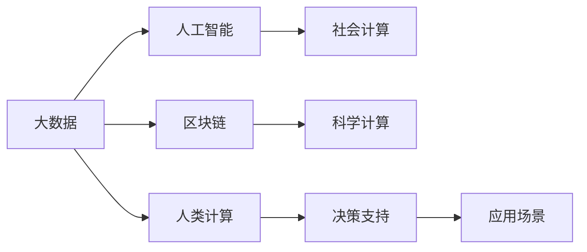

                 

# 应对人类共同挑战：人类计算的使命担当

## 1. 背景介绍

在数字化时代，计算已经成为人类社会进步的驱动力。计算机技术的飞速发展，不仅改变了人们的生活方式，还在全球范围内应对着各种社会、经济、环境等复杂问题。人类计算不再是单纯的数据处理任务，而是成为解决人类共同挑战的利器。

人类计算的核心思想是通过计算能力，挖掘数据背后的知识，帮助人类决策和应对挑战。大数据、人工智能、区块链等新兴技术正在为这一目标赋能。面对全球变暖、疫情冲击、能源危机、社会不平等、公共卫生等重大挑战，人类计算展示了巨大的潜力和价值。

然而，人类计算的实践也面临许多挑战。数据获取、隐私保护、计算资源、算法偏见、可解释性等问题，都在阻碍其普及和应用。本文旨在探讨人类计算的核心概念、关键技术、应用场景及未来发展趋势，为解决人类共同挑战提供新的思路。

## 2. 核心概念与联系

### 2.1 核心概念概述

人类计算是计算技术与社会科学、自然科学等交叉融合的产物。其核心在于通过大规模数据计算，揭示规律、预测未来、辅助决策，以应对人类面临的重大挑战。

- **大数据**：指巨量、多源、多维、动态的数据集合。大数据技术包括数据收集、存储、处理和分析等。
- **人工智能(AI)**：通过机器学习、深度学习等技术，使计算机具备模拟人类智能的能力，用于解决复杂问题。
- **区块链**：分布式账本技术，实现去中心化、安全性、透明性等特性，保障数据隐私和权益。
- **社会计算**：利用社交网络、大数据等手段，研究社会行为、演化和结构，预测社会趋势和行为。
- **科学计算**：在科学研究和工程设计中，使用计算机模拟物理、化学等复杂过程，提升研究效率和精准度。

### 2.2 核心概念原理和架构的 Mermaid 流程图



该图展示了人类计算中各个关键概念之间的联系：

1. **大数据**：提供人类计算所需的数据支撑。
2. **人工智能**：利用大数据挖掘知识，提升计算效率和效果。
3. **区块链**：保障数据隐私和权益，为人类计算提供安全保障。
4. **社会计算**：研究人类行为和社会结构，预测社会趋势。
5. **科学计算**：模拟和预测自然现象，提高科学研究效率。
6. **人类计算**：综合大数据、人工智能等技术，辅助决策和应对挑战。
7. **决策支持**：将人类计算结果应用于实际问题，指导决策。
8. **应用场景**：涵盖社会治理、经济预测、公共卫生等多个领域，具体实现人类计算的目标。

## 3. 核心算法原理 & 具体操作步骤

### 3.1 算法原理概述

人类计算的核心在于利用数据驱动的方法，揭示数据背后的规律，辅助人类做出决策。其算法原理包括但不限于以下几方面：

1. **数据预处理**：清洗、归一化、特征工程等步骤，确保数据质量。
2. **特征提取**：从原始数据中提取有意义的特征，如文本向量化、图像特征提取等。
3. **模型训练**：利用机器学习、深度学习等算法，对数据进行建模和预测。
4. **结果解释**：通过模型可解释性技术，解释计算结果，提供决策依据。
5. **模型优化**：通过交叉验证、超参数调优等方法，提升模型性能。

### 3.2 算法步骤详解

#### 数据预处理

数据预处理是保证数据质量的关键步骤。主要包括以下几方面：

1. **数据清洗**：去除缺失、噪声数据，填补空缺。
2. **数据归一化**：将数据缩放到指定范围，如标准化、归一化等。
3. **特征工程**：提取、选择、组合特征，生成更有意义的输入。

#### 特征提取

特征提取是数据到模型之间的桥梁，影响模型的表现和效率。常用的特征提取方法包括：

1. **文本特征提取**：将文本转换为数值特征，如词袋模型、TF-IDF、word2vec等。
2. **图像特征提取**：提取图像中的关键信息，如SIFT、HOG、CNN等。
3. **时间序列特征提取**：处理时间序列数据，提取趋势、周期、季节等特征。

#### 模型训练

模型训练是利用数据生成模型的过程。常见的机器学习算法包括决策树、随机森林、支持向量机等，深度学习算法包括神经网络、卷积神经网络、循环神经网络等。

#### 结果解释

结果解释是将模型输出转换为人类可理解的信息，以便于决策和应用。常用的方法包括：

1. **可视化**：通过图表、热力图等形式，直观展示计算结果。
2. **可解释性模型**：利用LIME、SHAP等技术，解释模型的预测过程。
3. **自然语言生成**：将模型输出转换为自然语言，如问答系统、文本生成等。

#### 模型优化

模型优化是通过交叉验证、超参数调优等方法，提升模型性能。常用的方法包括网格搜索、随机搜索、贝叶斯优化等。

### 3.3 算法优缺点

#### 优点

1. **高效性**：利用大数据、人工智能技术，大幅提高问题解决的效率。
2. **灵活性**：适应各种复杂问题，涵盖社会、经济、环境等多个领域。
3. **可解释性**：通过结果解释技术，提供透明、可解释的决策依据。
4. **可扩展性**：数据和计算资源的增加，可以提升计算能力和精度。

#### 缺点

1. **数据质量**：数据质量和来源的可靠性直接影响计算结果。
2. **隐私保护**：在数据共享和利用过程中，如何保护隐私是一个重要问题。
3. **计算资源**：大规模计算需要大量的计算资源，成本较高。
4. **模型偏差**：模型可能存在数据偏差，导致预测结果有误。
5. **可解释性不足**：复杂的深度学习模型，难以解释其内部工作机制。

### 3.4 算法应用领域

人类计算在多个领域都有广泛的应用：

1. **环境保护**：利用大数据和人工智能技术，监测环境变化，预测自然灾害。
2. **公共卫生**：通过社会计算和机器学习，分析疫情传播趋势，制定防控策略。
3. **经济预测**：利用大数据和科学计算，预测经济趋势，指导政策制定。
4. **社会治理**：通过社会计算和人工智能，研究社会行为，预测社会趋势。
5. **智慧城市**：利用大数据和人工智能，优化城市管理，提升城市服务水平。

## 4. 数学模型和公式 & 详细讲解 & 举例说明

### 4.1 数学模型构建

人类计算的数学模型构建，通常包括数据预处理、特征提取、模型训练等步骤。下面以文本分类为例，展示核心数学模型。

设训练集为 $D=\{(x_i, y_i)\}_{i=1}^N$，其中 $x_i$ 为文本， $y_i$ 为标签。将文本转换为词向量 $x_i \in \mathbb{R}^d$，标签 $y_i \in \{1,0\}$。

定义损失函数 $\mathcal{L}(w, \theta)$，其中 $w$ 为模型参数， $\theta$ 为训练数据。常见损失函数包括交叉熵损失、均方误差损失等。

### 4.2 公式推导过程

以二分类问题为例，交叉熵损失函数的推导过程如下：

设模型 $M_{\theta}(x)$ 在输入 $x$ 上的输出为 $\hat{y}=M_{\theta}(x)$，表示样本属于正类的概率。真实标签 $y \in \{0,1\}$。则二分类交叉熵损失函数定义为：

$$
\mathcal{L}(\theta) = -\frac{1}{N}\sum_{i=1}^N [y_i\log M_{\theta}(x_i)+(1-y_i)\log(1-M_{\theta}(x_i))]
$$

通过链式法则，损失函数对参数 $\theta_k$ 的梯度为：

$$
\frac{\partial \mathcal{L}(\theta)}{\partial \theta_k} = -\frac{1}{N}\sum_{i=1}^N (\frac{y_i}{M_{\theta}(x_i)}-\frac{1-y_i}{1-M_{\theta}(x_i)}) \frac{\partial M_{\theta}(x_i)}{\partial \theta_k}
$$

其中 $\frac{\partial M_{\theta}(x_i)}{\partial \theta_k}$ 可进一步递归展开，利用自动微分技术完成计算。

### 4.3 案例分析与讲解

假设有一份包含10个样本的文本分类数据集，每个样本包含一个文本和相应的标签。使用线性回归模型对数据进行训练，损失函数为均方误差损失。

首先，将文本转换为词向量，得到训练集 $D=\{(x_i, y_i)\}_{i=1}^N$，其中 $x_i \in \mathbb{R}^d$， $y_i \in \{0,1\}$。

然后，定义损失函数 $\mathcal{L}(w, \theta)$，利用梯度下降算法更新模型参数 $w$，得到最优参数 $w^*$。

通过上述步骤，模型能够在新的文本上进行分类预测，输出结果与真实标签的误差最小化。

## 5. 项目实践：代码实例和详细解释说明

### 5.1 开发环境搭建

在进行人类计算的实践前，需要先搭建好开发环境。以下是Python和TensorFlow的开发环境配置步骤：

1. 安装Anaconda：从官网下载并安装Anaconda，用于创建独立的Python环境。

2. 创建并激活虚拟环境：
```bash
conda create -n human-computing python=3.8 
conda activate human-computing
```

3. 安装TensorFlow：
```bash
pip install tensorflow
```

4. 安装相关库：
```bash
pip install numpy pandas scikit-learn matplotlib tensorboard
```

完成上述步骤后，即可在`human-computing`环境中开始人类计算的实践。

### 5.2 源代码详细实现

以下是使用TensorFlow进行文本分类任务的人类计算代码实现：

```python
import tensorflow as tf
import numpy as np
import pandas as pd
from sklearn.model_selection import train_test_split
from sklearn.preprocessing import StandardScaler

# 读取数据集
df = pd.read_csv('text_classification.csv')

# 数据预处理
texts = df['text'].tolist()
labels = df['label'].tolist()
texts = [text.lower() for text in texts]
texts = [text for text in texts if text != '']
scaler = StandardScaler()
texts = scaler.fit_transform(texts)

# 划分训练集和测试集
train_texts, test_texts, train_labels, test_labels = train_test_split(texts, labels, test_size=0.2, random_state=42)

# 构建模型
model = tf.keras.Sequential([
    tf.keras.layers.Dense(64, activation='relu', input_shape=(len(train_texts[0]),)),
    tf.keras.layers.Dense(1, activation='sigmoid')
])

# 编译模型
model.compile(optimizer='adam', loss='binary_crossentropy', metrics=['accuracy'])

# 训练模型
model.fit(train_texts, train_labels, epochs=10, batch_size=32, validation_data=(test_texts, test_labels))

# 评估模型
test_loss, test_acc = model.evaluate(test_texts, test_labels)
print(f'Test Loss: {test_loss:.4f}, Test Accuracy: {test_acc:.4f}')
```

### 5.3 代码解读与分析

让我们再详细解读一下关键代码的实现细节：

**数据预处理**：
- `texts`：读取文本数据，进行小写化处理。
- `labels`：读取标签数据，转化为列向量。
- `texts`：进行停用词过滤，去除无用字符。
- `scaler`：对文本进行标准化处理。

**模型构建**：
- `tf.keras.Sequential`：使用Sequential模型构建神经网络。
- `Dense`层：第一层全连接层，使用ReLU激活函数。
- `Dense`层：输出层，使用sigmoid激活函数，输出二分类结果。

**模型编译与训练**：
- `model.compile`：编译模型，指定优化器、损失函数和评估指标。
- `model.fit`：训练模型，指定训练集、测试集、批大小和迭代轮数。
- `model.evaluate`：评估模型，返回测试集上的损失和准确率。

**运行结果展示**：
- 打印测试集上的损失和准确率，评估模型效果。

## 6. 实际应用场景

### 6.1 环境保护

人类计算在环境保护领域具有广阔的应用前景。例如，通过大数据和机器学习技术，可以实时监测森林火灾、山体滑坡等自然灾害，预测气候变化趋势，制定环境保护政策。

在具体应用中，可以收集各类环境监测数据，如气象数据、卫星遥感数据、地面监测数据等，使用机器学习算法进行模式识别和预测。例如，使用卷积神经网络(CNN)对遥感图像进行分类，识别出森林火灾区域；使用循环神经网络(RNN)对气象数据进行时间序列分析，预测气候变化趋势。

### 6.2 公共卫生

公共卫生领域是人类计算的重要应用场景之一。通过社会计算和机器学习技术，可以实时监测疫情传播趋势，预测疫情发展，制定防控策略。

在具体应用中，可以收集各类公共卫生数据，如疫情报告、病例轨迹、社交媒体数据等，使用机器学习算法进行分析和预测。例如，使用深度学习模型对疫情报告进行分类，识别出病毒株型别；使用社交网络分析技术，预测疫情传播路径和速度。

### 6.3 经济预测

经济预测是人类计算的重要应用领域之一。通过大数据和科学计算技术，可以预测经济趋势，制定宏观经济政策，指导企业决策。

在具体应用中，可以收集各类经济数据，如GDP增长率、就业率、消费指数等，使用机器学习算法进行分析和预测。例如，使用随机森林对GDP增长率进行预测，评估经济健康度；使用时间序列分析技术，预测通货膨胀率和经济周期。

### 6.4 未来应用展望

随着人类计算技术的不断发展，未来在更多领域将有更广泛的应用：

1. **智慧城市**：通过大数据和人工智能技术，优化城市管理，提升城市服务水平，如智能交通、智能安防、智能医疗等。
2. **金融科技**：利用大数据和机器学习技术，进行风险评估、信用评分、市场预测等，提升金融服务效率和精准度。
3. **农业科技**：通过大数据和科学计算技术，进行精准农业、农业灾害预测、农产品质量检测等，提升农业生产效率和质量。
4. **教育科技**：利用大数据和人工智能技术，进行个性化教育、智能辅导、教育资源优化等，提升教育质量和效率。
5. **健康科技**：通过大数据和机器学习技术，进行疾病预测、医疗资源优化、健康管理等，提升医疗服务质量和覆盖面。

## 7. 工具和资源推荐

### 7.1 学习资源推荐

为了帮助开发者系统掌握人类计算的理论基础和实践技巧，这里推荐一些优质的学习资源：

1. 《Python机器学习》书籍：详细介绍了Python语言在机器学习中的应用，涵盖数据预处理、模型训练、结果解释等。
2. Coursera《机器学习》课程：由斯坦福大学教授Andrew Ng主讲，系统讲解机器学习理论和算法。
3. Udacity《深度学习基础》课程：涵盖深度学习基本概念和算法，适合初学者和进阶者。
4. arXiv.org：人工智能领域的研究论文数据库，提供最新的人类计算研究成果和应用案例。
5. GitHub：开源社区，提供大量人类计算项目和代码实现。

通过对这些资源的学习实践，相信你一定能够快速掌握人类计算的精髓，并用于解决实际的复杂问题。

### 7.2 开发工具推荐

高效的开发离不开优秀的工具支持。以下是几款用于人类计算开发的常用工具：

1. Python：简洁易用，拥有丰富的机器学习库和数据处理工具。
2. TensorFlow：由Google主导开发的深度学习框架，支持分布式计算，适合大规模应用。
3. PyTorch：Facebook开发的深度学习框架，易于使用，适合科研和实验。
4. Scikit-learn：基于Python的机器学习库，涵盖经典算法和实用工具。
5. Jupyter Notebook：交互式编程环境，适合数据探索和模型调试。
6. TensorBoard：TensorFlow配套的可视化工具，实时监测模型训练状态。

合理利用这些工具，可以显著提升人类计算任务的开发效率，加快创新迭代的步伐。

### 7.3 相关论文推荐

人类计算领域的研究成果丰硕，以下是几篇奠基性的相关论文，推荐阅读：

1. 《A Review of Data Mining Techniques in Environmental Modelling》：综述了数据挖掘在环境建模中的应用。
2. 《Predictive Analytics with Data Science: From Theory to Practice》：介绍了预测分析的理论和实践，涵盖了统计学和机器学习技术。
3. 《Blockchain and Decentralized Systems: From Genesis to Scalability》：介绍了区块链技术的起源、发展和应用。
4. 《Social Media and Data Mining: Mining Useful Knowledge from Social Media》：介绍了社交媒体数据分析的基本方法和应用。
5. 《Machine Learning in Healthcare: From Early Adoption to Current Developments》：介绍了机器学习在医疗健康领域的应用。

这些论文代表了人类计算领域的研究进展，通过学习这些前沿成果，可以帮助研究者把握学科前进方向，激发更多的创新灵感。

## 8. 总结：未来发展趋势与挑战

### 8.1 研究成果总结

本文对人类计算的核心概念、关键技术、应用场景及未来发展趋势进行了系统梳理。通过系统介绍，我们了解了大数据、人工智能、区块链等技术在解决人类面临的重大挑战中的作用，以及它们之间的相互联系和协同效应。

### 8.2 未来发展趋势

展望未来，人类计算的发展趋势包括但不限于：

1. **数据量的持续增长**：随着物联网、智能设备等的普及，数据量将持续增长，推动计算模型的复杂度和深度。
2. **计算能力的提升**：随着计算硬件的进步，计算能力将大幅提升，支持更复杂、更高效的模型训练和推理。
3. **多模态数据融合**：将不同模态的数据进行融合，提升模型的泛化能力和鲁棒性，如图像、文本、语音等数据的协同建模。
4. **模型可解释性的增强**：提升模型的可解释性，增强模型的透明度和可信度，以便于人类理解和信任。
5. **伦理和安全性的重视**：加强数据隐私和模型伦理的研究，确保人类计算的应用符合道德和法律规范。

### 8.3 面临的挑战

尽管人类计算已经取得了显著成果，但在其发展过程中仍然面临诸多挑战：

1. **数据隐私和伦理**：如何在保证数据隐私的前提下，进行高效的数据分析和利用，是重要课题。
2. **计算资源不足**：大规模计算需要大量的计算资源，成本较高，如何提升计算效率和降低成本是重要问题。
3. **模型复杂性和可解释性**：复杂的深度学习模型，难以解释其内部工作机制，如何提升模型的可解释性，也是挑战之一。
4. **模型的公平性和鲁棒性**：模型可能存在数据偏差，如何提高模型的公平性和鲁棒性，避免歧视性输出，是重要研究方向。
5. **跨领域协同**：不同领域的计算模型和方法差异较大，如何实现跨领域的协同和融合，是重要问题。

### 8.4 研究展望

未来，人类计算需要在以下几个方面进行深入研究：

1. **跨领域协同**：不同领域的计算模型和方法差异较大，如何实现跨领域的协同和融合，是重要研究方向。
2. **模型的公平性和鲁棒性**：模型可能存在数据偏差，如何提高模型的公平性和鲁棒性，避免歧视性输出，是重要研究方向。
3. **模型的可解释性**：提升模型的可解释性，增强模型的透明度和可信度，以便于人类理解和信任，是重要研究方向。
4. **数据的隐私和安全**：加强数据隐私和模型伦理的研究，确保人类计算的应用符合道德和法律规范，是重要研究方向。
5. **模型的泛化能力**：提升模型的泛化能力和鲁棒性，增强模型在不同场景下的应用效果，是重要研究方向。

人类计算的潜力巨大，但也需要我们不断克服技术上的挑战，推动其在更广泛的领域得到应用。只有勇于创新、敢于突破，才能更好地应对人类面临的重大挑战，为构建更加智慧、安全和可持续的社会做出贡献。

## 9. 附录：常见问题与解答

**Q1：人类计算是否适用于所有领域？**

A: 人类计算在许多领域都有广泛的应用，但也存在一些限制。例如，人类计算需要大量的数据和计算资源，对于一些数据量较小或资源受限的领域，可能不太适用。

**Q2：如何选择合适的机器学习算法？**

A: 选择合适的机器学习算法，需要考虑数据类型、问题性质和计算资源等因素。一般来说，对于分类问题，可以使用决策树、支持向量机、神经网络等算法；对于回归问题，可以使用线性回归、随机森林、梯度提升树等算法。

**Q3：数据预处理需要注意哪些方面？**

A: 数据预处理是保证数据质量的关键步骤，需要注意以下几方面：数据清洗、归一化、特征工程等步骤，确保数据质量。

**Q4：模型的可解释性有哪些方法？**

A: 模型的可解释性是提升人类计算应用可信度的重要手段。常用的方法包括可视化、LIME、SHAP等，这些技术可以将复杂模型转化为可理解的形式，帮助用户理解模型的决策过程。

**Q5：人类计算面临哪些伦理和安全挑战？**

A: 数据隐私和伦理是使用人类计算面临的重要问题。需要在数据采集、处理和利用过程中，充分考虑数据隐私保护和伦理问题，确保应用符合道德和法律规范。

---

作者：禅与计算机程序设计艺术 / Zen and the Art of Computer Programming

