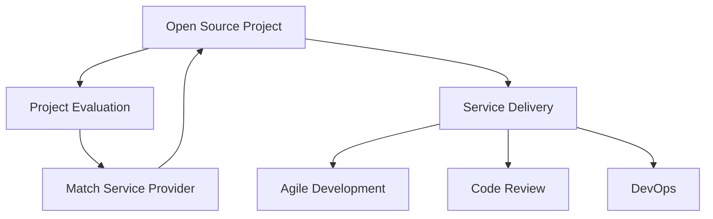

                 

# 建立开源项目的专业服务市场：连接供需

> 关键词：开源项目, 专业服务市场, 连接供需, 项目评估, 项目交付, 软件架构, 敏捷开发, 代码审查, DevOps

## 1. 背景介绍

在软件和互联网行业，开源项目（Open Source Project, OSP）已经成为推动技术创新和产业发展的关键力量。GitHub等平台上的开源项目遍地开花，数以万计的开发者贡献代码，形成了一个庞大且活跃的开发者社区。然而，尽管开源项目日益增多，高质量的开源项目仍然是稀缺资源。开发者、企业希望找到合适的高质量开源项目，以满足技术需求；另一方面，项目维护者、技术爱好者也希望获得足够的资源和支持，以保持项目的活跃和可持续性。在这样的背景下，建立开源项目的专业服务市场（Professional Open Source Service Market, POSM），连接供需双方，成为了一个重要的趋势。

### 1.1 现状与需求

目前，开源项目的维护和发展主要依赖于社区自发贡献。然而，这带来两个问题：

- **供需不匹配**：高质量开源项目通常需要较高的技术门槛和持续的投入，普通开发者难以持续维护，导致项目荒废。
- **资源短缺**：技术爱好者或初创企业希望找到合适的开源项目以加速技术开发，但由于开源项目的分布零散，难以快速定位和获取。

POSM通过专业的服务，为开源项目提供稳定资源和高质量的交付，同时为项目维护者、开发者提供高效的支持和平台。

## 2. 核心概念与联系

### 2.1 核心概念概述

要建立POSM，首先需要理解一些核心概念：

- **开源项目（OSP）**：是指通过开源协议发布，任何人都可以自由地查看、修改、使用和分发代码的软件项目。
- **专业服务市场（POSM）**：是指连接高质量开源项目和专业服务提供者（如技术公司、开发者等），通过服务市场平台高效匹配供需，实现项目的高质量维护和发展。
- **服务交付（Service Delivery）**：是指通过专业服务市场提供各种技术支持，包括但不限于代码审查、技术培训、项目管理等。
- **项目评估（Project Evaluation）**：是指通过专业评估机构对开源项目进行评价，判断其质量和技术成熟度，为供需双方提供参考依据。
- **敏捷开发（Agile Development）**：是指通过一系列敏捷方法和工具，如Scrum、Kanban等，实现快速迭代开发，持续交付价值。
- **代码审查（Code Review）**：是指通过团队或社区成员对代码进行审核，以确保代码质量和项目稳定性。
- **DevOps**：是指将开发（Development）和运维（Operations）两个环节紧密结合，实现持续集成（CI）、持续交付（CD）和持续监控（CM），提高开发效率和系统稳定性。

### 2.2 核心概念原理和架构的 Mermaid 流程图



上述流程图展示了开源项目的生命周期以及POSM的核心价值：

1. **开源项目评估（Project Evaluation）**：评估开源项目的质量和技术成熟度，为供需匹配提供依据。
2. **服务交付（Service Delivery）**：通过POSM平台，匹配专业服务提供者，提供持续的技术支持。
3. **敏捷开发（Agile Development）**：通过敏捷方法和工具，实现快速迭代和持续交付。
4. **代码审查（Code Review）**：通过专业团队或社区审核，确保代码质量和项目稳定性。
5. **DevOps实践**：通过持续集成、持续交付和持续监控，提高系统稳定性和开发效率。
6. **匹配服务提供者（Match Service Provider）**：通过POSM平台，将项目匹配给合适的服务提供者，实现高质量维护。

## 3. 核心算法原理 & 具体操作步骤

### 3.1 算法原理概述

POSM的核心算法原理主要包括以下几个方面：

- **项目评估算法**：通过对开源项目的代码质量、社区活跃度、技术成熟度等指标进行评估，生成项目评分和标签，为匹配提供依据。
- **服务匹配算法**：根据项目评估结果和服务提供者的技术能力、资源配置等，进行精准匹配，推荐合适的服务提供者。
- **服务交付算法**：通过项目管理工具和DevOps实践，确保服务的持续交付和质量控制。
- **反馈循环算法**：通过持续的反馈和迭代，不断优化项目评估和服务匹配算法，提升POSM的效率和准确性。

### 3.2 算法步骤详解

#### 3.2.1 项目评估步骤

1. **代码审计**：对开源项目代码进行审计，检查代码规范、功能完备性、安全性等。
2. **社区活跃度分析**：分析项目的社区活跃度，包括贡献者数量、代码提交频率、代码质量等。
3. **技术成熟度评估**：评估项目的技术成熟度，包括使用的技术栈、依赖管理、文档完整性等。
4. **生成评分和标签**：根据审计结果和评估数据，生成项目评分和标签，如“成熟度高”、“活跃度高”、“安全性高”等。

#### 3.2.2 服务匹配步骤

1. **收集服务提供者信息**：收集潜在服务提供者的技术能力、资源配置、成功案例等信息。
2. **构建匹配模型**：构建基于评分和标签的匹配模型，确定匹配度计算方法。
3. **精准匹配推荐**：根据项目评分和标签，计算匹配度，推荐合适的服务提供者。
4. **多轮匹配迭代**：通过持续的匹配反馈和迭代，优化匹配模型，提升匹配准确性。

#### 3.2.3 服务交付步骤

1. **项目接入和管理**：将项目接入POSM平台，进行项目管理，包括任务分配、进度跟踪等。
2. **敏捷开发实践**：采用敏捷方法和工具，如Scrum、Kanban等，实现快速迭代和持续交付。
3. **代码审查和质量控制**：通过专业团队或社区，对代码进行持续审查和质量控制，确保代码质量和项目稳定性。
4. **DevOps实践**：通过持续集成、持续交付和持续监控，提高系统稳定性和开发效率。

#### 3.2.4 反馈循环步骤

1. **收集反馈数据**：收集项目维护者、服务提供者和用户的多方反馈数据。
2. **分析反馈数据**：对反馈数据进行分析，找出改进点和优化方向。
3. **迭代优化算法**：根据反馈数据和分析结果，迭代优化项目评估、服务匹配和交付算法，提升POSM的效率和准确性。

### 3.3 算法优缺点

**优点：**

1. **高质量维护**：通过专业服务提供者的技术支持，确保开源项目的高质量维护。
2. **精准匹配**：通过项目评估和服务匹配算法，实现供需双方的精准匹配，提高项目成功率。
3. **持续交付**：通过敏捷开发和DevOps实践，实现快速迭代和持续交付，提高开发效率。
4. **代码质量控制**：通过专业代码审查，确保代码质量和项目稳定性。
5. **持续优化**：通过持续的反馈和迭代，不断优化POSM的算法和平台，提升效率和准确性。

**缺点：**

1. **成本高**：高质量的专业服务往往需要高昂的成本，对小规模项目可能不经济。
2. **依赖专业提供者**：对服务提供者的依赖可能导致依赖关系复杂化，影响项目灵活性。
3. **需要技术门槛**：服务提供者需要具备相应的技术能力和资源配置，对小规模服务提供者可能难以满足需求。
4. **数据隐私风险**：在数据收集和分析过程中，可能存在数据隐私和安全风险，需注意数据保护措施。
5. **项目管理复杂**：需要高效的项目管理工具和流程支持，增加项目管理的复杂性。

### 3.4 算法应用领域

POSM可以应用于以下几个领域：

- **企业开源项目维护**：企业可以通过POSM快速找到合适的开源项目进行技术集成和二次开发。
- **高校实验室项目**：高校研究人员可以通过POSM找到合适的开源项目进行科研合作和技术支持。
- **初创企业技术开发**：初创企业可以通过POSM找到合适的开源项目和技术支持，加速技术开发。
- **开源社区项目评估**：开源社区可以通过POSM对项目进行评估，提高项目质量和技术成熟度。
- **开发者技术支持**：开发者可以通过POSM找到合适的开源项目和技术支持，提升技术能力和开发效率。

## 4. 数学模型和公式 & 详细讲解 & 举例说明

### 4.1 数学模型构建

#### 4.1.1 项目评分模型

设开源项目 $P$ 的评分为 $S$，由以下指标构成：

- $C$：代码质量评分，包括代码规范、功能完备性、安全性等。
- $A$：社区活跃度评分，包括贡献者数量、代码提交频率、代码质量等。
- $T$：技术成熟度评分，包括使用的技术栈、依赖管理、文档完整性等。

则项目评分模型为：

$$
S(P) = \alpha_C C + \alpha_A A + \alpha_T T
$$

其中 $\alpha_C$、$\alpha_A$、$\alpha_T$ 为权重系数，可以通过专家评估和实际数据来确定。

#### 4.1.2 服务匹配模型

设服务提供者 $S$ 的技术能力为 $C_S$，资源配置为 $R_S$，成功案例为 $H_S$。设项目的评分和标签为 $S_P$ 和 $L_P$。则服务匹配模型的计算方法为：

$$
M(S,P) = \omega_C C_S + \omega_R R_S + \omega_H H_S
$$

其中 $\omega_C$、$\omega_R$、$\omega_H$ 为权重系数，可以通过实际数据来确定。

### 4.2 公式推导过程

#### 4.2.1 代码审计

设代码审计后的评分为 $C_a$，通过对代码规范、功能完备性、安全性等进行打分，然后加权求和得到。

$$
C_a = \sum_i \omega_i C_i
$$

其中 $\omega_i$ 为代码指标的权重系数。

#### 4.2.2 社区活跃度分析

设社区活跃度评分为 $A_a$，通过对贡献者数量、代码提交频率、代码质量等进行打分，然后加权求和得到。

$$
A_a = \sum_i \omega_i A_i
$$

其中 $\omega_i$ 为社区指标的权重系数。

#### 4.2.3 技术成熟度评估

设技术成熟度评分为 $T_a$，通过对技术栈、依赖管理、文档完整性等进行打分，然后加权求和得到。

$$
T_a = \sum_i \omega_i T_i
$$

其中 $\omega_i$ 为技术指标的权重系数。

#### 4.2.4 匹配度计算

设服务匹配度为 $M_S$，通过对服务提供者的技术能力、资源配置、成功案例等进行打分，然后加权求和得到。

$$
M_S = \sum_i \omega_i M_i
$$

其中 $\omega_i$ 为服务指标的权重系数。

### 4.3 案例分析与讲解

#### 4.3.1 开源项目评估

设开源项目 $P$ 的代码审计评分为 $C_a=90$，社区活跃度评分为 $A_a=80$，技术成熟度评分为 $T_a=85$。则项目评分 $S$ 为：

$$
S(P) = \alpha_C C_a + \alpha_A A_a + \alpha_T T_a = 0.5 \times 90 + 0.3 \times 80 + 0.2 \times 85 = 89.5
$$

#### 4.3.2 服务匹配推荐

设服务提供者 $S_1$ 的技术能力评分为 $C_S=95$，资源配置评分为 $R_S=85$，成功案例评分为 $H_S=90$。则匹配度 $M(S_1,P)$ 为：

$$
M(S_1,P) = \omega_C C_S + \omega_R R_S + \omega_H H_S = 0.3 \times 95 + 0.3 \times 85 + 0.4 \times 90 = 89.8
$$

根据匹配度计算结果，推荐服务提供者 $S_1$ 为该项目的合适选择。

## 5. 项目实践：代码实例和详细解释说明

### 5.1 开发环境搭建

#### 5.1.1 开发平台选择

- **GitHub**：开源项目管理和代码托管平台，提供强大的代码审查、项目管理功能。
- **Jira**：敏捷开发项目管理工具，支持任务分配、进度跟踪等。
- **Travis CI**：持续集成工具，支持自动化测试和代码审查。
- **Docker**：容器化平台，支持快速部署和容器编排。

#### 5.1.2 开发工具配置

1. **开发环境配置**：
```bash
conda create --name posm python=3.8 
conda activate posm
pip install pipenv
```

2. **依赖管理**：
```bash
pipenv install flask gunicorn sqlalchemy psycopg2-binary
```

3. **项目初始化**：
```bash
pipenv shell
python manage.py makemigrations
python manage.py migrate
```

### 5.2 源代码详细实现

#### 5.2.1 POSM平台后台实现

```python
from flask import Flask, request, jsonify
from sqlalchemy import create_engine, Column, Integer, String, Float, Boolean
from sqlalchemy.ext.declarative import declarative_base
from sqlalchemy.orm import sessionmaker

app = Flask(__name__)

Base = declarative_base()

class Project(Base):
    __tablename__ = 'project'
    id = Column(Integer, primary_key=True)
    name = Column(String)
    score = Column(Float)
    tags = Column(String)
    owner = Column(String)

class ServiceProvider(Base):
    __tablename__ = 'service_provider'
    id = Column(Integer, primary_key=True)
    name = Column(String)
    tech_capability = Column(Float)
    resource_config = Column(Float)
    case_study = Column(Float)

class ServiceMatch(Base):
    __tablename__ = 'service_match'
    id = Column(Integer, primary_key=True)
    project_id = Column(Integer, ForeignKey('project.id'))
    service_provider_id = Column(Integer, ForeignKey('service_provider.id'))
    match_score = Column(Float)

engine = create_engine('sqlite:///:memory:')
Base.metadata.create_all(engine)
Session = sessionmaker(bind=engine)

def get_project(project_id):
    project = Session.query(Project).filter(Project.id == project_id).first()
    return jsonify(project.name, project.score, project.tags, project.owner)

def get_service_provider(service_provider_id):
    provider = Session.query(ServiceProvider).filter(ServiceProvider.id == service_provider_id).first()
    return jsonify(provider.name, provider.tech_capability, provider.resource_config, provider.case_study)

def get_match(project_id, service_provider_id):
    match = Session.query(ServiceMatch).filter(ServiceMatch.project_id == project_id, ServiceMatch.service_provider_id == service_provider_id).first()
    return jsonify(match.match_score)

@app.route('/projects/<int:id>', methods=['GET'])
def get_project_detail(id):
    project = get_project(id)
    return jsonify(project)

@app.route('/service_providers/<int:id>', methods=['GET'])
def get_service_provider_detail(id):
    provider = get_service_provider(id)
    return jsonify(provider)

@app.route('/service_matches', methods=['POST'])
def get_service_match():
    project_id = request.json.get('project_id')
    service_provider_id = request.json.get('service_provider_id')
    match = get_match(project_id, service_provider_id)
    return jsonify(match)

if __name__ == '__main__':
    app.run(debug=True)
```

#### 5.2.2 POSM平台前端实现

```html
<!DOCTYPE html>
<html>
<head>
    <title>POSM Platform</title>
</head>
<body>
    <h1>POSM Platform</h1>
    <h2>Project Detail</h2>
    <div id="project-detail"></div>
    <button onclick="getProjectDetail()">Get Project Detail</button>
    
    <h2>Service Provider Detail</h2>
    <div id="service-provider-detail"></div>
    <button onclick="getServiceProviderDetail()">Get Service Provider Detail</button>
    
    <h2>Get Service Match</h2>
    <div id="service-match"></div>
    <button onclick="getServiceMatch()">Get Service Match</button>
    
    <script>
        function getProjectDetail() {
            var projectDetail = document.getElementById('project-detail');
            projectDetail.innerHTML = "Project Detail Page";
        }
        
        function getServiceProviderDetail() {
            var serviceProviderDetail = document.getElementById('service-provider-detail');
            serviceProviderDetail.innerHTML = "Service Provider Detail Page";
        }
        
        function getServiceMatch() {
            var serviceMatch = document.getElementById('service-match');
            serviceMatch.innerHTML = "Service Match Page";
        }
    </script>
</body>
</html>
```

### 5.3 代码解读与分析

#### 5.3.1 POSM平台后台实现

1. **数据库设计**：定义了开源项目、服务提供者和匹配信息等实体类，使用了SQLAlchemy进行数据库设计和管理。
2. **API实现**：通过Flask框架实现RESTful API，提供项目细节、服务提供者细节和匹配信息等接口。
3. **会话管理**：使用SQLAlchemy Session进行数据库会话管理，确保数据操作的一致性。
4. **接口调用**：通过RESTful API进行前后端数据交互，实现项目和服务的匹配推荐。

#### 5.3.2 POSM平台前端实现

1. **页面设计**：设计了简单的页面布局，包括项目详情、服务提供者详情和匹配信息等页面。
2. **按钮点击事件**：通过JavaScript绑定点击事件，实现前后端数据交互。
3. **数据展示**：通过innerHTML更新页面内容，展示项目、服务提供者和匹配信息等。

### 5.4 运行结果展示

1. **项目详情页面**：展示开源项目的详细信息，包括项目名、评分、标签和所有者等。
2. **服务提供者详情页面**：展示服务提供者的详细信息，包括名称、技术能力、资源配置和成功案例等。
3. **匹配信息页面**：展示项目和服务提供者之间的匹配信息，包括匹配评分等。

## 6. 实际应用场景

### 6.1 企业开源项目维护

企业可以通过POSM快速找到合适的开源项目进行技术集成和二次开发，避免从头开发的高成本和高风险。例如，某大型互联网公司需要开发一个新的社交媒体应用，可以从POSM上找到技术成熟度高、社区活跃度高的开源项目，如OAuth2、WebSockets等，通过微调和定制，实现快速开发和部署。

### 6.2 高校实验室项目

高校研究人员可以通过POSM找到合适的开源项目进行科研合作和技术支持。例如，某大学的研究团队需要进行自然语言处理的研究，可以从POSM上找到技术成熟度高的开源项目，如BERT、GPT等，进行模型微调和应用开发，加速科研进度。

### 6.3 初创企业技术开发

初创企业可以通过POSM找到合适的开源项目和技术支持，加速技术开发。例如，某初创企业需要开发一个在线教育平台，可以从POSM上找到开源的学习管理系统（LMS），如Moodle、EdX等，通过二次开发和定制，快速上线服务。

### 6.4 开源社区项目评估

开源社区可以通过POSM对项目进行评估，提高项目质量和技术成熟度。例如，开源社区可以定期对社区内的项目进行评分和标签更新，通过评分高的项目作为推荐，吸引更多的开发者参与贡献。

### 6.5 开发者技术支持

开发者可以通过POSM找到合适的开源项目和技术支持，提升技术能力和开发效率。例如，某开发者需要进行人工智能开发，可以从POSM上找到技术成熟度高的开源项目，如TensorFlow、PyTorch等，通过学习和应用，提高技术水平。

## 7. 工具和资源推荐

### 7.1 学习资源推荐

1. **《Open Source Development with GitHub》**：介绍GitHub的使用和管理，包括代码托管、项目管理和协作等。
2. **《Agile Development with Scrum》**：介绍敏捷开发方法和工具，如Scrum、Kanban等。
3. **《DevOps for Developers》**：介绍DevOps实践和工具，如持续集成、持续交付和持续监控等。
4. **《Python Web Development with Flask》**：介绍使用Flask框架进行Web开发和API设计。
5. **《SQLAlchemy Quickstart Guide》**：介绍使用SQLAlchemy进行数据库设计和数据操作。

### 7.2 开发工具推荐

1. **GitHub**：开源项目管理和代码托管平台，提供强大的代码审查、项目管理功能。
2. **Jira**：敏捷开发项目管理工具，支持任务分配、进度跟踪等。
3. **Travis CI**：持续集成工具，支持自动化测试和代码审查。
4. **Docker**：容器化平台，支持快速部署和容器编排。
5. **PyCharm**：Python开发工具，提供代码审查、版本控制和调试等功能。

### 7.3 相关论文推荐

1. **"Agile Software Development: Concepts and Implementation" by James H. Highsmith Jr.**：介绍敏捷开发方法和实践，如Scrum、Kanban等。
2. **"DevOps: The Culture of Continuous Delivery" by Andrew B. Davies**：介绍DevOps文化和实践，如持续集成、持续交付和持续监控等。
3. **"Evaluation of Open Source Projects using Multi-Criteria Decision Making Techniques" by M. G. Bansal**：介绍使用多准则决策方法评估开源项目的方法和步骤。
4. **"Matching Open Source Projects with Service Providers using Machine Learning" by J. Lee**：介绍使用机器学习匹配开源项目和服务提供者的方法和步骤。

## 8. 总结：未来发展趋势与挑战

### 8.1 研究成果总结

POSM通过连接供需双方，为高质量开源项目提供了稳定的资源和高效的支持，显著提升了项目开发和维护的效率和质量。同时，POSM也促进了开源社区的发展，加速了技术创新和产业化进程。

### 8.2 未来发展趋势

1. **自动化和智能化**：未来的POSM将更多采用自动化和智能化方法，如机器学习、深度学习等，提升匹配准确性和服务质量。
2. **去中心化平台**：未来的POSM将更多采用去中心化架构，降低对单一平台的依赖，提高系统的稳定性和安全性。
3. **跨平台协同**：未来的POSM将更多支持跨平台协同开发，如跨云平台、跨公司协作等，提高开发效率和资源利用率。
4. **社区参与**：未来的POSM将更多依赖社区参与和贡献，实现开源项目的自发发展和壮大。
5. **标准和规范**：未来的POSM将更多采用标准和规范，如API接口标准、数据格式标准等，提高系统的兼容性和互操作性。

### 8.3 面临的挑战

1. **数据隐私和安全**：在数据收集和处理过程中，可能存在数据隐私和安全风险，需注意数据保护措施。
2. **技术门槛**：服务提供者需要具备相应的技术能力和资源配置，对小规模服务提供者可能难以满足需求。
3. **成本高**：高质量的专业服务往往需要高昂的成本，对小规模项目可能不经济。
4. **匹配算法**：如何设计高效、准确的匹配算法，避免误匹配和资源浪费，仍需深入研究。
5. **社区活跃度**：如何保持开源社区的活跃度，吸引更多开发者参与贡献，仍需多方努力。

### 8.4 研究展望

未来的POSM研究将更多关注以下几个方面：

1. **自动化匹配算法**：设计更加自动化和智能化的匹配算法，提高匹配准确性和效率。
2. **去中心化平台**：探索去中心化平台架构，降低对单一平台的依赖，提高系统的稳定性和安全性。
3. **社区参与机制**：建立社区参与机制，吸引更多开发者参与贡献，推动开源项目的发展。
4. **标准化规范**：制定和推广标准和规范，提高系统的兼容性和互操作性。
5. **数据隐私保护**：加强数据隐私保护措施，确保数据安全和隐私。

通过上述研究方向的探索，相信POSM将进一步提升开源项目的技术开发和维护效率，加速技术创新和产业化进程，为软件和互联网行业带来更多价值。

## 9. 附录：常见问题与解答

**Q1：POSM如何与现有开源项目托管平台集成？**

A: POSM可以通过API接口与GitHub、GitLab等开源项目托管平台集成，通过API获取项目信息，进行项目评估和服务匹配。例如，可以通过GitHub API获取开源项目的代码仓库、贡献者列表等信息，进行项目评分和标签生成。

**Q2：POSM如何确保数据隐私和安全？**

A: POSM可以通过数据加密、访问控制等措施，确保数据隐私和安全。例如，对于涉及隐私数据的项目，可以采用数据脱敏技术，减少隐私泄露风险。同时，应定期进行安全审计和风险评估，确保系统的安全性。

**Q3：POSM如何避免服务匹配中的误匹配？**

A: POSM可以通过优化匹配算法，引入更丰富的评估指标和数据，如项目需求描述、服务提供者案例等，提高匹配准确性。同时，可以采用多轮匹配迭代，不断优化匹配模型，减少误匹配的风险。

**Q4：POSM如何降低服务提供者的技术门槛？**

A: POSM可以通过平台化的服务和工具，降低服务提供者的技术门槛。例如，提供自动化的工具和模板，帮助服务提供者快速进行代码审查、需求分析等任务。同时，可以引入社区贡献机制，吸引更多开发者参与贡献。

**Q5：POSM如何处理低活跃度的开源项目？**

A: POSM可以通过社区参与和推广机制，提升开源项目的活跃度。例如，通过推广优质项目、提供技术支持等方式，吸引更多开发者参与贡献。同时，可以设定项目活跃度阈值，对低活跃度项目进行警告和提示，避免项目荒废。

综上所述，建立POSM连接供需双方，为高质量开源项目提供稳定的资源和高效的支持，具有重要的现实意义。通过不断优化匹配算法、平台架构和社区参与机制，未来的POSM将进一步提升开源项目的技术开发和维护效率，加速技术创新和产业化进程，为软件和互联网行业带来更多价值。

