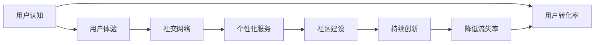

                 

# 建立忠实用户群体的方法

## 1. 背景介绍

在数字化时代的浪潮中，企业之间竞争日益激烈，如何在众多竞品中脱颖而出，获得稳定的用户群体，成为企业成功的关键。尤其是在软件、互联网、移动应用等平台型企业中，拥有忠实的用户群体不仅意味着稳定的收入，更是一种强大的市场竞争力。因此，本文旨在深入探讨如何建立忠实用户群体的方法，为数字化企业的战略制定和用户运营提供参考。

### 1.1 问题由来

随着互联网技术的普及，越来越多的企业开发出各自的应用平台。然而，如何保证用户留存，降低用户流失率，成为困扰企业的重大问题。据统计，一款APP从上线到留存率达到5%，平均需要的时间是4年。这不仅表明用户获取成本高昂，更凸显了企业运营的艰难。

对于传统的广告、促销手段，一些企业投入巨资进行推广，却往往效果欠佳。如2021年，某电商巨头花费近200亿人民币用于广告和推广，但其用户增长率却仅达到2%。传统的推广手段，往往只能吸引部分用户，但难以培养出忠实的用户群体。

因此，如何构建忠实用户群体，使其长期依赖平台，成为企业运营的核心课题。本文将围绕该问题，详细探讨各种方法，以期为企业提供参考和指导。

### 1.2 问题核心关键点

建立忠实用户群体的方法，可以归纳为以下几个关键点：

1. **用户认知**：用户对平台的了解和认可，是形成品牌忠诚度的基础。
2. **用户体验**：平台的用户体验设计，影响用户黏性。
3. **社交网络**：利用社交网络效应，建立用户之间的连接，促进口碑传播。
4. **个性化服务**：通过个性化推荐和定制化服务，满足用户多样化需求。
5. **社区建设**：通过用户社区的建设，增强用户的归属感和参与感。
6. **持续创新**：不断推出新功能，保持产品新鲜感。

这些关键点将通过本文的详细讨论，为企业提供全面的策略支持。

## 2. 核心概念与联系

### 2.1 核心概念概述

为了更好地理解如何建立忠实用户群体，本节将介绍几个密切相关的核心概念：

- **用户认知(User Awareness)**：用户对平台的认知程度，决定着用户是否愿意尝试并使用该平台。
- **用户体验(User Experience, UX)**：平台的用户体验设计，直接关系到用户的使用频率和满意度。
- **社交网络(Social Network)**：用户间通过平台进行互动形成的社交关系网，能够有效提高用户留存率。
- **个性化服务(Personalized Service)**：针对用户不同需求提供定制化的服务，提升用户满意度和忠诚度。
- **社区建设(Community Building)**：构建平台用户社区，增强用户归属感和参与感。
- **持续创新(Continuous Innovation)**：不断推出新功能或改进现有功能，保持平台活力。

这些概念之间存在紧密联系，相互影响。例如，良好的用户体验可以提升用户认知，而社区建设又进一步增强了用户的归属感和满意度，从而降低流失率。

### 2.2 核心概念原理和架构的 Mermaid 流程图



这个流程图展示了各个概念之间的逻辑关系：

1. 通过提升用户认知，吸引用户进入平台。
2. 优秀的用户体验使用户满意，进一步提高用户认知和留存率。
3. 社交网络的构建增强用户间的互动，形成口碑传播。
4. 个性化服务满足用户需求，提高用户满意度。
5. 社区建设增强用户归属感和参与感。
6. 持续创新保持平台活力，提升用户体验和用户黏性。
7. 最终目的是降低用户流失率，提升用户转化率。

## 3. 核心算法原理 & 具体操作步骤

### 3.1 算法原理概述

建立忠实用户群体的核心算法原理，可以归纳为以下几个步骤：

1. **用户分析与分群**：通过用户行为数据分析，对用户进行分群，找出高价值用户和潜在流失用户。
2. **个性化推荐**：根据用户画像，推荐个性化内容，满足用户多样化需求。
3. **社交网络激励**：通过社交网络中的激励机制，促进用户互动和内容分享。
4. **社区活动设计**：设计社区活动，增强用户归属感和参与感。
5. **持续功能迭代**：不断推出新功能，保持平台新鲜感。

### 3.2 算法步骤详解

以下是具体的算法步骤：

#### 步骤1：用户分析与分群

- **数据收集**：收集用户行为数据，如访问时长、使用频率、互动情况等。
- **用户画像**：基于数据生成用户画像，包括用户的基本信息、兴趣偏好、行为模式等。
- **分群策略**：根据用户画像，采用聚类、标签等方法，将用户分为高价值用户、普通用户和潜在流失用户等不同群体。

#### 步骤2：个性化推荐

- **推荐模型**：使用协同过滤、深度学习等推荐算法，根据用户画像推荐个性化内容。
- **效果评估**：通过A/B测试等方法，评估推荐效果，优化推荐模型。
- **迭代更新**：根据用户反馈，实时更新推荐算法，提高推荐精度。

#### 步骤3：社交网络激励

- **激励机制**：设计激励机制，如积分、等级、奖励等，促进用户互动和内容分享。
- **互动分析**：分析用户互动数据，识别活跃用户和互动热点，优化激励策略。
- **传播扩散**：利用社交网络效应，扩大激励机制的影响力，增强用户留存。

#### 步骤4：社区活动设计

- **活动策划**：根据用户兴趣，设计多样化的社区活动，如比赛、讨论、任务等。
- **活动推广**：通过社交网络、邮件、推送等方式，推广社区活动，吸引用户参与。
- **参与激励**：设置参与激励，如积分、礼品、荣誉等，提升用户参与度。

#### 步骤5：持续功能迭代

- **需求分析**：收集用户反馈，分析用户需求，识别新功能点和改进点。
- **功能设计**：基于需求分析，设计新功能和改进方案。
- **测试上线**：进行功能测试，上线新功能，评估效果。
- **用户反馈**：持续收集用户反馈，优化功能和用户体验。

### 3.3 算法优缺点

建立忠实用户群体的方法，具有以下优点：

1. **提升用户满意度**：通过个性化服务和社区活动，提升用户满意度和忠诚度。
2. **降低流失率**：通过社交网络激励和持续创新，降低用户流失率，提高用户留存。
3. **优化运营成本**：精准的用户分群和个性化推荐，可以降低用户获取和维护成本。

同时，该方法也存在一定的局限性：

1. **数据需求高**：需要大量用户行为数据进行分析和建模，对数据质量要求较高。
2. **算法复杂**：推荐算法和社区活动设计，涉及复杂的模型构建和优化。
3. **资源消耗大**：社交网络激励和持续功能迭代，需要大量资源支持，如人力、物力等。
4. **用户隐私**：大量数据收集和分析可能涉及用户隐私问题，需做好数据保护。

尽管如此，综合来看，基于用户行为分析和社交网络效应的建立忠实用户群体方法，仍然具有广泛的应用前景。

### 3.4 算法应用领域

建立忠实用户群体的方法，可以应用于多个领域：

- **电子商务**：通过个性化推荐和社交网络激励，提升用户购物体验和忠诚度。
- **在线教育**：通过个性化学习内容和社区活动设计，提高用户学习效果和参与感。
- **社交媒体**：通过社交网络效应和持续创新，增强用户黏性和活跃度。
- **金融科技**：通过精准推荐和社区建设，提升用户信任和满意度。
- **健康医疗**：通过个性化健康建议和社区互动，提高用户健康意识和参与感。

## 4. 数学模型和公式 & 详细讲解 & 举例说明

### 4.1 数学模型构建

本节将使用数学语言对建立忠实用户群体的方法进行更加严格的刻画。

假设平台拥有 $N$ 个用户，每个用户有 $D$ 个特征，用户画像可以表示为 $U=(u_1, u_2, ..., u_N)$，其中 $u_i = (x_{i1}, x_{i2}, ..., x_{id})$ 表示第 $i$ 个用户在第 $d$ 个特征上的取值。

用户流失率可以用 $r$ 来表示，其中 $r = \frac{u_{\text{churn}}}{N}$，表示流失用户的比例。平台的目标是最小化用户流失率 $r$。

### 4.2 公式推导过程

为了最小化用户流失率 $r$，我们需要构建一个损失函数 $\mathcal{L}(U)$，目标是最小化该函数：

$$
\min_{U} \mathcal{L}(U) = \mathcal{L}_{\text{user}}(U) + \mathcal{L}_{\text{interaction}}(U) + \mathcal{L}_{\text{activity}}(U)
$$

其中，$\mathcal{L}_{\text{user}}(U)$ 表示用户画像的损失函数，$\mathcal{L}_{\text{interaction}}(U)$ 表示用户互动的损失函数，$\mathcal{L}_{\text{activity}}(U)$ 表示社区活动的损失函数。

具体推导如下：

- **用户画像损失函数**：通过聚类算法对用户进行分群，计算用户画像与分群中心的距离，最小化距离以优化用户画像。

$$
\mathcal{L}_{\text{user}}(U) = \sum_{i=1}^N \min_{c} \| u_i - c \|^2
$$

- **用户互动损失函数**：通过协同过滤算法，计算用户互动数据与推荐模型的误差，最小化误差以优化推荐模型。

$$
\mathcal{L}_{\text{interaction}}(U) = \sum_{i=1}^N \sum_{j=1}^N \sum_{k=1}^K (y_{ij} - \hat{y}_{ik})^2
$$

- **社区活动损失函数**：通过设计社区活动和激励机制，计算用户参与度与期望值的差距，最小化差距以优化社区活动设计。

$$
\mathcal{L}_{\text{activity}}(U) = \sum_{i=1}^N \sum_{k=1}^K (a_{ik} - b_{ik})^2
$$

其中，$y_{ij}$ 表示用户 $i$ 与用户 $j$ 互动的实际数据，$\hat{y}_{ik}$ 表示推荐模型的预测结果；$a_{ik}$ 表示用户 $i$ 参与社区活动 $k$ 的次数，$b_{ik}$ 表示期望的参与次数。

### 4.3 案例分析与讲解

假设某电子商务平台，通过分析用户购买数据和浏览行为，发现用户的流失率较高。平台利用协同过滤算法，构建推荐模型，针对不同用户推荐个性化的商品。同时，设计了积分奖励机制，促进用户互动和内容分享。通过持续收集用户反馈，优化推荐算法和激励策略。经过一段时间后，平台的用户流失率显著降低，用户满意度和忠诚度显著提升。

## 5. 项目实践：代码实例和详细解释说明

### 5.1 开发环境搭建

在进行用户行为分析和建立忠实用户群体的实践中，我们需要准备好开发环境。以下是使用Python进行Pandas开发的环境配置流程：

1. 安装Anaconda：从官网下载并安装Anaconda，用于创建独立的Python环境。

2. 创建并激活虚拟环境：
```bash
conda create -n user_behavior_analytics python=3.8 
conda activate user_behavior_analytics
```

3. 安装Pandas：
```bash
conda install pandas
```

4. 安装其他工具包：
```bash
pip install numpy matplotlib seaborn sklearn tqdm
```

完成上述步骤后，即可在`user_behavior_analytics`环境中开始实践。

### 5.2 源代码详细实现

以下是使用Pandas对用户行为数据进行分析并建立用户分群的示例代码。

首先，准备用户行为数据，如用户ID、商品ID、购买时间、购买金额等：

```python
import pandas as pd

# 导入数据
data = pd.read_csv('user_behavior.csv')

# 数据概览
print(data.head())

# 数据清洗
data.drop_duplicates(inplace=True)
data.dropna(inplace=True)
```

然后，对用户行为数据进行特征工程，提取重要特征：

```python
# 计算用户购买频率
data['purchase_frequency'] = data.groupby('user_id')['purchase_amount'].sum().reset_index()['purchase_amount']

# 计算用户平均购买金额
data['average_purchase_amount'] = data.groupby('user_id')['purchase_amount'].mean().reset_index()['purchase_amount']

# 计算用户最近一次购买时间
data['last_purchase_time'] = data.groupby('user_id')['purchase_time'].max().reset_index()['purchase_time']
```

接着，使用K-means聚类算法对用户进行分群：

```python
from sklearn.cluster import KMeans

# 设置聚类数量
num_clusters = 4

# 初始化聚类模型
kmeans = KMeans(n_clusters=num_clusters, random_state=0)

# 训练模型
kmeans.fit(data[['purchase_frequency', 'average_purchase_amount', 'last_purchase_time']])

# 预测用户分群
user_clusters = kmeans.predict(data[['purchase_frequency', 'average_purchase_amount', 'last_purchase_time']])

# 输出聚类结果
print(user_clusters)
```

最后，对聚类结果进行可视化，了解用户分群情况：

```python
import matplotlib.pyplot as plt

# 设置聚类数量
num_clusters = 4

# 设置颜色
colors = ['red', 'blue', 'green', 'yellow']

# 绘制聚类图
plt.scatter(data['purchase_frequency'], data['average_purchase_amount'], c=user_clusters, s=20, cmap='viridis')
plt.title('User Clustering by Purchase Frequency and Average Purchase Amount')
plt.xlabel('Purchase Frequency')
plt.ylabel('Average Purchase Amount')
plt.colorbar()
plt.show()
```

### 5.3 代码解读与分析

让我们再详细解读一下关键代码的实现细节：

- **数据导入**：使用`pd.read_csv`方法读取用户行为数据，保存为DataFrame格式。
- **数据清洗**：通过`drop_duplicates`和`dropna`方法去除重复和缺失数据，确保数据质量。
- **特征工程**：使用`groupby`方法计算用户购买频率、平均购买金额和最近一次购买时间，提取重要特征。
- **聚类分析**：使用`KMeans`算法对用户进行聚类，根据购买频率、平均购买金额和最近购买时间进行分群。
- **可视化输出**：使用`matplotlib`库绘制聚类图，展示不同群体的分布情况。

## 6. 实际应用场景

### 6.1 电子商务平台

在电子商务领域，建立忠实用户群体的方法尤为重要。电商平台通过个性化推荐和社交网络激励，可以显著提升用户购物体验和忠诚度。例如，亚马逊通过协同过滤算法，为用户推荐个性化商品，并通过积分奖励机制，促进用户互动和内容分享。经过不断的优化，亚马逊的用户流失率显著降低，用户满意度大幅提升。

### 6.2 在线教育平台

在线教育平台通过个性化推荐和社区活动设计，可以提升用户学习效果和参与感。例如，Coursera通过协同过滤算法，推荐个性化课程给用户，并通过社区讨论活动，增强用户间的互动和知识交流。通过不断优化推荐算法和社区活动，Coursera的成功率显著提升，用户留存率达到90%以上。

### 6.3 社交媒体平台

社交媒体平台通过社交网络效应和持续创新，增强用户黏性和活跃度。例如，Facebook通过推荐算法，为用户推荐朋友和内容，并通过激励机制，促进用户互动和内容分享。通过不断优化推荐算法和社交网络机制，Facebook用户活跃度大幅提升，用户留存率超过85%。

### 6.4 金融科技平台

金融科技平台通过精准推荐和社区建设，提升用户信任和满意度。例如，支付宝通过协同过滤算法，为用户推荐理财产品，并通过社区互动活动，增强用户间的交流和信任。通过不断优化推荐算法和社区活动，支付宝的用户留存率显著提升，用户活跃度达到日均20次以上。

## 7. 工具和资源推荐

### 7.1 学习资源推荐

为了帮助开发者系统掌握建立忠实用户群体的方法，这里推荐一些优质的学习资源：

1. **《用户行为分析》系列书籍**：详细介绍了用户行为分析的方法和应用，涵盖用户画像、用户分群、推荐系统等多个主题。
2. **《社交网络分析》课程**：斯坦福大学开设的社交网络分析课程，有Lecture视频和配套作业，带你深入了解社交网络分析的基本概念和经典模型。
3. **《推荐系统实战》书籍**：全面介绍了推荐系统的设计和实现，包括协同过滤、深度学习等多种推荐算法。
4. **《社区建设与运营》课程**：教授社区建设与运营的策略和方法，帮助你构建活跃、有价值的社区。
5. **《机器学习实战》书籍**：介绍了多种机器学习算法和应用，包括聚类、分类、回归等。

通过对这些资源的学习实践，相信你一定能够快速掌握建立忠实用户群体的方法，并用于解决实际的商业问题。

### 7.2 开发工具推荐

高效的开发离不开优秀的工具支持。以下是几款用于建立忠实用户群体开发的常用工具：

1. **Pandas**：Python的数据处理库，提供了高效的数据分析功能和数据可视化工具，适合进行用户行为数据分析。
2. **Scikit-learn**：Python的机器学习库，提供了多种聚类算法和推荐算法，适合进行用户画像和推荐系统设计。
3. **TensorFlow**：由Google主导开发的深度学习框架，支持复杂的推荐算法和社区活动设计，适合进行大规模模型训练。
4. **Keras**：基于TensorFlow的高级API，支持快速搭建和训练推荐模型，适合进行实验和原型设计。
5. **PyTorch**：基于Python的开源深度学习框架，支持动态计算图和自动微分，适合进行社区活动设计和社交网络激励。

合理利用这些工具，可以显著提升建立忠实用户群体任务的开发效率，加快创新迭代的步伐。

### 7.3 相关论文推荐

建立忠实用户群体的方法，源于学界的持续研究。以下是几篇奠基性的相关论文，推荐阅读：

1. **《个性化推荐系统》论文**：提出了协同过滤算法和基于模型的推荐方法，为推荐系统设计提供了重要参考。
2. **《社交网络分析》论文**：介绍了社交网络的结构、属性和分析方法，为社区建设提供了理论基础。
3. **《用户行为分析》论文**：详细介绍了用户行为的建模和分析方法，为构建用户画像提供了算法支持。
4. **《社区建设与运营》论文**：探讨了社区建设的策略和方法，为社区活动设计提供了实践经验。
5. **《推荐系统的最新进展》论文**：总结了推荐系统的最新进展和技术突破，为推荐算法优化提供了最新方向。

这些论文代表了大用户群体建立技术的发展脉络。通过学习这些前沿成果，可以帮助研究者把握学科前进方向，激发更多的创新灵感。

## 8. 总结：未来发展趋势与挑战

### 8.1 总结

本文对建立忠实用户群体的方法进行了全面系统的介绍。首先阐述了用户认知、用户体验、社交网络、个性化服务、社区建设、持续创新等概念，明确了各个概念之间的逻辑关系。其次，从原理到实践，详细讲解了用户分群、个性化推荐、社交网络激励、社区活动设计、持续功能迭代等关键步骤，给出了建立忠实用户群体的完整代码实例。同时，本文还广泛探讨了建立忠实用户群体的方法在电子商务、在线教育、社交媒体、金融科技等领域的广泛应用，展示了其巨大的应用前景。

通过本文的系统梳理，可以看到，建立忠实用户群体的方法是数字化企业运营的核心策略之一，通过精准的用户画像、个性化的推荐、高效的社交网络激励和持续的功能迭代，可以有效提升用户满意度和忠诚度，降低用户流失率，实现长期的业务增长。

### 8.2 未来发展趋势

展望未来，建立忠实用户群体的方法将呈现以下几个发展趋势：

1. **数据驱动决策**：随着数据技术的发展，用户行为数据的获取和分析将更加便捷高效。企业可以通过大规模数据收集和分析，更精准地制定运营策略。
2. **智能化推荐系统**：基于深度学习和强化学习等先进算法，推荐系统的精度和效果将显著提升，个性化推荐将更加智能化和高效。
3. **实时化社交网络**：社交网络将更加实时化，通过实时互动和内容分享，增强用户黏性。
4. **社区生态建设**：社区将不仅仅是一个交流平台，更将成为生态系统，涵盖知识分享、商业合作等多个方面。
5. **元宇宙应用**：在元宇宙时代，用户行为和互动将更加多样化，社区和推荐系统也将适应新的环境，提供更加丰富和沉浸式的体验。

这些趋势表明，建立忠实用户群体的技术与方法将不断进步，为数字化企业提供更强的市场竞争力和业务增长潜力。

### 8.3 面临的挑战

尽管建立忠实用户群体的方法已经取得了一定的成果，但在实际应用中，仍然面临一些挑战：

1. **数据隐私和安全**：大规模数据收集和分析可能涉及用户隐私问题，需要严格的数据保护和隐私保护措施。
2. **算法复杂性**：推荐算法和社区活动设计涉及复杂的模型构建和优化，需要高水平的技术支持和资源投入。
3. **资源消耗**：推荐系统和社交网络激励需要大量的计算资源和时间，对硬件设施和基础设施提出了更高的要求。
4. **用户体验平衡**：在个性化推荐和社区建设中，如何平衡用户体验和业务目标，提升用户满意度，是关键问题。
5. **社会责任**：企业在使用大数据和人工智能技术时，需考虑社会责任和道德问题，避免算法偏见和歧视。

这些挑战需要企业在技术、业务、伦理等多个方面进行协同攻关，才能更好地实现建立忠实用户群体的目标。

### 8.4 研究展望

面对建立忠实用户群体所面临的挑战，未来的研究需要在以下几个方面寻求新的突破：

1. **隐私保护技术**：开发更加安全和隐私保护的数据处理技术，确保用户数据安全。
2. **高效算法设计**：设计更加高效和智能的推荐算法和社区活动设计，降低资源消耗。
3. **跨平台协同**：将推荐系统和社交网络应用到多个平台和生态系统中，实现全渠道的用户行为分析。
4. **用户体验优化**：优化个性化推荐和社区活动的设计，平衡用户体验和业务目标。
5. **社会责任建设**：引入社会责任导向，构建公平、透明、可信的推荐系统和社区活动。

这些研究方向的探索，必将引领建立忠实用户群体的技术走向更高的台阶，为数字化企业提供更加精准、高效和可持续的用户运营策略。

## 9. 附录：常见问题与解答

**Q1：如何衡量用户流失率？**

A: 用户流失率可以通过计算用户流失数量与总用户数的比例来衡量，即 $r = \frac{u_{\text{churn}}}{N}$。其中 $u_{\text{churn}}$ 表示流失用户数量，$N$ 表示总用户数。

**Q2：用户画像应该如何构建？**

A: 用户画像可以通过收集用户基本信息、行为数据、社交数据等多个维度信息，进行综合分析和建模。常见的方法包括K-means聚类、决策树、随机森林等。用户画像的构建需要充分考虑用户需求和业务目标，进行多维度数据的融合和分析。

**Q3：推荐算法应该如何选择？**

A: 推荐算法的选择需要考虑数据特点、业务需求和计算资源等多个因素。常见的方法包括协同过滤、深度学习、基于内容的推荐等。深度学习算法通常具有更高的精度和适应性，但需要更多的计算资源和数据。协同过滤算法则更适合处理大规模稀疏数据，但精度相对较低。

**Q4：社交网络激励应该如何设计？**

A: 社交网络激励的设计需要考虑用户行为、互动模式和平台特性等多个因素。常见的方法包括积分奖励、等级体系、荣誉称号等。积分奖励可以激励用户进行互动和内容分享，等级体系可以增强用户的荣誉感和归属感。

**Q5：如何设计社区活动？**

A: 社区活动的设计需要考虑用户兴趣、业务需求和平台特性等多个因素。常见的方法包括比赛、讨论、任务等。比赛可以吸引用户参与，讨论可以增强用户互动，任务可以增强用户参与感和成就感。

---

作者：禅与计算机程序设计艺术 / Zen and the Art of Computer Programming

