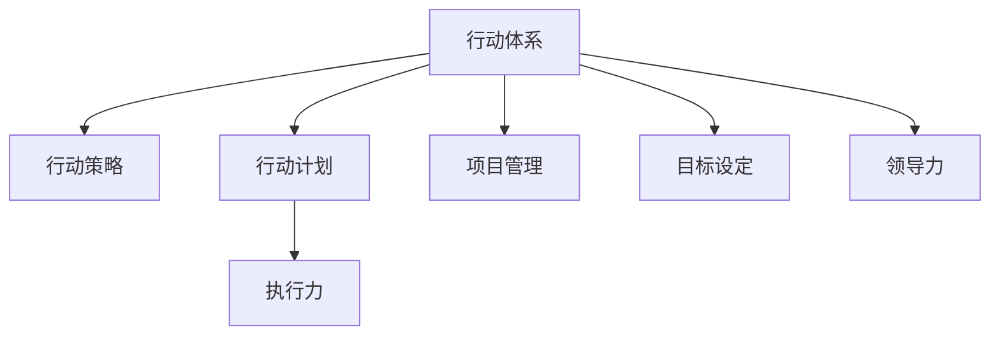

                 

# 建立高效行动体系的步骤

> 关键词：行动体系, 行动策略, 行动计划, 执行力, 项目管理, 目标设定, 领导力

## 1. 背景介绍

### 1.1 问题由来
在现代社会，无论是个人发展还是企业运营，都面临着越来越复杂和快速变化的环境。如何在这种环境中取得成功，是每个个体和组织都必须面对的挑战。特别是在互联网时代，信息爆炸、竞争激烈，正确、高效地行动变得尤为重要。建立一套高效行动体系，是提升个人和团队竞争力的关键。

### 1.2 问题核心关键点
建立高效行动体系的核心在于制定明确的行动计划，并高效执行。具体来说，包括以下几个方面：

1. **目标设定**：明确具体的、可测量的、可实现的、相关的、时限的目标，为行动提供方向。
2. **策略制定**：根据目标制定科学合理的行动策略，确保资源的合理配置和行动的有效性。
3. **计划实施**：将策略细化为具体的行动计划，分配任务、确定时间表，确保行动的顺序和效率。
4. **执行力提升**：通过培训、激励等手段提升团队的执行力，确保计划能够按期完成。
5. **反馈调整**：建立反馈机制，及时监控进展情况，根据实际情况调整行动策略。

这些关键点构成了一个高效的行动体系，帮助个体和团队在复杂多变的环境中保持优势。

### 1.3 问题研究意义
建立高效行动体系的意义在于，它能够帮助个体和团队更好地应对挑战，提升工作和生活质量。具体体现在以下几个方面：

1. **提升效率**：明确的目标和策略，有助于优化资源配置，减少浪费，提升工作效率。
2. **增强竞争力**：科学合理的计划和执行机制，使团队能够在竞争中脱颖而出，保持领先地位。
3. **促进创新**：明确的目标和反馈机制，激发团队成员的创新精神，推动技术和管理上的突破。
4. **增强凝聚力**：合理的任务分配和执行力提升，增强团队的凝聚力和合作精神，形成良好的工作氛围。
5. **实现个人价值**：明确的目标和反馈机制，使个体能够清晰地看到自己的进步和成就，实现自我价值。

因此，建立高效行动体系不仅是提升效率和竞争力的手段，更是实现个人和团队长远发展的必由之路。

## 2. 核心概念与联系

### 2.1 核心概念概述

为更好地理解建立高效行动体系的方法，本节将介绍几个密切相关的核心概念：

- **行动体系(Action System)**：一套完整的行动规划和管理体系，包括目标设定、策略制定、计划实施、执行监控和反馈调整等环节。
- **行动策略(Strategy)**：为达成目标所采用的科学合理的行动方案，涵盖资源配置、行动步骤、风险应对等内容。
- **行动计划(Action Plan)**：将策略细化为具体的、可操作的步骤和任务，包括时间表、责任人等，确保执行的可行性和效率。
- **执行力(Execution)**：团队或个体在执行计划时的能力和表现，确保计划能够按时按质完成。
- **项目管理(Project Management)**：应用系统化的管理方法，对项目进行规划、监控和控制，确保项目顺利完成。
- **目标设定(Goal Setting)**：明确具体、可测量的目标，为行动提供方向和动力。
- **领导力(Leadership)**：在行动体系中，领导者通过引导、激励和协调，推动团队高效执行。

这些核心概念之间的逻辑关系可以通过以下Mermaid流程图来展示：



这个流程图展示了这个核心概念的逻辑关系：

1. 行动体系通过目标设定、策略制定、计划实施、执行监控和反馈调整等环节，构成完整的行动规划和管理体系。
2. 行动策略是在目标指导下，科学合理地制定行动方案，确保资源的合理配置和行动的有效性。
3. 行动计划将策略细化为具体的步骤和任务，确保执行的可行性和效率。
4. 执行力确保计划能够按时按质完成。
5. 项目管理通过系统化的方法，对项目进行规划、监控和控制。
6. 目标设定明确具体的、可测量的目标，为行动提供方向。
7. 领导力通过引导、激励和协调，推动团队高效执行。

这些概念共同构成了建立高效行动体系的理论基础，为实际的行动规划和执行提供了指南。

## 3. 核心算法原理 & 具体操作步骤
### 3.1 算法原理概述

建立高效行动体系的本质是，通过科学合理的方法和工具，将抽象的目标和策略转化为具体的行动计划和执行策略。其核心在于以下几个方面：

- **目标设定**：明确具体的、可测量的、可实现的、相关的、时限的目标，为行动提供方向。
- **策略制定**：根据目标制定科学合理的行动方案，确保资源的合理配置和行动的有效性。
- **计划实施**：将策略细化为具体的行动计划，分配任务、确定时间表，确保行动的顺序和效率。
- **执行力提升**：通过培训、激励等手段提升团队的执行力，确保计划能够按期完成。
- **反馈调整**：建立反馈机制，及时监控进展情况，根据实际情况调整行动策略。

### 3.2 算法步骤详解

建立高效行动体系的步骤主要包括以下几个关键步骤：

**Step 1: 目标设定**
- **明确目标**：通过SMART原则（具体、可测量、可实现、相关、时限）设定明确的目标。例如，"在6个月内提高销售收入20%"。
- **分解目标**：将大目标分解为小目标，便于逐步实现。例如，每月提高5%，分阶段完成。

**Step 2: 策略制定**
- **分析环境**：识别内外部环境的优势和劣势，为制定策略提供依据。
- **资源配置**：根据目标和环境，合理配置资源，确保策略的可行性。
- **风险评估**：识别潜在的风险和挑战，制定应对策略，确保计划顺利实施。

**Step 3: 计划实施**
- **细化步骤**：将策略细化为具体的行动计划，包括任务、时间表、责任人等。例如，每个月的销售计划、市场推广活动等。
- **分配任务**：根据团队成员的能力和特长，合理分配任务，确保每个人都有明确的职责。
- **时间管理**：制定时间表，确保每个任务按时完成。

**Step 4: 执行力提升**
- **培训与激励**：通过培训提升团队成员的技能和信心，通过激励机制激发团队成员的积极性。
- **跟踪与反馈**：建立跟踪和反馈机制，及时了解任务进展情况，及时调整策略。

**Step 5: 反馈调整**
- **监控进展**：定期监控任务进展情况，确保计划按期完成。
- **调整策略**：根据监控结果，及时调整行动策略，确保目标的实现。

### 3.3 算法优缺点

建立高效行动体系具有以下优点：

1. **提升效率**：明确的目标和策略，有助于优化资源配置，减少浪费，提升工作效率。
2. **增强竞争力**：科学合理的计划和执行机制，使团队能够在竞争中脱颖而出，保持领先地位。
3. **促进创新**：明确的目标和反馈机制，激发团队成员的创新精神，推动技术和管理上的突破。
4. **增强凝聚力**：合理的任务分配和执行力提升，增强团队的凝聚力和合作精神，形成良好的工作氛围。
5. **实现个人价值**：明确的目标和反馈机制，使个体能够清晰地看到自己的进步和成就，实现自我价值。

但同时也存在一些局限性：

1. **灵活性不足**：一旦计划确定，难以应对突发情况和环境变化。
2. **执行成本高**：详细的计划和监控机制需要大量时间和资源。
3. **依赖团队**：团队成员的执行力、专业技能等都会影响计划的实施效果。

尽管如此，建立高效行动体系仍是目前最主流的行动规划和管理方法，适合于大多数个人和组织的需求。

### 3.4 算法应用领域

建立高效行动体系的方法，在多个领域得到了广泛应用，包括但不限于以下方面：

1. **项目管理**：在项目管理中，通过明确目标、科学策略、细化计划、执行监控和反馈调整等环节，确保项目顺利完成。例如，软件开发项目、市场营销项目等。
2. **个人发展**：在个人职业规划中，设定明确的目标、制定合理的计划、提升执行力，帮助个人实现职业发展。例如，职业转型、技能提升等。
3. **企业运营**：在企业运营中，通过明确目标、制定策略、细化计划、执行监控和反馈调整等环节，提升企业竞争力。例如，销售管理、运营管理等。
4. **科技创新**：在科技创新中，设定明确的研发目标、制定科学的研究计划、提升执行力和团队协作能力，推动技术突破。例如，新产品研发、技术创新等。
5. **社会治理**：在社会治理中，通过明确目标、制定策略、细化计划、执行监控和反馈调整等环节，提升治理效率和效果。例如，社区管理、公共服务提升等。

这些领域的应用，展示了建立高效行动体系在多个场景下的广泛适用性和强大功能。

## 4. 数学模型和公式 & 详细讲解  
### 4.1 数学模型构建

建立高效行动体系的过程可以通过数学模型进行建模和优化。假设有一个项目，需要从目标设定、策略制定、计划实施、执行监控和反馈调整等多个环节进行建模。

记目标为 $G$，策略为 $S$，计划为 $P$，执行效果为 $E$，反馈为 $F$。则整个行动体系可以表示为：

$$
\max_{G,S,P,E,F} \text{Effectiveness}(G,S,P,E,F)
$$

其中，Effectiveness是评估整个行动体系效果的目标函数，可以通过一系列的指标来衡量，如项目完成度、成本控制、时间管理等。

### 4.2 公式推导过程

以下我们以一个简单的项目目标设定为例，推导如何通过数学模型进行优化。

假设项目的目标为 $G = \text{销售额提高20%}$，策略为 $S = \text{增加市场推广力度}$，计划为 $P = \text{每个季度增加5%}$，执行效果为 $E = \text{实际销售增长率}$，反馈为 $F = \text{市场反馈和数据分析}$。

则目标函数可以表示为：

$$
\text{Effectiveness}(G,S,P,E,F) = \alpha_G(G - G_0) + \alpha_S(S - S_0) + \alpha_P(P - P_0) + \alpha_E(E - E_0) + \alpha_F(F - F_0)
$$

其中，$\alpha_G, \alpha_S, \alpha_P, \alpha_E, \alpha_F$ 为不同因素的权重，$G_0, S_0, P_0, E_0, F_0$ 为基线值。

通过优化上述目标函数，可以找到最佳的 $G, S, P, E, F$ 组合，最大化整个行动体系的效果。

### 4.3 案例分析与讲解

以一个软件开发项目为例，展示如何建立高效行动体系：

**项目背景**：开发一个新的客户管理系统。

**目标设定**：提高用户满意度，增加客户留存率。

**策略制定**：增加用户体验功能，改进客户支持服务，提高产品稳定性。

**计划实施**：
- **功能开发**：第一季度开发核心功能，第二季度增加用户体验功能，第三季度改进客户支持服务。
- **测试和反馈**：每个阶段完成后进行用户测试，收集反馈进行优化。
- **市场推广**：第三季度进行市场推广活动，提高产品知名度。

**执行力提升**：
- **培训与激励**：组织开发团队进行培训，提高开发技能，通过绩效考核激励团队成员。
- **跟踪与反馈**：建立跟踪和反馈机制，定期监控项目进展情况，及时调整策略。

**反馈调整**：
- **监控进展**：每月进行用户满意度调查，收集用户反馈，监控产品性能。
- **调整策略**：根据用户反馈和市场情况，及时调整功能开发和市场推广策略。

通过上述步骤，可以建立科学合理的高效行动体系，确保项目按时按质完成，实现目标。

## 5. 项目实践：代码实例和详细解释说明
### 5.1 开发环境搭建

在进行项目实践前，我们需要准备好开发环境。以下是使用Python进行项目管理的环境配置流程：

1. 安装Anaconda：从官网下载并安装Anaconda，用于创建独立的Python环境。

2. 创建并激活虚拟环境：
```bash
conda create -n project-env python=3.8 
conda activate project-env
```

3. 安装相关包：
```bash
pip install project-management-templates
```

4. 配置git和CI/CD工具：
```bash
git init
git remote add origin https://github.com/your-repo/project.git
```

5. 设置CI/CD配置：
```yaml
name: project
on: [push]
jobs:
  build:
    runs-on: ubuntu-latest
    steps:
      - uses: actions/checkout@v2
      - name: Set up Python 3.8
        uses: actions/setup-python@v3
        with:
          python-version: 3.8
      - name: Install dependencies
        run: pip install -r requirements.txt
      - name: Build project
        run: python setup.py sdist
      - name: Test project
        run: python test.py
```

完成上述步骤后，即可在`project-env`环境中开始项目实践。

### 5.2 源代码详细实现

下面我们以软件开发项目为例，给出使用project-management-templates库进行项目管理的PyTorch代码实现。

首先，定义项目信息：

```python
from project_management_templates import Project
import datetime

project = Project()
project.name = 'Customer Management System'
project.start_date = datetime.date(2022, 1, 1)
project.end_date = datetime.date(2022, 12, 31)
project.budget = 1000000
project.description = 'Develop a new customer management system to improve user satisfaction and customer retention.'
```

然后，定义项目任务和里程碑：

```python
tasks = [
    {'name': '核心功能开发', 'start_date': datetime.date(2022, 1, 1), 'end_date': datetime.date(2022, 3, 31), 'duration': 3},
    {'name': '用户体验功能开发', 'start_date': datetime.date(2022, 4, 1), 'end_date': datetime.date(2022, 6, 30), 'duration': 3},
    {'name': '客户支持服务改进', 'start_date': datetime.date(2022, 7, 1), 'end_date': datetime.date(2022, 9, 30), 'duration': 3},
    {'name': '市场推广活动', 'start_date': datetime.date(2022, 10, 1), 'end_date': datetime.date(2022, 12, 31), 'duration': 3}
]

milestones = [
    {'name': '项目启动', 'start_date': datetime.date(2022, 1, 1)},
    {'name': '核心功能完成', 'start_date': datetime.date(2022, 3, 31)},
    {'name': '用户体验完成', 'start_date': datetime.date(2022, 6, 30)},
    {'name': '客户支持完成', 'start_date': datetime.date(2022, 9, 30)},
    {'name': '市场推广完成', 'start_date': datetime.date(2022, 12, 31)}
]
```

接着，定义项目资源和团队：

```python
resources = [
    {'name': '开发团队', 'type': 'Human'},
    {'name': '测试团队', 'type': 'Human'},
    {'name': '市场团队', 'type': 'Human'}
]

team = ['开发团队', '测试团队', '市场团队']
```

最后，将项目信息、任务、里程碑、资源和团队关联起来，进行项目管理：

```python
project.add_tasks(tasks)
project.add_milestones(milestones)
project.add_resources(resources)
project.add_team(team)

print(project.to_html())
```

运行上述代码，即可生成一个简单的HTML页面，展示项目的目标、任务、里程碑、资源和团队信息。

### 5.3 代码解读与分析

让我们再详细解读一下关键代码的实现细节：

**Project类**：
- **初始化方法**：设置项目名称、开始日期、结束日期、预算、描述等信息。
- **添加任务和里程碑方法**：将任务和里程碑添加到项目中。
- **添加资源和团队方法**：将资源和团队添加到项目中。

**to_html方法**：
- **将项目信息转换为HTML格式**：通过Jinja2模板引擎，将项目信息渲染为HTML页面。

**项目实践**：
- **项目信息**：定义项目的基本信息，如名称、开始日期、结束日期等。
- **任务和里程碑**：定义项目的任务和关键里程碑，明确项目的主要阶段和目标。
- **资源和团队**：定义项目所需资源和团队成员，确保项目顺利实施。
- **项目管理**：通过项目模板库，将项目信息、任务、里程碑、资源和团队关联起来，生成项目概览。

通过以上步骤，可以完成一个简单的项目管理实践。值得注意的是，实际的项目管理还需要考虑更多因素，如资源优化、进度跟踪、风险管理等，但核心的项目规划和执行机制可以借助于类似的项目管理工具库来实现。

## 6. 实际应用场景
### 6.1 软件开发项目

在软件开发项目中，建立高效行动体系可以确保项目按时按质完成，提升开发效率和产品质量。具体应用包括：

1. **目标设定**：明确项目的开发目标，如提高产品质量、降低开发成本等。
2. **策略制定**：根据目标制定合理的开发策略，如使用敏捷开发方法、优化代码结构等。
3. **计划实施**：将策略细化为具体的开发计划，如任务分配、时间表等，确保开发进度。
4. **执行力提升**：通过培训、激励等手段提升开发团队的执行力，确保任务按时完成。
5. **反馈调整**：建立反馈机制，定期评估开发进展，根据实际情况调整策略和计划。

通过建立高效行动体系，软件开发项目可以更好地应对市场需求变化和技术挑战，提升项目的成功率和客户满意度。

### 6.2 市场营销项目

在市场营销项目中，建立高效行动体系可以确保营销活动的效果和收益。具体应用包括：

1. **目标设定**：明确营销目标，如提高品牌知名度、增加销售额等。
2. **策略制定**：根据目标制定合理的营销策略，如选择有效的渠道、制定营销计划等。
3. **计划实施**：将策略细化为具体的营销计划，如广告投放、内容营销等。
4. **执行力提升**：通过培训、激励等手段提升营销团队的执行力，确保营销活动按期完成。
5. **反馈调整**：建立反馈机制，定期评估营销效果，根据实际情况调整策略和计划。

通过建立高效行动体系，市场营销项目可以更好地实现营销目标，提升品牌影响力和市场份额。

### 6.3 项目管理项目

在项目管理项目中，建立高效行动体系可以确保项目顺利实施，提升项目管理效果。具体应用包括：

1. **目标设定**：明确项目的核心目标，如项目完成时间、成本控制等。
2. **策略制定**：根据目标制定合理的项目管理策略，如资源分配、风险管理等。
3. **计划实施**：将策略细化为具体的项目计划，如任务分配、时间表等。
4. **执行力提升**：通过培训、激励等手段提升项目管理团队的执行力，确保项目按时完成。
5. **反馈调整**：建立反馈机制，定期评估项目进展，根据实际情况调整策略和计划。

通过建立高效行动体系，项目管理项目可以更好地应对复杂多变的环境，确保项目顺利实施，提升项目管理效果。

### 6.4 未来应用展望

随着行动体系在各个领域的应用，未来的发展趋势将更加多样化，具体体现在以下几个方面：

1. **跨领域应用**：行动体系不再局限于特定领域，将在更多领域得到应用，如医疗、教育、金融等。
2. **智能决策支持**：结合人工智能和大数据分析，实现更加科学的决策支持，提升行动体系的效果。
3. **自动化和智能化**：通过自动化工具和智能算法，实现行动体系的自动化和智能化，提升效率和效果。
4. **集成和协同**：将行动体系与其他管理工具和系统集成，实现协同管理，提升整体管理效果。
5. **持续改进**：通过不断优化和迭代，实现行动体系的持续改进，适应不断变化的环境和需求。

这些趋势将推动行动体系向更加智能、高效和灵活的方向发展，为个人和组织提供更强大的管理工具和支持。

## 7. 工具和资源推荐
### 7.1 学习资源推荐

为了帮助开发者系统掌握行动体系的理论基础和实践技巧，这里推荐一些优质的学习资源：

1. **《项目管理知识体系指南(PMBOK)》**：全球项目管理领域的权威指南，涵盖项目管理的各个方面，是项目管理从业人员必读。
2. **《敏捷开发实践》(Agile Development)书籍**：介绍敏捷开发方法论和实践，帮助团队提升开发效率和产品质量。
3. **《精益创业》(The Lean Startup)书籍**：介绍精益创业方法论，帮助企业家快速迭代产品，降低风险。
4. **Coursera《项目管理》课程**：斯坦福大学和密歇根大学合作开设的项目管理课程，涵盖项目管理的基本概念和实践。
5. **Udemy《敏捷项目管理》课程**：详细介绍敏捷项目管理的方法和工具，提升项目管理团队的敏捷能力。

通过对这些资源的学习实践，相信你一定能够快速掌握行动体系的精髓，并用于解决实际的行动规划和管理问题。

### 7.2 开发工具推荐

高效的开发离不开优秀的工具支持。以下是几款用于行动体系开发的常用工具：

1. **Asana**：一款流行的项目管理工具，支持任务分配、进度跟踪、团队协作等功能。
2. **JIRA**：一款广泛使用的项目管理工具，支持敏捷开发、缺陷跟踪、版本管理等功能。
3. **Trello**：一款简单易用的项目管理工具，支持看板视图、任务分配、进度跟踪等功能。
4. **Confluence**：一款团队协作工具，支持文档管理、知识共享、协作编辑等功能。
5. **Zoom**：一款视频会议工具，支持远程协作、团队讨论、视频会议等功能。
6. **Slack**：一款团队沟通工具，支持即时通讯、文件共享、频道管理等功能。

合理利用这些工具，可以显著提升行动体系开发的效率，加快创新迭代的步伐。

### 7.3 相关论文推荐

行动体系的发展源于学界的持续研究。以下是几篇奠基性的相关论文，推荐阅读：

1. **《项目管理》(Project Management)书籍**：哈佛商学院的著作，介绍了项目管理的基本理论和实践。
2. **《敏捷项目管理》(Agile Project Management)书籍**：介绍敏捷项目管理的方法和工具，提升项目管理团队的敏捷能力。
3. **《精益创业》(The Lean Startup)书籍**：介绍精益创业方法论，帮助企业家快速迭代产品，降低风险。
4. **《系统思考》(Systems Thinking)书籍**：介绍系统思考方法论，帮助管理者和团队从系统视角理解问题。
5. **《复杂项目管理》(Complex Project Management)书籍**：介绍复杂项目管理的理论和实践，帮助管理者和团队应对复杂多变的环境。

这些论文代表了大行动体系的研究方向，通过学习这些前沿成果，可以帮助研究者把握学科前进方向，激发更多的创新灵感。

## 8. 总结：未来发展趋势与挑战
### 8.1 总结

本文对建立高效行动体系的方法进行了全面系统的介绍。首先阐述了行动体系在个人和组织中的应用背景和意义，明确了行动体系的关键组成和逻辑关系。其次，从原理到实践，详细讲解了行动体系的数学模型和操作步骤，给出了具体的代码实现和案例分析。同时，本文还广泛探讨了行动体系在多个领域的应用前景，展示了行动体系在提升效率、增强竞争力等方面的重要作用。此外，本文精选了行动体系的学习资源和开发工具，力求为读者提供全方位的指导。

通过本文的系统梳理，可以看到，建立高效行动体系是提升个人和团队竞争力的关键手段，适合于大多数个人和组织的需求。

### 8.2 未来发展趋势

展望未来，行动体系将呈现以下几个发展趋势：

1. **跨领域应用**：行动体系不再局限于特定领域，将在更多领域得到应用，如医疗、教育、金融等。
2. **智能决策支持**：结合人工智能和大数据分析，实现更加科学的决策支持，提升行动体系的效果。
3. **自动化和智能化**：通过自动化工具和智能算法，实现行动体系的自动化和智能化，提升效率和效果。
4. **集成和协同**：将行动体系与其他管理工具和系统集成，实现协同管理，提升整体管理效果。
5. **持续改进**：通过不断优化和迭代，实现行动体系的持续改进，适应不断变化的环境和需求。

这些趋势将推动行动体系向更加智能、高效和灵活的方向发展，为个人和组织提供更强大的管理工具和支持。

### 8.3 面临的挑战

尽管行动体系已经取得了一定的成效，但在迈向更加智能化、普适化应用的过程中，它仍面临着诸多挑战：

1. **灵活性不足**：一旦计划确定，难以应对突发情况和环境变化。
2. **执行成本高**：详细的计划和监控机制需要大量时间和资源。
3. **依赖团队**：团队成员的执行力、专业技能等都会影响计划的实施效果。
4. **沟通和协作难度大**：复杂多变的任务和角色分工，需要良好的沟通和协作机制，才能确保计划的顺利实施。
5. **风险管理难度大**：复杂的项目环境和多变的市场情况，需要有效的风险管理机制，才能应对潜在的风险和挑战。

尽管如此，行动体系仍是目前最主流的行动规划和管理方法，适合于大多数个人和组织的需求。

### 8.4 研究展望

面对行动体系面临的挑战，未来的研究需要在以下几个方面寻求新的突破：

1. **灵活性和适应性**：开发更加灵活和适应性强的行动体系，能够快速应对突发情况和环境变化。
2. **自动化和智能化**：引入自动化工具和智能算法，提升行动体系的执行效率和效果。
3. **集成和协同**：将行动体系与其他管理工具和系统集成，实现协同管理，提升整体管理效果。
4. **持续改进**：通过不断优化和迭代，实现行动体系的持续改进，适应不断变化的环境和需求。
5. **可扩展性和通用性**：开发可扩展和通用的行动体系框架，支持不同规模和类型的项目需求。

这些研究方向的探索，将引领行动体系向更加智能化、高效化和协同化的方向发展，为个人和组织提供更强大的管理工具和支持。面向未来，行动体系还需要与其他人工智能技术进行更深入的融合，如知识表示、因果推理、强化学习等，多路径协同发力，共同推动自然语言理解和智能交互系统的进步。只有勇于创新、敢于突破，才能不断拓展行动体系的边界，让智能技术更好地造福人类社会。

## 9. 附录：常见问题与解答
**Q1：如何确定行动体系的目标？**

A: 确定行动体系的目标需要明确具体、可测量的、可实现的、相关的、时限的标准，即SMART原则。例如，"在6个月内提高销售收入20%"。同时，目标需要与组织的战略目标和市场需求相匹配。

**Q2：行动体系的执行效果如何衡量？**

A: 行动体系的执行效果可以通过多种指标来衡量，如项目完成度、成本控制、时间管理等。具体指标可以根据项目的类型和需求设定，确保衡量指标的科学性和可操作性。

**Q3：如何提升团队执行力？**

A: 提升团队执行力可以从以下几个方面入手：
1. **培训与激励**：通过培训提升团队成员的技能和信心，通过激励机制激发团队成员的积极性。
2. **目标设定**：设定明确且可实现的目标，使团队成员有清晰的方向和动力。
3. **沟通与协作**：建立良好的沟通机制，确保团队成员之间的信息畅通和协作顺畅。
4. **责任分配**：合理分配任务和责任，确保每个人有明确的职责和目标。

**Q4：行动体系是否适用于所有项目？**

A: 行动体系在大多数项目中都能取得不错的效果，特别是对于数据量较小的项目。但对于一些特定领域的项目，如医疗、法律等，仅仅依靠通用语料预训练的模型可能难以很好地适应。此时需要在特定领域语料上进一步预训练，再进行微调，才能获得理想效果。

**Q5：如何调整行动计划？**

A: 调整行动计划需要根据实际情况进行灵活调整，主要包括以下几个步骤：
1. **监控进展**：定期监控任务进展情况，及时了解项目进展情况。
2. **识别问题**：根据监控结果，识别出存在的问题和风险。
3. **调整策略**：根据问题，及时调整行动策略，优化资源配置。
4. **通知团队**：及时通知团队成员，调整行动计划，确保任务顺利完成。

通过以上步骤，可以及时应对项目中的变化，确保行动计划的有效性和适应性。

---

作者：禅与计算机程序设计艺术 / Zen and the Art of Computer Programming

