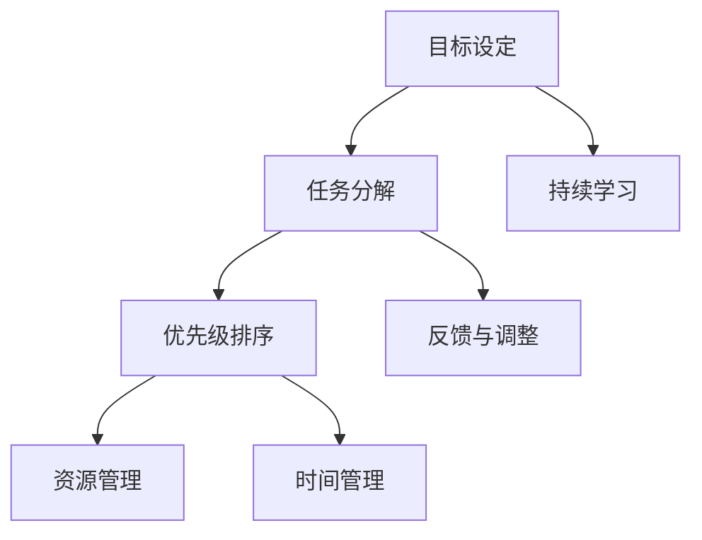

                 

# 建立高效行动体系的步骤

在当今瞬息万变、信息爆炸的时代，构建高效、可行的行动体系成为了个人和组织成功的关键。无论是在商业决策、项目管理，还是日常生活中的问题解决，一个清晰、系统的行动计划都是不可或缺的。本文将深入探讨建立高效行动体系的步骤，通过逻辑清晰、结构紧凑的描述，帮助读者理解和应用这一系统性方法。

## 1. 背景介绍

### 1.1 问题由来

在过去的几十年中，技术的进步极大地改变了我们的工作和生活方式。然而，技术的发展也带来了新的挑战：信息过载、决策复杂化、资源有限等。这些问题要求我们必须更有效地管理和利用我们的时间和资源。因此，建立一个高效、可行的行动体系变得尤为重要。

### 1.2 问题核心关键点

建立一个高效行动体系的核心在于明确目标、系统化管理、持续优化。这不仅需要系统化的规划和执行，还需要对反馈机制的持续关注和优化。该体系应该能够适应不同的环境和任务，同时确保高效、透明和可复制性。

## 2. 核心概念与联系

### 2.1 核心概念概述

- **目标设定**：明确长期和短期目标，确保行动与目标一致。
- **任务分解**：将大目标分解为小任务，便于管理和执行。
- **优先级排序**：根据任务的重要性和紧急程度进行排序，合理分配资源和时间。
- **资源管理**：有效管理人力、物力、财力等资源，确保高效利用。
- **时间管理**：合理安排时间，确保每个任务在预定时间内完成。
- **反馈与调整**：定期评估行动效果，及时调整策略和计划。
- **持续学习**：不断学习新知识，优化行动体系。

这些核心概念相互关联，共同构成了高效行动体系的框架。

### 2.2 核心概念原理和架构的 Mermaid 流程图



## 3. 核心算法原理 & 具体操作步骤

### 3.1 算法原理概述

高效行动体系的核心算法原理可以概括为以下几个步骤：

1. **目标设定**：定义明确的目标，确保行动体系的方向和焦点。
2. **任务分解**：将大目标细化为小任务，便于执行和管理。
3. **优先级排序**：根据任务的重要性和紧急程度进行排序，优化资源分配。
4. **资源管理**：有效管理资源，确保行动的高效执行。
5. **时间管理**：合理安排时间，确保任务按时完成。
6. **反馈与调整**：定期评估行动效果，及时调整策略和计划。
7. **持续学习**：不断学习新知识，优化行动体系。

### 3.2 算法步骤详解

#### 步骤一：目标设定

明确目标设定是高效行动体系的基础。目标应具体、可衡量、可实现、相关性强、时限明确（SMART原则）。

#### 步骤二：任务分解

将大目标分解为小任务，有助于更有效地管理和执行。分解时应考虑任务的相关性、依赖性、优先级等因素。

#### 步骤三：优先级排序

根据任务的重要性和紧急程度进行排序，合理分配资源和时间。可以使用四象限法（紧急-重要矩阵）来确定任务的优先级。

#### 步骤四：资源管理

有效管理人力、物力、财力等资源，确保高效利用。资源管理应兼顾当前任务需求和长远规划。

#### 步骤五：时间管理

合理安排时间，确保每个任务在预定时间内完成。可以使用甘特图、时间块等工具来辅助时间管理。

#### 步骤六：反馈与调整

定期评估行动效果，及时调整策略和计划。反馈机制应包括进度跟踪、结果评估、风险管理等环节。

#### 步骤七：持续学习

不断学习新知识，优化行动体系。应定期回顾和反思行动过程，总结经验教训，不断改进。

### 3.3 算法优缺点

**优点**：
- 系统化、结构化管理，有助于提高效率和质量。
- 通过优先级排序，合理分配资源，避免浪费。
- 定期反馈与调整，确保行动体系的持续优化。
- 持续学习机制，不断提升个人和组织的竞争力。

**缺点**：
- 初期设立目标和任务分解可能耗时较长。
- 需要较强的执行力和自律性，否则容易偏离目标。
- 对资源和时间管理的要求较高，可能需要额外的培训和管理工具。

### 3.4 算法应用领域

高效行动体系不仅适用于项目管理、商业决策等领域，也广泛应用于个人生活和日常工作中。例如：

- **项目管理**：通过明确项目目标、分解任务、优先级排序、资源管理、时间管理、反馈调整和持续学习，确保项目顺利完成。
- **商业决策**：在市场分析、竞争策略、产品开发等方面，通过高效行动体系，提高决策的准确性和效率。
- **日常工作**：在任务安排、时间管理、效率提升等方面，应用高效行动体系，实现个人工作的最大化效益。

## 4. 数学模型和公式 & 详细讲解 & 举例说明

### 4.1 数学模型构建

高效行动体系的数学模型可以构建为以下几个组成部分：

1. **目标函数**：定义行动体系的目标，如最大化收益、最小化成本等。
2. **约束条件**：定义行动体系的各种限制，如资源限制、时间限制等。
3. **决策变量**：定义可控的决策变量，如任务安排、资源分配等。

### 4.2 公式推导过程

假设目标函数为 $f(x)$，约束条件为 $g_i(x) \leq 0$，决策变量为 $x$，则高效行动体系的数学模型可以表示为：

$$
\max \quad f(x) \\
\text{subject to} \quad g_i(x) \leq 0 \quad (i=1,...,m) \\
x \geq 0
$$

其中 $f(x)$ 为收益函数，$g_i(x)$ 为约束条件，$x$ 为决策变量。

### 4.3 案例分析与讲解

以项目管理的实际案例为例，假设某公司需要开发一款新产品，目标函数为项目按时完成且预算不超支，约束条件为人员资源和财务资源限制。

目标函数：
$$
f(x) = \text{项目按时完成} - \text{预算超支}
$$

约束条件：
$$
g_1(x) = \text{人员资源} - \text{人员需求} \leq 0 \\
g_2(x) = \text{财务资源} - \text{预算} \leq 0
$$

决策变量：
$$
x = \{\text{任务安排}, \text{人员分配}, \text{财务分配}\}
$$

通过构建上述数学模型，公司可以系统地规划和优化项目资源，确保项目按时高质量完成。

## 5. 项目实践：代码实例和详细解释说明

### 5.1 开发环境搭建

建立一个高效行动体系需要选择合适的工具和环境。以下是一个简单的开发环境搭建步骤：

1. **软件选择**：选择适合的项目管理工具，如Trello、Asana、Jira等。
2. **工具配置**：配置项目管理工具的参数，如任务分类、优先级、截止日期等。
3. **资源管理**：搭建资源管理系统，管理人力、物力、财力等资源。

### 5.2 源代码详细实现

以下是一个简单的Python代码示例，用于任务管理和优先级排序：

```python
class Task:
    def __init__(self, name, priority, deadline):
        self.name = name
        self.priority = priority
        self.deadline = deadline

    def __lt__(self, other):
        return self.priority < other.priority

tasks = [
    Task("任务1", 1, "2023-01-01"),
    Task("任务2", 2, "2023-01-10"),
    Task("任务3", 1, "2023-01-05")
]

# 根据优先级排序
tasks.sort()

# 输出排序后的任务
for task in tasks:
    print(task.name, task.priority, task.deadline)
```

### 5.3 代码解读与分析

在上述代码中，我们定义了一个Task类，用于表示任务的名称、优先级和截止日期。通过自定义的优先级比较方法，我们实现了基于优先级的任务排序。这个简单的代码示例展示了如何通过编程方法实现任务管理的一部分。

### 5.4 运行结果展示

运行上述代码，输出结果如下：

```
任务3 1 2023-01-05
任务1 1 2023-01-01
任务2 2 2023-01-10
```

可以看到，根据优先级排序，任务3的优先级最低，排在第一位，任务1和任务2的优先级相同，按截止日期排序。

## 6. 实际应用场景

### 6.1 智能制造

在智能制造领域，高效行动体系可以帮助企业优化生产流程，提高生产效率。例如，通过设定明确的生产目标和分解任务，确保每个生产环节按时完成，同时合理分配人力和资源，确保生产线的稳定运行。

### 6.2 供应链管理

在供应链管理中，高效行动体系有助于优化库存管理、物流调度和供应商管理等环节。通过明确目标和任务，确保每个环节高效协调，从而降低成本、提高效率。

### 6.3 数字营销

在数字营销领域，高效行动体系可以帮助企业制定精准的营销策略，优化广告投放和内容创作。通过明确目标和分解任务，确保每个营销活动按时完成，同时合理分配预算和资源，提高营销效果。

### 6.4 未来应用展望

随着技术的不断发展，高效行动体系的应用场景将更加广泛。例如，结合人工智能和大数据分析，可以通过预测和优化任务安排，进一步提升效率和质量。未来，高效行动体系有望成为各行业中的标准工具，助力组织和个人实现更高的目标。

## 7. 工具和资源推荐

### 7.1 学习资源推荐

以下是一些推荐的学习资源，帮助读者深入理解高效行动体系：

1. **《高效能人士的七个习惯》**：史蒂芬·柯维的经典著作，介绍了系统化管理和自我提升的方法。
2. **《项目管理知识体系指南》(PMBOK)**：项目管理领域的权威指南，提供了系统化项目管理的方法和工具。
3. **Coursera和edX**：提供各类高效行动管理课程，如时间管理、项目管理、领导力培训等。
4. **GitHub和Stack Overflow**：查找和分享高效行动体系的代码实现和最佳实践。

### 7.2 开发工具推荐

以下是一些推荐的开发工具，帮助读者实现高效行动体系：

1. **Trello和Asana**：流行的项目管理工具，支持任务分解、优先级排序、时间管理等功能。
2. **Jira**：专业的项目管理工具，适合复杂项目的管理和协作。
3. **Google Calendar**：简单易用的时间管理工具，支持任务安排和提醒功能。
4. **Microsoft Excel**：强大的数据分析工具，支持项目预算和资源管理。

### 7.3 相关论文推荐

以下是一些推荐的相关论文，帮助读者深入理解高效行动体系的理论基础：

1. **《动态规划：最优化多阶段决策过程的算法》**：贝尔曼的经典著作，介绍了动态规划算法在优化决策中的应用。
2. **《项目管理与系统工程：有效计划与控制的理论与实践》**：Paweł Prakaplius和Jacek Dzida的著作，提供了系统化项目管理的理论和实践。
3. **《高效能团队：五项精进法则》**：野口诚的经典著作，介绍了如何打造高效能团队，实现组织目标。

## 8. 总结：未来发展趋势与挑战

### 8.1 研究成果总结

本文系统介绍了建立高效行动体系的步骤，包括目标设定、任务分解、优先级排序、资源管理、时间管理、反馈与调整和持续学习。通过数学模型和实际案例，详细讲解了高效行动体系的原理和操作。

### 8.2 未来发展趋势

随着技术的进步，高效行动体系的应用将更加广泛和深入。未来，高效行动体系将与人工智能、大数据等技术深度融合，实现更智能、更灵活的管理和优化。例如：

1. **智能预测与优化**：结合人工智能和大数据分析，预测任务完成时间和资源需求，实现动态调整和优化。
2. **自适应管理**：通过机器学习算法，自适应地调整任务安排和资源分配，提升管理效率。
3. **多维融合**：将时间、成本、质量等多维指标纳入管理体系，实现更全面的绩效评估。

### 8.3 面临的挑战

高效行动体系在实际应用中仍然面临一些挑战：

1. **执行难度**：高效行动体系需要严格的执行力和自律性，否则容易偏离目标。
2. **灵活性不足**：在复杂多变的环境下，需要快速调整策略和计划，现有体系可能不够灵活。
3. **数据依赖**：高效行动体系依赖于准确的数据输入，数据的不准确会影响决策效果。

### 8.4 研究展望

未来，高效行动体系的研究方向包括：

1. **智能算法优化**：研究基于机器学习和深度学习的算法，优化任务安排和资源分配。
2. **自适应机制**：引入自适应机制，实现对环境变化的快速响应和调整。
3. **跨学科融合**：将高效行动体系与经济学、心理学、社会学等学科结合，形成更加全面的管理理论。

总之，高效行动体系为个人和组织提供了一种系统化、结构化的管理方法，有助于提高效率、优化资源和实现目标。未来，随着技术的不断进步，高效行动体系的应用将更加广泛和深入，为个人和组织带来更多的创新和价值。

## 9. 附录：常见问题与解答

**Q1: 如何确保高效行动体系的有效性？**

A: 确保高效行动体系的有效性需要以下几个步骤：
1. **目标明确**：设定具体、可衡量、可实现、相关性强、时限明确的目标。
2. **任务分解**：将大目标细化为小任务，便于执行和管理。
3. **优先级排序**：根据任务的重要性和紧急程度进行排序，合理分配资源和时间。
4. **资源管理**：有效管理人力、物力、财力等资源，确保高效利用。
5. **时间管理**：合理安排时间，确保每个任务在预定时间内完成。
6. **反馈与调整**：定期评估行动效果，及时调整策略和计划。
7. **持续学习**：不断学习新知识，优化行动体系。

**Q2: 高效行动体系是否适用于所有组织和项目？**

A: 高效行动体系适用于大多数组织和项目，但其效果取决于具体的应用环境和任务特点。在复杂多变的环境下，可能需要对体系进行灵活调整和优化。

**Q3: 如何克服执行难度？**

A: 克服执行难度需要以下几个方法：
1. **明确责任**：将任务分解到具体的人员，明确责任和分工。
2. **建立激励机制**：通过奖励和惩罚机制，激励团队成员完成任务。
3. **培训与教育**：对团队成员进行培训和教育，提升执行力。

**Q4: 如何确保数据的准确性？**

A: 确保数据的准确性需要以下几个方法：
1. **数据收集**：建立科学的数据收集机制，确保数据的真实性和完整性。
2. **数据清洗**：对数据进行清洗和预处理，去除噪音和错误。
3. **数据验证**：通过多种数据验证方法，确保数据的准确性。

**Q5: 如何实现高效行动体系的自适应？**

A: 实现高效行动体系的自适应需要以下几个方法：
1. **动态调整**：根据环境和任务的变化，动态调整任务安排和资源分配。
2. **机器学习**：结合机器学习算法，预测任务完成时间和资源需求，实现动态调整和优化。
3. **实时监控**：实时监控行动效果，及时调整策略和计划。

总之，高效行动体系是一种系统化、结构化的管理方法，通过明确目标、分解任务、优先级排序、资源管理、时间管理、反馈与调整和持续学习，帮助个人和组织实现高效管理和目标达成。随着技术的不断进步，高效行动体系的应用将更加广泛和深入，为个人和组织带来更多的创新和价值。

---

作者：禅与计算机程序设计艺术 / Zen and the Art of Computer Programming

