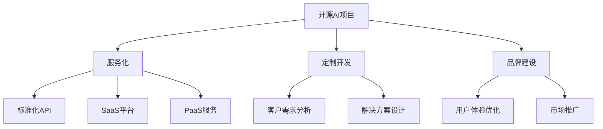

                 

# 开源AI项目的商业化路径:服务、支持和定制开发

> 关键词：开源AI项目、商业化路径、服务、支持、定制开发

## 1. 背景介绍

随着人工智能技术的不断成熟和普及，开源AI项目逐渐成为推动技术创新和应用落地的重要力量。然而，尽管许多开源AI项目拥有强大的技术实力和广泛的用户社区，但在商业化过程中仍面临诸多挑战。本文将从服务、支持和定制开发三个维度，全面剖析开源AI项目的商业化路径，为技术创业者提供切实可行的策略和方案。

### 1.1 问题由来

开源AI项目在技术研发、算法创新等方面具有显著优势，但将其商业化仍需要克服诸多障碍。具体问题包括：

- 缺乏商业化的商业模式：开源项目通常以技术贡献和社区互动为主，较少关注商业盈利。
- 用户需求不明确：开源项目往往针对一般性场景，难以满足特定行业或企业的个性化需求。
- 服务品质参差不齐：开源社区中服务提供商多样，服务质量和可靠性难以保证。
- 定制化开发成本高：许多开源项目提供了通用框架和算法，但缺乏专门的定制开发支持。

这些问题限制了开源AI项目的商业潜力，迫切需要制定系统的商业化路径，以实现开源技术与商业利益的双赢。

### 1.2 问题核心关键点

开源AI项目商业化的核心在于如何有效整合技术优势和市场价值，实现技术的规模化应用和商业模式的创新。关键点包括：

- 服务化与品牌建设：将技术产品化，提供标准化、高质量的AI服务，建立品牌信誉。
- 定制化开发与快速响应：根据用户需求提供定制化解决方案，快速满足特定需求。
- 社区与客户双重驱动：整合开源社区资源，同时建立稳定的客户关系，实现技术的持续迭代和商业模式的创新。

通过以上几个关键点，开源AI项目可以在商业化的道路上走得更远。

## 2. 核心概念与联系

### 2.1 核心概念概述

为更好地理解开源AI项目的商业化路径，本节将介绍几个密切相关的核心概念：

- 开源AI项目：基于开源许可证的AI技术平台和工具，提供通用的算法和框架，支持社区协作开发。
- 商业化路径：将开源技术转化为商业产品或服务的过程，包括服务化、定制开发和品牌建设等环节。
- 服务化：将技术产品化，提供标准化、可定制的AI服务，涵盖API、SaaS、PaaS等多种形式。
- 定制开发：根据用户需求提供个性化的解决方案，结合技术优势与商业价值。
- 品牌建设：通过服务品质和用户体验的提升，建立市场信誉和用户忠诚度。

这些概念之间的逻辑关系可以通过以下Mermaid流程图来展示：



这个流程图展示了大语言模型的核心概念及其之间的关系：

1. 开源AI项目通过服务化、定制开发和品牌建设，逐步实现商业化路径。
2. 服务化包括提供API、SaaS平台和PaaS服务，涵盖不同的产品形式，以满足不同用户需求。
3. 定制开发针对用户特定需求，提供个性化的解决方案，增强用户体验。
4. 品牌建设通过提升服务品质和用户体验，建立市场信誉和用户忠诚度。

这些概念共同构成了开源AI项目的商业化框架，为其成功转型提供了理论指导。

## 3. 核心算法原理 & 具体操作步骤
### 3.1 算法原理概述

开源AI项目的商业化过程本质上是一个从技术到服务的转变过程，涉及到多个关键环节，包括服务化、定制开发和品牌建设。

- **服务化**：将开源AI项目转化为可用的服务产品，满足不同用户的需求。这包括提供API、SaaS平台和PaaS服务等不同形式的服务。
- **定制开发**：根据客户的具体需求，提供个性化的解决方案，结合开源AI项目的优势进行定制开发。
- **品牌建设**：通过提供高质量的服务和定制开发，建立品牌信誉和用户忠诚度。

这些环节相互关联，共同推动开源AI项目的商业化进程。

### 3.2 算法步骤详解

开源AI项目商业化的具体步骤如下：

**Step 1: 确定服务方向**

- 分析开源AI项目的优势和不足，明确目标市场和用户需求。
- 确定服务化的优先级和内容，选择API、SaaS平台或PaaS服务等形式。

**Step 2: 服务设计与部署**

- 设计标准化的服务接口和API文档，确保服务的稳定性和可靠性。
- 搭建SaaS平台或PaaS服务，实现服务的自动化部署和运维。
- 引入DevOps技术，提高服务的交付速度和质量。

**Step 3: 定制开发与支持**

- 收集和分析客户需求，设计个性化的解决方案。
- 利用开源AI项目提供的框架和算法，进行定制化开发。
- 提供持续的技术支持和售后服务，解决客户在应用过程中遇到的问题。

**Step 4: 品牌建设与推广**

- 提升服务品质和用户体验，建立品牌信誉。
- 制定市场推广策略，通过媒体、社交平台等渠道推广服务。
- 持续收集用户反馈，优化产品和服务，增强用户忠诚度。

通过以上步骤，开源AI项目可以有效实现商业化路径，实现技术的市场价值。

### 3.3 算法优缺点

开源AI项目的商业化方法具有以下优点：

1. **技术优势显著**：开源项目通常基于最新的技术创新，提供高质量的算法和框架。
2. **定制化灵活性高**：根据用户需求进行定制开发，能够快速响应市场变化。
3. **成本相对较低**：相比于从头开发或购买商业软件，定制化开发成本较低。

同时，该方法也存在一些局限性：

1. **服务标准化程度低**：开源项目的服务形式较为多样，难以形成统一的标准和品牌。
2. **用户需求分析不足**：开源社区用户需求多样，难以全面满足特定行业的定制需求。
3. **市场推广难度大**：开源项目缺乏商业化经验，市场推广策略和渠道相对薄弱。

尽管存在这些局限性，但总体而言，开源AI项目的商业化方法依然具有显著的优势和潜力。

### 3.4 算法应用领域

开源AI项目的服务化、定制开发和品牌建设方法，已经在多个领域得到了成功应用：

- **金融科技**：利用开源AI项目进行风险评估、客户分析、自动化交易等。
- **医疗健康**：提供医学影像分析、电子病历管理、智能问诊等服务。
- **教育培训**：开发智能评估系统、个性化学习平台等，提升教育效果。
- **智能制造**：结合开源AI项目进行设备预测维护、质量控制、流程优化等。
- **智能城市**：提供城市交通管理、环境监测、公共安全等服务。

以上这些领域展示了开源AI项目商业化应用的广阔前景，为各行业的数字化转型提供了技术支持。

## 4. 数学模型和公式 & 详细讲解 & 举例说明
### 4.1 数学模型构建

本节将使用数学语言对开源AI项目的商业化路径进行更加严格的刻画。

假设开源AI项目的服务化程度为 $S$，定制开发能力为 $C$，品牌建设效果为 $B$。则商业化成功度 $R$ 可定义为：

$$
R = f(S, C, B)
$$

其中 $f$ 为服务化、定制开发和品牌建设的综合评价函数。根据具体情况，$f$ 可以表示为：

$$
R = \frac{S \times C \times B}{k}
$$

其中 $k$ 为调整系数，表示服务化、定制开发和品牌建设之间的相对重要性。

### 4.2 公式推导过程

以下我们以金融科技为例，推导开源AI项目在金融领域的服务化、定制开发和品牌建设模型。

假设某金融公司使用开源AI项目进行风险评估，服务化程度 $S$、定制开发能力 $C$ 和品牌建设效果 $B$ 分别表示为：

- $S = \frac{S_0 + S_{\text{增}}}{S_{\text{增}} + S_{\text{减}}}$
- $C = \frac{C_0 + C_{\text{增}}}{C_{\text{增}} + C_{\text{减}}}$
- $B = \frac{B_0 + B_{\text{增}}}{B_{\text{增}} + B_{\text{减}}}$

其中，$S_0$、$S_{\text{增}}$、$S_{\text{减}}$ 分别表示服务化前后的变化量，$C_0$、$C_{\text{增}}$、$C_{\text{减}}$ 和 $B_0$、$B_{\text{增}}$、$B_{\text{减}}$ 分别表示定制开发和品牌建设的投入与回报。

则商业化成功度 $R$ 为：

$$
R = \frac{S \times C \times B}{k} = \frac{(S_0 + S_{\text{增}}) \times (C_0 + C_{\text{增}}) \times (B_0 + B_{\text{增}})}{k \times (S_{\text{增}} + S_{\text{减}}) \times (C_{\text{增}} + C_{\text{减}}) \times (B_{\text{增}} + B_{\text{减}})}
$$

通过计算 $S$、$C$ 和 $B$ 的投入和回报，可以定量评估开源AI项目的商业化潜力。

### 4.3 案例分析与讲解

以某开源图像识别项目为例，分析其在医疗领域的商业化路径。

**Step 1: 确定服务方向**

- 目标市场：医疗影像分析
- 服务形式：SaaS平台

**Step 2: 服务设计与部署**

- 设计标准化API接口和文档，提供图像上传、分析结果输出等功能。
- 搭建SaaS平台，实现图像分析服务的自动化部署和运维。

**Step 3: 定制开发与支持**

- 收集医院需求，设计个性化的图像分析解决方案。
- 利用开源图像识别框架，进行定制化开发和优化。
- 提供持续的技术支持和售后服务，解决医院在使用过程中遇到的问题。

**Step 4: 品牌建设与推广**

- 通过优质服务和高准确率，建立品牌信誉。
- 制定市场推广策略，通过医院合作、学术会议等渠道推广服务。

最终，该项目在医疗影像分析领域取得了显著的市场份额，并成功实现了商业化转型。

## 5. 项目实践：代码实例和详细解释说明
### 5.1 开发环境搭建

在进行开源AI项目商业化实践前，我们需要准备好开发环境。以下是使用Python进行Django开发的环境配置流程：

1. 安装Anaconda：从官网下载并安装Anaconda，用于创建独立的Python环境。

2. 创建并激活虚拟环境：
```bash
conda create -n django-env python=3.8 
conda activate django-env
```

3. 安装Django：
```bash
pip install django
```

4. 安装相关第三方库：
```bash
pip install Pillow django-gis
```

完成上述步骤后，即可在`django-env`环境中开始开发实践。

### 5.2 源代码详细实现

下面以医疗影像分析项目为例，给出使用Django进行SaaS开发的PyTorch代码实现。

首先，定义数据模型：

```python
from django.db import models

class Image(models.Model):
    file = models.FileField(upload_to='images/')
    analysis = models.TextField(null=True, blank=True)
```

然后，定义API接口：

```python
from django.http import JsonResponse
from .models import Image
import PIL
from openpyxl import load_workbook
import requests
import json

def analyze(request):
    image = request.FILES['file']
    img = PIL.Image.open(image)
    img.save('tmp.jpg')
    
    # 调用开源AI项目的图像分析模型
    url = 'http://model-server:8000/analyze'
    response = requests.post(url, files={'image': open('tmp.jpg', 'rb')})
    data = response.json()
    
    # 将分析结果保存到数据库
    image_obj = Image.objects.create(file=image, analysis=json.dumps(data))
    
    return JsonResponse({'success': True})
```

接着，定义SaaS页面：

```html
<form action="" method="post" enctype="multipart/form-data">
    <input type="file" name="file">
    <input type="submit" value="Analyze Image">
</form>
```

最后，启动Django服务：

```bash
python manage.py runserver 0.0.0.0:8000
```

即完成了SaaS平台的搭建，用户可以通过上传图像进行实时分析。

### 5.3 代码解读与分析

让我们再详细解读一下关键代码的实现细节：

**Image模型**：
- 定义了图像和分析结果的模型，包含图像文件和分析结果字段。

**analyze函数**：
- 获取上传的图像文件，调用开源AI项目的图像分析模型进行预测。
- 将预测结果保存到数据库，并返回JSON响应。

**SaaS页面**：
- 使用Django模板语言，定义了用户上传图像并进行分析的页面。

通过以上步骤，我们构建了一个基于开源AI项目的SaaS平台，实现了图像分析服务的自动化部署和运维。

## 6. 实际应用场景
### 6.1 智能医疗

开源AI项目在智能医疗领域的应用，可以提供高效的医疗影像分析、电子病历管理、智能问诊等服务，帮助医院提升诊疗效率和服务质量。

以医疗影像分析为例，利用开源AI项目进行X光、CT、MRI等影像数据的自动化分析，可以快速识别疾病、诊断结果，减轻医生工作负担，提高诊断准确率。同时，可以将分析结果自动保存到数据库，方便医生查阅和调用。

### 6.2 智能制造

开源AI项目在智能制造领域的应用，可以提供设备预测维护、质量控制、流程优化等服务，提升制造企业的生产效率和产品质量。

例如，利用开源AI项目进行机器视觉检测，实时监控生产线上的设备状态，预测可能出现的故障，及时进行维护，避免生产中断。同时，还可以结合机器学习算法，对生产过程中的异常数据进行分析和优化，提升生产效率和质量。

### 6.3 智慧城市

开源AI项目在智慧城市领域的应用，可以提供城市交通管理、环境监测、公共安全等服务，提升城市管理和居民生活质量。

例如，利用开源AI项目进行交通流量分析，实时调整交通信号灯，优化交通流量，缓解交通拥堵。同时，还可以结合环境监测数据，实时预测污染指数，预警环境污染，保护居民健康。

### 6.4 未来应用展望

随着开源AI项目的不断成熟和优化，其在更多领域的应用前景将更加广阔：

1. **智慧教育**：利用开源AI项目进行个性化学习推荐、智能评估系统等，提升教育效果和教学质量。
2. **金融科技**：结合开源AI项目进行风险评估、客户分析、自动化交易等，提升金融服务的智能化水平。
3. **智能零售**：利用开源AI项目进行客户行为分析、库存管理、营销推荐等，提升零售企业的运营效率和用户体验。
4. **智能农业**：结合开源AI项目进行农业预测、作物管理、资源优化等，提升农业生产的智能化水平。

未来，开源AI项目将在更多领域发挥重要作用，推动各行各业的数字化转型升级。

## 7. 工具和资源推荐
### 7.1 学习资源推荐

为了帮助开发者系统掌握开源AI项目的商业化路径，这里推荐一些优质的学习资源：

1. 《Python Web开发实战》：介绍Django、Flask等Python Web框架的使用，适合了解Web应用开发。
2. 《Django官方文档》：Django的官方文档，提供详细的开发指南和示例代码，适合深入学习。
3. 《深度学习框架TensorFlow》：介绍TensorFlow的使用，涵盖模型构建、训练和部署等环节。
4. 《开源AI项目商业化手册》：系统介绍开源AI项目的商业化路径和策略，适合技术创业者参考。
5. 《TensorFlow官方文档》：TensorFlow的官方文档，提供丰富的学习资源和示例代码，适合深入学习。

通过对这些资源的学习实践，相信你一定能够快速掌握开源AI项目的商业化精髓，并用于解决实际的NLP问题。
### 7.2 开发工具推荐

高效的开发离不开优秀的工具支持。以下是几款用于开源AI项目商业化开发的常用工具：

1. GitHub：开源社区的代码托管平台，提供丰富的开源项目和社区资源。
2. PyTorch：基于Python的开源深度学习框架，支持自定义模型和算法，适合研究和实验。
3. Django：基于Python的Web框架，提供高效、稳定的Web开发解决方案，适合商业化应用。
4. TensorFlow：由Google主导开发的开源深度学习框架，支持分布式计算和生产部署，适合商业化应用。
5. Weights & Biases：模型训练的实验跟踪工具，可以记录和可视化模型训练过程中的各项指标，适合调试和优化。
6. TensorBoard：TensorFlow配套的可视化工具，可实时监测模型训练状态，适合调试和展示。

合理利用这些工具，可以显著提升开源AI项目商业化开发的效率，加快创新迭代的步伐。

### 7.3 相关论文推荐

开源AI项目商业化的发展源于学界的持续研究。以下是几篇奠基性的相关论文，推荐阅读：

1. "Deep Learning for Healthcare"：介绍深度学习在医疗健康领域的应用，涵盖图像分析、电子病历管理等。
2. "Open Source AI in Industry"：分析开源AI项目在各个行业的商业化路径和策略。
3. "Intelligent Manufacturing with AI"：介绍深度学习在智能制造领域的应用，涵盖预测维护、质量控制等。
4. "Smart Cities with AI"：介绍深度学习在智慧城市领域的应用，涵盖交通管理、环境监测等。
5. "AI in Education"：介绍深度学习在教育培训领域的应用，涵盖个性化学习、智能评估等。

这些论文代表了大语言模型微调技术的发展脉络。通过学习这些前沿成果，可以帮助研究者把握学科前进方向，激发更多的创新灵感。

## 8. 总结：未来发展趋势与挑战
### 8.1 总结

本文对开源AI项目的商业化路径进行了全面系统的介绍。首先阐述了开源AI项目在商业化过程中面临的主要挑战，明确了服务化、定制开发和品牌建设的关键点。其次，从原理到实践，详细讲解了开源AI项目商业化的数学模型和操作步骤，给出了商业化任务开发的完整代码实例。同时，本文还广泛探讨了开源AI项目在医疗、智能制造、智慧城市等多个领域的应用前景，展示了开源AI项目的广阔潜力。此外，本文精选了开源AI项目商业化的学习资源、开发工具和相关论文，力求为开发者提供全方位的技术指引。

通过本文的系统梳理，可以看到，开源AI项目的商业化方法不仅能够充分利用技术优势，还可以结合商业价值，实现技术的市场化应用。开源AI项目的商业化路径，为技术创业者提供了系统的策略和方法，有助于加速技术的产业化进程，推动各行业的数字化转型升级。

### 8.2 未来发展趋势

展望未来，开源AI项目的商业化将呈现以下几个发展趋势：

1. **服务化程度提高**：随着开源AI项目商业化进程的推进，服务化程度将进一步提高，提供更标准化、可定制的AI服务，涵盖API、SaaS、PaaS等多种形式。
2. **定制化开发加强**：开源AI项目将更加注重定制化开发，根据用户需求提供个性化的解决方案，增强用户体验。
3. **品牌建设持续推进**：开源AI项目将加强品牌建设，通过提升服务品质和用户体验，建立市场信誉和用户忠诚度。
4. **跨行业应用拓展**：开源AI项目将在更多领域得到应用，推动各行各业的数字化转型升级。

以上趋势凸显了开源AI项目商业化的广阔前景，为各行业的数字化转型提供了技术支持。

### 8.3 面临的挑战

尽管开源AI项目的商业化方法已经取得了显著成效，但在迈向更加智能化、普适化应用的过程中，仍面临诸多挑战：

1. **服务标准化不足**：开源项目的服务形式较为多样，难以形成统一的标准和品牌。
2. **定制化开发成本高**：根据用户需求进行定制开发，需要投入大量时间和资源，成本较高。
3. **市场推广难度大**：开源项目缺乏商业化经验，市场推广策略和渠道相对薄弱。
4. **用户体验参差不齐**：开源项目的服务质量和用户体验存在差异，难以保证服务品质的一致性。

尽管存在这些挑战，但总体而言，开源AI项目的商业化方法依然具有显著的优势和潜力。

### 8.4 研究展望

未来的研究需要在以下几个方面寻求新的突破：

1. **服务标准化与品牌建设**：加强服务标准化建设，制定统一的服务规范和标准，提升品牌信誉。
2. **定制化开发效率提升**：开发更高效、更灵活的定制化开发工具，降低开发成本和时间。
3. **市场推广策略优化**：制定更具针对性和效果的市场推广策略，提升开源AI项目的市场覆盖率和用户认知度。
4. **用户体验优化**：提升服务品质和用户体验，增强用户满意度和忠诚度。

这些研究方向的探索，必将引领开源AI项目的商业化方法迈向更高的台阶，为技术的市场化应用提供更加坚实的保障。

## 9. 附录：常见问题与解答

**Q1：开源AI项目如何实现服务化？**

A: 开源AI项目实现服务化主要通过API接口和SaaS平台的方式，提供标准化的AI服务。具体步骤如下：

1. 设计API接口和文档，定义服务请求和响应格式。
2. 搭建SaaS平台，实现服务的自动化部署和运维。
3. 引入DevOps技术，提高服务的交付速度和质量。

通过以上步骤，可以将开源AI项目转化为可用的服务产品，满足不同用户的需求。

**Q2：开源AI项目如何进行定制化开发？**

A: 开源AI项目进行定制化开发主要通过以下步骤：

1. 收集和分析用户需求，设计个性化的解决方案。
2. 利用开源AI项目提供的框架和算法，进行定制化开发和优化。
3. 提供持续的技术支持和售后服务，解决客户在应用过程中遇到的问题。

通过以上步骤，开源AI项目可以根据用户需求进行定制化开发，提供个性化的解决方案，增强用户体验。

**Q3：开源AI项目如何进行品牌建设？**

A: 开源AI项目进行品牌建设主要通过以下步骤：

1. 提升服务品质和用户体验，建立品牌信誉。
2. 制定市场推广策略，通过媒体、社交平台等渠道推广服务。
3. 持续收集用户反馈，优化产品和服务，增强用户忠诚度。

通过以上步骤，开源AI项目可以通过提供高质量的服务和定制开发，建立品牌信誉和用户忠诚度，实现商业化转型。

---

作者：禅与计算机程序设计艺术 / Zen and the Art of Computer Programming

