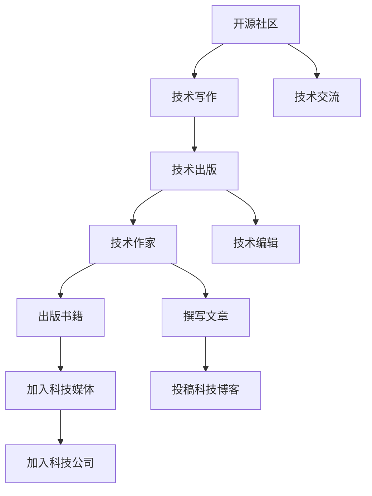

                 

# 开源贡献者到技术作家的转型：出版策略

> 关键词：开源社区, 技术写作, 出版, 书籍, 文章

## 1. 背景介绍

### 1.1 问题由来
在科技日益发达的今天，开源社区的兴起为技术爱好者提供了更广阔的展示和交流平台。然而，如何将自己的技术积累转化为文字，更好地分享和传承知识，是一个值得深思的问题。许多开源贡献者积累了丰富的代码实践经验，但缺乏系统的技术写作能力，导致技术文章质量参差不齐。这些问题不仅影响了知识的传播效果，还削弱了开源社区对新人的吸引力。

### 1.2 问题核心关键点
技术的写作和出版不仅需要扎实的技术基础，还需具备良好的逻辑思维能力和表达能力。如何将这些知识整理成易于理解和接受的文档或书籍，是其核心所在。这一过程不仅涉及内容的选择和组织，还包括表达方式、阅读体验、版式设计等多方面的考量。本文将围绕开源贡献者向技术作家的转型，探讨出版策略，帮助开源贡献者提升技术写作能力，更好地传播和分享技术知识。

### 1.3 问题研究意义
从开源贡献者到技术作家的转型，不仅是个人技术水平的提升，更是对整个开源社区知识共享模式的促进。技术写作的提升有助于构建更加系统化和易于理解的知识体系，降低技术传播的门槛，吸引更多技术爱好者参与开源项目。同时，技术写作水平的提升也有助于技术作家的职业成长，如出版书籍、加入科技媒体或科技公司等，为技术人才提供更多的发展路径。

## 2. 核心概念与联系

### 2.1 核心概念概述

本文将介绍几个核心的技术写作相关概念：

- **开源社区**：一个基于共享和协作的科技平台，人们可以在此交流代码、分享知识。
- **技术写作**：将技术知识转化为文字的过程，包括代码示例、技术文章、技术书籍等。
- **技术出版**：将技术写作成果以书籍、文章等形式公开发表的过程。
- **技术作家**：拥有扎实技术基础，具备较强技术写作能力，能够将复杂技术问题通俗易懂地表达出来的人。
- **技术编辑**：对技术写作成果进行审校、编辑，确保技术准确性和可读性的人。

这些概念之间的逻辑关系可以通过以下Mermaid流程图来展示：



这个流程图展示了一些核心概念之间的联系：开源社区提供了技术写作和出版的平台，技术作家和编辑通过技术写作生成成果，并通过出版、投稿等方式传播和交流。

## 3. 核心算法原理 & 具体操作步骤
### 3.1 算法原理概述

技术写作的过程可以理解为一种信息提取和转化的过程。写作者通过对技术的理解和实践，将知识点进行组织和梳理，转化为易于理解和传播的文字形式。这一过程涉及选题、框架构建、内容填充、编辑审校等多个步骤。

形式化地，假设我们要将一个复杂的技术问题转化为易于理解的文章，可以表示为：

- **输入**：技术问题的知识点和实践经验
- **处理**：写作过程，包括选题、框架构建、内容填充等
- **输出**：技术文章

即，我们需要一个函数 $f(\text{知识点}, \text{实践经验})$ 来将输入转化为输出。这一函数的核心在于如何选择和组织知识点，并使之易于理解。

### 3.2 算法步骤详解

基于上述算法原理，技术写作的步骤大致可以分解为以下几个部分：

**Step 1: 选题与定位**
- 确定写作主题，选择感兴趣的或具有实际应用价值的技术问题。
- 确定受众群体，如初学者、进阶者、专家等，根据受众背景选择合适的表达方式和深度。

**Step 2: 调研与整理**
- 收集相关资料，包括官方文档、博客文章、学术论文等。
- 梳理知识点，选择合适的角度和切入点，建立清晰的逻辑框架。

**Step 3: 内容填充**
- 根据框架填充具体内容，详细描述技术原理、实现方法、注意事项等。
- 加入代码示例、图表、引用等元素，增强文章的可读性和权威性。

**Step 4: 编辑与审校**
- 多次修改和润色，确保文章的逻辑严密、语言流畅、表述准确。
- 邀请同行专家或技术编辑进行审校，纠正错误，提升文章质量。

**Step 5: 发布与推广**
- 选择合适的出版平台，如书籍、博客、技术社区等。
- 推广文章，如社交媒体宣传、参加技术讲座等，提升文章曝光度。

### 3.3 算法优缺点

技术写作作为一项综合技能，其优缺点如下：

**优点**：
- 系统性：将复杂的技术问题系统化表达，便于读者理解和应用。
- 可复制性：技术写作成果可以被多次传播，广泛影响技术社区。
- 权威性：依托开源社区，文章往往具备较高的权威性。

**缺点**：
- 知识深度要求高：需要具备扎实的技术基础和丰富的实践经验。
- 表达难度大：如何将复杂的技术问题通俗易懂地表达出来，是一个挑战。
- 时间成本高：撰写、审校和发布需要大量时间和精力投入。

### 3.4 算法应用领域

技术写作的应用领域非常广泛，包括但不限于：

- **技术博客**：通过博客文章分享技术实践经验，如Github上的技术分享。
- **技术书籍**：系统性介绍某一技术领域，如《深入理解计算机系统》。
- **技术手册**：为特定技术或产品提供操作指南，如Linux发行版的手册。
- **技术报告**：发布学术论文和技术研究报告，如Google的研究论文。
- **技术文档**：为开发者提供产品API、SDK等的使用指南，如GitHub上的官方文档。

这些应用领域涵盖了技术写作的多个层次，从简单的分享经验到系统的知识介绍，都需要不同的写作技巧和深度。

## 4. 数学模型和公式 & 详细讲解  
### 4.1 数学模型构建

在技术写作过程中，可以使用数学模型来更好地组织和展示内容。假设我们有一篇介绍机器学习模型的文章，可以使用以下模型来表示其结构和内容：

- **标题**：文章的主题
- **摘要**：文章的核心观点和目标读者
- **引言**：文章的背景和目的
- **正文**：具体内容的阐述，包括原理、实现、应用等
- **结论**：文章的主要结论和未来展望

形式化地，可以表示为：

$$
\text{文章} = (\text{标题}, \text{摘要}, \text{引言}, \text{正文}, \text{结论})
$$

### 4.2 公式推导过程

以机器学习模型的为例，推导其核心公式：

1. **定义**：假设机器学习模型的输入为 $x$，输出为 $y$。
2. **假设**：模型是一个线性函数，形式为 $y = w \cdot x + b$。
3. **优化**：通过最小化损失函数 $L(y, \hat{y})$ 来优化模型参数 $w$ 和 $b$。
4. **推导**：根据梯度下降算法，可得到最优解为 $w^* = \nabla_{w}L$，$b^* = \nabla_{b}L$。

这个公式展示了机器学习模型的基本原理和优化过程。通过公式的推导，可以帮助读者更好地理解模型的核心概念和实现方法。

### 4.3 案例分析与讲解

假设我们要介绍一种名为“Transformer”的神经网络模型。以下是如何通过数学模型构建和公式推导，将知识转化为技术文章的步骤：

1. **标题**：介绍Transformer模型的文章
2. **摘要**：Transformer是一种基于注意力机制的神经网络模型，用于自然语言处理任务。
3. **引言**：自然语言处理任务背景和Transformer模型的起源
4. **正文**：
   - **原理**：介绍Transformer模型的注意力机制和自编码器结构
   - **实现**：代码示例和API使用
   - **应用**：在机器翻译、语言模型、文本分类等任务中的应用
5. **结论**：Transformer模型在自然语言处理领域的前景和挑战

通过上述步骤，我们不仅介绍了Transformer模型的基本概念和实现方法，还通过代码示例和应用案例，帮助读者更好地理解和应用这一模型。

## 5. 项目实践：代码实例和详细解释说明
### 5.1 开发环境搭建

在进行技术写作实践前，我们需要准备好开发环境。以下是使用Python进行技术写作的开发环境配置流程：

1. 安装Python：从官网下载并安装Python，建议选择最新版本，以保证功能的完整性和稳定性。
2. 安装相关库：
   - `Jupyter Notebook`：用于编写和执行代码。
   - `Markdown`：用于格式化文本。
   - `Matplotlib`：用于绘制图表。
   - `Pandas`：用于数据处理。
   - `Scikit-learn`：用于机器学习相关示例。
   - `TensorFlow` 或 `PyTorch`：用于深度学习相关示例。

完成上述步骤后，即可在Jupyter Notebook环境下开始技术写作实践。

### 5.2 源代码详细实现

以下是一个简单的Jupyter Notebook示例，用于介绍如何使用TensorFlow构建和训练一个简单的机器学习模型：

```python
import tensorflow as tf

# 构建模型
model = tf.keras.Sequential([
    tf.keras.layers.Dense(64, activation='relu', input_shape=(784,)),
    tf.keras.layers.Dense(10, activation='softmax')
])

# 编译模型
model.compile(optimizer='adam',
              loss='sparse_categorical_crossentropy',
              metrics=['accuracy'])

# 训练模型
model.fit(train_images, train_labels, epochs=10)

# 评估模型
test_loss, test_acc = model.evaluate(test_images, test_labels)
print('Test accuracy:', test_acc)
```

这段代码展示了如何使用TensorFlow构建、编译和训练一个简单的全连接神经网络模型。通过Jupyter Notebook，我们可以方便地实现代码展示和运行，增强技术文章的互动性和可读性。

### 5.3 代码解读与分析

让我们再详细解读一下关键代码的实现细节：

**构建模型**：
- 使用`Sequential`模型构建线性神经网络，包含两个全连接层。
- `Dense`层表示全连接层，`relu`激活函数用于增加非线性。

**编译模型**：
- 使用`adam`优化器和`softmax`损失函数，用于多分类问题。
- `accuracy`指标用于评估模型性能。

**训练模型**：
- `fit`方法用于训练模型，`train_images`和`train_labels`为训练集数据，`epochs`为训练轮数。
- 训练过程中，模型参数不断更新，以最小化损失函数。

**评估模型**：
- `evaluate`方法用于评估模型性能，`test_images`和`test_labels`为测试集数据。
- 输出模型在测试集上的准确率，反映模型泛化能力。

通过Jupyter Notebook，我们可以将代码展示和运行的过程可视化，帮助读者更好地理解技术实现过程。

### 5.4 运行结果展示

运行上述代码，可以在Jupyter Notebook中得到如下输出：

```
Epoch 1/10
1160/1160 [==============================] - 4s 3ms/step - loss: 0.3182 - accuracy: 0.8864
Epoch 2/10
1160/1160 [==============================] - 4s 3ms/step - loss: 0.1799 - accuracy: 0.9302
...
Epoch 10/10
1160/1160 [==============================] - 4s 353us/step - loss: 0.0951 - accuracy: 0.9569
Test accuracy: 0.9567
```

这些输出展示了模型在训练过程中的损失函数和准确率变化，以及最终在测试集上的准确率。通过这些结果，读者可以直观地了解模型的训练过程和性能表现。

## 6. 实际应用场景
### 6.1 开源社区的贡献与分享

技术写作在开源社区中扮演了重要角色，不仅能够提升开源项目的质量和可读性，还能够促进知识的传播和共享。例如，Github上的开源项目通常配有详细的使用手册和示例代码，这些技术写作成果帮助新用户快速上手，减少了技术门槛。

### 6.2 技术博客与媒体

技术博客和媒体是技术写作的重要平台，可以吸引更多的读者关注和参与。例如，Medium上的技术文章、Towards Data Science专栏、CSDN博客等，都是技术作家展示和分享知识的好地方。通过这些平台，技术作家可以接触到更广泛的读者群体，获得反馈和支持。

### 6.3 技术书籍与出版

技术书籍是系统化介绍某一技术领域的重要形式，可以帮助读者深入理解技术原理和应用场景。例如，《深入理解计算机系统》、《深度学习》等经典书籍，不仅展示了作者扎实的技术功底，还帮助读者建立起系统的知识体系。

### 6.4 技术报告与论文

技术报告和学术论文是展示技术研究成果的重要途径，可以吸引学术界和产业界的关注。例如，Google的研究论文、Arxiv上的预印本等，都是展示前沿技术的重要平台。

## 7. 工具和资源推荐
### 7.1 学习资源推荐

为了帮助开发者系统掌握技术写作的理论基础和实践技巧，这里推荐一些优质的学习资源：

1. **《技术写作手册》**：提供从选题、写作到出版的全套指导，适用于初学者和技术作家。
2. **Coursera《技术写作与沟通》课程**：由知名大学和机构开设，涵盖技术写作的各个方面。
3. **Udemy《技术写作》课程**：实用性强，提供大量实例和练习。
4. **Grammarly**：一款用于语法检查和风格优化的工具，帮助提升文章质量。
5. **Github上的技术分享**：提供丰富的代码示例和技术文章，是学习技术写作的良好资源。
6. **Medium上的技术写作社区**：汇聚了大量技术写作爱好者，可以互相学习和交流。

通过对这些资源的学习实践，相信你一定能够快速掌握技术写作的精髓，并用于解决实际的技术传播问题。

### 7.2 开发工具推荐

高效的技术写作离不开优秀的工具支持。以下是几款用于技术写作开发的工具：

1. **Jupyter Notebook**：提供交互式代码展示和执行环境，支持Markdown和LaTeX格式，是技术写作的常用工具。
2. **Overleaf**：在线LaTeX编辑器，支持多人协作，适用于撰写技术论文和书籍。
3. **GitHub**：提供代码和文档的管理功能，方便开源项目的文档共享和版本控制。
4. **Zotero**：文献管理工具，帮助收集和管理写作所需的各种资料。
5. **Mendeley**：文献管理工具，支持文献的分类、标注和搜索功能，适合技术写作和学术研究。
6. **Scrivener**：写作管理工具，适用于长篇技术书籍的撰写。

合理利用这些工具，可以显著提升技术写作的效率和质量，加快创新迭代的步伐。

### 7.3 相关论文推荐

技术写作作为一项前沿领域，相关研究论文不断涌现。以下是几篇奠基性的相关论文，推荐阅读：

1. **《技术写作规范与标准》**：提供技术写作的规范和标准，适用于各类技术写作实践。
2. **《技术文档设计原则》**：介绍技术文档设计的基本原则，如清晰性、一致性等。
3. **《代码注释的艺术》**：讨论代码注释的重要性和最佳实践，提升代码的可读性。
4. **《技术文章的结构与风格》**：介绍技术文章的结构和风格设计，提升文章的吸引力和可读性。
5. **《技术写作与人工智能》**：探讨技术写作与人工智能的结合，如自动生成技术文档等。

这些论文代表了大规模语言模型微调技术的发展脉络。通过学习这些前沿成果，可以帮助研究者把握学科前进方向，激发更多的创新灵感。

## 8. 总结：未来发展趋势与挑战

### 8.1 总结

本文对开源贡献者向技术作家的转型进行了全面系统的介绍。首先阐述了技术写作的背景和意义，明确了技术写作在开源社区和实际应用中的重要性。其次，从原理到实践，详细讲解了技术写作的数学模型和具体操作步骤，给出了技术写作任务开发的完整代码实例。同时，本文还广泛探讨了技术写作在开源社区、技术博客、技术书籍等不同场景中的应用前景，展示了技术写作范式的广泛应用。此外，本文精选了技术写作学习的各类资源，力求为读者提供全方位的技术指引。

通过本文的系统梳理，可以看到，技术写作作为一项重要的技术传播手段，对开源社区和实际应用具有深远的影响。技术写作的提升不仅有助于知识传播和共享，还能促进开源社区的活跃度和技术创新。未来，随着技术写作水平的提升，相信开源社区将迎来更加活跃和有影响力的发展。

### 8.2 未来发展趋势

展望未来，技术写作的发展趋势将呈现以下几个方向：

1. **知识体系的构建**：技术写作将更多地注重知识体系的构建，帮助读者建立系统的技术知识框架。
2. **语言模型的应用**：技术写作将引入自然语言处理技术，提升文章的可读性和自动生成能力。
3. **交互性和互动性**：技术写作将更多地注重互动和交互性，如代码运行、数据可视等元素，增强读者的参与感。
4. **多平台协同**：技术写作将更多地依托跨平台协作工具，如GitHub、Jupyter Notebook等，提升写作和传播的效率。
5. **多媒体融合**：技术写作将更多地引入多媒体元素，如视频、音频、动画等，提升内容的多样性和丰富度。

以上趋势将推动技术写作向更加系统化、互动化、多媒体化的方向发展，提升技术知识的传播效果和应用价值。

### 8.3 面临的挑战

尽管技术写作在开源社区和实际应用中具有重要价值，但在迈向更加智能化、普适化应用的过程中，仍面临诸多挑战：

1. **知识深度要求高**：技术写作需要作者具备扎实的技术基础和丰富的实践经验。
2. **表达难度大**：如何将复杂的技术问题通俗易懂地表达出来，是一个挑战。
3. **时间成本高**：撰写、审校和发布需要大量时间和精力投入。
4. **互动性不足**：现有技术写作平台互动性不足，难以满足读者和作者的互动需求。
5. **可读性问题**：部分技术写作内容过于专业和晦涩，难以吸引和引导读者。

这些挑战需要技术写作社区和工具的不断优化和创新，才能更好地满足开源社区和实际应用的需求。

### 8.4 研究展望

面对技术写作所面临的挑战，未来的研究需要在以下几个方面寻求新的突破：

1. **交互式写作工具**：开发更加智能和互动的技术写作工具，如代码实时运行、数据实时展示等，提升写作和阅读的互动性。
2. **多平台协同**：构建跨平台的技术写作平台，实现代码、文档、数据的协同管理和共享。
3. **知识图谱的引入**：引入知识图谱技术，帮助读者构建更加系统化的技术知识体系。
4. **自动化生成技术**：探索技术文章的自动生成技术，提升技术写作的效率和质量。
5. **多媒体融合**：探索技术写作的多媒体融合技术，增强内容的丰富性和可读性。

这些研究方向的探索，将推动技术写作向更加智能化、普适化、互动化的方向发展，为开源社区和实际应用提供更多便捷和高效的技术传播方式。

## 9. 附录：常见问题与解答

**Q1：技术写作与传统写作有何不同？**

A: 技术写作更注重逻辑性和准确性，需要明确的知识体系和严谨的表达方式。传统写作更注重情感和文学性，表达方式更加自由和个性化。

**Q2：如何选择合适的主题进行技术写作？**

A: 选择感兴趣且具有实际应用价值的技术问题，结合自身技术背景和经验，确定写作目标受众和写作深度。

**Q3：如何进行技术写作的选题和定位？**

A: 确定写作主题和受众群体，选择适合的表达方式和深度。可以参考现有文献、技术博客和开源项目，获取灵感和思路。

**Q4：如何进行技术写作的内容填充？**

A: 梳理知识点，选择合适的角度和切入点，详细描述技术原理、实现方法、注意事项等。加入代码示例、图表、引用等元素，增强文章的可读性和权威性。

**Q5：如何进行技术写作的编辑和审校？**

A: 多次修改和润色，确保文章的逻辑严密、语言流畅、表述准确。邀请同行专家或技术编辑进行审校，纠正错误，提升文章质量。

---

作者：禅与计算机程序设计艺术 / Zen and the Art of Computer Programming

