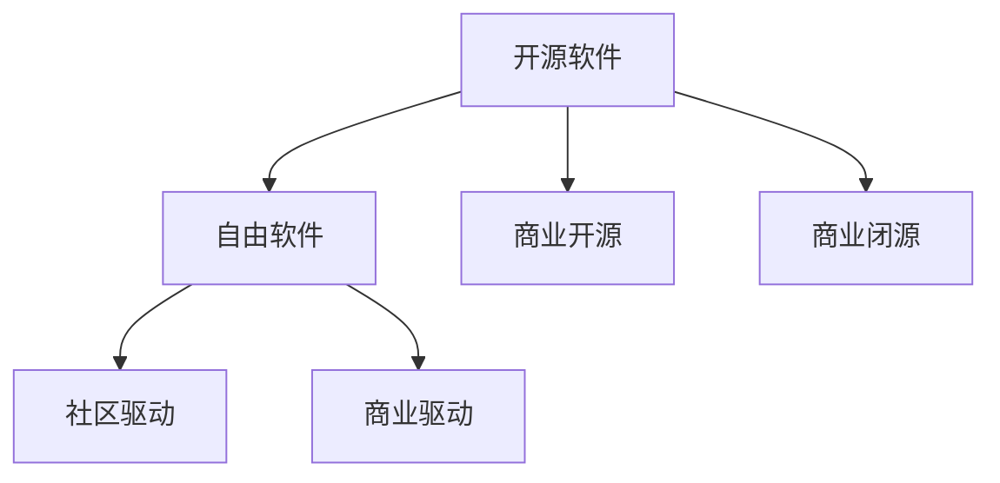

                 

# 开源软件的商业模式：案例研究与最佳实践

开源软件（Open Source Software, OSS）已经成为全球软件生态的重要组成部分。从操作系统、数据库到编程语言，开源软件无处不在，它们不仅改变了技术的创新模式，也重塑了商业和经济的格局。本文将深入探讨开源软件的商业模式，结合典型案例和最佳实践，为读者提供全面的理解。

## 1. 背景介绍

### 1.1 问题由来
开源软件的概念最早可以追溯到1970年代，当时计算机科学家将源代码公开共享，以促进知识的自由传播和软件的广泛使用。然而，直到1990年代，随着Linux等操作系统和Apache HTTP Server等网络服务器的兴起，开源软件的商业价值才真正显现。

进入21世纪，开源软件在软件开发和商业应用中发挥了越来越重要的作用。越来越多的企业和开发者转向开源模式，利用其灵活性、开放性和社区支持，来提升产品质量和市场竞争力。

### 1.2 问题核心关键点
开源软件的商业模式核心在于如何平衡开放与商业利益，实现自我可持续发展。关键点包括：
- 资金筹集与分配
- 社区管理与维护
- 商业策略与营销
- 知识产权与法律合规

这些核心点决定了开源项目能否在长期内保持活跃，并实现商业化的成功。

## 2. 核心概念与联系

### 2.1 核心概念概述

为更好地理解开源软件的商业模式，本节将介绍几个密切相关的核心概念：

- **开源软件（Open Source Software, OSS）**：指公开源代码的软件，用户可以自由地使用、修改和分享源代码，但需要遵守特定的许可协议，如Apache、GPL等。

- **自由软件（Free Software）**：指不限制用户自由的软件，允许用户自由使用、研究、修改和分发软件，核心在于“自由”（Free）而非“免费”（Free of Charge）。

- **商业开源（Commercial Open Source, COS）**：指利用开源软件进行商业应用和推广，同时通过各种方式筹集资金支持社区和项目的发展。

- **商业闭源（Commercial Closed Source, CCS）**：指完全商业化的软件，用户仅能购买和商业化使用，无法自由修改和分发。

- **社区驱动（Community-Driven）**：指由开发者社区自发组织和管理的开源项目，通过协作开发和贡献来实现软件的发展。

- **商业驱动（Commercially Driven）**：指由商业公司主导的开源项目，项目资金和方向主要由企业决定，同时通过开源来吸引更多的商业用户和合作伙伴。

这些核心概念之间的逻辑关系可以通过以下Mermaid流程图来展示：



这个流程图展示开源软件、自由软件、商业开源和商业闭源等核心概念及其之间的关系：

1. 开源软件可以是自由软件，也可以由商业公司驱动，具备多样化的商业形态。
2. 社区驱动的开源软件往往强调开发者和用户之间的协作，推动技术创新。
3. 商业驱动的开源软件则侧重于通过商业模式实现项目的可持续发展和商业利益。

## 3. 核心算法原理 & 具体操作步骤

### 3.1 算法原理概述

开源软件的商业模式主要基于开源与商业化的平衡，通过各种策略和机制，实现项目的长远发展和商业价值的最大化。其核心算法原理包括：

1. **资金筹集与分配**：通过各种方式筹集资金，如赞助、捐赠、订阅、广告等，用于项目的开发、维护和社区建设。

2. **社区管理与维护**：构建活跃的社区，吸引贡献者、用户和合作伙伴，通过有效的社区管理提升项目的活跃度和影响力。

3. **商业策略与营销**：通过商业化的策略和营销手段，吸引商业用户和合作伙伴，同时保持开源核心技术的开放性。

4. **知识产权与法律合规**：确保项目的知识产权清晰，遵守相关法律和协议，保护开源社区和商业用户的利益。

### 3.2 算法步骤详解

开源软件的商业模式一般包括以下几个关键步骤：

**Step 1: 建立开源项目**
- 确定项目目标和愿景，选择合适的开源协议和许可证。
- 招募核心团队和贡献者，构建初始代码库。
- 制定项目章程和贡献准则，明确社区管理规则。

**Step 2: 筹集资金**
- 通过网络众筹、赞助、捐赠等方式筹集初始资金，支持项目启动。
- 推行商业化策略，如订阅服务、企业支持计划等，吸引商业用户。
- 开展市场营销，通过社交媒体、博客、会议等手段提升项目知名度。

**Step 3: 社区建设与维护**
- 建立活跃的社区论坛和邮件列表，促进开发者和用户之间的交流。
- 设立代码审查机制，确保代码质量和规范。
- 举办社区活动，如开发会议、代码贡献挑战等，增强社区凝聚力。

**Step 4: 商业化推广**
- 开发商业产品和服务，如商业版、插件、云服务等，提升商业价值。
- 制定商业化路线图，明确商业化和开源之间的平衡点。
- 建立合作伙伴关系，拓展商业生态和市场渠道。

**Step 5: 法律合规与知识产权管理**
- 制定和遵守开源协议，确保代码的自由共享。
- 明确知识产权归属，保护企业和贡献者的合法权益。
- 建立法律顾问团队，处理法律和合规问题。

### 3.3 算法优缺点

开源软件的商业模式具有以下优点：
1. **灵活性**：开放源代码，促进技术创新和多样性，推动社区协作。
2. **低成本**：通过开源方式降低开发和维护成本，提升市场竞争力。
3. **广泛性**：吸引全球开发者和用户，形成庞大的社区和生态。
4. **持续创新**：社区驱动的持续开发和改进，保持技术领先性。

同时，该模式也存在一些局限性：
1. **资金风险**：过度依赖社区筹资，可能面临资金不足的问题。
2. **知识产权保护**：开源协议可能限制商业化进程，影响法律合规。
3. **商业控制**：商业驱动的开源项目可能失去部分技术自由度。
4. **市场竞争**：过度依赖开源社区，可能面临激烈的市场竞争。

尽管存在这些局限性，但就目前而言，开源软件商业模式在技术创新和市场拓展方面仍展现出强大的生命力。

### 3.4 算法应用领域

开源软件的商业模式已经广泛应用于各种领域，包括但不限于：

- **操作系统**：如Linux、Mac OS等，通过广泛的社区贡献和商业化服务支持，成为全球主流的桌面和服务器操作系统。
- **数据库**：如MySQL、PostgreSQL等，通过开源社区的持续开发和商业支持，广泛应用于企业级数据库管理。
- **编程语言**：如JavaScript、Python等，通过开源社区的协作和商业化生态，成为全球流行的开发语言。
- **云服务**：如AWS、Google Cloud等，通过开源技术和商业化结合，提供强大的云基础设施服务。
- **网络服务**：如Apache HTTP Server、NGINX等，通过开源协议和商业支持，成为互联网应用的基础设施。

除了上述这些经典应用外，开源软件还在物联网、人工智能、区块链、大数据等新兴领域发挥着重要作用，推动了这些技术领域的快速发展。

## 4. 数学模型和公式 & 详细讲解 & 举例说明

### 4.1 数学模型构建

开源软件的商业模式涉及多方面的因素，包括资金筹集、社区维护、商业推广等。这里以一个典型的开源项目为例，构建一个数学模型来描述其商业运作。

假设开源项目 $P$ 的资金来源包括社区捐赠 $F_D$、商业赞助 $F_S$、订阅收入 $F_S$ 和广告收入 $F_A$。项目的维护成本包括开发成本 $C_D$、社区管理成本 $C_C$ 和法律合规成本 $C_L$。项目的商业推广成本包括市场推广成本 $C_M$ 和销售成本 $C_S$。

项目的资金平衡方程为：
$$
F_D + F_S + F_S + F_A = C_D + C_C + C_L + C_M + C_S
$$

### 4.2 公式推导过程

通过上述资金平衡方程，可以推导出项目的盈利模型。设项目的净利润为 $P$，则：
$$
P = F_D + F_S + F_S + F_A - (C_D + C_C + C_L + C_M + C_S)
$$

其中，社区捐赠 $F_D$ 和广告收入 $F_A$ 主要由社区活动和市场营销决定。商业赞助 $F_S$ 和订阅收入 $F_S$ 主要由商业策略和用户需求决定。各项成本则主要由项目规模和社区管理水平决定。

### 4.3 案例分析与讲解

以Apache Hadoop为例，分析其开源与商业化的平衡。

Apache Hadoop是一个广泛使用的开源分布式计算平台，其资金主要来源于社区捐赠和商业赞助。通过灵活的商业化策略，Apache Hadoop实现了商业和开源的平衡。

**资金筹集与分配**：Apache Hadoop通过Apache软件基金会（ASF）进行资金管理，初期依赖社区捐赠和商业赞助，后续引入Apache Stratosphere等商业项目，增加收入来源。

**社区管理与维护**：Apache Hadoop设立了活跃的邮件列表和论坛，吸引全球贡献者，定期举行开发会议和贡献挑战，保持项目的活跃度。

**商业策略与营销**：Apache Hadoop通过Cloudera等商业合作伙伴，提供商业版Hadoop和相关服务，同时开展市场营销活动，提升项目知名度。

**法律合规与知识产权管理**：Apache Hadoop遵守Apache协议，明确了开源和商业化的边界，同时通过开源基金会管理知识产权，保护项目和商业用户的利益。

通过上述策略，Apache Hadoop在开源与商业化的道路上取得了成功，成为全球领先的分布式计算平台。

## 5. 项目实践：代码实例和详细解释说明

### 5.1 开发环境搭建

在进行开源软件项目开发前，需要准备好开发环境。以下是使用Python进行Django框架开发的简单环境配置流程：

1. 安装Anaconda：从官网下载并安装Anaconda，用于创建独立的Python环境。

2. 创建并激活虚拟环境：
```bash
conda create -n django-env python=3.8 
conda activate django-env
```

3. 安装Django：使用pip安装Django框架及其相关依赖。例如：
```bash
pip install django
```

4. 安装其他工具包：
```bash
pip install django-debug-toolbar django-axes django-celery-django django-cors-headers django-compressor
```

完成上述步骤后，即可在`django-env`环境中开始项目开发。

### 5.2 源代码详细实现

这里我们以Django项目为例，给出使用Django框架开发开源社区网站的PyTorch代码实现。

首先，创建并配置Django项目：

```python
# settings.py
DEBUG = True
CORS_ORIGIN_ALLOW_ALL = True
CORS_ALLOW_METHODS = ['GET', 'POST', 'PUT', 'DELETE']
CORS_ALLOW_HEADERS = ['HTTP_AUTHORIZATION', 'HTTP_ACCEPT', 'Content-Type', 'X-Requested-With']

INSTALLED_APPS = [
    'django.contrib.admin',
    'django.contrib.auth',
    'django.contrib.contenttypes',
    'django.contrib.sessions',
    'django.contrib.messages',
    'django.contrib.staticfiles',
    'axes',
    'corsheaders',
    'compressor',
    'crispy_forms',
    'projects',
    'base',
    'forum',
    'auth',
]

MIDDLEWARE = [
    'corsheaders.middleware.CorsMiddleware',
    'django.middleware.common.CommonMiddleware',
    'django.middleware.security.SecurityMiddleware',
    'django.contrib.sessions.middleware.SessionMiddleware',
    'django.middleware.common.CommonMiddleware',
    'django.middleware.csrf.CsrfViewMiddleware',
    'django.contrib.auth.middleware.AuthenticationMiddleware',
    'django.contrib.messages.middleware.MessageMiddleware',
    'django.middleware.clickjacking.XFrameOptionsMiddleware',
    'axes.middleware.AxesMiddleware',
    'django.middleware.security.SecurityMiddleware',
]

URLS = [
    path('', include('projects.urls')),
    path('forum/', include('forum.urls')),
    path('auth/', include('auth.urls')),
]

ASSETS = {
    'staticfiles': {
        'collector': {
            'django_compressor.collectors.Collector',
            'django_compressor.collectors.CssCollector',
            'django_compressor.collectors.JsCollector',
        }
    }
}
```

然后，定义主要页面和功能：

```python
# views.py
from django.shortcuts import render
from django.http import HttpResponse

def index(request):
    return render(request, 'index.html')

def about(request):
    return render(request, 'about.html')

def contact(request):
    return render(request, 'contact.html')

def project_list(request):
    # 获取项目列表
    projects = Project.objects.all()
    # 渲染项目列表页面
    return render(request, 'project_list.html', {'projects': projects})

def project_detail(request, id):
    # 获取项目详情
    project = Project.objects.get(id=id)
    # 渲染项目详情页面
    return render(request, 'project_detail.html', {'project': project})

def forum_list(request):
    # 获取论坛帖子列表
    posts = ForumPost.objects.all()
    # 渲染论坛帖子列表页面
    return render(request, 'forum_list.html', {'posts': posts})

def forum_post_list(request, id):
    # 获取论坛帖子详情
    post = ForumPost.objects.get(id=id)
    # 渲染论坛帖子详情页面
    return render(request, 'forum_post_list.html', {'post': post})
```

最后，启动开发服务器：

```bash
python manage.py runserver
```

在浏览器中访问http://localhost:8000，即可以看到项目的默认首页。

### 5.3 代码解读与分析

让我们再详细解读一下关键代码的实现细节：

**settings.py**：
- 配置了项目的调试模式、CORS设置、中间件、应用等关键参数，确保项目的正常运行和安全性。
- 引入必要的第三方应用，如Axes（防止暴力破解）、Corsheaders（跨域支持）、Compressor（静态文件压缩）、Crispy Forms（表单美化）等。
- 定义了项目的URL结构，配置了项目的静态文件路径和收集器。

**views.py**：
- 定义了项目的主要页面和功能，包括首页、关于页、联系页、项目列表、项目详情、论坛列表和论坛帖子详情等。
- 使用Django的视图函数（Views）和模板系统（Templates），实现页面的动态渲染。
- 调用Django的ORM（对象关系映射）功能，从数据库中获取和操作数据。

**urls.py**：
- 定义了项目的URL映射关系，将请求映射到对应的视图函数上。
- 使用Django的path函数，实现路由的简洁定义。

通过上述代码，可以清晰地看到Django框架下的开源社区网站开发过程。Django的强大功能和灵活性，使得开发者能够快速构建高质量的Web应用。

## 6. 实际应用场景

### 6.1 开源社区

开源社区是开源软件生态的重要组成部分，它们为开发者提供交流、协作和分享的平台，推动开源项目的持续发展和应用。

以GitHub为例，它是一个全球最大的开源社区，提供了代码托管、项目管理、社区交流等功能。GitHub通过广告收入、企业支持计划和GitHub Sponsors等商业化手段，支持社区的发展。

**资金筹集与分配**：GitHub通过广告、商业合作和GitHub Sponsors等途径筹集资金，支持开源项目的开发和维护。

**社区管理与维护**：GitHub设立了活跃的社区论坛和开发讨论区，吸引全球开发者贡献代码，定期举办开发活动和贡献挑战，保持社区的活跃度。

**商业策略与营销**：GitHub通过广告和商业合作，提升自身知名度，吸引更多用户和开发者。

**法律合规与知识产权管理**：GitHub遵守开源协议，明确了开源和商业化的边界，同时通过GitHub法律团队管理知识产权，保护项目和用户的利益。

通过上述策略，GitHub在开源与商业化的道路上取得了成功，成为全球领先的代码托管和社区平台。

### 6.2 开源硬件

开源硬件是指基于开源设计文档和软件协议的硬件产品和解决方案。它们通过开放源代码，推动技术创新和普及，同时提供丰富的社区支持和商业服务。

以Arduino为例，它是一个广泛使用的开源硬件平台，提供了易于使用的开发工具和丰富的社区资源。

**资金筹集与分配**：Arduino通过社区筹资和商业赞助，支持开源硬件的开发和维护。

**社区管理与维护**：Arduino设立了活跃的社区论坛和开发讨论区，吸引全球开发者贡献代码，定期举办开发活动和贡献挑战，保持社区的活跃度。

**商业策略与营销**：Arduino通过销售开发板、配套工具和教育培训，提升商业价值。

**法律合规与知识产权管理**：Arduino遵守开源协议，明确了开源和商业化的边界，同时通过Arduino法律团队管理知识产权，保护项目和用户的利益。

通过上述策略，Arduino在开源与商业化的道路上取得了成功，成为全球领先的硬件开发平台。

### 6.3 开源教育

开源教育是指基于开源软件和开源课程的教育模式，通过自由共享和协作学习，提升教育资源的普及和质量。

以Khan Academy为例，它是一个全球知名的在线教育平台，提供了丰富的开源课程和教育资源。Khan Academy通过广告收入、企业支持和会员订阅等商业化手段，支持开源教育的发展。

**资金筹集与分配**：Khan Academy通过广告、商业合作和会员订阅等途径筹集资金，支持开源教育的开发和维护。

**社区管理与维护**：Khan Academy设立了活跃的社区论坛和学生交流区，吸引全球学生参与学习，定期举办线上线下活动，保持社区的活跃度。

**商业策略与营销**：Khan Academy通过广告和商业合作，提升自身知名度，吸引更多用户和学生。

**法律合规与知识产权管理**：Khan Academy遵守开源协议，明确了开源和商业化的边界，同时通过Khan Academy法律团队管理知识产权，保护项目和用户的利益。

通过上述策略，Khan Academy在开源与商业化的道路上取得了成功，成为全球领先的在线教育平台。

## 7. 工具和资源推荐

### 7.1 学习资源推荐

为了帮助开发者系统掌握开源软件的商业模式，这里推荐一些优质的学习资源：

1. **《Open Source Software: Principles, Practice, and Politics》**：这本书系统介绍了开源软件的原理、实践和政治，是开源软件领域的经典之作。

2. **《The Open Source Book》**：这本书提供了开源软件的全面视角，包括开源的哲学、法律、实践和商业化等多个方面。

3. **《Open Source for the Public Sector》**：这本书介绍了开源软件在公共部门的应用，探讨了开源与公共治理的关系。

4. **《Open Source Promised: Building Public Value from Open Source》**：这本书通过案例分析，展示了开源软件在公共部门的价值和挑战。

5. **《Open Source Governance: The National Institute of Standards and Technology's Guide》**：这本书提供了开源软件的治理指南，帮助组织管理开源项目。

通过对这些资源的学习实践，相信你一定能够系统掌握开源软件的商业模式，并用于指导实际项目。

### 7.2 开发工具推荐

高效的开发离不开优秀的工具支持。以下是几款用于开源软件开发的常用工具：

1. **Git**：版本控制系统，支持开源代码的协作开发和管理。

2. **GitHub**：全球最大的开源社区，提供代码托管、项目管理、社区交流等功能。

3. **Django**：Python Web框架，支持快速开发高质量的Web应用。

4. **Apache JIRA**：项目管理工具，支持开源项目的任务分配、进度跟踪和缺陷管理。

5. **Redmine**：开源项目管理平台，提供任务管理、协作和文档支持。

6. **Jenkins**：开源持续集成工具，支持构建、测试和部署开源项目。

合理利用这些工具，可以显著提升开源软件开发的效率，加速创新迭代的步伐。

### 7.3 相关论文推荐

开源软件的商业模式不断发展，相关研究也随之涌现。以下是几篇具有代表性的相关论文，推荐阅读：

1. **《The Economics of Open Source》**：这篇文章探讨了开源软件经济的理论基础，分析了开源与商业化的平衡点。

2. **《Open Source Project Success Factors》**：这篇论文通过数据分析，总结了开源项目成功的关键因素，提供了实用的指导建议。

3. **《Open Source Project Lifecycle》**：这篇论文研究了开源项目的生命周期，探讨了项目在不同阶段的挑战和应对策略。

4. **《Open Source Software Adoption》**：这篇论文分析了企业采用开源软件的原因和影响，提供了政策建议。

5. **《Open Source Software Governance》**：这篇论文探讨了开源软件治理的理论和实践，提供了治理框架和方法。

这些论文代表了开源软件商业模式的最新研究成果，通过学习这些前沿成果，可以帮助研究者把握学科前进方向，激发更多的创新灵感。

## 8. 总结：未来发展趋势与挑战

### 8.1 总结

本文对开源软件的商业模式进行了全面系统的介绍。首先阐述了开源软件和商业化的关系，明确了开源项目在技术创新和市场拓展中的独特价值。其次，从原理到实践，详细讲解了开源软件的资金筹集、社区管理、商业推广和法律合规等核心步骤，给出了开源项目开发的完整代码实例。同时，本文还广泛探讨了开源软件在开源社区、开源硬件和开源教育等多个领域的应用前景，展示了开源软件的多样化应用场景。

通过本文的系统梳理，可以看到，开源软件商业模式正在成为技术创新和市场应用的重要范式，极大地推动了软件生态的发展和商业价值的实现。开源软件通过开放源代码，打破了技术创新的壁垒，促进了社区协作和市场普及，为全球软件行业带来了深刻变革。未来，伴随开源社区的不断壮大和商业化手段的不断丰富，开源软件必将在更多的领域发挥其独特价值，推动技术的进步和经济的增长。

### 8.2 未来发展趋势

展望未来，开源软件的商业模式将呈现以下几个发展趋势：

1. **社区驱动的商业化**：开源社区的活跃度将继续推动开源项目的发展，通过社区驱动的商业化手段，实现开源与商业化的平衡。

2. **商业模式的创新**：开源软件将探索更多的商业模式，如开源即服务（Open Source as a Service）、开源云平台等，提升商业价值和用户体验。

3. **跨领域的应用**：开源软件将拓展到更多领域，如物联网、人工智能、医疗健康等，推动相关领域的创新和发展。

4. **国际化的推广**：开源软件将加强国际合作和本地化推广，提升全球影响力，推动开源文化的发展。

5. **数据驱动的商业化**：开源软件将利用数据驱动的商业化手段，通过数据分析和人工智能技术，提升项目的商业价值和市场竞争力。

6. **持续的创新与优化**：开源软件将持续改进和优化，提升技术创新和产品性能，推动开源生态的持续发展。

以上趋势凸显了开源软件商业模式的广阔前景。这些方向的探索发展，必将进一步提升开源软件的应用范围和商业价值，推动技术的广泛应用和市场的蓬勃发展。

### 8.3 面临的挑战

尽管开源软件商业模式已经取得了显著成功，但在迈向更加智能化、普适化应用的过程中，它仍面临诸多挑战：

1. **资金风险**：开源项目依赖社区和赞助，资金不足可能影响项目的持续发展和商业化进程。

2. **知识产权保护**：开源协议可能限制商业化进程，影响法律合规和知识产权保护。

3. **市场竞争**：开源社区可能面临激烈的商业竞争，需要不断创新和优化，保持竞争力。

4. **社区管理**：社区的活跃度和贡献者管理是开源项目成功的关键，需要有效的社区管理和激励机制。

5. **技术迭代**：开源软件需要持续更新和改进，保持技术领先和市场竞争力。

6. **商业化冲突**：开源与商业化之间可能存在冲突，需要平衡开源的精神和商业的需求。

正视开源软件面临的这些挑战，积极应对并寻求突破，将是大规模开源项目成功的重要保障。相信随着学界和产业界的共同努力，这些挑战终将一一被克服，开源软件必将在构建人机协同的智能时代中扮演越来越重要的角色。

### 8.4 研究展望

面向未来，开源软件的商业模式需要在以下几个方面寻求新的突破：

1. **多模态开源**：将开源软件与其他技术（如云计算、大数据、人工智能等）结合，实现多模态的创新和应用。

2. **开放式治理**：建立更加开放和透明的治理机制，提升开源项目的决策质量和用户信任度。

3. **社区驱动的商业化**：通过社区驱动的商业化手段，提升开源项目的市场影响力和商业价值。

4. **国际化的推广**：加强国际合作和本地化推广，提升开源软件在全球范围内的影响力。

5. **持续的创新与优化**：持续改进和优化开源软件，提升技术创新和产品性能，推动开源生态的持续发展。

这些研究方向的探索，必将引领开源软件商业模式迈向更高的台阶，为构建安全、可靠、可解释、可控的智能系统铺平道路。面向未来，开源软件商业模式还需要与其他人工智能技术进行更深入的融合，如知识表示、因果推理、强化学习等，多路径协同发力，共同推动自然语言理解和智能交互系统的进步。只有勇于创新、敢于突破，才能不断拓展开源软件的边界，让智能技术更好地造福人类社会。

## 9. 附录：常见问题与解答

**Q1：开源软件是否适用于所有商业应用？**

A: 开源软件适用于大多数商业应用，特别是在技术创新和市场探索阶段。但一些需要高度安全性和保密性的应用，如金融、医疗等，可能需要定制化的商业软件。

**Q2：如何选择合适的开源软件？**

A: 选择合适的开源软件需要考虑以下几个因素：
1. 项目需求：根据项目的具体需求，选择最合适的开源软件。
2. 社区活跃度：选择活跃的社区和开源项目，确保项目的持续更新和支持。
3. 商业化支持：考虑开源软件是否提供商业化支持，以及商业化手段的成熟度。
4. 许可协议：选择符合项目需求的开源协议，确保知识产权的清晰和合规。

**Q3：开源软件是否需要付费订阅？**

A: 开源软件一般免费提供源代码和基础功能，但一些高级特性和商业服务可能需要付费订阅。如Django框架提供了免费和付费两种版本，付费版本包含更多功能和支持。

**Q4：开源软件在商业应用中需要注意哪些问题？**

A: 开源软件在商业应用中需要注意以下问题：
1. 法律合规：确保开源软件的合规使用，遵守开源协议和商业合同。
2. 知识产权保护：明确知识产权归属，保护企业和技术贡献者的利益。
3. 商业化策略：制定合适的商业化策略，平衡开源与商业化的关系。
4. 用户隐私：确保用户数据的安全和隐私保护，避免数据泄露和滥用。

**Q5：如何通过开源软件构建商业生态？**

A: 通过开源软件构建商业生态需要以下几个步骤：
1. 选择合适的开源软件，结合商业需求进行定制开发。
2. 提供优质的商业支持和售后服务，增强用户粘性。
3. 开展市场营销，提升开源软件和商业服务的知名度。
4. 建立合作伙伴关系，拓展市场渠道和资源。

通过上述步骤，可以有效地构建开源软件商业生态，实现开源与商业化的双赢。

---

作者：禅与计算机程序设计艺术 / Zen and the Art of Computer Programming

