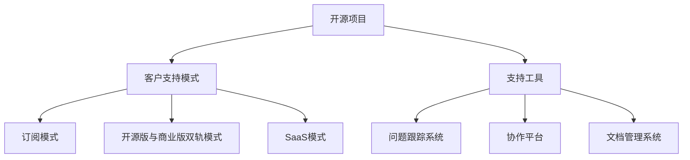

                 

# 开源项目的商业化客户支持：支持模式和工具

## 1. 背景介绍

在当今开源软件和服务的快速发展的时代，越来越多的企业开始依赖于开源项目来支撑其核心业务。然而，开源项目的管理、维护和商业化面临诸多挑战。本文将深入探讨开源项目的商业化客户支持模式，以及用于支持这些模式的各种工具。

## 2. 核心概念与联系

### 2.1 核心概念概述

为更好地理解开源项目商业化客户支持模式及其工具，本节将介绍几个关键概念：

- 开源项目：指通过公开其源代码和开发过程，允许任何人自由使用、修改和分发软件和服务的项目。
- 商业化客户支持：指将开源项目转化为商业产品，同时提供客户服务，以获得收入和商业成功的过程。
- 支持模式：指开源项目商业化过程中采用的不同策略，如订阅模式、开源版与商业版双轨模式、SaaS模式等。
- 工具：指用于开源项目商业化过程中进行客户支持的各种软件和平台，包括问题跟踪系统、协作平台、文档管理系统等。

这些核心概念之间的关系可以通过以下Mermaid流程图来展示：



这个流程图展示了一开研发项目商业化的核心概念及其之间的关系：

1. 开源项目通过选择合适的支持模式，引入适当的工具，提供高质量的客户支持。
2. 不同的支持模式如订阅模式、开源版与商业版双轨模式、SaaS模式各有特点，可以根据商业化需求灵活选择。
3. 支持工具如问题跟踪系统、协作平台、文档管理系统等，在开源项目的商业化过程中发挥着重要作用。

## 3. 核心算法原理 & 具体操作步骤

### 3.1 算法原理概述

开源项目的商业化客户支持涉及多个核心算法和操作步骤，其核心原理可以归纳为以下几点：

1. **用户需求分析**：通过市场调研和客户反馈，了解用户对开源项目的需求和痛点，进而确定商业化的方向和目标。
2. **产品设计和开发**：根据用户需求，设计和开发符合市场需求的产品，包括功能、界面和用户体验等方面。
3. **客户支持模式选择**：根据产品特点和市场需求，选择最适合的支持模式，如订阅模式、开源版与商业版双轨模式、SaaS模式等。
4. **客户支持工具引入**：根据支持模式，引入合适的工具，如问题跟踪系统、协作平台、文档管理系统等，提升客户支持和运营效率。
5. **用户反馈和迭代**：通过用户反馈和市场数据分析，不断优化产品和服务，确保商业化过程持续改进和提升。

### 3.2 算法步骤详解

开源项目的商业化客户支持主要包括以下几个关键步骤：

**Step 1: 用户需求分析**

- 收集市场调研数据和客户反馈，了解用户需求和痛点。
- 分析用户数据，识别潜在的需求和市场机会。
- 确定商业化的核心功能和特性。

**Step 2: 产品设计和开发**

- 制定详细的产品规划和设计方案。
- 设计符合用户需求的产品原型，并进行用户测试和迭代。
- 根据用户反馈优化产品功能和界面。

**Step 3: 支持模式选择**

- 分析市场竞争状况，选择合适的支持模式。
- 根据支持模式特点，设计相应的商业模式和定价策略。
- 确定支持模式的实施细节和运营流程。

**Step 4: 客户支持工具引入**

- 根据支持模式，选择合适的客户支持工具。
- 引入问题跟踪系统，管理用户问题和故障报告。
- 引入协作平台，促进团队协作和沟通。
- 引入文档管理系统，提供用户文档和指南。

**Step 5: 用户反馈和迭代**

- 收集用户反馈，分析用户满意度和改进需求。
- 定期进行市场调研，了解用户需求变化。
- 根据用户反馈和市场调研结果，持续优化产品和支持模式。

### 3.3 算法优缺点

开源项目商业化客户支持的优点包括：

1. **灵活性高**：支持模式多样化，可以根据市场和用户需求灵活选择。
2. **成本效益好**：开源项目降低了开发和维护成本，提升了运营效率。
3. **用户参与度高**：通过开源项目，可以吸引更多用户参与，提升品牌影响力和用户忠诚度。

然而，这种支持模式也存在一些缺点：

1. **盈利模式单一**：主要依赖订阅费或许可费，盈利渠道相对有限。
2. **用户维护复杂**：开源项目生态多样，不同用户可能使用不同的版本和定制方案，维护难度较大。
3. **市场竞争激烈**：开源项目市场竞争激烈，需要不断创新和优化才能保持市场竞争力。

### 3.4 算法应用领域

开源项目的商业化客户支持在多个领域得到了广泛应用，例如：

- 企业级应用：如企业CRM、ERP、BI等系统，通过开源项目商业化提供高效、低成本的解决方案。
- 云服务和基础设施：如OpenStack、Docker、Kubernetes等，通过开源项目商业化提供灵活、易于部署的云服务。
- 开发工具和平台：如GitHub、Jenkins、Maven等，通过开源项目商业化提供强大的开发支持和协作平台。

这些领域的应用展示了开源项目商业化客户支持模式的强大潜力和广泛应用前景。

## 4. 数学模型和公式 & 详细讲解 & 举例说明

### 4.1 数学模型构建

在开源项目商业化客户支持过程中，我们可以使用一些基本的数学模型来量化和管理用户需求和反馈。

假设我们有$n$个用户，每个用户有$m$个问题或需求，每个问题的解决需要$x$个单位时间。则总需求量为：

$$ D = \sum_{i=1}^n \sum_{j=1}^m x_{ij} $$

其中$x_{ij}$表示用户$i$的第$j$个问题的解决时间。

### 4.2 公式推导过程

为了优化用户需求处理效率，我们可以引入排队论和调度算法的相关理论。以队列调度为例，假设问题解决时间服从指数分布，则每个用户的平均等待时间为：

$$ W = \lambda \mu $$

其中$\lambda$为问题到达速率，$\mu$为问题处理速率。

### 4.3 案例分析与讲解

例如，某开源项目公司提供了订阅模式的服务。公司希望通过模型预测不同订阅级别下的用户满意度和收益。假设用户支付$S$元/月的费用，公司提供的服务需$T$小时/月的处理时间。则用户满意度和收益的关系可以表示为：

$$ S = c_1 + c_2 \times T $$

其中$c_1$和$c_2$为常数，代表不同的补贴和收入比例。

通过上述模型，公司可以评估不同订阅级别和处理时间对用户满意度和收益的影响，从而优化定价策略。

## 5. 项目实践：代码实例和详细解释说明

### 5.1 开发环境搭建

在进行开源项目商业化客户支持实践前，我们需要准备好开发环境。以下是使用Python进行Flask开发的环境配置流程：

1. 安装Anaconda：从官网下载并安装Anaconda，用于创建独立的Python环境。

2. 创建并激活虚拟环境：
```bash
conda create -n flask-env python=3.8 
conda activate flask-env
```

3. 安装Flask：
```bash
pip install Flask
```

4. 安装其他相关库：
```bash
pip install Flask-WTF Flask-RESTful Flask-Login
```

完成上述步骤后，即可在`flask-env`环境中开始商业化客户支持实践。

### 5.2 源代码详细实现

下面以一个简单的开源项目商业化客户支持系统为例，给出使用Flask框架进行开发的PyTorch代码实现。

首先，定义Flask应用和相关路由：

```python
from flask import Flask, render_template, request, redirect
from flask_wtf import FlaskForm
from wtforms import StringField, SubmitField, TextAreaField
from flask_login import LoginManager, login_user, logout_user, login_required, current_user

app = Flask(__name__)
app.config['SECRET_KEY'] = 'secret key'

login_manager = LoginManager()
login_manager.init_app(app)
login_manager.login_view = 'login'

class LoginForm(FlaskForm):
    username = StringField('Username', validators=[DataRequired()])
    password = PasswordField('Password', validators=[DataRequired()])
    submit = SubmitField('Log In')

class RegisterForm(FlaskForm):
    username = StringField('Username', validators=[DataRequired()])
    password = PasswordField('Password', validators=[DataRequired()])
    confirm_password = PasswordField('Confirm Password', validators=[DataRequired()])
    submit = SubmitField('Sign Up')

@app.route('/')
@login_required
def home():
    return render_template('index.html')

@app.route('/login', methods=['GET', 'POST'])
def login():
    form = LoginForm()
    if form.validate_on_submit():
        user = User.query.filter_by(username=form.username.data).first()
        if user and check_password_hash(user.password, form.password.data):
            login_user(user)
            return redirect('/')
        else:
            flash('Invalid username or password')
    return render_template('login.html', form=form)

@app.route('/logout')
@login_required
def logout():
    logout_user()
    return redirect('/')

@app.route('/register', methods=['GET', 'POST'])
def register():
    form = RegisterForm()
    if form.validate_on_submit():
        user = User(username=form.username.data, password=generate_password_hash(form.password.data))
        db.session.add(user)
        db.session.commit()
        flash('Register successfully')
        return redirect('/')
    return render_template('register.html', form=form)
```

接着，定义用户模型和数据库管理：

```python
from flask_sqlalchemy import SQLAlchemy
from werkzeug.security import generate_password_hash, check_password_hash

app.config['SQLALCHEMY_DATABASE_URI'] = 'sqlite:///user.db'
db = SQLAlchemy(app)

class User(db.Model):
    id = db.Column(db.Integer, primary_key=True)
    username = db.Column(db.String(20), unique=True, nullable=False)
    password = db.Column(db.String(80), nullable=False)

@app.before_first_request
def create_tables():
    db.create_all()
```

最后，启动Flask应用：

```python
if __name__ == '__main__':
    app.run(debug=True)
```

以上就是使用Flask框架进行开源项目商业化客户支持系统的完整代码实现。可以看到，利用Flask框架，可以较为简洁高效地实现用户登录、注册和页面展示等核心功能。

### 5.3 代码解读与分析

让我们再详细解读一下关键代码的实现细节：

**Flask应用和路由**：
- `Flask`：Python的轻量级Web框架，适合快速开发。
- `Flask-WTF`：Flask的表单扩展，支持WTForms表单验证。
- `Flask-Login`：Flask的用户认证扩展，支持用户登录、登出、会话管理等功能。
- `Flask-RESTful`：Flask的RESTful扩展，支持RESTful API开发。
- `Flask-WTF`：Flask的表单扩展，支持WTForms表单验证。

**用户模型和数据库管理**：
- 利用`Flask-SQLAlchemy`扩展，方便进行数据库操作。
- 定义`User`模型，包含用户名和密码字段，支持哈希密码存储。
- 使用`@app.before_first_request`装饰器，在应用启动前创建数据库表。

**认证和会话管理**：
- 利用`Flask-Login`扩展，实现用户认证和会话管理。
- 通过`login_user`和`logout_user`函数，实现用户登录和登出。
- 使用`current_user`对象，获取当前登录用户信息。

**前端页面**：
- 利用`Flask`的模板引擎`Jinja2`，实现静态页面渲染。
- 通过`@app.route`装饰器，定义不同路由对应的视图函数。
- 使用`render_template`函数，渲染模板并返回HTML页面。

可以看出，Flask框架和相关扩展库在开发开源项目商业化客户支持系统时，提供了极大的便利和灵活性。开发者可以根据具体需求，自由组合这些工具和库，构建高性能、易于维护的商业化客户支持系统。

## 6. 实际应用场景

### 6.1 企业级应用

在企业级应用中，开源项目商业化客户支持广泛应用于各种系统和服务中。例如：

- CRM系统：通过开源CRM系统商业化，提供高效、低成本的客户关系管理服务。
- ERP系统：开源ERP系统通过商业化，提供全面的企业资源管理解决方案。
- BI系统：开源BI系统通过商业化，提供强大的数据分析和可视化支持。

### 6.2 云服务和基础设施

开源云服务和基础设施通过商业化，为各类企业提供灵活、易用的云服务。例如：

- OpenStack：通过商业化，提供高性能的云基础设施服务。
- Docker：通过商业化，提供便捷的容器化解决方案。
- Kubernetes：通过商业化，提供强大的容器编排和管理平台。

这些云服务和基础设施的商业化客户支持，帮助企业快速部署和扩展云环境，提升IT运营效率。

### 6.3 开发工具和平台

开源开发工具和平台通过商业化，提供了强大的开发支持和协作平台。例如：

- GitHub：通过商业化，提供高度集成的开发协作平台。
- Jenkins：通过商业化，提供强大的持续集成和部署平台。
- Maven：通过商业化，提供高效的构建和管理工具。

这些开发工具和平台的商业化客户支持，帮助企业提升开发效率和代码质量，推动技术创新。

### 6.4 未来应用展望

开源项目的商业化客户支持在多个领域继续发展和创新。未来，预计将出现以下趋势：

1. **多渠道支持**：开源项目将提供多渠道支持，包括Web、移动、邮件等，提升用户体验。
2. **自动化运维**：利用AI和自动化技术，提升客户支持的自动化水平，提高处理效率。
3. **智能化分析**：利用大数据和机器学习技术，进行用户行为分析和预测，提升客户支持精准度。
4. **生态协同**：开源项目将与各类第三方生态系统协同工作，提供更全面、更灵活的服务。
5. **国际化和本地化**：开源项目将支持多种语言和地区，提升全球市场覆盖率。

这些趋势将进一步提升开源项目商业化客户支持的智能化和自动化水平，提升用户满意度和运营效率。

## 7. 工具和资源推荐

### 7.1 学习资源推荐

为了帮助开发者系统掌握开源项目商业化客户支持的理论基础和实践技巧，这里推荐一些优质的学习资源：

1. 《开源项目管理与维护》：涵盖开源项目管理的各个方面，包括需求分析、产品开发、客户支持等。
2. 《Flask Web开发实战》：详细讲解Flask框架的使用方法，适合快速上手开发开源项目客户支持系统。
3. 《开源项目商业化策略》：分析开源项目商业化的各种模式和策略，提供实际案例和解决方案。
4. 《DevOps基础》：涵盖DevOps的各个方面，包括持续集成、持续交付、监控和自动化等。
5. 《机器学习和人工智能在客户支持中的应用》：介绍机器学习在客户支持中的应用，提升处理效率和精准度。

通过对这些资源的学习实践，相信你一定能够快速掌握开源项目商业化客户支持的核心技巧，并用于解决实际的客户支持问题。

### 7.2 开发工具推荐

高效的开发离不开优秀的工具支持。以下是几款用于开源项目商业化客户支持开发的常用工具：

1. JIRA：问题跟踪系统，帮助团队管理用户问题和故障报告。
2. Slack：团队协作工具，提供即时沟通和文件共享功能。
3. Confluence：文档管理系统，帮助团队管理文档和指南。
4. GitLab：代码托管和协作平台，支持代码版本控制和持续集成。
5. Docker：容器化平台，帮助企业快速部署和扩展应用程序。

合理利用这些工具，可以显著提升开源项目商业化客户支持的开发效率，加快创新迭代的步伐。

### 7.3 相关论文推荐

开源项目商业化客户支持技术的发展源于学界的持续研究。以下是几篇奠基性的相关论文，推荐阅读：

1. "The Economics of Software Development"：Randal E. Brewster等人关于开源项目的经济分析。
2. "Open Source Software: A Methodological Case Study"：Eric Vogel关于开源项目管理和商业化的案例研究。
3. "Customer Support for Open Source Software"：Mike Mumenthaler等人关于开源项目客户支持的理论分析。
4. "Open Source Software Adoption"：Richard E. Normann等人关于开源软件采用过程的实证研究。
5. "The Role of Open Source in the Cloud Computing Ecosystem"：Jack Yuan-key Lui等人关于开源项目在云计算中的应用分析。

这些论文代表了大语言模型微调技术的发展脉络。通过学习这些前沿成果，可以帮助研究者把握学科前进方向，激发更多的创新灵感。

## 8. 总结：未来发展趋势与挑战

### 8.1 研究成果总结

本文对开源项目商业化客户支持模式及其工具进行了全面系统的介绍。首先阐述了开源项目和客户支持的核心理论，明确了商业化支持模式和工具的价值。其次，从原理到实践，详细讲解了商业化支持模式的数学模型和操作步骤，给出了开源项目商业化客户支持系统的代码实现。同时，本文还广泛探讨了开源项目在多个领域的商业化应用，展示了开源项目商业化客户支持模式的强大潜力和广泛应用前景。最后，本文精选了开源项目商业化客户支持的相关学习资源和开发工具，力求为读者提供全方位的技术指引。

通过本文的系统梳理，可以看到，开源项目商业化客户支持模式为开源项目提供了强大的商业保障，促进了开源生态的持续发展和创新。未来，伴随开源社区的不断壮大和技术演进，开源项目商业化客户支持模式必将在更广泛的领域发挥重要作用，推动开源技术的规模化落地。

### 8.2 未来发展趋势

展望未来，开源项目商业化客户支持技术将呈现以下几个发展趋势：

1. **技术创新不断**：开源项目将不断引入新技术，提升客户支持的智能化和自动化水平。例如，利用机器学习和大数据分析，提升问题处理效率和用户满意度。
2. **生态系统协同**：开源项目将与第三方生态系统协同工作，提供更全面、更灵活的服务。例如，通过API集成，整合各类第三方工具和平台。
3. **多语言支持**：开源项目将支持多种语言和地区，提升全球市场覆盖率。例如，通过国际化支持，覆盖更多国际用户。
4. **用户体验优化**：开源项目将注重用户体验，提升界面和功能的友好性和易用性。例如，通过UI/UX设计，提升用户操作体验。
5. **灵活定价策略**：开源项目将引入灵活的定价策略，满足不同用户和市场的个性化需求。例如，通过订阅模式、开源版与商业版双轨模式等，提供多样化的选择。

以上趋势凸显了开源项目商业化客户支持技术的广阔前景。这些方向的探索发展，必将进一步提升开源项目商业化客户支持的性能和应用范围，为开源技术的产业化进程注入新的动力。

### 8.3 面临的挑战

尽管开源项目商业化客户支持技术已经取得了显著成就，但在迈向更加智能化、普适化应用的过程中，它仍面临诸多挑战：

1. **市场竞争激烈**：开源项目面临着众多竞争对手，如何在激烈的市场竞争中脱颖而出，需要不断创新和优化。
2. **用户需求多样化**：用户需求和痛点各异，开源项目如何满足多样化需求，提升用户满意度，是重要挑战。
3. **技术维护成本高**：开源项目生态多样，维护难度较大，如何降低技术维护成本，提升运营效率，是关键问题。
4. **安全性和隐私保护**：开源项目面临的安全和隐私问题较为复杂，如何保护用户数据安全，避免泄露，是必须解决的问题。
5. **客户支持差异化**：开源项目需要提供差异化的客户支持服务，以满足不同用户和市场的需求，如何做到高效、灵活、个性化，是重要挑战。

这些挑战凸显了开源项目商业化客户支持技术在实际应用中需要解决的关键问题。唯有从技术、管理、运营等多个维度全面优化，才能确保开源项目商业化客户支持模式的可持续发展。

### 8.4 研究展望

未来，开源项目商业化客户支持技术需要在以下几个方面进行深入研究：

1. **智能化和自动化**：进一步提升客户支持的智能化和自动化水平，利用AI和大数据技术，提升问题处理效率和用户体验。
2. **多渠道支持**：提供多渠道客户支持，满足用户不同场景下的需求，提升用户满意度。
3. **灵活定价策略**：设计灵活的定价策略，满足不同用户和市场的个性化需求，提升用户粘性和收益。
4. **安全性保障**：加强开源项目的安全性保障，保护用户数据隐私和安全，提升用户信任。
5. **国际化和本地化**：支持多种语言和地区，提升全球市场覆盖率，拓展国际业务。

这些研究方向的探索，将进一步提升开源项目商业化客户支持模式的性能和应用范围，为开源技术的产业化进程注入新的动力。相信随着技术的不断演进和应用的深入，开源项目商业化客户支持模式必将在更广泛的领域发挥重要作用，推动开源技术的规模化落地。

## 9. 附录：常见问题与解答

**Q1：开源项目商业化客户支持是否适用于所有NLP任务？**

A: 开源项目商业化客户支持在大多数NLP任务上都能取得不错的效果，特别是对于数据量较小的任务。但对于一些特定领域的任务，如医学、法律等，仅仅依靠通用语料预训练的模型可能难以很好地适应。此时需要在特定领域语料上进一步预训练，再进行微调，才能获得理想效果。此外，对于一些需要时效性、个性化很强的任务，如对话、推荐等，微调方法也需要针对性的改进优化。

**Q2：采用开源项目商业化客户支持时需要注意哪些问题？**

A: 采用开源项目商业化客户支持时，需要注意以下问题：
1. 选择合适的支持模式，根据产品特点和市场需求，选择最适合的支持模式。
2. 引入合适的工具，如问题跟踪系统、协作平台、文档管理系统等，提升客户支持和运营效率。
3. 注重用户反馈和迭代，通过用户反馈和市场调研，不断优化产品和支持模式。
4. 加强安全性和隐私保护，保护用户数据安全，避免泄露。
5. 提供差异化的客户支持服务，以满足不同用户和市场的需求，提升用户满意度。

通过合理处理这些问题，可以有效提升开源项目商业化客户支持的效果和用户体验。

**Q3：开源项目商业化客户支持的盈利模式有哪些？**

A: 开源项目商业化客户支持的盈利模式主要有以下几种：
1. 订阅模式：用户按月或年度支付订阅费，获得定制化的服务。
2. 开源版与商业版双轨模式：开源版免费，商业版提供高级功能和支持服务。
3. SaaS模式：用户通过云端服务获得应用和支持，按使用量付费。
4. 定制服务：根据客户需求提供定制化的解决方案和支持服务。
5. 广告模式：通过广告收入获取收益。

这些盈利模式可以根据不同产品和市场进行选择，帮助开源项目实现商业化目标。

**Q4：开源项目商业化客户支持的未来发展趋势是什么？**

A: 开源项目商业化客户支持的未来发展趋势主要包括以下几个方面：
1. 技术创新不断：开源项目将不断引入新技术，提升客户支持的智能化和自动化水平。
2. 生态系统协同：开源项目将与第三方生态系统协同工作，提供更全面、更灵活的服务。
3. 多语言支持：开源项目将支持多种语言和地区，提升全球市场覆盖率。
4. 用户体验优化：开源项目将注重用户体验，提升界面和功能的友好性和易用性。
5. 灵活定价策略：开源项目将引入灵活的定价策略，满足不同用户和市场的个性化需求。

这些趋势凸显了开源项目商业化客户支持技术的广阔前景。这些方向的探索发展，必将进一步提升开源项目商业化客户支持的性能和应用范围，为开源技术的产业化进程注入新的动力。

---

作者：禅与计算机程序设计艺术 / Zen and the Art of Computer Programming

