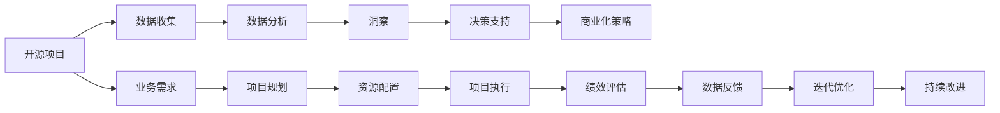

                 

# 开源项目的商业化数据分析：洞察和决策支持

> 关键词：开源项目,商业化,数据分析,洞察,决策支持,量化评估,ROI,精益创业,敏捷开发

## 1. 背景介绍

### 1.1 问题由来

随着开源软件和开源社区的不断发展壮大，越来越多的企业和开发者选择利用开源项目来推动技术创新和商业化应用。然而，开源项目在商业化过程中面临诸多挑战，包括如何进行有效的数据分析、如何评估和优化投资回报率、如何确保项目的可持续性和高效性等。这些问题如果处理不当，可能会极大地影响开源项目的商业化进程，甚至导致项目失败。

为了应对这些挑战，本文将深入探讨如何通过数据分析来洞察开源项目的商业化进程，提供决策支持，帮助企业和开发者更好地实现商业化目标。我们将重点讨论开源项目的商业化数据分析方法、量化评估指标、决策制定策略等核心内容，希望能为读者提供一些切实可行的参考和指导。

## 2. 核心概念与联系

### 2.1 核心概念概述

在进行开源项目的商业化数据分析之前，首先需要理解以下核心概念：

- **开源项目**：基于开放源代码许可协议（如Apache、MIT等）发布的软件项目。
- **商业化**：将开源项目转化为商业产品或服务的商业模式。
- **数据分析**：通过收集和分析数据来揭示业务运作规律，支持决策过程。
- **洞察**：从数据分析中获取有价值的洞见，指导商业化策略。
- **决策支持**：基于数据分析提供的洞察来制定和调整商业化策略，实现决策科学化。

这些概念通过数据流和业务逻辑的联系形成一个紧密的整体，共同构成了开源项目商业化数据分析的框架。下面通过一个Mermaid流程图来展示这些概念之间的联系：



### 2.2 核心概念原理和架构

开源项目的商业化是一个动态的过程，涉及从规划、开发、部署到市场推广的各个环节。数据分析在其中扮演着至关重要的角色，帮助企业和开发者从多个维度（如财务、技术、市场）进行综合评估和决策。以下是一个基于开源项目商业化的核心概念原理和架构的简单描述：

- **数据收集**：从开源项目的各个环节（如代码库、发行渠道、用户反馈等）收集相关数据。
- **数据分析**：利用统计学、机器学习等方法对收集到的数据进行分析，提取有价值的信息。
- **洞察**：通过数据挖掘、趋势分析等技术，从数据分析结果中提取洞察，识别出项目的关键问题、机会和趋势。
- **决策支持**：基于洞察，制定合理的商业化策略，如市场定位、产品优化、用户获取策略等。
- **商业化策略**：在决策支持的基础上，具体制定和实施商业化策略，推动项目实现商业价值。

## 3. 核心算法原理 & 具体操作步骤

### 3.1 算法原理概述

开源项目的商业化数据分析主要依赖于以下算法原理：

- **统计分析**：通过描述性统计和推断性统计方法，分析数据的基本特征、趋势和规律。
- **机器学习**：利用监督学习、无监督学习和半监督学习等方法，对数据进行更深入的挖掘和分类。
- **数据可视化**：通过图表、仪表盘等工具，直观展示数据分析结果，帮助决策者理解数据。
- **量化评估**：通过定义关键性能指标（KPIs），对开源项目商业化过程进行量化评估，如投资回报率（ROI）、客户获取成本（CAC）、净推荐值（NPS）等。

这些算法原理通过一系列的操作步骤，共同构成开源项目商业化数据分析的完整流程。以下将详细介绍这些操作步骤。

### 3.2 算法步骤详解

开源项目的商业化数据分析主要包括以下几个关键步骤：

#### 3.2.1 数据收集与预处理

数据收集是开源项目商业化数据分析的基础。在数据收集阶段，需要从开源项目的代码库、文档、社区反馈、市场活动等多个渠道获取相关的数据。

- **代码库分析**：统计代码提交频率、贡献者数量、代码质量（如代码覆盖率、代码审查数量）等指标。
- **文档分析**：分析文档质量（如文档覆盖率、文档更新频率）、文档反馈（如文档阅读量、文档修改建议数量）等指标。
- **社区反馈**：通过社区平台（如GitHub Issues、Discord等）收集用户反馈，分析问题解决速度、用户满意度等指标。
- **市场活动**：统计参与次数、活动反馈、营销效果等指标。

数据收集完成后，需要进行预处理，包括数据清洗、格式转换、数据归一化等操作，确保数据的准确性和一致性。

#### 3.2.2 数据分析与建模

数据分析是开源项目商业化数据分析的核心环节。通过数据分析，可以揭示项目的关键问题和趋势，为决策提供支持。

- **描述性分析**：统计项目的总体特征，如代码行数、贡献者数量、文档覆盖率等。
- **趋势分析**：分析项目的长期趋势，如贡献者活跃度变化、问题解决速度变化等。
- **因果分析**：利用因果推断方法，探究项目变化的原因和影响。
- **预测建模**：通过机器学习模型，预测项目未来的发展趋势，如用户增长预测、市场份额预测等。

在数据分析阶段，可以使用Python、R等数据分析工具和库，如Pandas、NumPy、Scikit-learn、TensorFlow等。

#### 3.2.3 洞察提取与报告生成

洞察提取是从数据分析结果中获取有价值的洞见，为决策提供依据。

- **数据挖掘**：利用聚类、分类、关联规则等方法，挖掘数据中的潜在规律和关系。
- **趋势可视化**：利用数据可视化工具（如Tableau、PowerBI等），展示项目的变化趋势和关键指标。
- **报告生成**：根据洞察结果，生成详细的报告，如项目进展报告、市场分析报告、用户反馈报告等。

#### 3.2.4 决策制定与实施

决策制定是基于洞察结果，制定合理的商业化策略。

- **市场定位**：根据用户反馈和市场活动效果，确定项目的目标用户和市场定位。
- **产品优化**：根据代码质量、文档反馈等指标，优化项目的产品和服务。
- **用户获取策略**：制定和调整用户获取策略，如广告投放、社交媒体推广、社区营销等。
- **绩效评估**：通过量化评估指标（如ROI、CAC、NPS），评估商业化策略的效果，并进行调整。

### 3.3 算法优缺点

开源项目的商业化数据分析具有以下优点：

- **数据驱动**：基于实际数据进行分析和决策，避免主观臆断。
- **客观公正**：通过量化指标评估项目绩效，结果更客观、公正。
- **动态调整**：根据数据分析结果，及时调整商业化策略，确保项目持续改进。

同时，开源项目的商业化数据分析也存在一些缺点：

- **数据质量问题**：数据收集和预处理过程中可能存在噪声和偏差，影响分析结果。
- **模型选择问题**：选择合适的分析模型和评估指标对结果的准确性至关重要，需要经验和专业知识。
- **隐私保护**：数据分析过程中可能涉及敏感数据，需要采取适当的隐私保护措施。
- **技术门槛**：数据分析和建模需要一定的技术背景，对普通开发者可能有一定门槛。

### 3.4 算法应用领域

开源项目的商业化数据分析具有广泛的应用领域，以下是一些典型的应用场景：

- **开源项目评估**：评估开源项目的技术成熟度、市场潜力、用户需求等，为投资决策提供支持。
- **用户获取优化**：通过数据分析，优化用户获取策略，提升用户增长率和留存率。
- **产品迭代改进**：根据用户反馈和代码质量指标，指导产品迭代，提升用户体验。
- **市场推广效果评估**：评估市场推广活动的效果，优化营销策略，提高投资回报率。
- **风险管理**：识别项目风险，制定风险应对策略，确保项目顺利实施。

## 4. 数学模型和公式 & 详细讲解 & 举例说明

### 4.1 数学模型构建

在进行开源项目商业化数据分析时，通常会构建如下数学模型：

- **描述性统计模型**：如均值、中位数、标准差等基本统计量。
- **时间序列模型**：如ARIMA模型、指数平滑模型等，用于分析项目变化趋势。
- **因果推断模型**：如Rubin Causal Model、Propensity Score Matching等，用于探究因果关系。
- **预测模型**：如线性回归、决策树、随机森林、神经网络等，用于预测未来发展趋势。

### 4.2 公式推导过程

以线性回归模型为例，推导其公式和参数求解过程。

假设线性回归模型的数据集为$(x_i, y_i), i=1,2,...,n$，其中$x_i$为自变量，$y_i$为因变量。线性回归模型的目标是找到一个线性关系$\hat{y}=\beta_0+\beta_1x+\epsilon_i$，使得预测值$\hat{y}_i$与实际值$y_i$尽可能接近，即最小化预测误差$\epsilon_i=y_i-\hat{y}_i$。

根据最小二乘法，线性回归模型的参数求解公式为：

$$
\beta_0=\frac{\Sigma_{i=1}^n(x_i\epsilon_i)}{\Sigma_{i=1}^n x_i^2}-\frac{\Sigma_{i=1}^n x_iy_i}{\Sigma_{i=1}^n x_i^2}
$$

$$
\beta_1=\frac{\Sigma_{i=1}^n(x_i\epsilon_i)}{\Sigma_{i=1}^n x_i^2}-\frac{\Sigma_{i=1}^n x_iy_i}{\Sigma_{i=1}^n x_i^2}
$$

其中$\Sigma_{i=1}^n x_i^2$和$\Sigma_{i=1}^n x_iy_i$分别表示自变量的平方和和自变量与因变量的乘积和。

### 4.3 案例分析与讲解

以下以开源项目社区活跃度分析为例，详细讲解数据分析过程：

假设我们有一个开源项目，需要分析其社区活跃度变化。首先，从社区平台收集用户登录次数、提交问题数量、回复数量等数据。然后，利用描述性统计方法计算平均值、标准差等指标，评估社区的整体活跃水平。接着，使用时间序列模型（如ARIMA）分析活跃度的变化趋势，识别出社区活跃度的季节性和周期性特征。最后，根据时间序列模型预测未来的活跃度变化，为项目优化和推广提供指导。

## 5. 项目实践：代码实例和详细解释说明

### 5.1 开发环境搭建

在进行开源项目商业化数据分析项目实践之前，需要先搭建好开发环境。以下是使用Python进行数据分析环境配置的流程：

1. 安装Anaconda：从官网下载并安装Anaconda，用于创建独立的Python环境。

```bash
conda create -n data-env python=3.8
conda activate data-env
```

2. 安装必要的Python库：

```bash
conda install pandas numpy matplotlib seaborn scikit-learn statsmodels pytables
```

3. 安装可视化工具：

```bash
pip install plotly dash
```

4. 安装数据处理工具：

```bash
pip install pyarrow dask
```

完成上述步骤后，即可在`data-env`环境中开始数据分析实践。

### 5.2 源代码详细实现

以下是使用Python进行开源项目社区活跃度分析的代码实现：

```python
import pandas as pd
import numpy as np
import matplotlib.pyplot as plt
import statsmodels.api as sm
from statsmodels.tsa.arima_model import ARIMA

# 从社区平台获取数据
data = pd.read_csv('community_activity.csv')

# 描述性统计分析
activity_stats = data.describe()

# 可视化社区活跃度变化
plt.figure(figsize=(10, 6))
plt.plot(data['login_times'], label='Login Times')
plt.plot(data['submit_issues'], label='Submit Issues')
plt.plot(data['reply_comments'], label='Reply Comments')
plt.legend()
plt.xlabel('Time')
plt.ylabel('Activity')
plt.title('Community Activity Trends')
plt.show()

# 使用ARIMA模型进行时间序列分析
model = sm.tsa.statespace.SARIMAX(data['login_times'], order=(1, 1, 1), seasonal_order=(1, 1, 1, 12))
result = model.fit(disp=False)
print(result.summary())

# 预测未来的活跃度变化
forecast = result.get_forecast(steps=12)
plt.figure(figsize=(10, 6))
plt.plot(data['login_times'], label='Historical Data')
plt.plot(forecast.predicted_mean, label='Forecast')
plt.legend()
plt.xlabel('Time')
plt.ylabel('Login Times')
plt.title('Community Activity Forecast')
plt.show()
```

### 5.3 代码解读与分析

上述代码实现了开源项目社区活跃度的基本分析，具体如下：

- **数据收集与预处理**：首先使用`pandas`库读取社区平台的数据，并进行基本的数据预处理操作。
- **描述性统计分析**：使用`describe`方法计算社区活跃度的描述性统计量，包括均值、标准差、最小值、最大值等。
- **可视化分析**：使用`matplotlib`库绘制社区活跃度的变化趋势图，直观展示活跃度变化情况。
- **时间序列分析**：使用`statsmodels`库的`SARIMAX`模型进行时间序列分析，并输出模型结果。
- **预测分析**：使用时间序列模型的预测结果，绘制社区活跃度的未来变化趋势图。

## 6. 实际应用场景

### 6.1 开源项目评估

开源项目评估是商业化过程中的重要环节，通过数据分析可以全面了解项目的技术成熟度、市场潜力、用户需求等。

- **技术成熟度**：通过代码行数、代码质量指标（如代码覆盖率、代码审查数量）等评估项目的开发质量和进度。
- **市场潜力**：通过市场调研、用户反馈等数据，评估项目的市场潜力和竞争力。
- **用户需求**：通过社区讨论、用户反馈等数据，识别出用户的需求和痛点，指导项目优化和功能改进。

### 6.2 用户获取优化

用户获取是开源项目商业化过程中关键的一环，通过数据分析可以优化用户获取策略，提升用户增长率和留存率。

- **用户增长分析**：通过用户注册数据、活跃度数据等，分析用户增长的趋势和变化，识别出用户获取策略的有效性和改进方向。
- **用户留存分析**：通过用户活跃度、留存率等数据，评估用户留存的状况，指导用户留存策略的优化。
- **用户渠道分析**：通过用户来源数据，分析不同渠道的用户获取效果，优化渠道选择和投入策略。

### 6.3 产品迭代改进

产品迭代是开源项目持续改进的重要方式，通过数据分析可以指导产品迭代，提升用户体验。

- **代码质量分析**：通过代码质量指标（如代码覆盖率、代码审查数量），评估产品开发质量，指导代码优化和重构。
- **文档反馈分析**：通过文档阅读量、文档修改建议数量等数据，评估文档质量，指导文档优化和更新。
- **功能需求分析**：通过用户反馈和需求数据，识别出用户的需求和痛点，指导产品功能和服务的改进。

### 6.4 市场推广效果评估

市场推广是开源项目商业化的重要环节，通过数据分析可以评估市场推广效果，优化推广策略。

- **广告效果评估**：通过广告投放数据、点击量等数据，评估广告效果，优化广告投放策略。
- **社交媒体分析**：通过社交媒体数据（如点赞、评论、分享等），评估社交媒体推广效果，优化社交媒体策略。
- **市场覆盖分析**：通过市场调研数据，评估市场覆盖情况，优化市场推广策略。

### 6.5 风险管理

开源项目在商业化过程中可能面临各种风险，通过数据分析可以识别出风险点，制定风险应对策略。

- **项目进度风险**：通过项目进度数据，评估项目进度的风险，制定项目进度优化策略。
- **用户需求风险**：通过用户需求数据，识别出用户需求变化的风险，制定用户需求应对策略。
- **市场竞争风险**：通过市场竞争数据，评估市场竞争状况，制定市场竞争应对策略。

## 7. 工具和资源推荐

### 7.1 学习资源推荐

为了帮助开发者系统掌握开源项目商业化数据分析的理论基础和实践技巧，以下是一些优质的学习资源：

1. **《Python数据分析实战》**：该书详细介绍了如何使用Python进行数据分析，包括数据清洗、数据可视化、统计分析等，是开源项目商业化数据分析的入门必读。
2. **《统计学习方法》**：李航教授的经典教材，全面介绍了统计学习的基本概念和算法，适合深入学习统计分析和机器学习。
3. **《Python机器学习》**：scikit-learn库的官方文档，详细介绍了机器学习算法的Python实现，适合学习如何使用Python进行机器学习建模。
4. **《DataCamp》**：提供丰富的Python数据分析和机器学习课程，涵盖从入门到高级的各个方面，适合不同层次的学习者。
5. **Kaggle**：全球最大的数据科学竞赛平台，提供大量开源数据集和竞赛，适合实践数据分析和机器学习技能。

### 7.2 开发工具推荐

开源项目商业化数据分析需要使用多种工具，以下是几款常用的开发工具：

1. **Python**：开源数据分析的首选语言，提供丰富的数据分析和机器学习库，如Pandas、NumPy、Scikit-learn等。
2. **R语言**：数据分析和统计分析的主流工具之一，提供丰富的统计分析和机器学习库，如ggplot2、dplyr等。
3. **Jupyter Notebook**：强大的交互式编程环境，适合数据分析和模型构建。
4. **Tableau**：流行的数据可视化工具，提供丰富的可视化图表和仪表盘，适合数据分析结果展示。
5. **PowerBI**：微软推出的商业智能和数据分析工具，提供丰富的数据可视化和分析功能。

### 7.3 相关论文推荐

开源项目商业化数据分析是一个跨学科的研究领域，以下是一些重要的相关论文：

1. **《开源软件项目评估：一种基于指标的模型》**：Karlapanagari等人的论文，提出了基于指标的开源项目评估模型，用于评估开源项目的技术成熟度和市场潜力。
2. **《开源社区治理的定量分析》**：Sun等人的论文，利用量化指标分析开源社区的治理结构和决策机制，为开源社区管理提供指导。
3. **《开源项目商业化策略》**：Li等人的论文，从项目规划、用户获取、市场推广等多个维度，探讨开源项目的商业化策略。
4. **《机器学习在开源项目数据分析中的应用》**：Wang等人的论文，探讨了机器学习算法在开源项目数据分析中的应用，如用户增长预测、功能需求识别等。
5. **《开源项目风险管理》**：Zhang等人的论文，提出了一套开源项目风险管理框架，用于识别和管理开源项目的风险。

## 8. 总结：未来发展趋势与挑战

### 8.1 研究成果总结

开源项目的商业化数据分析是一个不断发展和完善的过程，主要研究方向包括：

- **数据驱动决策**：利用数据驱动的方式进行开源项目的商业化决策，提高决策的科学性和准确性。
- **量化评估指标**：定义和优化量化评估指标，用于评估开源项目的商业化绩效和投资回报率。
- **多维度分析**：从技术、市场、用户等多个维度进行综合分析，全面评估开源项目的商业化潜力。
- **自动化分析**：利用机器学习和自动化工具，提高数据分析的效率和准确性，减少人工干预。

### 8.2 未来发展趋势

开源项目的商业化数据分析将呈现以下发展趋势：

- **自动化分析**：利用机器学习和自动化工具，提高数据分析的效率和准确性，减少人工干预。
- **多源数据融合**：融合多源数据，提供更加全面和准确的项目评估和决策支持。
- **实时数据分析**：利用实时数据流处理技术，实现数据实时分析和决策支持，提高响应速度和决策质量。
- **智能决策系统**：基于机器学习和人工智能技术，构建智能决策系统，提供更加智能和高效的商业化决策支持。

### 8.3 面临的挑战

开源项目的商业化数据分析面临以下挑战：

- **数据质量问题**：数据收集和预处理过程中可能存在噪声和偏差，影响分析结果。
- **模型选择问题**：选择合适的分析模型和评估指标对结果的准确性至关重要，需要经验和专业知识。
- **隐私保护问题**：数据分析过程中可能涉及敏感数据，需要采取适当的隐私保护措施。
- **技术门槛问题**：数据分析和建模需要一定的技术背景，对普通开发者可能有一定门槛。

### 8.4 研究展望

未来的开源项目商业化数据分析研究可以从以下几个方向进行：

- **大数据分析**：利用大数据技术，分析更大规模的开源项目数据，提供更全面的商业化评估和决策支持。
- **人工智能融合**：结合人工智能技术，如自然语言处理、计算机视觉等，提升数据分析的深度和广度。
- **跨领域应用**：将开源项目商业化数据分析方法应用于其他领域，如金融、医疗、制造等，提升各行业的商业化水平。
- **开源社区合作**：与开源社区合作，共同开展商业化数据分析研究，推动开源项目商业化进程。

## 9. 附录：常见问题与解答

**Q1：开源项目商业化数据分析的主要步骤有哪些？**

A: 开源项目商业化数据分析的主要步骤包括数据收集与预处理、数据分析与建模、洞察提取与报告生成、决策制定与实施。每个步骤都需要根据具体项目的需求进行设计和实施，确保数据的质量和分析的准确性。

**Q2：如何选择适合的开源项目商业化分析模型？**

A: 选择合适的开源项目商业化分析模型需要根据具体项目的特点和需求进行综合评估，可以考虑以下几个因素：
- **数据类型**：如时间序列数据、分类数据、连续数据等，选择合适的统计模型或机器学习模型。
- **数据量**：如数据规模较大，可以采用分布式计算技术，提高分析效率。
- **分析目标**：如需要预测未来趋势，可以采用时间序列预测模型；如需分类分析，可以采用分类算法等。
- **技术背景**：根据自身技术能力，选择合适的分析模型，避免过于复杂的模型带来技术难度。

**Q3：如何进行开源项目商业化数据分析的自动化？**

A: 开源项目商业化数据分析的自动化主要依赖于机器学习和自动化工具，可以通过以下步骤实现：
- **数据预处理自动化**：利用自动化数据预处理工具，如DataRobot、H2O等，自动化完成数据清洗、转换等操作。
- **模型训练自动化**：利用机器学习框架，如TensorFlow、Scikit-learn等，自动化完成模型的训练和调优。
- **报告生成自动化**：利用数据可视化工具，如Tableau、PowerBI等，自动化生成分析报告和仪表盘。

**Q4：开源项目商业化数据分析中如何保护用户隐私？**

A: 开源项目商业化数据分析过程中，需要保护用户隐私，可以采取以下措施：
- **匿名化处理**：对用户数据进行匿名化处理，避免直接泄露用户身份信息。
- **数据脱敏**：对敏感数据进行脱敏处理，如去标识化、泛化等，确保用户隐私安全。
- **访问控制**：严格控制数据分析过程中的数据访问权限，确保只有授权人员可以访问敏感数据。
- **隐私政策**：制定和遵守隐私政策，明确数据的收集、使用、存储和共享规则，确保用户知情同意。

**Q5：开源项目商业化数据分析的主要量化指标有哪些？**

A: 开源项目商业化数据分析中常用的量化指标包括：
- **投资回报率（ROI）**：评估商业化投资的回报效果，衡量商业化策略的收益和成本。
- **用户获取成本（CAC）**：评估获取新用户所需的成本，衡量用户获取策略的效果。
- **客户生命周期价值（CLV）**：评估用户的长期价值，衡量用户留存策略的效果。
- **净推荐值（NPS）**：评估用户满意度和口碑效应，衡量用户推荐策略的效果。
- **市场份额**：评估市场竞争状况，衡量商业化策略的市场地位和竞争力。

**Q6：开源项目商业化数据分析中常用的可视化工具有哪些？**

A: 开源项目商业化数据分析中常用的可视化工具包括：
- **Tableau**：提供丰富的数据可视化和仪表盘，支持多维度分析和动态展示。
- **PowerBI**：提供强大的数据可视化和商业智能功能，支持实时数据分析和报告生成。
- **Plotly**：提供灵活的数据可视化和交互式图表，支持多种数据类型和图表形式。
- **D3.js**：提供高度定制化的数据可视化功能，适合复杂的数据分析和可视化需求。

**Q7：开源项目商业化数据分析中如何识别用户需求和痛点？**

A: 识别用户需求和痛点是开源项目商业化数据分析的重要目标，可以通过以下方法实现：
- **问卷调查**：通过问卷调查收集用户反馈，了解用户需求和痛点。
- **用户访谈**：通过用户访谈深入了解用户使用体验和反馈，获取详细的用户需求。
- **用户行为分析**：利用用户行为数据，分析用户的使用习惯和需求，识别出潜在的问题和改进点。
- **用户情感分析**：利用情感分析技术，分析用户评论和反馈的情感倾向，识别出用户对产品的满意度和改进建议。

通过以上方法，可以全面了解用户需求和痛点，指导开源项目的产品迭代和功能改进，提升用户体验和满意度。

---

作者：禅与计算机程序设计艺术 / Zen and the Art of Computer Programming

