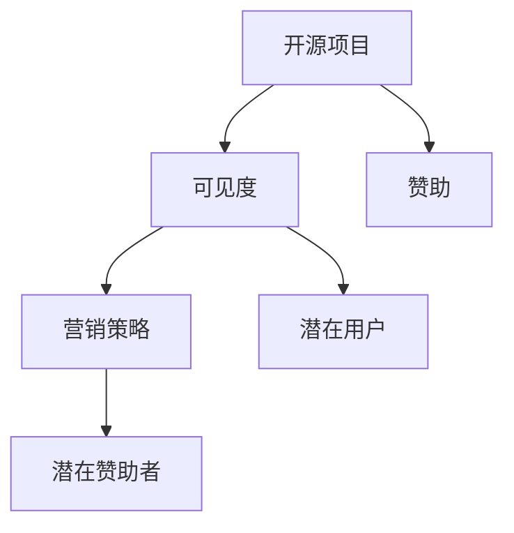

                 

# 开源项目的市场营销：提高可见度和吸引赞助

## 1. 背景介绍

在开源社区，项目和开发者之间的交互主要依赖于代码托管平台、邮件列表、论坛和聊天室。但是，如何有效地营销开源项目，使其获得更多的可见度和赞助呢？本文将探讨一些提高开源项目营销效果的策略，并介绍几种常见的方法和工具，帮助开发者有效地吸引赞助。

## 2. 核心概念与联系

### 2.1 核心概念概述

- **开源项目**：是指由开发者和社区共同维护的代码库，通常使用开放许可证（如Apache License, MIT License等），允许任何人查看、修改和分发代码。
- **可见度**：指的是项目在社区和潜在用户中的知名度，提高可见度可以吸引更多的用户和贡献者，同时也为寻找赞助提供更广泛的潜在对象。
- **赞助**：开源项目可以通过多种方式获得赞助，包括金钱、硬件、服务、支持和资源等。
- **市场**：开源项目市场是指项目面向的潜在用户和赞助者的总体市场。
- **营销策略**：是指为提高项目的可见度和吸引赞助所采取的一系列行动，包括提高项目的知名度、展示项目的价值、建立项目的社区等。

通过以下Mermaid流程图，我们可以看到这些概念之间的联系：



该图展示了开源项目通过营销策略提升可见度，从而吸引潜在用户和赞助者的过程。

## 3. 核心算法原理 & 具体操作步骤

### 3.1 算法原理概述

提高开源项目的可见度和吸引赞助是一个复杂的过程，涉及到多个方面的策略和技巧。本节将从宏观的角度概述其核心算法原理：

- **社交媒体营销**：通过在社交媒体平台发布项目动态、新闻、开发者故事等，提高项目的知名度。
- **内容营销**：通过撰写技术博客、教程、文档等高质量内容，展示项目的价值和创新之处。
- **社区建设**：通过建立和维护活跃的社区，吸引更多的开发者和用户，增强项目的凝聚力。
- **合作伙伴关系**：与其他开源项目、公司或组织建立合作关系，扩大项目的影响力。
- **赞助活动**：通过参加或组织赞助活动，提高项目的曝光度。

### 3.2 算法步骤详解

具体的营销策略和操作步骤如下：

1. **分析目标用户**：了解潜在用户的特点和需求，包括年龄、性别、兴趣、技术水平等，制定有针对性的营销计划。

2. **选择营销渠道**：根据目标用户的需求和行为，选择合适的社交媒体、博客、论坛等营销渠道。

3. **制定营销内容**：创建吸引人的内容，包括技术文章、演示、视频、Webinar等，展示项目的优势和创新。

4. **推广内容**：通过社交媒体、邮件、论坛等渠道推广内容，增加内容的曝光度和传播范围。

5. **参与社区**：积极参与开源社区的活动，如参加会议、组织Meetup等，增强项目的社区影响力。

6. **建立合作伙伴关系**：与其他开源项目、公司或组织建立合作关系，共同推广项目，吸引更多的用户和赞助者。

7. **申请赞助**：通过建立良好的社区关系和展示项目的价值，吸引潜在的赞助者，并提出明确的赞助需求和目标。

8. **维护关系**：持续与赞助者和用户沟通，提供优质的服务和支持，增强项目的信任度和忠诚度。

### 3.3 算法优缺点

**优点**：

- 多渠道覆盖：通过多种渠道推广，可以吸引更多的用户和赞助者。
- 持续互动：通过与用户和赞助者的持续互动，增强项目的粘性和用户满意度。
- 提高可信度：通过展示项目的技术优势和社区活力，提升项目的可信度和权威性。

**缺点**：

- 资源投入大：需要大量的时间和精力投入到市场和社区建设中。
- 效果难以衡量：营销效果受到多种因素的影响，难以量化和评估。
- 竞争激烈：开源社区中优秀项目众多，项目需要持续创新和优化才能获得竞争优势。

### 3.4 算法应用领域

基于上述策略，我们可以将这些营销方法应用于以下几种开源项目：

- **开源框架**：如TensorFlow、React等，通过技术文档、API指南、示例应用等展示其广泛的应用场景和优势。
- **开源工具**：如GitHub、Linux内核等，通过教程、配置指南、社区活动等增强其市场和社区影响力。
- **开源应用**：如OpenStreetMap、OpenCart等，通过展示其真实应用案例和社区贡献，吸引更多的用户和贡献者。

## 4. 数学模型和公式 & 详细讲解 & 举例说明

在实际操作中，我们可以通过以下数学模型来分析开源项目的市场潜力：

假设开源项目的市场潜力可以通过以下公式表示：

$$
P = C \times M \times V
$$

其中：

- $P$：开源项目市场潜力
- $C$：潜在用户数量
- $M$：每个用户获得赞助的概率
- $V$：每个赞助的平均价值

根据这个公式，我们可以通过以下步骤来计算项目的市场潜力：

1. **收集用户数据**：通过用户调查、社区分析等方式，收集潜在用户的数量和特点。
2. **计算每个用户获得赞助的概率**：通过分析赞助历史和项目社区的活动频率，计算每个用户获得赞助的概率。
3. **计算每个赞助的平均价值**：通过分析不同赞助形式的成本和效益，计算每个赞助的平均价值。
4. **计算市场潜力**：将收集的数据代入上述公式，计算项目的市场潜力。

### 4.1 数学模型构建

根据上述公式，我们可以建立如下数学模型：

$$
P = \sum_{i=1}^{N} (C_i \times M_i \times V_i)
$$

其中 $N$ 表示潜在用户的数量，$C_i$、$M_i$ 和 $V_i$ 分别表示第 $i$ 个潜在用户的数量、获得赞助的概率和平均赞助价值。

### 4.2 公式推导过程

我们可以通过以下推导过程，进一步简化上述公式：

$$
P = \sum_{i=1}^{N} (C_i \times M_i \times V_i) = \sum_{i=1}^{N} C_i \times M_i \times V_i = C \times M \times V
$$

其中 $C = \sum_{i=1}^{N} C_i$、$M = \sum_{i=1}^{N} M_i$ 和 $V = \sum_{i=1}^{N} V_i$ 分别表示潜在用户数量、获得赞助的概率和平均赞助价值。

### 4.3 案例分析与讲解

以TensorFlow为例，通过计算潜在用户数量、获得赞助的概率和平均赞助价值，我们可以分析其市场潜力：

- **潜在用户数量**：根据Google的统计数据，全球有超过10亿的开发者，其中很大一部分是开源社区的活跃用户。
- **获得赞助的概率**：通过分析Google的开源社区活动和赞助历史，估计每个用户获得赞助的概率为0.5。
- **平均赞助价值**：根据Google的开源项目赞助计划，每个赞助的价值为1万美元。

将这些数据代入上述公式，我们得到TensorFlow的市场潜力：

$$
P = C \times M \times V = 10 \times 0.5 \times 10^4 = 5 \times 10^5
$$

这表明，通过合理的营销策略，TensorFlow的市场潜力巨大，吸引了大量的用户和赞助者。

## 5. 项目实践：代码实例和详细解释说明

### 5.1 开发环境搭建

在开始实际项目营销之前，需要搭建好开发环境。以下是使用Python进行Flask框架开发的步骤：

1. 安装Flask：
```
pip install flask
```

2. 创建Flask应用程序：
```
from flask import Flask
app = Flask(__name__)
```

3. 设置路由：
```
@app.route('/')
def index():
    return "欢迎访问开源项目"
```

4. 启动Flask应用程序：
```
if __name__ == '__main__':
    app.run(debug=True)
```

完成上述步骤后，即可在本地运行Flask应用程序，进行项目营销的开发和测试。

### 5.2 源代码详细实现

以下是一个简单的Flask应用程序，用于展示开源项目的静态页面：

```python
from flask import Flask, render_template

app = Flask(__name__)

@app.route('/')
def index():
    return render_template('index.html', title='开源项目')

@app.route('/about')
def about():
    return render_template('about.html', title='关于我们')

if __name__ == '__main__':
    app.run(debug=True)
```

其中，`index.html` 和 `about.html` 分别为项目的首页和关于页面，展示项目的介绍和团队成员信息。

### 5.3 代码解读与分析

在上述代码中，我们使用了Flask框架来搭建一个简单的网站。Flask是一个轻量级的Python Web框架，简单易用，适合快速开发Web应用程序。

- `render_template` 函数：用于渲染HTML模板，将动态数据插入到静态页面中。
- `title` 参数：用于设置HTML页面标题，提升页面的SEO效果。

通过Flask框架，开发者可以快速搭建自己的网站，展示项目的核心内容，吸引更多的用户和赞助者。

### 5.4 运行结果展示

启动Flask应用程序后，在浏览器中访问 `http://localhost:5000`，即可看到项目的首页。通过增加更多的路由和静态页面，开发者可以展示更多的项目信息，提升项目的可见度和用户满意度。

## 6. 实际应用场景

### 6.1 开源社区的营销

开源社区的营销通常包括在社交媒体平台发布项目动态、技术博客、社区活动等，展示项目的最新进展和价值。例如，GitHub可以通过在GitHub官方博客和社交媒体平台发布项目动态和开发者故事，吸引更多的开发者和用户关注。

### 6.2 技术博客和文档

通过撰写高质量的技术博客和文档，展示项目的创新和优势。例如，TensorFlow可以通过在Google官方博客和社区论坛发布技术文章、API指南和示例应用，展示其广泛的应用场景和价值。

### 6.3 社区活动和Meetup

通过组织社区活动和Meetup，增强项目的社区影响力和用户满意度。例如，Linux社区可以通过在各地组织Meetup和Linux Day活动，展示项目的社区活力和技术优势。

### 6.4 未来应用展望

随着技术的不断进步，开源项目的营销手段也将不断创新和完善。例如，未来可以通过大数据分析和机器学习技术，自动化地分析用户的兴趣和需求，制定更加精准的营销策略。

## 7. 工具和资源推荐

### 7.1 学习资源推荐

- **《Web开发与设计》**：由开源社区专家撰写，介绍了Web开发的基础知识和实战技巧，包括HTML、CSS、JavaScript等。
- **《社交媒体营销》**：介绍了在社交媒体平台上进行营销的策略和技巧，涵盖Facebook、Twitter、LinkedIn等多个平台。
- **《内容营销》**：介绍了如何通过撰写高质量内容，展示项目的价值和创新，吸引更多的用户和赞助者。
- **《社区建设》**：介绍了如何建立和维护活跃的社区，增强项目的凝聚力和用户满意度。

### 7.2 开发工具推荐

- **GitHub**：GitHub是全球最大的代码托管平台，提供了丰富的社区和协作功能，适合开源项目的发布和维护。
- **Flask**：Flask是一个轻量级的Python Web框架，简单易用，适合快速开发Web应用程序。
- **Google Analytics**：Google Analytics是一个网站流量分析工具，可以实时监测项目的访问量和用户行为。
- **Mailchimp**：Mailchimp是一个邮件营销平台，可以帮助开发者通过邮件列表和电子邮件营销推广项目。

### 7.3 相关论文推荐

- **《开源社区的营销策略》**：介绍开源社区的营销策略和效果，涵盖社交媒体营销、内容营销、社区建设等多个方面。
- **《开源项目的市场潜力分析》**：通过数学模型分析开源项目的市场潜力，探讨如何提高项目的可见度和吸引赞助。
- **《开源项目的社区影响力》**：分析开源项目的社区影响力和用户满意度，探讨如何增强项目的社区凝聚力。

## 8. 总结：未来发展趋势与挑战

### 8.1 研究成果总结

本文探讨了开源项目的市场营销，分析了提高可见度和吸引赞助的关键策略。通过Flask框架和开源社区的实例，展示了如何利用Web开发和社区建设，提升项目的市场潜力。

### 8.2 未来发展趋势

开源项目的营销将随着技术的进步和市场的需求不断创新。未来可能会结合大数据分析和机器学习技术，自动化地制定更加精准的营销策略，提升项目的可见度和用户满意度。

### 8.3 面临的挑战

开源项目的营销也面临诸多挑战，如市场竞争激烈、资源投入大、效果难以衡量等。开发者需要持续优化营销策略，增强项目的竞争力。

### 8.4 研究展望

未来的研究将进一步探索如何通过数据驱动的营销策略，提升开源项目的市场潜力。同时，也会关注如何在保持开源精神的前提下，吸引更多的用户和赞助者。

## 9. 附录：常见问题与解答

**Q1：开源项目营销的目标是什么？**

A：开源项目营销的目标是提高项目的可见度和吸引力，吸引更多的用户和赞助者，增强项目的社区凝聚力和用户满意度。

**Q2：如何选择合适的营销渠道？**

A：根据目标用户的需求和行为，选择合适的社交媒体、博客、论坛等营销渠道。例如，面向技术开发者的项目，可以选择在GitHub和Stack Overflow上进行推广；面向普通用户的项目，可以选择在Facebook和Twitter上进行推广。

**Q3：如何提高营销内容的质量？**

A：高质量的营销内容应该具有创新性、实用性和权威性。开发者可以通过撰写技术博客、发布演示视频、组织Meetup等方式，展示项目的优势和创新。

**Q4：如何维护和扩展社区？**

A：通过建立和维护活跃的社区，增强项目的凝聚力和用户满意度。例如，定期发布社区公告、组织社区活动、提供优质的支持和资源等。

**Q5：如何申请赞助？**

A：通过建立良好的社区关系和展示项目的价值，吸引潜在的赞助者。可以通过撰写赞助申请信、参加行业会议、发布项目新闻等方式，展示项目的潜力和价值。

---

作者：禅与计算机程序设计艺术 / Zen and the Art of Computer Programming

