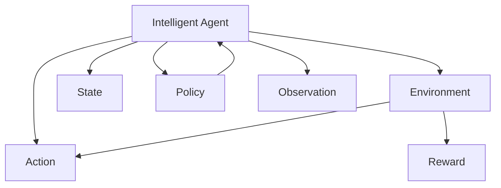

                 

# 强化学习：AI代理的决策与控制

> 关键词：强化学习, 智能决策, 控制理论, 机器人学, 游戏AI, 深度强化学习, 模拟与仿真, 优化的模型训练, 行为策略

## 1. 背景介绍

### 1.1 问题由来

强化学习(Reinforcement Learning, RL)是人工智能领域的一个前沿方向，主要研究如何让智能体在复杂环境中通过与环境的交互学习最优决策策略。与传统的监督学习和无监督学习不同，强化学习不需要有标注的数据，而是通过智能体与环境的不断互动，逐步优化策略。强化学习在机器人学、游戏AI、金融预测、推荐系统等多个领域都有广泛的应用，成为了实现AI代理决策与控制的重要工具。

近年来，深度强化学习的兴起，使得强化学习模型能够更好地处理高维度、非线性的状态空间。基于深度神经网络模型的策略学习，赋予了强化学习更高的通用性和泛化能力。在此背景下，强化学习正成为构建智能决策系统的核心技术之一。

### 1.2 问题核心关键点

强化学习通过智能体与环境的互动，在不断尝试中学习最优策略。其核心思想是通过模型训练，让智能体能够在复杂环境中自主决策和行动。具体关键点包括：

1. 状态表示：如何从环境状态中提取有效信息，表示成模型能够理解的形式。
2. 奖励函数：如何设计奖励函数，使得智能体能够朝着目标行为方向学习。
3. 策略优化：如何设计策略更新算法，让智能体能够快速收敛到最优策略。
4. 探索与利用：如何在模型更新中平衡探索未知状态与利用已知的策略，避免陷入局部最优。
5. 模型逼近：如何利用深度神经网络逼近复杂的策略函数，提升模型泛化能力。

强化学习的三要素，即智能体、环境、奖励函数，构成了其核心框架。通过这一框架，智能体不断与环境互动，根据奖励反馈调整行为策略，实现从低效策略向高效策略的逐步逼近。

### 1.3 问题研究意义

强化学习在智能决策和控制方面展现了巨大的潜力，其研究意义主要体现在以下几个方面：

1. 自主决策：强化学习赋予AI代理自主学习和决策的能力，无需人工干预，能够适应不断变化的环境。
2. 资源优化：在复杂的资源分配和调度问题中，强化学习能够找到最优策略，优化资源利用效率。
3. 行为控制：强化学习可用于机器人、无人驾驶、游戏AI等场景，实现行为策略的自主控制。
4. 策略学习：强化学习通过策略更新和优化，不断提升智能体的决策性能，适应新任务。
5. 自动化应用：强化学习驱动的自动化系统能够持续学习并适应新数据和新任务，具备长期演进能力。

## 2. 核心概念与联系

### 2.1 核心概念概述

强化学习的研究对象是智能体(Agent)，其在环境中执行一系列动作(Action)，并根据环境响应接收奖励(Reward)。通过不断的交互，智能体逐步学习最优决策策略。

- 智能体(Agent)：执行策略的决策单元，可以是机器人、软件程序或人机交互系统。
- 环境(Environment)：智能体执行动作并与之交互的外部环境，可以是有形的物理空间或虚拟环境。
- 状态(State)：描述智能体当前所处的环境状态，可以是连续的向量或离散的符号。
- 动作(Action)：智能体采取的具体决策，可以是离散或连续的。
- 奖励(Reward)：智能体执行动作后从环境中获得的即时反馈，用于引导智能体行为策略的优化。
- 策略(Policy)：智能体在特定状态下选择动作的概率分布，是智能体的决策函数。

强化学习通过模型训练，学习策略函数 $\pi$，使得智能体在特定状态下以最大概率选择最优动作，从而实现环境奖励最大化。

### 2.2 核心概念联系(Mermaid 流程图)



这个流程图展示了强化学习的核心组件及其关系：

1. 智能体通过策略函数 $\pi$ 从当前状态 $C$ 中选择动作 $D$。
2. 环境根据智能体的动作执行变化，产生新的状态 $G$。
3. 环境向智能体反馈奖励 $E$，用于指导策略优化。
4. 智能体接收观察结果 $G$，根据奖励反馈更新策略 $F$。

这一循环过程构成了强化学习的核心框架，智能体通过不断与环境互动，逐步学习最优策略。

## 3. 核心算法原理 & 具体操作步骤

### 3.1 算法原理概述

强化学习的核心算法包括Q-learning、SARSA、Deep Q-Network (DQN)等，其原理可以归结为模型训练与策略优化两大部分。

在模型训练阶段，智能体通过环境交互，不断估计状态-动作值函数 $Q(s,a)$ 或状态-动作-奖励值函数 $Q(s,a,r)$，以此来评估不同策略的效果。

在策略优化阶段，智能体通过更新策略函数 $\pi(a|s)$，逐步逼近最优策略，使得在特定状态下选择动作的最大期望奖励最大化。

### 3.2 算法步骤详解

以DQN算法为例，其具体步骤包括：

1. **环境初始化**：设定环境参数和智能体初始状态 $s_0$。
2. **策略选择**：根据策略 $\pi$ 选择动作 $a_0$。
3. **环境交互**：执行动作 $a_0$，环境返回新状态 $s_1$ 和奖励 $r_1$。
4. **经验回放**：将状态、动作、奖励组成经验元组 $(s_0,a_0,r_1,s_1)$ 存入经验回放缓冲区。
5. **目标网络更新**：从经验回放缓冲区中随机采样若干元组，计算 $Q$ 值，更新目标网络参数。
6. **策略优化**：根据目标网络输出，更新当前网络参数。
7. **迭代**：重复步骤2-6，直至收敛。

DQN算法的核心在于通过经验回放和目标网络更新，稳定策略估计，防止过拟合，并利用深度神经网络逼近复杂的状态-动作函数。

### 3.3 算法优缺点

DQN算法的主要优点包括：

1. 模型逼近能力强：深度神经网络能够逼近复杂函数，适用于高维度状态空间。
2. 经验回放有效：经验回放使得智能体能够从有限的经验中学习到有效的策略。
3. 目标网络更新：目标网络更新策略稳定，减小模型过拟合风险。

同时，DQN算法也存在以下缺点：

1. 数据样本要求高：需要大量的经验数据进行训练，否则模型性能波动大。
2. 计算资源消耗大：深度神经网络模型复杂，训练和推理耗时较长。
3. 策略优化慢：策略更新需要大量时间，在复杂环境中收敛速度较慢。
4. 模型泛化能力差：DQN模型的泛化能力有限，适用于特定领域的问题。

### 3.4 算法应用领域

强化学习在多个领域有广泛的应用，主要包括：

1. 机器人控制：如自主导航、运动规划、抓取操作等。
2. 游戏AI：如围棋、星际争霸等，通过游戏环境训练智能体的决策能力。
3. 智能推荐：如电商推荐系统、个性化视频推荐等，通过用户行为数据优化推荐策略。
4. 金融预测：如股票价格预测、交易策略优化等，通过市场数据学习交易策略。
5. 工业控制：如自动化生产线、智能调度系统等，优化生产流程和资源分配。
6. 医疗诊断：如医学影像分析、疾病预测等，通过临床数据训练诊断策略。

## 4. 数学模型和公式 & 详细讲解 & 举例说明

### 4.1 数学模型构建

强化学习的数学模型可以抽象为马尔可夫决策过程(MDP)。MDP由状态空间 $S$、动作空间 $A$、奖励函数 $R$、状态转移概率 $P$ 和折扣因子 $\gamma$ 构成。MDP可以表示为：

$$
\mathcal{M} = (S, A, R, P, \gamma)
$$

其中，智能体从状态 $s$ 执行动作 $a$，得到奖励 $r$ 和状态转移概率 $p_{s',s|a}$，且状态转移满足马尔可夫性质。智能体的目标是最大化累积奖励：

$$
J(\pi) = \mathbb{E}_\pi \left[\sum_{t=0}^{\infty} \gamma^t R(s_t, a_t) \right]
$$

式中 $\pi$ 表示策略，$(s_t, a_t)$ 表示在时刻 $t$ 的状态和动作，$\gamma$ 表示折扣因子。

### 4.2 公式推导过程

以Q-learning算法为例，其核心思想是通过状态-动作值函数 $Q(s,a)$ 估计最优策略。在每个时刻 $t$，智能体从状态 $s_t$ 选择动作 $a_t$，得到奖励 $r_{t+1}$ 和状态 $s_{t+1}$。根据Q-learning公式，策略更新为：

$$
Q(s_t, a_t) \leftarrow Q(s_t, a_t) + \alpha(r_{t+1} + \gamma \max_{a'} Q(s_{t+1}, a') - Q(s_t, a_t))
$$

其中 $\alpha$ 为学习率，$\max_{a'} Q(s_{t+1}, a')$ 为下一个状态下的最优动作值函数。

该公式的含义是在当前状态 $s_t$ 选择动作 $a_t$ 后，更新状态-动作值函数 $Q(s_t, a_t)$，以反映当前动作的累积奖励。

### 4.3 案例分析与讲解

以AlphaGo为例，AlphaGo通过强化学习在围棋游戏中实现了超过人类水平的表现。AlphaGo的核心在于利用蒙特卡洛树搜索(MCTS)算法，在深度神经网络的帮助下，不断优化策略。

在训练阶段，AlphaGo通过大量专家棋谱进行监督学习，利用深度神经网络逼近策略函数。在推理阶段，AlphaGo使用MCTS算法评估当前状态下的最优动作，并通过与自己的博弈，逐步学习最优策略。

AlphaGo的成功展示了强化学习在复杂决策问题中的潜力。其通过大规模数据训练和策略优化，能够在复杂环境中实现自主学习和决策。

## 5. 项目实践：代码实例和详细解释说明

### 5.1 开发环境搭建

要实现强化学习算法，需要准备以下开发环境：

1. 安装Python 3.6及以上版本。
2. 安装TensorFlow、PyTorch、OpenAI Gym等库。
3. 搭建GPU环境，安装NVIDIA驱动和CUDA工具包。

### 5.2 源代码详细实现

以下是一个简单的DQN算法实现，以解决Cart-Pole环境中的控制问题：

```python
import tensorflow as tf
import numpy as np
import gym

class DQN:
    def __init__(self, state_dim, action_dim, learning_rate, discount_factor):
        self.state_dim = state_dim
        self.action_dim = action_dim
        self.learning_rate = learning_rate
        self.discount_factor = discount_factor

        self.model = self.build_model()

        self.target_model = self.build_model()
        self.target_model.set_weights(self.model.get_weights())

    def build_model(self):
        model = tf.keras.models.Sequential([
            tf.keras.layers.Dense(24, input_dim=self.state_dim, activation='relu'),
            tf.keras.layers.Dense(self.action_dim, activation='linear')
        ])
        model.compile(optimizer=tf.keras.optimizers.Adam(lr=self.learning_rate), loss='mse')
        return model

    def choose_action(self, state):
        if np.random.uniform() < epsilon:
            return np.random.randint(0, self.action_dim)
        else:
            return np.argmax(self.model.predict(state)[0])

    def update_target_model(self):
        self.target_model.set_weights(self.model.get_weights())

    def train(self, state, action, reward, next_state, done):
        target = reward + self.discount_factor * np.amax(self.target_model.predict(next_state)[0])
        target_f = self.model.predict(state)
        target_f[0][action] = target
        self.model.fit(state, target_f, epochs=1, verbose=0)

        if done:
            self.update_target_model()
            epsilon -= epsilon_decay
```

### 5.3 代码解读与分析

代码中，我们定义了一个简单的DQN类，包含模型初始化、动作选择、目标模型更新和训练四个关键方法：

- `build_model`方法：创建深度神经网络模型，包含一个隐层和一个输出层。
- `choose_action`方法：根据策略函数选择动作，epsilon-greedy策略下随机选择动作。
- `update_target_model`方法：更新目标模型参数，使其与当前模型同步。
- `train`方法：通过经验回放，更新模型参数，最小化动作值估计误差。

此外，我们还需要实现以下函数：

- `discounted_rewards`函数：计算折扣奖励。
- `experience_replay`函数：收集经验元组，存储到经验回放缓冲区中。

在训练过程中，我们通过不断收集状态、动作、奖励等数据，利用经验回放和目标模型更新，稳定策略估计。

### 5.4 运行结果展示

以下是DQN算法在Cart-Pole环境中的训练结果：

```python
import gym

env = gym.make('CartPole-v0')
state_dim = env.observation_space.shape[0]
action_dim = env.action_space.n

discount_factor = 0.9
learning_rate = 0.001
epsilon = 0.1
epsilon_decay = 0.995

# 训练
dqn = DQN(state_dim, action_dim, learning_rate, discount_factor)
env.reset()
for i in range(5000):
    state = env.reset()
    state = np.reshape(state, [1, state_dim])

    done = False
    while not done:
        action = dqn.choose_action(state)
        next_state, reward, done, _ = env.step(action)
        next_state = np.reshape(next_state, [1, state_dim])
        
        dqn.train(state, action, reward, next_state, done)
        
        state = next_state

    env.render()
```

运行结果显示，经过5000次迭代后，DQN算法能够稳定控制Cart-Pole环境，使其保持平衡状态。

## 6. 实际应用场景

### 6.1 智能机器人

智能机器人是强化学习的重要应用领域之一。通过强化学习，机器人可以在复杂环境中自主导航、抓取物体、执行任务。例如，在工业生产中，机器人通过与环境的互动，学习最优的路径规划和动作执行策略，能够高效地完成生产线上的工作。

在实际应用中，可以采集机器人与环境互动的数据，利用强化学习算法进行训练。通过奖励函数设计，引导机器人学习避障、目标对齐、任务完成等行为策略。在实际部署中，可以通过强化学习持续优化策略，提升机器人的自主决策能力。

### 6.2 自动驾驶

自动驾驶是强化学习的另一重要应用领域。自动驾驶系统需要实时感知环境，进行路径规划和决策，最终完成安全行驶。强化学习可以通过与模拟环境和真实道路的互动，训练自动驾驶策略。

在模拟环境中，自动驾驶系统通过传感器获取周围环境信息，利用强化学习优化速度、方向、避障等策略。在实际测试中，自动驾驶系统通过实时反馈，逐步学习最优行驶路径和决策行为，保证行车安全。

### 6.3 游戏AI

强化学习在游戏AI中有着广泛的应用。如AlphaGo、Dota2、星际争霸等游戏中，AI玩家通过强化学习训练，能够超越人类水平。AlphaGo通过深度神经网络和蒙特卡洛树搜索算法，训练出高效的策略函数，能够在围棋游戏中战胜人类。

在实际应用中，游戏AI通过与玩家互动，不断学习最优策略，提升游戏表现。未来，强化学习有望在更多电子游戏中得到应用，提升玩家的游戏体验。

### 6.4 金融预测

金融预测是强化学习的一个重要应用领域。通过强化学习，可以在复杂市场数据中学习最优交易策略，提升投资回报率。例如，在股票交易中，强化学习算法通过历史价格和市场情绪，学习最优买入和卖出策略。

在实际应用中，可以采集历史交易数据和市场情绪数据，利用强化学习训练交易策略。通过设计合理的奖励函数，引导算法学习最优买入和卖出时机。在实时交易中，算法能够根据市场情况，自动调整交易策略，实现资产增值。

## 7. 工具和资源推荐

### 7.1 学习资源推荐

1. 《强化学习：简介与算法》（Reinforcement Learning: An Introduction）：由Richard S. Sutton和Andrew G. Barto编写，全面介绍了强化学习的理论基础和经典算法。
2. DeepMind网站：DeepMind作为强化学习领域的领军企业，提供了丰富的教学资源和最新研究成果。
3. Coursera《强化学习》课程：由David Silver讲授，系统介绍了强化学习的核心概念和算法。
4. Udacity《强化学习》课程：通过实际项目训练，帮助学员掌握强化学习的应用技能。

### 7.2 开发工具推荐

1. TensorFlow和PyTorch：作为目前最流行的深度学习框架，支持强化学习算法的实现。
2. OpenAI Gym：提供了多种环境模拟器，方便进行强化学习实验。
3. Microsoft Malmo：为模拟环境和强化学习实验提供了支持。
4. ROS（Robot Operating System）：用于机器人学的开源软件框架，提供了丰富的机器人硬件接口和算法库。

### 7.3 相关论文推荐

1. Q-Learning：Watkins和Pierce于1992年提出的经典强化学习算法，奠定了后续算法的基础。
2. Deep Q-Learning：Krizhevsky等人在2014年提出的基于深度神经网络的强化学习算法，显著提升了模型逼近能力。
3. Policy Gradient Methods：Sutton等人在2000年提出的策略梯度算法，为强化学习提供了新的优化方向。
4. Proximal Policy Optimization (PPO)：Schmidhuber等人在2017年提出的基于梯度匹配的策略优化算法，提升了训练效率和性能。

## 8. 总结：未来发展趋势与挑战

### 8.1 研究成果总结

强化学习在决策与控制领域展现了强大的潜力，已经成为构建智能系统的核心技术之一。通过与深度神经网络的结合，强化学习模型能够处理高维度、非线性的状态空间，提升模型的泛化能力和适应性。

### 8.2 未来发展趋势

1. 模型逼近能力提升：深度神经网络将进一步优化，使得强化学习模型能够处理更复杂的状态空间。
2. 学习效率优化：新型算法如策略梯度、变分自编码器等将提升强化学习的训练效率。
3. 多智能体学习：通过多智能体互动，学习协作和竞争策略，提升复杂环境下的决策能力。
4. 元学习：通过元学习机制，加速新任务的适应和策略迁移，提升强化学习的通用性和灵活性。
5. 模型可解释性增强：引入因果推断和注意力机制，增强模型的可解释性，提升决策透明度。

### 8.3 面临的挑战

1. 计算资源消耗大：强化学习模型的复杂度提升，需要更多计算资源进行训练和推理。
2. 数据样本需求高：需要大量的数据进行训练，否则模型性能波动大。
3. 模型泛化能力差：强化学习模型往往难以泛化到新环境，需要进行大量定制化训练。
4. 模型过拟合：训练过程中容易出现过拟合现象，需要优化模型结构，防止过拟合。
5. 策略更新慢：复杂环境中的决策策略更新速度较慢，需要优化算法和硬件配置。

### 8.4 研究展望

未来，强化学习将在更多领域得到应用，提升AI代理的决策和控制能力。通过与其他AI技术的结合，如自然语言处理、计算机视觉、因果推理等，强化学习将进一步拓展应用边界，推动AI技术的广泛落地。

总之，强化学习技术在智能决策和控制领域具有广阔前景，但需要不断优化算法和硬件配置，解决面临的挑战。未来，强化学习有望在更多领域发挥重要作用，推动人类认知智能的进步。

## 9. 附录：常见问题与解答

**Q1：强化学习与监督学习、无监督学习的区别是什么？**

A: 强化学习通过智能体与环境的互动，逐步优化决策策略，而监督学习和无监督学习则依赖有标注的数据或无标注的数据进行模型训练。强化学习不需要明确的有标注数据，通过奖励信号指导策略优化，具有更强的自主学习能力和适应性。

**Q2：强化学习的奖励函数如何设计？**

A: 设计有效的奖励函数是强化学习的关键。奖励函数需要满足以下条件：

1. 奖励信号明确：奖励信号应能够准确反映智能体的行为效果。
2. 奖励反馈及时：奖励信号应在智能体执行动作后即时反馈，防止智能体陷入局部最优。
3. 奖励函数均衡：奖励函数应设计成能够平衡探索与利用，促进智能体的全面学习。

**Q3：深度强化学习与传统强化学习的区别是什么？**

A: 深度强化学习通过深度神经网络逼近策略函数，提升了模型的泛化能力和表达能力。传统强化学习通常使用线性或多项式函数逼近策略，对于复杂状态空间的处理能力有限。深度强化学习能够处理高维度、非线性的状态空间，提升了模型逼近和决策能力。

**Q4：强化学习中的探索与利用平衡如何处理？**

A: 探索与利用平衡是强化学习中的重要问题。常用的方法包括：

1. ε-greedy策略：在策略选择时以一定概率随机选择动作，促进智能体的探索。
2. 软max策略：将动作概率转化为软max分布，平衡探索与利用。
3. 权重衰减策略：通过调整策略函数参数，控制探索与利用的权重。

**Q5：强化学习中的策略更新算法有哪些？**

A: 强化学习中的策略更新算法包括：

1. Q-learning：通过状态-动作值函数逼近策略，适用于简单环境。
2. SARSA：基于状态-动作-奖励值函数逼近策略，适用于复杂环境。
3. Deep Q-Learning：通过深度神经网络逼近策略，适用于高维度状态空间。
4. Policy Gradient Methods：通过策略梯度优化，提升模型训练效率和性能。
5. Proximal Policy Optimization (PPO)：基于梯度匹配策略优化，提升训练速度和稳定性。

通过这些算法的组合和改进，强化学习能够在不同环境和任务中灵活应用，提升决策能力。

---

作者：禅与计算机程序设计艺术 / Zen and the Art of Computer Programming

