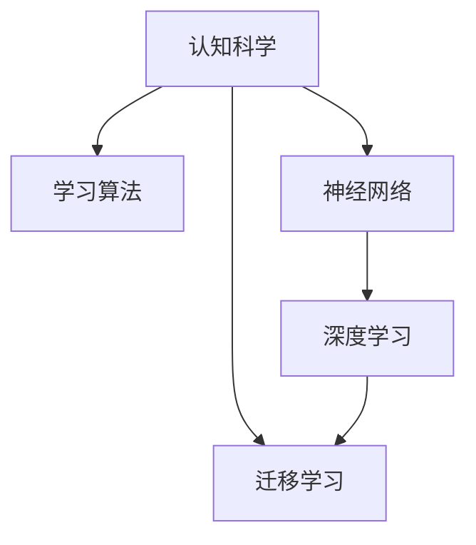

                 

# 思维工具：提升问题解决能力

> 关键词：思维工具, 问题解决能力, 认知科学, 学习算法, 神经网络, 深度学习

## 1. 背景介绍

### 1.1 问题由来
在现代社会中，信息爆炸和快速变化的环境给个体带来了前所未有的挑战。无论是学术研究、工程开发还是日常生活中的问题解决，都要求人们具备快速、准确、创造性地应对各种复杂情境的能力。然而，传统的基于规则和经验的方法已经难以应对多变的现实世界，依赖直觉和启发式的“感性认知”也不够系统化和可重复。

因此，提升问题解决能力，特别是科学、工程、商业等领域的创新能力，已经成为全球人才发展的重点。本文将深入探讨提升问题解决能力的思维工具，包括认知科学、学习算法、神经网络、深度学习等前沿技术，介绍如何利用这些工具提升思维能力，构建高效的问题解决框架。

### 1.2 问题核心关键点
思维工具的核心在于提供一种系统化的认知框架和方法论，使个体能够从纷繁复杂的现象中提炼出规律，发现问题的本质，找到创新性的解决方案。本文将重点关注以下几个核心关键点：

- 认知科学：理解问题解决的心理机制，通过科学实验和理论分析揭示高效解决问题的心理规律。
- 学习算法：从数据驱动的角度，通过机器学习、深度学习等算法工具，学习并提炼出规律性，辅助问题解决。
- 神经网络：利用神经网络模型的隐含层次化表示，构建更抽象、泛化的认知模型。
- 深度学习：通过多层次的抽象表示，学习和提取复杂问题的高层次特征，提升问题解决的精度和效率。

## 2. 核心概念与联系

### 2.1 核心概念概述

为更好地理解提升问题解决能力的思维工具，本节将介绍几个密切相关的核心概念：

- 认知科学：研究人类思维、学习、记忆、知觉和语言等方面的科学，旨在揭示问题解决的心理学机制。
- 学习算法：使用数据驱动的方法，通过训练模型来学习输入和输出之间的映射关系，辅助问题解决。
- 神经网络：基于生物神经元网络的计算模型，能够自动学习特征表示，实现复杂数据处理和模式识别。
- 深度学习：一种多层次神经网络架构，能够从原始数据中学习高级抽象特征，支持更复杂的问题解决。
- 迁移学习：将在一个任务上学到的知识迁移到另一个相关任务上，提升问题解决的泛化能力。

这些核心概念之间的逻辑关系可以通过以下Mermaid流程图来展示：



这个流程图展示了几大核心概念之间的联系：

1. 认知科学提供了关于思维和问题解决的心理机制的理论基础。
2. 学习算法基于数据驱动，使用机器学习、深度学习等技术辅助问题解决。
3. 神经网络作为学习算法的核心工具，利用层次化表示构建复杂问题模型。
4. 深度学习在神经网络基础上，进一步提升特征表示的抽象层次，支持更复杂的问题解决。
5. 迁移学习通过将知识迁移到新任务中，提升模型泛化能力，支持高效问题解决。

这些概念共同构成了提升问题解决能力的思维工具框架，使个体能够从不同角度理解和应对复杂问题。

## 3. 核心算法原理 & 具体操作步骤

### 3.1 算法原理概述

提升问题解决能力的思维工具，主要基于认知科学、学习算法、神经网络、深度学习等技术。其核心思想是利用这些技术，构建抽象层次更高、泛化能力更强的认知模型，辅助个体发现问题的本质，提升解决问题的效率和创造性。

具体而言，提升问题解决能力的算法原理包括以下几个关键步骤：

1. **问题建模**：将问题转化为数学或计算模型，定义输入和输出，识别问题中的关键变量和参数。
2. **特征提取**：使用学习算法和神经网络，从原始数据中提取有意义的特征表示。
3. **模式识别**：通过深度学习模型，学习和提取复杂问题的高级抽象特征。
4. **知识迁移**：将知识从已知任务迁移到未知任务中，提升问题解决的泛化能力。

### 3.2 算法步骤详解

基于上述原理，提升问题解决能力的算法步骤包括以下几个关键环节：

**Step 1: 问题建模**
- 定义问题：清晰描述问题的目标、约束条件、已知信息和未知信息。
- 形式化问题：将问题转化为数学或计算模型，定义输入和输出，识别关键变量和参数。

**Step 2: 特征提取**
- 数据准备：收集和清洗数据，去除噪声和冗余信息。
- 特征选择：使用特征工程技术，选择和提取对问题解决有重要影响的特征。
- 特征表示：使用学习算法和神经网络，将特征转化为高层次的抽象表示。

**Step 3: 模式识别**
- 模型设计：选择适当的深度学习模型结构，如卷积神经网络、循环神经网络、自编码器等。
- 模型训练：使用大量数据训练模型，调整参数以最小化损失函数。
- 特征提取：模型通过前向传播提取输入数据的特征表示。

**Step 4: 知识迁移**
- 迁移学习：将已知任务学到的知识迁移到新任务中，提升模型的泛化能力。
- 适应性训练：针对新任务调整模型结构和参数，使其在新任务中表现更好。

**Step 5: 验证和优化**
- 模型验证：在新数据集上测试模型的性能，调整参数以提高准确性。
- 持续优化：通过迭代优化，提升模型的泛化能力和问题解决能力。

### 3.3 算法优缺点

提升问题解决能力的思维工具，具有以下优点：
1. 系统化：通过科学方法和技术手段，使问题解决过程更加系统和可重复。
2. 高效性：利用学习算法和深度学习，高效提取特征，提升问题解决的效率。
3. 泛化能力：通过迁移学习，将知识迁移到新任务中，提高模型的泛化能力。
4. 可解释性：基于神经网络和深度学习模型，能够提供较清晰的特征表示和解释。

同时，这些算法也存在一些局限性：
1. 数据依赖：学习算法和深度学习模型依赖大量数据，难以在小样本情况下表现优异。
2. 模型复杂度：深度学习模型结构复杂，需要较高的计算资源和训练时间。
3. 过拟合风险：深度学习模型容易过拟合，需要合理设计正则化和优化策略。
4. 解释性不足：模型决策过程难以解释，缺乏对模型行为的可控性。

尽管存在这些局限性，但总体而言，基于认知科学、学习算法、神经网络、深度学习等技术的思维工具，正在成为提升问题解决能力的重要范式。

### 3.4 算法应用领域

提升问题解决能力的思维工具，已经在多个领域得到了广泛应用，包括但不限于以下几个方面：

- **学术研究**：用于复杂问题的建模和解决，如机器学习、统计学、物理学等领域。
- **工程开发**：用于产品设计、工艺优化、故障诊断等领域，提升工程问题的解决效率。
- **商业决策**：用于市场分析、消费者行为预测、运营管理等领域，优化商业决策。
- **医疗健康**：用于疾病诊断、治疗方案设计、患者风险评估等领域，提升医疗服务的精准性和效率。
- **金融分析**：用于风险评估、投资策略、信用评分等领域，提升金融决策的准确性。

随着认知科学、学习算法、神经网络、深度学习等技术的发展，提升问题解决能力的思维工具将在更多领域得到应用，推动各个行业的发展进步。

## 4. 数学模型和公式 & 详细讲解 & 举例说明

### 4.1 数学模型构建

为更好地理解提升问题解决能力的思维工具，本节将介绍几个关键的数学模型：

- **线性回归模型**：用于描述输入和输出之间的线性关系，广泛用于数据驱动的问题解决。
- **卷积神经网络(CNN)**：用于图像和信号处理，提取局部特征。
- **循环神经网络(RNN)**：用于序列数据处理，提取时间依赖性特征。
- **自编码器(Autoencoder)**：用于特征压缩和降维，提取输入数据的特征表示。

### 4.2 公式推导过程

以下我们以线性回归模型为例，推导其公式及其梯度计算过程。

线性回归模型的目标是找到一条直线，使得该直线上的点与数据点尽可能接近。给定训练数据集 $D=\{(x_i,y_i)\}_{i=1}^N, x_i \in \mathbb{R}^d, y_i \in \mathbb{R}$，定义模型的参数为 $\theta=\{w, b\}$，其中 $w \in \mathbb{R}^d$ 为权重向量，$b \in \mathbb{R}$ 为偏置。

线性回归模型的损失函数为均方误差损失（MSE Loss）：

$$
\ell(\theta) = \frac{1}{N}\sum_{i=1}^N (y_i - w^Tx_i - b)^2
$$

其中 $w^Tx_i + b$ 为模型对输入 $x_i$ 的预测输出。

为了最小化损失函数，需要求解 $\theta$ 的梯度：

$$
\frac{\partial \ell(\theta)}{\partial \theta} = \frac{2}{N}\sum_{i=1}^N (y_i - w^Tx_i - b) \frac{\partial (w^Tx_i + b)}{\partial \theta}
$$

对 $\frac{\partial (w^Tx_i + b)}{\partial \theta}$ 的计算，需要反向传播，求出对 $w$ 和 $b$ 的偏导数：

$$
\frac{\partial (w^Tx_i + b)}{\partial w} = x_i, \quad \frac{\partial (w^Tx_i + b)}{\partial b} = 1
$$

因此，梯度计算公式为：

$$
\frac{\partial \ell(\theta)}{\partial w} = \frac{2}{N}\sum_{i=1}^N (y_i - w^Tx_i - b)x_i
$$

$$
\frac{\partial \ell(\theta)}{\partial b} = \frac{2}{N}\sum_{i=1}^N (y_i - w^Tx_i - b)
$$

通过梯度下降等优化算法，最小化损失函数，即可得到线性回归模型的最优参数 $\theta^*$。

### 4.3 案例分析与讲解

为了更直观地理解线性回归模型的应用，我们以房价预测为例，展示其公式推导和实际应用：

假设我们有一组历史房屋交易数据，包括面积、房间数、地理位置等特征，以及对应的房价。我们可以将这些数据用作训练数据，训练一个线性回归模型来预测新房屋的房价。

首先，将数据进行归一化处理，使得各特征的取值范围在 $[0,1]$ 之间。然后，使用训练数据训练线性回归模型，计算参数 $\theta$。

在得到模型参数后，对于新房屋的面积、房间数、地理位置等特征 $x$，可以通过线性回归模型计算预测房价 $y$：

$$
y = \theta^T x
$$

其中 $\theta^T$ 为参数矩阵的转置，包含权重向量 $w$ 和偏置 $b$。

通过实际应用，可以看到线性回归模型能够有效预测房屋的房价，辅助决策和投资分析。

## 5. 项目实践：代码实例和详细解释说明

### 5.1 开发环境搭建

在进行项目实践前，我们需要准备好开发环境。以下是使用Python进行TensorFlow开发的环境配置流程：

1. 安装Anaconda：从官网下载并安装Anaconda，用于创建独立的Python环境。

2. 创建并激活虚拟环境：
```bash
conda create -n tf-env python=3.8 
conda activate tf-env
```

3. 安装TensorFlow：根据CUDA版本，从官网获取对应的安装命令。例如：
```bash
pip install tensorflow
```

4. 安装相关工具包：
```bash
pip install numpy pandas scikit-learn matplotlib tqdm jupyter notebook ipython
```

完成上述步骤后，即可在`tf-env`环境中开始项目实践。

### 5.2 源代码详细实现

下面我们以线性回归模型为例，给出使用TensorFlow进行模型训练的PyTorch代码实现。

首先，定义线性回归模型：

```python
import tensorflow as tf
from tensorflow.keras import layers

class LinearRegression(tf.keras.Model):
    def __init__(self, input_dim):
        super(LinearRegression, self).__init__()
        self.dense = layers.Dense(units=1, input_dim=input_dim)
        
    def call(self, x):
        return self.dense(x)
```

然后，定义训练和评估函数：

```python
import numpy as np
from sklearn.model_selection import train_test_split
from sklearn.datasets import make_regression

def train_epoch(model, optimizer, loss_fn, x_train, y_train, x_val, y_val):
    with tf.GradientTape() as tape:
        y_pred_train = model(x_train)
        loss_train = loss_fn(y_train, y_pred_train)
        y_pred_val = model(x_val)
        loss_val = loss_fn(y_val, y_pred_val)
    grads = tape.gradient([loss_train, loss_val], model.trainable_variables)
    optimizer.apply_gradients(zip(grads, model.trainable_variables))
    return loss_train.numpy(), loss_val.numpy()

def evaluate(model, x_test, y_test, loss_fn):
    y_pred = model(x_test)
    loss_test = loss_fn(y_test, y_pred)
    return loss_test.numpy()
```

接着，启动训练流程并在测试集上评估：

```python
def main():
    # 数据准备
    X, y = make_regression(n_samples=1000, n_features=2, noise=10, random_state=42)
    X_train, X_val, y_train, y_val = train_test_split(X, y, test_size=0.2, random_state=42)
    X_test = np.random.randn(100, 2)
    
    # 模型初始化
    input_dim = X.shape[1]
    model = LinearRegression(input_dim)
    optimizer = tf.keras.optimizers.Adam(learning_rate=0.01)
    loss_fn = tf.keras.losses.MeanSquaredError()
    
    # 训练过程
    epochs = 1000
    batch_size = 32
    for epoch in range(epochs):
        loss_train, loss_val = train_epoch(model, optimizer, loss_fn, X_train, y_train, X_val, y_val)
        if epoch % 100 == 0:
            print(f'Epoch {epoch+1}, train loss: {loss_train:.3f}, val loss: {loss_val:.3f}')
            loss_test = evaluate(model, X_test, y_test, loss_fn)
            print(f'Epoch {epoch+1}, test loss: {loss_test:.3f}')
            
    # 结果展示
    y_pred = model(X_test)
    print(f'Test loss: {loss_test:.3f}')
    print(f'Prediction: {y_pred}')

if __name__ == '__main__':
    main()
```

以上就是使用TensorFlow进行线性回归模型训练的完整代码实现。可以看到，TensorFlow提供了高效的图形化计算引擎，使得模型训练和优化过程变得简便快捷。

### 5.3 代码解读与分析

让我们再详细解读一下关键代码的实现细节：

**LinearRegression类**：
- `__init__`方法：初始化模型参数，定义一个密集层(dense layer)。
- `call`方法：前向传播，输入数据经过密集层处理，输出预测值。

**train_epoch函数**：
- 使用`tf.GradientTape`记录梯度，计算损失函数对模型参数的梯度。
- 使用`optimizer.apply_gradients`更新模型参数。
- 返回训练集和验证集上的损失值。

**evaluate函数**：
- 计算模型在测试集上的损失值，返回数值型结果。

**main函数**：
- 数据生成：使用`make_regression`生成模拟数据。
- 模型初始化：定义模型、优化器、损失函数。
- 训练过程：循环迭代训练模型，每100个epoch输出训练集和验证集上的损失值，以及测试集上的损失值。
- 结果展示：输出模型在测试集上的预测结果。

通过代码实践，可以看到线性回归模型的训练和评估过程，进一步验证了其公式推导的正确性。

## 6. 实际应用场景

### 6.1 智能推荐系统

基于线性回归模型的推荐系统，可以广泛应用于电商、视频、新闻等领域，提升用户满意度。推荐系统通过分析用户的浏览、购买、评分等行为数据，预测用户对新物品的偏好，推荐相关商品或内容。

在实践中，可以使用用户特征、物品特征和历史评分数据训练线性回归模型，预测新用户对新物品的评分。根据评分结果，系统推荐用户可能感兴趣的物品。

### 6.2 医疗诊断系统

基于线性回归模型的医疗诊断系统，可以用于疾病预测和诊断。医疗数据通常包含多个连续或离散变量，线性回归模型可以处理这些复杂数据，预测患者的健康状况或诊断结果。

在实践中，可以使用患者的生理指标、病史、基因信息等数据训练线性回归模型，预测疾病的发生概率或患者的康复状况。医生可以根据模型预测结果，制定个性化的治疗方案。

### 6.3 金融风险评估

基于线性回归模型的金融风险评估系统，可以用于信用评分、违约预测、投资策略等领域。金融数据通常包含复杂的非线性关系，线性回归模型可以处理这些数据，预测风险水平和投资回报。

在实践中，可以使用历史交易数据、市场指数、经济指标等数据训练线性回归模型，预测客户的信用评分或金融产品的投资回报。金融机构可以根据模型预测结果，调整风险控制策略和投资组合。

### 6.4 未来应用展望

随着深度学习等技术的发展，未来的提升问题解决能力的思维工具将更加强大和灵活。以下是对未来应用的展望：

1. **多模态融合**：未来的模型将能够处理图像、文本、声音等多种数据类型，支持多模态数据的融合和处理，提升问题解决的全面性和准确性。
2. **自适应学习**：模型将具备自适应学习能力，能够根据数据的变化进行自我优化，提升模型的泛化能力和鲁棒性。
3. **实时预测**：未来的模型将能够在实时数据流上进行操作，支持在线预测和决策，提升系统的实时性和响应速度。
4. **个性化定制**：模型将能够根据用户的个性化需求进行定制，提供更加精准和个性化的解决方案。
5. **跨领域应用**：模型将能够跨领域应用，将不同领域的经验和知识进行融合，支持跨学科问题解决。

## 7. 工具和资源推荐

### 7.1 学习资源推荐

为了帮助开发者系统掌握提升问题解决能力的思维工具，这里推荐一些优质的学习资源：

1. 《深度学习》（Ian Goodfellow, Yoshua Bengio, Aaron Courville）：经典的深度学习教材，系统介绍了深度学习的基本理论和实践方法。
2. 《统计学习方法》（李航）：介绍了机器学习的基本概念和算法，适合初学者入门。
3. 《神经网络与深度学习》（Michael Nielsen）：深入浅出地介绍了神经网络的基本原理和应用，适合进阶学习。
4. 《认知科学》（Stanislas Dehaene, Eric R. Kandel, David J. Spiegelhalter）：介绍了认知科学的基本理论和应用，适合跨学科学习。
5. Coursera、edX等在线学习平台：提供多门相关课程，涵盖深度学习、机器学习、神经网络等主题，适合系统学习。

通过对这些资源的学习实践，相信你一定能够快速掌握提升问题解决能力的思维工具，并用于解决实际的复杂问题。

### 7.2 开发工具推荐

高效的开发离不开优秀的工具支持。以下是几款用于提升问题解决能力思维工具开发的常用工具：

1. PyTorch：基于Python的开源深度学习框架，灵活动态的计算图，适合快速迭代研究。
2. TensorFlow：由Google主导开发的开源深度学习框架，生产部署方便，适合大规模工程应用。
3. Scikit-learn：开源的机器学习库，提供了多种算法和工具，适合数据驱动的问题解决。
4. Keras：高级神经网络API，支持多种深度学习框架，易于上手和使用。
5. Jupyter Notebook：开源的交互式编程环境，支持多种编程语言，适合科研和教学。

合理利用这些工具，可以显著提升提升问题解决能力思维工具的开发效率，加快创新迭代的步伐。

### 7.3 相关论文推荐

提升问题解决能力的思维工具的发展源于学界的持续研究。以下是几篇奠基性的相关论文，推荐阅读：

1. 《Deep Learning》（Ian Goodfellow, Yoshua Bengio, Aaron Courville）：全面介绍了深度学习的基本理论和实践方法，奠定了深度学习的理论基础。
2. 《A Tutorial on Statistical Learning Theory》（Vladimir Vapnik, Steven Emerson）：介绍了统计学习的基本概念和算法，为机器学习提供了理论支持。
3. 《Understanding the Difficulties of Deep Learning》（Yann LeCun, Yoshua Bengio, Geoffrey Hinton）：总结了深度学习的困难和挑战，提出了未来发展方向。
4. 《Cognitive Science: An Introduction》（Stanislas Dehaene, Eric R. Kandel, David J. Spiegelhalter）：介绍了认知科学的基本理论和应用，为问题解决提供了心理学基础。
5. 《Learning from Data: A Foundation for Deep Learning》（Ian Goodfellow, Yoshua Bengio, Aaron Courville）：介绍了机器学习和深度学习的基本概念和算法，为问题解决提供了数据驱动的方法。

这些论文代表了大模型微调技术的发展脉络。通过学习这些前沿成果，可以帮助研究者把握学科前进方向，激发更多的创新灵感。

## 8. 总结：未来发展趋势与挑战

### 8.1 总结

本文对提升问题解决能力的思维工具进行了全面系统的介绍。首先阐述了提升问题解决能力的重要性，明确了认知科学、学习算法、神经网络、深度学习等技术的应用价值。其次，从原理到实践，详细讲解了提升问题解决能力的算法步骤，给出了线性回归模型等典型算法的代码实现。同时，本文还广泛探讨了提升问题解决能力思维工具在智能推荐、医疗诊断、金融风险评估等多个领域的应用前景，展示了其广阔的想象空间。

通过本文的系统梳理，可以看到，提升问题解决能力的思维工具正在成为问题解决的重要范式，极大地拓展了深度学习和认知科学的实际应用，为人工智能技术落地应用提供了新的方向。未来，伴随深度学习等技术的持续演进，提升问题解决能力的思维工具必将在更多领域得到应用，为人工智能技术的发展带来新的突破。

### 8.2 未来发展趋势

展望未来，提升问题解决能力的思维工具将呈现以下几个发展趋势：

1. **深度学习与认知科学的结合**：深度学习模型将进一步融合认知科学，提升模型在问题解决中的理解能力和泛化能力。
2. **多模态融合与跨领域应用**：未来的模型将能够处理多模态数据，跨领域融合，提供更加全面和精确的问题解决方案。
3. **自适应学习与实时预测**：模型将具备自适应学习能力，能够在实时数据流上进行预测和决策，提升系统的实时性和响应速度。
4. **个性化定制与优化**：模型将能够根据用户的个性化需求进行定制，提供更加精准和个性化的解决方案。
5. **伦理与安全性**：随着深度学习技术的应用，模型将面临伦理和安全性的挑战，需要在算法设计和应用中考虑这些问题。

这些趋势凸显了提升问题解决能力思维工具的广阔前景，为人工智能技术的发展带来了新的机遇和挑战。

### 8.3 面临的挑战

尽管提升问题解决能力的思维工具已经取得了瞩目成就，但在迈向更加智能化、普适化应用的过程中，它仍面临着诸多挑战：

1. **数据依赖**：深度学习和神经网络模型依赖大量数据，难以在小样本情况下表现优异。如何在数据量不足的情况下进行有效训练和预测，是一大难题。
2. **模型复杂度**：深度学习模型结构复杂，需要较高的计算资源和训练时间。如何在保证模型准确性的前提下，降低计算复杂度，提高模型效率，是一个亟待解决的问题。
3. **过拟合风险**：深度学习模型容易过拟合，需要合理设计正则化和优化策略，避免模型在训练集上过拟合。
4. **解释性不足**：深度学习模型通常缺乏可解释性，难以理解模型内部的决策过程，限制了模型的应用范围和可信度。
5. **安全性与伦理**：模型在应用过程中可能引入偏见或有害信息，需要考虑模型的安全性与伦理问题，确保模型输出符合人类价值观和社会规范。

这些挑战需要多学科的协同努力，通过不断的技术创新和规范制定，才能逐步克服。

### 8.4 研究展望

面对提升问题解决能力思维工具所面临的挑战，未来的研究需要在以下几个方面寻求新的突破：

1. **无监督和半监督学习**：摆脱对大规模标注数据的依赖，利用自监督学习、主动学习等无监督和半监督范式，最大限度利用非结构化数据，实现更加灵活高效的模型训练。
2. **参数高效与计算高效**：开发更加参数高效的模型，在固定大部分预训练参数的情况下，只更新极少量的任务相关参数。同时优化模型的计算图，减少前向传播和反向传播的资源消耗，实现更加轻量级、实时性的模型部署。
3. **因果推断与博弈论**：将因果推断方法引入模型，识别出模型决策的关键特征，增强输出解释的因果性和逻辑性。借助博弈论工具刻画人机交互过程，主动探索并规避模型的脆弱点，提高系统稳定性。
4. **跨领域知识整合**：将符号化的先验知识，如知识图谱、逻辑规则等，与神经网络模型进行融合，引导模型学习更准确、合理的语言模型。同时加强不同模态数据的整合，实现视觉、语音等多模态信息与文本信息的协同建模。
5. **伦理与道德约束**：在模型训练目标中引入伦理导向的评估指标，过滤和惩罚有偏见、有害的输出倾向。同时加强人工干预和审核，建立模型行为的监管机制，确保输出符合人类价值观和伦理道德。

这些研究方向的探索，必将引领提升问题解决能力思维工具的进一步发展，为构建安全、可靠、可解释、可控的智能系统铺平道路。面向未来，提升问题解决能力思维工具还需要与其他人工智能技术进行更深入的融合，如知识表示、因果推理、强化学习等，多路径协同发力，共同推动自然语言理解和智能交互系统的进步。只有勇于创新、敢于突破，才能不断拓展人工智能技术的边界，让智能技术更好地造福人类社会。

## 9. 附录：常见问题与解答

**Q1：如何选择合适的提升问题解决能力思维工具？**

A: 选择合适的提升问题解决能力思维工具，需要综合考虑以下几个因素：

- **问题类型**：不同类型的复杂问题，可能需要不同的工具和算法。例如，图像处理问题通常使用卷积神经网络，而序列数据处理问题通常使用循环神经网络。
- **数据特征**：数据的类型、规模和分布特点，影响工具的选择。例如，稀疏数据可能需要使用图神经网络，大规模数据可能需要分布式训练。
- **资源限制**：计算资源、存储资源和时间成本的限制，影响工具的选择。例如，资源有限的情况下，可以选择参数较少的模型。
- **需求目标**：目标任务的精度、效率和可解释性需求，影响工具的选择。例如，需要高精度预测的任务，可以选择复杂度较高的深度学习模型；需要实时预测的任务，可以选择计算效率较高的模型。

综合考虑以上因素，选择合适的提升问题解决能力思维工具，能够最大化地提升问题解决的效率和效果。

**Q2：提升问题解决能力的思维工具如何与其他技术结合？**

A: 提升问题解决能力的思维工具，可以与其他技术进行多路径协同发力，共同推动问题的解决。例如：

- **与知识图谱结合**：将知识图谱与深度学习模型结合，利用知识图谱中的先验知识，提升模型的泛化能力和准确性。
- **与因果推理结合**：将因果推理方法引入模型，增强模型的因果分析和决策能力，提升模型的鲁棒性和可信度。
- **与强化学习结合**：将强化学习与深度学习模型结合，利用强化学习中的奖励机制，优化模型参数和决策过程，提升模型在实际应用中的表现。
- **与生成对抗网络结合**：将生成对抗网络与深度学习模型结合，利用对抗样本训练模型，提升模型的鲁棒性和泛化能力。
- **与多模态融合结合**：将多模态融合技术引入模型，处理多模态数据，提升模型的全面性和准确性。

通过与其他技术的结合，可以进一步拓展提升问题解决能力思维工具的应用范围和效果，推动人工智能技术的全面发展。

**Q3：如何评估提升问题解决能力的思维工具的效果？**

A: 评估提升问题解决能力的思维工具的效果，可以从以下几个方面进行：

- **精度和准确性**：使用标准数据集和评估指标，如准确率、精确率、召回率、F1分数等，评估模型在各类问题上的表现。
- **泛化能力**：使用测试集和新数据集，评估模型在不同数据分布下的泛化能力。
- **计算效率**：评估模型的计算复杂度和推理速度，确保模型在实际应用中具有高效的性能。
- **可解释性**：评估模型的决策过程的可解释性，确保模型输出符合人类价值观和伦理道德。
- **安全性与可靠性**：评估模型的安全性和可靠性，确保模型输出在各类异常情况下仍然稳定可信。

通过多维度的评估，可以全面了解提升问题解决能力思维工具的效果和不足，不断优化和改进模型，提升问题解决能力。

---

作者：禅与计算机程序设计艺术 / Zen and the Art of Computer Programming

