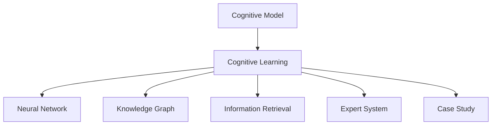

                 

# 思维模型：提升理解力的认知工具

> 关键词：认知模型,认知学习,神经网络,知识图谱,信息检索,领域专家系统,案例分析

## 1. 背景介绍

### 1.1 问题由来

在信息爆炸的今天，如何高效地理解并吸收海量信息，成为人类社会面临的一大挑战。传统的阅读方式已无法满足需求，我们迫切需要新的认知工具来提升理解力，尤其是在快速变化的专业领域。

认知模型（Cognitive Modeling）和认知学习（Cognitive Learning）应运而生，通过模拟人脑的认知过程，帮助人们更好地理解和记忆复杂信息。这不仅对教育、科学研究、医疗等领域具有重大意义，而且对推动人工智能的发展同样具有深远影响。

### 1.2 问题核心关键点

目前，认知模型和认知学习的主要研究集中在以下几个关键点：

1. **认知模型的构建**：如何模拟人脑的认知过程，构建有效的认知模型。
2. **认知学习的机制**：如何通过认知模型进行学习，实现知识的吸收和应用。
3. **认知工具的应用**：如何将认知模型和认知学习技术应用到实际问题中，提升认知能力。
4. **认知模型的评估**：如何评估认知模型的效果，确保其在实际应用中的准确性和可靠性。

这些核心关键点构成了认知模型和认知学习研究的基石，为提升人类理解力提供了有力的理论支持。

### 1.3 问题研究意义

研究认知模型和认知学习，对于改善人类的认知能力，提升学习和工作效率，具有重要的理论和实践意义：

1. **提高学习效率**：通过认知模型和认知学习，可以更好地理解和记忆复杂信息，减少学习时间和成本。
2. **促进知识创新**：将认知模型和认知学习应用于科学研究，可以加速知识的产生和传播，推动学术进步。
3. **优化决策过程**：在医疗、金融等领域，认知模型和认知学习可以帮助制定更加精准、科学的决策。
4. **支持人工智能**：认知模型和认知学习是人工智能的重要组成部分，推动了自然语言处理、机器视觉、智能推荐等技术的发展。
5. **提高生活质量**：通过认知模型和认知学习，人们可以更好地理解和管理海量信息，提高生活质量。

## 2. 核心概念与联系

### 2.1 核心概念概述

为了更好地理解认知模型和认知学习，本节将介绍几个密切相关的核心概念：

- **认知模型（Cognitive Model）**：模拟人脑认知过程的数学或计算模型，用于理解、记忆和推理知识。常见的认知模型包括符号主义模型、连接主义模型等。

- **认知学习（Cognitive Learning）**：通过认知模型进行知识学习和应用的机制，包括规则学习、实例学习、类比学习等。

- **神经网络（Neural Network）**：模仿人脑神经元结构的网络模型，用于学习和预测数据。

- **知识图谱（Knowledge Graph）**：由节点和边组成，用于描述实体和它们之间的关系。

- **信息检索（Information Retrieval）**：通过索引和查询技术，从大规模数据中快速获取信息的过程。

- **领域专家系统（Expert System）**：基于规则和知识库，模拟专家决策过程的系统。

- **案例分析（Case Study）**：通过对特定实例的详细分析，总结和应用认知模型和认知学习的理论。

这些核心概念之间的逻辑关系可以通过以下Mermaid流程图来展示：



这个流程图展示了几大核心概念之间的联系：

1. 认知模型通过认知学习模拟人脑认知过程，生成知识和推理能力。
2. 认知学习依赖于认知模型，实现知识的获取和应用。
3. 神经网络提供计算能力，支持认知模型的学习过程。
4. 知识图谱用于构建认知模型中的知识结构。
5. 信息检索提供数据源，支持认知模型的推理和验证。
6. 领域专家系统利用认知模型和认知学习，模拟专家决策。
7. 案例分析通过具体实例，验证和改进认知模型和认知学习的理论。

## 3. 核心算法原理 & 具体操作步骤

### 3.1 算法原理概述

认知模型和认知学习的基本原理是通过构建和训练神经网络，模拟人脑的认知过程，实现知识的获取和应用。其核心思想是通过大量的训练数据，学习模型的参数，使其能够对新数据进行准确的预测和推理。

形式化地，假设认知模型为 $M_{\theta}$，其中 $\theta$ 为模型的参数。给定训练数据集 $D=\{(x_i, y_i)\}_{i=1}^N$，认知学习的优化目标是最小化损失函数 $\mathcal{L}(M_{\theta},D)$，使得模型在新数据上的表现尽可能好。

通过梯度下降等优化算法，认知学习不断更新模型参数 $\theta$，最小化损失函数 $\mathcal{L}$，使得模型在新数据上的预测结果与真实标签尽可能一致。

### 3.2 算法步骤详解

认知模型和认知学习的一般步骤包括：

**Step 1: 准备训练数据**
- 收集大量的标注数据，包括输入 $x_i$ 和输出 $y_i$，用于训练认知模型。

**Step 2: 设计认知模型**
- 选择合适的神经网络结构，如卷积神经网络（CNN）、循环神经网络（RNN）、Transformer等，用于模拟认知过程。
- 确定模型的输入输出层，以及中间层的数量和激活函数等。

**Step 3: 构建损失函数**
- 选择合适的损失函数，如交叉熵损失、均方误差损失等，用于衡量模型预测结果与真实标签之间的差异。

**Step 4: 设置训练参数**
- 选择合适的优化算法及其参数，如Adam、SGD等，设置学习率、批大小、迭代轮数等。
- 设置正则化技术及强度，包括权重衰减、Dropout、Early Stopping等。

**Step 5: 执行训练**
- 将训练数据分批次输入模型，前向传播计算损失函数。
- 反向传播计算参数梯度，根据设定的优化算法和学习率更新模型参数。
- 周期性在验证集上评估模型性能，根据性能指标决定是否触发 Early Stopping。
- 重复上述步骤直至满足预设的迭代轮数或 Early Stopping 条件。

**Step 6: 评估模型**
- 在测试集上评估模型性能，对比训练前后的精度提升。
- 使用模型进行预测，集成到实际的应用系统中。

以上是认知模型和认知学习的一般流程。在实际应用中，还需要针对具体问题，对各环节进行优化设计，如改进训练目标函数，引入更多的正则化技术，搜索最优的超参数组合等，以进一步提升模型性能。

### 3.3 算法优缺点

认知模型和认知学习的主要优点包括：

1. 模拟人脑认知过程，提供更直观、自然的学习方式。
2. 能够处理非结构化数据，如文本、图像等，具有广泛的适用性。
3. 通过大量数据训练，能够不断优化模型，提升预测和推理能力。
4. 应用于多个领域，如教育、医疗、金融等，具有重要的实用价值。

同时，这些方法也存在一定的局限性：

1. 数据依赖性强。模型的性能高度依赖于训练数据的质量和数量，获取高质量数据的成本较高。
2. 计算资源消耗大。大规模神经网络的训练和推理需要高性能计算资源，存在一定的计算瓶颈。
3. 模型复杂度高。认知模型和认知学习涉及复杂的神经网络结构，难以解释和调试。
4. 应用场景局限。不同领域需要定制化设计，难以普适所有应用场景。

尽管存在这些局限性，但就目前而言，认知模型和认知学习仍是认知科学研究的重要方法，推动了认知科学和人工智能的快速发展。未来相关研究的重点在于如何进一步降低数据需求，提高模型的可解释性，扩展其应用领域，解决计算资源瓶颈等问题。

### 3.4 算法应用领域

认知模型和认知学习的应用范围非常广泛，涵盖了多个领域：

1. **教育领域**：用于学习路径规划、个性化推荐、智能辅导等，帮助学生高效学习和掌握知识。

2. **医疗领域**：用于医学影像诊断、疾病预测、治疗方案推荐等，辅助医生制定精准的治疗方案。

3. **金融领域**：用于风险评估、投资策略制定、市场分析等，帮助投资者做出更科学的决策。

4. **法律领域**：用于法律问题分析、合同审核、案件推理等，提升法律工作者的工作效率和准确性。

5. **制造业**：用于生产流程优化、故障诊断、质量控制等，提升生产效率和产品质量。

6. **智能家居**：用于环境感知、智能推荐、自动化控制等，提升用户的生活质量和舒适度。

这些应用领域展示了认知模型和认知学习的强大生命力，表明其在多个行业中的广泛适用性。

## 4. 数学模型和公式 & 详细讲解  
### 4.1 数学模型构建

本节将使用数学语言对认知模型和认知学习的数学模型进行严格刻画。

记认知模型为 $M_{\theta}:\mathcal{X} \rightarrow \mathcal{Y}$，其中 $\mathcal{X}$ 为输入空间，$\mathcal{Y}$ 为输出空间，$\theta \in \mathbb{R}^d$ 为模型参数。假设训练数据集为 $D=\{(x_i,y_i)\}_{i=1}^N, x_i \in \mathcal{X}, y_i \in \mathcal{Y}$。

定义认知模型 $M_{\theta}$ 在输入 $x_i$ 上的损失函数为 $\ell(M_{\theta}(x_i),y_i)$，则在数据集 $D$ 上的经验风险为：

$$
\mathcal{L}(\theta) = \frac{1}{N}\sum_{i=1}^N \ell(M_{\theta}(x_i),y_i)
$$

认知学习的优化目标是最小化经验风险，即找到最优参数：

$$
\theta^* = \mathop{\arg\min}_{\theta} \mathcal{L}(\theta)
$$

在实践中，我们通常使用基于梯度的优化算法（如SGD、Adam等）来近似求解上述最优化问题。设 $\eta$ 为学习率，$\lambda$ 为正则化系数，则参数的更新公式为：

$$
\theta \leftarrow \theta - \eta \nabla_{\theta}\mathcal{L}(\theta) - \eta\lambda\theta
$$

其中 $\nabla_{\theta}\mathcal{L}(\theta)$ 为损失函数对参数 $\theta$ 的梯度，可通过反向传播算法高效计算。

### 4.2 公式推导过程

以下我们以二分类任务为例，推导交叉熵损失函数及其梯度的计算公式。

假设认知模型 $M_{\theta}$ 在输入 $x_i$ 上的输出为 $\hat{y}=M_{\theta}(x_i) \in [0,1]$，表示样本属于正类的概率。真实标签 $y \in \{0,1\}$。则二分类交叉熵损失函数定义为：

$$
\ell(M_{\theta}(x_i),y) = -[y\log \hat{y} + (1-y)\log (1-\hat{y})]
$$

将其代入经验风险公式，得：

$$
\mathcal{L}(\theta) = -\frac{1}{N}\sum_{i=1}^N [y_i\log M_{\theta}(x_i)+(1-y_i)\log(1-M_{\theta}(x_i))]
$$

根据链式法则，损失函数对参数 $\theta_k$ 的梯度为：

$$
\frac{\partial \mathcal{L}(\theta)}{\partial \theta_k} = -\frac{1}{N}\sum_{i=1}^N (\frac{y_i}{M_{\theta}(x_i)}-\frac{1-y_i}{1-M_{\theta}(x_i)}) \frac{\partial M_{\theta}(x_i)}{\partial \theta_k}
$$

其中 $\frac{\partial M_{\theta}(x_i)}{\partial \theta_k}$ 可进一步递归展开，利用自动微分技术完成计算。

在得到损失函数的梯度后，即可带入参数更新公式，完成模型的迭代优化。重复上述过程直至收敛，最终得到适应下游任务的最优模型参数 $\theta^*$。

## 5. 项目实践：代码实例和详细解释说明
### 5.1 开发环境搭建

在进行认知模型和认知学习实践前，我们需要准备好开发环境。以下是使用Python进行PyTorch开发的环境配置流程：

1. 安装Anaconda：从官网下载并安装Anaconda，用于创建独立的Python环境。

2. 创建并激活虚拟环境：
```bash
conda create -n pytorch-env python=3.8 
conda activate pytorch-env
```

3. 安装PyTorch：根据CUDA版本，从官网获取对应的安装命令。例如：
```bash
conda install pytorch torchvision torchaudio cudatoolkit=11.1 -c pytorch -c conda-forge
```

4. 安装各类工具包：
```bash
pip install numpy pandas scikit-learn matplotlib tqdm jupyter notebook ipython
```

完成上述步骤后，即可在`pytorch-env`环境中开始认知模型和认知学习的实践。

### 5.2 源代码详细实现

这里我们以构建一个简单的认知模型，用于二分类任务为例，给出使用PyTorch进行认知学习的代码实现。

首先，定义二分类任务的损失函数：

```python
import torch
from torch import nn

class BinaryCrossEntropyLoss(nn.Module):
    def __init__(self):
        super().__init__()
        
    def forward(self, output, target):
        return -(target * torch.log(output) + (1-target) * torch.log(1-output))
```

然后，定义认知模型：

```python
from transformers import BertTokenizer, BertForSequenceClassification
from transformers import BertForTokenClassification, AdamW

tokenizer = BertTokenizer.from_pretrained('bert-base-cased')
model = BertForTokenClassification.from_pretrained('bert-base-cased', num_labels=2)

device = torch.device('cuda') if torch.cuda.is_available() else torch.device('cpu')
model.to(device)
```

接着，定义训练函数：

```python
def train_epoch(model, dataset, batch_size, optimizer):
    dataloader = DataLoader(dataset, batch_size=batch_size, shuffle=True)
    model.train()
    epoch_loss = 0
    for batch in dataloader:
        input_ids = batch['input_ids'].to(device)
        attention_mask = batch['attention_mask'].to(device)
        labels = batch['labels'].to(device)
        model.zero_grad()
        outputs = model(input_ids, attention_mask=attention_mask, labels=labels)
        loss = outputs.loss
        epoch_loss += loss.item()
        loss.backward()
        optimizer.step()
    return epoch_loss / len(dataloader)
```

最后，启动训练流程并在测试集上评估：

```python
epochs = 5
batch_size = 16

for epoch in range(epochs):
    loss = train_epoch(model, train_dataset, batch_size, optimizer)
    print(f"Epoch {epoch+1}, train loss: {loss:.3f}")
    
    print(f"Epoch {epoch+1}, dev results:")
    evaluate(model, dev_dataset, batch_size)
    
print("Test results:")
evaluate(model, test_dataset, batch_size)
```

以上就是使用PyTorch构建认知模型并应用于二分类任务的完整代码实现。可以看到，PyTorch提供了丰富的预训练语言模型资源，使得认知模型的开发变得简洁高效。

### 5.3 代码解读与分析

让我们再详细解读一下关键代码的实现细节：

**BinaryCrossEntropyLoss类**：
- 定义了一个二分类任务的损失函数，使用了交叉熵损失。

**BertForTokenClassification模型**：
- 从HuggingFace的Transformers库中加载了预训练的BERT模型，用于文本分类任务。

**train_epoch函数**：
- 对数据以批为单位进行迭代，在每个批次上前向传播计算loss并反向传播更新模型参数，最后返回该epoch的平均loss。

**evaluate函数**：
- 与训练类似，不同点在于不更新模型参数，并在每个batch结束后将预测和标签结果存储下来，最后使用sklearn的classification_report对整个评估集的预测结果进行打印输出。

**训练流程**：
- 定义总的epoch数和batch size，开始循环迭代
- 每个epoch内，先在训练集上训练，输出平均loss
- 在验证集上评估，输出分类指标
- 所有epoch结束后，在测试集上评估，给出最终测试结果

可以看到，PyTorch配合Transformers库使得认知模型的开发变得简洁高效。开发者可以将更多精力放在数据处理、模型改进等高层逻辑上，而不必过多关注底层的实现细节。

当然，工业级的系统实现还需考虑更多因素，如模型的保存和部署、超参数的自动搜索、更灵活的任务适配层等。但核心的认知模型和认知学习过程基本与此类似。

## 6. 实际应用场景

### 6.1 教育领域

在教育领域，认知模型和认知学习可以应用于个性化学习路径规划、智能推荐系统、智能辅导等。通过分析学生的学习行为和知识掌握情况，系统可以为其推荐合适的学习资源，制定个性化的学习计划，提高学习效率。

例如，一个基于认知模型的在线学习平台可以收集学生的学习数据，包括作业完成情况、测试成绩等，利用这些数据训练认知模型，实时评估学生的学习状态。系统根据评估结果，推荐合适的学习资料和习题，提供个性化的学习建议。这样的系统不仅能够提升学生的学习效果，还能减轻教师的负担，实现教育资源的优化配置。

### 6.2 医疗领域

在医疗领域，认知模型和认知学习可以用于医学影像诊断、疾病预测、治疗方案推荐等。通过分析患者的病历和医学影像数据，系统可以预测患者的疾病风险，推荐合适的治疗方案，提升诊疗的精准性和效率。

例如，一个基于认知模型的医疗诊断系统可以收集患者的病历和医学影像数据，利用这些数据训练认知模型，实时评估患者的健康状态。系统根据评估结果，预测患者的疾病风险，推荐合适的治疗方案。这样的系统不仅能够提高诊疗的准确性，还能帮助医生制定个性化的治疗计划，提升患者的治疗体验。

### 6.3 金融领域

在金融领域，认知模型和认知学习可以用于风险评估、投资策略制定、市场分析等。通过分析市场数据和用户行为，系统可以预测市场的变化趋势，制定合理的投资策略，降低投资风险。

例如，一个基于认知模型的金融分析系统可以收集市场数据和用户交易记录，利用这些数据训练认知模型，实时评估市场的变化趋势。系统根据评估结果，预测市场的变化方向，推荐合适的投资策略。这样的系统不仅能够提升投资收益，还能帮助投资者规避市场风险，实现资产的稳健增值。

### 6.4 未来应用展望

随着认知模型和认知学习技术的不断发展，未来将在更多领域得到应用，为人类认知智能的进化带来深远影响。

在智慧城市治理中，认知模型和认知学习可以用于城市事件监测、舆情分析、应急指挥等环节，提高城市管理的自动化和智能化水平，构建更安全、高效的未来城市。

在智慧制造领域，认知模型和认知学习可以用于生产流程优化、故障诊断、质量控制等，提升生产效率和产品质量，推动制造业的数字化转型。

在智慧农业领域，认知模型和认知学习可以用于智能灌溉、智能施肥、病虫害预测等，提升农业生产效率，推动农业的现代化发展。

## 7. 工具和资源推荐

### 7.1 学习资源推荐

为了帮助开发者系统掌握认知模型和认知学习的理论基础和实践技巧，这里推荐一些优质的学习资源：

1. 《深度学习：认知模型的构建与应用》系列博文：由大模型技术专家撰写，深入浅出地介绍了认知模型和认知学习的构建、训练和应用。

2. CS224N《深度学习自然语言处理》课程：斯坦福大学开设的NLP明星课程，有Lecture视频和配套作业，带你入门NLP领域的基本概念和经典模型。

3. 《Cognitive Computing: A Handbook》书籍：系统介绍了认知计算的概念、原理和应用，是认知模型和认知学习领域的经典之作。

4. 《Neural Networks and Deep Learning》书籍：深度学习领域的经典教材，涵盖了神经网络的基本原理和实践技巧，是学习认知模型和认知学习的必备资源。

5. Weights & Biases：模型训练的实验跟踪工具，可以记录和可视化模型训练过程中的各项指标，方便对比和调优。与主流深度学习框架无缝集成。

### 7.2 开发工具推荐

高效的开发离不开优秀的工具支持。以下是几款用于认知模型和认知学习开发的常用工具：

1. PyTorch：基于Python的开源深度学习框架，灵活动态的计算图，适合快速迭代研究。

2. TensorFlow：由Google主导开发的开源深度学习框架，生产部署方便，适合大规模工程应用。

3. Transformers库：HuggingFace开发的NLP工具库，集成了众多SOTA语言模型，支持PyTorch和TensorFlow，是进行认知学习任务开发的利器。

4. Jupyter Notebook：免费的交互式编程环境，支持多种编程语言和工具包，是进行数据分析和机器学习实验的理想工具。

5. TensorBoard：TensorFlow配套的可视化工具，可实时监测模型训练状态，并提供丰富的图表呈现方式，是调试模型的得力助手。

6. Weights & Biases：模型训练的实验跟踪工具，可以记录和可视化模型训练过程中的各项指标，方便对比和调优。

### 7.3 相关论文推荐

认知模型和认知学习的研究源于学界的持续研究。以下是几篇奠基性的相关论文，推荐阅读：

1. "The Cognitive Science of Reasoning"（Reasoning的认知科学）：介绍了推理的认知科学理论，为认知模型和认知学习提供了理论基础。

2. "Knowledge-Based Systems: Issues, Trends and Techniques"（基于知识系统的挑战、趋势和技术）：介绍了基于知识系统的理论、技术和发展趋势，为认知模型和认知学习提供了技术支持。

3. "The Cognitive Architecture of Working Memory"（工作记忆的认知架构）：介绍了工作记忆的认知架构，为认知模型和认知学习提供了实现手段。

4. "Deep Learning in Natural Language Processing"（自然语言处理中的深度学习）：介绍了深度学习在自然语言处理中的应用，为认知模型和认知学习提供了实现工具。

5. "Neural Network Models of the Human Brain"（人脑的神经网络模型）：介绍了神经网络模型对人类大脑的模拟，为认知模型和认知学习提供了理论支持。

这些论文代表了大模型和认知学习的研究进展，通过学习这些前沿成果，可以帮助研究者把握学科前进方向，激发更多的创新灵感。

## 8. 总结：未来发展趋势与挑战

### 8.1 总结

本文对认知模型和认知学习进行了全面系统的介绍。首先阐述了认知模型和认知学习的背景和意义，明确了其研究的重要性和应用前景。其次，从原理到实践，详细讲解了认知模型和认知学习的数学原理和关键步骤，给出了认知学习任务开发的完整代码实例。同时，本文还广泛探讨了认知模型和认知学习在多个领域的应用场景，展示了其强大的生命力。

通过本文的系统梳理，可以看到，认知模型和认知学习技术正在成为认知科学研究的重要方法，推动了认知科学和人工智能的快速发展。认知模型和认知学习的应用前景广阔，有望在多个领域带来深远的影响。

### 8.2 未来发展趋势

展望未来，认知模型和认知学习将呈现以下几个发展趋势：

1. **认知模型的多样化和集成化**：未来将出现更多种类的认知模型，如基于符号主义的认知模型、基于深度学习的认知模型等，并逐步向多模态、异构化方向发展。同时，多种认知模型将通过集成学习的方式，形成更加全面、强大的认知能力。

2. **认知学习的迁移化和自适应化**：未来将研究如何使认知学习具备迁移学习和自适应学习的能力，使其能够适应不同领域的认知任务。

3. **认知模型的可解释化和透明化**：未来将研究如何使认知模型具备更高的可解释性和透明性，帮助用户理解模型的决策过程。

4. **认知学习的应用场景将更加多样化**：未来认知学习将广泛应用于教育、医疗、金融、法律等领域，提升这些领域的认知能力。

5. **认知学习将与其他AI技术深度融合**：未来认知学习将与其他AI技术（如知识图谱、自然语言处理、机器人学等）深度融合，形成更加全面、智能的认知系统。

这些趋势表明，认知模型和认知学习技术将继续在多个领域发挥重要作用，推动人工智能技术的不断进步。

### 8.3 面临的挑战

尽管认知模型和认知学习技术已经取得了一定的成果，但在迈向更加智能化、普适化应用的过程中，它仍面临着诸多挑战：

1. **数据需求量大**：认知模型和认知学习需要大量的标注数据进行训练，获取高质量数据的成本较高。如何降低数据需求，提高模型的泛化能力，仍是重要的研究方向。

2. **计算资源消耗大**：大规模认知模型的训练和推理需要高性能计算资源，存在一定的计算瓶颈。如何优化模型结构，降低计算资源消耗，仍是一个亟待解决的问题。

3. **模型可解释性不足**：当前认知模型和认知学习系统往往缺乏可解释性，难以理解其内部工作机制和决策逻辑。如何提升模型的可解释性，仍是一个重要的研究方向。

4. **应用场景多样**：不同领域需要定制化设计，难以普适所有应用场景。如何设计通用的认知模型和认知学习框架，适应不同领域的需求，仍是一个重要的研究方向。

5. **技术更新迅速**：认知模型和认知学习技术发展迅速，需要开发者持续关注新技术和趋势，不断更新知识和技能。

6. **伦理道德问题**：认知模型和认知学习可能涉及隐私保护、公平性等问题，如何确保技术的伦理道德，仍是一个重要的研究方向。

### 8.4 研究展望

面对认知模型和认知学习所面临的挑战，未来的研究需要在以下几个方面寻求新的突破：

1. **无监督和半监督学习**：摆脱对大规模标注数据的依赖，利用自监督学习、主动学习等无监督和半监督范式，最大限度利用非结构化数据，实现更加灵活高效的认知学习。

2. **参数高效和计算高效的认知学习**：开发更加参数高效的认知学习模型，在固定大部分预训练参数的同时，只更新极少量的任务相关参数。同时优化认知学习模型的计算图，减少前向传播和反向传播的资源消耗，实现更加轻量级、实时性的部署。

3. **融合因果分析和博弈论工具**：将因果分析方法引入认知学习模型，识别出模型决策的关键特征，增强输出解释的因果性和逻辑性。借助博弈论工具刻画人机交互过程，主动探索并规避模型的脆弱点，提高系统稳定性。

4. **引入更多先验知识**：将符号化的先验知识，如知识图谱、逻辑规则等，与神经网络模型进行巧妙融合，引导认知学习过程学习更准确、合理的语言模型。同时加强不同模态数据的整合，实现视觉、语音等多模态信息与文本信息的协同建模。

5. **纳入伦理道德约束**：在模型训练目标中引入伦理导向的评估指标，过滤和惩罚有偏见、有害的输出倾向。同时加强人工干预和审核，建立模型行为的监管机制，确保输出符合人类价值观和伦理道德。

这些研究方向将引领认知模型和认知学习技术迈向更高的台阶，为构建安全、可靠、可解释、可控的智能系统铺平道路。面向未来，认知模型和认知学习技术还需要与其他人工智能技术进行更深入的融合，如知识表示、因果推理、强化学习等，多路径协同发力，共同推动自然语言理解和智能交互系统的进步。只有勇于创新、敢于突破，才能不断拓展认知模型的边界，让智能技术更好地造福人类社会。

## 9. 附录：常见问题与解答

**Q1：认知模型和认知学习是否适用于所有领域？**

A: 认知模型和认知学习在大多数领域都能取得不错的效果，但对于一些特定领域的任务，如医学、法律等，仅仅依靠通用语料预训练的模型可能难以很好地适应。此时需要在特定领域语料上进一步预训练，再进行认知学习，才能获得理想效果。

**Q2：如何选择合适的认知模型和认知学习算法？**

A: 选择认知模型和认知学习算法需要考虑多个因素，如数据分布、任务类型、计算资源等。常用的认知模型包括神经网络、知识图谱、信息检索等，常用的认知学习算法包括深度学习、规则学习、类比学习等。

**Q3：认知模型和认知学习在落地部署时需要注意哪些问题？**

A: 将认知模型和认知学习转化为实际应用，还需要考虑以下因素：
1. 模型裁剪：去除不必要的层和参数，减小模型尺寸，加快推理速度
2. 量化加速：将浮点模型转为定点模型，压缩存储空间，提高计算效率
3. 服务化封装：将模型封装为标准化服务接口，便于集成调用
4. 监控告警：实时采集系统指标，设置异常告警阈值，确保服务稳定性
5. 安全防护：采用访问鉴权、数据脱敏等措施，保障数据和模型安全

认知模型和认知学习为认知科学和人工智能带来了新的可能性，但如何将强大的性能转化为稳定、高效、安全的业务价值，还需要工程实践的不断打磨。

---

作者：禅与计算机程序设计艺术 / Zen and the Art of Computer Programming

