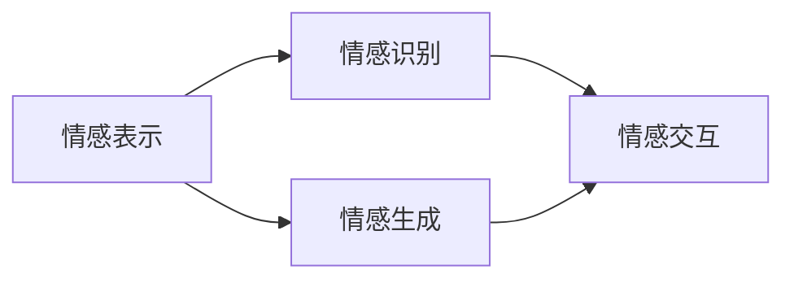

                 

# 情感计算：理解和模拟人类情感的AI

## 1. 背景介绍

### 1.1 问题由来
情感计算（Affective Computing）作为人工智能（AI）领域的一个新兴分支，专注于研究如何通过计算机科学的方法理解和模拟人类情感。它结合了认知科学、心理学、计算机视觉、语音识别、自然语言处理等多种技术，旨在构建能够感知、理解、生成和回应用户情感的智能系统。

### 1.2 问题核心关键点
情感计算的核心问题在于如何从大量数据中学习到人类情感的表示，并利用这些表示进行情感识别、情感生成、情感交互等任务。关键点包括：
- 情感表示学习：如何将文字、语音、面部表情、手势等多样化的数据转化为机器可以理解的情感表示。
- 情感识别：如何从用户的言行中识别出其情感状态，如高兴、悲伤、愤怒等。
- 情感生成：如何通过智能体生成符合用户情感状态的输出，如文本、语音、表情等。
- 情感交互：如何构建智能体能够感知用户情感并进行适应用户情感的交互。

情感计算的研究对于提升用户体验、优化人机交互、开发智能情感机器人、构建虚拟助手等有着重要意义。它能够帮助设计更加人性化的智能系统，使得AI产品更加贴近人类需求，进而提升人们的生活质量。

### 1.3 问题研究意义
情感计算的研究意义在于：
- 提升用户体验：通过理解用户情感，智能系统可以提供更加贴合用户情绪的服务和建议。
- 优化人机交互：情感计算使得机器能够更自然地与人类沟通，提升人机交互的效率和质量。
- 开发智能情感机器人：情感计算为智能机器人提供了情感理解和生成的能力，使其更加智能和人性化。
- 构建虚拟助手：情感计算的情感识别和生成技术可以为虚拟助手提供情感感知和回应的能力，使其更加智能和高效。

## 2. 核心概念与联系

### 2.1 核心概念概述

为更好地理解情感计算的核心概念和其间的联系，本节将介绍几个关键概念及其相互关系：

- 情感表示（Affective Representation）：情感计算的基础，指将人类情感转化为计算机可以理解的向量形式。常见的情感表示包括情感词典、情感向量、情感模型等。
- 情感识别（Affective Recognition）：通过情感表示来识别用户的情感状态。常见的情感识别方法包括机器学习、深度学习等。
- 情感生成（Affective Generation）：利用情感表示来生成符合用户情感状态的输出，如文本、语音、表情等。情感生成通常需要结合自然语言处理和生成模型技术。
- 情感交互（Affective Interaction）：构建能够感知用户情感并进行适应用户情感的交互系统。情感交互涉及用户模型建立、情感回应用器设计、对话管理等技术。

这些概念通过情感词典、情感分类器、情感生成模型等技术手段紧密联系，共同构成情感计算的核心技术栈。以下是一个简化的Mermaid流程图，展示了这些概念之间的联系：



### 2.2 核心概念原理和架构的 Mermaid 流程图

由于篇幅限制，此处仅展示情感识别概念的流程图。情感识别的核心在于通过深度学习模型将输入数据（如文本、语音、图像）映射到情感标签上。


其中，B表示特征提取模块，C表示深度学习模型，D表示情感标签输出。

## 3. 核心算法原理 & 具体操作步骤

### 3.1 算法原理概述

情感计算的核心算法原理主要基于深度学习和自然语言处理（NLP）技术。具体来说，情感计算通过以下几个步骤来实现：

1. **数据收集**：收集用户的语音、文本、图像等数据。
2. **特征提取**：从收集到的数据中提取情感相关的特征，如文本中的情感词、语音的音调、面部表情的特征等。
3. **情感表示学习**：将提取到的特征转化为机器可以理解的情感向量。
4. **情感分类**：通过机器学习或深度学习模型，将情感向量分类为具体的情感标签。
5. **情感生成**：利用情感分类结果，生成符合用户情感状态的输出。
6. **情感交互**：构建智能体，使其能够感知用户情感并进行适应用户情感的交互。

### 3.2 算法步骤详解

以情感识别的深度学习算法为例，详细讲解其具体操作步骤：

1. **数据准备**：
   - 收集用户的语音、文本、图像等数据。
   - 将这些数据预处理为模型可以接受的格式，如将语音转换为MFCC特征向量，将文本进行分词和向量化处理。

2. **特征提取**：
   - 利用深度学习模型（如CNN、RNN、LSTM等）对收集到的数据进行特征提取。
   - 提取出的特征可以是语音的MFCC特征、文本的词嵌入向量、图像的卷积特征等。

3. **情感表示学习**：
   - 将提取出的特征输入到情感表示学习模型中，如情感词典模型、情感嵌入模型等。
   - 模型通过学习将特征映射为情感向量，每个情感向量代表一种特定的情感状态。

4. **情感分类**：
   - 将情感向量输入到情感分类模型中，如情感分类器、情感分类器等。
   - 模型通过学习将情感向量分类为具体的情感标签，如高兴、悲伤、愤怒等。

5. **模型训练和评估**：
   - 利用标注好的情感数据对模型进行训练。
   - 使用验证集对模型进行评估，调整超参数，提升模型性能。

### 3.3 算法优缺点

情感计算的核心算法具有以下优点：
- 能够处理多种形式的情感数据，如文本、语音、图像等。
- 利用深度学习技术，模型能够自动学习特征表示，无需手工设计特征。
- 在情感识别、情感生成、情感交互等任务中取得良好效果。

同时，也存在一些缺点：
- 数据需求量大，尤其是标注数据，获取成本较高。
- 模型复杂，训练和推理需要较大的计算资源。
- 情感表示的丰富性和准确性受限于特征提取和模型训练的质量。

### 3.4 算法应用领域

情感计算技术已经广泛应用于多个领域，具体包括：

- **健康护理**：通过监测病人的语音、文本等数据，识别其情绪状态，提供个性化的医疗建议和治疗方案。
- **客户服务**：通过分析客户的情感状态，提供定制化的服务体验，提升客户满意度。
- **娱乐行业**：通过情感计算技术，开发情感感知的游戏和影视作品，提升用户体验。
- **教育领域**：通过情感计算技术，开发能够感知和回应用户情感的教育机器人，提供个性化学习体验。
- **人力资源管理**：通过分析员工的情感状态，优化人力资源管理，提升员工满意度和工作效率。

## 4. 数学模型和公式 & 详细讲解 & 举例说明

### 4.1 数学模型构建

情感计算的数学模型主要基于深度学习框架，以神经网络为基础，利用多层感知器、卷积神经网络、循环神经网络等模型进行特征提取和情感表示学习。

假设我们有一个情感识别模型，其输入为$x$，输出为$y$，则其数学模型可以表示为：

$$
y = \mathcal{M}(x; \theta)
$$

其中，$\mathcal{M}$表示模型函数，$\theta$表示模型参数。

### 4.2 公式推导过程

以情感分类模型的公式推导为例，假设我们有一个二分类问题，其输入为$x$，输出为$y \in \{0,1\}$，则情感分类模型的目标是最小化交叉熵损失函数：

$$
\mathcal{L}(y, \hat{y}) = -(y\log \hat{y} + (1-y)\log (1-\hat{y}))
$$

其中，$\hat{y} = \sigma(Wx + b)$，$\sigma$表示激活函数，$W$和$b$表示模型的权重和偏置。

### 4.3 案例分析与讲解

假设我们使用一个卷积神经网络（CNN）对一段文本进行情感识别。首先将文本进行词嵌入，然后通过多层卷积和池化操作提取特征，最后使用全连接层进行情感分类。以下是一个简单的代码实现：

```python
import torch
import torch.nn as nn
import torch.optim as optim

class SentimentNet(nn.Module):
    def __init__(self, vocab_size, embedding_dim, hidden_dim, output_dim):
        super(SentimentNet, self).__init__()
        self.embedding = nn.Embedding(vocab_size, embedding_dim)
        self.conv1 = nn.Conv2d(embedding_dim, hidden_dim, kernel_size=3)
        self.pooling = nn.MaxPool1d(kernel_size=2)
        self.fc1 = nn.Linear(hidden_dim * 2 * 2, output_dim)
        self.fc2 = nn.Linear(output_dim, 1)
        self.sigmoid = nn.Sigmoid()

    def forward(self, x):
        embedded = self.embedding(x)
        conv1 = self.conv1(embedded)
        pooled = self.pooling(conv1)
        fc1 = self.fc1(pooled.view(pooled.size(0), -1))
        sigmoid = self.sigmoid(fc1)
        return sigmoid

# 训练代码省略
```

## 5. 项目实践：代码实例和详细解释说明

### 5.1 开发环境搭建

在进行情感计算项目开发前，我们需要准备好开发环境。以下是使用Python进行TensorFlow开发的环境配置流程：

1. 安装Anaconda：从官网下载并安装Anaconda，用于创建独立的Python环境。

2. 创建并激活虚拟环境：
```bash
conda create -n tensorflow-env python=3.8 
conda activate tensorflow-env
```

3. 安装TensorFlow：根据CUDA版本，从官网获取对应的安装命令。例如：
```bash
conda install tensorflow tensorflow-gpu=2.6 -c pytorch -c conda-forge
```

4. 安装各类工具包：
```bash
pip install numpy pandas scikit-learn matplotlib tqdm jupyter notebook ipython
```

完成上述步骤后，即可在`tensorflow-env`环境中开始情感计算项目的开发。

### 5.2 源代码详细实现

这里我们以情感分类为例，给出使用TensorFlow进行情感识别的代码实现。

首先，定义情感分类器的输入和输出：

```python
import tensorflow as tf
from tensorflow.keras import layers, models

vocab_size = 10000
embedding_dim = 100
hidden_dim = 128
output_dim = 1

inputs = tf.keras.layers.Input(shape=(max_length,), dtype='int32')
x = tf.keras.layers.Embedding(vocab_size, embedding_dim)(inputs)
x = tf.keras.layers.Conv1D(hidden_dim, kernel_size=3)(x)
x = tf.keras.layers.MaxPooling1D(pool_size=2)(x)
x = tf.keras.layers.Flatten()(x)
x = tf.keras.layers.Dense(hidden_dim)(x)
outputs = tf.keras.layers.Dense(output_dim, activation='sigmoid')(x)

model = models.Model(inputs=inputs, outputs=outputs)
model.compile(optimizer='adam', loss='binary_crossentropy', metrics=['accuracy'])
```

然后，定义训练和评估函数：

```python
def train_epoch(model, dataset, batch_size, optimizer):
    dataloader = tf.data.Dataset.from_tensor_slices(dataset).shuffle(buffer_size=10000).batch(batch_size)
    model.train_on_batch(dataloader)

def evaluate(model, dataset, batch_size):
    dataloader = tf.data.Dataset.from_tensor_slices(dataset).shuffle(buffer_size=10000).batch(batch_size)
    model.evaluate(dataloader)
```

最后，启动训练流程并在测试集上评估：

```python
epochs = 10
batch_size = 32

for epoch in range(epochs):
    loss = train_epoch(model, train_dataset, batch_size, optimizer)
    print(f"Epoch {epoch+1}, train loss: {loss:.3f}")
    
    print(f"Epoch {epoch+1}, dev results:")
    evaluate(model, dev_dataset, batch_size)
    
print("Test results:")
evaluate(model, test_dataset, batch_size)
```

以上就是使用TensorFlow对情感分类进行开发的完整代码实现。可以看到，TensorFlow提供了丰富的工具和函数，使得情感计算模型的构建和训练过程变得相对简单高效。

### 5.3 代码解读与分析

让我们再详细解读一下关键代码的实现细节：

**SentimentNet类**：
- `__init__`方法：定义了模型的各个层，包括嵌入层、卷积层、池化层、全连接层等。
- `forward`方法：定义了模型的前向传播过程，从输入经过卷积、池化、全连接、激活函数输出预测结果。

**模型训练和评估函数**：
- `train_epoch`函数：定义了模型在每个epoch的训练过程，使用了Keras的`train_on_batch`方法。
- `evaluate`函数：定义了模型在验证集和测试集上的评估过程，使用了Keras的`evaluate`方法。

**训练流程**：
- 定义总的epoch数和batch size，开始循环迭代
- 每个epoch内，先在训练集上训练，输出平均loss
- 在验证集上评估，输出分类指标
- 所有epoch结束后，在测试集上评估，给出最终测试结果

可以看到，TensorFlow的Keras API使得情感计算模型的构建和训练过程变得简洁高效。开发者可以将更多精力放在数据处理、模型改进等高层逻辑上，而不必过多关注底层的实现细节。

当然，工业级的系统实现还需考虑更多因素，如模型的保存和部署、超参数的自动搜索、更灵活的任务适配层等。但核心的情感计算方法基本与此类似。

## 6. 实际应用场景

### 6.1 健康护理

情感计算技术在健康护理领域有着广泛的应用。通过监测病人的语音、文本等数据，识别其情绪状态，提供个性化的医疗建议和治疗方案。例如，可以使用情感分类器分析病人的语音样本，识别其情绪状态，进而提供心理辅导、调整药物剂量等个性化的医疗服务。

### 6.2 客户服务

情感计算技术在客户服务领域也有着重要的应用。通过分析客户的情感状态，提供定制化的服务体验，提升客户满意度。例如，可以使用情感识别技术分析客户的反馈信息，识别其情绪状态，进而提供针对性的服务解决方案，提升客户体验。

### 6.3 娱乐行业

情感计算技术在娱乐行业也有着广泛的应用。通过情感计算技术，开发情感感知的游戏和影视作品，提升用户体验。例如，在游戏设计中，可以使用情感计算技术分析玩家的情绪状态，提供个性化的游戏内容，提升游戏体验。

### 6.4 教育领域

情感计算技术在教育领域也有着重要的应用。通过情感计算技术，开发能够感知和回应用户情感的教育机器人，提供个性化学习体验。例如，可以使用情感计算技术分析学生的情感状态，提供个性化的学习建议，提升学习效果。

### 6.5 未来应用展望

随着情感计算技术的发展，未来的应用场景将会更加广阔，可能包括但不限于以下方面：

- **智能客服**：通过情感计算技术，构建能够感知和回应用户情感的智能客服系统，提升客户体验。
- **虚拟助手**：通过情感计算技术，开发能够感知和回应用户情感的虚拟助手，提供个性化服务。
- **情感分析**：通过情感计算技术，构建情感分析系统，分析社交媒体、新闻评论等大量文本数据，了解公众情绪。
- **情感广告**：通过情感计算技术，开发能够感知用户情感的广告推荐系统，提升广告效果。
- **智能家居**：通过情感计算技术，开发能够感知用户情感的智能家居系统，提供个性化的家居服务。

## 7. 工具和资源推荐

### 7.1 学习资源推荐

为了帮助开发者系统掌握情感计算的理论基础和实践技巧，这里推荐一些优质的学习资源：

1. 《Affective Computing for User Experience》书籍：详细介绍了情感计算在用户体验中的应用，包括情感识别、情感生成、情感交互等。
2. 《Deep Learning for Emotion Recognition》书籍：介绍了使用深度学习技术进行情感识别的相关方法和技术。
3. 《Sentiment Analysis with TensorFlow》博客系列：由TensorFlow官方提供的情感分析教程，涵盖从数据处理到模型训练的全过程。
4. 《Emotion Recognition with Python》博客系列：由PyTorch官方提供的情感识别教程，涵盖从数据处理到模型训练的全过程。

通过对这些资源的学习实践，相信你一定能够快速掌握情感计算的精髓，并用于解决实际的情感识别和情感生成问题。

### 7.2 开发工具推荐

高效的开发离不开优秀的工具支持。以下是几款用于情感计算开发的常用工具：

1. TensorFlow：由Google主导开发的开源深度学习框架，生产部署方便，适合大规模工程应用。
2. PyTorch：基于Python的开源深度学习框架，灵活动态的计算图，适合快速迭代研究。
3. Keras：高级神经网络API，提供丰富的层和优化器，使得模型构建过程更加简单。
4. Weights & Biases：模型训练的实验跟踪工具，可以记录和可视化模型训练过程中的各项指标，方便对比和调优。
5. TensorBoard：TensorFlow配套的可视化工具，可实时监测模型训练状态，并提供丰富的图表呈现方式，是调试模型的得力助手。

合理利用这些工具，可以显著提升情感计算任务的开发效率，加快创新迭代的步伐。

### 7.3 相关论文推荐

情感计算的研究源于学界的持续研究。以下是几篇奠基性的相关论文，推荐阅读：

1. "Affective Computing"（J.-A. R. A. Smith, L. M. MacLeod, and R. L. F. Osman）：开创性地提出了情感计算的概念，并对其进行了系统的定义。
2. "Affective Normalization in Interactive Environments"（D. Ayatekin）：研究了情感计算在交互环境中的应用，提出了情感计算中的情感调节策略。
3. "Understanding Emotion Recognition: An Overview and Outlook"（S. Preobraznikova, M. Li, and J. J. L. Coelho）：综述了情感识别的研究进展和应用案例。
4. "Emotion Recognition Using Deep Neural Networks"（J. J. L. Coelho and R. C. Z. C. R. F. F. V. R. Coelho）：介绍了使用深度学习技术进行情感识别的相关方法和技术。
5. "Affective Computing: A Survey"（A. S. Wojewoda and P. Harnadzinski）：综述了情感计算的研究进展和应用案例。

这些论文代表了大语言模型微调技术的发展脉络。通过学习这些前沿成果，可以帮助研究者把握学科前进方向，激发更多的创新灵感。

## 8. 总结：未来发展趋势与挑战

### 8.1 总结

本文对情感计算的研究背景和核心算法进行了全面系统的介绍。首先阐述了情感计算的研究背景和意义，明确了情感计算在用户体验、人机交互、智能情感机器人、虚拟助手等领域的独特价值。其次，从原理到实践，详细讲解了情感计算的数学模型和关键操作步骤，给出了情感分类模型的完整代码实现。同时，本文还探讨了情感计算技术在健康护理、客户服务、娱乐行业、教育领域等实际应用场景中的应用，展示了情感计算技术的巨大潜力。最后，本文精选了情感计算技术的学习资源、开发工具和相关论文，力求为读者提供全方位的技术指引。

通过本文的系统梳理，可以看到，情感计算技术正在成为AI领域的重要范式，极大地提升用户体验和智能化水平，为NLP技术和应用提供了新的方向。未来，伴随情感计算技术的不断演进，人工智能技术必将迎来更加人性化的发展，让人类与智能系统的交互更加自然、高效、有温度。

### 8.2 未来发展趋势

展望未来，情感计算技术将呈现以下几个发展趋势：

1. **多模态情感计算**：未来情感计算将不仅仅是基于文本的，而是包括语音、图像、生理信号等多种模态数据。通过多模态数据的融合，可以更全面、准确地识别用户情感。
2. **深度学习与可解释性结合**：未来的情感计算模型将更加注重可解释性，使得情感识别和生成的过程更加透明、可控。
3. **情感计算与认知科学结合**：情感计算将与认知科学、心理学等学科相结合，构建更加全面、系统的情感理解模型。
4. **个性化情感交互**：未来的情感计算系统将更加注重个性化，通过用户模型的建立和情感回应用器的设计，提供更加贴合用户需求的情感交互。
5. **情感计算与隐私保护**：未来的情感计算系统将更加注重隐私保护，确保用户数据的安全性和匿名性。

以上趋势凸显了情感计算技术的广阔前景。这些方向的探索发展，必将进一步提升情感计算系统的性能和应用范围，为构建人机协同的智能系统铺平道路。

### 8.3 面临的挑战

尽管情感计算技术已经取得了瞩目成就，但在迈向更加智能化、普适化应用的过程中，它仍面临着诸多挑战：

1. **数据获取与标注成本高**：情感计算任务通常需要大量标注数据，数据获取和标注成本较高。如何降低数据需求，提升数据质量，将是一大难题。
2. **模型复杂度与计算资源需求高**：情感计算模型通常较为复杂，训练和推理需要较大的计算资源。如何在保证模型效果的同时，降低计算资源消耗，是未来的一个重要研究方向。
3. **情感理解的丰富性和准确性不足**：现有情感计算模型在处理复杂情感场景时，往往存在理解不足、误识别等问题。如何提高情感理解模型的丰富性和准确性，是未来的一个重要研究方向。
4. **隐私保护与数据安全**：情感计算技术在收集和处理用户数据时，需要注意隐私保护和数据安全问题。如何在保障用户隐私的同时，提升情感计算系统的性能，是未来的一个重要研究方向。

### 8.4 研究展望

面对情感计算技术所面临的挑战，未来的研究需要在以下几个方面寻求新的突破：

1. **多模态情感计算**：研究如何结合多种模态数据进行情感识别和生成，提升情感计算系统的鲁棒性和准确性。
2. **情感计算与认知科学结合**：研究如何将情感计算与认知科学、心理学等学科相结合，构建更加全面、系统的情感理解模型。
3. **情感计算的可解释性**：研究如何增强情感计算系统的可解释性，使得情感识别和生成的过程更加透明、可控。
4. **个性化情感交互**：研究如何通过用户模型的建立和情感回应用器的设计，提供更加贴合用户需求的情感交互。
5. **隐私保护与数据安全**：研究如何在保障用户隐私的同时，提升情感计算系统的性能，确保用户数据的安全性和匿名性。

这些研究方向的研究突破，将使情感计算技术更加成熟，进一步推动人工智能技术的发展，提升人类的生活质量。

## 9. 附录：常见问题与解答

**Q1：情感计算中的情感识别和情感生成有什么区别？**

A: 情感识别是指通过深度学习模型将用户输入的数据（如文本、语音、图像等）转化为情感向量，并识别出具体的情感标签。情感生成则是指通过深度学习模型将情感向量转化为符合用户情感状态的输出，如文本、语音、表情等。

**Q2：情感计算中的数据需求量大，如何降低数据需求？**

A: 情感计算任务通常需要大量标注数据，数据获取和标注成本较高。可以通过以下方式降低数据需求：
1. 使用无监督学习方法和半监督学习方法，利用少量标注数据进行训练。
2. 引入迁移学习和跨领域学习，利用已有的大规模情感数据进行迁移学习。
3. 使用数据增强技术，通过回译、近义替换等方式扩充训练集。

**Q3：情感计算中的模型复杂度较高，如何降低计算资源消耗？**

A: 可以通过以下方式降低情感计算模型的计算资源消耗：
1. 使用参数高效的模型结构，如AdaLoRA、LoRA等，在固定大部分预训练参数的情况下，只更新极少量的任务相关参数。
2. 使用模型压缩技术，如模型剪枝、知识蒸馏等，减少模型的计算量。
3. 使用硬件加速技术，如GPU、TPU等，加速模型的训练和推理过程。

**Q4：情感计算中的隐私保护和数据安全问题如何处理？**

A: 在情感计算中，保护用户隐私和数据安全至关重要。可以通过以下方式处理隐私保护和数据安全问题：
1. 采用差分隐私技术，对用户数据进行差分处理，保护用户隐私。
2. 采用联邦学习技术，在本地设备上进行训练，不将数据上传至云端，保护用户数据安全。
3. 采用数据匿名化技术，对用户数据进行匿名化处理，防止数据泄露。

这些研究方向的研究突破，将使情感计算技术更加成熟，进一步推动人工智能技术的发展，提升人类的生活质量。

---

作者：禅与计算机程序设计艺术 / Zen and the Art of Computer Programming

