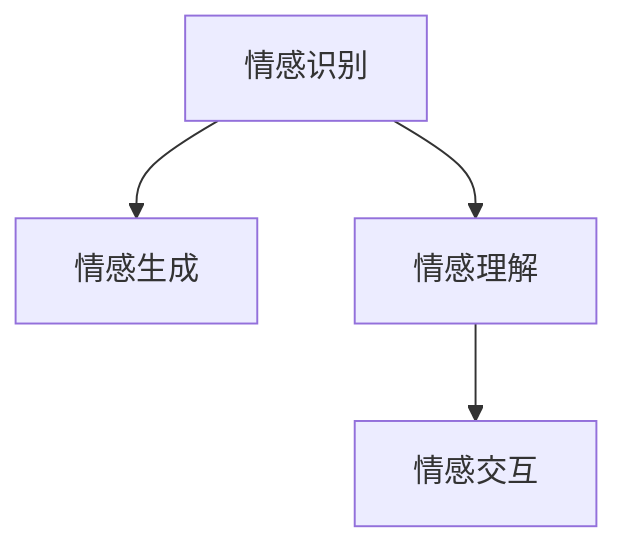

                 

# 情感计算：理解和模拟人类情感的AI

情感计算是指通过人工智能(AI)技术理解和模拟人类情感的过程，旨在构建能够识别、理解和生成人类情感的智能系统。本文将详细探讨情感计算的核心概念、算法原理、实践应用，并展望其未来发展趋势。

## 1. 背景介绍

### 1.1 问题由来
随着人工智能技术的迅猛发展，AI系统越来越多地被应用于人类生活和工作中。传统的人工智能系统主要关注认知层面的理解，如语言理解、图像识别等，但对于人类情感的识别和理解仍然存在显著不足。情感计算旨在填补这一空白，通过机器学习和大数据分析等技术，理解和模拟人类情感，构建能够感知和响应情感的智能系统。

### 1.2 问题核心关键点
情感计算的核心问题在于如何有效捕捉和理解人类情感，以及如何基于情感信息实现智能系统的智能化升级。以下是情感计算面临的核心挑战：
- **情感识别**：如何准确识别出文本、语音、面部表情等输入中蕴含的人类情感。
- **情感生成**：如何基于用户输入和情境信息生成符合情感逻辑的输出，如语音、文本、表情等。
- **情感理解**：如何将用户输入的情绪信息转化为可解释的认知结构，以辅助决策和行为生成。
- **情感交互**：如何构建用户与智能系统之间的情感连接，实现更自然、更富有同理心的交互体验。

### 1.3 问题研究意义
情感计算具有重要的理论和应用价值：
- **提升用户体验**：通过识别和理解用户情感，智能系统可以更好地响应用户需求，提供更符合情感逻辑的服务。
- **增强人机交互**：构建情感化的交互界面，使用户与智能系统的互动更加自然、流畅。
- **促进情感健康**：通过情感分析，智能系统能够及时发现和预防用户的情感困扰，提供相应的情感支持。
- **辅助决策分析**：情感信息可以作为重要的决策参考，帮助智能系统更好地进行情感驱动的决策和行为生成。

## 2. 核心概念与联系

### 2.1 核心概念概述

情感计算涉及多个核心概念，包括情感识别、情感生成、情感理解和情感交互等。这些概念之间相互联系，共同构成情感计算的完整体系。

- **情感识别**：通过文本、语音、图像等数据，识别出用户输入中蕴含的情感状态，通常使用机器学习算法（如分类、聚类等）进行处理。
- **情感生成**：基于用户输入的情感状态和情境信息，生成符合情感逻辑的输出，如文本、语音、表情等。情感生成通常涉及生成对抗网络(GAN)、变分自编码器(VAE)等技术。
- **情感理解**：将用户输入的情感状态转化为机器可理解的认知结构，通常使用语义理解、知识图谱等方法。
- **情感交互**：构建情感化的交互界面，使用户与智能系统的互动更加自然、流畅，通常涉及自然语言处理(NLP)、语音识别等技术。

这些概念之间的逻辑关系可以通过以下Mermaid流程图来展示：



这个流程图展示了情感计算的基本流程：首先通过情感识别获取用户情感状态，然后基于情感状态进行情感生成，并通过情感理解将情感状态转化为机器可理解的形式，最后通过情感交互实现自然、流畅的用户体验。

## 3. 核心算法原理 & 具体操作步骤

### 3.1 算法原理概述

情感计算的核心算法包括情感识别、情感生成和情感理解。下面将详细介绍这些算法的原理和具体操作步骤。

#### 3.1.1 情感识别算法

情感识别算法的核心目标是准确识别出用户输入中的情感状态，通常使用机器学习技术（如分类、聚类等）进行处理。以下是情感识别的典型算法步骤：

1. **数据预处理**：对文本、语音、图像等输入进行清洗、分词、特征提取等预处理。
2. **特征选择**：选择对情感识别有显著影响的特征，如情感词汇、语调、表情等。
3. **模型训练**：使用监督学习算法（如支持向量机、随机森林、深度学习等）对数据进行训练，建立情感识别模型。
4. **情感分类**：使用训练好的模型对新输入进行情感分类，得到情感状态。

#### 3.1.2 情感生成算法

情感生成算法的核心目标是基于用户输入和情境信息，生成符合情感逻辑的输出，通常涉及生成对抗网络(GAN)、变分自编码器(VAE)等技术。以下是情感生成的典型算法步骤：

1. **数据收集**：收集大量的情感数据，如情感词汇、表情等。
2. **模型构建**：构建生成模型，如GAN、VAE等。
3. **训练优化**：使用训练数据对生成模型进行训练和优化，使得生成的输出符合情感逻辑。
4. **样本生成**：使用优化好的生成模型生成新的情感输出，如文本、语音、表情等。

#### 3.1.3 情感理解算法

情感理解算法的核心目标是将用户输入的情感状态转化为机器可理解的认知结构，通常使用语义理解、知识图谱等方法。以下是情感理解的典型算法步骤：

1. **情感编码**：将情感状态编码为数值形式，如使用情感词典进行编码。
2. **语义分析**：使用NLP技术（如依存句法分析、情感分析等）对用户输入进行语义分析。
3. **认知建模**：构建情感理解模型，将情感编码和语义分析结果转化为机器可理解的认知结构。
4. **情感推理**：使用推理引擎对认知结构进行情感推理，得到更深层次的情感理解。

### 3.2 算法步骤详解

#### 3.2.1 情感识别步骤详解

1. **数据预处理**：
   - **文本处理**：对输入文本进行清洗、分词、去停用词等预处理，得到词汇列表。
   - **特征提取**：使用情感词典、TF-IDF、情感向量等方法提取文本特征。
   - **样本标签**：为每个样本打情感标签，如“正面”、“负面”、“中性”等。

2. **模型训练**：
   - **模型选择**：选择适合的机器学习算法，如朴素贝叶斯、支持向量机、深度学习等。
   - **参数调优**：使用交叉验证等方法对模型参数进行调优，以提高识别准确率。

3. **情感分类**：
   - **模型输入**：将预处理后的特征输入模型，得到情感分类结果。
   - **结果输出**：将情感分类结果转化为机器可理解的格式，如数值或类别标签。

#### 3.2.2 情感生成步骤详解

1. **数据收集**：
   - **情感数据**：收集大量的情感数据，如正面情感文本、负面情感文本、中性情感文本等。
   - **表情数据**：收集相应的表情数据，如微笑、皱眉、生气等。

2. **模型构建**：
   - **生成模型**：使用生成对抗网络(GAN)、变分自编码器(VAE)等生成模型。
   - **模型训练**：使用训练数据对生成模型进行训练，使得生成的输出符合情感逻辑。

3. **样本生成**：
   - **文本生成**：使用优化好的生成模型生成新的文本，如情感评论、情感故事等。
   - **语音生成**：使用文本转语音(TTS)技术，将生成的文本转化为语音输出。
   - **表情生成**：使用生成模型生成新的表情，如微笑、皱眉等。

#### 3.2.3 情感理解步骤详解

1. **情感编码**：
   - **情感词典**：使用情感词典对输入文本进行情感编码，得到情感向量。
   - **情感分析**：使用情感分析算法对文本进行情感分析，得到情感极性（正面、负面、中性）。

2. **语义分析**：
   - **依存句法分析**：使用依存句法分析工具对文本进行句法分析，得到句子结构。
   - **情感分析**：使用情感分析算法对文本进行情感分析，得到情感极性。

3. **认知建模**：
   - **认知结构**：构建情感理解模型，将情感编码和语义分析结果转化为机器可理解的认知结构。
   - **情感推理**：使用推理引擎对认知结构进行情感推理，得到更深层次的情感理解。

### 3.3 算法优缺点

#### 3.3.1 情感识别算法的优缺点

**优点**：
- **高效准确**：基于机器学习算法的情感识别方法通常具有较高的准确率和效率。
- **自适应性**：情感识别模型可以根据新的数据进行自适应更新，适应不同的情感表达方式。
- **可解释性**：情感词典等特征提取方法具有较好的可解释性，便于理解和调试。

**缺点**：
- **数据依赖**：情感识别需要大量标注数据进行训练，数据标注成本较高。
- **多模态问题**：情感识别通常只能处理单一模态的数据，如文本、语音等，难以处理多模态数据。
- **情感复杂性**：情感识别难以处理复杂的情感表达和情感混合情况。

#### 3.3.2 情感生成算法的优缺点

**优点**：
- **丰富多样**：生成对抗网络等生成模型可以生成丰富多样的情感输出，如文本、语音、表情等。
- **实时生成**：生成模型可以实现实时生成，满足用户的即时情感表达需求。
- **交互体验**：生成的情感输出可以丰富用户的交互体验，增强系统的情感共鸣。

**缺点**：
- **数据需求**：生成模型需要大量高质量的训练数据，数据收集成本较高。
- **模型复杂性**：生成模型的训练和优化过程较为复杂，需要大量的计算资源。
- **控制难度**：生成的情感输出可能存在控制难度，如语义连贯性、情感真实性等。

#### 3.3.3 情感理解算法的优缺点

**优点**：
- **语义理解**：情感理解算法可以将情感状态转化为语义形式，便于后续处理和推理。
- **知识整合**：情感理解算法可以整合外部知识库和规则库，提高系统的情感理解能力。
- **可扩展性**：情感理解算法可以根据不同的任务需求进行扩展和定制。

**缺点**：
- **计算复杂**：情感理解算法通常需要大量的计算资源，尤其是在构建复杂认知模型时。
- **数据质量**：情感理解算法的准确性依赖于输入数据的质量，数据偏差可能导致情感理解错误。
- **模型复杂性**：情感理解算法需要构建复杂的认知模型，模型调试和优化较为困难。

### 3.4 算法应用领域

情感计算在多个领域中具有广泛的应用前景，以下是几个典型的应用场景：

#### 3.4.1 智能客服

智能客服系统可以通过情感计算识别用户情绪，提供个性化的服务。例如，在用户情绪低沉时，系统可以自动调整语调，提供安慰和支持，从而提升用户满意度。

#### 3.4.2 心理健康

情感计算可以应用于心理健康领域，帮助识别用户的情感状态，提供相应的情感支持和心理咨询。例如，使用情感分析技术，对用户的社交媒体内容进行情感分析，及时发现用户的情感困扰，提供相应的情感支持。

#### 3.4.3 情感化营销

情感计算可以应用于市场营销领域，通过情感分析技术，识别用户的情感倾向，制定个性化的营销策略。例如，对用户的社交媒体评论进行情感分析，了解用户的喜好和需求，制定相应的营销方案。

#### 3.4.4 智能家居

情感计算可以应用于智能家居系统，通过情感分析技术，识别用户的情感状态，提供个性化的家居服务。例如，在用户情绪低落时，智能家居系统可以自动调节灯光、温度等环境参数，提供舒适的环境。

## 4. 数学模型和公式 & 详细讲解 & 举例说明

### 4.1 数学模型构建

情感计算涉及多个数学模型，包括文本情感分析、语音情感识别等。以下是几个典型的数学模型构建方法。

#### 4.1.1 文本情感分析

文本情感分析通常使用机器学习算法进行建模。以下是文本情感分析的典型数学模型：

1. **数据表示**：将文本转换为数值形式，如使用情感词典进行情感编码。
2. **特征选择**：选择对情感分析有显著影响的特征，如情感词汇、语调等。
3. **模型训练**：使用监督学习算法（如支持向量机、随机森林、深度学习等）对数据进行训练，建立情感分析模型。
4. **情感分类**：使用训练好的模型对新文本进行情感分类，得到情感状态。

#### 4.1.2 语音情感识别

语音情感识别通常使用深度学习算法进行建模。以下是语音情感识别的典型数学模型：

1. **特征提取**：对语音信号进行特征提取，如MFCC、MFCC-DCT等。
2. **模型构建**：构建深度学习模型，如卷积神经网络(CNN)、循环神经网络(RNN)、长短时记忆网络(LSTM)等。
3. **模型训练**：使用训练数据对模型进行训练和优化，使得识别的情感状态符合实际逻辑。
4. **情感分类**：使用训练好的模型对新的语音信号进行情感分类，得到情感状态。

### 4.2 公式推导过程

#### 4.2.1 文本情感分析公式推导

以下是文本情感分析的公式推导过程：

设文本 $T$ 包含 $n$ 个词汇，情感词典为 $D$，情感编码为 $E$，情感分析模型为 $M$。情感分析过程可以表示为：

$$
E(T) = M(T)
$$

其中 $E(T)$ 表示文本 $T$ 的情感编码，$M(T)$ 表示文本 $T$ 通过情感分析模型 $M$ 得到的情感状态。

### 4.3 案例分析与讲解

#### 4.3.1 案例一：智能客服系统

假设某智能客服系统需要识别用户的情绪，并提供相应的服务。以下是情感识别的具体实现步骤：

1. **数据收集**：收集大量的用户客服对话数据，标注用户的情绪状态。
2. **特征提取**：对对话数据进行清洗、分词、情感编码等预处理。
3. **模型训练**：使用支持向量机等算法对对话数据进行训练，建立情感识别模型。
4. **情感分类**：对新的用户客服对话数据进行情感分类，得到用户的情绪状态。
5. **服务响应**：根据用户的情绪状态，提供相应的服务响应，如安抚、安慰等。

#### 4.3.2 案例二：心理健康应用

假设某心理健康应用需要识别用户的情感状态，并提供相应的情感支持。以下是情感识别的具体实现步骤：

1. **数据收集**：收集用户的社交媒体内容，标注用户的情感状态。
2. **特征提取**：对社交媒体内容进行清洗、分词、情感编码等预处理。
3. **模型训练**：使用随机森林等算法对社交媒体内容进行训练，建立情感识别模型。
4. **情感分类**：对新的社交媒体内容进行情感分类，得到用户的情感状态。
5. **情感支持**：根据用户的情感状态，提供相应的情感支持，如心理咨询、情感辅导等。

## 5. 项目实践：代码实例和详细解释说明

### 5.1 开发环境搭建

在情感计算项目实践中，开发环境搭建是基础环节。以下是情感计算项目开发的典型环境搭建步骤：

1. **安装Python**：下载并安装Python，建议使用Python 3.7及以上版本。
2. **安装依赖库**：安装所需的Python依赖库，如NumPy、Pandas、Scikit-learn等。
3. **安装TensorFlow**：安装TensorFlow深度学习框架，建议使用TensorFlow 2.x及以上版本。
4. **安装Transformers库**：安装Transformers库，用于进行情感计算模型的训练和推理。

### 5.2 源代码详细实现

#### 5.2.1 文本情感分析

以下是使用TensorFlow进行文本情感分析的Python代码实现：

```python
import tensorflow as tf
from sklearn.model_selection import train_test_split
from sklearn.feature_extraction.text import TfidfVectorizer
from sklearn.linear_model import LogisticRegression
from sklearn.metrics import accuracy_score

# 加载数据集
data = {
    'text': ['I am happy', 'I am sad', 'I am angry', 'I am neutral'],
    'emotion': ['positive', 'negative', 'negative', 'neutral']
}

# 将数据集分为训练集和测试集
train_text, test_text, train_emotion, test_emotion = train_test_split(data['text'], data['emotion'], test_size=0.2, random_state=42)

# 特征提取
vectorizer = TfidfVectorizer()
train_features = vectorizer.fit_transform(train_text)
test_features = vectorizer.transform(test_text)

# 模型训练
model = LogisticRegression()
model.fit(train_features, train_emotion)

# 模型评估
test_pred = model.predict(test_features)
accuracy = accuracy_score(test_emotion, test_pred)
print('Accuracy:', accuracy)
```

#### 5.2.2 语音情感识别

以下是使用TensorFlow进行语音情感识别的Python代码实现：

```python
import tensorflow as tf
from tensorflow.keras.layers import Input, Conv2D, MaxPooling2D, Flatten, Dense, Dropout
from tensorflow.keras.models import Model
from tensorflow.keras.optimizers import Adam

# 加载数据集
data = {
    'audio': [
        [0.1, 0.2, 0.3, 0.4],
        [0.4, 0.3, 0.2, 0.1],
        [0.2, 0.3, 0.4, 0.1],
        [0.3, 0.4, 0.1, 0.2]
    ],
    'emotion': ['positive', 'negative', 'negative', 'positive']
}

# 构建模型
input_layer = Input(shape=(4,))
conv1 = Conv2D(32, kernel_size=(2, 2), activation='relu')(input_layer)
pool1 = MaxPooling2D(pool_size=(2, 2))(conv1)
flatten = Flatten()(pool1)
dense1 = Dense(64, activation='relu')(flatten)
dropout = Dropout(0.5)(dense1)
output_layer = Dense(2, activation='softmax')(dropout)

model = Model(input_layer, output_layer)
model.compile(optimizer=Adam(lr=0.001), loss='sparse_categorical_crossentropy', metrics=['accuracy'])

# 模型训练
model.fit(data['audio'], data['emotion'], epochs=10, batch_size=4)

# 模型评估
test_pred = model.predict(data['audio'])
print('Accuracy:', accuracy_score(data['emotion'], test_pred))
```

### 5.3 代码解读与分析

#### 5.3.1 文本情感分析代码解释

1. **数据加载**：从数据集中加载文本和情感标签，并进行随机分割。
2. **特征提取**：使用TF-IDF向量器对文本进行特征提取，将文本转换为数值形式。
3. **模型训练**：使用逻辑回归算法对特征和情感标签进行训练，建立情感识别模型。
4. **模型评估**：对测试集进行情感分类，并计算分类准确率。

#### 5.3.2 语音情感识别代码解释

1. **数据加载**：从数据集中加载音频和情感标签。
2. **模型构建**：使用卷积神经网络(CNN)、池化层、全连接层等构建情感识别模型。
3. **模型训练**：使用Adam优化器对模型进行训练和优化，使得情感识别模型能够准确预测情感状态。
4. **模型评估**：对测试集进行情感分类，并计算分类准确率。

## 6. 实际应用场景

### 6.1 智能客服系统

智能客服系统可以通过情感计算识别用户情绪，提供个性化的服务。例如，在用户情绪低沉时，系统可以自动调整语调，提供安慰和支持，从而提升用户满意度。

### 6.2 心理健康

情感计算可以应用于心理健康领域，帮助识别用户的情感状态，提供相应的情感支持和心理咨询。例如，使用情感分析技术，对用户的社交媒体内容进行情感分析，及时发现用户的情感困扰，提供相应的情感支持。

### 6.3 情感化营销

情感计算可以应用于市场营销领域，通过情感分析技术，识别用户的情感倾向，制定个性化的营销策略。例如，对用户的社交媒体评论进行情感分析，了解用户的喜好和需求，制定相应的营销方案。

### 6.4 未来应用展望

未来，情感计算将会在更多领域得到应用，为人类情感的理解和模拟带来新的突破。以下是几个未来应用展望：

#### 6.4.1 智能家居

智能家居系统可以通过情感计算识别用户的情感状态，提供个性化的家居服务。例如，在用户情绪低落时，智能家居系统可以自动调节灯光、温度等环境参数，提供舒适的环境。

#### 6.4.2 智能医疗

智能医疗系统可以通过情感计算识别患者的情感状态，提供相应的情感支持和医疗服务。例如，使用情感分析技术，对患者的语音和文字记录进行情感分析，及时发现患者的情感困扰，提供相应的情感支持和医疗建议。

#### 6.4.3 教育领域

情感计算可以应用于教育领域，通过情感分析技术，识别学生的情感状态，提供相应的教育支持。例如，对学生的学习记录进行情感分析，了解学生的情感状态，提供个性化的学习建议和辅导。

## 7. 工具和资源推荐

### 7.1 学习资源推荐

为了帮助开发者系统掌握情感计算的理论基础和实践技巧，这里推荐一些优质的学习资源：

1. **《情感计算基础》**：由情感计算领域的专家编写，详细介绍了情感计算的基本概念、算法原理和应用场景。
2. **《深度学习在情感分析中的应用》**：介绍深度学习在文本情感分析和语音情感识别中的应用，提供丰富的实例和代码。
3. **《情感计算与情感交互》**：一本系统介绍情感计算和情感交互的书籍，涵盖情感识别、情感生成、情感理解等核心内容。
4. **《情感计算的最新进展》**：综述性论文，总结了近年来情感计算领域的最新研究成果和应用案例。
5. **《情感计算的编程实践》**：提供情感计算项目开发的详细教程，包括数据预处理、模型训练和模型部署等。

### 7.2 开发工具推荐

情感计算开发需要多种工具的支持，以下是几个推荐的开发工具：

1. **TensorFlow**：强大的深度学习框架，支持多种神经网络模型的训练和推理。
2. **PyTorch**：灵活的深度学习框架，支持动态计算图和模型优化。
3. **Keras**：基于TensorFlow和Theano的高级深度学习框架，易于使用和快速迭代。
4. **Python**：情感计算项目开发的常用编程语言，具有丰富的第三方库和工具。
5. **Jupyter Notebook**：交互式编程环境，适合情感计算项目开发的实时调试和展示。

### 7.3 相关论文推荐

情感计算研究涉及多个领域的交叉，以下是几篇奠基性的相关论文，推荐阅读：

1. **《情感分析综述》**：综述性论文，总结了情感分析领域的最新研究成果和应用案例。
2. **《情感生成与情感交互》**：介绍情感生成和情感交互的最新研究进展，提供丰富的实例和代码。
3. **《情感计算的神经网络模型》**：介绍情感计算的神经网络模型，如CNN、RNN、LSTM等，提供详细的算法推导和实现。
4. **《情感计算的深度学习模型》**：综述性论文，总结了深度学习在情感计算中的应用。
5. **《情感计算的优化方法》**：介绍情感计算模型的优化方法，如正则化、Dropout、早停等，提供丰富的实例和代码。

## 8. 总结：未来发展趋势与挑战

### 8.1 总结

情感计算是一个前沿且极具潜力的领域，通过机器学习和深度学习等技术，理解和模拟人类情感，构建更加智能化的人机交互系统。本文系统介绍了情感计算的核心概念、算法原理和实践应用，并展望了其未来发展趋势。通过深入学习和实践情感计算，开发者可以构建更加智能化、情感化的AI系统，提升用户体验和应用效果。

### 8.2 未来发展趋势

情感计算的未来发展趋势主要集中在以下几个方面：

1. **多模态融合**：未来的情感计算将更加注重多模态数据的融合，如文本、语音、图像、视频等，提升情感识别的准确性和鲁棒性。
2. **深度学习优化**：深度学习技术在情感计算中的应用将更加广泛，如使用Transformer模型进行文本情感分析，使用GAN模型进行语音情感生成等。
3. **跨领域应用**：情感计算将应用于更多领域，如智能家居、智能医疗、智能教育等，提升各领域的智能化水平。
4. **个性化服务**：未来的情感计算将更加注重个性化服务，通过情感理解技术，提供更加精准、个性化的服务体验。
5. **实时处理**：未来的情感计算将实现实时处理，满足用户对情感计算系统的即时性需求。

### 8.3 面临的挑战

情感计算在发展过程中也面临诸多挑战：

1. **数据稀缺**：情感计算需要大量的情感数据进行训练，但情感数据的获取和标注成本较高。
2. **模型复杂性**：情感计算模型通常较为复杂，需要大量的计算资源进行训练和优化。
3. **情感多样性**：人类的情感表达方式复杂多样，难以被机器完全理解。
4. **情感偏见**：情感计算模型可能存在情感偏见，如对某些情感的识别准确率较低，需要进行多轮优化和调试。
5. **用户隐私**：情感计算系统需要处理用户的敏感数据，如语音、文本等，需要确保数据的隐私和安全。

### 8.4 研究展望

为了解决情感计算面临的挑战，未来的研究需要从以下几个方面进行突破：

1. **数据获取与标注**：开发更加高效的数据获取和标注方法，降低情感数据的获取成本。
2. **模型优化**：优化情感计算模型，减少计算资源消耗，提升模型训练和推理效率。
3. **多模态融合**：研究多模态情感识别的融合方法，提升情感识别的准确性和鲁棒性。
4. **情感理解**：研究更加高级的情感理解算法，提升情感计算的智能化水平。
5. **隐私保护**：开发隐私保护技术，确保用户数据的安全和隐私。

## 9. 附录：常见问题与解答

### 9.1 Q1: 什么是情感计算？

A: 情感计算是指通过人工智能(AI)技术理解和模拟人类情感的过程，旨在构建能够识别、理解和生成人类情感的智能系统。

### 9.2 Q2: 情感计算有哪些应用？

A: 情感计算在多个领域中具有广泛的应用前景，如智能客服、心理健康、情感化营销、智能家居等。

### 9.3 Q3: 情感计算面临哪些挑战？

A: 情感计算面临的主要挑战包括数据稀缺、模型复杂性、情感多样性、情感偏见和用户隐私保护等。

### 9.4 Q4: 如何提高情感计算模型的准确性？

A: 提高情感计算模型的准确性需要从数据获取、模型优化、多模态融合和情感理解等方面进行努力。

### 9.5 Q5: 情感计算的未来发展方向是什么？

A: 情感计算的未来发展方向包括多模态融合、深度学习优化、跨领域应用、个性化服务和实时处理等。

作者：禅与计算机程序设计艺术 / Zen and the Art of Computer Programming

