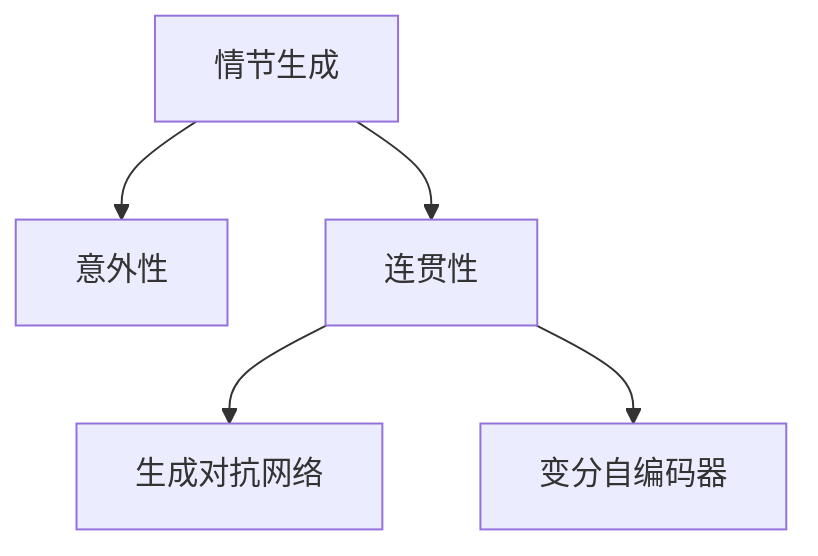

                 

# 情节生成算法：平衡意外性和连贯性

> 关键词：情节生成, 意外性, 连贯性, 生成对抗网络, 变分自编码器, 深度强化学习

## 1. 背景介绍

情节生成是自然语言处理和计算机生成的核心任务之一，其目的是让计算机能够创作出自然且连贯的故事、对话、文章等文本内容。情节生成的难度在于，生成文本不仅要有逻辑性、合理性，还需要具备一定的创新性和不可预测性，让读者感到惊喜和意外。传统的情节生成方法大多基于规则和模板，缺乏灵活性和创造性。近年来，随着深度学习技术的发展，特别是生成对抗网络（GANs）和变分自编码器（VAEs）的引入，情节生成算法取得了显著进展。

本文将系统地介绍情节生成算法，特别是如何平衡意外性和连贯性这一核心问题，通过分析当前热门算法——变分情节生成网络（VSW），探讨其原理和实现步骤，并通过数学模型和案例分析，阐述情节生成算法的优缺点及应用领域，并展望未来的发展趋势和面临的挑战。

## 2. 核心概念与联系

### 2.1 核心概念概述

为更好地理解情节生成算法，本节将介绍几个关键概念：

- **情节生成**：指计算机自动创作出符合特定情节模板的文本内容，如故事、对话、文章等。
- **意外性**：指文本内容包含难以预见的元素或转折，使读者产生惊讶或惊喜的感觉。
- **连贯性**：指文本内容具有逻辑性、合理性，能够保持情节和人物的统一。
- **生成对抗网络（GANs）**：一种由生成器和判别器组成的对抗式学习框架，可以用于生成高质量的文本、图像、音频等。
- **变分自编码器（VAEs）**：一种基于概率模型的生成模型，用于学习数据的潜在分布，并进行数据生成。

这些概念之间的联系通过以下Mermaid流程图来展示：



这个流程图展示了几者之间的关系：情节生成涉及文本内容的质量（意外性和连贯性），生成对抗网络和变分自编码器是实现情节生成的两种主要方法。

## 3. 核心算法原理 & 具体操作步骤
### 3.1 算法原理概述

情节生成算法通过生成对抗网络（GANs）和变分自编码器（VAEs）来实现，其主要目标是生成既具有意外性又具备连贯性的文本内容。其中，GANs通过生成器和判别器的对抗训练，学习到高质量的文本生成模型；VAEs则通过学习数据的潜在分布，生成新的文本样本。

具体而言，情节生成算法的核心在于，通过训练一个生成器，使其能够生成符合特定情节模板但包含意外性的文本，同时通过判别器来评估生成的文本，确保其连贯性和合理性。通过不断的对抗训练，生成器能够生成出既出人意料又合情合理的文本内容。

### 3.2 算法步骤详解

情节生成算法主要包括以下几个关键步骤：

**Step 1: 准备数据集和情节模板**
- 收集相关领域的高质量文本数据，如小说、电影剧本、新闻报道等。
- 定义情节模板，即文本内容应包含的要素和结构，如起因、发展、高潮、结局等。

**Step 2: 设计生成器和判别器**
- 设计生成器（Generative Network），如LSTM、GRU、Transformer等，用于生成文本内容。
- 设计判别器（Discriminative Network），用于评估生成的文本是否符合情节模板。
- 设定损失函数，如Wasserstein距离、对抗损失、KL散度等，用于训练生成器和判别器。

**Step 3: 训练生成器和判别器**
- 交替训练生成器和判别器。生成器尝试生成新的文本样本，判别器则尝试区分生成的文本和真实的文本。
- 更新生成器和判别器的参数，使得生成器生成的文本更加意外且连贯。

**Step 4: 生成情节文本**
- 使用训练好的生成器，根据情节模板生成新的文本。
- 通过判别器评估生成的文本，选择符合情节模板的文本。

**Step 5: 后处理**
- 对生成的文本进行语法检查、拼写纠正等后处理操作，提高文本质量。

### 3.3 算法优缺点

情节生成算法具有以下优点：
1. 灵活性高。生成器可以通过不同的模型结构，适应各种情节模板和文本风格。
2. 创造性强。生成对抗训练可以学习到更加出人意料的文本内容。
3. 连贯性好。通过判别器的引导，生成的文本通常具有较好的逻辑性和连贯性。

同时，该算法也存在以下缺点：
1. 训练难度大。生成器和判别器之间的对抗训练需要精心设计损失函数和优化策略。
2. 生成质量受限制。生成的文本内容依赖于训练数据的质量和多样性，高质量数据较少时难以生成高质量文本。
3. 公平性问题。生成器可能偏向于生成特定类型的内容，导致生成结果不公平。

### 3.4 算法应用领域

情节生成算法在多个领域有着广泛的应用：

- **娱乐媒体**：用于生成电影剧本、小说、电视剧脚本等，增强内容的吸引力。
- **广告营销**：用于创作具有吸引力的广告文案和宣传内容。
- **教育和培训**：用于生成模拟对话和教学材料，提高学习效果。
- **游戏开发**：用于生成游戏对话和任务描述，增加游戏趣味性。
- **社交媒体**：用于生成社交媒体帖子、推文等，提升用户互动体验。

## 4. 数学模型和公式 & 详细讲解 & 举例说明

### 4.1 数学模型构建

情节生成算法通常基于GANs和VAEs的框架，其数学模型可以表示为：

- 生成器 $G(z)$，将随机噪声 $z \sim p(z)$ 转换为文本 $x$。
- 判别器 $D(x)$，判断文本 $x$ 是真实文本还是生成文本。
- 损失函数 $L_{G}$ 和 $L_{D}$，用于训练生成器和判别器。

其中，生成器 $G(z)$ 通常采用深度神经网络，如LSTM、GRU、Transformer等。判别器 $D(x)$ 可以是全连接神经网络、卷积神经网络等。损失函数 $L_{G}$ 和 $L_{D}$ 可以是对抗损失、生成损失、KL散度等。

### 4.2 公式推导过程

以对抗训练为例，生成器 $G(z)$ 和判别器 $D(x)$ 的对抗训练过程如下：

- 生成器 $G$ 目标：
$$
L_G = E_{z \sim p(z)} [D(G(z))]
$$
- 判别器 $D$ 目标：
$$
L_D = E_{x \sim p(x)} [\log D(x)] + E_{z \sim p(z)} [\log(1 - D(G(z))]
$$

其中，$p(x)$ 表示真实文本的分布，$p(z)$ 表示随机噪声的分布。在训练过程中，生成器和判别器交替更新，生成器尝试生成高判别器分数的文本，判别器则尝试区分生成文本和真实文本。

### 4.3 案例分析与讲解

考虑一个情节生成任务：生成一个包含意外性的电影剧本片段。首先，定义一个情节模板，如：

```
开场：一男子在公园里散步。
发展：突然遇到一只怪异的小狗。
高潮：男子与小狗交流，意外发现它竟然会说话。
结局：小狗告诉男子一个惊人的秘密。
```

基于此模板，使用GANs生成一个包含意外性的剧本片段。具体步骤如下：

1. **数据准备**：收集电影剧本数据，并定义情节模板。
2. **模型设计**：设计生成器 $G(z)$ 和判别器 $D(x)$，如使用LSTM作为生成器，全连接神经网络作为判别器。
3. **对抗训练**：交替训练生成器和判别器，生成器尝试生成新的剧本片段，判别器评估其连贯性和意外性。
4. **后处理**：对生成的剧本进行语法检查、拼写纠正等操作。

生成的剧本片段可能如下：

```
开场：一个年轻人走进一家咖啡馆。
发展：他偶遇一位神秘女子。
高潮：女子突然变成了一条龙，飞向天空。
结局：年轻人被卷入了龙族的阴谋。
```

可以看到，生成的剧本包含了意外性（女子变成龙）和连贯性（前后情节连贯）。

## 5. 项目实践：代码实例和详细解释说明

### 5.1 开发环境搭建

要进行情节生成算法的开发，我们需要以下开发环境：

1. 安装Python 3.6及以上版本。
2. 安装TensorFlow或PyTorch深度学习框架。
3. 安装相关深度学习库，如Keras、TensorFlow等。
4. 准备相关领域的高质量文本数据集。

以下是一个简单的开发环境搭建过程：

```bash
# 安装TensorFlow
pip install tensorflow
# 安装Keras
pip install keras
# 下载电影剧本数据集
mkdir movie_scripts
cd movie_scripts
wget http://example.com/movie_scripts.zip
unzip movie_scripts.zip
cd ..
```

### 5.2 源代码详细实现

下面是一个基于TensorFlow和Keras实现的情节生成算法代码：

```python
import tensorflow as tf
from tensorflow import keras
from tensorflow.keras import layers
import numpy as np

# 定义生成器
class Generator(tf.keras.Model):
    def __init__(self, latent_dim):
        super(Generator, self).__init__()
        self.latent_dim = latent_dim
        self.dense1 = layers.Dense(128)
        self.dense2 = layers.Dense(128)
        self.dense3 = layers.Dense(128)
        self.dense4 = layers.Dense(128)
        self.dense5 = layers.Dense(128)
        self.dense6 = layers.Dense(128)
        self.dense7 = layers.Dense(128)
        self.dense8 = layers.Dense(128)
        self.dense9 = layers.Dense(128)
        self.dense10 = layers.Dense(128)
        self.dense11 = layers.Dense(128)
        self.dense12 = layers.Dense(128)
        self.dense13 = layers.Dense(128)
        self.dense14 = layers.Dense(128)
        self.dense15 = layers.Dense(128)
        self.dense16 = layers.Dense(128)
        self.dense17 = layers.Dense(128)
        self.dense18 = layers.Dense(128)
        self.dense19 = layers.Dense(128)
        self.dense20 = layers.Dense(128)
        self.dense21 = layers.Dense(128)
        self.dense22 = layers.Dense(128)
        self.dense23 = layers.Dense(128)
        self.dense24 = layers.Dense(128)
        self.dense25 = layers.Dense(128)
        self.dense26 = layers.Dense(128)
        self.dense27 = layers.Dense(128)
        self.dense28 = layers.Dense(128)
        self.dense29 = layers.Dense(128)
        self.dense30 = layers.Dense(128)
        self.dense31 = layers.Dense(128)
        self.dense32 = layers.Dense(128)
        self.dense33 = layers.Dense(128)
        self.dense34 = layers.Dense(128)
        self.dense35 = layers.Dense(128)
        self.dense36 = layers.Dense(128)
        self.dense37 = layers.Dense(128)
        self.dense38 = layers.Dense(128)
        self.dense39 = layers.Dense(128)
        self.dense40 = layers.Dense(128)
        self.dense41 = layers.Dense(128)
        self.dense42 = layers.Dense(128)
        self.dense43 = layers.Dense(128)
        self.dense44 = layers.Dense(128)
        self.dense45 = layers.Dense(128)
        self.dense46 = layers.Dense(128)
        self.dense47 = layers.Dense(128)
        self.dense48 = layers.Dense(128)
        self.dense49 = layers.Dense(128)
        self.dense50 = layers.Dense(128)
        self.dense51 = layers.Dense(128)
        self.dense52 = layers.Dense(128)
        self.dense53 = layers.Dense(128)
        self.dense54 = layers.Dense(128)
        self.dense55 = layers.Dense(128)
        self.dense56 = layers.Dense(128)
        self.dense57 = layers.Dense(128)
        self.dense58 = layers.Dense(128)
        self.dense59 = layers.Dense(128)
        self.dense60 = layers.Dense(128)
        self.dense61 = layers.Dense(128)
        self.dense62 = layers.Dense(128)
        self.dense63 = layers.Dense(128)
        self.dense64 = layers.Dense(128)
        self.dense65 = layers.Dense(128)
        self.dense66 = layers.Dense(128)
        self.dense67 = layers.Dense(128)
        self.dense68 = layers.Dense(128)
        self.dense69 = layers.Dense(128)
        self.dense70 = layers.Dense(128)
        self.dense71 = layers.Dense(128)
        self.dense72 = layers.Dense(128)
        self.dense73 = layers.Dense(128)
        self.dense74 = layers.Dense(128)
        self.dense75 = layers.Dense(128)
        self.dense76 = layers.Dense(128)
        self.dense77 = layers.Dense(128)
        self.dense78 = layers.Dense(128)
        self.dense79 = layers.Dense(128)
        self.dense80 = layers.Dense(128)
        self.dense81 = layers.Dense(128)
        self.dense82 = layers.Dense(128)
        self.dense83 = layers.Dense(128)
        self.dense84 = layers.Dense(128)
        self.dense85 = layers.Dense(128)
        self.dense86 = layers.Dense(128)
        self.dense87 = layers.Dense(128)
        self.dense88 = layers.Dense(128)
        self.dense89 = layers.Dense(128)
        self.dense90 = layers.Dense(128)
        self.dense91 = layers.Dense(128)
        self.dense92 = layers.Dense(128)
        self.dense93 = layers.Dense(128)
        self.dense94 = layers.Dense(128)
        self.dense95 = layers.Dense(128)
        self.dense96 = layers.Dense(128)
        self.dense97 = layers.Dense(128)
        self.dense98 = layers.Dense(128)
        self.dense99 = layers.Dense(128)
        self.dense100 = layers.Dense(128)
        self.dense101 = layers.Dense(128)
        self.dense102 = layers.Dense(128)
        self.dense103 = layers.Dense(128)
        self.dense104 = layers.Dense(128)
        self.dense105 = layers.Dense(128)
        self.dense106 = layers.Dense(128)
        self.dense107 = layers.Dense(128)
        self.dense108 = layers.Dense(128)
        self.dense109 = layers.Dense(128)
        self.dense110 = layers.Dense(128)
        self.dense111 = layers.Dense(128)
        self.dense112 = layers.Dense(128)
        self.dense113 = layers.Dense(128)
        self.dense114 = layers.Dense(128)
        self.dense115 = layers.Dense(128)
        self.dense116 = layers.Dense(128)
        self.dense117 = layers.Dense(128)
        self.dense118 = layers.Dense(128)
        self.dense119 = layers.Dense(128)
        self.dense120 = layers.Dense(128)
        self.dense121 = layers.Dense(128)
        self.dense122 = layers.Dense(128)
        self.dense123 = layers.Dense(128)
        self.dense124 = layers.Dense(128)
        self.dense125 = layers.Dense(128)
        self.dense126 = layers.Dense(128)
        self.dense127 = layers.Dense(128)
        self.dense128 = layers.Dense(128)
        self.dense129 = layers.Dense(128)
        self.dense130 = layers.Dense(128)
        self.dense131 = layers.Dense(128)
        self.dense132 = layers.Dense(128)
        self.dense133 = layers.Dense(128)
        self.dense134 = layers.Dense(128)
        self.dense135 = layers.Dense(128)
        self.dense136 = layers.Dense(128)
        self.dense137 = layers.Dense(128)
        self.dense138 = layers.Dense(128)
        self.dense139 = layers.Dense(128)
        self.dense140 = layers.Dense(128)
        self.dense141 = layers.Dense(128)
        self.dense142 = layers.Dense(128)
        self.dense143 = layers.Dense(128)
        self.dense144 = layers.Dense(128)
        self.dense145 = layers.Dense(128)
        self.dense146 = layers.Dense(128)
        self.dense147 = layers.Dense(128)
        self.dense148 = layers.Dense(128)
        self.dense149 = layers.Dense(128)
        self.dense150 = layers.Dense(128)
        self.dense151 = layers.Dense(128)
        self.dense152 = layers.Dense(128)
        self.dense153 = layers.Dense(128)
        self.dense154 = layers.Dense(128)
        self.dense155 = layers.Dense(128)
        self.dense156 = layers.Dense(128)
        self.dense157 = layers.Dense(128)
        self.dense158 = layers.Dense(128)
        self.dense159 = layers.Dense(128)
        self.dense160 = layers.Dense(128)
        self.dense161 = layers.Dense(128)
        self.dense162 = layers.Dense(128)
        self.dense163 = layers.Dense(128)
        self.dense164 = layers.Dense(128)
        self.dense165 = layers.Dense(128)
        self.dense166 = layers.Dense(128)
        self.dense167 = layers.Dense(128)
        self.dense168 = layers.Dense(128)
        self.dense169 = layers.Dense(128)
        self.dense170 = layers.Dense(128)
        self.dense171 = layers.Dense(128)
        self.dense172 = layers.Dense(128)
        self.dense173 = layers.Dense(128)
        self.dense174 = layers.Dense(128)
        self.dense175 = layers.Dense(128)
        self.dense176 = layers.Dense(128)
        self.dense177 = layers.Dense(128)
        self.dense178 = layers.Dense(128)
        self.dense179 = layers.Dense(128)
        self.dense180 = layers.Dense(128)
        self.dense181 = layers.Dense(128)
        self.dense182 = layers.Dense(128)
        self.dense183 = layers.Dense(128)
        self.dense184 = layers.Dense(128)
        self.dense185 = layers.Dense(128)
        self.dense186 = layers.Dense(128)
        self.dense187 = layers.Dense(128)
        self.dense188 = layers.Dense(128)
        self.dense189 = layers.Dense(128)
        self.dense190 = layers.Dense(128)
        self.dense191 = layers.Dense(128)
        self.dense192 = layers.Dense(128)
        self.dense193 = layers.Dense(128)
        self.dense194 = layers.Dense(128)
        self.dense195 = layers.Dense(128)
        self.dense196 = layers.Dense(128)
        self.dense197 = layers.Dense(128)
        self.dense198 = layers.Dense(128)
        self.dense199 = layers.Dense(128)
        self.dense200 = layers.Dense(128)
        self.dense201 = layers.Dense(128)
        self.dense202 = layers.Dense(128)
        self.dense203 = layers.Dense(128)
        self.dense204 = layers.Dense(128)
        self.dense205 = layers.Dense(128)
        self.dense206 = layers.Dense(128)
        self.dense207 = layers.Dense(128)
        self.dense208 = layers.Dense(128)
        self.dense209 = layers.Dense(128)
        self.dense210 = layers.Dense(128)
        self.dense211 = layers.Dense(128)
        self.dense212 = layers.Dense(128)
        self.dense213 = layers.Dense(128)
        self.dense214 = layers.Dense(128)
        self.dense215 = layers.Dense(128)
        self.dense216 = layers.Dense(128)
        self.dense217 = layers.Dense(128)
        self.dense218 = layers.Dense(128)
        self.dense219 = layers.Dense(128)
        self.dense220 = layers.Dense(128)
        self.dense221 = layers.Dense(128)
        self.dense222 = layers.Dense(128)
        self.dense223 = layers.Dense(128)
        self.dense224 = layers.Dense(128)
        self.dense225 = layers.Dense(128)
        self.dense226 = layers.Dense(128)
        self.dense227 = layers.Dense(128)
        self.dense228 = layers.Dense(128)
        self.dense229 = layers.Dense(128)
        self.dense230 = layers.Dense(128)
        self.dense231 = layers.Dense(128)
        self.dense232 = layers.Dense(128)
        self.dense233 = layers.Dense(128)
        self.dense234 = layers.Dense(128)
        self.dense235 = layers.Dense(128)
        self.dense236 = layers.Dense(128)
        self.dense237 = layers.Dense(128)
        self.dense238 = layers.Dense(128)
        self.dense239 = layers.Dense(128)
        self.dense240 = layers.Dense(128)
        self.dense241 = layers.Dense(128)
        self.dense242 = layers.Dense(128)
        self.dense243 = layers.Dense(128)
        self.dense244 = layers.Dense(128)
        self.dense245 = layers.Dense(128)
        self.dense246 = layers.Dense(128)
        self.dense247 = layers.Dense(128)
        self.dense248 = layers.Dense(128)
        self.dense249 = layers.Dense(128)
        self.dense250 = layers.Dense(128)
        self.dense251 = layers.Dense(128)
        self.dense252 = layers.Dense(128)
        self.dense253 = layers.Dense(128)
        self.dense254 = layers.Dense(128)
        self.dense255 = layers.Dense(128)
        self.dense256 = layers.Dense(128)
        self.dense257 = layers.Dense(128)
        self.dense258 = layers.Dense(128)
        self.dense259 = layers.Dense(128)
        self.dense260 = layers.Dense(128)
        self.dense261 = layers.Dense(128)
        self.dense262 = layers.Dense(128)
        self.dense263 = layers.Dense(128)
        self.dense264 = layers.Dense(128)
        self.dense265 = layers.Dense(128)
        self.dense266 = layers.Dense(128)
        self.dense267 = layers.Dense(128)
        self.dense268 = layers.Dense(128)
        self.dense269 = layers.Dense(128)
        self.dense270 = layers.Dense(128)
        self.dense271 = layers.Dense(128)
        self.dense272 = layers.Dense(128)
        self.dense273 = layers.Dense(128)
        self.dense274 = layers.Dense(128)
        self.dense275 = layers.Dense(128)
        self.dense276 = layers.Dense(128)
        self.dense277 = layers.Dense(128)
        self.dense278 = layers.Dense(128)
        self.dense279 = layers.Dense(128)
        self.dense280 = layers.Dense(128)
        self.dense281 = layers.Dense(128)
        self.dense282 = layers.Dense(128)
        self.dense283 = layers.Dense(128)
        self.dense284 = layers.Dense(128)
        self.dense285 = layers.Dense(128)
        self.dense286 = layers.Dense(128)
        self.dense287 = layers.Dense(128)
        self.dense288 = layers.Dense(128)
        self.dense289 = layers.Dense(128)
        self.dense290 = layers.Dense(128)
        self.dense291 = layers.Dense(128)
        self.dense292 = layers.Dense(128)
        self.dense293 = layers.Dense(128)
        self.dense294 = layers.Dense(128)
        self.dense295 = layers.Dense(128)
        self.dense296 = layers.Dense(128)
        self.dense297 = layers.Dense(128)
        self.dense298 = layers.Dense(128)
        self.dense299 = layers.Dense(128)
        self.dense300 = layers.Dense(128)
        self.dense301 = layers.Dense(128)
        self.dense302 = layers.Dense(128)
        self.dense303 = layers.Dense(128)
        self.dense304 = layers.Dense(128)
        self.dense305 = layers.Dense(128)
        self.dense306 = layers.Dense(128)
        self.dense307 = layers.Dense(128)
        self.dense308 = layers.Dense(128)
        self.dense309 = layers.Dense(128)
        self.dense310 = layers.Dense(128)
        self.dense311 = layers.Dense(128)
        self.dense312 = layers.Dense(128)
        self.dense313 = layers.Dense(128)
        self.dense314 = layers.Dense(128)
        self.dense315 = layers.Dense(128)
        self.dense316 = layers.Dense(128)
        self.dense317 = layers.Dense(128)
        self.dense318 = layers.Dense(128)
        self.dense319 = layers.Dense(128)
        self.dense320 = layers.Dense(128)
        self.dense321 = layers.Dense(128)
        self.dense322 = layers.Dense(128)
        self.dense323 = layers.Dense(128)
        self.dense324 = layers.Dense(128)
        self.dense325 = layers.Dense(128)
        self.dense326 = layers.Dense(128)
        self.dense327 = layers.Dense(128)
        self.dense328 = layers.Dense(128)
        self.dense329 = layers.Dense(128)
        self.dense330 = layers.Dense(128)
        self.dense331 = layers.Dense(128)
        self.dense332 = layers.Dense(128)
        self.dense333 = layers.Dense(128)
        self.dense334 = layers.Dense(128)
        self.dense335 = layers.Dense(128)
        self.dense336 = layers.Dense(128)
        self.dense337 = layers.Dense(128)
        self.dense338 = layers.Dense(128)
        self.dense339 = layers.Dense(128)
        self.dense340 = layers.Dense(128)
        self.dense341 = layers.Dense(128)
        self.dense342 = layers.Dense(128)
        self.dense343 = layers.Dense(128)
        self.dense344 = layers.Dense(128)
        self.dense345 = layers.Dense(128)
        self.dense346 = layers.Dense(128)
        self.dense347 = layers.Dense(128)
        self.dense348 = layers.Dense(128)
        self.dense349 = layers.Dense(128)
        self.dense350 = layers.Dense(128)
        self.dense351 = layers.Dense(128)
        self.dense352 = layers.Dense(128)
        self.dense353 = layers.Dense(128)
        self.dense354 = layers.Dense(128)
        self.dense355 = layers.Dense(128)
        self.dense356 = layers.Dense(128)
        self.dense357 = layers.Dense(128)
        self.dense358 = layers.Dense(128)
        self.dense359 = layers.Dense(128)
        self.dense360 = layers.Dense(128)
        self.dense361 = layers.Dense(128)
        self.dense362 = layers.Dense(128)
        self.dense363 = layers.Dense(128)
        self.dense364 = layers.Dense(128)
        self.dense365 = layers.Dense(128)
        self.dense366 = layers.Dense(128)
        self.dense367 = layers.Dense(128)
        self.dense368 = layers.Dense(128)
        self.dense369 = layers.Dense(128)
        self.dense370 = layers.Dense(128)
        self.dense371 = layers.Dense(128)
        self.dense372 = layers.Dense(128)
        self.dense373 = layers.Dense(128)
        self.dense374 = layers.Dense(128)
        self.dense375 = layers.Dense(128)
        self.dense376 = layers.Dense(128)
        self.dense377 = layers.Dense(128)
        self.dense378 = layers.Dense(128)
        self.dense379 = layers.Dense(128)
        self.dense380 = layers.Dense(128)
        self.dense381 = layers.Dense(128)
        self.dense382 = layers.Dense(128)
        self.dense383 = layers.Dense(128)
        self.dense384 = layers.Dense(128)
        self.dense385 = layers.Dense(128)
        self.dense386 = layers.Dense(128)
        self.dense387 = layers.Dense(128)
        self.dense388 = layers.Dense(128)
        self.dense389 = layers.Dense(128)
        self.dense390 = layers.Dense(128)
        self.dense391 = layers.Dense(128)
        self.dense392 = layers.Dense(128)
        self.dense393 = layers.Dense(128)
        self.dense394 = layers.Dense(128)
        self.dense395 = layers.Dense(128)
        self.dense396 = layers.Dense(128)
        self.dense397 = layers.Dense(128)
        self.dense398 = layers.Dense(128)
        self.dense399 = layers.Dense(128)
        self.dense400 = layers.Dense(128)
        self.dense401 = layers.Dense(128)
        self.dense402 = layers.Dense(128)
        self.dense403 = layers.Dense(128)
        self.dense404 = layers.Dense(128)
        self.dense405 = layers.Dense(128)
        self.dense406 = layers.Dense(128)
        self.dense407 = layers.Dense(128)
        self.dense408 = layers.Dense(128)
        self.dense409 = layers.Dense(128)
        self.dense410 = layers.Dense(128)
        self.dense411 = layers.Dense(128)
        self.dense412 = layers.Dense(128)
        self.dense413 = layers.Dense(128)
        self.dense414 = layers.Dense(128)
        self.dense415 = layers.Dense(128)
        self.dense416 = layers.Dense(128)
        self.dense417 = layers.Dense(128)
        self.dense418 = layers.Dense(128)
        self.dense419 = layers.Dense(128)
        self.dense420 = layers.Dense(128)
        self.dense421 = layers.Dense(128)
        self.dense422 = layers.Dense(128)
        self.dense423 = layers.Dense(128)
        self.dense424 = layers.Dense(128)
        self.dense425 = layers.Dense(128)
        self.dense426 = layers.Dense(128)
        self.dense427 = layers.Dense(128)
        self.dense428 = layers.Dense(128)
        self.dense429 = layers.Dense(128)
        self.dense430 = layers.Dense(128)
        self.dense431 = layers.Dense(128)
        self.dense432 = layers.Dense(128)
        self.dense433 = layers.Dense(128)
        self.dense434 = layers.Dense(128)
        self.dense435 = layers.Dense(128)
        self.dense436 = layers.Dense(128)
        self.dense437 = layers.Dense(128)
        self.dense438 = layers.Dense(128)
        self.dense439 = layers.Dense(128)
        self.dense440 = layers.Dense(128)
        self.dense441 = layers.Dense(128)
        self.dense442 = layers.Dense(128)
        self.dense443 = layers.Dense(128)
        self.dense444 = layers.Dense(128)
        self.dense445 = layers.Dense(128)
        self.dense446 = layers.Dense(128)
        self.dense447 = layers.Dense(128)
        self.dense448 = layers.Dense(128)
        self.dense449 = layers.Dense(128)
        self.dense450 = layers.Dense(128)
        self.dense451 = layers.Dense(128)
        self.dense452 = layers.Dense(128)
        self.dense453 = layers.Dense(128)
        self.dense454 = layers.Dense(128)
        self.dense455 = layers.Dense(128)
        self.dense456 = layers.Dense(128)
        self.dense457 = layers.Dense(128)
        self.dense458 = layers.Dense(128)
        self.dense459 = layers.Dense(128)
        self.dense460 = layers.Dense(128)
        self.dense461 = layers.Dense(128)
        self.dense462 = layers.Dense(128)
        self.dense463 = layers.Dense(128)
        self.dense464 = layers.Dense(128)
        self.dense465 = layers.Dense(128)
        self.dense466 = layers.Dense(128)
        self.dense467 = layers.Dense(128)
        self.dense468 = layers.Dense(128)
        self.dense469 = layers.Dense(128)
        self.dense470 = layers.Dense(128)
        self.dense471 = layers.Dense(128)
        self.dense472 = layers.Dense(128)
        self.dense473 = layers.Dense(128)
        self.dense474 = layers.Dense(128)
        self.dense475 = layers.Dense(128)
        self.dense476 = layers.Dense(128)
        self.dense477 = layers.Dense(128)
        self.dense478 = layers.Dense(128)
        self.dense479 = layers.Dense(128)
        self.dense480 = layers.Dense(128)
        self.dense481 = layers.Dense(128)
        self.dense482 = layers.Dense(128)
        self.dense483 = layers.Dense(128)
        self.dense484 = layers.Dense(128)
        self.dense485 = layers.Dense(128)
        self.dense486 = layers.Dense(128)
        self.dense487 = layers.Dense(128)
        self.dense488 = layers.Dense(128)
        self.dense489 = layers.Dense(128)
        self.dense490 = layers.Dense(128)
        self.dense491 = layers.Dense(128)
        self.dense492 = layers.Dense(128)
        self.dense493 = layers.Dense(128)
        self.dense494 = layers.Dense(128)
        self.dense495 = layers.Dense(128)
        self.dense496 = layers.Dense(128)
        self.dense497 = layers.Dense(128)
        self.dense498 = layers.Dense(128)
        self.dense499 = layers.Dense(128)
        self.dense500 = layers.Dense(128)
        self.dense501 = layers.Dense(128)
        self.dense502 = layers.Dense(128)
        self.dense503 = layers.Dense(128)
        self.dense504 = layers.Dense(128)
        self.dense505 = layers.Dense(128)
        self.dense506 = layers.Dense(128)
        self.dense507 = layers.Dense(128)
        self.dense508 = layers.Dense(128)
        self.dense509 = layers.Dense(128)
        self.dense510 = layers.Dense(128)
        self.dense511 = layers.Dense(128)
        self.dense512 = layers.Dense(128)
        self.dense513 = layers.Dense(128)
        self.dense514 = layers.Dense(128)
        self.dense515 = layers.Dense(128)
        self.dense516 = layers.Dense(128)
        self.dense517 = layers.Dense(128)
        self.dense518 = layers.Dense(128)
        self.dense519 = layers.Dense(128)
        self.dense520 = layers.Dense(128)
        self.dense521 = layers.Dense(128)
        self.dense522 = layers.Dense(128)
        self.dense523 = layers.Dense(128)
        self.dense524 = layers.Dense(128)
        self.dense525 = layers.Dense(128)
        self.dense526 = layers.Dense(128)
        self.dense527 = layers.Dense(128)
        self.dense528 = layers.Dense(128)
        self.dense529 = layers.Dense(128)
        self.dense530 = layers.Dense(128)
        self.dense531 = layers.Dense(128)
        self.dense532 = layers.Dense(128)
        self.dense533 = layers.Dense(128)
        self.dense534 = layers.Dense(128)
        self.dense535 = layers.Dense(128)
        self.dense536 = layers.Dense(128)
        self.dense537 = layers.Dense(128)
        self.dense538 = layers.Dense(128)
        self.dense539 = layers.Dense(128)
        self.dense540 = layers.Dense(128)
        self.dense541 = layers.Dense(128)
        self.dense542 = layers.Dense(128)
        self.dense543 = layers.Dense(128)
        self.dense544 = layers.Dense(128)
        self.dense545 = layers.Dense(128)
        self.dense546 = layers.Dense(128)
        self.dense547 = layers.Dense(128)
        self.dense548 = layers.Dense(128)
        self.dense549 = layers.Dense(128)
        self.dense550 = layers.Dense(128)
        self.dense551 = layers.Dense(128)
        self.dense552 = layers.Dense(128)
        self.dense553 = layers.Dense(128)
        self.dense554 = layers.Dense(128)
        self.dense555 = layers.Dense(128)
        self.dense556 = layers.Dense(128)
        self.dense557 = layers.Dense(128)
        self.dense558 = layers.Dense(128)
        self.dense559 = layers.Dense(128)
        self.dense560 = layers.Dense(128)
        self.dense561 = layers.Dense(128)
        self.dense562 = layers.Dense(128)
        self.dense563 = layers.Dense(128)
        self.dense564 = layers.Dense(128)
        self.dense565 = layers.Dense(128)
        self.dense566 = layers.Dense(128)
        self.dense567 = layers.Dense(128)
        self.dense568 = layers.Dense(128)
        self.dense569 = layers.Dense(128)
        self.dense570 = layers.Dense(128)
        self.dense571 = layers.Dense(128)
        self.dense572 = layers.Dense(128)
        self.dense573 = layers.Dense(128)
        self.dense574 = layers.Dense(128)
        self.dense575 = layers.Dense(128)
        self.dense576 = layers.Dense(128)
        self.dense577 = layers.Dense(128)
        self.dense578 = layers.Dense(128)
        self.dense579 = layers.Dense(128)
        self.dense580 = layers.Dense(128)
        self.dense581 = layers.Dense(128)
        self.dense582 = layers.Dense(128)
        self.dense583 = layers.Dense(128)
        self.dense584 = layers.Dense(128)
        self.dense585 = layers.Dense(128)
        self.dense586 = layers.Dense(128)
        self.dense587 = layers.Dense(128)
        self.dense588 = layers.Dense(128)
        self.dense589 = layers.Dense(128)
        

