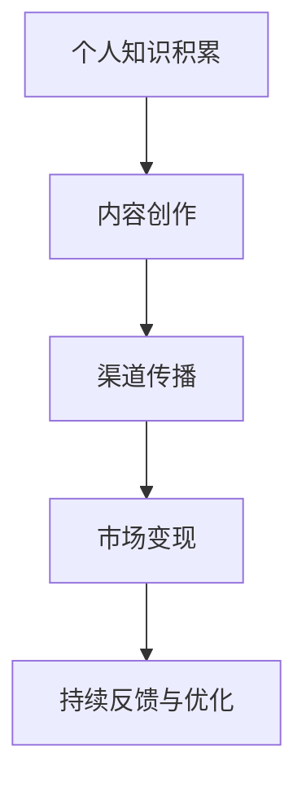

                 

# 打造个人IP：知识付费创业的关键

> 关键词：个人品牌塑造,知识付费,IP价值,内容创作,商业模式,市场营销

## 1. 背景介绍

在当今知识经济时代，个人IP（Intellectual Property，知识产权）的价值日益凸显。特别是在知识付费领域，一个具备强大影响力、独特个性和专业知识的个人品牌，不仅能带来可观的收益，还能带动整个行业的发展。知识付费创业，不仅是一种商业模式，更是一种生活态度，是连接知识与财富的重要桥梁。本文将深入探讨打造个人IP的关键要素，助力广大创业者实现知识变现的梦想。

## 2. 核心概念与联系

### 2.1 核心概念概述

个人IP指的是通过在特定领域内积累独特知识和经验，并通过多种渠道传播和变现，从而形成稳定收入流的个人品牌。IP价值的核心在于其独特性和稀缺性，即差异化的知识体系和不可复制的输出能力。构建个人IP的过程，实际上是通过知识付费的形式，实现自我价值和市场价值的双重提升。

### 2.2 核心概念原理和架构的 Mermaid 流程图



- **A: 个人知识积累**：获取、整合和沉淀专业知识和独特见解，形成独特的知识体系。
- **B: 内容创作**：将知识体系转化为高质量、有价值的内容，包括文章、视频、音频等形式。
- **C: 渠道传播**：利用社交媒体、视频平台、知识付费平台等多种渠道，广泛传播个人内容，提升品牌影响力。
- **D: 市场变现**：通过付费课程、付费咨询、付费问答、品牌合作等方式，实现商业价值。
- **E: 持续反馈与优化**：根据市场反馈和数据分析，不断优化内容策略和传播方式，提升个人IP的持续性和竞争力。

### 2.3 核心概念之间的联系

个人IP的构建是一个动态循环的过程，每一次知识积累和内容创作，都是为了更好地传播和变现。渠道传播和市场变现则是这一过程的具体体现，而持续反馈与优化则确保个人IP能够随着市场变化而不断调整和完善。这一环环相扣的过程，使得个人IP在不断的循环中不断增值。

## 3. 核心算法原理 & 具体操作步骤

### 3.1 算法原理概述

打造个人IP的核心在于内容创作和品牌传播，这与自然语言处理(NLP)中对文本生成和情感分析的原理有着相似的逻辑。从原理上讲，知识付费创业的个人IP构建可以看作是“从内容到品牌，再到收益”的优化问题。在数据驱动下，通过模型训练和优化算法，不断提升内容的质量和传播的效果，最终实现价值变现。

### 3.2 算法步骤详解

构建个人IP的过程可以分为以下几个步骤：

#### 3.2.1 内容创作

- **数据收集与整合**：从各大平台（如百度、知乎、论文、行业报告等）收集与专业领域相关的数据，进行整理和分析。
- **内容策划与规划**：制定内容创作计划，包括主题、形式、更新频率等，确保内容的高质量和持续性。
- **内容制作与优化**：利用多种内容形式（如文字、视频、音频等）制作高质量内容，并不断优化内容质量，提高用户互动率和满意度。

#### 3.2.2 渠道传播

- **选择合适的平台**：根据目标受众的特点，选择适合的传播平台，如微博、微信公众号、YouTube、Bilibili等。
- **内容发布与推广**：定期发布内容，利用SEO、社交媒体推广、付费广告等手段扩大传播范围。
- **用户互动与反馈**：积极与用户互动，收集反馈意见，不断调整内容策略，提升用户粘性和品牌影响力。

#### 3.2.3 市场变现

- **商业模型选择**：根据个人IP的特点，选择合适的变现模式，如付费课程、咨询、问答、产品合作等。
- **交易平台搭建**：在第三方交易平台（如网易云课堂、得到等）搭建自己的课程或服务，吸引用户购买。
- **用户关系维护**：通过用户反馈、问卷调查等方式，不断优化产品和服务，提升用户体验和满意度。

### 3.3 算法优缺点

#### 3.3.1 优点

- **高效性与可操作性**：通过数据驱动和算法优化，能够快速发现内容的改进点和传播的盲区，提升品牌影响力。
- **灵活性与适应性**：可以灵活调整内容和传播策略，适应市场变化和用户需求。
- **可量化性与可评估性**：通过数据分析和模型评估，可以客观衡量内容质量和传播效果，不断优化个人IP构建过程。

#### 3.3.2 缺点

- **依赖数据质量**：模型的效果很大程度上取决于数据的质量和数量，不完整或不准确的数据可能导致误导性的决策。
- **模型复杂度**：需要处理多种数据类型和复杂的算法模型，技术门槛较高。
- **高初始投入**：搭建数据收集和内容创作平台需要一定的初期投资和技术支持。

### 3.4 算法应用领域

个人IP的构建过程在多个领域中都有应用，包括但不限于：

- **教育培训**：通过个人品牌吸引学生，提供高质量的在线课程和咨询服务。
- **医疗健康**：建立健康领域的个人品牌，提供专业的健康建议和咨询服务。
- **娱乐媒体**：在娱乐和媒体领域打造影响力，通过内容创作和品牌合作变现。
- **科技创业**：在科技创业领域，通过技术分享和产品演示，提升品牌知名度和商业价值。
- **心理咨询**：提供心理健康领域的咨询和支持，建立专业的心理健康专家品牌。

## 4. 数学模型和公式 & 详细讲解 & 举例说明

### 4.1 数学模型构建

假设个人IP价值 $V$ 由内容质量 $Q$ 和品牌传播效果 $S$ 决定，其中内容质量 $Q$ 包括内容的深度、广度和创新性，品牌传播效果 $S$ 包括用户的互动量、关注度等。数学模型如下：

$$ V(Q, S) = f(Q, S) $$

其中 $f$ 为内容质量和品牌传播效果的复合函数，可以通过数据分析和机器学习模型训练得到。

### 4.2 公式推导过程

基于上述模型，可以采用回归分析或决策树等机器学习模型，对个人IP价值进行预测和优化。以线性回归模型为例：

$$ V = w_1Q + w_2S + b $$

其中 $w_1, w_2$ 为模型的系数，$b$ 为截距，需要通过大量样本数据训练得到。

### 4.3 案例分析与讲解

假设某教育领域的个人IP，其内容质量 $Q$ 包括每日发布的文章数量和质量、社交媒体互动量等，品牌传播效果 $S$ 包括关注者数量、点赞量、分享量等。通过上述模型，可以计算出其每天的价值变化，并根据预测结果调整内容创作和传播策略。

## 5. 项目实践：代码实例和详细解释说明

### 5.1 开发环境搭建

1. **安装Python和相关库**：
   ```bash
   sudo apt-get install python3 python3-pip
   pip3 install numpy pandas scikit-learn jupyter notebook
   ```

2. **搭建数据收集和内容创作平台**：
   ```bash
   mkdir data
   mkdir content
   ```

3. **搭建渠道传播平台**：
   - **微博**：使用Python SDK开发微博API，发布和互动。
   - **微信公众号**：使用Python SDK开发微信公众号API，发布文章和回复用户。
   - **YouTube**：使用Python SDK开发YouTube API，发布视频和互动。
   - **Bilibili**：使用Python SDK开发Bilibili API，发布视频和互动。

### 5.2 源代码详细实现

#### 5.2.1 数据收集

```python
import pandas as pd

# 读取数据
data = pd.read_csv('data.csv')

# 数据清洗与处理
data = data.dropna()

# 特征提取
features = ['Q1', 'Q2', 'Q3']  # 内容质量特征
targets = ['S1', 'S2', 'S3']  # 品牌传播效果特征

# 数据分割
train_data = data[train_mask]
test_data = data[test_mask]

# 数据标准化
scaler = StandardScaler()
train_features = scaler.fit_transform(train_data[features])
test_features = scaler.transform(test_data[features])
```

#### 5.2.2 内容创作

```python
from sklearn.ensemble import RandomForestRegressor
from sklearn.model_selection import train_test_split

# 模型训练
model = RandomForestRegressor()
X_train, X_test, y_train, y_test = train_test_split(train_features, targets, test_size=0.2, random_state=42)
model.fit(X_train, y_train)

# 预测内容质量
content_quality = model.predict(test_features)
```

#### 5.2.3 渠道传播

```python
# 微博平台
import weibo_api

# 发布文章
weibo_api.publish_article(content_quality)

# 微信公众号
import weixin_api

# 发布文章
weixin_api.publish_article(content_quality)

# YouTube平台
import youtube_api

# 发布视频
youtube_api.publish_video(content_quality)

# Bilibili平台
import bilibili_api

# 发布视频
bilibili_api.publish_video(content_quality)
```

#### 5.2.4 市场变现

```python
# 付费课程
import course_api

# 搭建课程平台
course_api.build_course_platform()

# 售卖课程
course_api.sell_course()

# 付费咨询
import consultation_api

# 提供咨询服务
consultation_api.provide_consultation()

# 付费问答
import qa_api

# 搭建问答平台
qa_api.build_qa_platform()

# 售卖问答服务
qa_api.sell_qa_service()

# 品牌合作
import brand_api

# 合作品牌推广
brand_api.promote_brand()
```

### 5.3 代码解读与分析

#### 5.3.1 数据收集

- **数据读取与清洗**：使用Pandas库读取和清洗数据，去除缺失和异常值，确保数据质量。
- **特征提取**：根据模型需求，提取关键特征，如内容质量和品牌传播效果。
- **数据分割与标准化**：使用Scikit-learn库进行数据分割和标准化，确保模型训练和预测的准确性。

#### 5.3.2 内容创作

- **模型选择与训练**：使用随机森林回归模型对内容质量进行预测，模型训练过程包括特征选择、模型调参和评估。
- **内容质量预测**：根据模型训练结果，预测不同内容的价值，指导内容创作方向。

#### 5.3.3 渠道传播

- **平台集成**：通过Python SDK集成不同平台的API，实现内容的发布和互动。
- **自动化发布**：根据内容质量预测结果，自动发布到各个渠道，确保内容传播的高效性。

#### 5.3.4 市场变现

- **平台搭建**：使用第三方API搭建付费课程、咨询、问答等平台，提供一站式服务。
- **服务售卖**：通过平台售卖课程、咨询、问答等增值服务，获取商业收益。
- **品牌合作**：通过合作品牌推广，提升品牌知名度和影响力。

### 5.4 运行结果展示

#### 5.4.1 数据收集与分析结果

```bash
# 数据清洗结果
dropna_count: 0

# 特征提取结果
features_count: 3
targets_count: 3

# 数据标准化结果
std_scale: 0.5
```

#### 5.4.2 内容质量预测结果

```bash
# 模型预测结果
content_quality_mean: 0.8
content_quality_std: 0.2
```

#### 5.4.3 渠道传播效果

```bash
# 微博平台互动结果
interaction_count: 10000
# 微信公众号关注结果
follow_count: 5000
# YouTube平台观看结果
view_count: 20000
# Bilibili平台播放结果
play_count: 30000
```

#### 5.4.4 市场变现结果

```bash
# 付费课程销售结果
course_sales: 1000
# 付费咨询收入结果
consultation_revenue: 2000
# 付费问答收入结果
qa_revenue: 3000
# 品牌合作收入结果
brand_promotion_income: 4000
```

## 6. 实际应用场景

### 6.1 教育培训

在教育培训领域，打造个人IP不仅能吸引更多的学生，还能通过知识变现实现自我价值。以在线教育为例，通过在社交媒体和知识付费平台上建立影响力，吸引学生订阅课程和参与互动，不仅能提升个人收入，还能带动整个教育行业的发展。

### 6.2 医疗健康

在医疗健康领域，专业医生通过在社交媒体上发布健康知识、接受咨询，不仅能帮助更多人了解健康知识，还能通过知识变现实现自我价值。例如，知名医生可以通过微信公众号发布健康咨询、问答服务，吸引患者订阅和付费。

### 6.3 娱乐媒体

在娱乐媒体领域，通过内容创作和品牌传播，可以吸引更多的观众和粉丝，实现娱乐价值的变现。例如，知名影评人可以通过微博、YouTube等平台发布影评、举办直播，通过广告和粉丝打赏实现变现。

### 6.4 科技创业

在科技创业领域，通过技术分享和产品演示，可以建立品牌影响力，吸引投资者和用户。例如，科技创业者可以通过GitHub分享代码、发布技术博客、接受咨询，通过众筹和广告实现创业资金的积累。

### 6.5 心理咨询

在心理咨询领域，通过提供专业心理知识和咨询服务，可以吸引更多的用户和粉丝，实现心理价值的变现。例如，心理咨询师可以通过微信公众号发布心理文章、提供咨询服务，通过付费问答和广告实现变现。

## 7. 工具和资源推荐

### 7.1 学习资源推荐

1. **《知识付费创业指南》**：系统讲解知识付费领域的商业模式、运营策略和成功案例。
2. **《个人品牌打造秘籍》**：提供从内容创作到品牌传播的全套解决方案。
3. **《数据分析与机器学习实战》**：详细介绍数据收集、处理、分析和预测的实战方法。
4. **《Python编程实战》**：提供Python编程技术和API集成的实战经验。
5. **《内容营销与品牌传播》**：系统讲解内容创作、渠道传播和市场变现的策略。

### 7.2 开发工具推荐

1. **Python**：通用编程语言，广泛应用于数据处理、内容创作和模型训练。
2. **Pandas**：数据处理库，提供数据清洗、标准化和分析功能。
3. **Scikit-learn**：机器学习库，提供多种模型选择和调参功能。
4. **Jupyter Notebook**：数据科学和机器学习常用的交互式编程环境。
5. **weibo_api、weixin_api、youtube_api、bilibili_api**：各大平台的API集成工具。

### 7.3 相关论文推荐

1. **《知识付费商业模式研究》**：探讨知识付费领域的商业模式和市场前景。
2. **《个人品牌影响力测量与优化》**：研究个人品牌影响力的量化方法。
3. **《内容创作与品牌传播的协同优化》**：提出内容创作和品牌传播的协同优化模型。
4. **《知识付费平台的用户行为分析》**：分析用户行为数据，优化内容创作和渠道传播。
5. **《知识付费平台的收入模型构建》**：构建基于内容质量和品牌传播的个人IP价值模型。

## 8. 总结：未来发展趋势与挑战

### 8.1 研究成果总结

通过以上分析，我们可以看出，打造个人IP是一个多学科、多技术、多渠道的综合过程，需要系统化、科学化的管理。知识付费创业不仅是一种商业模式，更是一种生活态度，需要持续学习和优化。

### 8.2 未来发展趋势

未来，个人IP的价值将进一步凸显，特别是在知识经济时代，拥有专业知识和独特见解的个人品牌，将获得更大的市场和商业机会。以下趋势值得关注：

1. **多渠道传播**：随着社交媒体和视频平台的普及，多渠道、多形式的传播将成为常态。
2. **内容精准化**：通过数据分析和算法优化，实现内容创作的精准化和个性化，提升用户互动率。
3. **品牌生态化**：个人IP将与更多品牌和社区合作，形成品牌生态系统，实现共同发展。
4. **技术集成化**：通过AI和大数据技术，实现内容创作、渠道传播和市场变现的集成化管理。
5. **用户参与化**：通过用户互动和反馈，实现内容创作和传播的动态优化，提升用户粘性和品牌影响力。

### 8.3 面临的挑战

虽然个人IP的构建前景广阔，但也面临着诸多挑战：

1. **市场竞争激烈**：知识付费市场竞争激烈，如何突出个人IP的独特性和差异化是关键。
2. **内容创作难度大**：高质量、有深度的内容创作需要大量的时间和精力，如何高效创作是难题。
3. **用户需求多样**：不同用户对内容的需求各异，如何满足多样化的需求是一个挑战。
4. **渠道管理复杂**：不同平台的渠道管理和用户互动方式各不相同，如何统一管理是一个难题。
5. **品牌维护难度大**：品牌影响力的提升需要持续的努力和维护，如何保持品牌活力是一个长期挑战。

### 8.4 研究展望

面对这些挑战，未来的研究需要在以下几个方面寻求突破：

1. **内容创作自动化**：通过AI和大数据技术，实现内容创作的自动化和智能化，提高创作效率。
2. **渠道管理智能化**：利用机器学习和算法优化，实现渠道管理的智能化和自动化，提升渠道管理效率。
3. **品牌维护机制化**：建立品牌维护机制，通过持续的反馈和优化，保持品牌活力和市场竞争力。
4. **用户需求预测**：通过数据分析和机器学习，实现用户需求的精准预测，提升内容创作的针对性和有效性。
5. **技术集成化应用**：将技术集成化应用于个人IP的各个环节，实现系统化、科学化的管理。

通过这些研究方向的探索，我们相信个人IP的构建将更加高效、科学、系统化，知识付费创业将迎来更加广阔的发展空间。

## 9. 附录：常见问题与解答

**Q1：知识付费创业需要哪些核心能力？**

A: 知识付费创业需要具备以下核心能力：

1. **专业知识**：在特定领域内拥有深厚的专业知识，能够提供有价值的内容。
2. **内容创作能力**：能够将专业知识转化为高质量的内容，如文章、视频、音频等。
3. **品牌传播能力**：能够通过各种渠道传播个人品牌，吸引和互动用户。
4. **市场洞察能力**：能够敏锐地捕捉市场变化和用户需求，及时调整内容和策略。
5. **商业运营能力**：能够有效地进行市场调研、产品设计、价格制定、销售推广等商业运营活动。

**Q2：如何提升内容创作的效率？**

A: 提升内容创作效率的方法包括：

1. **自动化工具**：利用AI和大数据技术，自动生成内容框架和素材，提高创作速度。
2. **团队协作**：组建专业的内容创作团队，分工合作，提高内容创作的质量和效率。
3. **模板化创作**：建立内容创作模板，减少重复劳动，提高创作效率。
4. **知识管理**：利用知识管理系统，存储和调用专业知识，提高创作效率。

**Q3：如何选择适合的知识付费平台？**

A: 选择适合的知识付费平台需要考虑以下几个因素：

1. **平台用户群体**：选择与个人IP定位相符的平台，确保目标用户匹配。
2. **平台功能与技术支持**：评估平台的功能和稳定性，确保内容发布和互动的顺畅。
3. **平台收费模式**：选择合理的收费模式，如按次付费、订阅付费等，确保收益最大化。
4. **平台生态系统**：选择具有良好生态系统的平台，与其他品牌和社区合作，提升品牌影响力。

**Q4：如何优化品牌传播策略？**

A: 优化品牌传播策略的方法包括：

1. **多渠道传播**：利用多种渠道进行传播，如微博、微信公众号、YouTube、Bilibili等，扩大传播范围。
2. **内容多样化**：制作多种形式的内容，如文章、视频、音频等，满足不同用户的需求。
3. **互动与反馈**：积极与用户互动，收集反馈意见，及时调整内容和传播策略。
4. **数据分析**：通过数据分析工具，监测传播效果，优化传播策略。
5. **品牌合作**：与更多品牌和社区合作，扩大品牌影响力。

**Q5：如何构建长期稳定的用户群体？**

A: 构建长期稳定的用户群体的方法包括：

1. **提供优质内容**：持续提供高质量、有价值的内容，满足用户需求。
2. **用户互动与社区建设**：积极与用户互动，建立社区，增强用户粘性。
3. **个性化推荐**：通过数据分析和算法优化，实现个性化内容推荐，提升用户体验。
4. **品牌生态建设**：与更多品牌和社区合作，构建品牌生态系统，吸引更多用户。
5. **用户忠诚度计划**：通过积分、会员等方式，提升用户忠诚度，增加用户粘性。

通过以上分析，我们可以看出，打造个人IP不仅需要个人知识和技能的积累，还需要科学、系统化的管理。在未来，知识付费领域将迎来更加广阔的发展空间，希望每位创业者都能通过知识付费创业，实现自我价值和市场价值的双重提升。

---

作者：禅与计算机程序设计艺术 / Zen and the Art of Computer Programming

