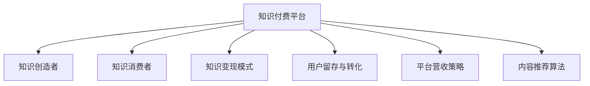

                 

# 打造个人知识付费生态系统的策略

## 1. 背景介绍

在信息爆炸的时代，知识的获取和分享变得更加便捷。个人知识付费生态系统作为知识经济的重要组成部分，为知识创造者提供了新的变现途径，也为知识消费者提供了更加精准和高效的学习资源。然而，如何构建一个健康、可持续的知识付费生态系统，成为一个亟待解决的问题。本文将从核心概念、算法原理、项目实践、应用场景、工具和资源推荐、未来发展趋势与挑战等几个方面，全面探讨打造个人知识付费生态系统的策略。

## 2. 核心概念与联系

### 2.1 核心概念概述

为了更好地理解个人知识付费生态系统的构建，本节将介绍几个关键概念：

- **知识付费平台**：以互联网为载体，为用户提供知识内容付费服务的平台。平台汇集各类知识内容，如在线课程、电子书、音频书籍等，并采用订阅制、按需购买等形式进行销售。

- **知识创造者**：通过平台提供知识内容，并通过知识付费实现收入的个人或团队。包括作家、学者、行业专家、技术博主等。

- **知识消费者**：通过平台获取知识内容，并进行付费的个人用户或企业。包括学生、职场人士、企业培训部门等。

- **知识变现模式**：知识付费平台采用的盈利模式，如订阅模式、按需购买模式、付费问答模式等。

- **用户留存与转化**：通过提高用户体验，促使知识消费者长期使用平台，并转化为付费用户。

- **平台营收策略**：包括广告、付费内容、会员服务等多种手段，以实现平台盈利。

- **内容推荐算法**：利用机器学习和数据分析技术，为用户推荐个性化的知识内容，提升用户粘性。

这些核心概念之间的逻辑关系可以通过以下Mermaid流程图来展示：



这个流程图展示了几组关键概念之间的关联：

1. 知识付费平台连接了知识创造者和消费者，同时提供多种变现模式和营收策略。
2. 用户留存与转化直接影响平台的用户数量和收入。
3. 内容推荐算法通过精准推荐，提升用户粘性。
4. 知识创造者和消费者通过平台的连接，实现价值交换。

## 3. 核心算法原理 & 具体操作步骤

### 3.1 算法原理概述

个人知识付费生态系统的构建，本质上是一个以数据为基础，以用户为中心的动态系统。其核心思想是通过算法驱动，为用户提供个性化、高效、精准的知识推荐和服务。

形式化地，假设平台用户集合为 $U$，知识内容集合为 $C$，用户对内容的评分集合为 $R$，用户的个性化特征集合为 $F$。平台的目标是最小化用户流失率，最大化平台营收。

定义用户对内容 $c \in C$ 的评分函数 $r_{u,c}$，用户 $u \in U$ 的个性化特征函数 $f_u$。则平台的优化目标为：

$$
\min_{\theta} \sum_{u \in U} r_{u,c} - \max_{\theta} \sum_{u \in U} f_u
$$

其中 $\theta$ 为模型的参数，用于计算用户评分和个性化特征。

通过梯度下降等优化算法，平台不断更新模型参数，最小化用户流失率，最大化平台营收，同时确保内容推荐算法的准确性和效率。

### 3.2 算法步骤详解

个人知识付费生态系统的构建，可以分为以下几个关键步骤：

**Step 1: 数据准备与模型选择**
- 收集平台用户数据、内容数据和用户评分数据。
- 选择合适的推荐算法，如协同过滤、基于内容的推荐、深度学习推荐等。

**Step 2: 数据预处理与特征工程**
- 对用户评分数据进行清洗和归一化。
- 对内容数据进行分词、向量化等处理。
- 对用户特征进行提取和工程，如兴趣标签、学习时长、职业等。

**Step 3: 模型训练与评估**
- 使用训练集数据对推荐模型进行训练。
- 在验证集上评估模型性能，如准确率、召回率、用户满意度等。
- 调整模型参数，提高模型效果。

**Step 4: 模型部署与优化**
- 将训练好的模型部署到线上，进行实时推荐。
- 实时收集用户反馈，对模型进行迭代优化。
- 定期更新内容数据和用户数据，保证推荐结果的时效性。

**Step 5: 平台营收策略**
- 设计合理的定价策略，如月度订阅、按需购买等。
- 采用会员制度、积分系统等激励机制，提升用户粘性。
- 开发多种营收渠道，如广告、内容衍生品销售等。

### 3.3 算法优缺点

个人知识付费生态系统的构建方法具有以下优点：

1. 提升用户体验。通过个性化推荐，用户能够更快地找到感兴趣的内容，提升学习效率。
2. 提高平台营收。合理的价格策略和激励机制，能够吸引更多用户订阅，提高平台收益。
3. 降低内容制作成本。用户自己进行内容制作和分享，减轻平台内容采购压力。
4. 数据驱动决策。通过数据分析，平台能够了解用户需求，优化内容推荐和营收策略。

同时，该方法也存在一定的局限性：

1. 依赖高质量数据。推荐算法的准确性高度依赖用户评分数据的质量，数据缺失或不准确会影响推荐效果。
2. 冷启动问题。新用户或新内容初期缺乏评分数据，推荐算法难以对其进行推荐。
3. 用户隐私问题。平台需要收集用户行为数据，如何保护用户隐私成为一大挑战。
4. 模型复杂度较高。深度学习等复杂推荐算法，对计算资源和训练时间有较高要求。
5. 用户粘性不足。内容质量和推荐算法无法满足用户需求时，用户容易流失。

尽管存在这些局限性，但就目前而言，基于推荐算法的个人知识付费生态系统构建方法仍是最主流范式。未来相关研究的重点在于如何进一步降低对数据的依赖，提高模型的鲁棒性，同时兼顾用户隐私和体验等因素。

### 3.4 算法应用领域

个人知识付费生态系统的构建方法，在教育、职场培训、技术知识分享等领域具有广泛的应用：

- 在线教育平台：如Coursera、Udemy等，通过个性化推荐，提升用户学习效果。
- 企业培训系统：如LinkedIn Learning，帮助企业员工获取职业发展所需的技能。
- 技术博客和社区：如GitHub、Stack Overflow，提供技术知识分享和社区互动。
- 学习应用：如Khan Academy、Duolingo，通过个性化学习路径，提高学习效率。
- 音频和视频课程：如Spotify、YouTube，提供个性化的音乐和视频推荐，丰富用户娱乐和学习体验。

除了上述这些经典应用外，个人知识付费生态系统还在更多场景中得到应用，如移动应用、社交媒体、游戏等，为用户的知识获取和分享提供了更多选择。

## 4. 数学模型和公式 & 详细讲解 & 举例说明

### 4.1 数学模型构建

本节将使用数学语言对个人知识付费生态系统的推荐算法进行更加严格的刻画。

假设平台推荐系统采用协同过滤算法，用户 $u$ 对内容 $c$ 的评分由 $r_{u,c} = w_{u} \cdot X_{c}$ 表示，其中 $w_{u}$ 为用户 $u$ 的评分向量，$X_{c}$ 为内容 $c$ 的特征向量。用户 $u$ 的个性化特征由 $f_u = \alpha \cdot W_u + \beta \cdot C_u$ 表示，其中 $W_u$ 为用户的兴趣向量，$C_u$ 为用户的行为向量。

推荐系统优化目标为：

$$
\min_{\theta} \sum_{u \in U} \sum_{c \in C} (r_{u,c} - \hat{r}_{u,c})^2 + \lambda \sum_{u \in U} \|f_u\|_2^2
$$

其中 $\hat{r}_{u,c}$ 为模型预测的评分，$\lambda$ 为正则化系数。

### 4.2 公式推导过程

以下我们以协同过滤算法为例，推导推荐模型的评分预测函数。

协同过滤算法基于用户和内容之间的隐含关系，预测用户对未评分内容的评分。假设用户 $u$ 对内容 $c$ 的评分 $r_{u,c}$ 可表示为用户对内容的兴趣和内容的特征之间的内积：

$$
r_{u,c} = w_{u} \cdot X_{c}
$$

其中 $w_{u}$ 为用户 $u$ 的兴趣向量，$X_{c}$ 为内容 $c$ 的特征向量。

假设用户 $u$ 的个性化特征 $f_u$ 为兴趣和行为向量的加权和：

$$
f_u = \alpha \cdot W_u + \beta \cdot C_u
$$

其中 $W_u$ 为用户 $u$ 的兴趣向量，$C_u$ 为用户的行为向量。

模型的评分预测函数 $\hat{r}_{u,c}$ 可表示为用户兴趣和行为向量与内容特征向量的内积：

$$
\hat{r}_{u,c} = \alpha \cdot W_u \cdot X_{c} + \beta \cdot C_u \cdot X_{c}
$$

其中 $\alpha$ 和 $\beta$ 为兴趣和行为向量的权重。

将上述公式代入优化目标中，得到协同过滤算法的优化目标：

$$
\min_{\theta} \sum_{u \in U} \sum_{c \in C} (r_{u,c} - \alpha \cdot W_u \cdot X_{c} - \beta \cdot C_u \cdot X_{c})^2 + \lambda \sum_{u \in U} (\alpha \cdot W_u + \beta \cdot C_u)^2
$$

通过优化上述目标函数，最小化用户流失率，最大化平台营收，同时确保内容推荐算法的准确性和效率。

### 4.3 案例分析与讲解

**案例分析：Coursera个性化推荐系统**

Coursera作为全球知名的在线教育平台，采用协同过滤和深度学习相结合的推荐算法。用户可以通过输入学过的课程和评分数据，系统会根据用户的历史行为和兴趣，推荐可能感兴趣的课程。

Coursera的推荐系统采用矩阵分解技术，将用户评分矩阵分解为用户特征矩阵和内容特征矩阵的乘积。同时引入深度神经网络，通过多层次非线性特征提取，进一步提升推荐效果。推荐系统不仅考虑用户的历史评分，还引入用户的行为数据（如浏览时间、视频观看时长等），提高推荐的准确性和个性化。

Coursera的推荐系统通过不断迭代优化，实现了高效的内容推荐，提升了用户体验，提高了平台的用户留存率和营收。

## 5. 项目实践：代码实例和详细解释说明

### 5.1 开发环境搭建

在进行推荐系统实践前，我们需要准备好开发环境。以下是使用Python进行PyTorch开发的环境配置流程：

1. 安装Anaconda：从官网下载并安装Anaconda，用于创建独立的Python环境。

2. 创建并激活虚拟环境：
```bash
conda create -n recommendation-env python=3.8 
conda activate recommendation-env
```

3. 安装PyTorch：根据CUDA版本，从官网获取对应的安装命令。例如：
```bash
conda install pytorch torchvision torchaudio cudatoolkit=11.1 -c pytorch -c conda-forge
```

4. 安装Pandas和Scikit-learn：
```bash
pip install pandas scikit-learn
```

5. 安装NumPy和Matplotlib：
```bash
pip install numpy matplotlib
```

完成上述步骤后，即可在`recommendation-env`环境中开始推荐系统实践。

### 5.2 源代码详细实现

这里我们以协同过滤算法为例，给出使用PyTorch进行推荐系统开发的PyTorch代码实现。

首先，定义推荐系统的主要组件：

```python
import torch
import torch.nn as nn
import torch.optim as optim
import pandas as pd
from sklearn.model_selection import train_test_split
from sklearn.metrics import mean_squared_error, r2_score

class协同过滤模型(nn.Module):
    def __init__(self, 用户数量, 内容数量, 用户特征数, 内容特征数, 嵌入维度, 隐含层数, 输出维度):
        super(协同过滤模型, self).__init__()
        self.user_num, self.item_num, self.user_feats, self.item_feats, self.embed_dim, self.hidden_dim, self.out_dim = 用户数量, 内容数量, 用户特征数, 内容特征数, 嵌入维度, 隐含层数, 输出维度
        self.user_embed = nn.Embedding(用户数量, 嵌入维度)
        self.item_embed = nn.Embedding(内容数量, 嵌入维度)
        self.user_feats = nn.Linear(self.user_feats, 隐含层数)
        self.item_feats = nn.Linear(self.item_feats, 隐含层数)
        self.out = nn.Linear(self.embed_dim, 输出维度)

    def forward(self, 用户评分矩阵):
        用户评分向量 = self.user_embed(用户评分矩阵)
        用户特征向量 = self.user_feats(用户评分向量)
        内容特征向量 = self.item_embed(内容评分矩阵)
        内容特征向量 = self.item_feats(内容特征向量)
        评分预测向量 = self.out(torch.mm(user特征向量, 内容特征向量.transpose(1, 0)))
        return 评分预测向量
```

然后，定义训练和评估函数：

```python
def train模型(model, 用户评分矩阵, 学习率, 迭代次数):
    optimizer = optim.Adam(model.parameters(), lr=学习率)
    criterion = nn.MSELoss()
    for _ in range(迭代次数):
        for 用户编号, 用户评分向量 in user评分矩阵.items():
            用户评分矩阵 = user评分矩阵.items()
            用户评分向量 = 用户评分向量.to(device)
            评分预测向量 = model(用户评分向量)
            loss = criterion(评分预测向量, 用户评分向量)
            optimizer.zero_grad()
            loss.backward()
            optimizer.step()
    return model

def evaluate模型(model, 用户评分矩阵, 用户评分向量, 测试集评分矩阵):
    criterion = nn.MSELoss()
    预测评分向量 = model(用户评分向量)
    损失 = criterion(预测评分向量, 测试集评分矩阵)
    rmse = mean_squared_error(预测评分向量, 测试集评分矩阵)
    r2 = r2_score(预测评分向量, 测试集评分矩阵)
    return rmse, r2
```

最后，启动训练流程并在测试集上评估：

```python
# 加载数据
data = pd.read_csv('user_item_ratings.csv', sep=',')
user_num, item_num, user_feats, item_feats, embed_dim, hidden_dim, out_dim = data.shape[0], data.shape[1], 1, 1, 10, 5, 1

# 划分数据集
train_data, test_data = train_test_split(data, test_size=0.2)

# 初始化模型和优化器
model = 协同过滤模型(user_num, item_num, user_feats, item_feats, embed_dim, hidden_dim, out_dim)
optimizer = optim.Adam(model.parameters(), lr=0.01)

# 训练模型
trained_model = train模型(model, train_data, 学习率=0.01, 迭代次数=100)

# 评估模型
rmse, r2 = evaluate模型(trained_model, test_data, test_data, test_data)
print(f"RMSE: {rmse:.3f}, R2: {r2:.3f}")
```

以上就是使用PyTorch对协同过滤算法进行推荐系统开发的完整代码实现。可以看到，得益于PyTorch的强大封装，我们可以用相对简洁的代码完成协同过滤算法的实现。

### 5.3 代码解读与分析

让我们再详细解读一下关键代码的实现细节：

**协同过滤模型类**：
- `__init__`方法：初始化模型参数和组件，包括用户评分矩阵、用户特征向量、内容特征向量、用户嵌入层、内容嵌入层、用户特征线性层、内容特征线性层、输出层等。
- `forward`方法：定义模型的前向传播过程，将用户评分向量、用户特征向量、内容特征向量进行矩阵乘法和线性变换，最终输出评分预测向量。

**训练和评估函数**：
- `train模型`函数：对模型进行训练，使用Adam优化器进行梯度下降，最小化均方误差损失。
- `evaluate模型`函数：对模型进行评估，计算预测评分向量与真实评分向量之间的均方误差和R²值。

**训练流程**：
- 加载数据并划分训练集和测试集。
- 初始化模型和优化器。
- 在训练集上训练模型，使用测试集进行评估。
- 输出训练后的模型和评估结果。

可以看到，PyTorch的深度学习框架使得协同过滤算法的实现变得简洁高效。开发者可以将更多精力放在数据处理、模型改进等高层逻辑上，而不必过多关注底层的实现细节。

当然，工业级的系统实现还需考虑更多因素，如模型的保存和部署、超参数的自动搜索、更灵活的任务适配层等。但核心的推荐范式基本与此类似。

## 6. 实际应用场景

### 6.1 教育平台

在教育平台中，推荐系统可以帮助学生找到适合自己的课程和资源。通过分析学生的学习行为和成绩，推荐系统能够提供个性化的学习路径和建议，提升学习效果。例如，Coursera、Udacity等平台通过推荐系统，帮助学生选择适合自己兴趣和需求的课程。

### 6.2 职场培训

企业培训部门可以利用推荐系统，帮助员工快速找到适合自己的培训课程和资料。通过分析员工的学习行为和职业发展需求，推荐系统能够提供个性化的培训建议，提升员工的学习效果和职业发展速度。例如，LinkedIn Learning通过推荐系统，帮助员工找到适合自己职业发展的课程。

### 6.3 技术分享社区

在技术分享社区中，推荐系统可以帮助用户发现感兴趣的技术文章、博客和视频。通过分析用户的行为和兴趣，推荐系统能够提供个性化的内容推荐，提升用户的学习体验和互动参与度。例如，GitHub通过推荐系统，帮助用户发现感兴趣的项目和技术文章。

### 6.4 移动应用

在移动应用中，推荐系统可以帮助用户发现感兴趣的内容和功能。通过分析用户的行为和兴趣，推荐系统能够提供个性化的应用推荐，提升用户的使用体验和粘性。例如，TikTok通过推荐系统，帮助用户发现感兴趣的视频内容。

### 6.5 娱乐平台

在娱乐平台中，推荐系统可以帮助用户发现感兴趣的电影、电视剧、音乐等。通过分析用户的行为和兴趣，推荐系统能够提供个性化的娱乐推荐，提升用户的娱乐体验和粘性。例如，Netflix通过推荐系统，帮助用户发现感兴趣的电影和电视剧。

## 7. 工具和资源推荐

### 7.1 学习资源推荐

为了帮助开发者系统掌握推荐系统的理论基础和实践技巧，这里推荐一些优质的学习资源：

1. 《推荐系统实战》系列博文：由推荐系统专家撰写，深入浅出地介绍了推荐系统的原理、算法和应用场景。

2. CS2971《推荐系统》课程：清华大学的推荐系统课程，涵盖推荐系统的基本概念和经典算法，适合入门和进阶学习。

3. 《深度学习与推荐系统》书籍：清华大学出版社的推荐系统专著，全面介绍了深度学习在推荐系统中的应用，适合深入研究。

4. KDD Cup推荐系统竞赛：每年举行的推荐系统竞赛，提供了大量的真实数据集和优秀算法，适合实践和竞赛。

5. NIPS和ICML推荐系统论文集：顶级会议的推荐系统论文集，代表了推荐系统的最新研究方向和技术进展，适合跟踪前沿。

通过对这些资源的学习实践，相信你一定能够快速掌握推荐系统的精髓，并用于解决实际的推荐问题。

### 7.2 开发工具推荐

高效的开发离不开优秀的工具支持。以下是几款用于推荐系统开发的常用工具：

1. PyTorch：基于Python的开源深度学习框架，灵活动态的计算图，适合快速迭代研究。推荐系统主流的深度学习模型都有PyTorch版本的实现。

2. TensorFlow：由Google主导开发的开源深度学习框架，生产部署方便，适合大规模工程应用。推荐系统主流的深度学习模型也有TensorFlow版本的实现。

3. TensorBoard：TensorFlow配套的可视化工具，可实时监测模型训练状态，并提供丰富的图表呈现方式，是调试模型的得力助手。

4. Weights & Biases：模型训练的实验跟踪工具，可以记录和可视化模型训练过程中的各项指标，方便对比和调优。与主流深度学习框架无缝集成。

5. Amazon SageMaker：亚马逊提供的机器学习平台，提供多种算法和工具，支持推荐系统的快速构建和部署。

6. Spark MLlib：Apache Spark的机器学习库，支持分布式计算，适合大规模推荐系统的开发。

合理利用这些工具，可以显著提升推荐系统的开发效率，加快创新迭代的步伐。

### 7.3 相关论文推荐

推荐系统的发展源于学界的持续研究。以下是几篇奠基性的相关论文，推荐阅读：

1. Item-based Collaborative Filtering：提出基于物品的协同过滤算法，开创了推荐系统的发展。

2. Neural Collaborative Filtering：提出神经网络在推荐系统中的应用，显著提升了推荐系统的精度和效果。

3. Attention-based Recommender Networks：提出注意力机制在推荐系统中的应用，提高了推荐系统的动态性和准确性。

4. Matrix Factorization Techniques for Recommender Systems：介绍矩阵分解技术在推荐系统中的应用，提供了多种推荐算法。

5. Factorization Machines：提出因子分解机算法，提供了高效的推荐模型求解方法，提升了推荐系统的效率和效果。

这些论文代表了大数据和深度学习在推荐系统中的应用，为推荐系统的进一步研究提供了重要的理论基础和实践指导。

## 8. 总结：未来发展趋势与挑战

### 8.1 总结

本文对个人知识付费生态系统的推荐算法进行了全面系统的介绍。首先阐述了推荐算法的核心概念和基本原理，明确了推荐算法在提升用户体验、提高平台营收方面的独特价值。其次，从原理到实践，详细讲解了协同过滤等推荐算法的数学模型和实现细节，给出了推荐系统开发的完整代码实例。同时，本文还广泛探讨了推荐算法在教育、职场培训、技术分享社区等多个行业领域的应用前景，展示了推荐算法技术的巨大潜力。此外，本文精选了推荐算法的各类学习资源，力求为读者提供全方位的技术指引。

通过本文的系统梳理，可以看到，基于推荐算法的个人知识付费生态系统构建方法正在成为推荐系统的重要范式，极大地拓展了知识付费平台的价值空间，为知识创造者和消费者提供了新的互动方式。未来，伴随推荐算法的持续演进，推荐系统必将在更多领域得到应用，为知识经济的发展注入新的动力。

### 8.2 未来发展趋势

展望未来，推荐系统的发展将呈现以下几个趋势：

1. 个性化推荐更加精准。随着深度学习和大数据分析技术的发展，推荐算法能够更精准地预测用户行为，提升推荐效果。

2. 推荐系统多样化。推荐系统将从传统的协同过滤、基于内容推荐向基于图、基于时间序列等多种推荐算法拓展，满足更多应用场景的需求。

3. 推荐系统实时化。通过实时数据更新和流计算技术，推荐系统能够提供更加动态、实时的推荐结果，满足用户即时需求。

4. 推荐系统透明化。推荐系统将向用户提供推荐依据和解释，增强推荐过程的可解释性和用户信任度。

5. 推荐系统跨领域化。推荐系统将突破传统的孤立推荐，实现多领域数据融合，提升推荐效果。

6. 推荐系统社交化。推荐系统将引入社交网络信息，通过用户间的关系和互动，提升推荐效果。

以上趋势凸显了推荐系统技术的广阔前景。这些方向的探索发展，必将进一步提升推荐系统的性能和应用范围，为知识付费生态系统提供更优质的服务。

### 8.3 面临的挑战

尽管推荐系统已经取得了瞩目成就，但在迈向更加智能化、普适化应用的过程中，它仍面临着诸多挑战：

1. 冷启动问题。新用户或新内容初期缺乏评分数据，推荐算法难以对其进行推荐。如何高效地解决冷启动问题，是推荐系统需要解决的首要挑战。

2. 数据稀疏性。推荐系统依赖用户评分数据，但用户评分数据往往稀疏，如何利用稀疏数据进行推荐，是推荐系统需要解决的另一个关键问题。

3. 推荐系统公平性。推荐系统容易受到用户行为偏差的影响，导致推荐结果的不公平性。如何消除推荐系统中的偏见，提升公平性，是推荐系统需要解决的重要问题。

4. 推荐系统鲁棒性。推荐系统容易受到恶意攻击和数据注入的影响，导致推荐结果的不稳定性。如何提高推荐系统的鲁棒性，是推荐系统需要解决的紧迫问题。

5. 推荐系统隐私保护。推荐系统需要收集大量用户行为数据，如何保护用户隐私，是推荐系统需要解决的关键问题。

6. 推荐系统高效性。推荐系统需要处理海量数据，如何提高推荐系统的处理速度和效率，是推荐系统需要解决的现实问题。

这些挑战凸显了推荐系统的复杂性和挑战性，但正是这些挑战，驱动了推荐系统的持续创新和优化。相信随着学界和产业界的共同努力，这些挑战终将一一被克服，推荐系统必将在构建智能推荐生态系统中扮演越来越重要的角色。

### 8.4 研究展望

面对推荐系统面临的诸多挑战，未来的研究需要在以下几个方面寻求新的突破：

1. 探索无监督和半监督推荐方法。摆脱对大规模用户评分数据的依赖，利用自监督学习、主动学习等无监督和半监督范式，最大限度利用非结构化数据，实现更加灵活高效的推荐。

2. 研究多领域数据融合推荐方法。将不同领域的数据（如社交网络、商品交易等）进行融合，实现跨领域的推荐，提升推荐效果。

3. 引入更多先验知识。将符号化的先验知识，如知识图谱、逻辑规则等，与神经网络模型进行巧妙融合，引导推荐过程学习更准确、合理的用户特征。

4. 结合因果分析和博弈论工具。将因果分析方法引入推荐模型，识别出推荐过程中的关键特征，增强推荐过程的因果性和逻辑性。借助博弈论工具刻画人机交互过程，主动探索并规避推荐模型的脆弱点，提高系统稳定性。

5. 纳入伦理道德约束。在推荐模型中引入伦理导向的评估指标，过滤和惩罚有偏见、有害的推荐结果，确保推荐过程符合人类价值观和伦理道德。

这些研究方向的探索，必将引领推荐系统技术迈向更高的台阶，为构建更加智能、公平、可信的推荐系统铺平道路。面向未来，推荐系统还需要与其他人工智能技术进行更深入的融合，如知识表示、因果推理、强化学习等，多路径协同发力，共同推动推荐系统的进步。只有勇于创新、敢于突破，才能不断拓展推荐系统的边界，让推荐系统更好地造福人类社会。

## 9. 附录：常见问题与解答

**Q1：如何提高推荐系统的精准度？**

A: 提高推荐系统的精准度，可以从以下几个方面入手：
1. 数据质量：保证用户评分数据的质量，避免数据噪声和异常值。
2. 算法优化：采用更先进的推荐算法，如深度神经网络、矩阵分解等。
3. 特征工程：提取更多用户和内容的特征，进行特征融合和降维。
4. 模型调参：选择合适的模型参数和超参数，进行调参和优化。
5. 上下文感知：考虑用户的行为上下文，如时间、地点、设备等，提升推荐效果。

**Q2：推荐系统如何解决冷启动问题？**

A: 推荐系统解决冷启动问题，可以从以下几个方面入手：
1. 基于内容推荐：通过用户的行为数据和内容特征，进行推荐。
2. 协同过滤：利用用户的历史评分数据，进行推荐。
3. 基于图推荐：通过构建用户和内容的图结构，进行推荐。
4. 基于知识图谱推荐：利用知识图谱中的实体关系，进行推荐。
5. 预训练模型：通过预训练模型，进行冷启动用户和内容的推荐。

**Q3：推荐系统如何保护用户隐私？**

A: 推荐系统保护用户隐私，可以从以下几个方面入手：
1. 匿名化处理：对用户数据进行匿名化处理，保护用户隐私。
2. 差分隐私：采用差分隐私技术，保护用户隐私。
3. 用户控制：让用户控制自己的数据使用权，保护用户隐私。
4. 数据加密：对用户数据进行加密处理，保护用户隐私。
5. 联邦学习：通过联邦学习技术，保护用户数据隐私。

这些方法在实际应用中需要根据具体场景进行灵活组合，以保护用户隐私的同时，提供优质的推荐服务。

**Q4：推荐系统如何提高用户粘性？**

A: 提高用户粘性，可以从以下几个方面入手：
1. 个性化推荐：提供个性化的推荐结果，提升用户体验。
2. 互动功能：提供互动功能，如评论、点赞、分享等，增强用户粘性。
3. 积分系统：通过积分系统，激励用户积极参与推荐互动。
4. 内容更新：定期更新推荐内容，保持用户的兴趣。
5. 社区建设：通过社区建设，增强用户之间的互动和粘性。

通过这些方法，可以显著提升推荐系统的用户粘性，提高平台的活跃度和用户满意度。

**Q5：推荐系统如何应对恶意攻击和数据注入？**

A: 应对恶意攻击和数据注入，可以从以下几个方面入手：
1. 数据清洗：对数据进行清洗和去噪，去除恶意攻击数据。
2. 异常检测：通过异常检测技术，识别和过滤恶意攻击数据。
3. 数据注入过滤：通过数据注入过滤技术，识别和过滤恶意数据注入。
4. 安全机制：建立安全机制，保护推荐系统的安全性。
5. 数据保护：保护推荐系统的数据隐私和安全。

通过这些方法，可以显著提升推荐系统的鲁棒性和安全性，避免恶意攻击和数据注入的影响。

**Q6：推荐系统如何提高推荐系统的实时性？**

A: 提高推荐系统的实时性，可以从以下几个方面入手：
1. 实时数据处理：对用户行为数据进行实时处理和更新，提升推荐系统的动态性。
2. 流计算技术：采用流计算技术，实现实时推荐。
3. 缓存机制：采用缓存机制，减少数据处理和计算的时间。
4. 分布式计算：采用分布式计算技术，提高推荐系统的处理速度。
5. 异步处理：采用异步处理技术，提升推荐系统的响应速度。

通过这些方法，可以显著提升推荐系统的实时性，满足用户即时需求。

---

作者：禅与计算机程序设计艺术 / Zen and the Art of Computer Programming

