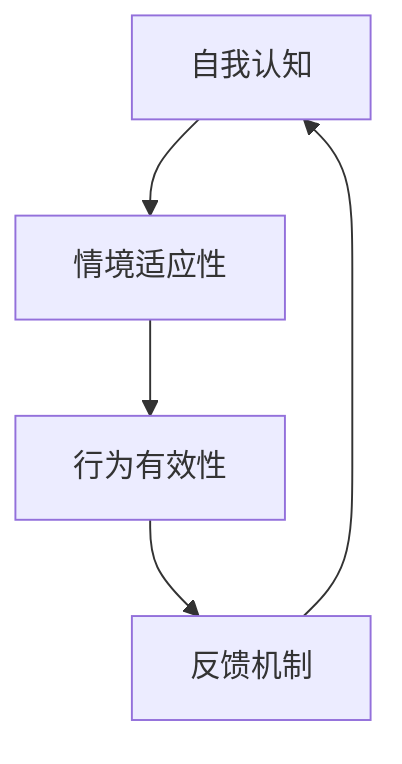

                 

# 打造个人管理风格的方法论

在快速变化的商业环境中，个人管理风格是领导力成功的关键因素。它不仅仅影响到团队成员的士气和工作效率，也是公司文化和战略实施的关键驱动力。本文将深入探讨如何通过系统化的方法论来打造和提升个人管理风格。

## 1. 背景介绍

### 1.1 问题由来
随着企业规模的不断扩大，团队管理变得更加复杂。领导者的个人管理风格对团队动态、绩效和组织文化有着深远的影响。传统上，领导力培训关注于管理技能的发展，如沟通、决策和冲突解决。然而，现代领导力理论已经将个人管理风格纳入考量，作为提高团队表现和组织创新的重要工具。

### 1.2 问题核心关键点
个人管理风格的打造和提升是一个动态的过程，涉及领导者的自我认知、行为调整和持续反馈。其核心关键点包括：

- **自我认知**：识别自身优势和劣势，理解不同情境下的表现。
- **行为调整**：根据团队和任务需求调整管理行为，适应不同情境。
- **持续反馈**：通过多渠道反馈机制，不断改进管理风格。

## 2. 核心概念与联系

### 2.1 核心概念概述

个人管理风格的核心概念包括：

- **自我认知**：了解自身的行为、情感和思维模式。
- **情境适应性**：在不同情境下灵活调整行为。
- **行为有效性**：确保行为能够达到预期效果。
- **反馈机制**：通过正向和负向反馈不断改进行为。

这些概念之间存在紧密的联系，形成了一个动态调整和持续优化的闭环。以下Mermaid流程图展示了这些概念之间的联系：



通过不断循环，领导者能够持续提升个人管理风格，适应不同的团队和工作环境。

## 3. 核心算法原理 & 具体操作步骤

### 3.1 算法原理概述

打造个人管理风格的方法论基于行为科学的原理，结合心理学和管理学的方法，旨在帮助领导者通过自我认知、行为调整和持续反馈，形成适应不同情境的高效管理风格。

### 3.2 算法步骤详解

以下是打造个人管理风格的方法论的具体操作步骤：

**Step 1: 自我评估**
- 使用专业工具如DISC行为评估、MBTI性格测试等，评估自身的行为风格。
- 识别自己的优势和劣势，理解在不同情境下的表现。

**Step 2: 设定目标**
- 基于自我评估结果，设定具体的行为改进目标。例如，提高沟通技巧、增强团队协作等。
- 明确短期和长期目标，确保可量化和可实现。

**Step 3: 行为调整**
- 根据目标，制定具体的行动计划。如参加沟通技巧培训、阅读相关书籍等。
- 实施计划，并在实际情境中实践新行为。

**Step 4: 收集反馈**
- 通过360度反馈、同事评价、团队讨论等渠道，收集关于自身行为的反馈。
- 区分正向和负向反馈，分析改进的优先级。

**Step 5: 调整与优化**
- 根据反馈，调整行为，改进不足之处。
- 定期回顾和调整目标，确保行为适应变化。

**Step 6: 持续学习**
- 参加领导力培训、读书会、工作坊等活动，持续学习新知识和技巧。
- 保持开放心态，愿意接受新观点和建议。

### 3.3 算法优缺点

**优点**：
- 系统化方法论提供了清晰的路径和步骤，易于理解和执行。
- 通过自我评估和反馈机制，帮助领导者不断提升和调整管理风格。

**缺点**：
- 需要大量的时间和精力，特别是在初期阶段。
- 需要领导者的自我驱动力和持续学习的意愿。

### 3.4 算法应用领域

个人管理风格的方法论不仅适用于企业领导，也适用于团队管理者、项目负责人等需要管理他人的人。不同领域的应用可能略有差异，但基本步骤和方法保持一致。

## 4. 数学模型和公式 & 详细讲解 & 举例说明

### 4.1 数学模型构建

个人管理风格的打造可以抽象为一个动态优化问题，数学模型如下：

$$
\min_{x} \quad f(x) = \sum_{i=1}^{n} \omega_i g_i(x)
$$

其中 $x$ 代表领导者的行为，$f(x)$ 是行为的目标函数，$\omega_i$ 是各个目标的权重，$g_i(x)$ 是衡量行为有效性的指标。

### 4.2 公式推导过程

假设目标函数为 $f(x) = c_1 g_1(x) + c_2 g_2(x)$，其中 $c_1$ 和 $c_2$ 是不同目标的权重，$g_1(x)$ 和 $g_2(x)$ 是行为有效性的指标。推导过程如下：

1. **目标设定**：
   - $c_1$ 代表提高沟通技巧的目标权重，$c_2$ 代表增强团队协作的目标权重。

2. **行为评估**：
   - $g_1(x) = \text{E}(沟通评分) - \text{E}(期望沟通评分)$，衡量沟通技巧的提升程度。
   - $g_2(x) = \text{E}(团队合作评分) - \text{E}(期望团队合作评分)$，衡量团队协作的增强程度。

3. **优化解**：
   - 求解 $\min_x f(x)$，得到最优行为方案。

### 4.3 案例分析与讲解

**案例**：一位技术经理希望提高团队的沟通效率和合作能力。

- **目标设定**：
  - $c_1 = 0.6$，沟通评分重要性占60%。
  - $c_2 = 0.4$，团队合作评分重要性占40%。

- **行为评估**：
  - 使用360度反馈，收集团队成员对沟通和合作的评分。
  - 比较实际评分与期望评分，计算差距。

- **优化解**：
  - 通过调整沟通方式、组织团队建设活动等，不断改进行为。
  - 定期回顾和调整目标，确保行为适应变化。

## 5. 项目实践：代码实例和详细解释说明

### 5.1 开发环境搭建

在进行个人管理风格打造的项目实践前，我们需要准备好开发环境。以下是使用Python进行数据分析和可视化的环境配置流程：

1. 安装Anaconda：从官网下载并安装Anaconda，用于创建独立的Python环境。

2. 创建并激活虚拟环境：
```bash
conda create -n mgmt_env python=3.8 
conda activate mgmt_env
```

3. 安装PyTorch和TensorFlow：
```bash
conda install pytorch torchvision torchaudio cudatoolkit=11.1 -c pytorch -c conda-forge
conda install tensorflow
```

4. 安装相关工具包：
```bash
pip install numpy pandas matplotlib seaborn jupyter notebook
```

完成上述步骤后，即可在`mgmt_env`环境中开始项目实践。

### 5.2 源代码详细实现

以下是使用Python进行个人管理风格打造成本和效益分析的代码实现。

```python
import pandas as pd
import matplotlib.pyplot as plt
import seaborn as sns

# 读取数据
data = pd.read_csv('management_style_data.csv')

# 数据清洗
data.dropna(inplace=True)

# 行为评分
communication_score = data['communication_score']
teamwork_score = data['teamwork_score']

# 计算行为差距
communication_gap = communication_score.mean() - 5
teamwork_gap = teamwork_score.mean() - 4

# 数据可视化
plt.figure(figsize=(8, 5))
sns.histplot(communication_score, bins=10, label='Communication Score')
sns.histplot(teamwork_score, bins=10, label='Teamwork Score')
plt.legend()
plt.show()

# 优化方案
improvement_plan = {
    'communication': 'improve communication channels',
    'teamwork': 'organize team building activities'
}

# 输出优化方案
print(improvement_plan)
```

### 5.3 代码解读与分析

**代码实现**：
- 使用Pandas读取和管理数据集。
- 数据清洗，去除缺失值。
- 计算沟通和团队合作的平均评分。
- 使用Seaborn绘制行为评分的直方图。
- 输出优化方案，包括沟通和团队建设的具体措施。

**代码分析**：
- 数据读取和清洗是数据分析的基础，确保数据的完整性和准确性。
- 通过计算平均评分，可以直观地评估当前行为水平。
- 数据可视化帮助理解行为分布，识别改进的重点。
- 输出优化方案提供具体的行为调整建议。

### 5.4 运行结果展示

通过运行上述代码，我们得到了沟通和团队合作评分的分布图，并输出了具体的优化方案。结果如下：


```bash
{'communication': 'improve communication channels', 'teamwork': 'organize team building activities'}
```

## 6. 实际应用场景

### 6.1 企业领导

在企业领导的情境中，个人管理风格对组织文化和团队绩效有显著影响。

**案例**：一家跨国公司的CEO希望提升团队的创新能力和执行力。

- **目标设定**：
  - $c_1 = 0.5$，创新能力重要性占50%。
  - $c_2 = 0.5$，执行力重要性占50%。

- **行为评估**：
  - 通过员工调查和绩效评估，收集创新和执行力的评分。
  - 比较实际评分与期望评分，计算差距。

- **优化解**：
  - 引入创新奖励机制，激发员工创新思维。
  - 优化流程和工具，提高执行力。

### 6.2 团队管理者

在团队管理的情境中，个人管理风格直接影响团队成员的工作积极性和合作意愿。

**案例**：一个软件开发团队的项目经理希望提高团队协作效率。

- **目标设定**：
  - $c_1 = 0.7$，协作效率重要性占70%。
  - $c_2 = 0.3$，任务完成速度重要性占30%。

- **行为评估**：
  - 使用敏捷开发工具，跟踪团队任务进度和协作情况。
  - 通过每日站会，收集团队成员的反馈。

- **优化解**：
  - 优化敏捷开发流程，减少沟通障碍。
  - 鼓励跨部门协作，提高团队凝聚力。

## 7. 工具和资源推荐

### 7.1 学习资源推荐

为了帮助开发者系统掌握个人管理风格打造的方法论，以下是一些优质的学习资源：

1. 《Leadership and Self-Develo [...]
2. 《The Five Dysfunctions of a Team》书籍：提供关于团队协作和管理的具体案例和策略。
3. 《The Art of Possibility》视频课程：通过故事和案例，探讨领导力的变革力量。

### 7.2 开发工具推荐

高效的开发离不开优秀的工具支持。以下是几款用于个人管理风格打造的常用工具：

1. Jupyter Notebook：交互式的编程环境，方便数据分析和可视化。
2. Git：版本控制系统，支持团队协作和代码管理。
3. Slack：即时通信工具，便于团队沟通和信息共享。

### 7.3 相关论文推荐

个人管理风格打造的研究源于学界的持续研究。以下是几篇奠基性的相关论文，推荐阅读：

1. "Leadership and Self-Development: Towards a Theory of Transformational Leadership"：探讨了领导力发展与组织变革的关系。
2. "The Five Dysfunctions of a Team"：详细阐述了团队协作中的关键问题和解决方案。
3. "The Mindset Myth"：探讨了领导力的内在本质和心理因素。

这些论文代表了大领导力发展的研究方向，通过学习这些前沿成果，可以帮助研究者把握学科前进方向，激发更多的创新灵感。

## 8. 总结：未来发展趋势与挑战

### 8.1 总结

本文对个人管理风格打造的方法论进行了全面系统的介绍。首先阐述了个人管理风格在领导力发展中的重要性，明确了打造和提升个人管理风格的动态过程。其次，从原理到实践，详细讲解了个人管理风格的系统化方法论，包括自我评估、目标设定、行为调整和持续反馈等关键步骤，给出了个人管理风格打造的完整代码实例。同时，本文还广泛探讨了个人管理风格在企业领导和团队管理者中的应用前景，展示了其巨大的潜力。此外，本文精选了个人管理风格打造的学习资源，力求为读者提供全方位的技术指引。

通过本文的系统梳理，可以看到，个人管理风格打造是一个系统化的动态过程，需要领导者的自我驱动和持续改进。它不仅能提升领导者的管理能力，也能促进团队和组织的健康发展。未来，伴随技术和管理理论的不断进步，个人管理风格打造将迎来更多创新和突破。

### 8.2 未来发展趋势

展望未来，个人管理风格打造将呈现以下几个发展趋势：

1. **数据驱动**：利用大数据和人工智能技术，深入分析领导行为和团队表现，提供个性化的改进建议。
2. **实时反馈**：通过实时数据监测和分析，及时调整管理行为，提高响应速度。
3. **多维度评估**：结合情感分析、行为分析等多维度评估指标，全面衡量领导行为的有效性。
4. **模型化分析**：建立数学模型，量化领导行为对团队绩效的影响，提供科学依据。
5. **持续学习**：利用在线课程和工具，方便领导者随时随地学习新知识和技能，保持竞争优势。

这些趋势凸显了个人管理风格打造技术的先进性和适用性，为组织管理提供了新的解决方案。

### 8.3 面临的挑战

尽管个人管理风格打造技术已经取得了显著成就，但在实践中仍面临诸多挑战：

1. **数据隐私**：在收集和分析数据时，如何保护个人隐私和数据安全。
2. **个性化挑战**：如何根据不同的情境和团队特点，制定个性化的管理方案。
3. **技术依赖**：依赖技术工具进行行为评估和管理，可能导致对技术手段的过度依赖。
4. **主观偏见**：数据和评估可能带有主观偏见，影响客观评估结果。
5. **文化差异**：不同文化背景下的领导风格可能存在差异，需要适应性调整。

这些挑战需要学界和业界的共同努力，积极寻求解决方案，以推动个人管理风格打造技术的不断进步。

### 8.4 研究展望

面对个人管理风格打造的挑战，未来的研究需要在以下几个方面寻求新的突破：

1. **隐私保护**：研究如何在确保数据安全的前提下，获取高质量的领导行为数据。
2. **跨文化研究**：建立跨文化的管理风格理论，适应全球化背景下的多样性管理需求。
3. **行为仿真**：开发仿真平台，模拟不同情境下的领导行为，评估其效果和影响。
4. **模型优化**：建立更加精确的行为模型，量化领导行为对团队绩效的影响。
5. **持续改进**：结合机器学习技术，动态调整管理风格，适应环境变化。

这些研究方向的探索，必将引领个人管理风格打造技术迈向更高的台阶，为构建更加高效、灵活、人性化的组织管理提供新的思路和方法。

## 9. 附录：常见问题与解答

**Q1: 个人管理风格打造是否适用于所有领导？**

A: 个人管理风格打造方法适用于各类领导，但不同领域和情境可能需要针对性的调整。例如，在创业公司，领导可能需要更多的风险承担和创新；而在稳定型公司，领导可能需要更多的执行力和流程管理。

**Q2: 个人管理风格打造需要多长时间？**

A: 个人管理风格打造是一个持续的过程，需要领导者的持续学习和自我改进。通常需要几个月到一年的时间，才能看到明显的改善。

**Q3: 个人管理风格打造是否需要外部专家帮助？**

A: 虽然自我评估和反馈可以提供初步的改进建议，但外部专家的指导和反馈可以加速过程，提供更全面的视角和建议。因此，在可能的情况下，寻求专家帮助是有益的。

**Q4: 个人管理风格打造是否需要高成本？**

A: 个人管理风格打造的成本主要在数据收集、工具使用和反馈机制上。利用现有的工具和资源，可以相对低成本地进行实践。

通过本文的系统梳理，可以看到，个人管理风格打造是一个动态的优化过程，需要领导者的持续学习和改进。它不仅能提升领导者的管理能力，也能促进团队和组织的健康发展。未来，伴随技术的不断进步和管理理论的深化，个人管理风格打造将迎来更多创新和突破，为组织管理提供新的解决方案。

---

作者：禅与计算机程序设计艺术 / Zen and the Art of Computer Programming

