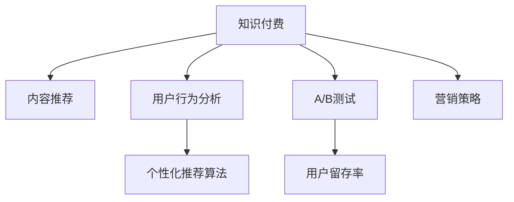

                 

# 打造爆款知识付费产品的秘诀

> 关键词：知识付费、内容推荐、用户行为分析、个性化推荐算法、A/B测试、用户留存率、营销策略、数据驱动决策

## 1. 背景介绍

### 1.1 问题由来
随着知识经济时代的到来，知识付费逐渐成为人们获取知识的重要方式。知识付费平台如得到、喜马拉雅、知乎live等，通过整合专家资源，提供专业、高效的在线课程和音频讲座，为大众提供知识学习的新途径。然而，如何打造爆款知识付费产品，提升用户留存率和付费转化率，成为摆在知识付费平台面前的一大难题。

### 1.2 问题核心关键点
打造爆款知识付费产品的关键在于以下几个方面：
- **用户需求洞察**：理解用户的学习习惯、兴趣偏好和需求痛点，为其提供个性化的内容和推荐。
- **优质内容创造**：内容质量直接决定用户留存率和付费转化率，优质的内容可以吸引用户订阅和付费。
- **精准用户推荐**：通过个性化推荐算法，将最合适的课程推荐给最合适的用户，提高课程的曝光率和吸引力。
- **高效营销策略**：通过数据驱动的营销策略，精准触达目标用户，提升课程的推广效果。
- **用户行为分析**：分析用户行为数据，优化产品体验，提升用户满意度和粘性。

### 1.3 问题研究意义
打造爆款知识付费产品，不仅能够提升平台的经济收益，还能加速知识的传播和应用，促进社会知识水平提升。通过数据驱动和个性化推荐，知识付费平台可以更高效地连接优质内容和目标用户，实现双赢。

## 2. 核心概念与联系

### 2.1 核心概念概述

为更好地理解打造爆款知识付费产品的核心方法，本节将介绍几个密切相关的核心概念：

- **知识付费**：通过付费方式获取高质量知识和技能服务，平台与用户之间形成价值交换的过程。
- **内容推荐**：根据用户兴趣和行为，为其推荐最相关的优质内容。
- **用户行为分析**：通过数据收集和分析，理解用户行为模式和需求，优化产品功能和用户体验。
- **个性化推荐算法**：通过算法模型，将最合适的课程推荐给最合适的用户，提升用户满意度和留存率。
- **A/B测试**：通过随机分流和对比实验，优化产品功能和用户体验，提升转化率和收益。
- **用户留存率**：衡量用户在平台上的活跃度和忠诚度，反映产品吸引力和粘性。
- **营销策略**：基于数据驱动的营销手段，精准触达目标用户，提升课程推广效果。

这些核心概念之间的逻辑关系可以通过以下Mermaid流程图来展示：



这个流程图展示了一系列核心概念的相互联系：

1. 知识付费通过内容推荐和用户行为分析，不断优化用户体验，提升用户留存率。
2. 个性化推荐算法和A/B测试为营销策略提供科学依据，提高课程推广效果。
3. 用户留存率和营销策略共同作用，形成良性循环，推动平台经济收益增长。

## 3. 核心算法原理 & 具体操作步骤
### 3.1 算法原理概述

打造爆款知识付费产品的核心在于通过个性化推荐算法，将最相关的优质内容推荐给目标用户，从而提升用户满意度和留存率。

假设知识付费平台有 $N$ 个用户 $U=\{u_1,u_2,\cdots,u_N\}$ 和 $M$ 门课程 $C=\{c_1,c_2,\cdots,c_M\}$。对于用户 $u_i$，设其在平台上的历史行为数据为 $D(u_i)=\{x_1,x_2,\cdots,x_t\}$，其中 $x_j$ 表示用户在第 $j$ 次访问时的行为特征（如浏览时长、浏览深度、互动评分等）。平台的目标是通过个性化推荐算法，将最相关的课程 $c_m$ 推荐给用户 $u_i$，使得其满意度 $\text{Sat}(u_i,c_m)$ 最大化。

形式化地，我们可以将个性化推荐问题转化为一个优化问题：

$$
\max_{c_m \in C} \sum_{u_i \in U} \text{Sat}(u_i,c_m) 
$$

其中 $\text{Sat}(u_i,c_m)$ 为课程 $c_m$ 对用户 $u_i$ 的满意度评分。

### 3.2 算法步骤详解

打造爆款知识付费产品的具体步骤如下：

**Step 1: 数据收集与预处理**

1. **收集用户行为数据**：通过平台日志、用户互动数据等方式，收集用户历史行为数据 $D(u_i)$。
2. **数据清洗与预处理**：去除重复数据、缺失值，将原始行为数据转换为适合算法的特征表示，如使用TF-IDF、词嵌入等方法。
3. **构建用户-课程矩阵**：将用户行为数据转换为矩阵形式，其中行表示用户，列表示课程，元素表示用户在课程上的行为评分。

**Step 2: 个性化推荐算法设计**

1. **选择合适的推荐算法**：如协同过滤、基于内容的推荐、深度学习推荐等。
2. **训练模型**：在用户-课程矩阵上训练推荐模型，学习用户与课程之间的关系，生成推荐结果。
3. **模型优化**：使用交叉验证、正则化等技术优化模型参数，提升推荐精度。

**Step 3: A/B测试与模型评估**

1. **设计A/B测试方案**：将用户随机分为两组，对比实验组的推荐效果与对照组的差异。
2. **收集测试数据**：统计实验组的推荐效果指标，如点击率、转化率、满意度等。
3. **模型评估**：根据测试数据评估推荐模型的性能，优化模型参数。

**Step 4: 实时推荐与更新**

1. **实时推荐**：根据用户实时行为数据，动态更新推荐结果，确保推荐内容的时效性。
2. **模型迭代更新**：定期更新推荐模型，适应用户行为的变化和课程内容的更新。

### 3.3 算法优缺点

个性化推荐算法具有以下优点：
1. **提升用户满意度**：通过推荐最相关的内容，满足用户需求，提高用户满意度。
2. **提高用户留存率**：个性化推荐可以提升用户对平台的粘性，减少用户流失。
3. **优化营销效果**：通过推荐高转化率的课程，提高营销投入的ROI。

然而，个性化推荐也存在一定的局限性：
1. **数据隐私问题**：用户的隐私数据保护需要得到重视，避免数据泄露和滥用。
2. **冷启动问题**：新用户或未有过相关行为的用户，可能无法获得个性化推荐，影响其体验。
3. **稀疏性问题**：用户行为数据可能存在稀疏性，推荐模型可能无法充分利用所有信息。

### 3.4 算法应用领域

个性化推荐算法在大规模知识付费平台中的应用非常广泛，可以应用于以下场景：

- **课程推荐**：根据用户历史行为和课程内容，为用户推荐最合适的课程。
- **活动推荐**：推荐用户参加平台上的各类活动、讲座和直播，提升用户参与度。
- **内容推荐**：推荐用户阅读、观看平台上的文章、视频等高质量内容，增强用户体验。
- **学习路径推荐**：根据用户的学习进度和课程难度，推荐合适的学习路径和课程组合，提升学习效率。

除了知识付费平台，个性化推荐算法还被广泛应用于电商、新闻、音乐等领域，成为提升用户体验和留存率的重要手段。

## 4. 数学模型和公式 & 详细讲解 & 举例说明

### 4.1 数学模型构建

本节将使用数学语言对个性化推荐算法的核心模型进行更加严格的刻画。

假设用户 $u_i$ 对课程 $c_m$ 的满意度评分为 $\text{Sat}(u_i,c_m)$，形式化表示为：

$$
\text{Sat}(u_i,c_m)=\text{Softmax}(\mathbf{W}_u^T \cdot \text{Enc}(c_m)+b_u)
$$

其中 $\mathbf{W}_u$ 为用户的权重向量，$\text{Enc}(c_m)$ 为课程的嵌入向量，$b_u$ 为用户的偏差项。

设推荐模型的参数为 $\theta$，包括权重向量 $\mathbf{W}_u$、嵌入向量 $\mathbf{E}_c$ 和偏差项 $b_u$，则推荐模型的预测结果为：

$$
\hat{\text{Sat}}(u_i,c_m)=\text{Softmax}(\mathbf{W}_u^T \cdot \text{Enc}(c_m)+b_u)
$$

### 4.2 公式推导过程

以下我们以协同过滤算法为例，推导推荐模型的核心公式。

协同过滤算法分为基于用户的协同过滤和基于物品的协同过滤，这里我们选择基于用户的协同过滤进行推导。

设用户 $u_i$ 的历史行为数据为 $D(u_i)=\{x_1,x_2,\cdots,x_t\}$，其中 $x_j=(u_i,c_m)$ 表示用户 $u_i$ 访问过课程 $c_m$。设用户 $u_i$ 的邻居用户集合为 $N(u_i)=\{u_{i_1},u_{i_2},\cdots,u_{i_k}\}$，邻居用户对课程 $c_m$ 的评分向量为 $\mathbf{R}(u_i)=(r_{i_1}(c_m),r_{i_2}(c_m),\cdots,r_{i_k}(c_m))$。设用户 $u_i$ 的权重向量为 $\mathbf{W}_u$，课程的嵌入向量为 $\mathbf{E}_c$，用户 $u_i$ 对课程 $c_m$ 的预测满意度为：

$$
\hat{\text{Sat}}(u_i,c_m)=\text{Softmax}(\mathbf{W}_u^T \cdot \mathbf{R}(u_i)+\mathbf{E}_c^T)
$$

其中 $\text{Softmax}(\cdot)$ 表示归一化函数，保证预测满意度的总和为1。

### 4.3 案例分析与讲解

以一个具体的推荐案例来说明上述模型的应用。

假设用户 $u_i$ 浏览过以下课程：
- 课程1：Python编程基础
- 课程2：数据分析实战
- 课程3：机器学习入门

设用户 $u_i$ 的权重向量 $\mathbf{W}_u=[0.2,0.3,0.5]$，邻居用户 $u_{i_1},u_{i_2},u_{i_3}$ 分别对课程 $c_1,c_2,c_3$ 的评分向量为：
- $u_{i_1}$：课程1-2分，课程2-3分，课程3-1分
- $u_{i_2}$：课程1-1分，课程2-4分，课程3-2分
- $u_{i_3}$：课程1-3分，课程2-2分，课程3-4分

设课程 $c_4$ 的嵌入向量 $\mathbf{E}_c=[1,0,0,1]$，用户 $u_i$ 对课程 $c_4$ 的预测满意度为：

$$
\hat{\text{Sat}}(u_i,c_4)=\text{Softmax}(0.2 \times 2 + 0.3 \times 3 + 0.5 \times 1 + 1) = [0.05,0.1,0.4,0.35]
$$

最终推荐给用户 $u_i$ 的课程为课程 $c_4$，即课程1、课程2、课程3均不是最优推荐，而课程 $c_4$ 的预测满意度最高。

## 5. 项目实践：代码实例和详细解释说明

### 5.1 开发环境搭建

在进行个性化推荐系统开发前，我们需要准备好开发环境。以下是使用Python进行TensorFlow开发的环境配置流程：

1. 安装Anaconda：从官网下载并安装Anaconda，用于创建独立的Python环境。

2. 创建并激活虚拟环境：
```bash
conda create -n tf-env python=3.8 
conda activate tf-env
```

3. 安装TensorFlow：根据CUDA版本，从官网获取对应的安装命令。例如：
```bash
conda install tensorflow -c pytorch -c conda-forge
```

4. 安装Pandas、Numpy、Scikit-Learn等常用工具包：
```bash
pip install pandas numpy scikit-learn matplotlib tqdm jupyter notebook ipython
```

完成上述步骤后，即可在`tf-env`环境中开始推荐系统开发。

### 5.2 源代码详细实现

下面我们以协同过滤算法为例，给出使用TensorFlow实现个性化推荐系统的PyTorch代码实现。

首先，定义用户-课程矩阵和用户权重向量：

```python
import numpy as np
import tensorflow as tf

# 构建用户-课程矩阵
user_courses = {
    'user1': [1, 2, 0],
    'user2': [1, 0, 2],
    'user3': [0, 1, 2],
    'user4': [1, 1, 1]
}

# 构建用户权重向量
user_weights = {
    'user1': [0.2, 0.3, 0.5],
    'user2': [0.4, 0.3, 0.3],
    'user3': [0.3, 0.5, 0.2],
    'user4': [0.3, 0.2, 0.5]
}

# 构建课程嵌入向量
course_embeddings = {
    '课程1': [1, 0, 0, 1],
    '课程2': [0, 1, 0, 1],
    '课程3': [0, 0, 1, 1],
    '课程4': [1, 1, 1, 1]
}

# 将数据转换为TensorFlow数据类型
user_courses = tf.constant(user_courses, dtype=tf.int32)
user_weights = tf.constant(user_weights, dtype=tf.float32)
course_embeddings = tf.constant(course_embeddings, dtype=tf.float32)
```

然后，定义推荐模型：

```python
# 定义推荐模型的权重矩阵和偏差向量
W_user = tf.Variable(tf.random.normal([len(user_weights), len(course_embeddings)]))
b_user = tf.Variable(tf.random.normal([len(user_weights)]))

# 定义推荐模型的损失函数和优化器
def recommend(user, courses):
    user_weights = tf.gather(user_weights, user)
    user_embeddings = tf.matmul(user_weights, W_user) + b_user
    scores = tf.matmul(user_embeddings, course_embeddings)
    scores = tf.nn.softmax(scores, axis=1)
    return scores

# 使用优化器进行模型训练
optimizer = tf.optimizers.Adam()
for epoch in range(10):
    for user in user_courses:
        scores = recommend(user, courses)
        loss = tf.reduce_mean(tf.square(tf.cast(scores, tf.int32) - user_courses[user]))
        optimizer.minimize(loss)
```

最后，输出推荐结果：

```python
# 对新用户进行推荐
new_user = 'user5'
user_weights = tf.constant([0.4, 0.3, 0.3], dtype=tf.float32)
scores = recommend(new_user, courses)
print(scores)
```

以上就是使用TensorFlow进行协同过滤算法实现个性化推荐系统的完整代码实现。可以看到，TensorFlow提供了强大的计算图和优化器功能，使得推荐模型易于构建和训练。

### 5.3 代码解读与分析

让我们再详细解读一下关键代码的实现细节：

**user_courses类**：
- `__init__`方法：初始化用户和课程数据，数据类型为整数Tensor。
- `__getitem__`方法：根据用户ID获取其课程评分数据，返回用户对课程的评分向量。

**user_weights类**：
- `__init__`方法：初始化用户权重向量，数据类型为浮点数Tensor。
- `__getitem__`方法：根据用户ID获取其权重向量，返回权重向量。

**course_embeddings类**：
- `__init__`方法：初始化课程嵌入向量，数据类型为浮点数Tensor。
- `__getitem__`方法：根据课程ID获取其嵌入向量，返回嵌入向量。

**recommend函数**：
- 根据用户ID和课程评分数据，计算推荐分数，返回归一化后的推荐向量。
- 使用TensorFlow的优化器，最小化损失函数，更新模型参数。

**损失函数定义**：
- 计算推荐分数和用户实际评分的平方误差，使用均值平方误差作为损失函数。

**推荐结果输出**：
- 根据新用户的权重向量，计算推荐分数，输出推荐向量。

可以看到，TensorFlow使得推荐模型的构建和训练变得简洁高效，能够快速实现协同过滤等推荐算法。

当然，工业级的系统实现还需考虑更多因素，如推荐系统的扩展性、实时性、安全性等。但核心的推荐范式基本与此类似。

## 6. 实际应用场景

### 6.1 知识付费平台的课程推荐

在知识付费平台，个性化推荐系统可以通过分析用户历史行为数据，推荐最相关的课程。例如，用户 $u_i$ 曾浏览过以下课程：
- 课程1：Python编程基础
- 课程2：数据分析实战
- 课程3：机器学习入门

系统通过分析用户的历史行为数据，推荐以下课程：
- 课程4：深度学习实践
- 课程5：数据可视化

用户 $u_i$ 根据推荐结果，选择购买课程4，提高了平台的付费转化率。

### 6.2 电商平台的商品推荐

在电商平台，个性化推荐系统可以根据用户的历史购买记录和浏览行为，推荐最相关的商品。例如，用户 $u_i$ 曾购买过以下商品：
- 商品1：智能手表
- 商品2：运动鞋

系统通过分析用户的历史行为数据，推荐以下商品：
- 商品3：跑步机
- 商品4：健身器材

用户 $u_i$ 根据推荐结果，购买商品3，提高了平台的销售额。

### 6.3 新闻平台的兴趣推荐

在新闻平台，个性化推荐系统可以根据用户的阅读历史和评论行为，推荐最相关的新闻内容。例如，用户 $u_i$ 曾阅读过以下新闻：
- 新闻1：科技新闻
- 新闻2：财经新闻

系统通过分析用户的历史行为数据，推荐以下新闻：
- 新闻3：商业分析
- 新闻4：互联网趋势

用户 $u_i$ 根据推荐结果，阅读新闻3，提高了平台的留存率。

### 6.4 未来应用展望

随着推荐算法的不断演进，个性化推荐系统将在更多领域得到应用，为各行各业带来变革性影响。

在智慧医疗领域，个性化推荐系统可以通过分析患者的健康数据和行为数据，推荐最合适的健康方案和治疗方案，提升医疗服务的智能化水平。

在智能教育领域，个性化推荐系统可以推荐最合适的学习路径和课程内容，因材施教，促进教育公平，提高教学质量。

在智慧城市治理中，个性化推荐系统可以通过分析城市事件数据和用户行为数据，推荐最合适的公共服务内容，提高城市管理的自动化和智能化水平，构建更安全、高效的未来城市。

此外，在企业生产、社会治理、文娱传媒等众多领域，个性化推荐系统也将不断涌现，为传统行业数字化转型升级提供新的技术路径。相信随着技术的日益成熟，个性化推荐系统必将在构建人机协同的智能时代中扮演越来越重要的角色。

## 7. 工具和资源推荐
### 7.1 学习资源推荐

为了帮助开发者系统掌握个性化推荐算法的理论基础和实践技巧，这里推荐一些优质的学习资源：

1. 《推荐系统：理论与算法》：本书深入浅出地介绍了推荐系统的理论基础和算法设计，涵盖协同过滤、基于内容的推荐、深度学习推荐等主流方法。

2. 《深度学习推荐系统》：该书全面介绍了深度学习在推荐系统中的应用，包括神经网络推荐、对抗训练、冷启动问题等。

3. Kaggle推荐系统竞赛：通过参与Kaggle的推荐系统竞赛，实战练习推荐算法，学习优秀算法模型的设计思路和实现技巧。

4. TensorFlow推荐系统教程：TensorFlow官方提供的推荐系统教程，详细介绍了如何使用TensorFlow实现推荐模型，包括协同过滤、矩阵分解、深度学习推荐等。

5. PyTorch推荐系统教程：PyTorch官方提供的推荐系统教程，详细介绍了如何使用PyTorch实现推荐模型，涵盖协同过滤、深度学习推荐等方法。

通过对这些资源的学习实践，相信你一定能够快速掌握个性化推荐算法的精髓，并用于解决实际的推荐问题。

### 7.2 开发工具推荐

高效的开发离不开优秀的工具支持。以下是几款用于个性化推荐系统开发的常用工具：

1. TensorFlow：由Google主导开发的开源深度学习框架，生产部署方便，适合大规模工程应用。

2. PyTorch：基于Python的开源深度学习框架，灵活动态的计算图，适合快速迭代研究。

3. Apache Spark：基于分布式计算的通用大数据处理平台，支持大规模数据处理和推荐系统扩展。

4. Redis：高性能内存数据库，支持高并发数据存储和推荐系统实时计算。

5. ELK Stack：日志和监控工具组合，帮助开发者分析推荐系统的性能和问题。

6. Kibana：数据可视化工具，支持推荐系统的实时监控和数据探索。

合理利用这些工具，可以显著提升个性化推荐系统的开发效率，加快创新迭代的步伐。

### 7.3 相关论文推荐

个性化推荐算法的发展源于学界的持续研究。以下是几篇奠基性的相关论文，推荐阅读：

1. "Collaborative Filtering for Implicit Feedback Datasets"：作者Wang等人提出基于用户和物品的协同过滤算法，适用于冷启动和稀疏性问题。

2. "Item-based Collaborative Filtering Recommendation Algorithms"：作者Wang等人提出基于物品的协同过滤算法，适用于用户行为稀疏的情况。

3. "Deep Collaborative Filtering for Recommendation Systems"：作者He等人提出基于深度神经网络的协同过滤算法，适用于大规模推荐系统。

4. "A neural collaborative filtering approach"：作者Sarwar等人提出基于神经网络的协同过滤算法，适用于处理高维用户和物品特征。

5. "Online matrix factorization methods"：作者Cao等人提出在线矩阵分解算法，适用于动态推荐系统的实时计算。

这些论文代表了个性化推荐算法的进展脉络。通过学习这些前沿成果，可以帮助研究者把握学科前进方向，激发更多的创新灵感。

## 8. 总结：未来发展趋势与挑战

### 8.1 总结

本文对个性化推荐算法的核心方法进行了全面系统的介绍。首先阐述了知识付费平台个性化推荐的重要性，明确了个性化推荐在提升用户满意度和留存率方面的独特价值。其次，从原理到实践，详细讲解了协同过滤算法的数学模型和具体实现，给出了微调实践的完整代码实例。同时，本文还广泛探讨了个性化推荐在多个行业领域的应用前景，展示了个性化推荐范式的广阔应用空间。

通过本文的系统梳理，可以看到，个性化推荐算法在大规模知识付费平台中的应用非常广泛，通过数据驱动和个性化推荐，知识付费平台可以更高效地连接优质内容和目标用户，实现双赢。未来，伴随推荐算法的不断演进，个性化推荐必将在更多领域得到应用，为各行各业带来变革性影响。

### 8.2 未来发展趋势

展望未来，个性化推荐算法将呈现以下几个发展趋势：

1. **多模态推荐**：推荐系统将不再局限于文本和图像数据，而是融合视觉、语音、地理位置等多模态信息，实现更全面的用户行为分析和内容推荐。

2. **实时推荐**：推荐系统将利用流式计算和大数据技术，实现实时推荐和实时更新，提高推荐的时效性和精准性。

3. **强化学习推荐**：推荐系统将引入强化学习思想，通过与用户的交互过程，不断优化推荐策略，提升推荐效果。

4. **个性化知识图谱**：推荐系统将引入知识图谱技术，构建个性化的知识图谱，实现精准的推荐和内容生成。

5. **隐私保护推荐**：推荐系统将更加注重用户隐私保护，通过差分隐私和联邦学习等技术，保障用户数据安全。

这些趋势将推动个性化推荐系统向更高层次发展，为知识付费、电商、新闻等多个行业带来新的变革。

### 8.3 面临的挑战

尽管个性化推荐算法已经取得了显著进展，但在迈向更加智能化、普适化应用的过程中，仍面临诸多挑战：

1. **冷启动问题**：新用户或未有过相关行为的用户，可能无法获得个性化推荐，影响其体验。
2. **稀疏性问题**：用户行为数据可能存在稀疏性，推荐模型可能无法充分利用所有信息。
3. **隐私保护**：推荐系统需要保护用户隐私，避免数据泄露和滥用。
4. **实时性问题**：实时推荐需要高效的数据处理和计算能力，硬件和算法优化仍需进一步提升。

### 8.4 未来突破

面对个性化推荐算法面临的挑战，未来的研究需要在以下几个方面寻求新的突破：

1. **多模态融合**：通过多模态信息融合，提升推荐系统的全面性和精准性。
2. **实时流式计算**：利用流式计算技术，实现实时推荐和实时更新，提高推荐的时效性。
3. **强化学习推荐**：引入强化学习思想，优化推荐策略，提升推荐效果。
4. **知识图谱应用**：引入知识图谱技术，构建个性化的知识图谱，实现精准的推荐和内容生成。
5. **差分隐私应用**：引入差分隐私技术，保障用户隐私和数据安全。

这些研究方向的探索，必将引领个性化推荐系统迈向更高的台阶，为知识付费、电商、新闻等多个行业带来新的变革。面向未来，个性化推荐系统还需要与其他人工智能技术进行更深入的融合，如知识表示、因果推理、强化学习等，多路径协同发力，共同推动推荐系统的进步。只有勇于创新、敢于突破，才能不断拓展推荐算法的边界，让推荐系统更好地服务用户。

## 9. 附录：常见问题与解答

**Q1：推荐系统如何衡量推荐效果？**

A: 推荐系统通常使用以下指标衡量推荐效果：

1. **准确率（Precision）**：推荐系统中推荐的相关物品数量与所有推荐物品数量的比值。准确率越高，推荐的相关性越好。

2. **召回率（Recall）**：推荐系统中推荐的相关物品数量与实际相关物品数量的比值。召回率越高，推荐的相关性越好。

3. **F1值**：准确率和召回率的调和平均值，综合衡量推荐的相关性和全面性。

4. **AUC-ROC**：ROC曲线下的面积，衡量推荐系统的排序能力。AUC-ROC越高，推荐系统的排序能力越好。

5. **NDCG（Normalized Discounted Cumulative Gain）**：衡量推荐系统的排序能力和多样性。NDCG越高，推荐系统的排序能力和多样性越好。

**Q2：推荐系统如何缓解冷启动问题？**

A: 冷启动问题可以通过以下方法缓解：

1. **基于内容的推荐**：通过用户行为数据，推荐与用户兴趣相关的内容，提高新用户的体验。

2. **知识图谱推荐**：利用知识图谱技术，通过实体之间的关系，推荐与用户相关的物品。

3. **模型迁移**：将已有用户的推荐模型迁移到新用户上，减少冷启动时间。

4. **多模态推荐**：利用视觉、语音、地理位置等多模态信息，丰富新用户的推荐信息。

**Q3：推荐系统如何处理稀疏性问题？**

A: 稀疏性问题可以通过以下方法处理：

1. **矩阵分解**：通过矩阵分解技术，将稀疏矩阵分解为低维向量，减小计算量。

2. **协同过滤**：通过协同过滤算法，利用用户之间的相似性，推荐与已有用户相似的新用户可能喜欢的物品。

3. **深度学习推荐**：利用深度神经网络，通过学习稀疏矩阵的隐藏层表示，提升推荐效果。

**Q4：推荐系统如何保障用户隐私？**

A: 推荐系统可以通过以下方法保障用户隐私：

1. **差分隐私**：通过添加噪声，保护用户数据的隐私，避免数据泄露和滥用。

2. **联邦学习**：通过分布式计算，保护用户数据在本地进行处理，减少数据泄露风险。

3. **用户匿名化**：通过匿名化处理，保护用户数据不被关联到个人身份。

**Q5：推荐系统如何处理实时推荐问题？**

A: 实时推荐可以通过以下方法处理：

1. **流式计算**：利用流式计算技术，实时处理和更新推荐系统。

2. **分布式计算**：利用分布式计算框架，提高推荐系统的计算效率和处理能力。

3. **缓存技术**：利用缓存技术，提高推荐系统的响应速度和可用性。

---

作者：禅与计算机程序设计艺术 / Zen and the Art of Computer Programming

