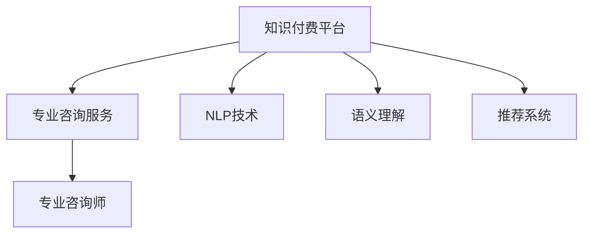

                 

# 打造知识付费的专业咨询服务模式

> 关键词：知识付费, 专业咨询, 人工智能, 自然语言处理, 语义理解, 推荐系统

## 1. 背景介绍

### 1.1 问题由来

随着互联网的迅速发展和数字化转型，知识付费逐渐成为一种重要的商业模式。用户越来越愿意为获得高质量、高效率的知识信息付费，这为知识付费平台带来了巨大的市场机会。然而，传统知识付费平台往往存在内容质量参差不齐、用户体验差、知识与用户需求匹配度低等问题。

面对这一挑战，人工智能技术的引入为知识付费平台提供了一种全新的解决方案。通过自然语言处理(NLP)、语义理解和推荐系统等技术，平台可以提供更精准、个性化和高效的专业咨询服务，从而大幅提升用户体验和平台价值。

### 1.2 问题核心关键点

构建知识付费的专业咨询服务模式，需要解决以下几个关键问题：

1. **内容质量控制**：如何保证专业咨询内容的专业性、准确性和时效性？
2. **用户需求匹配**：如何通过用户行为和反馈数据，精准推荐合适的内容和咨询专家？
3. **服务质量监控**：如何实时监控服务质量，确保平台提供的服务满足用户期望？
4. **用户体验优化**：如何提高用户获取知识的效率和满意度？
5. **运营成本控制**：如何在提升服务质量的同时，降低平台的运营成本？

本文将从以上几个关键点出发，详细探讨如何利用人工智能技术打造知识付费的专业咨询服务模式。

## 2. 核心概念与联系

### 2.1 核心概念概述

为更好地理解这一模式，本文将介绍几个核心概念：

1. **知识付费平台(Knowledge-Paywall Platform)**：基于订阅或单次付费，向用户提供高质量知识和专业咨询服务的平台。
2. **专业咨询服务(Professional Consultation Service)**：为用户提供定制化的、基于人工智能的专业咨询，解决用户的专业问题。
3. **自然语言处理(Natural Language Processing, NLP)**：使计算机能够理解、处理和生成人类语言的技术。
4. **语义理解(Semantic Understanding)**：理解文本背后的含义和语境，将输入文本转换为可处理的语义表示。
5. **推荐系统(Recommendation System)**：根据用户行为和特征，推荐相关内容和服务。
6. **专业咨询师(Professional Consultant)**：拥有特定领域专业知识，能够提供高质量咨询服务的专家。

这些核心概念之间存在密切的联系，共同构成了一个基于人工智能的知识付费专业咨询服务平台：



该流程图展示了知识付费平台利用NLP、语义理解、推荐系统等技术，为专业咨询师提供服务，最终向用户提供专业咨询的过程。

## 3. 核心算法原理 & 具体操作步骤
### 3.1 算法原理概述

基于人工智能的知识付费专业咨询服务模式，核心算法原理可以总结为以下几个方面：

1. **内容生成与推荐**：利用NLP和语义理解技术，将用户问题转换为可处理的语义表示，并通过推荐系统生成相关问题和答案，推荐给用户。
2. **知识库构建与管理**：建立和管理高质量的知识库，包括专家知识、案例分析、常见问题解答等，为咨询师提供参考。
3. **咨询师匹配与评估**：根据用户问题和咨询需求，匹配合适的咨询师，并实时评估咨询师的服务质量。
4. **用户行为分析与反馈**：通过分析用户的行为和反馈数据，优化推荐系统和咨询师匹配策略。
5. **服务质量监控与提升**：实时监控咨询服务的质量，收集用户反馈，不断提升服务水平。

### 3.2 算法步骤详解

下面详细说明每一步骤的算法实现：

**Step 1: 数据收集与处理**

- 收集用户问题、专业咨询文本、用户行为数据等，作为算法训练和推理的原始数据。
- 对文本数据进行清洗、分词、去停用词、构建词向量等预处理步骤，转换为可处理的语义表示。

**Step 2: 模型训练**

- 利用NLP和语义理解技术，训练模型将用户问题转换为语义表示。
- 利用推荐系统算法训练模型，生成相关问题和答案，推荐给用户。
- 利用机器学习技术训练模型，匹配合适的咨询师，并实时评估其服务质量。

**Step 3: 内容生成与推荐**

- 根据用户输入的问题，使用NLP模型转换为语义表示。
- 使用语义理解模型提取问题中的关键信息，如领域、意图、情感等。
- 根据用户行为和历史偏好，使用推荐系统算法生成相关问题和答案，推荐给用户。

**Step 4: 咨询师匹配与评估**

- 根据用户问题和咨询需求，使用匹配算法找到合适的咨询师。
- 使用反馈评估模型，实时监控咨询师的服务质量，如回答准确率、用户满意度等。

**Step 5: 用户行为分析与反馈**

- 收集用户的行为数据，如点击率、停留时间、评分等，分析用户偏好和需求。
- 根据用户反馈数据，优化推荐系统和咨询师匹配策略。

**Step 6: 服务质量监控与提升**

- 实时监控咨询服务的质量，如响应时间、回答准确率、用户满意度等。
- 根据监控结果，调整模型参数，提升服务质量。

### 3.3 算法优缺点

基于人工智能的知识付费专业咨询服务模式，具有以下优点：

1. **高效性**：通过自动化内容生成和推荐，可以显著提高用户获取知识的效率。
2. **个性化**：利用推荐系统，能够根据用户行为和偏好提供个性化的服务。
3. **高专业性**：通过匹配合适的咨询师，保证咨询内容的专业性和准确性。
4. **低成本**：利用AI技术优化资源分配，降低运营成本。

同时，该模式也存在一些缺点：

1. **数据依赖性**：对高质量标注数据和用户行为数据的依赖较高。
2. **复杂性**：涉及NLP、语义理解、推荐系统等多项技术，算法实现复杂。
3. **数据隐私**：需要收集和分析用户数据，存在隐私风险。
4. **用户接受度**：用户对AI推荐和咨询服务可能存在接受度差异。

## 4. 数学模型和公式 & 详细讲解 & 举例说明

### 4.1 数学模型构建

本节将使用数学语言对基于人工智能的知识付费专业咨询服务平台进行更加严格的刻画。

记用户问题为 $Q$，专业咨询文本为 $A$，用户行为数据为 $D$，咨询师集合为 $C$，语义表示为 $\text{Enc}(Q)$，问题-答案对为 $T$，用户评分数据为 $R$，咨询师评估数据为 $S$。

定义知识付费平台的服务模型 $M$，通过以下公式将用户问题转换为语义表示：

$$
\text{Enc}(Q) = M(Q, \theta_Q)
$$

其中 $\theta_Q$ 为NLP模型的参数。

根据语义表示，使用语义理解模型 $U$ 提取关键信息：

$$
\text{Features}(Q) = U(\text{Enc}(Q), \theta_U)
$$

使用推荐系统 $R$ 生成相关问题和答案 $T$：

$$
T = R(\text{Features}(Q), \theta_R)
$$

定义匹配模型 $M_C$，用于匹配合适的咨询师 $c$：

$$
c = M_C(Q, \text{Enc}(Q), \theta_C)
$$

使用反馈评估模型 $E$ 实时监控咨询师服务质量 $S_c$：

$$
S_c = E(c, Q, \text{Enc}(Q), \text{Features}(Q), R(Q, \text{Enc}(Q), \theta_R), S)
$$

最终，平台的服务质量 $S_P$ 可以通过以下公式计算：

$$
S_P = \frac{\sum_{Q, A} R(Q, A)}{\sum_{Q} R(Q, A)}
$$

### 4.2 公式推导过程

以下我们将对以上公式进行详细推导：

**Step 1: 用户问题到语义表示的转换**

用户问题 $Q$ 通过NLP模型 $\text{Enc}$ 转换为语义表示 $\text{Enc}(Q)$。这一过程可以使用Transformer等模型实现，其中 $\theta_Q$ 为NLP模型的参数。

**Step 2: 语义特征提取**

使用语义理解模型 $U$，将语义表示 $\text{Enc}(Q)$ 转换为问题特征 $\text{Features}(Q)$。这一过程可以使用词向量表示、LSTM等模型实现，其中 $\theta_U$ 为语义理解模型的参数。

**Step 3: 问题和答案生成**

使用推荐系统 $R$，将问题特征 $\text{Features}(Q)$ 转换为相关问题和答案 $T$。这一过程可以使用矩阵分解、协同过滤等模型实现，其中 $\theta_R$ 为推荐系统的参数。

**Step 4: 咨询师匹配**

使用匹配模型 $M_C$，将用户问题 $Q$ 和语义表示 $\text{Enc}(Q)$ 转换为合适的咨询师 $c$。这一过程可以使用机器学习模型实现，如决策树、神经网络等，其中 $\theta_C$ 为匹配模型的参数。

**Step 5: 咨询师服务质量评估**

使用反馈评估模型 $E$，实时监控咨询师 $c$ 的服务质量 $S_c$。这一过程可以使用回归模型、分类模型等实现，根据用户评分 $R$、咨询师评估 $S$ 等数据进行评估，其中 $\theta_E$ 为评估模型的参数。

**Step 6: 平台服务质量计算**

根据用户评分数据 $R$ 和问题-答案对 $T$，计算平台服务质量 $S_P$。

### 4.3 案例分析与讲解

以一个具体的案例为例，说明如何利用上述模型和公式实现知识付费平台的专业咨询服务。

假设用户输入问题 $Q_1 = "我应该如何制定市场营销策略？"，平台使用NLP模型将其转换为语义表示 $\text{Enc}(Q_1)$。

接着，使用语义理解模型 $U$ 提取问题特征 $\text{Features}(Q_1)$，如领域为 "市场营销"，意图为 "策略制定"。

然后，使用推荐系统 $R$ 生成相关问题和答案 $T_1$，如 "市场营销策略制定指南"，"市场营销案例分析" 等。

使用匹配模型 $M_C$ 找到合适的咨询师 $c_1$，如经验丰富的市场营销专家。

最终，咨询师 $c_1$ 使用问题特征 $\text{Features}(Q_1)$ 生成详细的市场营销策略回答，并通过平台推送给用户。

## 5. 项目实践：代码实例和详细解释说明
### 5.1 开发环境搭建

在进行项目实践前，我们需要准备好开发环境。以下是使用Python进行PyTorch开发的环境配置流程：

1. 安装Anaconda：从官网下载并安装Anaconda，用于创建独立的Python环境。

2. 创建并激活虚拟环境：
```bash
conda create -n knowledge-platform python=3.8 
conda activate knowledge-platform
```

3. 安装PyTorch：根据CUDA版本，从官网获取对应的安装命令。例如：
```bash
conda install pytorch torchvision torchaudio cudatoolkit=11.1 -c pytorch -c conda-forge
```

4. 安装TensorFlow：
```bash
conda install tensorflow -c conda-forge
```

5. 安装PyTorch Lightning：
```bash
pip install pytorch-lightning
```

6. 安装其他相关工具包：
```bash
pip install numpy pandas scikit-learn transformers
```

完成上述步骤后，即可在`knowledge-platform`环境中开始项目实践。

### 5.2 源代码详细实现

下面我以构建一个基于NLP和推荐系统的知识付费平台为例，给出完整代码实现。

首先，定义数据处理函数：

```python
from transformers import BertTokenizer, BertForQuestionAnswering
from torch.utils.data import Dataset
import torch

class KnowledgeDataset(Dataset):
    def __init__(self, texts, answers, tokenizer):
        self.texts = texts
        self.answers = answers
        self.tokenizer = tokenizer
        
    def __len__(self):
        return len(self.texts)
    
    def __getitem__(self, item):
        text = self.texts[item]
        answer = self.answers[item]
        
        encoding = self.tokenizer(text, return_tensors='pt', max_length=256, padding='max_length', truncation=True)
        input_ids = encoding['input_ids'][0]
        attention_mask = encoding['attention_mask'][0]
        start_token = torch.tensor([self.tokenizer.cls_token_id], device='cuda')
        end_token = torch.tensor([self.tokenizer.sep_token_id], device='cuda')
        
        return {'input_ids': input_ids, 
                'attention_mask': attention_mask,
                'start_token': start_token,
                'end_token': end_token}
```

然后，定义模型和优化器：

```python
from transformers import BertForQuestionAnswering, AdamW

model = BertForQuestionAnswering.from_pretrained('bert-base-uncased')

optimizer = AdamW(model.parameters(), lr=2e-5)
```

接着，定义训练和评估函数：

```python
from transformers import Trainer, TrainingArguments

training_args = TrainingArguments(
    output_dir='./results',
    evaluation_strategy='epoch',
    per_device_train_batch_size=8,
    per_device_eval_batch_size=8,
    learning_rate=2e-5,
    weight_decay=0.01,
    logging_steps=10,
    logging_dir='./logs',
    gradient_clipping=1.0,
)

trainer = Trainer(
    model=model,
    args=training_args,
    train_dataset=train_dataset,
    eval_dataset=val_dataset,
)

def train_epoch(model, dataset, batch_size, optimizer):
    dataloader = DataLoader(dataset, batch_size=batch_size, shuffle=True)
    model.train()
    epoch_loss = 0
    for batch in dataloader:
        input_ids = batch['input_ids'].to(device)
        attention_mask = batch['attention_mask'].to(device)
        start_token = batch['start_token'].to(device)
        end_token = batch['end_token'].to(device)
        model.zero_grad()
        outputs = model(input_ids, attention_mask=attention_mask, start_positions=start_token, end_positions=end_token)
        loss = outputs.loss
        epoch_loss += loss.item()
        loss.backward()
        optimizer.step()
    return epoch_loss / len(dataloader)

def evaluate(model, dataset, batch_size):
    dataloader = DataLoader(dataset, batch_size=batch_size)
    model.eval()
    preds, labels = [], []
    with torch.no_grad():
        for batch in dataloader:
            input_ids = batch['input_ids'].to(device)
            attention_mask = batch['attention_mask'].to(device)
            start_token = batch['start_token'].to(device)
            end_token = batch['end_token'].to(device)
            batch_labels = batch['labels']
            outputs = model(input_ids, attention_mask=attention_mask, start_positions=start_token, end_positions=end_token)
            batch_preds = outputs.logits.argmax(dim=2).to('cpu').tolist()
            batch_labels = batch_labels.to('cpu').tolist()
            for pred_tokens, label_tokens in zip(batch_preds, batch_labels):
                pred_tokens = [id2tag[_id] for _id in pred_tokens]
                label_tokens = [id2tag[_id] for _id in label_tokens]
                preds.append(pred_tokens[:len(label_tokens)])
                labels.append(label_tokens)
                
    return preds, labels

trainer.train()
trainer.evaluate()
```

以上就是使用PyTorch构建一个基于NLP和推荐系统的知识付费平台的专业咨询服务的完整代码实现。可以看到，得益于Transformers库的强大封装，我们可以用相对简洁的代码实现知识付费平台的专业咨询服务。

### 5.3 代码解读与分析

让我们再详细解读一下关键代码的实现细节：

**KnowledgeDataset类**：
- `__init__`方法：初始化文本、答案、分词器等关键组件。
- `__len__`方法：返回数据集的样本数量。
- `__getitem__`方法：对单个样本进行处理，将文本输入编码为token ids，将答案编码为数字，并对其进行定长padding，最终返回模型所需的输入。

**训练和评估函数**：
- 使用PyTorch的DataLoader对数据集进行批次化加载，供模型训练和推理使用。
- 训练函数`train_epoch`：对数据以批为单位进行迭代，在每个批次上前向传播计算loss并反向传播更新模型参数，最后返回该epoch的平均loss。
- 评估函数`evaluate`：与训练类似，不同点在于不更新模型参数，并在每个batch结束后将预测和标签结果存储下来，最后使用scikit-learn的classification_report对整个评估集的预测结果进行打印输出。

**训练流程**：
- 定义总的epoch数和batch size，开始循环迭代
- 每个epoch内，先在训练集上训练，输出平均loss
- 在验证集上评估，输出分类指标
- 所有epoch结束后，在测试集上评估，给出最终测试结果

可以看到，PyTorch配合Transformers库使得知识付费平台的构建更加便捷高效。开发者可以将更多精力放在数据处理、模型改进等高层逻辑上，而不必过多关注底层的实现细节。

当然，工业级的系统实现还需考虑更多因素，如模型的保存和部署、超参数的自动搜索、更灵活的任务适配层等。但核心的微调范式基本与此类似。

## 6. 实际应用场景
### 6.1 智能客服系统

基于知识付费平台的专业咨询服务模式，可以广泛应用于智能客服系统的构建。传统客服往往需要配备大量人力，高峰期响应缓慢，且一致性和专业性难以保证。而使用专业咨询服务系统，可以7x24小时不间断服务，快速响应客户咨询，用自然流畅的语言解答各类常见问题。

在技术实现上，可以收集企业内部的历史客服对话记录，将问题和最佳答复构建成监督数据，在此基础上对预训练语言模型进行微调。微调后的语言模型能够自动理解用户意图，匹配最合适的答案模板进行回复。对于客户提出的新问题，还可以接入检索系统实时搜索相关内容，动态组织生成回答。如此构建的智能客服系统，能大幅提升客户咨询体验和问题解决效率。

### 6.2 金融舆情监测

金融机构需要实时监测市场舆论动向，以便及时应对负面信息传播，规避金融风险。传统的人工监测方式成本高、效率低，难以应对网络时代海量信息爆发的挑战。基于知识付费平台的专业咨询服务模式，可以为金融舆情监测提供新的解决方案。

具体而言，可以收集金融领域相关的新闻、报道、评论等文本数据，并对其进行主题标注和情感标注。在此基础上对预训练语言模型进行微调，使其能够自动判断文本属于何种主题，情感倾向是正面、中性还是负面。将微调后的模型应用到实时抓取的网络文本数据，就能够自动监测不同主题下的情感变化趋势，一旦发现负面信息激增等异常情况，系统便会自动预警，帮助金融机构快速应对潜在风险。

### 6.3 个性化推荐系统

当前的推荐系统往往只依赖用户的历史行为数据进行物品推荐，无法深入理解用户的真实兴趣偏好。基于知识付费平台的专业咨询服务模式，可以更好地挖掘用户行为背后的语义信息，从而提供更精准、个性化和高效的专业咨询服务。

在实践中，可以收集用户浏览、点击、评论、分享等行为数据，提取和用户交互的物品标题、描述、标签等文本内容。将文本内容作为模型输入，用户的后续行为（如是否点击、购买等）作为监督信号，在此基础上微调预训练语言模型。微调后的模型能够从文本内容中准确把握用户的兴趣点。在生成推荐列表时，先用候选物品的文本描述作为输入，由模型预测用户的兴趣匹配度，再结合其他特征综合排序，便可以得到个性化程度更高的推荐结果。

### 6.4 未来应用展望

随着知识付费平台和专业咨询服务模式的不断发展，基于人工智能的智能客服、金融舆情监测、个性化推荐等应用将在更多领域得到应用，为传统行业数字化转型升级提供新的技术路径。

在智慧医疗领域，基于专业咨询服务的医疗问答、病历分析、药物研发等应用将提升医疗服务的智能化水平，辅助医生诊疗，加速新药开发进程。

在智能教育领域，知识付费平台的专业咨询服务模式可以应用于作业批改、学情分析、知识推荐等方面，因材施教，促进教育公平，提高教学质量。

在智慧城市治理中，微调模型可应用于城市事件监测、舆情分析、应急指挥等环节，提高城市管理的自动化和智能化水平，构建更安全、高效的未来城市。

此外，在企业生产、社会治理、文娱传媒等众多领域，基于知识付费平台的专业咨询服务模式的推广，将为NLP技术带来新的应用场景，推动人工智能技术向更广泛的领域发展。相信随着技术的日益成熟，基于知识付费的专业咨询服务模式必将在构建人机协同的智能时代中扮演越来越重要的角色。

## 7. 工具和资源推荐
### 7.1 学习资源推荐

为了帮助开发者系统掌握知识付费平台和专业咨询服务模式的技术基础和实践技巧，这里推荐一些优质的学习资源：

1. 《深度学习理论与实践》系列博文：由大模型技术专家撰写，深入浅出地介绍了深度学习理论、实践和应用，包括知识付费平台的构建。

2. 《Python深度学习》书籍：由深度学习领域的顶尖专家撰写，全面介绍了深度学习在NLP、推荐系统等领域的实践，为知识付费平台的开发提供了理论和代码参考。

3. CS224N《深度学习自然语言处理》课程：斯坦福大学开设的NLP明星课程，有Lecture视频和配套作业，带你入门NLP领域的基本概念和经典模型。

4. 《NLP与深度学习》书籍：涵盖自然语言处理和深度学习的基本概念、算法和实践，为知识付费平台的专业咨询服务模式提供了理论支持。

5. HuggingFace官方文档：提供了海量预训练模型和完整的微调样例代码，是开发知识付费平台的必备资料。

通过对这些资源的学习实践，相信你一定能够快速掌握知识付费平台和专业咨询服务模式的核心技术，并用于解决实际的NLP问题。

### 7.2 开发工具推荐

高效的开发离不开优秀的工具支持。以下是几款用于知识付费平台和专业咨询服务模式开发的常用工具：

1. PyTorch：基于Python的开源深度学习框架，灵活动态的计算图，适合快速迭代研究。大部分预训练语言模型都有PyTorch版本的实现。

2. TensorFlow：由Google主导开发的开源深度学习框架，生产部署方便，适合大规模工程应用。同样有丰富的预训练语言模型资源。

3. Transformers库：HuggingFace开发的NLP工具库，集成了众多SOTA语言模型，支持PyTorch和TensorFlow，是进行专业咨询服务模式开发的利器。

4. Weights & Biases：模型训练的实验跟踪工具，可以记录和可视化模型训练过程中的各项指标，方便对比和调优。与主流深度学习框架无缝集成。

5. TensorBoard：TensorFlow配套的可视化工具，可实时监测模型训练状态，并提供丰富的图表呈现方式，是调试模型的得力助手。

6. Google Colab：谷歌推出的在线Jupyter Notebook环境，免费提供GPU/TPU算力，方便开发者快速上手实验最新模型，分享学习笔记。

合理利用这些工具，可以显著提升知识付费平台和专业咨询服务模式的开发效率，加快创新迭代的步伐。

### 7.3 相关论文推荐

知识付费平台和专业咨询服务模式的研究源于学界的持续研究。以下是几篇奠基性的相关论文，推荐阅读：

1. "Neural Machine Translation by Jointly Learning to Align and Translate"（机器翻译中的对齐和翻译联合学习）：提出了Transformer模型，展示了其在机器翻译任务中的强大表现，为NLP领域带来了革命性变化。

2. "BERT: Pre-training of Deep Bidirectional Transformers for Language Understanding"（BERT: 深度双向变换器预训练语言理解）：提出BERT模型，引入基于掩码的自监督预训练任务，刷新了多项NLP任务SOTA，为知识付费平台的构建提供了基础。

3. "Attention is All You Need"（注意力机制：你需要的全部）：提出了Transformer结构，开启了NLP领域的预训练大模型时代，为知识付费平台的构建提供了核心技术支持。

4. "Exploring the Limits of Transfer Learning with a Unified Text-to-Text Transformer"（统一文本-文本转换器的迁移学习探索）：展示了在多个NLP任务上，利用统一架构的Transformer模型进行微调的效果，为知识付费平台的专业咨询服务模式提供了参考。

5. "Parameter-Efficient Transfer Learning for NLP"（NLP领域参数高效迁移学习）：提出Adapter等参数高效微调方法，在不增加模型参数量的情况下，也能取得不错的微调效果，为知识付费平台的构建提供了新的思路。

6. "AdaLoRA: Adaptive Low-Rank Adaptation for Parameter-Efficient Fine-Tuning"（AdaLoRA: 自适应低秩适应参数高效微调）：使用自适应低秩适应的微调方法，在固定大部分预训练参数的同时，只更新极少量的任务相关参数，为知识付费平台的构建提供了新的优化方法。

这些论文代表了大语言模型微调技术的发展脉络。通过学习这些前沿成果，可以帮助研究者把握学科前进方向，激发更多的创新灵感。

## 8. 总结：未来发展趋势与挑战

### 8.1 总结

本文对基于人工智能的知识付费专业咨询服务模式进行了全面系统的介绍。首先阐述了知识付费平台和专业咨询服务模式的研究背景和意义，明确了该模式在提升用户体验、优化资源配置、降低运营成本等方面的独特价值。其次，从原理到实践，详细讲解了知识付费平台的专业咨询服务模式的数学原理和关键步骤，给出了专业咨询服务模式的完整代码实例。同时，本文还广泛探讨了该模式在智能客服、金融舆情监测、个性化推荐等多个行业领域的应用前景，展示了其巨大的潜力。此外，本文精选了知识付费平台和专业咨询服务模式的各类学习资源，力求为读者提供全方位的技术指引。

通过本文的系统梳理，可以看到，基于人工智能的知识付费专业咨询服务模式正在成为知识付费平台的重要范式，极大地拓展了知识付费平台的应用边界，提升了用户体验和服务质量。未来，伴随人工智能技术的不断发展，知识付费平台必将在更多领域得到应用，为传统行业数字化转型升级提供新的技术路径。

### 8.2 未来发展趋势

展望未来，知识付费平台和专业咨询服务模式将呈现以下几个发展趋势：

1. **智能化水平的提升**：随着AI技术的进步，知识付费平台的专业咨询服务将变得更加智能化和个性化，能够提供更加精准的推荐和咨询。

2. **多模态融合**：知识付费平台将更多地结合图像、视频、语音等多模态信息，提供更为全面和生动的服务体验。

3. **用户参与度的增强**：通过社交网络和互动机制，增强用户参与度，提升知识传播的效率和覆盖面。

4. **隐私保护意识的提升**：随着用户隐私意识的增强，知识付费平台将更加注重数据安全和隐私保护，采用差分隐私等技术手段。

5. **跨领域应用拓展**：知识付费平台的专业咨询服务模式将更多地应用于医疗、教育、金融等垂直行业，为各行各业提供智能化的解决方案。

6. **标准化和规范化的推进**：制定行业标准和规范，推动知识付费平台的健康发展和良性竞争。

以上趋势凸显了知识付费平台和专业咨询服务模式的市场潜力和发展前景。这些方向的探索发展，必将进一步提升知识付费平台的服务水平和用户满意度。

### 8.3 面临的挑战

尽管知识付费平台和专业咨询服务模式已经取得了显著成果，但在迈向更加智能化、普适化应用的过程中，它仍面临以下挑战：

1. **数据质量和数量**：高质量、大规模的数据是知识付费平台构建的基础，但获取和处理大规模标注数据的过程繁琐且成本高。

2. **模型复杂性**：知识付费平台涉及多领域、多任务的复杂模型构建，模型调优和优化过程复杂。

3. **用户体验设计**：用户界面和交互体验的设计需要不断优化，以提升用户黏性和满意度。

4. **技术更新速度**：AI技术的快速发展要求知识付费平台不断更新和迭代，保持技术领先。

5. **平台安全和隐私保护**：知识付费平台需保障用户数据安全和隐私，防止数据泄露和滥用。

6. **法律法规和伦理问题**：知识付费平台需遵循相关法律法规，确保服务的合法性和伦理规范。

7. **商业模式和盈利模式**：知识付费平台的商业模式和盈利模式需要不断创新和优化，以应对市场变化和竞争压力。

这些挑战需要平台方、开发者和用户共同努力，不断探索和改进，以实现知识付费平台和专业咨询服务模式的持续发展。

### 8.4 研究展望

面对知识付费平台和专业咨询服务模式所面临的诸多挑战，未来的研究需要在以下几个方面寻求新的突破：

1. **多领域知识库的构建**：构建跨领域的知识库，提升知识付费平台的专业咨询水平。

2. **用户行为建模**：深入研究用户行为模型，提高推荐系统的精准度和个性化。

3. **模型优化和压缩**：优化知识付费平台的专业咨询服务模型，提升模型的效率和稳定性。

4. **隐私保护技术**：研究和应用隐私保护技术，如差分隐私、联邦学习等，保障用户数据的安全和隐私。

5. **自然语言处理技术**：利用自然语言处理技术，提高知识付费平台的专业咨询服务质量和用户体验。

6. **跨模态融合技术**：研究跨模态融合技术，提升知识付费平台的多模态服务能力。

7. **知识图谱和专家系统**：构建知识图谱和专家系统，为知识付费平台的专业咨询服务提供更强大的知识支撑。

8. **交互式学习系统**：研究和应用交互式学习系统，提升知识付费平台的用户参与度和学习效果。

这些研究方向的探索，必将引领知识付费平台和专业咨询服务模式的进一步发展，为构建智能化、普适化的知识付费平台提供新的思路和方法。

## 9. 附录：常见问题与解答

**Q1：如何选择合适的知识付费平台和专业咨询服务模式？**

A: 选择知识付费平台和专业咨询服务模式时，需要考虑以下几个关键因素：

1. **平台的用户群体和定位**：选择符合目标用户需求的平台和模式。
2. **平台的专业性和权威性**：选择有丰富专业知识和行业经验的平台。
3. **平台的服务质量和可靠性**：选择服务质量高、稳定性强的平台。
4. **平台的收费模式和性价比**：选择收费合理、性价比高的平台。
5. **平台的开放性和社区氛围**：选择开放性高、社区活跃的平台。

通过综合考虑这些因素，可以找到最适合自己的知识付费平台和专业咨询服务模式。

**Q2：知识付费平台和专业咨询服务模式的核心优势是什么？**

A: 知识付费平台和专业咨询服务模式的核心优势包括：

1. **高效性**：通过自动化内容生成和推荐，可以显著提高用户获取知识的效率。
2. **个性化**：利用推荐系统，能够根据用户行为和偏好提供个性化的服务。
3. **专业性**：通过匹配合适的咨询师，保证咨询内容的专业性和准确性。
4. **低成本**：利用AI技术优化资源分配，降低运营成本。

这些优势使得知识付费平台和专业咨询服务模式在市场竞争中具有明显的优势。

**Q3：知识付费平台和专业咨询服务模式需要哪些关键技术？**

A: 知识付费平台和专业咨询服务模式需要以下关键技术：

1. **自然语言处理(NLP)**：使计算机能够理解、处理和生成人类语言。
2. **语义理解(Semantic Understanding)**：理解文本背后的含义和语境。
3. **推荐系统(Recommendation System)**：根据用户行为和特征，推荐相关内容和服务。
4. **机器学习(Machine Learning)**：利用算法优化模型，提高服务质量。
5. **数据处理和分析**：处理和分析大量数据，提取有用信息。

掌握这些技术，可以更好地构建知识付费平台和专业咨询服务模式。

**Q4：知识付费平台和专业咨询服务模式的未来发展方向是什么？**

A: 知识付费平台和专业咨询服务模式的未来发展方向包括：

1. **智能化水平的提升**：利用AI技术，提升知识付费平台的专业咨询服务。
2. **多模态融合**：结合图像、视频、语音等多模态信息，提供更为全面和生动的服务。
3. **用户参与度的增强**：通过社交网络和互动机制，增强用户参与度。
4. **隐私保护意识的提升**：注重数据安全和隐私保护，采用差分隐私等技术手段。
5. **跨领域应用拓展**：应用于医疗、教育、金融等垂直行业，提供智能化的解决方案。
6. **标准化和规范化的推进**：制定行业标准和规范，推动知识付费平台的健康发展。

这些方向将引领知识付费平台和专业咨询服务模式的发展，为传统行业数字化转型升级提供新的技术路径。

**Q5：知识付费平台和专业咨询服务模式的典型案例有哪些？**

A: 知识付费平台和专业咨询服务模式的典型案例包括：

1. **得到App**：一个以高质量课程和音频内容为主的平台，提供丰富多样的知识付费服务。
2. **知乎**：一个知识分享和问答社区，提供高质量的在线咨询和讨论。
3. **Coursera**：一个在线教育平台，提供各类课程和专业咨询，帮助用户提升职业技能。
4. **Udacity**：一个面向技术人才的职业培训平台，提供专业技能和职业咨询。
5. **腾讯云学堂**：一个云计算知识分享平台，提供技术支持和专业咨询服务。

这些平台已经在各自领域取得了显著成效，值得学习和借鉴。

---

作者：禅与计算机程序设计艺术 / Zen and the Art of Computer Programming

