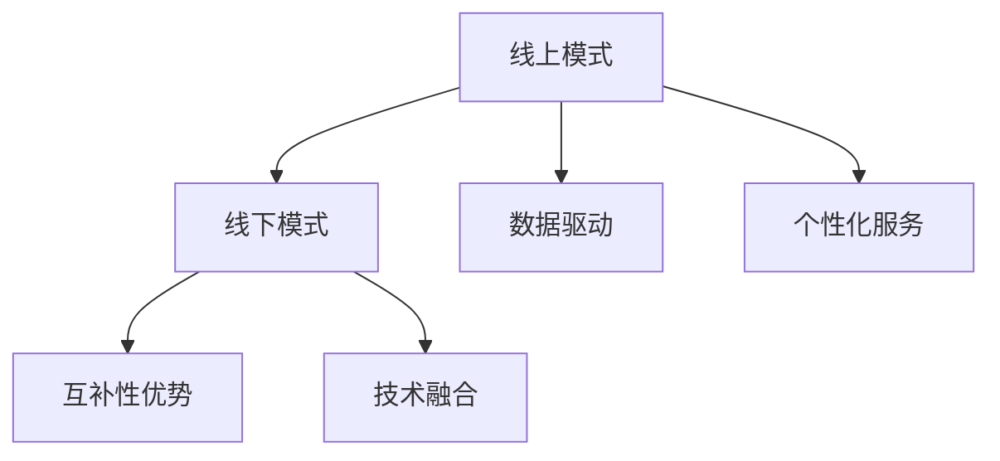

                 

## 1. 背景介绍

在数字化快速发展的今天，知识付费已成为学习新技能、提升个人竞争力、获取专业知识的流行方式。随着移动互联网、人工智能、大数据等技术的应用，知识付费的形式也在不断演变。为了满足不同用户需求，线上线下混合知识付费模式应运而生，通过融合线上线下的优势，打造更加完整、个性化的知识付费生态。本文将深入探讨知识付费的线上线下混合模式，从核心概念、算法原理、项目实践、应用场景等方面进行详细阐述。

## 2. 核心概念与联系

### 2.1 核心概念概述

要理解线上线下混合知识付费模式，首先需要明确几个关键概念：

- **知识付费（Kasnowledge Subscription）**：用户为获取知识内容（如课程、文章、报告、咨询等）支付费用的模式，与传统免费获取知识的互联网模式形成鲜明对比。

- **线上模式**：通过互联网平台提供知识产品，用户可以随时随地获取知识内容，如MOOC课程、在线讲座、电子书等。

- **线下模式**：线下实体书店、社区学院、培训中心等提供知识付费服务，用户通过现场互动、面对面交流获取知识。

- **线上线下混合模式**：将线上线下的资源和服务融合，形成互补优势，提供综合性的知识付费解决方案。

### 2.2 核心概念之间的联系

线上线下混合知识付费模式的构建基于以下几个关键联系：

1. **数据驱动**：线上模式的数据积累和分析能力为线下模式提供了用户需求和市场趋势的洞察。
2. **个性化服务**：线下模式与用户的亲密互动可以捕捉用户更加详细的个性化需求，线上模式则可以根据这些需求提供更精准的内容推荐。
3. **互补性优势**：线上线下模式的互补性，使得用户可以根据自身偏好和学习方式选择不同的获取知识途径。
4. **技术融合**：利用人工智能、大数据等技术，实现线上线下的无缝对接和深度整合，提升知识服务的效果和体验。

以下是一个Mermaid流程图，展示线上线下混合知识付费模式的核心概念及其关系：



## 3. 核心算法原理 & 具体操作步骤

### 3.1 算法原理概述

线上线下混合知识付费模式的核心算法原理涉及多个方面，包括推荐系统、个性化学习路径、数据驱动决策等。以推荐系统为例，其原理是通过用户行为数据和内容特征，构建用户兴趣模型，预测用户可能感兴趣的知识内容，从而实现个性化推荐。

### 3.2 算法步骤详解

**Step 1: 数据收集与预处理**
- 收集线上线下模式的用户行为数据，包括学习记录、互动评论、购买历史等。
- 对数据进行清洗、去重、归一化处理，去除噪音和异常值。

**Step 2: 用户画像构建**
- 利用机器学习算法，如协同过滤、深度学习等，构建用户兴趣和行为模型。
- 对用户进行聚类分析，发现不同用户群体的特征和需求。

**Step 3: 内容推荐**
- 基于用户画像和内容标签，使用推荐算法，如基于矩阵分解的推荐、基于梯度下降的推荐等，计算用户对各个知识内容的评分。
- 选取评分较高的内容，形成个性化推荐列表，推送给用户。

**Step 4: 知识路径规划**
- 根据用户的学习进度和兴趣点，规划个性化学习路径，如时间序列推荐、任务导向推荐等。
- 使用强化学习算法，优化学习路径，提升用户学习效果和满意度。

**Step 5: 反馈与优化**
- 收集用户对推荐内容和路径的反馈，进行模型参数的调整和优化。
- 持续迭代算法模型，提升推荐精度和用户体验。

### 3.3 算法优缺点

线上线下混合知识付费模式的算法具有以下优点：

- **个性化推荐**：通过线上模式的数据积累，能提供精准的个性化推荐，提升用户满意度。
- **用户体验丰富**：线下模式提供面对面交流和互动，增强学习体验和情感连接。
- **互补优势**：线上线下模式互补，用户可以根据自身需求选择不同的学习方式。

同时，也存在以下缺点：

- **技术复杂性**：需要同时处理线上线下数据，算法模型较为复杂。
- **用户隐私保护**：如何平衡个性化推荐与用户隐私保护，是关键挑战。
- **运营成本高**：线下模式需要物理空间和人员投入，运营成本较高。

### 3.4 算法应用领域

线上线下混合知识付费模式的应用领域非常广泛，主要包括：

- **教育培训**：结合线上课程和线下培训，提供个性化学习路径和互动体验。
- **职业发展**：提供技能培训课程和职业咨询，帮助用户提升职场竞争力。
- **健康管理**：结合线上知识库和线下健康讲座，为用户提供科学健康管理方案。
- **兴趣爱好**：通过线上平台提供多样化兴趣课程，线下社群活动增强互动体验。

## 4. 数学模型和公式 & 详细讲解 & 举例说明

### 4.1 数学模型构建

线上线下混合知识付费模式涉及多个数学模型，其中推荐系统是最核心的部分。推荐系统主要基于用户行为数据和内容特征构建用户兴趣模型，预测用户对知识内容的评分。

假设用户集为 $U$，内容集为 $I$，用户与内容之间的评分矩阵为 $R_{UI}$。

推荐系统可以构建用户兴趣模型 $u$ 和内容特征模型 $i$，通过相似度计算得到用户对内容的评分预测。推荐系统的一般框架如下：

$$
R_{UI} = \mathop{\arg\min}_{u,i} \Vert R_{UI} - \hat{R}_{UI} \Vert_F^2
$$

其中，$\Vert \cdot \Vert_F$ 表示矩阵的 Frobenius 范数，$\hat{R}_{UI}$ 表示预测评分矩阵。

### 4.2 公式推导过程

以基于矩阵分解的协同过滤推荐算法为例，其基本思路是将评分矩阵 $R$ 分解为用户兴趣矩阵 $U$ 和内容特征矩阵 $V$ 的乘积：

$$
R \approx UV^T
$$

通过求解 $U$ 和 $V$，得到用户兴趣和内容特征的表示，进而计算用户对各个内容的评分预测。具体推导如下：

1. 设定目标函数：

$$
\min_{U,V} \Vert R - UV^T \Vert_F^2
$$

2. 对目标函数进行矩阵求导：

$$
\frac{\partial}{\partial U} \Vert R - UV^T \Vert_F^2 = 2U^T(V^TV - R^TV)
$$

$$
\frac{\partial}{\partial V} \Vert R - UV^T \Vert_F^2 = 2V^T(U^TU - U^TV^TR)
$$

3. 求解 $U$ 和 $V$：

$$
U = R(V^TV)^{-1}V^T, \quad V = U^TU(R^TV^TU)^{-1}
$$

4. 计算用户对内容的评分预测：

$$
\hat{R}_{ui} = u_i^Tv_u
$$

其中，$u_i$ 表示用户 $u$ 对内容 $i$ 的兴趣表示，$v_u$ 表示内容 $i$ 的特征表示。

### 4.3 案例分析与讲解

以某在线教育平台为例，分析如何利用推荐系统实现个性化学习路径。

平台收集用户学习记录、测评成绩、互动评论等数据，构建用户画像。通过协同过滤算法，计算用户对各个课程的评分，并结合用户的学习进度，规划个性化学习路径。用户每天通过平台学习推荐课程，完成学习任务，平台根据任务完成情况实时调整推荐列表，确保用户掌握知识点。

## 5. 项目实践：代码实例和详细解释说明

### 5.1 开发环境搭建

**环境搭建**：
- 安装Python 3.x环境
- 安装Pandas、NumPy、Scikit-learn等常用库
- 安装TensorFlow或PyTorch用于构建推荐模型

**环境配置**：
- 搭建Kafka集群用于实时数据流
- 搭建Hadoop集群用于数据存储和处理
- 搭建ElasticSearch用于数据索引和搜索

### 5.2 源代码详细实现

以基于TensorFlow的协同过滤推荐系统为例，展示推荐系统的主要代码实现。

```python
import tensorflow as tf
import pandas as pd
import numpy as np

# 加载数据
data = pd.read_csv('ratings.csv')

# 构建用户兴趣矩阵
users = data['user_id'].unique()
items = data['item_id'].unique()
user_items = {}
for user in users:
    user_items[user] = data[data['user_id'] == user]['item_id'].tolist()

U = np.random.rand(len(users), 20)
V = np.random.rand(len(items), 20)

# 构建用户对内容的评分矩阵
R = np.zeros((len(users), len(items)))

for user, items in user_items.items():
    for item in items:
        user_idx = users.index(user)
        item_idx = items.index(item)
        R[user_idx, item_idx] = data[data['user_id'] == user][['item_id', 'rating']].mean()['rating']

# 矩阵分解
Uhat = tf.Variable(U)
Vhat = tf.Variable(V)
W = tf.matmul(Uhat, Vhat, transpose_b=True)

# 损失函数
loss = tf.reduce_sum(tf.square(tf.subtract(R, tf.matmul(W, Vhat, transpose_b=True))))

# 优化器
optimizer = tf.keras.optimizers.Adam(learning_rate=0.01)

# 训练
with tf.Session() as sess:
    sess.run(tf.global_variables_initializer())
    for i in range(100):
        sess.run(optimizer.minimize(loss))
        print(f'epoch {i+1}, loss: {sess.run(loss)}')

# 预测
test_items = ['item1', 'item2', 'item3']
user_idx = users.index('user1')
Rhat = sess.run(tf.matmul(Uhat, Vhat, transpose_b=True))[user_idx]
Rhat[item_idxs] = sess.run(W)[user_idx, item_idxs]

print('recommended items:', [items for items, score in sorted(zip(items, Rhat), key=lambda x: x[1], reverse=True)[:5]])
```

### 5.3 代码解读与分析

代码实现包括以下几个关键步骤：

1. 数据加载和预处理：使用Pandas加载数据，构建用户兴趣矩阵和评分矩阵。

2. 矩阵分解：使用随机矩阵初始化用户兴趣矩阵和内容特征矩阵，通过TensorFlow构建优化器，进行矩阵分解训练。

3. 损失函数和优化器：计算损失函数，使用Adam优化器进行参数更新。

4. 训练过程：通过TensorFlow会话进行模型训练，迭代优化。

5. 模型预测：根据用户兴趣和内容特征矩阵，计算用户对内容的评分预测，并返回推荐结果。

运行结果展示了推荐结果，平台可以根据用户的学习进度和兴趣点，实时调整推荐列表，提供个性化学习路径。

## 6. 实际应用场景

### 6.1 教育培训

线上线下混合知识付费模式在教育培训领域有着广泛的应用。平台可以结合线上课程和线下培训，提供个性化的学习路径和互动体验，帮助用户更高效地掌握知识和技能。

### 6.2 职业发展

在职业发展方面，平台可以提供技能培训课程和职业咨询，结合线上线下的互动交流，帮助用户提升职场竞争力，实现职业目标。

### 6.3 健康管理

健康管理领域，平台可以结合线上知识库和线下健康讲座，提供科学健康管理方案，增强用户的健康意识和自我管理能力。

### 6.4 兴趣爱好

兴趣爱好领域，平台可以提供多样化的兴趣课程和线下社群活动，增强用户的互动体验，培养兴趣爱好。

## 7. 工具和资源推荐

### 7.1 学习资源推荐

1. 《推荐系统实战》书籍：详细介绍了推荐系统的原理和实现方法，包括协同过滤、内容推荐、深度学习等。

2. Coursera《Machine Learning》课程：由斯坦福大学教授Andrew Ng主讲的经典课程，涵盖机器学习的基础理论和实践应用。

3. Kaggle平台：提供大量推荐系统相关的数据集和竞赛，帮助你实践和验证推荐算法。

### 7.2 开发工具推荐

1. PyTorch：强大的深度学习框架，提供丰富的机器学习库和高效计算图。

2. TensorFlow：由Google开发的开源深度学习框架，支持大规模分布式训练和模型部署。

3. Apache Kafka：分布式流处理系统，用于实时数据采集和流式处理。

4. Apache Hadoop：大规模数据处理框架，支持分布式存储和计算。

5. Elasticsearch：高效的数据索引和搜索系统，用于实时查询和分析。

### 7.3 相关论文推荐

1. BERT: Pre-training of Deep Bidirectional Transformers for Language Understanding（BERT论文）：提出BERT预训练模型，改变了NLP领域的预训练范式。

2. Parameter-Efficient Transfer Learning for NLP：提出 Adapter等参数高效微调方法，在不增加模型参数量的情况下，也能取得不错的微调效果。

3. Knowledge Graphs for Recommendation Systems：介绍知识图谱在推荐系统中的应用，如何通过融合知识图谱信息提升推荐精度。

4. Deep Collaborative Filtering：介绍协同过滤算法的原理和实现方法，如何通过用户行为数据进行推荐。

## 8. 总结：未来发展趋势与挑战

### 8.1 总结

本文详细探讨了线上线下混合知识付费模式的核心概念、算法原理、项目实践和应用场景。线上线下混合模式通过融合线上线下的优势，提供个性化推荐和互动体验，成为知识付费的重要发展方向。通过数据分析和算法优化，线上线下混合知识付费模式能够满足用户多样化的学习需求，提升用户体验和满意度。

### 8.2 未来发展趋势

展望未来，线上线下混合知识付费模式将呈现以下几个发展趋势：

1. **技术融合加深**：随着人工智能、大数据、物联网等技术的发展，线上线下混合模式将更加紧密结合，提供更全面、智能的知识服务。

2. **个性化提升**：通过进一步优化推荐算法和用户画像构建，实现更加精准和个性化的推荐。

3. **社交化互动增强**：通过线上线下混合模式，增强用户之间的互动和社区建设，提升用户粘性和忠诚度。

4. **多模态融合**：结合文字、音频、视频等多模态数据，提供更加丰富的学习体验。

### 8.3 面临的挑战

尽管线上线下混合知识付费模式前景广阔，但也面临一些挑战：

1. **技术复杂性**：线上线下混合模式需要处理大量数据和复杂算法，技术实现难度较大。

2. **用户隐私保护**：如何平衡个性化推荐与用户隐私保护，是关键挑战。

3. **运营成本高**：线下模式需要物理空间和人员投入，运营成本较高。

### 8.4 研究展望

未来的研究需要重点关注以下几个方面：

1. **推荐算法优化**：优化推荐算法，提升推荐精度和用户体验。

2. **隐私保护机制**：探索数据匿名化、差分隐私等技术，保护用户隐私。

3. **多模态融合**：结合文字、音频、视频等多模态数据，提供更丰富的学习体验。

4. **社交化互动**：增强用户之间的互动和社区建设，提升用户粘性和忠诚度。

## 9. 附录：常见问题与解答

### 常见问题与解答

**Q1: 如何平衡个性化推荐与用户隐私保护？**

A: 通过差分隐私技术，对用户数据进行扰动和脱敏处理，同时使用模型噪声方法，如梯度裁剪、参数扰动等，保护用户隐私。

**Q2: 推荐算法如何选择和优化？**

A: 选择适合的推荐算法，如协同过滤、基于矩阵分解的推荐、深度学习等，并结合用户反馈和A/B测试，进行算法优化和迭代。

**Q3: 如何降低运营成本？**

A: 采用云平台和分布式系统，减少物理空间和人员投入，优化资源配置和调度，降低运营成本。

**Q4: 如何增强社交化互动？**

A: 构建用户社区，提供线上线下互动平台，鼓励用户分享、讨论和合作，增强用户粘性和忠诚度。

**Q5: 多模态融合如何实现？**

A: 结合文本、音频、视频等多模态数据，构建多模态特征表示，提升推荐精度和用户体验。

通过深入理解线上线下混合知识付费模式，掌握核心算法和实践技巧，可以构建更加全面、智能的知识付费生态，满足用户多样化的学习需求，提升用户体验和满意度。

