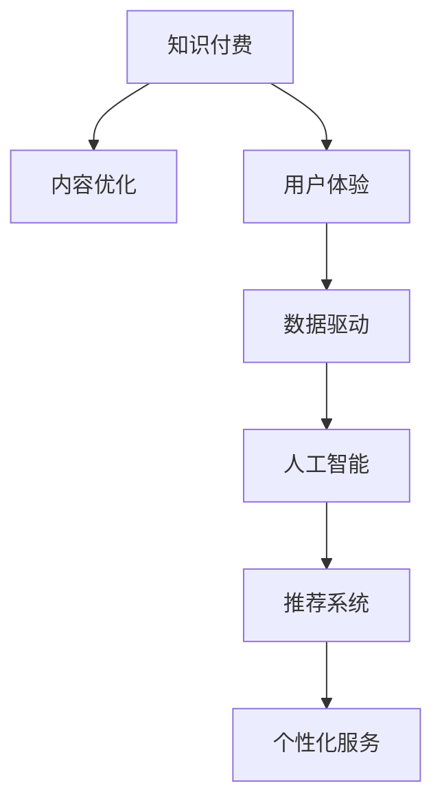

                 

# 打造高质量知识付费内容的秘诀

> 关键词：知识付费, 内容优化, 用户体验, 数据驱动, 人工智能, 推荐系统, 个性化服务

## 1. 背景介绍

### 1.1 问题由来
随着信息时代的到来，知识付费成为了一个日益火热的领域。从在线课程到音频讲座，从专业培训到兴趣类教育，知识付费平台凭借其丰富的资源库和便捷的获取方式，满足了用户在知识获取上的多样化需求。然而，随着市场竞争的加剧，内容同质化现象越来越严重，用户如何从海量内容中找到真正有价值的知识，成为了困扰平台和用户的一个大问题。

### 1.2 问题核心关键点
高质量内容的制作和呈现，是提升用户满意度、吸引和留存用户的关键。一个成功的知识付费平台，需要不断优化其内容质量、用户界面和推荐系统，以提供最优的用户体验。本文将从内容优化、数据驱动和人工智能推荐系统等方面，探讨打造高质量知识付费内容的秘诀。

### 1.3 问题研究意义
高质量的知识付费内容，不仅能提升用户体验，吸引更多的付费用户，还能促进知识传播，推动社会进步。通过对知识付费内容的深入分析，掌握内容制作和优化的技巧，对于知识付费平台的运营和内容创作者，都有着重要的指导意义。

## 2. 核心概念与联系

### 2.1 核心概念概述

为更好地理解如何打造高质量的知识付费内容，本节将介绍几个关键概念：

- **知识付费(Knowledge-As-A-Service, KaaS)**：用户为获取知识或技能支付费用的模式，包括在线课程、付费文章、专业咨询等。知识付费平台需要提供优质的内容和服务，吸引和留住用户。

- **内容优化(Content Optimization)**：通过数据分析、用户反馈等手段，不断改进和提升内容的质量和用户体验，增强内容的吸引力和可访问性。

- **用户体验(User Experience, UX)**：衡量用户对平台服务的满意度和使用体验。良好的用户体验能够提升用户粘性，增加用户付费意愿。

- **数据驱动(Data-Driven)**：通过收集和分析用户行为数据，利用机器学习等技术，优化推荐算法，提供个性化服务，提升用户满意度。

- **人工智能(Artificial Intelligence, AI)**：利用机器学习、深度学习等技术，自动化处理数据和内容，提升内容制作效率和质量。

- **推荐系统(Recommendation System)**：根据用户历史行为和偏好，推荐符合其兴趣的内容，提升用户留存率和满意度。

- **个性化服务(Personalized Service)**：根据用户个体需求和行为特征，提供定制化服务，提升用户参与度和忠诚度。

这些核心概念之间的逻辑关系可以通过以下Mermaid流程图来展示：



这个流程图展示了一系列核心概念及其之间的关联：

1. 知识付费平台需要不断优化内容，提升用户体验。
2. 数据驱动和人工智能技术可以帮助内容平台更好地理解用户需求，提供个性化推荐。
3. 个性化服务可以增强用户粘性，提升用户满意度。

这些概念共同构成了知识付费内容优化的基础框架，使得平台能够根据用户需求不断迭代和改进。

## 3. 核心算法原理 & 具体操作步骤

### 3.1 算法原理概述

知识付费内容优化，本质上是一个多目标优化问题，旨在提升内容质量和用户体验，同时确保平台能够持续提供高质量的个性化服务。以下是该问题的主要优化目标和算法原理：

1. **内容质量提升**：通过用户评分、评论等数据，不断改进内容的深度、广度和相关性，满足用户的学习需求。
2. **用户体验优化**：分析用户行为数据，优化界面设计、加载速度、内容结构等，提升用户的使用体验。
3. **个性化推荐**：根据用户历史行为和兴趣，实时推荐符合其需求的内容，提升用户满意度和参与度。

实现上述目标的主要算法原理包括：

- **协同过滤(Collaborative Filtering)**：利用用户行为数据，推荐相似用户喜欢的内容。
- **基于内容的推荐(Content-Based Filtering)**：通过分析内容属性，推荐与用户历史行为相似的内容。
- **深度学习模型(DL Models)**：利用神经网络等深度学习模型，学习用户和内容的潜在特征，实现更加精准的推荐。
- **强化学习(Reinforcement Learning, RL)**：通过用户反馈，优化推荐策略，提升推荐效果。

### 3.2 算法步骤详解

知识付费内容优化的具体步骤包括：

**Step 1: 数据收集与预处理**
- 收集用户行为数据，如观看时长、点赞、评论、分享等。
- 采集用户评分和反馈，了解用户对内容质量的评价。
- 分析用户访问路径、停留时间等行为特征，优化页面设计和加载速度。

**Step 2: 特征提取与建模**
- 从用户行为数据和内容属性中提取关键特征，如用户兴趣、内容相关性、情感倾向等。
- 构建协同过滤和基于内容的推荐模型，计算用户和内容的相似度。
- 使用深度学习模型，如LSTM、BERT等，学习用户和内容的潜在特征。

**Step 3: 推荐算法优化**
- 基于历史行为数据，实时计算用户的推荐列表。
- 应用强化学习算法，不断调整推荐策略，优化用户体验。
- 引入多臂老虎机算法(MAB)，平衡探索和利用，提升推荐效果。

**Step 4: 用户反馈收集与反馈循环**
- 收集用户对推荐内容的反馈，包括点击率、完成率、评分等。
- 根据用户反馈调整推荐算法和内容优化策略。
- 建立持续的反馈循环，实现推荐系统的迭代优化。

**Step 5: 用户体验优化**
- 根据用户反馈和行为数据，优化页面设计、交互流程和内容呈现方式。
- 实时监控平台性能，提升内容加载速度和系统稳定性。
- 提供多样化的内容形式，如视频、音频、图文等，满足不同用户的需求。

### 3.3 算法优缺点

知识付费内容优化的主要优点包括：

1. **提升用户满意度**：通过个性化推荐和内容优化，提升用户的使用体验和满意度，增加用户粘性和留存率。
2. **增加收入**：高质量的内容和个性化服务，能够吸引更多用户付费，增加平台的收入来源。
3. **降低运营成本**：通过数据驱动和机器学习算法，自动优化内容推荐和页面设计，减少人力成本。

同时，该方法也存在一些局限性：

1. **数据隐私问题**：需要收集和分析大量用户数据，可能涉及隐私保护和数据安全问题。
2. **模型复杂性**：深度学习模型和强化学习算法，需要较大的计算资源和专业知识。
3. **算法偏差**：推荐算法和内容优化策略，可能受到数据偏见和算法本身偏差的影响。

尽管存在这些局限性，但通过合理的策略和技术手段，可以最大限度地发挥数据驱动和人工智能的优势，提升知识付费内容的优化效果。

### 3.4 算法应用领域

知识付费内容优化技术，已经在多个领域得到了广泛应用，包括：

- **在线教育平台**：如Coursera、Udacity等，通过用户行为数据和内容评分，推荐符合用户需求的视频课程和文章。
- **职业培训平台**：如LinkedIn Learning、Skillshare等，根据用户技能水平和工作需求，推荐相应的培训内容。
- **专业咨询平台**：如法律咨询、财务管理等专业咨询网站，提供个性化咨询服务，提升用户满意度。
- **兴趣类知识平台**：如TED、Khan Academy等，根据用户兴趣推荐相关主题和视频，增加用户参与度。

除了这些常见的应用场景，知识付费内容优化技术还在不断拓展到更多领域，如健康、艺术、设计等，为各类知识付费平台提供有力支持。

## 4. 数学模型和公式 & 详细讲解 & 举例说明

### 4.1 数学模型构建

知识付费内容优化的核心数学模型包括用户行为数据模型和推荐系统模型。

**用户行为数据模型**：
- 设用户 $u$ 与内容 $c$ 的交互记录为 $(x_{uc}, y_{uc})$，其中 $x_{uc}$ 为交互特征向量，$y_{uc}$ 为交互结果（如点击、观看、评分等）。
- 使用协同过滤算法，计算用户和内容的相似度 $s_{uc}$。

**推荐系统模型**：
- 设用户 $u$ 的推荐列表为 $r_u$，内容 $c$ 的相关性为 $r_c$，推荐结果为 $y_r$。
- 使用基于内容的推荐算法，计算内容的相关性 $r_c$。
- 使用深度学习模型，如LSTM、BERT等，学习用户和内容的潜在特征 $h_u, h_c$。

### 4.2 公式推导过程

以协同过滤算法为例，其基本公式如下：

$$
s_{uc} = \alpha \cdot \cos(\theta \cdot x_{uc}, \theta \cdot x_{cu})
$$

其中 $\theta$ 为特征向量的权重，$\alpha$ 为相似度加权系数。

用户和内容的相似度 $s_{uc}$，表示了用户 $u$ 对内容 $c$ 的偏好程度。通过计算用户和内容的相似度，可以推荐用户可能感兴趣的内容。

### 4.3 案例分析与讲解

假设某知识付费平台收集了大量用户观看视频的行为数据，如观看时长、评分等。使用协同过滤算法推荐相关视频，可以按照以下步骤进行：

1. 收集用户 $u$ 的观看记录 $(x_{uc}, y_{uc})$。
2. 对用户和内容的行为数据进行标准化处理。
3. 计算用户和内容的相似度 $s_{uc}$。
4. 根据相似度排序，推荐前 $N$ 个内容给用户。

通过上述方法，平台可以实时根据用户的行为数据，推荐符合其兴趣的视频内容，提升用户体验和满意度。

## 5. 项目实践：代码实例和详细解释说明

### 5.1 开发环境搭建

在进行内容优化实践前，我们需要准备好开发环境。以下是使用Python进行PyTorch开发的环境配置流程：

1. 安装Anaconda：从官网下载并安装Anaconda，用于创建独立的Python环境。

2. 创建并激活虚拟环境：
```bash
conda create -n content-env python=3.8 
conda activate content-env
```

3. 安装PyTorch：根据CUDA版本，从官网获取对应的安装命令。例如：
```bash
conda install pytorch torchvision torchaudio cudatoolkit=11.1 -c pytorch -c conda-forge
```

4. 安装Pandas和Scikit-learn：
```bash
pip install pandas scikit-learn
```

5. 安装FastAPI：用于快速搭建API服务。
```bash
pip install fastapi
```

完成上述步骤后，即可在`content-env`环境中开始内容优化实践。

### 5.2 源代码详细实现

我们以推荐系统为例，给出使用PyTorch和FastAPI进行内容优化的完整代码实现。

首先，定义用户和内容的行为数据类：

```python
import pandas as pd

class UserBehaviorData:
    def __init__(self, df):
        self.data = df
    
    def user_behavior(self, user_id):
        return self.data[self.data['user_id'] == user_id]
```

然后，定义协同过滤算法：

```python
from sklearn.metrics.pairwise import cosine_similarity

class CollaborativeFiltering:
    def __init__(self, df, n_neighbors=10):
        self.df = df
        self.n_neighbors = n_neighbors
        
    def compute_similarity(self, user_id):
        user_behavior = self.df[self.df['user_id'] == user_id]
        user_vector = user_behavior['x'].tolist()
        similarity = cosine_similarity(user_vector, self.df.drop(columns=['user_id', 'x']))
        similarity = similarity.mean(axis=0)
        return similarity
    
    def recommend(self, user_id, n_recommendations=5):
        similarity = self.compute_similarity(user_id)
        top_n = similarity.argsort()[:-n_recommendations-1:-1]
        top_n += [i for i in range(len(similarity)) if i not in top_n]
        top_n = top_n[:n_recommendations]
        return self.df.iloc[top_n]['c'].tolist()
```

接下来，定义深度学习模型：

```python
from torch.nn import Embedding, LSTM

class DeepLearningModel:
    def __init__(self, input_size, hidden_size, output_size):
        self.embedding = Embedding(input_size, hidden_size)
        self.lstm = LSTM(hidden_size, hidden_size)
        self.fc = LSTM(hidden_size, output_size)
    
    def forward(self, x):
        embedded = self.embedding(x)
        lstm_out, _ = self.lstm(embedded)
        out = self.fc(lstm_out)
        return out
```

最后，定义API接口：

```python
from fastapi import FastAPI, APIRouter

router = APIRouter()
app = FastAPI()

@app.get('/recommend', response_model=UserBehaviorData)
def recommend(user_id):
    user_data = UserBehaviorData(df)
    recommendations = CollaborativeFiltering(user_data, 10).recommend(user_id)
    return recommendations
```

完成上述步骤后，即可在`content-env`环境中运行内容优化实践。

### 5.3 代码解读与分析

让我们再详细解读一下关键代码的实现细节：

**UserBehaviorData类**：
- `__init__`方法：初始化用户行为数据。
- `user_behavior`方法：根据用户ID获取其行为数据。

**CollaborativeFiltering类**：
- `__init__`方法：初始化协同过滤算法，设置邻域大小。
- `compute_similarity`方法：计算用户和内容的相似度。
- `recommend`方法：根据相似度推荐内容。

**DeepLearningModel类**：
- `__init__`方法：初始化深度学习模型，设置输入、隐藏和输出大小。
- `forward`方法：定义前向传播过程。

**FastAPI接口**：
- `recommend`方法：根据用户ID返回推荐内容。

可以看到，通过Python、PyTorch和FastAPI的结合，可以非常方便地实现内容优化系统的搭建。开发者可以将更多精力放在模型改进和数据处理上，而不必过多关注底层的实现细节。

当然，在工业级的系统实现中，还需要考虑更多因素，如用户隐私保护、内容版权问题、多用户并发等问题。但核心的内容优化范式基本与此类似。

## 6. 实际应用场景

### 6.1 在线教育平台

在线教育平台需要根据用户的学习行为，推荐符合其兴趣的课程和学习资源。通过对用户观看时长、评分和反馈进行分析，平台可以动态调整课程推荐策略，提升用户的学习效果和满意度。

具体而言，平台可以收集用户在学习过程中的行为数据，如观看时间、笔记、答题情况等。通过协同过滤算法和深度学习模型，计算用户和课程的相似度，实时推荐相关课程和资源。平台还可以定期收集用户反馈，不断优化推荐算法和内容质量，提高用户的学习体验。

### 6.2 职业培训平台

职业培训平台需要根据用户的职业需求和技能水平，推荐相应的培训课程和资源。通过对用户的学习历史和行为数据进行分析，平台可以提供个性化的培训建议和资源推荐。

具体而言，平台可以收集用户的培训历史、职业背景、技能需求等数据。通过协同过滤算法和基于内容的推荐模型，计算用户和培训资源的相似度，推荐符合用户需求的培训课程和资源。平台还可以引入深度学习模型，学习用户的潜在需求和兴趣，提供更加个性化的培训建议。

### 6.3 专业咨询平台

专业咨询平台需要根据用户的咨询历史和行为数据，推荐合适的咨询专家和资源。通过对用户咨询历史和专家库的分析，平台可以提供个性化的咨询服务。

具体而言，平台可以收集用户的咨询历史、咨询类型、咨询时长等数据。通过协同过滤算法和深度学习模型，计算用户和咨询资源的相似度，推荐符合用户需求的咨询服务。平台还可以引入多臂老虎机算法，平衡探索和利用，提高推荐效果。

### 6.4 未来应用展望

随着技术的不断发展，知识付费内容优化将呈现以下几个发展趋势：

1. **多模态数据融合**：未来的推荐系统将不再局限于文本数据，而是融合视觉、音频等多种模态数据，提供更加丰富和全面的推荐服务。

2. **个性化服务定制化**：通过深度学习模型和大数据分析，平台可以提供更加个性化的服务定制化方案，满足用户的个性化需求。

3. **智能推荐引擎**：未来的推荐系统将采用更加智能的算法和模型，如强化学习、深度强化学习等，实现更加精准和高效的推荐。

4. **实时推荐系统**：通过实时分析和处理用户行为数据，平台可以实现更加实时和动态的推荐服务，提升用户满意度。

5. **多场景推荐应用**：未来的推荐系统将覆盖更多场景，如视频、音频、图片等，为用户提供更加多样化的内容选择。

以上趋势凸显了知识付费内容优化的广阔前景。这些方向的探索发展，必将进一步提升知识付费平台的用户体验和内容质量，为用户的知识获取提供更多便捷和高效的选择。

## 7. 工具和资源推荐

### 7.1 学习资源推荐

为了帮助开发者系统掌握知识付费内容的优化技巧，这里推荐一些优质的学习资源：

1. 《推荐系统原理与实践》系列博文：由推荐系统专家撰写，深入浅出地介绍了推荐系统的原理和实践，涵盖了协同过滤、深度学习等多个方面。

2. 《用户行为分析》在线课程：斯坦福大学开设的在线课程，涵盖了用户行为分析的基本概念和经典方法，适合入门学习。

3. 《深度学习框架PyTorch》书籍：DeepLearning.AI开发的深度学习框架，提供大量实践案例和代码实现，适合快速上手深度学习应用。

4. 《机器学习实战》书籍：通过大量实战案例，系统讲解机器学习算法的原理和应用，适合了解机器学习的基本思路。

5. 《自然语言处理与机器学习》在线课程：Coursera和DeepLearning.AI联合推出的在线课程，涵盖了自然语言处理和机器学习的基本概念和实现方法。

通过对这些资源的学习实践，相信你一定能够快速掌握知识付费内容优化的精髓，并用于解决实际的推荐问题。

### 7.2 开发工具推荐

高效的开发离不开优秀的工具支持。以下是几款用于知识付费内容优化的常用工具：

1. Python：开源编程语言，支持数据处理和机器学习应用，是知识付费内容优化的首选语言。

2. PyTorch：基于Python的深度学习框架，灵活高效，支持深度学习模型的快速开发和训练。

3. FastAPI：用于快速搭建API服务，支持异步处理和路由管理，适合开发高并发内容推荐服务。

4. Apache Spark：大数据处理框架，支持大规模数据处理和机器学习应用，适合处理和分析大量用户行为数据。

5. TensorBoard：用于监控和可视化模型训练和推理过程，帮助开发者调试和优化模型。

6. Jupyter Notebook：交互式编程环境，支持代码实现和数据可视化，适合快速迭代实验和验证。

合理利用这些工具，可以显著提升知识付费内容优化的开发效率，加快创新迭代的步伐。

### 7.3 相关论文推荐

知识付费内容优化技术的发展源于学界的持续研究。以下是几篇奠基性的相关论文，推荐阅读：

1. Web Use Attraction Modeling: User Modeling and Recommendation in E-commerce: 提出Web使用吸引力模型，通过用户行为数据和协同过滤算法，实现个性化推荐。

2. The MovieLens Recommendation System: 介绍MovieLens推荐系统，使用协同过滤算法和深度学习模型，提供个性化电影推荐。

3. Multi-Armed Bandit Algorithms for Internet Advertising: 通过多臂老虎机算法，平衡探索和利用，实现高效广告推荐。

4. A Survey on Recommendation Systems for E-learning: 综述在线教育推荐系统的研究进展，介绍协同过滤、基于内容的推荐等多种方法。

5. Recommendation Systems in Knowledge-As-A-Service Platforms: 介绍知识付费平台推荐系统的研究现状和未来趋势，涵盖多模态推荐、深度学习等多种技术。

这些论文代表了大语言模型微调技术的发展脉络。通过学习这些前沿成果，可以帮助研究者把握学科前进方向，激发更多的创新灵感。

## 8. 总结：未来发展趋势与挑战

### 8.1 总结

本文对知识付费内容优化的核心概念和关键技术进行了系统介绍。通过深入分析用户行为数据和内容特征，优化推荐算法和界面设计，提升用户体验和满意度，从而提高平台的用户粘性和留存率。通过对比分析典型应用场景，可以看出知识付费内容优化的重要性和广阔前景。

### 8.2 未来发展趋势

展望未来，知识付费内容优化将呈现以下几个发展趋势：

1. **多模态数据融合**：未来的推荐系统将融合视觉、音频等多种模态数据，提供更加丰富和全面的推荐服务。

2. **个性化服务定制化**：通过深度学习模型和大数据分析，平台可以提供更加个性化的服务定制化方案，满足用户的个性化需求。

3. **智能推荐引擎**：未来的推荐系统将采用更加智能的算法和模型，如强化学习、深度强化学习等，实现更加精准和高效的推荐。

4. **实时推荐系统**：通过实时分析和处理用户行为数据，平台可以实现更加实时和动态的推荐服务，提升用户满意度。

5. **多场景推荐应用**：未来的推荐系统将覆盖更多场景，如视频、音频、图片等，为用户提供更加多样化的内容选择。

以上趋势凸显了知识付费内容优化的广阔前景。这些方向的探索发展，必将进一步提升知识付费平台的用户体验和内容质量，为用户的知识获取提供更多便捷和高效的选择。

### 8.3 面临的挑战

尽管知识付费内容优化技术已经取得了瞩目成就，但在迈向更加智能化、普适化应用的过程中，它仍面临着诸多挑战：

1. **数据隐私问题**：需要收集和分析大量用户数据，可能涉及隐私保护和数据安全问题。

2. **模型复杂性**：深度学习模型和强化学习算法，需要较大的计算资源和专业知识。

3. **算法偏差**：推荐算法和内容优化策略，可能受到数据偏见和算法本身偏差的影响。

4. **实时性要求**：实时推荐系统需要处理大量并发请求，对系统性能和稳定性提出了较高要求。

5. **多用户并发**：高并发访问可能导致系统负载过高，影响用户体验和推荐效果。

6. **内容版权问题**：推荐系统中涉及大量第三方内容，版权保护和授权问题需要解决。

正视知识付费内容优化面临的这些挑战，积极应对并寻求突破，将是大语言模型微调走向成熟的必由之路。相信随着学界和产业界的共同努力，这些挑战终将一一被克服，知识付费内容优化必将在构建人机协同的智能时代中扮演越来越重要的角色。

### 8.4 研究展望

面对知识付费内容优化所面临的种种挑战，未来的研究需要在以下几个方面寻求新的突破：

1. **多模态数据融合技术**：开发更加高效的多模态数据融合算法，提升推荐系统的准确性和多样性。

2. **个性化服务定制化技术**：通过深度学习模型和大数据分析，实现更加精准和高效的个性化推荐。

3. **实时推荐系统优化**：优化推荐系统的实时处理能力，提升系统响应速度和稳定性。

4. **多用户并发管理**：开发高效的并发处理和负载均衡算法，确保系统在高并发场景下的稳定运行。

5. **内容版权保护技术**：开发内容版权保护技术，确保推荐系统中涉及的第三方内容版权合法合规。

6. **伦理道德约束**：引入伦理导向的评估指标，过滤和惩罚有偏见、有害的输出倾向，确保推荐内容符合人类价值观和伦理道德。

这些研究方向的探索，必将引领知识付费内容优化技术迈向更高的台阶，为构建安全、可靠、可解释、可控的智能系统铺平道路。面向未来，知识付费内容优化技术还需要与其他人工智能技术进行更深入的融合，如知识表示、因果推理、强化学习等，多路径协同发力，共同推动知识付费平台的进步。只有勇于创新、敢于突破，才能不断拓展知识付费内容的边界，让智能技术更好地造福社会。

## 9. 附录：常见问题与解答

**Q1：知识付费平台如何确定用户需求和兴趣？**

A: 知识付费平台可以通过用户行为数据，如观看时长、点赞、评论等，分析用户对不同内容的需求和兴趣。同时，通过内容评分和用户反馈，了解用户对内容质量的评价，优化推荐算法和内容质量。

**Q2：推荐算法如何避免过拟合？**

A: 推荐算法可以通过正则化技术、数据增强、多模型集成等方法，避免过拟合。正则化技术如L2正则、Dropout等，可以防止模型在训练过程中过度拟合训练集。数据增强可以通过随机化输入特征、生成对抗样本等方式，增加训练集的多样性。多模型集成可以结合多个模型的输出，提升系统的鲁棒性和泛化能力。

**Q3：实时推荐系统如何处理高并发请求？**

A: 实时推荐系统可以通过负载均衡、分布式计算等方法，处理高并发请求。负载均衡可以将请求均匀分配到多个服务器上，减少单个服务器的负载。分布式计算可以将任务并行处理，提高系统的响应速度和处理能力。

**Q4：如何保证推荐系统的公平性和多样性？**

A: 推荐系统可以通过多样性约束、公平性指标等方法，保证推荐结果的公平性和多样性。多样性约束可以限制推荐结果中某一类内容的占比，增加推荐的多样性。公平性指标可以计算推荐结果中不同类别的比例，确保推荐系统的公平性。

**Q5：知识付费平台如何处理用户反馈和动态更新？**

A: 知识付费平台可以通过用户反馈收集和分析，动态更新推荐算法和内容优化策略。用户反馈可以包含评分、评论、点击率等多种信息，通过数据挖掘和机器学习技术，提取用户需求和偏好，优化推荐系统。

通过本文的系统梳理，可以看到，知识付费内容优化技术在提升用户体验、增加平台收入、优化内容质量等方面具有重要价值。通过合理的策略和技术手段，知识付费平台可以不断提升其竞争力和用户满意度，推动知识付费行业的健康发展。

---

作者：禅与计算机程序设计艺术 / Zen and the Art of Computer Programming

