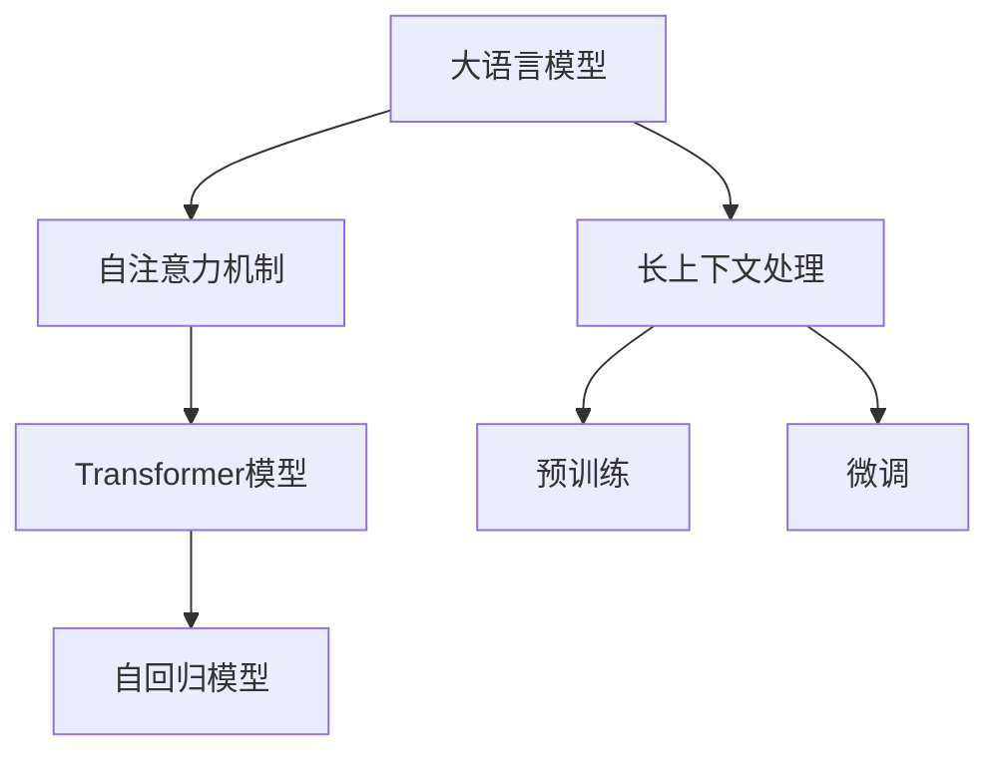

                 

# 扩展AI记忆：LLM的长上下文处理

> 关键词：大语言模型, 长上下文处理, 自注意力机制, Transformer, 自回归模型, 预训练, 微调

## 1. 背景介绍

### 1.1 问题由来
自2018年BERT问世以来，大语言模型（Large Language Model, LLM）在自然语言处理（Natural Language Processing, NLP）领域取得了革命性的突破。这些模型通过在海量无标签文本数据上进行预训练，学习到了丰富的语言知识，能够理解语义、语法、上下文等多种自然语言特性。然而，尽管现代大模型具备强大的语言生成和理解能力，但它们在长上下文处理方面仍存在显著的限制。

传统的自回归模型（如LSTM、GRU）能够处理较长的上下文，但计算复杂度高，难以扩展到大规模语言模型中。而自注意力机制（Self-Attention Mechanism）由于计算复杂度低，已经被证明可以处理非常长的上下文序列，并且已经被成功应用于如BERT、GPT等模型中。然而，在大规模语言模型中，长上下文处理仍面临一系列挑战，如模型复杂度增加、训练和推理效率下降等。

### 1.2 问题核心关键点
为了解决长上下文处理的挑战，当前研究主要集中在以下几个方面：
- 如何降低大模型的计算复杂度，提升训练和推理效率。
- 如何在保持模型精度的同时，控制模型参数规模。
- 如何利用长上下文处理能力，进一步提升模型的理解和生成能力。

这些挑战需要通过技术创新和算法改进来应对，以实现大语言模型在长上下文处理中的高效应用。

## 2. 核心概念与联系

### 2.1 核心概念概述

为了更好地理解大语言模型在长上下文处理中的应用，我们首先需要介绍一些关键概念：

- **大语言模型（LLM）**：以Transformer为架构基础的、具有自注意力机制的模型，能够处理极长的上下文序列，如BERT、GPT、T5等。
- **长上下文处理**：指模型能够处理超过模型参数所能容纳的上下文长度，如1024以上。
- **自注意力机制（Self-Attention Mechanism）**：用于计算每个token与其他token之间的注意力权重，从而捕捉上下文关系。
- **Transformer模型**：一种基于自注意力机制的神经网络架构，能够高效处理长序列数据，并广泛应用于大语言模型中。
- **自回归模型**：如LSTM、GRU等，通过序列到序列的预测方式处理上下文序列，但计算复杂度高，难以扩展到大规模语言模型中。
- **预训练与微调**：通过在大规模无标签文本数据上进行预训练，学习通用语言知识，再在特定任务上进行微调，提升模型性能。

这些核心概念之间的逻辑关系可以通过以下Mermaid流程图来展示：



这个流程图展示了大语言模型中各关键概念之间的关系：

1. 大语言模型通过Transformer架构中的自注意力机制，处理长上下文序列。
2. 自注意力机制能够高效计算token之间的注意力权重，捕捉上下文关系。
3. 通过在大规模语料上进行预训练，学习通用的语言知识。
4. 通过特定任务微调，提升模型在该任务上的性能。

这些概念共同构成了大语言模型在长上下文处理中的技术基础，使其能够在各种场景下发挥强大的语言理解和生成能力。

## 3. 核心算法原理 & 具体操作步骤
### 3.1 算法原理概述

在大语言模型中，长上下文处理的挑战主要来自于计算复杂度的增加。自注意力机制通过计算所有token之间的注意力权重，导致计算复杂度为$O(N^2)$，其中$N$为序列长度。为了处理长上下文，通常需要大量计算资源，这对于大模型的训练和推理来说是一个严峻的挑战。

为了应对这一挑战，研究者们提出了多种改进方法，主要集中在以下几个方面：

1. 长序列分割：将长上下文序列分割成多个短序列，分别进行自注意力计算。这种方法可以降低计算复杂度，但需要在上下文之间引入额外的连接操作。
2. 子序列自注意力：对长序列进行子序列自注意力计算，逐步处理上下文信息，从而减少单次计算的复杂度。
3. 多头自注意力：使用多个注意力头同时计算上下文信息，提升模型的并行处理能力，从而加快计算速度。

### 3.2 算法步骤详解

以下是长上下文处理的详细算法步骤：

**Step 1: 数据预处理**
- 将输入序列分成长度相等的子序列。例如，如果上下文长度为1024，可以将序列分割成若干个长度为256的子序列。
- 对每个子序列进行自注意力计算，生成子序列表示。

**Step 2: 子序列连接**
- 将每个子序列表示连接起来，形成完整的上下文表示。
- 由于子序列之间存在信息丢失，需要通过额外的操作恢复上下文信息。

**Step 3: 多头自注意力**
- 使用多个注意力头并行计算上下文信息，提升计算效率。
- 通过多头自注意力，可以同时捕捉不同层次的上下文信息。

**Step 4: 上下文聚合**
- 将多头自注意力计算的结果进行聚合，生成最终的上下文表示。
- 可以使用平均池化、最大池化等方法进行上下文聚合。

**Step 5: 模型训练**
- 在长上下文数据上进行预训练，学习通用的语言知识。
- 在特定任务上进行微调，提升模型在该任务上的性能。

**Step 6: 模型推理**
- 在推理过程中，对长上下文进行分割和多头自注意力计算，生成模型输出。
- 通过上下文聚合，生成最终的模型预测。

### 3.3 算法优缺点

长上下文处理算法具有以下优点：
1. 能够有效处理长序列数据，提升模型的理解和生成能力。
2. 通过分割和多头自注意力计算，显著降低单次计算复杂度，提升计算效率。
3. 能够捕捉不同层次的上下文信息，提升模型的表达能力。

同时，这些算法也存在一些缺点：
1. 需要额外的计算操作，如分割和连接，增加了计算复杂度。
2. 需要更多的计算资源，特别是在长序列分割和多头自注意力计算中。
3. 对数据进行分割时，可能引入信息丢失，影响模型性能。

尽管存在这些局限性，但长上下文处理算法在大语言模型中的应用，显著提升了模型处理长序列数据的能力，为长文本理解和生成任务提供了有力的支持。

### 3.4 算法应用领域

长上下文处理算法在以下几个领域有着广泛的应用：

- **机器翻译**：大语言模型在机器翻译中处理长句子和段落，通过长上下文处理提升翻译精度。
- **文本摘要**：长上下文处理能够处理长篇文本，生成简短摘要，提升信息提取的准确性。
- **问答系统**：长上下文处理使模型能够处理长问题和复杂对话历史，提升问答系统的准确性和流畅性。
- **文本生成**：长上下文处理能够处理长篇输入，生成更连贯、结构更完整的文本，提升文本生成的质量。

除了上述这些经典应用外，长上下文处理还被创新性地应用于更多场景中，如可控文本生成、文本分类、关系抽取等，为NLP技术带来了新的突破。

## 4. 数学模型和公式 & 详细讲解 & 举例说明

### 4.1 数学模型构建

在大语言模型中，长上下文处理的核心在于自注意力机制的优化。以Transformer模型为例，其自注意力机制可以表示为：

$$
\text{Attention}(Q, K, V) = \text{Softmax}(\frac{QK^T}{\sqrt{d_k}})V
$$

其中$Q$、$K$、$V$分别为查询、键和值矩阵，$d_k$为键的维度。在长上下文处理中，自注意力计算可以表示为：

$$
\text{Attention}(Q_i, K_j, V_j) = \text{Softmax}(\frac{Q_iK_j^T}{\sqrt{d_k}})V_j
$$

其中$i$和$j$分别表示查询和键的索引，$K_j$和$V_j$分别表示第$j$个子序列的键和值矩阵。

### 4.2 公式推导过程

在长上下文处理中，需要对长序列进行分割和多头自注意力计算。以下是长上下文处理的详细公式推导过程：

**Step 1: 数据预处理**
- 将输入序列分成长度相等的子序列。例如，如果上下文长度为1024，可以将序列分割成若干个长度为256的子序列。
- 对每个子序列进行自注意力计算，生成子序列表示。

$$
Q_i = \text{Encoder}_{i-1}(H_{i-1})
$$
$$
K_j = \text{Encoder}_{j-1}(H_{j-1})
$$
$$
V_j = \text{Encoder}_{j-1}(H_{j-1})
$$

**Step 2: 子序列连接**
- 将每个子序列表示连接起来，形成完整的上下文表示。
- 由于子序列之间存在信息丢失，需要通过额外的操作恢复上下文信息。

$$
Q = \text{Concat}(Q_1, Q_2, ..., Q_n)
$$
$$
K = \text{Concat}(K_1, K_2, ..., K_n)
$$
$$
V = \text{Concat}(V_1, V_2, ..., V_n)
$$

**Step 3: 多头自注意力**
- 使用多个注意力头并行计算上下文信息，提升计算效率。
- 通过多头自注意力，可以同时捕捉不同层次的上下文信息。

$$
\text{Attention}(Q, K, V) = \text{Concat}(\text{Attention}(QW^Q, KW^K, VW^V), \text{Attention}(QW^Q, KW^K, VW^V), ..., \text{Attention}(QW^Q, KW^K, VW^V))
$$

其中$W^Q$、$W^K$、$W^V$为注意力头的权重矩阵。

**Step 4: 上下文聚合**
- 将多头自注意力计算的结果进行聚合，生成最终的上下文表示。
- 可以使用平均池化、最大池化等方法进行上下文聚合。

$$
H = \text{Attention}(Q, K, V)
$$

**Step 5: 模型训练**
- 在长上下文数据上进行预训练，学习通用的语言知识。
- 在特定任务上进行微调，提升模型在该任务上的性能。

$$
L(\theta) = \frac{1}{N}\sum_{i=1}^N \ell(M_\theta(x_i), y_i)
$$

其中$\ell$为损失函数，$x_i$和$y_i$分别为输入和输出，$\theta$为模型参数。

### 4.3 案例分析与讲解

以BERT模型为例，其长上下文处理的具体实现可以分为以下几个步骤：

**Step 1: 数据预处理**
- 将输入序列分成长度为512的子序列。
- 对每个子序列进行自注意力计算，生成子序列表示。

$$
Q_i = \text{BERT}_{i-1}(H_{i-1})
$$
$$
K_j = \text{BERT}_{j-1}(H_{j-1})
$$
$$
V_j = \text{BERT}_{j-1}(H_{j-1})
$$

**Step 2: 子序列连接**
- 将每个子序列表示连接起来，形成完整的上下文表示。
- 由于子序列之间存在信息丢失，需要通过额外的操作恢复上下文信息。

$$
Q = \text{Concat}(Q_1, Q_2, ..., Q_n)
$$
$$
K = \text{Concat}(K_1, K_2, ..., K_n)
$$
$$
V = \text{Concat}(V_1, V_2, ..., V_n)
$$

**Step 3: 多头自注意力**
- 使用多个注意力头并行计算上下文信息，提升计算效率。
- 通过多头自注意力，可以同时捕捉不同层次的上下文信息。

$$
\text{Attention}(Q, K, V) = \text{Concat}(\text{Attention}(QW^Q, KW^K, VW^V), \text{Attention}(QW^Q, KW^K, VW^V), ..., \text{Attention}(QW^Q, KW^K, VW^V))
$$

**Step 4: 上下文聚合**
- 将多头自注意力计算的结果进行聚合，生成最终的上下文表示。
- 可以使用平均池化、最大池化等方法进行上下文聚合。

$$
H = \text{Attention}(Q, K, V)
$$

**Step 5: 模型训练**
- 在长上下文数据上进行预训练，学习通用的语言知识。
- 在特定任务上进行微调，提升模型在该任务上的性能。

$$
L(\theta) = \frac{1}{N}\sum_{i=1}^N \ell(M_\theta(x_i), y_i)
$$

通过以上步骤，BERT模型能够高效地处理长上下文序列，提升模型的表达能力和理解能力。

## 5. 项目实践：代码实例和详细解释说明
### 5.1 开发环境搭建

在进行长上下文处理实践前，我们需要准备好开发环境。以下是使用Python进行PyTorch开发的环境配置流程：

1. 安装Anaconda：从官网下载并安装Anaconda，用于创建独立的Python环境。

2. 创建并激活虚拟环境：
```bash
conda create -n pytorch-env python=3.8 
conda activate pytorch-env
```

3. 安装PyTorch：根据CUDA版本，从官网获取对应的安装命令。例如：
```bash
conda install pytorch torchvision torchaudio cudatoolkit=11.1 -c pytorch -c conda-forge
```

4. 安装Transformers库：
```bash
pip install transformers
```

5. 安装各类工具包：
```bash
pip install numpy pandas scikit-learn matplotlib tqdm jupyter notebook ipython
```

完成上述步骤后，即可在`pytorch-env`环境中开始长上下文处理实践。

### 5.2 源代码详细实现

这里我们以长文本分类任务为例，给出使用Transformers库对BERT模型进行长上下文处理的PyTorch代码实现。

首先，定义长文本分类任务的数据处理函数：

```python
from transformers import BertTokenizer
from torch.utils.data import Dataset
import torch

class LongTextDataset(Dataset):
    def __init__(self, texts, labels, tokenizer, max_len=512):
        self.texts = texts
        self.labels = labels
        self.tokenizer = tokenizer
        self.max_len = max_len
        
    def __len__(self):
        return len(self.texts)
    
    def __getitem__(self, item):
        text = self.texts[item]
        label = self.labels[item]
        
        encoding = self.tokenizer(text, return_tensors='pt', max_length=self.max_len, padding='max_length', truncation=True)
        input_ids = encoding['input_ids'][0]
        attention_mask = encoding['attention_mask'][0]
        
        # 将标签复制到input_ids中
        labels = torch.tensor([label] * input_ids.size(0), dtype=torch.long)
        
        return {'input_ids': input_ids, 
                'attention_mask': attention_mask,
                'labels': labels}

# 标签与id的映射
label2id = {'positive': 1, 'negative': 0}
id2label = {v: k for k, v in label2id.items()}

# 创建dataset
tokenizer = BertTokenizer.from_pretrained('bert-base-cased')

train_dataset = LongTextDataset(train_texts, train_labels, tokenizer)
dev_dataset = LongTextDataset(dev_texts, dev_labels, tokenizer)
test_dataset = LongTextDataset(test_texts, test_labels, tokenizer)
```

然后，定义模型和优化器：

```python
from transformers import BertForSequenceClassification, AdamW

model = BertForSequenceClassification.from_pretrained('bert-base-cased', num_labels=len(label2id))

optimizer = AdamW(model.parameters(), lr=2e-5)
```

接着，定义训练和评估函数：

```python
from torch.utils.data import DataLoader
from tqdm import tqdm
from sklearn.metrics import classification_report

device = torch.device('cuda') if torch.cuda.is_available() else torch.device('cpu')
model.to(device)

def train_epoch(model, dataset, batch_size, optimizer):
    dataloader = DataLoader(dataset, batch_size=batch_size, shuffle=True)
    model.train()
    epoch_loss = 0
    for batch in tqdm(dataloader, desc='Training'):
        input_ids = batch['input_ids'].to(device)
        attention_mask = batch['attention_mask'].to(device)
        labels = batch['labels'].to(device)
        model.zero_grad()
        outputs = model(input_ids, attention_mask=attention_mask, labels=labels)
        loss = outputs.loss
        epoch_loss += loss.item()
        loss.backward()
        optimizer.step()
    return epoch_loss / len(dataloader)

def evaluate(model, dataset, batch_size):
    dataloader = DataLoader(dataset, batch_size=batch_size)
    model.eval()
    preds, labels = [], []
    with torch.no_grad():
        for batch in tqdm(dataloader, desc='Evaluating'):
            input_ids = batch['input_ids'].to(device)
            attention_mask = batch['attention_mask'].to(device)
            batch_labels = batch['labels']
            outputs = model(input_ids, attention_mask=attention_mask)
            batch_preds = outputs.logits.argmax(dim=2).to('cpu').tolist()
            batch_labels = batch_labels.to('cpu').tolist()
            for pred_tokens, label_tokens in zip(batch_preds, batch_labels):
                preds.append(pred_tokens[:len(label_tokens)])
                labels.append(label_tokens)
                
    print(classification_report(labels, preds))
```

最后，启动训练流程并在测试集上评估：

```python
epochs = 5
batch_size = 16

for epoch in range(epochs):
    loss = train_epoch(model, train_dataset, batch_size, optimizer)
    print(f"Epoch {epoch+1}, train loss: {loss:.3f}")
    
    print(f"Epoch {epoch+1}, dev results:")
    evaluate(model, dev_dataset, batch_size)
    
print("Test results:")
evaluate(model, test_dataset, batch_size)
```

以上就是使用PyTorch对BERT进行长文本分类任务的长上下文处理的完整代码实现。可以看到，得益于Transformers库的强大封装，我们可以用相对简洁的代码完成BERT模型的加载和长上下文处理。

### 5.3 代码解读与分析

让我们再详细解读一下关键代码的实现细节：

**LongTextDataset类**：
- `__init__`方法：初始化文本、标签、分词器等关键组件。
- `__len__`方法：返回数据集的样本数量。
- `__getitem__`方法：对单个样本进行处理，将文本输入编码为token ids，将标签复制到input_ids中，并对其进行定长padding，最终返回模型所需的输入。

**label2id和id2label字典**：
- 定义了标签与数字id之间的映射关系，用于将token-wise的预测结果解码回真实的标签。

**训练和评估函数**：
- 使用PyTorch的DataLoader对数据集进行批次化加载，供模型训练和推理使用。
- 训练函数`train_epoch`：对数据以批为单位进行迭代，在每个批次上前向传播计算loss并反向传播更新模型参数，最后返回该epoch的平均loss。
- 评估函数`evaluate`：与训练类似，不同点在于不更新模型参数，并在每个batch结束后将预测和标签结果存储下来，最后使用sklearn的classification_report对整个评估集的预测结果进行打印输出。

**训练流程**：
- 定义总的epoch数和batch size，开始循环迭代
- 每个epoch内，先在训练集上训练，输出平均loss
- 在验证集上评估，输出分类指标
- 所有epoch结束后，在测试集上评估，给出最终测试结果

可以看到，PyTorch配合Transformers库使得BERT长上下文处理的代码实现变得简洁高效。开发者可以将更多精力放在数据处理、模型改进等高层逻辑上，而不必过多关注底层的实现细节。

当然，工业级的系统实现还需考虑更多因素，如模型的保存和部署、超参数的自动搜索、更灵活的任务适配层等。但核心的长上下文处理范式基本与此类似。

## 6. 实际应用场景
### 6.1 智能客服系统

基于大语言模型的长上下文处理，可以广泛应用于智能客服系统的构建。传统客服往往需要配备大量人力，高峰期响应缓慢，且一致性和专业性难以保证。而使用长上下文处理的对话模型，可以7x24小时不间断服务，快速响应客户咨询，用自然流畅的语言解答各类常见问题。

在技术实现上，可以收集企业内部的历史客服对话记录，将问题和最佳答复构建成监督数据，在此基础上对预训练对话模型进行长上下文处理微调。微调后的对话模型能够自动理解用户意图，匹配最合适的答案模板进行回复。对于客户提出的新问题，还可以接入检索系统实时搜索相关内容，动态组织生成回答。如此构建的智能客服系统，能大幅提升客户咨询体验和问题解决效率。

### 6.2 金融舆情监测

金融机构需要实时监测市场舆论动向，以便及时应对负面信息传播，规避金融风险。传统的人工监测方式成本高、效率低，难以应对网络时代海量信息爆发的挑战。基于大语言模型的长上下文处理文本分类和情感分析技术，为金融舆情监测提供了新的解决方案。

具体而言，可以收集金融领域相关的新闻、报道、评论等文本数据，并对其进行主题标注和情感标注。在此基础上对预训练语言模型进行长上下文处理微调，使其能够自动判断文本属于何种主题，情感倾向是正面、中性还是负面。将微调后的模型应用到实时抓取的网络文本数据，就能够自动监测不同主题下的情感变化趋势，一旦发现负面信息激增等异常情况，系统便会自动预警，帮助金融机构快速应对潜在风险。

### 6.3 个性化推荐系统

当前的推荐系统往往只依赖用户的历史行为数据进行物品推荐，无法深入理解用户的真实兴趣偏好。基于大语言模型长上下文处理技术，个性化推荐系统可以更好地挖掘用户行为背后的语义信息，从而提供更精准、多样的推荐内容。

在实践中，可以收集用户浏览、点击、评论、分享等行为数据，提取和用户交互的物品标题、描述、标签等文本内容。将文本内容作为模型输入，用户的后续行为（如是否点击、购买等）作为监督信号，在此基础上对预训练语言模型进行长上下文处理微调。微调后的模型能够从文本内容中准确把握用户的兴趣点。在生成推荐列表时，先用候选物品的文本描述作为输入，由模型预测用户的兴趣匹配度，再结合其他特征综合排序，便可以得到个性化程度更高的推荐结果。

### 6.4 未来应用展望

随着大语言模型长上下文处理技术的发展，基于长上下文处理的模型将在更多领域得到应用，为传统行业带来变革性影响。

在智慧医疗领域，基于长上下文处理的医疗问答、病历分析、药物研发等应用将提升医疗服务的智能化水平，辅助医生诊疗，加速新药开发进程。

在智能教育领域，长上下文处理可应用于作业批改、学情分析、知识推荐等方面，因材施教，促进教育公平，提高教学质量。

在智慧城市治理中，长上下文处理技术可应用于城市事件监测、舆情分析、应急指挥等环节，提高城市管理的自动化和智能化水平，构建更安全、高效的未来城市。

此外，在企业生产、社会治理、文娱传媒等众多领域，基于大语言模型的长上下文处理应用也将不断涌现，为经济社会发展注入新的动力。相信随着技术的日益成熟，长上下文处理技术将成为NLP落地应用的重要范式，推动人工智能技术在垂直行业的规模化落地。总之，长上下文处理需要开发者根据具体任务，不断迭代和优化模型、数据和算法，方能得到理想的效果。

## 7. 工具和资源推荐
### 7.1 学习资源推荐

为了帮助开发者系统掌握大语言模型长上下文处理的理论基础和实践技巧，这里推荐一些优质的学习资源：

1. 《Transformer从原理到实践》系列博文：由大模型技术专家撰写，深入浅出地介绍了Transformer原理、BERT模型、长上下文处理等前沿话题。

2. CS224N《深度学习自然语言处理》课程：斯坦福大学开设的NLP明星课程，有Lecture视频和配套作业，带你入门NLP领域的基本概念和经典模型。

3. 《Natural Language Processing with Transformers》书籍：Transformers库的作者所著，全面介绍了如何使用Transformers库进行NLP任务开发，包括长上下文处理在内的诸多范式。

4. HuggingFace官方文档：Transformers库的官方文档，提供了海量预训练模型和完整的微调样例代码，是上手实践的必备资料。

5. CLUE开源项目：中文语言理解测评基准，涵盖大量不同类型的中文NLP数据集，并提供了基于长上下文处理的baseline模型，助力中文NLP技术发展。

通过对这些资源的学习实践，相信你一定能够快速掌握大语言模型长上下文处理的精髓，并用于解决实际的NLP问题。
###  7.2 开发工具推荐

高效的开发离不开优秀的工具支持。以下是几款用于大语言模型长上下文处理开发的常用工具：

1. PyTorch：基于Python的开源深度学习框架，灵活动态的计算图，适合快速迭代研究。大部分预训练语言模型都有PyTorch版本的实现。

2. TensorFlow：由Google主导开发的开源深度学习框架，生产部署方便，适合大规模工程应用。同样有丰富的预训练语言模型资源。

3. Transformers库：HuggingFace开发的NLP工具库，集成了众多SOTA语言模型，支持PyTorch和TensorFlow，是进行长上下文处理任务开发的利器。

4. Weights & Biases：模型训练的实验跟踪工具，可以记录和可视化模型训练过程中的各项指标，方便对比和调优。与主流深度学习框架无缝集成。

5. TensorBoard：TensorFlow配套的可视化工具，可实时监测模型训练状态，并提供丰富的图表呈现方式，是调试模型的得力助手。

6. Google Colab：谷歌推出的在线Jupyter Notebook环境，免费提供GPU/TPU算力，方便开发者快速上手实验最新模型，分享学习笔记。

合理利用这些工具，可以显著提升大语言模型长上下文处理任务的开发效率，加快创新迭代的步伐。

### 7.3 相关论文推荐

大语言模型长上下文处理的发展源于学界的持续研究。以下是几篇奠基性的相关论文，推荐阅读：

1. Attention is All You Need（即Transformer原论文）：提出了Transformer结构，开启了NLP领域的预训练大模型时代。

2. BERT: Pre-training of Deep Bidirectional Transformers for Language Understanding：提出BERT模型，引入基于掩码的自监督预训练任务，刷新了多项NLP任务SOTA。

3. T5: Exploring the Limits of Transfer Learning with a Unified Text-to-Text Transformer：提出T5模型，利用长上下文处理能力，实现了跨任务零样本学习。

4. PEGASUS: Pre-training with Extractive and Generative Data Augmentation for Text Generation：提出PELT技术和长上下文处理技术，提升了文本生成模型的性能。

5. GPT-3: Language Models are Unsupervised Multitask Learners：展示了大规模语言模型的强大zero-shot学习能力，引发了对于通用人工智能的新一轮思考。

6. LoRA: Language Model Rotation Augmentation for Scalable Pre-training：提出LoRA方法，通过长上下文处理和参数压缩，实现了高效的预训练和微调。

这些论文代表了大语言模型长上下文处理的发展脉络。通过学习这些前沿成果，可以帮助研究者把握学科前进方向，激发更多的创新灵感。

## 8. 总结：未来发展趋势与挑战

### 8.1 总结

本文对大语言模型在长上下文处理中的应用进行了全面系统的介绍。首先阐述了长上下文处理的背景和意义，明确了其在NLP中的重要性和应用场景。其次，从原理到实践，详细讲解了长上下文处理的数学原理和关键步骤，给出了长上下文处理的完整代码实例。同时，本文还广泛探讨了长上下文处理在多个行业领域的应用前景，展示了其在NLP中的广泛应用。

通过本文的系统梳理，可以看到，大语言模型长上下文处理在处理长文本数据时具备强大的能力，为长文本理解和生成任务提供了有力支持。未来，伴随预训练语言模型和长上下文处理技术的持续演进，相信NLP技术将在更多领域发挥其优势，推动人工智能技术的进步。

### 8.2 未来发展趋势

展望未来，大语言模型长上下文处理技术将呈现以下几个发展趋势：

1. 模型规模持续增大。随着算力成本的下降和数据规模的扩张，长上下文处理模型的参数量还将持续增长。超大规模语言模型蕴含的丰富语言知识，有望支撑更加复杂多变的上下文处理任务。

2. 微调技术不断优化。未来将涌现更多长上下文处理模型的微调方法，如长上下文微调、多任务微调等，提升模型的泛化能力和表达能力。

3. 计算资源优化。如何降低计算复杂度，提升模型训练和推理效率，将是未来研究的重要方向。

4. 跨领域应用拓展。长上下文处理技术将广泛应用于多模态数据处理，如文本、图像、语音等，提升跨领域信息整合能力。

5. 长上下文推理技术。研究长上下文推理技术，提高模型在推理阶段的性能，确保其在实际应用中的稳定性。

6. 长上下文生成技术。研究长上下文生成技术，提升模型在生成任务中的表现，如文本摘要、文本生成等。

以上趋势凸显了大语言模型长上下文处理技术的广阔前景。这些方向的探索发展，必将进一步提升模型处理长序列数据的能力，为长文本理解和生成任务提供更有力的支持。

### 8.3 面临的挑战

尽管大语言模型长上下文处理技术已经取得了显著进展，但在迈向更加智能化、普适化应用的过程中，它仍面临诸多挑战：

1. 计算复杂度问题。长上下文处理模型通常需要大规模计算资源，如何在保证性能的同时，降低计算复杂度，将是未来研究的重要方向。

2. 信息丢失问题。长序列分割和多头自注意力计算可能导致信息丢失，影响模型性能。如何避免信息丢失，提升上下文处理能力，还需要更多的技术创新。

3. 模型规模问题。长上下文处理模型的参数量通常较大，如何在保持性能的同时，控制模型规模，提升模型的计算效率，将是未来研究的重要课题。

4. 模型泛化能力问题。长上下文处理模型在特定任务上的泛化能力仍需提升，如何在不同任务间实现更好的知识迁移，增强模型的适应性，还需要进一步的研究。

5. 长上下文推理问题。长上下文推理技术仍需进一步提升，确保模型在推理阶段的稳定性和准确性，避免推理过程中出现逻辑错误。

6. 长上下文生成问题。长上下文生成技术仍需进一步提升，确保模型生成的文本连贯、结构合理，提升文本生成的质量。

面对这些挑战，未来需要在计算复杂度、信息丢失、模型规模、泛化能力、推理能力和生成能力等多个方向进行技术创新和算法改进，以实现大语言模型长上下文处理技术的进一步突破。

### 8.4 研究展望

未来研究需要在以下几个方面寻求新的突破：

1. 探索无监督和半监督长上下文处理方法。摆脱对大规模标注数据的依赖，利用自监督学习、主动学习等无监督和半监督范式，最大限度利用非结构化数据，实现更加灵活高效的上下文处理。

2. 研究参数高效和计算高效的上下文处理范式。开发更加参数高效的上下文处理方法，在固定大部分预训练参数的同时，只更新极少量的任务相关参数。同时优化上下文处理计算图，减少前向传播和反向传播的资源消耗，实现更加轻量级、实时性的部署。

3. 融合因果和对比学习范式。通过引入因果推断和对比学习思想，增强上下文处理模型建立稳定因果关系的能力，学习更加普适、鲁棒的语言表征，从而提升模型泛化性和抗干扰能力。

4. 引入更多先验知识。将符号化的先验知识，如知识图谱、逻辑规则等，与神经网络模型进行巧妙融合，引导上下文处理过程学习更准确、合理的语言模型。同时加强不同模态数据的整合，实现视觉、语音等多模态信息与文本信息的协同建模。

5. 结合因果分析和博弈论工具。将因果分析方法引入上下文处理模型，识别出模型决策的关键特征，增强输出解释的因果性和逻辑性。借助博弈论工具刻画人机交互过程，主动探索并规避模型的脆弱点，提高系统稳定性。

6. 纳入伦理道德约束。在模型训练目标中引入伦理导向的评估指标，过滤和惩罚有偏见、有害的输出倾向。同时加强人工干预和审核，建立模型行为的监管机制，确保输出符合人类价值观和伦理道德。

这些研究方向的探索，必将引领大语言模型长上下文处理技术迈向更高的台阶，为构建安全、可靠、可解释、可控的智能系统铺平道路。面向未来，大语言模型长上下文处理技术还需要与其他人工智能技术进行更深入的融合，如知识表示、因果推理、强化学习等，多路径协同发力，共同推动自然语言理解和智能交互系统的进步。只有勇于创新、敢于突破，才能不断拓展语言模型的边界，让智能技术更好地造福人类社会。

## 9. 附录：常见问题与解答

**Q1：长上下文处理在大语言模型中起什么作用？**

A: 长上下文处理在大语言模型中起关键作用，能够有效处理长序列数据，提升模型的理解和生成能力。具体而言，通过长上下文处理，模型可以处理超过模型参数所能容纳的上下文长度，从而提升其在长文本理解和生成任务中的表现。

**Q2：长上下文处理对计算资源有哪些要求？**

A: 长上下文处理对计算资源的要求较高，主要体现在以下几个方面：
1. 计算复杂度高。长上下文处理涉及大量矩阵计算，导致计算复杂度较高。
2. 模型规模大。长上下文处理模型通常需要较大的参数量，导致内存和存储资源需求增加。
3. 训练和推理时间长。长上下文处理模型训练和推理时间较长，需要高效的计算资源支持。

为了降低计算复杂度，研究者们提出了多种改进方法，如子序列自注意力、多头自注意力等，以提高计算效率。

**Q3：如何缓解长上下文处理的计算复杂度问题？**

A: 缓解长上下文处理的计算复杂度问题，主要可以通过以下几种方法：
1. 长序列分割。将长上下文序列分割成多个短序列，分别进行自注意力计算，从而降低单次计算的复杂度。
2. 子序列自注意力。对长序列进行子序列自注意力计算，逐步处理上下文信息，减少单次计算的复杂度。
3. 多头自注意力。使用多个注意力头并行计算上下文信息，提升计算效率。

这些方法可以在不显著影响模型性能的情况下，有效降低计算复杂度。

**Q4：长上下文处理在大模型中存在哪些局限性？**

A: 长上下文处理在大模型中存在以下局限性：
1. 计算复杂度高。长上下文处理涉及大量矩阵计算，导致计算复杂度较高。
2. 信息丢失问题。长序列分割和多头自注意力计算可能导致信息丢失，影响模型性能。
3. 模型规模大。长上下文处理模型通常需要较大的参数量，导致内存和存储资源需求增加。
4. 训练和推理时间长。长上下文处理模型训练和推理时间较长，需要高效的计算资源支持。

这些局限性需要通过技术创新和算法改进来解决，以实现大语言模型长上下文处理的广泛应用。

**Q5：长上下文处理在大模型中的应用场景有哪些？**

A: 长上下文处理在大模型中的应用场景非常广泛，主要包括以下几个方面：
1. 机器翻译。长上下文处理使模型能够处理长句子，提升翻译精度。
2. 文本摘要。长上下文处理能够处理长篇文本，生成简短摘要，提升信息提取的准确性。
3. 问答系统。长上下文处理使模型能够处理长问题和复杂对话历史，提升问答系统的准确性和流畅性。
4. 文本生成。长上下文处理能够处理长篇输入，生成更连贯、结构更完整的文本，提升文本生成的质量。

这些应用场景展示了长上下文处理在大语言模型中的强大能力，为NLP技术提供了新的突破。

总之，长上下文处理需要开发者根据具体任务，不断迭代和优化模型、数据和算法，方能得到理想的效果。

