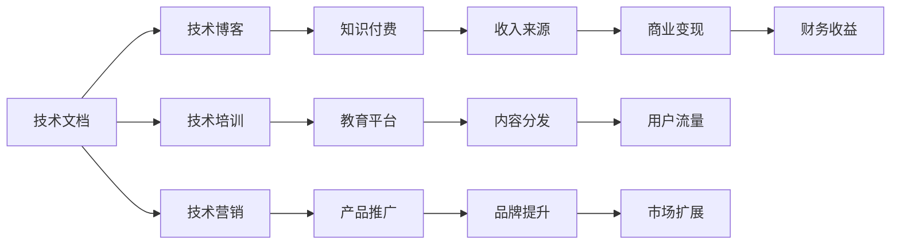

                 

## 1. 背景介绍

在数字化时代，技术写作已经从边缘技术逐渐成为程序员职业生涯中的重要组成部分。随着开源软件和开发者社区的兴起，技术写作变得越来越重要。对于有志成为优秀的程序员的技术人来说，掌握技术写作技能是必不可少的。然而，对于许多人来说，技术写作常常被忽视，甚至被视为辅助性任务。事实上，技术写作不仅是一种技能的提升，更是一种副业选择。

### 1.1 为什么技术写作是程序员的副业选择

技术写作不仅仅是写代码的补充，它是一种能够增加收入和提高职业竞争力的重要手段。以下是为什么技术写作是程序员副业选择的几个原因：

- **提高技术影响力**：通过写作，程序员可以将自己的技术知识、见解和经验分享给更广泛的受众，建立自己的技术声誉，成为某一技术领域的专家。
- **增加收入来源**：技术写作可以带来直接的收入，如技术博客的打赏、广告分成、技术咨询、书籍出版等。
- **提升职业机会**：强大的写作能力可以提升求职时的竞争力，帮助程序员获得更好的职位和薪资。
- **自我提升**：技术写作过程中需要对技术进行深入理解和梳理，有助于程序员提升自身的技术水平和思维能力。

### 1.2 技术写作的市场需求

在当前的技术环境中，技术写作的市场需求正在不断增长。主要原因包括：

- **开发者社区的扩张**：开源软件和开发者社区的兴起，产生了大量的技术文档、指南、教程和博客，为技术写作提供了广阔的市场。
- **数字化转型**：越来越多的企业进行数字化转型，需要大量的技术文档、培训材料和用户手册等，以支持其产品和服务。
- **知识付费**：随着知识付费的兴起，越来越多的人愿意为高质量的技术文档和书籍付费，为技术写作提供了更多的市场机会。

## 2. 核心概念与联系

### 2.1 核心概念概述

技术写作是一项综合性的技能，涉及技术、写作、编辑和营销等多个方面。以下是技术写作中几个核心概念：

- **技术文档（Technical Documentation）**：包括用户手册、API文档、技术指南、培训材料等，旨在帮助用户理解和使用技术产品。
- **技术博客（Technical Blogging）**：通过撰写技术文章分享技术见解、经验和方法，提升个人技术影响力。
- **技术培训（Technical Training）**：通过编写培训材料、开发在线课程，帮助用户掌握技术知识和技能。
- **技术营销（Technical Marketing）**：通过撰写市场文档、撰写营销文案，推广技术产品和服务。

这些概念之间相互联系，共同构成了一个完整的技术写作体系。

### 2.2 核心概念联系的 Mermaid 流程图



这个图表展示了技术写作的各个概念之间的联系和可能的转化路径。例如，技术文档可以转化为技术博客，进而获得知识付费的收入；技术培训可以成为教育平台的内容来源，实现商业变现；技术营销可以提升品牌影响力，增加用户流量和市场扩展机会。

## 3. 核心算法原理 & 具体操作步骤

### 3.1 算法原理概述

技术写作的算法原理基于信息论和传播学原理。技术写作的目标是通过有效传递信息，帮助用户理解和应用技术产品。这要求技术写作者必须具备以下几个方面的能力：

- **技术理解力**：深入理解技术原理和应用场景，能够准确传达技术信息。
- **写作表达力**：通过清晰、简洁、易懂的语言，向读者传达复杂的技术概念。
- **编辑审校力**：在写作过程中反复检查和修改，确保文档的准确性和一致性。
- **市场洞察力**：理解用户需求和市场趋势，撰写符合用户期望和市场需求的文档。

### 3.2 算法步骤详解

技术写作的算法步骤主要包括以下几个方面：

#### 3.2.1 需求分析

1. **确定目标受众**：了解目标用户的背景、需求和痛点，确定文档的受众群体。
2. **明确文档目标**：确定文档的目的，是提供技术支持、教育培训还是产品推广。
3. **收集相关资料**：收集技术相关的数据、文档、代码、测试结果等，作为文档的素材。

#### 3.2.2 内容规划

1. **框架设计**：根据文档目标和受众需求，设计文档的框架和结构，包括标题、章节、子章节等。
2. **内容撰写**：按照框架，撰写文档内容，确保内容准确、清晰、易读。
3. **视觉设计**：设计文档的排版、图表、插图等，提升文档的可读性和吸引力。

#### 3.2.3 审核校对

1. **初稿审核**：根据写作标准和规范，对文档进行初步审核，确保内容无误。
2. **同行评审**：邀请其他技术写作者或相关领域专家，对文档进行评审，提供反馈意见。
3. **多次修订**：根据反馈意见，多次修改文档，确保文档质量。

#### 3.2.4 发布推广

1. **选择发布渠道**：根据目标受众和文档类型，选择合适的发布渠道，如技术博客、企业官网、社交媒体等。
2. **优化SEO**：对文档进行SEO优化，提升在搜索引擎中的排名和可见性。
3. **市场推广**：通过邮件营销、社交媒体、社区推广等手段，增加文档的曝光和访问量。

### 3.3 算法优缺点

#### 3.3.1 优点

1. **提升技术影响力**：技术写作能够帮助程序员展示自己的技术能力和知识，提升在技术社区和行业内的影响力。
2. **增加收入来源**：通过技术博客、书籍出版、技术咨询等方式，获得额外的收入。
3. **促进个人成长**：写作过程中需要不断学习和思考，有助于提升技术水平和思维能力。

#### 3.3.2 缺点

1. **时间投入大**：技术写作需要大量的时间进行资料收集、内容撰写和修订，需要额外的时间和精力投入。
2. **学习曲线陡峭**：对于没有写作经验的技术人来说，需要学习一些写作技巧和规范，有一定的学习曲线。
3. **市场竞争激烈**：技术写作市场竞争激烈，需要不断创新和优化，才能获得稳定的收入和影响力。

### 3.4 算法应用领域

技术写作的应用领域非常广泛，涵盖以下几个方面：

1. **开源软件和开发者社区**：撰写技术文档、教程和博客，帮助用户了解和使用开源软件。
2. **企业技术支持**：编写用户手册、API文档和培训材料，帮助用户掌握企业技术产品。
3. **技术教育平台**：开发在线课程和培训材料，传授技术知识和技能。
4. **企业技术营销**：撰写市场文档和营销文案，推广企业技术产品和服务。

## 4. 数学模型和公式 & 详细讲解 & 举例说明

### 4.1 数学模型构建

技术写作的数学模型主要基于信息论和传播学原理。以下是一个简单的数学模型示例：

假设有一个技术文档，包含 $n$ 个页面，每个页面包含 $m$ 个单词，每个单词的概率为 $p$。那么文档的总信息量为 $H(D)$，可以表示为：

$$
H(D) = -\sum_{i=1}^n\sum_{j=1}^m p_{ij} \log p_{ij}
$$

其中 $p_{ij}$ 表示第 $i$ 页第 $j$ 个单词的概率。

### 4.2 公式推导过程

1. **信息熵计算**：根据信息论，信息熵 $H(D)$ 表示文档的平均信息量。对于每个单词，其信息熵 $H(W)$ 可以表示为：

$$
H(W) = -\sum_{i=1}^n p_{i} \log p_{i}
$$

其中 $p_{i}$ 表示第 $i$ 个单词的概率。

2. **信息量计算**：文档的信息量 $H(D)$ 可以通过单词的信息量 $H(W)$ 计算得到，即：

$$
H(D) = \frac{1}{n} \sum_{i=1}^n H(W_i)
$$

其中 $W_i$ 表示第 $i$ 个页面的内容。

### 4.3 案例分析与讲解

假设有一个技术文档，包含 10 个页面，每个页面包含 100 个单词，每个单词的概率为 $0.01$。则文档的总信息量 $H(D)$ 可以计算为：

$$
H(D) = -\sum_{i=1}^{10}\sum_{j=1}^{100} 0.01 \log 0.01 = -10 \times 100 \times 0.01 \log 0.01 = 1000
$$

这意味着该文档包含 1000 个比特的信息量。

## 5. 项目实践：代码实例和详细解释说明

### 5.1 开发环境搭建

要开始技术写作的实践，需要准备一些开发环境。以下是一些推荐工具和软件：

1. **文本编辑器**：如 VS Code、Atom 或 Sublime Text，用于编写文档。
2. **Markdown 编辑器**：如 Typora、MkDocs 或 GitHub Pages，用于管理文档。
3. **版本控制系统**：如 Git，用于版本控制和协作。
4. **代码托管平台**：如 GitHub，用于代码和文档的托管和分享。
5. **文档生成工具**：如 Sphinx，用于自动生成技术文档和帮助文档。

### 5.2 源代码详细实现

假设我们要写一个关于 Python 基础的技术文档，以下是一个简单的 Markdown 格式文档：

```markdown
# Python 基础教程

## 1. 环境搭建

### 1.1 安装 Python

```bash
$ sudo apt-get install python3
```

### 1.2 安装 Python 包

```bash
$ pip install package1 package2
```

## 2. 基本语法

### 2.1 变量与数据类型

```python
x = 1
y = "Hello, World!"
```

## 3. 控制结构

### 3.1 if 语句

```python
if x > 0:
    print("x is positive")
```

## 4. 函数

### 4.1 定义函数

```python
def add(x, y):
    return x + y
```

## 5. 异常处理

### 5.1 try-except 语句

```python
try:
    result = 1 / 0
except ZeroDivisionError:
    print("Division by zero!")
```

## 6. 标准库

### 6.1 文件操作

```python
with open("file.txt", "r") as f:
    content = f.read()
```

### 5.3 代码解读与分析

#### 5.3.1 文档结构

1. **标题**：使用 Markdown 的 `#` 符号表示文档标题，如 `# Python 基础教程`。
2. **章节**：使用 `##` 符号表示章节，如 `## 1. 环境搭建`。
3. **子章节**：使用 `###` 符号表示子章节，如 `### 1.1 安装 Python`。
4. **代码块**：使用 ``` 表示代码块，如 ```python 代码 ```。

#### 5.3.2 代码风格

1. **缩进**：Python 使用缩进来表示代码块，建议使用 4 个空格进行缩进。
2. **注释**：使用 `#` 符号添加注释，如 `# 打印 Hello, World!`。
3. **空行**：在代码块和文本之间添加空行，提升可读性。

#### 5.3.3 文件操作

1. **打开文件**：使用 `with open()` 语句打开文件，自动关闭文件。
2. **读取内容**：使用 `f.read()` 方法读取文件内容。
3. **写入内容**：使用 `f.write()` 方法写入文件内容。

### 5.4 运行结果展示

在上述代码中，我们展示了 Python 基础教程的部分内容，包括环境搭建、基本语法、控制结构、函数、异常处理和标准库等。这些内容可以帮助读者快速上手 Python，理解其基本用法和语法。

## 6. 实际应用场景

### 6.1 开源软件和开发者社区

技术写作在开源软件和开发者社区中具有重要的作用。以下是一些实际应用场景：

1. **文档编写**：编写技术文档和用户手册，帮助用户了解和使用开源软件。
2. **教程制作**：制作视频教程和在线课程，传授编程技巧和最佳实践。
3. **博客撰写**：撰写技术博客，分享编程经验和心得，提升个人影响力。

### 6.2 企业技术支持

技术写作在企业技术支持中也非常重要，以下是一些实际应用场景：

1. **用户手册**：编写用户手册，帮助用户了解企业技术产品的使用方法。
2. **API 文档**：编写 API 文档，帮助开发人员理解和使用企业技术产品的 API。
3. **培训材料**：编写培训材料，帮助员工掌握企业技术产品的技能。

### 6.3 技术教育平台

技术写作在技术教育平台中同样具有重要的作用，以下是一些实际应用场景：

1. **在线课程**：开发在线课程，传授编程语言和技术框架的使用。
2. **视频教程**：制作视频教程，讲解编程技巧和最佳实践。
3. **代码示例**：提供代码示例，帮助学生理解编程概念和实践。

### 6.4 企业技术营销

技术写作在企业技术营销中也非常重要，以下是一些实际应用场景：

1. **市场文档**：编写市场文档，介绍企业技术产品的特点和优势。
2. **营销文案**：撰写营销文案，推广企业技术产品和服务。
3. **案例分析**：编写案例分析，展示企业技术产品的应用效果和成功案例。

## 7. 工具和资源推荐

### 7.1 学习资源推荐

1. **《技术写作的艺术》（The Art of Technical Writing）**：这本书介绍了技术写作的基本原则和技巧，适合技术写作者阅读。
2. **Coursera 技术写作课程**：Coursera 提供了多个技术写作课程，涵盖不同层次的技术写作技能。
3. **Grammarly**：这是一个在线语法和写作工具，可以帮助技术写作者检查和改进文档的语言质量。

### 7.2 开发工具推荐

1. **VS Code**：这是一个功能强大的文本编辑器，支持 Markdown 和 HTML 等多种格式。
2. **GitHub Pages**：这是一个免费的文档托管平台，支持静态网站生成和在线预览。
3. **Typora**：这是一个轻量级的 Markdown 编辑器，支持实时预览和本地部署。

### 7.3 相关论文推荐

1. **“技术写作对软件开发的影响”（The Impact of Technical Writing on Software Development）**：这篇论文分析了技术写作在软件开发中的作用和影响。
2. **“技术写作与编程教育的结合”（Technical Writing and Programming Education）**：这篇论文探讨了技术写作在编程教育中的应用和效果。
3. **“技术写作的市场机会”（Market Opportunities in Technical Writing）**：这篇论文分析了技术写作的市场需求和机会。

## 8. 总结：未来发展趋势与挑战

### 8.1 未来发展趋势

技术写作的未来发展趋势包括以下几个方面：

1. **数字化转型**：随着数字化转型的加速，企业和技术社区对技术文档和培训材料的需求将持续增长。
2. **技术博客的兴起**：技术博客将继续成为技术写作者展示个人技术能力和影响力的重要平台。
3. **知识付费的普及**：知识付费的普及将为技术写作者提供更多的收入来源和市场机会。

### 8.2 面临的挑战

技术写作面临的挑战主要包括：

1. **市场竞争激烈**：技术写作市场竞争激烈，需要不断创新和优化，才能获得稳定的收入和影响力。
2. **学习曲线陡峭**：对于没有写作经验的技术人来说，需要学习一些写作技巧和规范，有一定的学习曲线。
3. **时间投入大**：技术写作需要大量的时间进行资料收集、内容撰写和修订，需要额外的时间和精力投入。

### 8.3 研究展望

未来技术写作的研究方向包括：

1. **自动化工具的开发**：开发自动化工具，提高技术文档的生成和维护效率。
2. **多模态文档的创作**：结合视觉、音频等多模态数据，提升文档的互动性和可读性。
3. **内容生成模型的应用**：引入生成模型技术，自动生成高质量的技术文档和培训材料。

## 9. 附录：常见问题与解答

### Q1: 如何成为一名优秀的技术写作者？

A: 成为一名优秀的技术写作者需要以下几个步骤：

1. **学习基础写作技巧**：阅读《技术写作的艺术》等书籍，学习基本写作技巧。
2. **掌握技术知识**：深入学习技术领域的知识，理解技术原理和应用场景。
3. **实践和反馈**：不断实践写作，并邀请其他技术写作者或相关领域专家，提供反馈意见。

### Q2: 技术写作与编程技能的关系是什么？

A: 技术写作与编程技能有很强的相关性，技术写作者需要具备以下编程技能：

1. **编程语言熟练度**：熟悉一种或多种编程语言，能够编写和调试代码。
2. **代码理解能力**：理解代码结构和功能，能够解释代码逻辑和实现细节。
3. **问题解决能力**：能够解决编程过程中遇到的问题，提供有效的技术支持。

### Q3: 技术写作对个人职业发展有什么帮助？

A: 技术写作对个人职业发展有以下帮助：

1. **提升技术影响力**：通过写作展示自己的技术能力和知识，提升在技术社区和行业内的影响力。
2. **增加收入来源**：通过技术博客、书籍出版、技术咨询等方式，获得额外的收入。
3. **促进个人成长**：写作过程中需要不断学习和思考，有助于提升技术水平和思维能力。

### Q4: 技术写作对企业技术支持有什么帮助？

A: 技术写作对企业技术支持有以下帮助：

1. **提升用户满意度**：编写用户手册和培训材料，帮助用户掌握技术产品，提升用户体验。
2. **降低技术支持成本**：通过文档和培训，减少用户在使用过程中遇到的问题，降低技术支持成本。
3. **建立技术信任**：通过高质量的技术文档和培训材料，建立用户对企业技术产品的信任。

### Q5: 技术写作的收入来源有哪些？

A: 技术写作的收入来源包括以下几个方面：

1. **技术博客打赏**：通过技术博客获得读者的打赏和广告分成。
2. **书籍出版收入**：撰写技术书籍，并通过出版社或自行出版，获得收入。
3. **技术咨询和培训**：提供技术咨询和培训服务，获得收入。
4. **企业技术支持**：编写技术文档和培训材料，获得企业支付的技术支持费用。

---

作者：禅与计算机程序设计艺术 / Zen and the Art of Computer Programming

