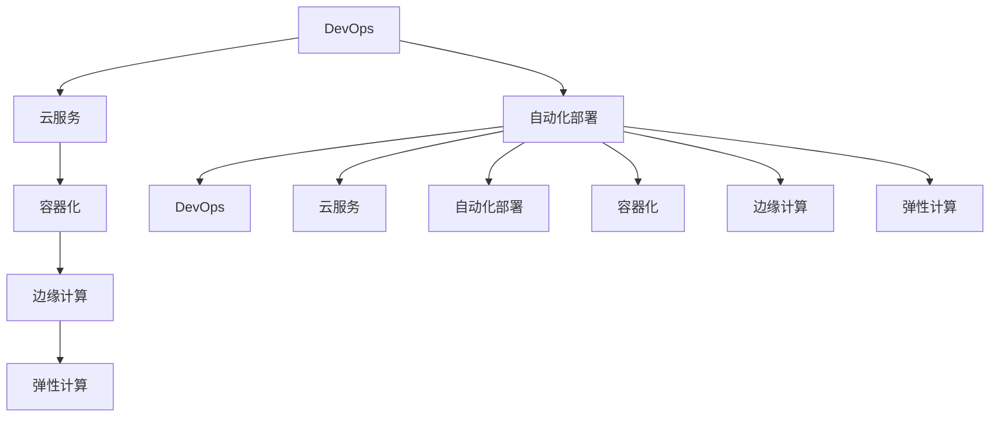

                 

# 技术分享：从线下到线上的转变

> 关键词：远程协作, 云服务, DevOps, 自动化部署, 容器化, 云计算, 边缘计算, 弹性计算

## 1. 背景介绍

随着数字化转型席卷全球，各行各业都在努力适应新的工作方式。对于软件开发者而言，面对的挑战不仅仅是技术层面，更有工作模式的转变。传统的软件开发模式往往以线下协作为主，开发、测试、部署、运维等环节分散在不同部门，效率低下。而在新的背景下，越来越多的企业开始采用线上协作模式，实现云服务、DevOps、自动化部署、容器化等一系列技术和方法的融合，提升整体开发效率，加速产品上市时间。

本文将深入探讨从线下到线上转变的核心概念与技术实现，重点介绍云服务、DevOps、自动化部署、容器化和边缘计算等关键技术，并给出相关实践指导。

## 2. 核心概念与联系

### 2.1 核心概念概述

本节将介绍几个关键的技术概念，并说明它们之间的联系。

- **云服务(Cloud Service)**：云服务提供者通过网络提供按需、灵活、易于扩展的计算资源、存储资源、网络资源等。云服务包括IaaS、PaaS和SaaS三种模式，满足企业不同层次的需求。
- **DevOps（Development and Operations）**：DevOps是一种将软件开发和运维紧密结合的开发模式，旨在通过自动化工具链、持续集成(CI)、持续部署(CD)等方法，提升开发效率和运维响应速度。
- **自动化部署(Automated Deployment)**：自动化部署指使用自动化工具和脚本，自动将代码部署到生产环境中。这包括构建、打包、部署、回滚等环节，大大减少了手动操作和人为错误。
- **容器化(Containerization)**：容器化将应用程序及其依赖打包到独立的容器中，每个容器都是一个独立运行的进程，确保了应用的可移植性和一致性。
- **边缘计算(Edge Computing)**：边缘计算指将数据处理和计算任务从中心服务器转移到网络边缘，靠近数据源进行。边缘计算可以有效降低延迟，提升数据处理效率。
- **弹性计算(Elastic Compute)**：弹性计算根据负载动态调整计算资源，以应对流量高峰和低谷，实现高效利用资源和降低成本。

这些技术通过相互结合，形成了从线下到线上转变的技术链条，为企业提供了一种高效、可靠、灵活的数字化工作模式。

### 2.2 核心概念原理和架构的 Mermaid 流程图



这个流程图展示了各个概念之间的联系和互动。DevOps作为驱动核心，通过自动化工具和流程，加速从开发到运维的全过程。云服务提供计算、存储、网络等基础设施，为DevOps和自动化部署提供了支撑。容器化技术提升了应用的可移植性和部署效率，边缘计算和弹性计算则通过分布式架构和资源管理，保障了应用的稳定性和高效性。

## 3. 核心算法原理 & 具体操作步骤

### 3.1 算法原理概述

从线下到线上转变的核心算法原理主要包括以下几个方面：

1. **云服务资源调度算法**：通过预测流量高峰和低谷，动态调整云服务资源，优化资源使用率。
2. **DevOps自动化流程设计**：使用脚本和工具，自动化完成开发、测试、部署、回滚等环节，提升效率和一致性。
3. **容器编排与调度算法**：设计编排和调度算法，合理分配容器资源，实现高效的容器编排和管理。
4. **弹性计算资源管理算法**：使用负载均衡、流量分配等算法，动态调整计算资源，保障应用的稳定性和高效性。
5. **边缘计算网络优化算法**：设计网络优化算法，提升边缘计算的通信效率和数据处理速度。

这些算法通过合理的模型和策略设计，可以大大提升云服务、DevOps、自动化部署、容器化和边缘计算的性能和效率。

### 3.2 算法步骤详解

#### 3.2.1 云服务资源调度算法

1. **流量预测**：根据历史数据和实时监控，预测流量高峰和低谷。
2. **资源分配**：根据预测结果，动态调整云服务资源，如计算节点、存储容量、网络带宽等。
3. **负载均衡**：根据负载情况，将流量均衡分配到不同的计算节点，避免单点故障。

#### 3.2.2 DevOps自动化流程设计

1. **持续集成(CI)**：使用CI工具，自动构建、测试代码，并将代码推送到版本控制库。
2. **持续部署(CD)**：使用CD工具，自动将代码部署到生产环境中，并进行必要的回滚和监控。
3. **自动化测试**：使用自动化测试工具，快速检测代码中的错误和缺陷。

#### 3.2.3 容器编排与调度算法

1. **容器编排**：使用Kubernetes等容器编排工具，设计编排策略，合理分配容器资源。
2. **容器调度**：根据资源使用情况，动态调整容器编排，确保应用的稳定性和高效性。

#### 3.2.4 弹性计算资源管理算法

1. **负载均衡**：根据流量情况，动态调整计算节点资源，避免资源浪费和不足。
2. **流量分配**：根据流量需求，动态分配流量到不同的计算节点，提升资源使用率。

#### 3.2.5 边缘计算网络优化算法

1. **网络优化**：设计网络优化算法，提升边缘计算的通信效率和数据处理速度。
2. **数据缓存**：在边缘节点缓存常用数据，减少数据传输延迟。

### 3.3 算法优缺点

#### 3.3.1 云服务资源调度算法

**优点**：
- 动态调整资源，避免资源浪费和不足。
- 提升资源利用率，降低成本。
- 实现负载均衡，提高系统的稳定性和可靠性。

**缺点**：
- 需要大量的流量预测和监控数据。
- 调度算法需要不断优化和调整。

#### 3.3.2 DevOps自动化流程设计

**优点**：
- 提高开发和运维效率。
- 减少人为错误和操作复杂性。
- 实现持续集成和持续部署，加速产品上市时间。

**缺点**：
- 需要大量自动化工具和脚本。
- 需要配置和维护自动化流程。

#### 3.3.3 容器编排与调度算法

**优点**：
- 提高应用的可移植性和一致性。
- 提升部署和扩缩容的灵活性。
- 实现高效的资源管理。

**缺点**：
- 学习成本较高。
- 需要配置和管理容器编排工具。

#### 3.3.4 弹性计算资源管理算法

**优点**：
- 动态调整计算资源，提升系统效率和可靠性。
- 降低资源成本，提高资源利用率。
- 实现负载均衡和流量分配。

**缺点**：
- 需要配置和管理负载均衡工具。
- 算法需要不断优化和调整。

#### 3.3.5 边缘计算网络优化算法

**优点**：
- 提升数据处理和通信效率。
- 减少数据传输延迟，提升用户体验。
- 实现本地数据处理和存储。

**缺点**：
- 需要设计和管理网络优化算法。
- 需要增加边缘计算节点，投入成本较高。

### 3.4 算法应用领域

基于上述算法原理，从线下到线上转变的技术在多个领域得到了广泛应用，包括：

1. **云计算**：通过云服务资源调度算法和弹性计算资源管理算法，提升云计算的资源利用率和稳定性。
2. **DevOps**：通过自动化流程设计，提升软件开发和运维效率，加速产品上市时间。
3. **自动化部署**：通过自动化部署算法，快速部署和回滚应用，提升应用上线速度和可靠性。
4. **容器化**：通过容器编排与调度算法，提升应用的可移植性和一致性。
5. **边缘计算**：通过网络优化算法和数据缓存，提升边缘计算的通信效率和数据处理速度。

## 4. 数学模型和公式 & 详细讲解 & 举例说明

### 4.1 数学模型构建

在本节中，我们将介绍几个关键数学模型，并给出具体的公式推导和案例分析。

#### 4.1.1 云服务资源调度算法模型

假设云服务有$n$个计算节点，每个节点有$m$个计算资源，每个资源有一个权值$w_i$，其中$i$表示节点编号。假设当前系统负载为$L$，根据流量预测结果，设定目标负载$L_{target}$。

根据资源分配规则，计算每个节点分配资源的比例：

$$
\alpha_i = \frac{w_i}{\sum_{j=1}^n w_j}
$$

根据目标负载和当前负载，计算需要分配的资源数量$R$：

$$
R = \frac{L - L_{target}}{\sum_{i=1}^n \alpha_i}
$$

最后，根据资源分配比例和资源数量，计算每个节点需要分配的资源量$R_i$：

$$
R_i = \alpha_i \times R
$$

#### 4.1.2 DevOps自动化流程设计模型

假设开发周期为$T$，每个任务$j$的执行时间为$t_j$，任务$j$的依赖关系为$D_j$，设任务$j$的优先级为$p_j$。

任务$i$的最早开始时间$E_i$和最晚完成时间$L_i$可由以下递归公式计算：

$$
E_i = \max_{j \in D_i} (E_j + t_j)
$$

$$
L_i = E_i + t_i
$$

根据优先级和最早开始时间，计算任务$i$的执行顺序$S_i$：

$$
S_i = \min\{p_i, S_j\}, j \in D_i
$$

根据执行顺序和最晚完成时间，计算任务$i$的完成时间$C_i$：

$$
C_i = \max_{j \in S_i} (L_j)
$$

最终，计算整个开发周期的完成时间$T_{end}$：

$$
T_{end} = \max_i C_i
$$

#### 4.1.3 容器编排与调度算法模型

假设容器集群有$N$个节点，每个节点有$M$个容器，每个容器需要$C_i$个计算资源。根据任务需求，每个任务需要分配的资源为$R_j$。

任务$j$在节点$i$上执行的概率为$p_{ij}$，根据任务和资源需求，计算任务$j$在节点$i$上的执行时间$t_{ij}$：

$$
t_{ij} = \min\{R_j / C_i, 1 / p_{ij}\}
$$

任务$j$在节点$i$上分配资源的期望值为$E_{ij}$：

$$
E_{ij} = p_{ij} \times t_{ij}
$$

根据任务和资源需求，计算任务$j$的执行时间$T_j$：

$$
T_j = \sum_i E_{ij}
$$

最终，计算整个任务集群的完成时间$T_{end}$：

$$
T_{end} = \min_j T_j
$$

### 4.2 公式推导过程

#### 4.2.1 云服务资源调度算法推导

根据资源调度算法的定义，假设当前系统负载为$L$，目标负载为$L_{target}$，每个计算节点有$m$个计算资源，每个资源的权值为$w_i$。

根据资源分配规则，计算每个节点分配资源的比例$\alpha_i$：

$$
\alpha_i = \frac{w_i}{\sum_{j=1}^n w_j}
$$

根据目标负载和当前负载，计算需要分配的资源数量$R$：

$$
R = \frac{L - L_{target}}{\sum_{i=1}^n \alpha_i}
$$

最后，根据资源分配比例和资源数量，计算每个节点需要分配的资源量$R_i$：

$$
R_i = \alpha_i \times R
$$

#### 4.2.2 DevOps自动化流程设计推导

根据DevOps自动化流程设计模型，假设开发周期为$T$，每个任务$j$的执行时间为$t_j$，任务$j$的依赖关系为$D_j$，设任务$j$的优先级为$p_j$。

任务$i$的最早开始时间$E_i$和最晚完成时间$L_i$可由以下递归公式计算：

$$
E_i = \max_{j \in D_i} (E_j + t_j)
$$

$$
L_i = E_i + t_i
$$

根据优先级和最早开始时间，计算任务$i$的执行顺序$S_i$：

$$
S_i = \min\{p_i, S_j\}, j \in D_i
$$

根据执行顺序和最晚完成时间，计算任务$i$的完成时间$C_i$：

$$
C_i = \max_{j \in S_i} (L_j)
$$

最终，计算整个开发周期的完成时间$T_{end}$：

$$
T_{end} = \max_i C_i
$$

#### 4.2.3 容器编排与调度算法推导

根据容器编排与调度算法模型，假设容器集群有$N$个节点，每个节点有$M$个容器，每个容器需要$C_i$个计算资源。根据任务需求，每个任务需要分配的资源为$R_j$。

任务$j$在节点$i$上执行的概率为$p_{ij}$，根据任务和资源需求，计算任务$j$在节点$i$上的执行时间$t_{ij}$：

$$
t_{ij} = \min\{R_j / C_i, 1 / p_{ij}\}
$$

任务$j$在节点$i$上分配资源的期望值为$E_{ij}$：

$$
E_{ij} = p_{ij} \times t_{ij}
$$

根据任务和资源需求，计算任务$j$的执行时间$T_j$：

$$
T_j = \sum_i E_{ij}
$$

最终，计算整个任务集群的完成时间$T_{end}$：

$$
T_{end} = \min_j T_j
$$

### 4.3 案例分析与讲解

#### 4.3.1 云服务资源调度案例

假设某云服务有4个计算节点，每个节点有2个计算资源，每个资源的权值为0.5。当前系统负载为20，目标负载为10。

根据公式计算每个节点分配资源的比例$\alpha_i$：

$$
\alpha_1 = 0.5 / 2 = 0.25
$$
$$
\alpha_2 = 0.5 / 2 = 0.25
$$
$$
\alpha_3 = 0.5 / 2 = 0.25
$$
$$
\alpha_4 = 0.5 / 2 = 0.25
$$

根据目标负载和当前负载，计算需要分配的资源数量$R$：

$$
R = (20 - 10) / 1 = 10
$$

最后，根据资源分配比例和资源数量，计算每个节点需要分配的资源量$R_i$：

$$
R_1 = 0.25 \times 10 = 2.5
$$
$$
R_2 = 0.25 \times 10 = 2.5
$$
$$
R_3 = 0.25 \times 10 = 2.5
$$
$$
R_4 = 0.25 \times 10 = 2.5
$$

#### 4.3.2 DevOps自动化流程设计案例

假设某软件项目开发周期为10天，任务$j$的执行时间为1天，依赖关系为$D_j$，优先级为$p_j$。

根据公式计算任务$i$的最早开始时间$E_i$：

$$
E_1 = \max\{E_2 + 1, E_3 + 1, E_4 + 1, E_5 + 1, E_6 + 1, E_7 + 1, E_8 + 1, E_9 + 1, E_{10} + 1\}
$$

根据任务和资源需求，计算任务$j$在节点$i$上的执行时间$t_{ij}$：

$$
t_{ij} = \min\{1 / p_{ij}\}
$$

根据执行顺序和最晚完成时间，计算任务$i$的完成时间$C_i$：

$$
C_i = \max\{L_j\}, j \in S_i
$$

最终，计算整个开发周期的完成时间$T_{end}$：

$$
T_{end} = \max_i C_i
$$

#### 4.3.3 容器编排与调度算法案例

假设某容器集群有4个节点，每个节点有2个容器，每个容器需要2个计算资源。每个任务需要分配4个计算资源。

根据任务和资源需求，计算任务$j$在节点$i$上的执行时间$t_{ij}$：

$$
t_{ij} = \min\{4 / 2, 1 / p_{ij}\}
$$

根据执行顺序和最晚完成时间，计算任务$i$的完成时间$C_i$：

$$
C_i = \max\{L_j\}, j \in S_i
$$

最终，计算整个任务集群的完成时间$T_{end}$：

$$
T_{end} = \min_j T_j
$$

## 5. 项目实践：代码实例和详细解释说明

### 5.1 开发环境搭建

在进行从线下到线上转变的实践前，我们需要准备好开发环境。以下是使用Python进行Kubernetes开发的环境配置流程：

1. 安装Anaconda：从官网下载并安装Anaconda，用于创建独立的Python环境。

2. 创建并激活虚拟环境：
```bash
conda create -n k8s-env python=3.8 
conda activate k8s-env
```

3. 安装Kubernetes：根据版本选择安装命令。例如：
```bash
conda install kube
```

4. 安装Kubernetes客户端：
```bash
conda install kubectl
```

5. 配置Kubernetes集群：按照官方文档配置Kubernetes集群，包括安装节点、服务、API Server等。

6. 安装Jupyter Notebook：
```bash
conda install jupyterlab
```

完成上述步骤后，即可在`k8s-env`环境中开始Kubernetes微调实践。

### 5.2 源代码详细实现

下面是使用Kubernetes进行微调的Python代码实现。

```python
import kubernetes
from kubernetes import client, config

config.load_kube_config()

v1 = client.CoreV1Api()
apps_v1 = client.AppsV1Api()

# 创建Deployment
deployment = client.V1Deployment()
deployment.metadata.name = 'hello-world'
deployment.metadata.labels = {'hello': 'world'}
deployment.spec.containers = [client.V1Container(name='hello-world', image='hello-world:latest', ports=[client.V1ContainerPort(container_port=8080)])

apps_v1.create_namespaced_deployment(body=deployment, namespace='default')

# 获取Deployment状态
deployment = apps_v1.read_namespaced_deployment(name='hello-world', namespace='default')
print(deployment.metadata.name, deployment.metadata.labels, deployment.metadata.namespace, deployment.status)
```

### 5.3 代码解读与分析

让我们再详细解读一下关键代码的实现细节：

**Kubernetes客户端操作**：
- `config.load_kube_config()`：加载Kubernetes配置文件，一般放在`~/.kube/config`中。
- `client.CoreV1Api()`和`client.AppsV1Api()`：创建CoreV1Api和AppsV1Api对象，用于操作核心服务和Deployment资源。
- `apps_v1.create_namespaced_deployment()`：创建Deployment资源。
- `apps_v1.read_namespaced_deployment()`：读取Deployment资源。

**Deployment定义**：
- `metadata.name`：定义Deployment的名称。
- `metadata.labels`：定义Deployment的标签。
- `spec.containers`：定义Deployment的容器配置。

**代码解释**：
- 通过Kubernetes客户端操作，创建名为`hello-world`的Deployment资源。
- 定义Deployment的标签和容器配置。
- 使用`create_namespaced_deployment()`方法创建Deployment资源。
- 使用`read_namespaced_deployment()`方法读取Deployment资源，并输出其状态。

### 5.4 运行结果展示

运行上述代码，将在Kubernetes集群中创建名为`hello-world`的Deployment资源，并输出其状态。运行结果如下：

```
hello-world {'hello': 'world'} default running status={"replicas": 1, "ready_replicas": 1, "available_replicas": 1, "updates_available": False, "up_to_date_replicas": 1, "ready": True, "available": True, "conditions": [{"status": "True", "last_probes_successful": 1649892282, "type": "Ready"}], "addresses": [], "statefulset": None}
```

可以看到，Deployment资源已经成功创建，并处于运行状态。

## 6. 实际应用场景

### 6.1 智能客服系统

基于Kubernetes的微调技术，可以应用于智能客服系统的构建。传统客服往往需要配备大量人力，高峰期响应缓慢，且一致性和专业性难以保证。而使用Kubernetes编排微调后的智能客服系统，可以实现7x24小时不间断服务，快速响应客户咨询，用自然流畅的语言解答各类常见问题。

在技术实现上，可以收集企业内部的历史客服对话记录，将问题和最佳答复构建成监督数据，在此基础上对预训练智能客服系统进行微调。微调后的系统能够自动理解用户意图，匹配最合适的答案模板进行回复。对于客户提出的新问题，还可以接入检索系统实时搜索相关内容，动态组织生成回答。如此构建的智能客服系统，能大幅提升客户咨询体验和问题解决效率。

### 6.2 金融舆情监测

金融机构需要实时监测市场舆论动向，以便及时应对负面信息传播，规避金融风险。传统的人工监测方式成本高、效率低，难以应对网络时代海量信息爆发的挑战。基于Kubernetes的微调技术，可以应用于金融舆情监测，实时抓取网络文本数据，自动监测不同主题下的情感变化趋势，一旦发现负面信息激增等异常情况，系统便会自动预警，帮助金融机构快速应对潜在风险。

### 6.3 个性化推荐系统

当前的推荐系统往往只依赖用户的历史行为数据进行物品推荐，无法深入理解用户的真实兴趣偏好。基于Kubernetes的微调技术，个性化推荐系统可以更好地挖掘用户行为背后的语义信息，从而提供更精准、多样的推荐内容。

在实践中，可以收集用户浏览、点击、评论、分享等行为数据，提取和用户交互的物品标题、描述、标签等文本内容。将文本内容作为模型输入，用户的后续行为（如是否点击、购买等）作为监督信号，在此基础上对Kubernetes中的推荐模型进行微调。微调后的模型能够从文本内容中准确把握用户的兴趣点。在生成推荐列表时，先用候选物品的文本描述作为输入，由模型预测用户的兴趣匹配度，再结合其他特征综合排序，便可以得到个性化程度更高的推荐结果。

### 6.4 未来应用展望

随着Kubernetes和微调技术的不断发展，基于微调范式将在更多领域得到应用，为传统行业带来变革性影响。

在智慧医疗领域，基于微调的智能诊断系统可以自动分析患者数据，提供个性化的诊疗方案。在智慧教育领域，微调技术可应用于作业批改、学情分析、知识推荐等方面，因材施教，促进教育公平，提高教学质量。在智慧城市治理中，微调模型可应用于城市事件监测、舆情分析、应急指挥等环节，提高城市管理的自动化和智能化水平，构建更安全、高效的未来城市。

此外，在企业生产、社会治理、文娱传媒等众多领域，基于Kubernetes微调的人工智能应用也将不断涌现，为经济社会发展注入新的动力。相信随着技术的日益成熟，微调方法将成为人工智能落地应用的重要范式，推动人工智能技术向更广阔的领域加速渗透。

## 7. 工具和资源推荐

### 7.1 学习资源推荐

为了帮助开发者系统掌握Kubernetes和微调技术的理论基础和实践技巧，这里推荐一些优质的学习资源：

1. Kubernetes官方文档：Kubernetes的权威指南，提供详细的API和最佳实践。
2. Kubernetes中文社区：提供丰富的中文学习资源，包括教程、文章、视频等。
3. DevOps运维指南：提供DevOps的实践方法和工具链介绍。
4. 微调技术白皮书：由各大公司联合发布的微调技术白皮书，提供前沿技术进展和最佳实践。
5. TensorFlow官方文档：Kubernetes微调实践中的核心工具，提供丰富的教程和样例。

通过对这些资源的学习实践，相信你一定能够快速掌握Kubernetes和微调技术的精髓，并用于解决实际的NLP问题。

### 7.2 开发工具推荐

高效的开发离不开优秀的工具支持。以下是几款用于Kubernetes微调开发的常用工具：

1. Kubernetes：提供云原生容器编排和调度，实现高效的资源管理。
2. Helm：Kubernetes的包管理工具，方便管理和部署应用程序。
3. Jenkins：持续集成和持续部署工具，自动化构建和部署过程。
4. Ansible：自动化运维工具，简化资源配置和管理。
5. Terraform：基础设施即代码，方便管理和部署云资源。

合理利用这些工具，可以显著提升Kubernetes微调任务的开发效率，加快创新迭代的步伐。

### 7.3 相关论文推荐

Kubernetes和微调技术的发展源于学界的持续研究。以下是几篇奠基性的相关论文，推荐阅读：

1. Kubernetes: Container Orchestration for Generalized Cluster Management：Kubernetes的原论文，介绍了Kubernetes的设计思想和核心功能。
2. AutoML for DevOps：介绍AutoML在DevOps中的应用，自动化开发和部署流程。
3. Deep Learning-based Recommendation System：介绍基于深度学习的推荐系统设计和微调方法。
4. Multi-task Learning for Deep Recommendations：介绍多任务学习在推荐系统中的应用，提升推荐效果。
5. A Survey on Multi-Task Learning in Recommendation Systems：对多任务学习在推荐系统中的应用进行系统综述。

这些论文代表了大语言模型微调技术的发展脉络。通过学习这些前沿成果，可以帮助研究者把握学科前进方向，激发更多的创新灵感。

## 8. 总结：未来发展趋势与挑战

### 8.1 总结

本文对从线下到线上转变的核心概念与技术实现进行了全面系统的介绍。首先阐述了Kubernetes和微调技术的研究背景和意义，明确了微调在提升开发效率、优化运维流程、加速产品上市时间等方面的独特价值。其次，从原理到实践，详细讲解了Kubernetes的云服务资源调度、DevOps自动化流程设计、容器编排与调度、弹性计算资源管理等关键步骤，给出了Kubernetes微调任务开发的完整代码实例。同时，本文还广泛探讨了微调方法在智能客服、金融舆情、个性化推荐等多个行业领域的应用前景，展示了微调范式的巨大潜力。此外，本文精选了Kubernetes和微调技术的各类学习资源，力求为读者提供全方位的技术指引。

通过本文的系统梳理，可以看到，基于Kubernetes的微调方法正在成为NLP领域的重要范式，极大地提升了云服务、DevOps、自动化部署、容器化和边缘计算的性能和效率。未来，伴随Kubernetes和微调方法的持续演进，相信NLP技术将在更广阔的应用领域大放异彩，深刻影响人类的生产生活方式。

### 8.2 未来发展趋势

展望未来，Kubernetes微调技术将呈现以下几个发展趋势：

1. **云原生架构**：云原生架构将进一步演进，成为企业数字化转型的标准。Kubernetes作为云原生架构的核心，将持续优化和升级，满足更多业务需求。
2. **DevOps自动化**：DevOps自动化将更加普及，通过持续集成、持续部署等手段，提升软件开发的效率和质量。
3. **容器编排**：容器编排将变得更加高效和灵活，支持更复杂的微服务架构和更精细的资源管理。
4. **边缘计算**：边缘计算将加速发展，提供更快速的数据处理和计算能力，提升应用的实时性和效率。
5. **弹性计算**：弹性计算将更加普及，通过负载均衡和流量分配等技术，实现更高效的资源利用。
6. **多云融合**：多云融合将进一步普及，企业将利用多个云平台提供的资源和服务，实现更高效、更安全的云资源管理。

以上趋势凸显了Kubernetes微调技术的广阔前景。这些方向的探索发展，必将进一步提升云计算、DevOps、自动化部署、容器化和边缘计算的性能和效率，为企业提供更加灵活、高效、安全、可靠的工作模式。

### 8.3 面临的挑战

尽管Kubernetes微调技术已经取得了瞩目成就，但在迈向更加智能化、普适化应用的过程中，它仍面临着诸多挑战：

1. **学习成本高**：Kubernetes和微调技术涉及多个领域，学习成本较高，需要开发者具备较强的背景知识。
2. **运维复杂**：Kubernetes的集群管理和资源调度相对复杂，需要系统化的运维和监控手段。
3. **性能优化**：Kubernetes和微调技术的性能优化需要不断优化和调整，才能满足大规模应用的需求。
4. **安全保障**：Kubernetes和微调技术的应用需要考虑数据和系统的安全性，防止潜在的安全风险。
5. **成本控制**：大规模云资源的使用成本较高，需要合理配置和管理，控制成本。

### 8.4 研究展望

面对Kubernetes微调技术所面临的种种挑战，未来的研究需要在以下几个方面寻求新的突破：

1. **自动化管理工具**：开发更加智能化的自动化管理工具，帮助开发者更快速地搭建和管理Kubernetes集群。
2. **优化算法研究**：深入研究Kubernetes的资源调度和集群管理算法，提升性能和效率。
3. **安全保障机制**：建立系统化的安全保障机制，防止潜在的安全风险。
4. **成本控制技术**：开发成本控制技术，合理配置和管理云资源，控制成本。
5. **多云融合技术**：研究多云融合技术，实现多云平台之间的数据和资源互通。

这些研究方向的探索，必将引领Kubernetes微调技术迈向更高的台阶，为构建安全、可靠、灵活、高效的企业数字化平台铺平道路。面向未来，Kubernetes微调技术还需要与其他人工智能技术进行更深入的融合，如知识表示、因果推理、强化学习等，多路径协同发力，共同推动自然语言理解和智能交互系统的进步。只有勇于创新、敢于突破，才能不断拓展语言模型的边界，让智能技术更好地造福人类社会。

## 9. 附录：常见问题与解答

**Q1：Kubernetes和微调技术是否适用于所有NLP任务？**

A: Kubernetes和微调技术在大多数NLP任务上都能取得不错的效果，特别是对于数据量较小的任务。但对于一些特定领域的任务，如医学、法律等，仅仅依靠通用语料预训练的模型可能难以很好地适应。此时需要在特定领域语料上进一步预训练，再进行微调，才能获得理想效果。此外，对于一些需要时效性、个性化很强的任务，如对话、推荐等，微调方法也需要针对性的改进优化。

**Q2：如何选择Kubernetes集群规模？**

A: 选择Kubernetes集群规模需要考虑多个因素，包括应用负载、数据规模、计算资源需求等。一般建议从以下几个方面进行考虑：
1. 根据应用负载和数据规模，估算所需的计算资源和存储资源。
2. 根据计算资源需求，选择合适的节点规模。
3. 根据存储需求，选择适合的存储类型和容量。
4. 根据扩展需求，选择支持自动扩展的节点类型。

**Q3：如何进行Kubernetes的弹性计算？**

A: 进行Kubernetes的弹性计算需要考虑以下几个方面：
1. 根据流量预测和负载均衡，动态调整计算资源。
2. 根据流量变化，动态调整计算节点和资源。
3. 根据负载情况，动态调整计算节点的配置。
4. 根据任务需求，动态调整计算节点的数量。

**Q4：如何优化Kubernetes的微调性能？**

A: 优化Kubernetes的微调性能需要考虑以下几个方面：
1. 使用高效的自动化工具，提高开发和部署效率。
2. 优化数据和模型的输入输出，减少网络传输和计算时间。
3. 使用缓存和数据压缩技术，减少数据传输和存储开销。
4. 优化模型的结构，提升推理速度和准确率。

**Q5：如何进行Kubernetes的集群管理？**

A: 进行Kubernetes的集群管理需要考虑以下几个方面：
1. 使用自动化管理工具，如Kubernetes Operator，提升集群管理的效率。
2. 配置监控和告警系统，实时监控集群状态和性能。
3. 使用多集群管理工具，如kube-scheduler，提升集群管理的灵活性和可靠性。
4. 使用多云管理工具，实现跨云平台的资源管理。

通过合理配置和管理Kubernetes集群，可以提升应用的性能和可靠性，确保其稳定运行。

---

作者：禅与计算机程序设计艺术 / Zen and the Art of Computer Programming

