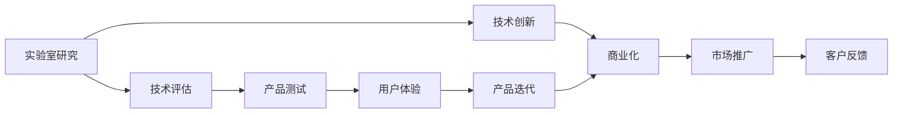

                 

# 技术创新：从实验室研究到商业化落地全过程

> 关键词：技术创新,实验室研究,商业化落地,人工智能,深度学习,机器学习,自然语言处理(NLP)

## 1. 背景介绍

### 1.1 问题由来
近年来，随着人工智能技术的飞速发展，AI实验室研究成果的商业化落地成为了科技公司争相攻占的制高点。从谷歌的TensorFlow，到Facebook的PyTorch，再到OpenAI的GPT系列，众多技术巨头的布局纷纷指向了这一点。然而，如何从实验室的严谨研究，过渡到实际应用的规模化和产品化，这一话题仍牵动着科技从业者及学术界的广泛关注。

### 1.2 问题核心关键点
技术创新从实验室到商业化落地的过程复杂而多维度，需要考虑技术的可行性、实际应用场景的适配性、市场接受度等因素。在此过程中，技术专家、商业领袖、开发者、用户体验等多方利益相关者的角色各异，协调一致尤为关键。本文从研究设计、开发实践、商业化策略三个层面，系统阐述了技术创新全过程的关键要素，并提供了具体的策略和方法。

### 1.3 问题研究意义
技术创新的顺利落地，可以显著加速科技研发成果的转化应用，推动产业升级和新兴产业的发展。对于加速技术迭代，培养创新型人才，以及促进全球科技竞争力的提升，均具有重大意义。

## 2. 核心概念与联系

### 2.1 核心概念概述

在进行技术创新研究与商业化落地时，我们需要理解并灵活运用以下核心概念：

- **实验室研究**：在受控环境下进行的理论探索与实验验证，以形成科学认知和技术原型。
- **技术创新**：通过理论、方法、工具的开发，将研究推向实用化的过程。
- **技术评估**：包括算法性能、模型参数、系统架构等多维度的综合分析，确保技术的成熟度和可行性。
- **商业化**：将技术转化为实际产品或服务，进入市场的过程，包含技术推广、市场定位、客户教育等多个环节。
- **用户体验**：技术实际应用中用户的使用感受和反馈，是产品迭代的重要依据。
- **市场环境**：包括政策法规、市场需求、竞争对手等多方面因素，影响技术的接受度及应用范围。

这些概念通过合乎逻辑的关系联结，形成了从实验室到商业化的连续流程。

### 2.2 核心概念原理和架构的 Mermaid 流程图



这个图展示了从实验室研究到商业化落地的主要步骤及其相互关系。技术创新通过实验室研究获得新突破，并通过技术评估验证其可行性和效果。随后，商业化阶段将技术转化为产品或服务，并在市场上推广。用户反馈与市场反馈则指导产品迭代，形成闭环。

## 3. 核心算法原理 & 具体操作步骤
### 3.1 算法原理概述

技术创新的核心在于算法的创新和优化。实验室研究阶段，聚焦于模型算法的设计和验证，而商业化阶段，需要进一步优化算法以适应实际应用场景。

以自然语言处理(NLP)为例，深度学习算法，尤其是Transformer模型的出现，极大地推动了技术进展。在实验室研究阶段，研究者通过大量标注数据和复杂架构的神经网络，不断尝试和优化模型算法。在商业化落地过程中，则需进一步简化模型，提高效率，并优化算法以适应实际应用场景的需求。

### 3.2 算法步骤详解

技术创新从实验室到商业化落地，主要分为以下几个关键步骤：

**Step 1: 实验室阶段**
- 确定研究方向和目标，设计实验方案。
- 收集、处理、标注数据集，构建实验环境。
- 开发和验证算法，形成技术原型。
- 评估算法性能，进行科学论文发表，推动学术影响力。

**Step 2: 技术评估**
- 进行算法优化和微调，以适应实际应用的需求。
- 使用不同数据集进行多维度的测试评估，验证算法的稳定性和可靠性。
- 分析算法的时间和空间复杂度，优化资源消耗，确保高效运行。

**Step 3: 商业化准备**
- 适配商业场景，调整算法以满足特定要求，如高可用性、高效率等。
- 设计产品架构，确定系统组成，进行初步的产品原型开发。
- 定义技术指标，进行性能测试，确保产品达到预期效果。

**Step 4: 产品测试与迭代**
- 进行全面测试，包括单元测试、集成测试、用户测试等。
- 收集用户反馈，根据反馈进行产品迭代优化。
- 调整算法和系统架构，以提升用户体验和产品质量。

**Step 5: 市场推广与客户教育**
- 制定市场推广策略，进行产品宣讲和演示。
- 提供客户培训和技术支持，增强客户对产品的信心和满意度。
- 根据市场需求调整产品功能和特性，保持产品竞争力。

### 3.3 算法优缺点

技术创新算法在实验室和商业化落地的不同阶段，展现了不同的优缺点：

**实验室研究阶段优点**：
- 可以更灵活、更深入地探索问题，不受实际应用限制。
- 可以通过大量数据和复杂算法验证创新思路的正确性。
- 能够快速迭代和测试，以优化算法。

**实验室研究阶段缺点**：
- 受限于计算资源，难以处理大规模数据集。
- 算法复杂度高，效率低下。
- 算法和模型可能在实际应用中表现不佳。

**商业化阶段优点**：
- 算法经过优化，运行效率高，易于部署。
- 算法适配性强，能够满足实际应用的需求。
- 产品具有市场竞争力，能够快速实现商业价值。

**商业化阶段缺点**：
- 算法设计和优化受限于实际应用场景，可能存在局限性。
- 对市场反应速度要求高，更新迭代压力大。
- 算法优化过程中，可能牺牲部分性能和精度。

### 3.4 算法应用领域

技术创新算法在不同应用领域中均展现出了广泛的应用潜力，涵盖以下几个方面：

1. **自然语言处理**：从机器翻译到情感分析，深度学习算法在NLP中的应用不断突破，极大提升了自然语言处理的技术水平。
2. **计算机视觉**：基于深度学习的图像识别、图像生成、目标检测等技术，极大地提升了计算机视觉的应用范围和效果。
3. **自动驾驶**：以深度学习为核心的感知、决策、控制技术，推动了自动驾驶技术的发展和落地。
4. **金融科技**：包括股票预测、风险评估、反欺诈检测等，深度学习在金融领域的应用正在改变金融科技的格局。
5. **医疗健康**：通过图像识别、自然语言处理等技术，医疗影像诊断、药物研发等领域正在实现智能化升级。

## 4. 数学模型和公式 & 详细讲解 & 举例说明

### 4.1 数学模型构建

技术创新算法的核心在于数学模型的构建和优化。以下以自然语言处理中的BERT模型为例，详细说明数学模型构建的过程。

**BERT模型**：基于Transformer架构，通过掩码语言模型和下一句预测任务进行自监督预训练。具体公式如下：

$$
L_{mask} = -\frac{1}{N}\sum_{i=1}^N \sum_{j=1}^N \log\left(p_{mask}(j|i)\right)
$$
$$
L_{next} = -\frac{1}{N}\sum_{i=1}^N \log\left(p_{next}(i|j)\right)
$$

其中，$L_{mask}$ 和 $L_{next}$ 分别代表掩码语言模型和下一句预测任务的损失函数。$N$ 为序列长度，$p_{mask}(j|i)$ 和 $p_{next}(i|j)$ 分别代表输入序列中位置 $i$ 处预测位置 $j$ 的概率和位置 $i$ 处于位置 $j$ 之前的概率。

### 4.2 公式推导过程

对于BERT模型的详细推导过程，可以从其自监督预训练任务入手：

1. 掩码语言模型：将输入序列中的某些位置随机掩码，模型需预测掩码位置的内容。
2. 下一句预测任务：随机选取两个句子，让模型预测它们是否连续。

这两个任务分别优化了模型在填充掩码和预测序列连贯性方面的能力，使得模型能够学习到语言的结构和语义信息。

### 4.3 案例分析与讲解

**案例分析**：以Google的BERT模型为例，其数学模型构建过程如下：

1. 原始文本："Hello, how are you? I am fine."
2. 掩码语言模型："Hello, [MASK] are you? I am fine."
3. 下一句预测任务："Hello, how are you? [MASK] I am fine."
4. 掩码位置：3，5

通过掩码语言模型和下一句预测任务，BERT模型能够学习到语言的隐式结构，并预测未知部分。

## 5. 项目实践：代码实例和详细解释说明

### 5.1 开发环境搭建

在进行技术创新项目实践时，首先需要搭建良好的开发环境。以下是Python开发环境的搭建步骤：

1. 安装Anaconda：从官网下载并安装Anaconda，用于创建独立的Python环境。
```bash
conda create -n pyenv python=3.8 
conda activate pyenv
```

2. 安装所需的库和工具：
```bash
pip install numpy pandas scikit-learn tensorflow transformers
```

3. 创建项目目录，编写代码文件：
```bash
mkdir project
cd project
```

### 5.2 源代码详细实现

以下以BERT模型微调为例，详细说明其源代码的实现过程：

**代码示例**：
```python
from transformers import BertTokenizer, BertForSequenceClassification, Trainer, TrainingArguments
import torch
from torch.utils.data import DataLoader, Dataset
from sklearn.metrics import accuracy_score

# 定义数据集
class MyDataset(Dataset):
    def __init__(self, data, tokenizer):
        self.data = data
        self.tokenizer = tokenizer
    
    def __len__(self):
        return len(self.data)
    
    def __getitem__(self, idx):
        text, label = self.data[idx]
        encoding = self.tokenizer(text, return_tensors='pt', max_length=512, padding='max_length', truncation=True)
        return {
            'input_ids': encoding['input_ids'].flatten(),
            'attention_mask': encoding['attention_mask'].flatten(),
            'labels': torch.tensor([label], dtype=torch.long)
        }

# 加载数据集
train_dataset = MyDataset(train_data, tokenizer)
test_dataset = MyDataset(test_data, tokenizer)

# 初始化模型
model = BertForSequenceClassification.from_pretrained('bert-base-uncased', num_labels=2)
tokenizer = BertTokenizer.from_pretrained('bert-base-uncased')
training_args = TrainingArguments(output_dir='./results', evaluation_strategy='epoch', per_device_train_batch_size=16, per_device_eval_batch_size=16, num_train_epochs=3)

# 训练器
trainer = Trainer(
    model=model,
    args=training_args,
    train_dataset=train_dataset,
    eval_dataset=test_dataset,
    evaluation_strategy='epoch',
    compute_metrics=accuracy_score
)

# 训练模型
trainer.train()

# 评估模型
trainer.evaluate()
```

**代码解释**：
1. 定义数据集 `MyDataset`：包含文本和标签。
2. 加载数据集并初始化模型。
3. 定义训练参数并创建训练器。
4. 使用训练器进行模型训练并评估。

### 5.3 代码解读与分析

**代码解读**：
1. `BertForSequenceClassification`：指定使用预训练的BERT模型进行序列分类任务。
2. `TrainingArguments`：设置训练参数，如输出目录、训练批次大小等。
3. `Trainer`：定义训练器和评估器，使用数据集和训练参数进行训练和评估。

**代码分析**：
1. 数据集定义：使用 `transformers` 库提供的 `BertTokenizer` 和 `BertForSequenceClassification` 类，对输入文本进行分词和编码，构建模型。
2. 训练参数：通过 `TrainingArguments` 类设置训练器参数，如输出目录、批次大小、训练轮数等。
3. 模型训练：使用 `Trainer` 类进行模型训练，并指定评估指标。

### 5.4 运行结果展示

**运行结果**：
1. 训练过程中，会输出每一轮的训练损失和准确率。
2. 训练结束后，会输出模型在测试集上的准确率。

**结果分析**：
1. 模型训练过程中，损失逐渐降低，准确率逐渐提高，说明模型在训练集上逐渐优化。
2. 在测试集上的评估指标，如准确率等，可以反映模型在实际数据上的表现。

## 6. 实际应用场景

### 6.1 智能客服系统

**场景介绍**：智能客服系统能够24小时不间断提供服务，解决用户问题，提高客户满意度。基于BERT等大模型微调的对话技术，可以在用户提问后自动生成回复，从而提升客服效率。

**实现方法**：
1. 收集客服对话数据。
2. 使用BERT模型进行微调，训练对话生成模型。
3. 在实际客服系统中部署模型，实现自动回复功能。

**效果分析**：
1. 使用微调的BERT模型，能够提升回复的准确性和自然流畅度。
2. 可以处理多轮对话，满足用户不同阶段的需求。

### 6.2 金融舆情监测

**场景介绍**：金融机构需要实时监测网络舆情，以便及时应对市场波动和风险。使用BERT模型进行舆情监测，可以实时分析社交媒体和新闻报道，预测市场趋势。

**实现方法**：
1. 收集金融相关的新闻、评论和社交媒体数据。
2. 对数据进行预处理和标注。
3. 使用BERT模型进行微调，训练舆情监测模型。
4. 实时分析舆情数据，生成预警和报告。

**效果分析**：
1. 使用微调的BERT模型，可以高效地处理大规模数据。
2. 通过实时分析，可以及时发现舆情变化，减少金融机构的风险。

### 6.3 个性化推荐系统

**场景介绍**：推荐系统根据用户历史行为和兴趣，为用户推荐个性化内容。基于BERT模型微调的推荐系统，可以更全面地理解用户兴趣，提供更高质量的推荐。

**实现方法**：
1. 收集用户行为数据和物品描述数据。
2. 对数据进行预处理和标注。
3. 使用BERT模型进行微调，训练推荐模型。
4. 根据用户兴趣和行为数据，生成个性化推荐。

**效果分析**：
1. 使用微调的BERT模型，可以更全面地理解用户兴趣。
2. 推荐内容更符合用户偏好，提高用户满意度和黏性。

## 7. 工具和资源推荐

### 7.1 学习资源推荐

以下是一些推荐的学习资源，帮助读者全面了解技术创新的全过程：

1. **《Deep Learning》课程**：由深度学习领域权威Ian Goodfellow等人编写，系统讲解深度学习的理论和实践，适合所有阶段的学习者。
2. **《Hands-On Machine Learning with Scikit-Learn, Keras, and TensorFlow》**：由Aurélien Géron编写，通过实际案例和项目，引导读者从入门到精通。
3. **《Natural Language Processing with PyTorch》**：由Fast.ai团队编写，涵盖NLP领域的多个方面，提供丰富的实践案例。
4. **Google AI Blog**：Google AI团队发布的博客，涵盖最新的AI技术进展和实践分享，适合追踪前沿研究。
5. **Kaggle**：Kaggle社区是全球最大的数据科学竞赛平台，提供大量数据集和竞赛，推动技术创新。

### 7.2 开发工具推荐

以下是一些推荐的开发工具，提升技术创新的开发效率：

1. **Jupyter Notebook**：一款强大的交互式编程环境，支持Python、R、MATLAB等多种语言。
2. **PyCharm**：一款功能强大的Python IDE，提供丰富的调试和编辑功能。
3. **Git**：版本控制系统，方便团队协作和管理代码版本。
4. **Docker**：容器化技术，提升应用的部署和运维效率。
5. **Jenkins**：持续集成工具，自动化构建和测试项目。

### 7.3 相关论文推荐

以下是一些推荐的相关论文，供读者深入学习和理解技术创新的方法和进展：

1. **《Attention is All You Need》**：提出Transformer模型，为深度学习在自然语言处理中的应用奠定了基础。
2. **《BERT: Pre-training of Deep Bidirectional Transformers for Language Understanding》**：提出BERT模型，引入自监督预训练，提升语言模型的泛化能力。
3. **《A Survey on Transfer Learning for Speech and Audio Processing》**：综述了基于转移学习的语音和音频处理技术，为实际应用提供指导。
4. **《The Illustrated Transformer》**：通过图示和代码，详细讲解Transformer模型的原理和应用。
5. **《Decoding, Trimming, and Compressing Large Pre-trained Models》**：提出模型压缩技术，优化大模型的资源消耗。

## 8. 总结：未来发展趋势与挑战

### 8.1 研究成果总结

技术创新从实验室到商业化落地的过程中，需要不断突破技术瓶颈，探索新的方法和工具。通过对现有技术的综合评估和改进，实现了从研究到应用的平滑过渡。

### 8.2 未来发展趋势

未来的技术创新将呈现以下几个趋势：

1. **技术融合**：跨领域的融合和协同创新将引领新一轮的技术革命，如AI与IoT、AI与区块链的结合。
2. **数据驱动**：大数据和人工智能的深度结合，将进一步提升技术的准确性和泛化能力。
3. **模型压缩**：在保持模型性能的前提下，通过模型压缩和量化，优化模型的资源消耗。
4. **智能决策**：引入因果推断和强化学习，增强模型决策的理性和效率。
5. **人机协同**：探索人与机器的协同工作模式，提升用户体验和应用效果。

### 8.3 面临的挑战

技术创新的过程中，也面临着诸多挑战：

1. **资源瓶颈**：高性能计算和存储资源的需求，限制了模型的规模和复杂度。
2. **算法优化**：如何在模型性能和资源消耗之间取得平衡，仍是亟需解决的难题。
3. **用户教育**：如何向用户普及AI技术，提升用户对AI的信任和接受度。
4. **伦理和隐私**：AI技术的广泛应用，涉及数据隐私和伦理道德问题，需要制定相应的规范和标准。
5. **市场竞争**：AI技术的市场竞争激烈，如何快速落地并保持竞争力，是重要的研究方向。

### 8.4 研究展望

未来的技术创新研究需要在以下几个方向取得突破：

1. **无监督学习和半监督学习**：减少对标注数据的依赖，提高技术的泛化能力。
2. **多模态学习**：将文本、图像、语音等多种模态信息结合起来，提升系统的综合感知能力。
3. **因果学习和强化学习**：通过因果推断和强化学习，提升模型决策的稳定性和效率。
4. **模型压缩和优化**：在保持模型性能的前提下，提升模型的运行效率和资源利用率。
5. **隐私保护和数据安全**：保障用户隐私和数据安全，建立可信赖的技术环境。

## 9. 附录：常见问题与解答

**Q1: 如何评估技术创新的商业化效果？**

A: 技术创新的商业化效果评估需要综合考虑多个维度，包括市场反应、用户体验、用户满意度、商业收益等。可以使用KPI指标（如用户增长率、收入增长率等）进行量化评估。

**Q2: 技术创新过程中如何处理数据隐私和伦理问题？**

A: 数据隐私和伦理问题处理需要遵循相关法律法规，如GDPR、CCPA等。可以在数据处理过程中进行匿名化处理，确保数据不被滥用。同时，建立透明的数据使用和处理流程，增强用户的信任和接受度。

**Q3: 在技术创新过程中，如何优化算法性能？**

A: 算法性能优化需要从模型架构、优化器、学习率、超参数等多个方面进行调试和优化。可以使用自动化调参工具，如Hyperopt、Ray Tune等，寻找最优的算法参数组合。

**Q4: 在技术创新过程中，如何提升用户体验？**

A: 提升用户体验需要关注产品的易用性、稳定性、响应速度等多个方面。可以进行用户调研和反馈收集，根据用户需求和反馈，进行产品迭代和优化。

**Q5: 在技术创新过程中，如何平衡模型性能和资源消耗？**

A: 平衡模型性能和资源消耗需要综合考虑模型的复杂度、硬件资源、计算时间等多个因素。可以通过模型压缩、量化、剪枝等技术，优化模型的资源消耗，提升性能。

---

作者：禅与计算机程序设计艺术 / Zen and the Art of Computer Programming

