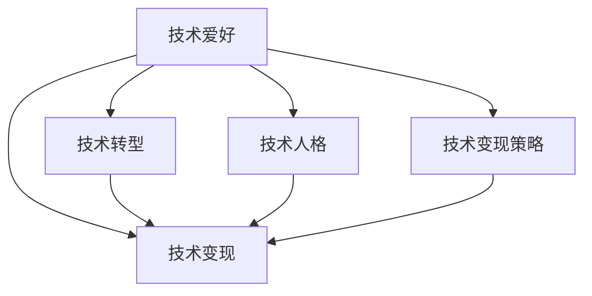

                 

# 技术博客：从爱好到主要收入来源

> 关键词：技术博客, 编程爱好, 技术转型, 技术变现, 人工智能, 软件开发, 技术生涯, 技术分享

## 1. 背景介绍

### 1.1 问题由来
在现代社会，技术不仅是个人兴趣的产物，更是职业发展的基石。很多技术爱好者通过学习和实践，逐步成为技术专家，甚至以此为职业，实现技术与经济的双重增长。本文将探讨技术爱好者如何从个人兴趣走向职业发展，最终实现技术的商业化。

### 1.2 问题核心关键点
从爱好到职业，从学习到变现，技术爱好者面对的主要问题包括：
- 技术兴趣的深入挖掘与细化
- 技术技能的应用场景拓展
- 技术变现途径的多样化
- 技术人格的塑造与完善
- 技术与市场的对接与融合

## 2. 核心概念与联系

### 2.1 核心概念概述

为更好地理解从技术爱好到主要收入来源的转变过程，本节将介绍几个密切相关的核心概念：

- **技术爱好(Technological Hobby)**：指个人对技术的学习、实践和应用产生的浓厚兴趣。
- **技术转型(Technological Transition)**：指技术爱好者从技术爱好逐渐转型为职业技术人员的转变过程。
- **技术变现(Technological Monetization)**：指通过技术技能和知识获取经济收入的过程，包括但不限于开发项目、技术咨询、技术培训等。
- **技术人格(Technological Persona)**：指技术爱好者在与技术的长期互动中形成的工作态度、思维方式和行为习惯。
- **技术变现策略(Technological Monetization Strategies)**：指将技术技能和知识转化为商业收入的策略和方法，如技术创业、开源项目赞助、技术博客等。

这些核心概念之间的逻辑关系可以通过以下Mermaid流程图来展示：



这个流程图展示了几者之间的联系：

1. 技术爱好通过长期实践，逐渐转变为技术专家的职业状态。
2. 技术专家通过不同策略实现技术的商业化变现。
3. 技术人格和变现策略共同影响技术专家的变现效率和成功率。

## 3. 核心算法原理 & 具体操作步骤
### 3.1 算法原理概述

从技术爱好到主要收入来源的过程，本质上是通过技术积累和技能提升，逐步实现技术的商业化变现。其核心思想是：通过技术学习和应用，不断积累经验和技能，通过各种渠道和方式将技术转化为经济收入。

形式化地，假设技术爱好者初始状态为 $S_0$，经过时间 $t$ 的学习和实践后，其状态变为 $S_t$。在这个过程中，影响技术变现的因素包括学习效率、技术积累、市场需求、变现策略等。

技术变现的过程可以建模为：
$$
S_t = f(S_{t-1}, \text{Study Efficiency}, \text{Technical Skills}, \text{Market Demand}, \text{Monetization Strategies})
$$

### 3.2 算法步骤详解

基于上述原理，技术爱好者实现技术变现的过程主要包括以下几个关键步骤：

**Step 1: 确定兴趣领域并深入学习**
- 明确个人兴趣点，选择合适的技术方向。
- 根据所选方向，获取相关的基础知识和技能，如编程语言、开发工具、算法理论等。
- 通过在线课程、书籍、博客、开源项目等多种渠道进行系统学习。

**Step 2: 积累实践经验**
- 参与开源项目，贡献代码或文档。
- 参与技术社区，分享经验和学习心得。
- 逐步建立个人技术品牌和声誉，积累技术人脉。

**Step 3: 拓展应用场景**
- 开发个人项目，积累实战经验。
- 构建技术博客，分享学习成果和实战经验。
- 参与技术培训，获取商业化经验。

**Step 4: 选择变现策略**
- 分析市场需求，选择适合的变现渠道，如技术咨询、技术培训、技术博客等。
- 设定商业目标，制定详细的变现计划和策略。

**Step 5: 执行变现计划**
- 执行技术变现策略，如参与商业项目、撰写技术书籍、开设技术培训课程等。
- 持续改进技术水平，保持技术领先性。

**Step 6: 评估和调整**
- 定期评估变现效果，反思不足之处。
- 根据市场需求和个人兴趣，调整技术方向和变现策略。

### 3.3 算法优缺点

从技术爱好到主要收入来源的过程，具有以下优点：
1. 自主性强。个人兴趣驱动，自主决策性强。
2. 自由度高。不受时间和地点的限制，灵活性大。
3. 探索性高。可以不断尝试新的技术方向和变现策略。

同时，该过程也存在一些局限：
1. 技术门槛高。需要较高的技术基础和专业能力。
2. 市场需求波动。技术变现受市场需求变化影响较大。
3. 变现周期长。从技术积累到变现需要较长的时间。
4. 竞争激烈。技术行业竞争激烈，需要不断提升自身竞争力。

尽管存在这些局限，但整体而言，从技术爱好到主要收入来源的过程仍是一个充满机遇和挑战的旅程。

### 3.4 算法应用领域

从技术爱好到主要收入来源的过程，在以下几个领域得到了广泛的应用：

- **软件开发**：通过技术学习和实践，成为优秀的软件工程师，获取高额薪酬。
- **人工智能**：利用深度学习、机器学习等技术，进行模型开发和应用，推动人工智能产业发展。
- **数据分析**：通过大数据分析、机器学习等技术，获取数据驱动的商业决策支持。
- **技术咨询**：提供专业的技术解决方案，帮助企业实现技术转型和创新。
- **技术培训**：开设技术培训班或在线课程，传授技术知识和技能。
- **技术创业**：利用技术开发新产品或服务，实现商业化应用。

## 4. 数学模型和公式 & 详细讲解  
### 4.1 数学模型构建

本节将使用数学语言对技术爱好者从爱好到主要收入来源的转变过程进行建模。

假设技术爱好者初始状态为 $S_0$，技术积累为 $T$，市场需求为 $D$，变现策略为 $M$，变现效率为 $R$。则技术变现的过程可以建模为：
$$
R = f(T, D, M)
$$

其中 $T$ 代表技术积累，包括知识储备、项目经验、社区影响力等。$D$ 代表市场需求，包括行业趋势、用户需求等。$M$ 代表变现策略，包括技术培训、开源项目赞助、技术博客等。

### 4.2 公式推导过程

以下以技术博客为例，推导技术变现的公式。

假设技术博客的访问量为 $A$，点击率为 $C$，转化率为 $T$，广告收入为 $P$。则技术博客的变现收入可以建模为：
$$
R = A \times C \times T \times P
$$

其中 $A$ 代表博客访问量，$C$ 代表点击率，$T$ 代表转化率，$P$ 代表广告收入。

进一步，如果技术博客每天的访问量为 $a$，则总收入 $R_{\text{total}}$ 可以表示为：
$$
R_{\text{total}} = R \times 365
$$

### 4.3 案例分析与讲解

假设某技术爱好者通过参与开源项目和撰写技术博客，掌握了较好的技术积累和社区影响力。他选择技术博客作为变现策略，并获得每天1000个访问量，点击率10%，转化率5%，广告收入1元/次。则他每天的技术变现收入为：
$$
R = 1000 \times 0.1 \times 0.05 \times 1 = 5
$$

若他持续更新博客内容，每年可获得的总收入为：
$$
R_{\text{total}} = 5 \times 365 = 1825
$$

可以看到，通过技术博客，他不仅获得了技术变现，还建立了品牌影响力，积累了更多的社区人脉。

## 5. 项目实践：代码实例和详细解释说明
### 5.1 开发环境搭建

在进行技术变现实践前，我们需要准备好开发环境。以下是使用Python进行Django开发的环境配置流程：

1. 安装Anaconda：从官网下载并安装Anaconda，用于创建独立的Python环境。

2. 创建并激活虚拟环境：
```bash
conda create -n pyblog-env python=3.8 
conda activate pyblog-env
```

3. 安装Django：
```bash
pip install django
```

4. 安装相关库：
```bash
pip install markdown django-pyblog-theme django-pyblog评论系统 markdown 图片上传 自适应响应
```

完成上述步骤后，即可在`pyblog-env`环境中开始技术博客开发。

### 5.2 源代码详细实现

这里我们以Django开发技术博客为例，给出完整的代码实现。

首先，创建Django项目和应用：

```bash
django-admin startproject pyblog
cd pyblog
python manage.py startapp blog
```

接着，定义博客模型和视图：

```python
# models.py
from django.db import models

class Article(models.Model):
    title = models.CharField(max_length=100)
    content = models.TextField()
    created_at = models.DateTimeField(auto_now_add=True)
    updated_at = models.DateTimeField(auto_now=True)

# views.py
from django.shortcuts import render
from django.http import HttpResponse

def home(request):
    articles = Article.objects.all().order_by('-created_at')
    return render(request, 'home.html', {'articles': articles})

def article(request, slug):
    article = Article.objects.get(slug=slug)
    return render(request, 'article.html', {'article': article})
```

然后，定义模板和静态文件：

```bash
mkdir blog/templates/blog
mkdir blog/static/blog
```

在`blog/templates/blog`下创建`home.html`和`article.html`模板，分别展示博客列表和文章详情：

```html
<!-- home.html -->



  <h1>最新文章</h1>
  <ul>
    
      <li><a href="">{{ article.title }}</a></li>
    
  </ul>

```

```html
<!-- article.html -->



  <h1>{{ article.title }}</h1>
  <p>{{ article.content }}</p>

```

在`blog/static/blog`下创建CSS和JavaScript文件，自定义博客样式和交互效果：

```html
<!-- style.css -->
body {
  font-family: Arial, sans-serif;
  margin: 0;
}

h1 {
  margin: 20px 0;
}

ul {
  list-style: none;
}

li {
  margin-bottom: 10px;
}

a {
  color: #0077cc;
  text-decoration: none;
}

article p {
  font-size: 16px;
  line-height: 1.5;
}

article code {
  background-color: #f8f8f8;
  padding: 5px;
  border: 1px solid #ddd;
}
```

```html
<!-- script.js -->
$(document).ready(function() {
  $('a').click(function(event) {
    event.preventDefault();
    var slug = $(this).attr('href').substring(4);
    window.location.href = '/' + slug;
  });
});
```

最后，配置URL映射和数据库：

```python
# urls.py
from django.urls import path
from . import views

urlpatterns = [
    path('', views.home, name='home'),
    path('<slug:slug>/', views.article, name='article'),
]

# settings.py
DATABASES = {
    'default': {
        'ENGINE': 'django.db.backends.sqlite3',
        'NAME': BASE_DIR / 'db.sqlite3',
    }
}
```

完成上述步骤后，即可在`pyblog-env`环境中启动技术博客服务，并通过浏览器访问。

### 5.3 代码解读与分析

让我们再详细解读一下关键代码的实现细节：

**models.py**：
- 定义了博客文章模型，包括标题、内容、创建时间和更新时间。

**views.py**：
- 定义了博客首页和文章详情视图。通过Django ORM获取数据库中的文章数据，并渲染到HTML模板中。

**home.html和article.html**：
- 分别展示博客列表和文章详情的HTML结构。

**style.css和script.js**：
- 自定义博客样式和交互效果，实现文章列表的点击跳转。

**urls.py和settings.py**：
- 配置URL映射和数据库设置。

通过Django构建技术博客，可以快速高效地实现功能丰富的博客网站，并支持用户评论、图片上传等高级功能。

### 5.4 运行结果展示

启动Django开发服务器：

```bash
python manage.py runserver
```

在浏览器中访问`http://localhost:8000/`，即可看到博客首页和文章详情页面。例如，访问`http://localhost:8000/example-slug/`，即可看到文章详情页面。

## 6. 实际应用场景
### 6.1 技术博客和知识分享
技术博客是技术爱好者展示技术成果和分享知识的重要渠道。通过博客，技术爱好者可以持续输出有价值的内容，建立个人品牌和技术声誉，吸引更多的读者和关注。

技术博客不仅可以展示个人的技术积累，还可以展示项目进展、技术分析和市场研究等内容。例如，某技术爱好者在技术博客上分享了使用深度学习进行图像识别的项目进展，吸引了大量对图像识别感兴趣的技术爱好者和从业者阅读，并提供了技术咨询和商业合作的机会。

### 6.2 开源项目贡献
开源项目是技术爱好者展示技术能力的重要平台。通过在开源项目中贡献代码、文档和测试，技术爱好者可以获得社区认可和技术经验，进一步提升自身技术水平。

某技术爱好者在GitHub上贡献了多个开源项目，积累了丰富的技术经验和项目经验。他通过参与开源项目，掌握了数据处理、机器学习、自然语言处理等前沿技术，并通过项目贡献与社区成员建立了良好的关系，成功转型为技术专家，并获得了一笔丰厚的技术咨询费用。

### 6.3 技术培训和讲座
技术培训是技术爱好者分享技术知识和经验的重要方式。通过开设技术培训班或在线课程，技术爱好者可以将自己的技术知识和经验传递给更多的学习者，获得经济收入。

某技术爱好者通过在线课程平台开设了Python和机器学习的课程，吸引了大量学生报名学习。通过课程讲授，他不仅获得了技术咨询和培训费用，还建立了个人品牌和声誉，获得了更多的商业合作机会。

### 6.4 未来应用展望

随着技术的不断发展，技术爱好者将面临更多的机遇和挑战。未来的技术爱好者将需要在以下几个方面持续努力：

1. **持续学习**：技术日新月异，技术爱好者需要不断学习和更新知识，跟上技术发展的步伐。
2. **技术创新**：技术爱好者需要不断创新，探索新的技术方向和应用场景。
3. **技术变现**：技术爱好者需要不断探索和优化变现渠道，实现技术的商业化应用。
4. **社区互动**：技术爱好者需要积极参与技术社区，建立良好的人脉关系。
5. **技术分享**：技术爱好者需要积极分享自己的技术成果和经验，提升技术影响力和品牌价值。

## 7. 工具和资源推荐
### 7.1 学习资源推荐

为了帮助技术爱好者系统掌握技术变现的理论基础和实践技巧，这里推荐一些优质的学习资源：

1. **《Web开发实战：Django实战教程》系列书籍**：系统讲解Django框架的使用，提供丰富的实战项目和代码示例。
2. **《Python网络爬虫开发实战》系列书籍**：讲解Python爬虫的开发和应用，提供大量的爬虫实战项目。
3. **《机器学习实战》系列书籍**：讲解机器学习的理论基础和实践技巧，提供大量的代码示例和实战项目。
4. **《深度学习实战》系列书籍**：讲解深度学习的前沿技术和应用，提供丰富的实战项目和代码示例。
5. **《Python编程：从入门到实践》系列书籍**：系统讲解Python编程语言的基础知识和高级技巧，提供大量的实战项目和代码示例。

通过这些资源的学习实践，相信技术爱好者可以更好地掌握技术变现的理论基础和实践技巧，将技术兴趣转化为商业收入。

### 7.2 开发工具推荐

高效的开发离不开优秀的工具支持。以下是几款用于技术变现开发的常用工具：

1. **Django框架**：Python最流行的Web框架之一，提供丰富的组件和扩展，适合快速开发Web应用。
2. **GitHub**：全球最大的开源社区，提供丰富的开源项目和协作工具，适合技术爱好者贡献代码和协作开发。
3. **Jupyter Notebook**：支持多种编程语言和交互式计算，适合技术爱好者进行数据处理、算法实验和项目管理。
4. **PyCharm**：功能强大的Python IDE，提供丰富的开发工具和调试功能，适合技术爱好者进行项目开发和代码调试。
5. **PyTorch**：开源深度学习框架，提供丰富的神经网络和优化器，适合技术爱好者进行模型开发和应用。

合理利用这些工具，可以显著提升技术变现任务的开发效率，加快创新迭代的步伐。

### 7.3 相关论文推荐

技术变现的发展源于学界的持续研究。以下是几篇奠基性的相关论文，推荐阅读：

1. **《Web开发实战：Django实战教程》书籍**：讲解Django框架的使用，提供丰富的实战项目和代码示例。
2. **《Python网络爬虫开发实战》书籍**：讲解Python爬虫的开发和应用，提供大量的爬虫实战项目。
3. **《机器学习实战》书籍**：讲解机器学习的理论基础和实践技巧，提供大量的代码示例和实战项目。
4. **《深度学习实战》书籍**：讲解深度学习的前沿技术和应用，提供丰富的实战项目和代码示例。
5. **《Python编程：从入门到实践》书籍**：系统讲解Python编程语言的基础知识和高级技巧，提供大量的实战项目和代码示例。

这些论文代表了大语言模型微调技术的发展脉络。通过学习这些前沿成果，可以帮助研究者把握学科前进方向，激发更多的创新灵感。

## 8. 总结：未来发展趋势与挑战

### 8.1 总结

本文对技术爱好者从技术爱好到主要收入来源的转变过程进行了全面系统的介绍。首先阐述了技术爱好者的技术变现过程，明确了从技术爱好到职业发展、从学习到变现的转变路径。其次，从原理到实践，详细讲解了技术变现的数学模型和关键步骤，给出了技术变现任务开发的完整代码实例。同时，本文还广泛探讨了技术变现方法在技术博客、开源项目、技术培训等多个领域的应用前景，展示了技术变现范式的巨大潜力。

通过本文的系统梳理，可以看到，技术变现方法为技术爱好者提供了一条从个人兴趣走向职业发展，从学习到变现的清晰路径。技术变现方法不仅能提升技术爱好者的生活质量，还能带动技术行业的发展，推动技术创新和产业升级。未来，伴随技术的不断发展，技术变现方法也将更加多样化和高效化，成为技术爱好者实现职业发展的核心手段。

### 8.2 未来发展趋势

展望未来，技术变现方法将呈现以下几个发展趋势：

1. **技术变现的多样化**：随着技术领域的发展，技术变现渠道将更加多样化，如技术咨询、技术培训、开源项目赞助、技术博客等。技术爱好者可以灵活选择不同的变现方式，最大化自身价值。

2. **技术变现的精准化**：未来技术变现将更加精准化和个性化，技术爱好者可以通过精准定位市场需求，实现更高效的变现。

3. **技术变现的智能化**：随着AI和大数据技术的不断发展，技术变现将更加智能化和自动化，技术爱好者可以通过智能算法和自动化工具，实现更高效的技术变现。

4. **技术变现的全球化**：未来技术变现将更加全球化，技术爱好者可以跨地域、跨文化开展技术变现，获得更广阔的市场空间。

以上趋势凸显了技术变现方法的广阔前景。这些方向的探索发展，必将进一步提升技术变现的效率和成功率，为技术爱好者提供更多的发展机会。

### 8.3 面临的挑战

尽管技术变现方法已经取得了一定的成功，但在迈向更加智能化、普适化应用的过程中，它仍面临诸多挑战：

1. **技术门槛高**：技术变现需要较高的技术基础和专业能力，对于技术爱好者来说，需要不断学习和提升。
2. **市场需求波动**：技术变现受市场需求变化影响较大，技术爱好者需要敏锐捕捉市场需求变化，及时调整变现策略。
3. **竞争激烈**：技术变现市场竞争激烈，技术爱好者需要不断提升自身竞争力，才能在市场中脱颖而出。
4. **技术变现效率低**：技术变现过程涉及多个环节，如技术积累、市场分析、变现策略等，技术爱好者需要不断优化各环节，提升变现效率。
5. **技术安全风险**：技术变现过程中涉及敏感数据和技术秘密，技术爱好者需要加强技术安全防护，避免数据泄露和知识产权纠纷。

### 8.4 研究展望

面对技术变现面临的挑战，未来的研究需要在以下几个方面寻求新的突破：

1. **技术变现的自动化**：开发更加智能化的技术变现工具，实现技术变现的自动化，降低技术爱好者的工作量。
2. **技术变现的多模态融合**：将视觉、语音、文本等多模态数据融合，实现更加全面和精准的技术变现。
3. **技术变现的跨领域融合**：将技术变现与物联网、区块链等前沿技术结合，实现技术变现的跨领域应用。
4. **技术变现的全球化**：推动技术变现的全球化，建立技术变现的国际标准和合作机制，实现全球化技术变现。
5. **技术变现的社会化**：将技术变现与社会公益结合，推动技术变现的社会化应用，实现技术变现的社会价值。

这些研究方向的探索，必将引领技术变现方法迈向更高的台阶，为技术爱好者提供更多的发展机会和更大的人生价值。

## 9. 附录：常见问题与解答

**Q1：技术变现对技术爱好者有哪些影响？**

A: 技术变现对技术爱好者有以下影响：
1. **经济收益**：通过技术变现，技术爱好者可以获得丰厚的经济收入，提升生活质量。
2. **技术提升**：技术变现过程中需要不断学习和提升，技术爱好者可以积累更多的技术经验和知识。
3. **社会影响力**：技术变现过程中需要积极参与技术社区和市场，技术爱好者可以提升社会影响力和品牌价值。
4. **职业发展**：技术变现可以为技术爱好者提供更多的职业机会和发展空间，推动技术行业的发展。

**Q2：如何选择合适的技术变现方式？**

A: 选择合适的技术变现方式需要考虑以下几个因素：
1. **技术积累**：技术爱好者应选择与自身技术积累相匹配的变现方式，如技术博客、开源项目、技术培训等。
2. **市场需求**：技术爱好者应选择市场需求旺盛的变现方式，如人工智能、大数据、机器学习等前沿技术。
3. **个人兴趣**：技术爱好者应选择符合自身兴趣和爱好的变现方式，如编程、数据科学、图像处理等。
4. **变现效率**：技术爱好者应选择变现效率高的变现方式，如技术培训、技术咨询、技术博客等。

**Q3：技术变现过程中需要注意哪些问题？**

A: 技术变现过程中需要注意以下几个问题：
1. **技术安全**：技术爱好者需要加强技术安全防护，避免数据泄露和知识产权纠纷。
2. **市场变化**：技术爱好者需要敏锐捕捉市场需求变化，及时调整变现策略。
3. **个人品牌**：技术爱好者需要建立和维护个人品牌，提升技术影响力和市场认知度。
4. **技术创新**：技术爱好者需要不断创新，探索新的技术方向和应用场景，保持技术领先性。
5. **用户反馈**：技术爱好者需要重视用户反馈，不断优化产品和服务，提升用户体验和满意度。

**Q4：如何提升技术变现的效率？**

A: 提升技术变现的效率需要从以下几个方面入手：
1. **技术积累**：技术爱好者需要不断学习和提升技术水平，积累丰富的技术经验和知识。
2. **市场需求**：技术爱好者需要敏锐捕捉市场需求变化，选择高效的市场变现方式。
3. **技术工具**：技术爱好者需要利用先进的技术工具，如Django框架、GitHub等，提升技术变现的效率。
4. **社区互动**：技术爱好者需要积极参与技术社区，建立良好的人脉关系，获取更多的变现机会。
5. **技术变现模式**：技术爱好者需要灵活选择不同的技术变现模式，如技术博客、开源项目、技术培训等，实现技术变现的多样化和精准化。

通过综合考虑以上因素，技术爱好者可以提升技术变现的效率和成功率，实现技术的商业化应用。

---

作者：禅与计算机程序设计艺术 / Zen and the Art of Computer Programming

