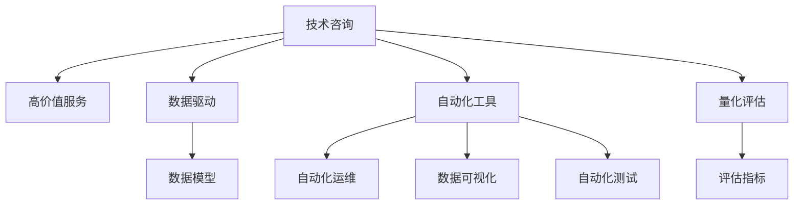

                 

# 技术咨询：高价值服务的提供

> 关键词：技术咨询, 高价值服务, 核心概念, 算法原理, 操作步骤, 应用领域, 模型构建, 公式推导, 代码实例, 应用场景, 资源推荐, 发展趋势, 面临挑战, 研究展望, 常见问题

## 1. 背景介绍

### 1.1 问题由来
在数字化转型的大背景下，企业对技术咨询的需求日益增长。传统IT咨询往往依赖于人力成本和技术积累，而在互联网时代，技术咨询的高效、可扩展性成为企业提升核心竞争力的关键。高价值技术咨询服务的提供，不仅可以降低企业技术风险，加速创新进程，还能提升业务效益，驱动企业持续发展。

### 1.2 问题核心关键点
本文聚焦于如何提供高价值的咨询服务，具体涵盖以下几个关键点：
1. **技术方案设计**：从复杂多变的需求中提取共性问题，设计可复用的解决方案。
2. **咨询模型构建**：构建基于数据驱动的咨询模型，提高咨询的精准性和可靠性。
3. **咨询过程优化**：引入自动化工具和最佳实践，提升咨询的效率和质量。
4. **咨询结果验证**：通过量化指标评估咨询效果，不断迭代优化咨询模型。

### 1.3 问题研究意义
本文旨在探讨如何通过技术咨询帮助企业解决实际问题，提升其数字化转型能力。通过系统介绍技术咨询的核心理念、工具、流程和评估指标，为技术咨询行业的从业者提供全面的指导，助力企业实现更高效、更可持续的数字化发展。

## 2. 核心概念与联系

### 2.1 核心概念概述

为更好地理解高价值技术咨询服务的提供，本节将介绍几个密切相关的核心概念：

- **技术咨询**：一种专业服务，通过分析企业业务场景，提供定制化的技术解决方案。
- **高价值服务**：指能够快速解决企业核心问题，提高业务效率和客户满意度的技术咨询。
- **数据驱动**：利用数据模型和算法，基于事实和证据而非主观判断提供咨询建议。
- **自动化工具**：采用工具如自动化运维、数据可视化、自动化测试等，提高咨询效率和质量。
- **量化评估**：通过设定明确的评估指标，衡量咨询方案的效果，不断迭代优化咨询过程。

这些核心概念之间的逻辑关系可以通过以下Mermaid流程图来展示：



这个流程图展示了几类核心概念及其之间的关系：

1. 技术咨询是服务核心，通过高价值服务帮助企业解决实际问题。
2. 数据驱动提供科学依据，构建基于数据的咨询模型。
3. 自动化工具提升效率和质量，引入技术手段辅助咨询过程。
4. 量化评估提供客观标准，持续优化咨询方案。

这些概念共同构成了高价值技术咨询服务的提供框架，使其能够系统化、规范化地为各行业客户提供服务。

## 3. 核心算法原理 & 具体操作步骤
### 3.1 算法原理概述

高价值技术咨询服务的提供，本质上是将复杂问题分解为可执行步骤，通过科学方法论和技术工具解决实际问题。其核心算法原理包括：

- **问题建模**：将企业需求转化为数学模型或计算图，进行结构化处理。
- **模型优化**：基于模型优化算法，寻找最优解决方案。
- **算法选择**：根据问题类型选择最适合的算法和工具，如优化算法、机器学习、深度学习等。
- **方案执行**：将算法结果转化为可执行的方案，进行系统集成和部署。
- **效果评估**：通过设定量化指标，评估咨询方案的效果，进行迭代优化。

### 3.2 算法步骤详解

高价值技术咨询服务提供的主要步骤如下：

**Step 1: 需求分析与问题建模**
- 收集企业需求和业务场景，进行详细需求分析。
- 构建问题模型，将需求转化为可执行步骤和算法输入。

**Step 2: 咨询模型构建**
- 选择合适的算法和模型，进行模型构建和训练。
- 在模型训练过程中，应用特征工程、超参数调优等技术。
- 对模型进行验证和测试，确保模型的稳定性和泛化能力。

**Step 3: 方案设计与技术评估**
- 根据模型输出结果，设计详细的技术方案。
- 引入自动化工具，提升方案的可执行性。
- 对技术方案进行全面评估，包括技术风险、成本效益等。

**Step 4: 方案实施与效果评估**
- 根据技术方案，进行系统集成和部署。
- 设置效果评估指标，监控咨询方案的实施效果。
- 根据评估结果，进行方案优化和迭代。

### 3.3 算法优缺点

高价值技术咨询服务提供的算法具有以下优点：
1. 科学客观：通过数据驱动和算法优化，提供科学可靠的咨询方案。
2. 可复用性：基于数据驱动的模型和算法，提高方案的通用性和可复用性。
3. 高效性：引入自动化工具，提升咨询方案的执行效率和质量。
4. 可视化：通过数据可视化工具，帮助企业理解咨询方案的效果和改进方向。

同时，该算法也存在以下局限性：
1. 数据质量要求高：高质量的数据是模型优化的前提，数据缺失或不准确会影响咨询效果。
2. 模型复杂度高：复杂问题可能涉及多种算法，模型构建和优化需要较高的技术水平。
3. 实施成本高：部分复杂方案的实施可能涉及大量的人力物力，实施成本较高。
4. 效果评估难：部分咨询效果的评估较为复杂，可能需要多维度衡量。

尽管存在这些局限性，但就目前而言，数据驱动和算法优化仍是提供高价值技术咨询的主要方法，有助于实现咨询服务的科学化和专业化。

### 3.4 算法应用领域

高价值技术咨询服务在多个领域得到了广泛应用，具体包括：

1. **云计算架构设计**：为企业设计高效稳定的云架构，优化资源配置。
2. **大数据平台建设**：构建企业级大数据平台，提升数据处理和分析能力。
3. **数字化营销策略**：通过数据分析，提供个性化的营销策略，提升客户转化率。
4. **智能制造系统**：通过工业互联网平台，优化生产流程，提高生产效率。
5. **企业数据治理**：规划数据治理方案，提升数据质量和管理效率。
6. **人工智能应用**：基于AI技术，解决企业实际问题，提升业务智能化水平。

此外，高价值技术咨询服务还在企业治理、金融科技、医疗健康等领域广泛应用，为各行业带来新的创新和突破。

## 4. 数学模型和公式 & 详细讲解 & 举例说明

### 4.1 数学模型构建

在高价值技术咨询服务提供过程中，常见的数学模型包括线性回归、决策树、支持向量机、神经网络等。这里以线性回归模型为例，介绍如何通过数学模型构建解决企业实际问题。

假设企业有一个销售额$Y$与广告支出$X$的关系，目标是找到最佳广告支出，以最大化销售额。设$Y$与$X$之间存在线性关系：

$$ Y = \alpha + \beta X + \epsilon $$

其中$\alpha$为截距，$\beta$为斜率，$\epsilon$为误差项。

### 4.2 公式推导过程

根据最小二乘法，求解线性回归模型的参数$\alpha$和$\beta$：

1. 求出$\hat{Y}$的均值和方差：
$$ \bar{Y} = \frac{1}{N} \sum_{i=1}^N Y_i $$
$$ \sigma^2 = \frac{1}{N-2} \sum_{i=1}^N (Y_i - \bar{Y})^2 $$

2. 求解参数：
$$ \hat{\beta} = \frac{\sum_{i=1}^N (X_i - \bar{X})(Y_i - \bar{Y})}{\sum_{i=1}^N (X_i - \bar{X})^2} $$
$$ \hat{\alpha} = \bar{Y} - \hat{\beta} \bar{X} $$

3. 计算预测值：
$$ \hat{Y} = \hat{\alpha} + \hat{\beta} X $$

### 4.3 案例分析与讲解

假设某电商平台希望通过增加广告支出提高销售额。根据历史数据，收集到如下数据：

| 广告支出(X) | 销售额(Y) |
| ----------- | --------- |
| 0           | 10000     |
| 500         | 11000     |
| 1000        | 12000     |
| 1500        | 13000     |
| 2000        | 14000     |
| 2500        | 15000     |
| 3000        | 16000     |

1. 根据数据计算$\hat{\beta}$和$\hat{\alpha}$：
$$ \bar{X} = \frac{1}{N} \sum_{i=1}^N X_i = 1500 $$
$$ \bar{Y} = \frac{1}{N} \sum_{i=1}^N Y_i = 12000 $$
$$ \sum_{i=1}^N (X_i - \bar{X})^2 = \frac{1}{N} \sum_{i=1}^N X_i^2 - \bar{X}^2 = 375000 $$
$$ \sum_{i=1}^N (X_i - \bar{X})(Y_i - \bar{Y}) = \frac{1}{N} \sum_{i=1}^N X_iY_i - \bar{X}\bar{Y} = 450000 $$
$$ \sigma^2 = \frac{1}{N-2} \sum_{i=1}^N (Y_i - \bar{Y})^2 = 10000 $$
$$ \hat{\beta} = \frac{450000}{375000} = 1.2 $$
$$ \hat{\alpha} = \bar{Y} - \hat{\beta} \bar{X} = 12000 - 1.2 \times 1500 = 9000 $$

2. 计算预测销售额：
$$ \hat{Y} = 9000 + 1.2X $$
当$X=2000$时，$Y=9000+1.2 \times 2000 = 12000$

通过以上步骤，我们可以得出最佳的广告支出为2000元，能够将销售额提高至12000元，从而为企业提供了高价值的决策建议。

## 5. 项目实践：代码实例和详细解释说明

### 5.1 开发环境搭建

在进行高价值技术咨询服务提供的项目实践前，我们需要准备好开发环境。以下是使用Python进行Scikit-learn开发的Python环境配置流程：

1. 安装Anaconda：从官网下载并安装Anaconda，用于创建独立的Python环境。

2. 创建并激活虚拟环境：
```bash
conda create -n sklearn-env python=3.8 
conda activate sklearn-env
```

3. 安装Scikit-learn：
```bash
pip install scikit-learn
```

4. 安装各类工具包：
```bash
pip install numpy pandas matplotlib seaborn
```

完成上述步骤后，即可在`sklearn-env`环境中开始项目实践。

### 5.2 源代码详细实现

这里我们以线性回归模型为例，给出使用Scikit-learn进行数据分析和模型构建的Python代码实现。

首先，定义数据集和模型参数：

```python
import numpy as np
from sklearn.linear_model import LinearRegression
from sklearn.metrics import mean_squared_error
from sklearn.model_selection import train_test_split

# 数据集
X = np.array([[0], [500], [1000], [1500], [2000], [2500], [3000]])
y = np.array([10000, 11000, 12000, 13000, 14000, 15000, 16000])

# 划分训练集和测试集
X_train, X_test, y_train, y_test = train_test_split(X, y, test_size=0.2, random_state=42)

# 定义模型
model = LinearRegression()
```

然后，拟合模型并进行评估：

```python
# 拟合模型
model.fit(X_train, y_train)

# 预测测试集
y_pred = model.predict(X_test)

# 计算评估指标
mse = mean_squared_error(y_test, y_pred)
rmse = np.sqrt(mse)
print(f"RMSE: {rmse:.2f}")
```

最后，输出模型预测结果：

```python
# 预测广告支出为2000元时的销售额
X_new = np.array([2000])
y_new = model.predict(X_new)
print(f"当广告支出为2000元时，预测销售额为{y_new[0]:.2f}元")
```

以上就是使用Scikit-learn进行线性回归模型构建和评估的完整代码实现。可以看到，Scikit-learn库提供了丰富的机器学习工具，使得模型构建和评估过程变得简洁高效。

### 5.3 代码解读与分析

让我们再详细解读一下关键代码的实现细节：

**X和y数据集**：
- 定义为二维数组，每个元素表示一个样本。

**train_test_split函数**：
- 用于将数据集划分为训练集和测试集，测试集占比20%，随机状态设置为42。

**LinearRegression模型**：
- 使用Scikit-learn库中的LinearRegression类，初始化线性回归模型。

**fit方法**：
- 使用训练集数据拟合模型，计算出最优的斜率和截距。

**predict方法**：
- 使用测试集数据预测模型输出。

**mean_squared_error函数**：
- 计算预测值与真实值之间的均方误差。

**rmse计算**：
- 计算均方误差平方根，得到均方根误差(RMSE)，衡量模型预测的准确性。

通过以上步骤，我们完成了线性回归模型的构建和评估，得到了最佳的广告支出和预测销售额，为企业提供了高价值的技术咨询建议。

## 6. 实际应用场景

### 6.1 金融风险管理

金融领域对风险管理的需求日益增加。通过高价值技术咨询，金融机构可以更准确地评估和管理风险，提升投资回报率。

在金融风险管理中，可以通过分析历史交易数据和市场动态，建立风险预测模型。通过模型分析，企业可以实时监控风险水平，及时调整投资策略，降低潜在的金融风险。

### 6.2 供应链优化

供应链管理涉及多个环节，包括采购、库存、物流等，优化效率对于企业成本控制和市场响应速度至关重要。通过高价值技术咨询，企业可以设计出更高效的供应链管理方案。

例如，通过分析历史销售数据和库存水平，建立预测模型，可以优化库存管理和采购计划，减少库存积压和缺货情况，提升供应链响应速度。

### 6.3 智能制造

智能制造是制造业转型的重要方向，通过高价值技术咨询，企业可以提升生产效率和产品质量。

例如，通过分析生产流程中的各项指标，建立优化模型，可以优化生产调度、资源配置，减少生产停机时间，提升产品一致性。

### 6.4 未来应用展望

随着数据科学和人工智能技术的不断进步，高价值技术咨询服务将会在更多领域得到应用，带来颠覆性变革：

1. **智慧城市管理**：通过数据分析，优化城市资源配置，提升城市运行效率。
2. **医疗健康决策**：通过大数据分析，提供个性化的医疗方案，提升患者健康水平。
3. **教育培训优化**：通过数据分析，提供定制化的培训方案，提升教育效果。
4. **智能交通管理**：通过数据分析，优化交通流量，提升道路通行效率。
5. **农业智能化**：通过数据分析，优化种植方案，提升农业生产效率。

以上场景展示了高价值技术咨询服务的广泛应用前景，随着技术的不断进步，将会有更多领域受益于科学化和智能化的咨询服务。

## 7. 工具和资源推荐

### 7.1 学习资源推荐

为了帮助开发者系统掌握高价值技术咨询服务的提供，这里推荐一些优质的学习资源：

1. 《Python机器学习》书籍：详细介绍了机器学习算法和Python编程，涵盖数据驱动的咨询模型构建。
2. 《数据科学导论》课程：由Coursera提供的入门级数据科学课程，涵盖数据处理、特征工程、模型评估等核心内容。
3. 《Scikit-learn实战》书籍：深入浅出地介绍了Scikit-learn库的使用方法，帮助用户快速上手构建和评估模型。
4. Kaggle平台：提供大量的数据集和机器学习竞赛，帮助用户提升实践能力，学习数据驱动的咨询模型构建。
5. TensorFlow官方文档：详细介绍了TensorFlow库的使用方法，涵盖深度学习模型的构建和优化。

通过学习这些资源，相信你一定能够快速掌握高价值技术咨询服务的提供，并用于解决实际的业务问题。

### 7.2 开发工具推荐

高效的开发离不开优秀的工具支持。以下是几款用于高价值技术咨询服务的常用工具：

1. Python：作为数据科学和机器学习的主流语言，Python具有强大的库支持和丰富的科学计算能力。
2. Scikit-learn：开源的机器学习库，提供了丰富的算法和工具，方便用户构建和评估模型。
3. TensorFlow：由Google开发的深度学习框架，生产部署方便，适合大规模工程应用。
4. Kaggle平台：提供丰富的数据集和竞赛，帮助用户实践和提升数据驱动的咨询服务。
5. Tableau和PowerBI：强大的数据可视化工具，帮助用户将模型结果转化为直观的可视化报告，提升咨询效果。

合理利用这些工具，可以显著提升高价值技术咨询服务的开发效率，加快创新迭代的步伐。

### 7.3 相关论文推荐

高价值技术咨询服务的提供源于学界的持续研究。以下是几篇奠基性的相关论文，推荐阅读：

1. "The Elements of Statistical Learning"：详细介绍了机器学习算法和理论基础，是数据科学领域的重要参考书籍。
2. "Predictive Analytics"：介绍了数据驱动决策的实践方法，帮助企业通过数据分析提升业务效果。
3. "Machine Learning Yearning"：由Google AI负责人Andrew Ng撰写，深入浅出地介绍了机器学习模型的构建和评估方法。
4. "Deep Learning"：由Ian Goodfellow等人撰写，介绍了深度学习模型的构建和优化方法，帮助用户掌握最新的技术进展。
5. "Data Science for Business"：由Foster Provost和Tom Fawcett撰写，介绍了数据科学在商业决策中的应用，帮助用户提升数据驱动的咨询服务质量。

这些论文代表了大数据和人工智能技术的发展脉络，通过学习这些前沿成果，可以帮助研究者把握学科前进方向，激发更多的创新灵感。

## 8. 总结：未来发展趋势与挑战

### 8.1 总结

本文对高价值技术咨询服务的提供进行了全面系统的介绍。首先阐述了技术咨询的核心概念和高价值服务的定义，明确了数据驱动和算法优化的重要性。其次，从原理到实践，详细讲解了高价值技术咨询的数学模型构建和算法步骤，给出了具体项目实践的代码实例。同时，本文还广泛探讨了高价值咨询在多个领域的应用前景，展示了其广阔的应用空间。

通过本文的系统梳理，可以看到，高价值技术咨询服务的提供是一个系统化的过程，需要从数据驱动、模型优化、方案设计、效果评估等多个环节协同推进。只有系统化地应用科学方法论和技术工具，才能实现高价值咨询服务的稳定和高效提供。

### 8.2 未来发展趋势

展望未来，高价值技术咨询服务将呈现以下几个发展趋势：

1. **自动化和智能化**：通过引入自动化工具和人工智能技术，提升咨询的效率和效果，提供更个性化的解决方案。
2. **跨领域融合**：将数据科学、人工智能、物联网等技术融合，提供更全面、更深入的咨询服务。
3. **云平台支持**：通过云平台支持，实现数据和模型的分布式部署，提高咨询服务的可扩展性和灵活性。
4. **实时数据处理**：通过实时数据处理技术，提供更快速、更准确的咨询建议，提升企业决策的实时性和精确性。
5. **伦理和安全**：注重数据安全和伦理问题，保护企业隐私和数据安全，提升咨询服务的可信度和可靠性。

以上趋势凸显了高价值技术咨询服务的未来发展方向，将为各行各业带来更多的创新和突破，推动业务数字化转型。

### 8.3 面临的挑战

尽管高价值技术咨询服务已经取得了显著成就，但在迈向更加智能化、普适化应用的过程中，仍面临诸多挑战：

1. **数据质量**：高质量的数据是模型优化的前提，数据缺失或不准确会影响咨询效果。
2. **模型复杂度**：复杂问题可能涉及多种算法，模型构建和优化需要较高的技术水平。
3. **实施成本**：部分复杂方案的实施可能涉及大量的人力物力，实施成本较高。
4. **效果评估**：部分咨询效果的评估较为复杂，可能需要多维度衡量。
5. **伦理和安全**：数据安全和伦理问题，保护企业隐私和数据安全，提升咨询服务的可信度和可靠性。

尽管存在这些挑战，但随着技术的不断进步和应用的广泛推广，高价值技术咨询服务必将在更多的行业得到应用，为各行业带来新的创新和突破。

### 8.4 研究展望

面对高价值技术咨询服务面临的种种挑战，未来的研究需要在以下几个方面寻求新的突破：

1. **数据治理**：研究数据质量提升和数据治理方法，确保数据的高质量和一致性。
2. **模型优化**：开发更加高效和可解释的模型，提升模型的稳定性和可扩展性。
3. **自动化工具**：开发更丰富的自动化工具和平台，提升咨询服务的效率和质量。
4. **实时处理**：研究实时数据处理和分析技术，提供更快速、更准确的咨询建议。
5. **伦理和安全**：研究数据安全和伦理问题，保护企业隐私和数据安全，提升咨询服务的可信度和可靠性。

这些研究方向的探索，必将引领高价值技术咨询服务的进一步发展，为各行业带来更多的创新和突破，推动业务数字化转型。

## 9. 附录：常见问题与解答

**Q1: 高价值技术咨询服务的核心是什么？**

A: 高价值技术咨询服务的核心是通过数据驱动和算法优化，提供科学可靠的咨询方案。具体而言，包括问题建模、模型构建、方案设计、效果评估等多个环节，旨在帮助企业解决实际问题，提升业务效率和客户满意度。

**Q2: 如何评估高价值技术咨询服务的质量？**

A: 高价值技术咨询服务的质量评估可以通过以下几个维度进行：
1. **准确性**：模型预测结果与实际结果的偏差，可以通过均方误差、均方根误差等指标进行评估。
2. **鲁棒性**：模型在不同数据集和环境下的表现稳定性，可以通过交叉验证、稳健性测试等方法进行评估。
3. **可解释性**：模型的决策过程是否透明、可解释，可以通过模型可视化、因果分析等方法进行评估。
4. **可复用性**：模型的通用性和可复用性，可以通过在不同场景下的应用效果进行评估。
5. **经济效益**：模型应用后的业务效益提升，可以通过前后对比、ROI评估等方法进行评估。

**Q3: 高价值技术咨询服务如何提升企业竞争力？**

A: 高价值技术咨询服务可以通过以下几个方面提升企业竞争力：
1. **数据驱动决策**：通过数据分析，提供科学可靠的决策依据，减少决策偏差。
2. **优化业务流程**：通过模型优化，提升业务流程效率，减少运营成本。
3. **提升客户满意度**：通过个性化服务，提升客户体验和忠诚度。
4. **风险管理**：通过风险预测和控制，降低潜在风险，提高企业抗风险能力。
5. **创新驱动**：通过创新咨询方案，推动业务创新和转型，提升市场竞争力。

**Q4: 高价值技术咨询服务有哪些应用场景？**

A: 高价值技术咨询服务在多个领域得到了广泛应用，具体包括：
1. **金融风险管理**：通过数据分析，优化投资策略，降低金融风险。
2. **供应链优化**：通过模型优化，提升供应链管理效率，降低成本。
3. **智能制造**：通过数据分析，优化生产流程，提升生产效率和产品质量。
4. **医疗健康决策**：通过数据分析，提供个性化的医疗方案，提升患者健康水平。
5. **教育培训优化**：通过数据分析，提供定制化的培训方案，提升教育效果。

**Q5: 如何提高高价值技术咨询服务的可复用性？**

A: 提高高价值技术咨询服务的可复用性，可以通过以下几个方面进行改进：
1. **通用模型构建**：选择通用性强、可扩展性高的模型，进行模块化设计和开发。
2. **特征工程**：通过特征选择和提取，构建更具代表性的特征集合，提升模型泛化能力。
3. **超参数调优**：通过系统化的超参数调优，找到最优参数组合，提升模型稳定性和性能。
4. **模型部署**：通过云平台、微服务等技术，实现模型快速部署和更新，提升模型可复用性。
5. **文档和标准化**：制定详细的操作文档和标准化流程，提升咨询服务的规范性和一致性。

这些改进措施将有助于提高高价值技术咨询服务的可复用性，实现更高效、更稳定的咨询服务提供。

---

作者：禅与计算机程序设计艺术 / Zen and the Art of Computer Programming

