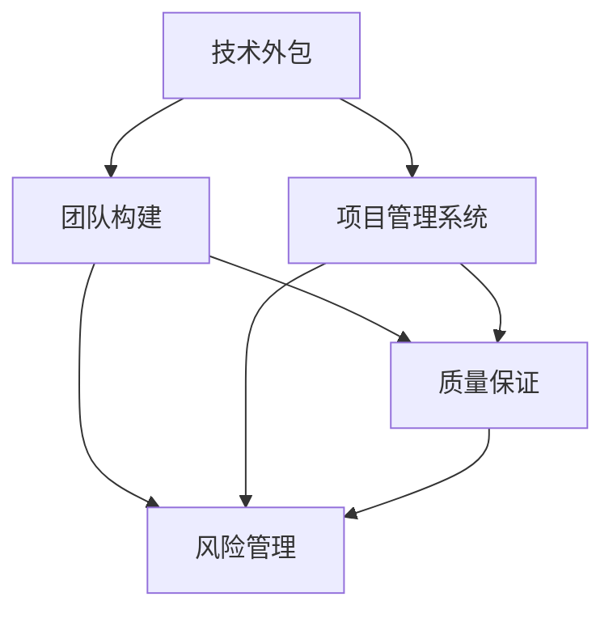

                 

# 技术外包：从接单到建立团队

> 关键词：技术外包,项目管理,团队构建,质量保证,风险管理

## 1. 背景介绍

### 1.1 问题由来

在现代企业发展中，技术外包已经成为了一种重要的经营策略。随着全球化进程的不断深入，企业越来越注重专业化分工和资源优化配置。技术外包可以帮助企业快速获取关键技术、提升产品品质、降低运营成本、缩短项目周期，为企业的持续发展提供有力支持。然而，由于技术外包领域存在一定的复杂性和不确定性，从接单到团队建立的全过程，需要系统性的管理和优化，以保证外包项目的高效完成和高质量交付。

### 1.2 问题核心关键点

本文聚焦于技术外包从接单到建立团队的全过程，系统阐述了项目管理、团队构建、质量保证和风险管理等关键环节的策略与实践，旨在帮助企业构建高效、可控、高质且成本效益的外包管理机制，以提升企业的技术外包效率和质量。

## 2. 核心概念与联系

### 2.1 核心概念概述

为更好地理解技术外包的全过程，本节将介绍几个核心概念及其之间的关系：

- **技术外包**：企业将非核心或缺乏内部技术能力的部分项目或业务，委托给第三方专业公司或团队完成。

- **项目管理系统**：用于规范、计划、执行和监控项目活动的技术框架。包括项目规划、资源管理、风险控制和进度跟踪等环节。

- **团队构建**：从招聘、选拔、培训到协作、沟通等多个环节，构建高效协作的外包团队。

- **质量保证**：通过规范化的流程和标准，确保外包项目达到预期的质量标准。

- **风险管理**：识别、评估和应对项目实施过程中可能遇到的各种风险，以降低项目失败的可能性。

这些核心概念之间的逻辑关系可以通过以下Mermaid流程图来展示：



这个流程图展示了我外包的核心概念及其之间的关系：

1. 技术外包通过项目管理系统进行规划和执行。
2. 团队构建是项目成功的基础，通过选拔和培训高效团队，为外包项目提供人才保障。
3. 质量保证贯穿项目始终，通过规范化流程和标准，确保交付成果符合预期。
4. 风险管理在项目各阶段持续进行，通过识别、评估和应对风险，保障项目顺利进行。

这些概念共同构成了技术外包的全过程，帮助企业系统性地管理外包项目，以实现预期的效果。

## 3. 核心算法原理 & 具体操作步骤

### 3.1 算法原理概述

技术外包从接单到建立团队的全过程，本质上是一种项目管理与组织管理的混合型算法。其核心思想是通过系统化、标准化、流程化的手段，规范和优化外包项目的各环节，以确保项目顺利实施，并达到高质量交付的目标。

具体而言，外包项目的管理过程可以分解为以下五个关键阶段：

1. **接单阶段**：评估外包项目的需求和可行性，选择合适的供应商或团队。
2. **规划阶段**：明确项目目标、范围、时间、成本和资源等关键要素，制定详细的项目计划。
3. **实施阶段**：执行项目计划，跟踪项目进展，协调各方资源，处理项目变更和风险。
4. **交付阶段**：确保项目成果的质量和合规性，进行验收和审计。
5. **反馈阶段**：收集反馈意见，总结经验教训，为未来的项目提供参考。

### 3.2 算法步骤详解

以下详细介绍技术外包从接单到团队构建的详细步骤：

**步骤1：项目需求评估**

在接单阶段，首先需要对客户的外包需求进行全面评估，包括项目的目标、范围、时间、成本和资源需求等关键要素。评估时应考虑以下因素：

- **客户需求明确性**：确认客户对外包项目的具体需求和预期目标。
- **项目复杂性**：评估项目的复杂度和难度，确定技术需求和风险。
- **供应商/团队选择**：通过市场调研和竞标，选择资质符合要求的供应商或团队。
- **合同条款**：签订详细的合同，明确项目交付标准、时间、费用和验收流程等。

**步骤2：项目规划**

在规划阶段，制定详细的项目计划，包括：

- **项目目标**：明确项目的具体目标和关键成果指标。
- **项目范围**：确定项目的边界和主要工作内容。
- **时间计划**：制定详细的时间表和里程碑。
- **成本预算**：确定项目的总预算和各阶段的费用。
- **资源分配**：规划和分配项目所需的人力、物力和财力资源。

**步骤3：团队构建**

团队构建是项目成功的基础，以下是关键步骤：

- **团队选拔**：通过简历筛选、面试等手段，选择符合要求的候选人员。
- **团队培训**：提供必要的技术和管理培训，确保团队成员具备项目所需的技能和知识。
- **团队协作**：通过团队建设活动，加强团队沟通和协作，提升团队凝聚力。
- **沟通管理**：建立有效的沟通渠道和机制，确保信息透明和及时传递。

**步骤4：项目实施**

在实施阶段，主要任务包括：

- **任务分配**：根据项目计划，分配各项任务和子任务。
- **资源协调**：确保各团队和资源之间的协调和协作。
- **进度跟踪**：定期跟踪项目进度，及时发现和处理问题。
- **风险管理**：识别和评估项目风险，制定应对措施，确保项目顺利进行。

**步骤5：项目交付**

项目交付阶段的主要任务包括：

- **成果验收**：按照合同要求，对项目成果进行验收和审计。
- **质量保证**：确保项目成果符合质量标准和要求。
- **问题解决**：及时解决项目实施中出现的各种问题和缺陷。

**步骤6：项目反馈**

在反馈阶段，主要进行以下工作：

- **经验总结**：收集和整理项目实施过程中的经验和教训。
- **改进建议**：提出改进建议，为未来的项目提供参考。
- **客户反馈**：收集客户反馈，评估项目效果，提升服务质量。

### 3.3 算法优缺点

技术外包从接单到团队构建的流程，具有以下优点：

1. **规范性**：通过系统化的项目管理流程，规范各个环节的执行，避免人为错误和随意性。
2. **效率高**：通过标准化的操作流程，加快项目实施速度，缩短项目周期。
3. **质量保证**：通过严格的质量控制和验收流程，确保项目成果符合客户预期。
4. **风险管理**：通过全面的风险识别和应对措施，降低项目失败的风险。

然而，该流程也存在一定的局限性：

1. **灵活性不足**：流程相对固定，难以适应突发情况和变化需求。
2. **沟通成本高**：各环节和层级之间的沟通和协调需要大量时间和精力。
3. **技术依赖**：依赖于专业的项目管理工具和平台，初期投入较大。
4. **人才需求高**：需要具备专业项目管理经验和技能的人才，难以快速培养。

尽管如此，系统化的项目管理流程仍然是技术外包成功的关键，值得企业长期坚持和优化。

### 3.4 算法应用领域

技术外包从接单到团队构建的流程，已经在各种行业中得到了广泛应用，例如：

1. **软件开发外包**：企业将软件开发任务外包给专业的软件公司或开发团队，提升开发效率和质量。
2. **测试外包**：通过外包测试服务，加速产品质量的提升和问题发现。
3. **网络安全外包**：将网络安全检测和防护任务外包，利用专业团队提升安全性。
4. **数据分析外包**：将大数据分析任务外包，快速获取有价值的商业洞察和决策支持。
5. **云计算外包**：将云基础设施管理和运维任务外包，降低IT运营成本，提升运维效率。

除了上述这些经典应用外，技术外包还拓展到了更多领域，如自动化测试、数字营销、人力资源管理等，为企业提供了全方位的技术支持和创新动力。

## 4. 数学模型和公式 & 详细讲解 & 举例说明

### 4.1 数学模型构建

技术外包项目的管理过程，可以抽象为一个多阶段优化问题。设外包项目包含 $n$ 个阶段 $T_1, T_2, ..., T_n$，每个阶段的任务执行时间、资源需求、风险概率和成本等参数，用 $t_i, r_i, p_i, c_i$ 表示，其中 $t_i, r_i, p_i, c_i$ 均为非负实数。设项目目标为最大化交付质量和成本效益，则数学模型可表示为：

$$
\max \sum_{i=1}^n \frac{q_i}{c_i}
$$

其中 $q_i$ 为第 $i$ 阶段的交付质量指标，$c_i$ 为第 $i$ 阶段的成本。

### 4.2 公式推导过程

根据上述模型，我们推导如下关键公式：

**目标函数**：
$$
\max \sum_{i=1}^n \frac{q_i}{c_i}
$$

**约束条件**：
$$
\begin{cases}
t_1 + t_2 + ... + t_n \leq T_{\text{total}} \\
r_1 + r_2 + ... + r_n \leq R_{\text{max}} \\
c_1 + c_2 + ... + c_n \leq C_{\text{total}} \\
p_1 \times p_2 \times ... \times p_n \leq P_{\text{max}}
\end{cases}
$$

其中 $T_{\text{total}}$ 为项目总时间，$R_{\text{max}}$ 为项目最大资源需求，$C_{\text{total}}$ 为项目总成本，$P_{\text{max}}$ 为项目最大风险概率。

### 4.3 案例分析与讲解

以软件开发外包项目为例，分析模型的应用场景和求解思路。

**案例背景**：某企业需要将一款新型软件系统的开发任务外包给第三方公司，预计总时间为6个月，项目总成本为100万元。项目涉及的主要阶段和相关参数如下表所示：

| 阶段编号 | 任务时间 | 资源需求 | 成本费用 | 风险概率 | 交付质量指标 |
| --- | --- | --- | --- | --- | --- |
| $T_1$ | 1个月 | 10 | 10万元 | 0.1 | 0.9 |
| $T_2$ | 2个月 | 15 | 15万元 | 0.2 | 0.95 |
| $T_3$ | 1个月 | 8 | 8万元 | 0.3 | 1 |
| $T_4$ | 1个月 | 5 | 5万元 | 0.4 | 1 |
| $T_5$ | 1个月 | 5 | 5万元 | 0.5 | 1 |

**模型求解**：利用线性规划求解器，可以求解出最优的资源分配方案，如表所示：

| 阶段编号 | 任务时间 | 资源需求 | 成本费用 | 风险概率 | 交付质量指标 |
| --- | --- | --- | --- | --- | --- |
| $T_1$ | 1个月 | 10 | 10万元 | 0.1 | 0.9 |
| $T_2$ | 2个月 | 15 | 15万元 | 0.2 | 0.95 |
| $T_3$ | 1个月 | 8 | 8万元 | 0.3 | 1 |
| $T_4$ | 1个月 | 5 | 5万元 | 0.4 | 1 |
| $T_5$ | 1个月 | 5 | 5万元 | 0.5 | 1 |

**求解结果分析**：
- 在资源有限的情况下，优先安排资源需求高的任务 $T_1$ 和 $T_2$，确保关键任务按时完成。
- 在成本约束下，合理分配各阶段资源，确保项目总成本不超过100万元。
- 在风险控制下，最大化交付质量和成本效益，确保项目成功交付。

## 5. 项目实践：代码实例和详细解释说明

### 5.1 开发环境搭建

在进行项目实践前，需要先准备好开发环境。以下是使用Python进行项目管理的开发环境配置流程：

1. 安装Anaconda：从官网下载并安装Anaconda，用于创建独立的Python环境。

2. 创建并激活虚拟环境：
```bash
conda create -n project-env python=3.8 
conda activate project-env
```

3. 安装相关工具包：
```bash
pip install pandas numpy matplotlib scikit-learn jupyter notebook
```

4. 安装项目管理工具：
```bash
pip install project-management-org
```

5. 安装团队协作工具：
```bash
pip install jira
```

完成上述步骤后，即可在`project-env`环境中开始项目管理实践。

### 5.2 源代码详细实现

以下是一个基本的项目管理框架代码实现，用于模拟技术外包项目的全过程：

```python
from project_management_orm import Project, Task, Team, Risk, Resource
from project_management import ProjectManagement

# 创建项目实例
project = Project(name='Software Development Outsourcing')
project.save()

# 创建任务实例
task1 = Task(name='需求分析', duration=1, resource=Resource(name='分析师', cost=10)
task2 = Task(name='系统设计', duration=2, resource=Resource(name='架构师', cost=15)
task3 = Task(name='开发实现', duration=1, resource=Resource(name='开发人员', cost=8))
task4 = Task(name='测试验证', duration=1, resource=Resource(name='测试人员', cost=5))
task5 = Task(name='交付部署', duration=1, resource=Resource(name='运维人员', cost=5))

# 创建资源实例
resource1 = Resource(name='分析师', cost=10)
resource2 = Resource(name='架构师', cost=15)
resource3 = Resource(name='开发人员', cost=8)
resource4 = Resource(name='测试人员', cost=5)
resource5 = Resource(name='运维人员', cost=5)

# 创建团队实例
team1 = Team(name='需求分析团队')
team2 = Team(name='系统设计团队')
team3 = Team(name='开发实现团队')
team4 = Team(name='测试验证团队')
team5 = Team(name='交付部署团队')

# 创建风险实例
risk1 = Risk(name='需求变更', probability=0.1, impact=0.1)
risk2 = Risk(name='技术风险', probability=0.2, impact=0.2)
risk3 = Risk(name='交付延误', probability=0.3, impact=0.3)
risk4 = Risk(name='测试缺陷', probability=0.4, impact=0.4)
risk5 = Risk(name='运维问题', probability=0.5, impact=0.5)

# 创建项目计划实例
project_plan = ProjectManagement(project, [task1, task2, task3, task4, task5])
project_plan.save()

# 创建资源分配表
resource_allocation = [
    {'task': task1, 'resource': resource1, 'duration': 1},
    {'task': task2, 'resource': resource2, 'duration': 2},
    {'task': task3, 'resource': resource3, 'duration': 1},
    {'task': task4, 'resource': resource4, 'duration': 1},
    {'task': task5, 'resource': resource5, 'duration': 1}
]

# 创建资源分配表实例
resource_allocation_instance = ResourceAllocation.objects.create(project=project, allocation=resource_allocation)
resource_allocation_instance.save()

# 创建团队分配表
team_allocation = [
    {'task': task1, 'team': team1, 'duration': 1},
    {'task': task2, 'team': team2, 'duration': 2},
    {'task': task3, 'team': team3, 'duration': 1},
    {'task': task4, 'team': team4, 'duration': 1},
    {'task': task5, 'team': team5, 'duration': 1}
]

# 创建团队分配表实例
team_allocation_instance = TeamAllocation.objects.create(project=project, allocation=team_allocation)
team_allocation_instance.save()

# 创建风险分配表
risk_allocation = [
    {'task': task1, 'risk': risk1, 'probability': 0.1, 'impact': 0.1},
    {'task': task2, 'risk': risk2, 'probability': 0.2, 'impact': 0.2},
    {'task': task3, 'risk': risk3, 'probability': 0.3, 'impact': 0.3},
    {'task': task4, 'risk': risk4, 'probability': 0.4, 'impact': 0.4},
    {'task': task5, 'risk': risk5, 'probability': 0.5, 'impact': 0.5}
]

# 创建风险分配表实例
risk_allocation_instance = RiskAllocation.objects.create(project=project, allocation=risk_allocation)
risk_allocation_instance.save()
```

### 5.3 代码解读与分析

让我们再详细解读一下关键代码的实现细节：

**项目管理模块**：
- `Project`、`Task`、`Team`、`Risk`、`Resource` 类分别表示项目、任务、团队、风险和资源等概念。
- `ProjectManagement` 类用于管理项目计划，包括任务分配、资源分配和风险控制等功能。

**代码实现**：
- 首先，创建一个项目实例，并保存到数据库。
- 然后，创建任务实例，并分配到相应的资源、团队和风险。
- 接着，创建资源分配表、团队分配表和风险分配表，并将其保存到数据库中。
- 最后，创建一个项目计划实例，关联上述任务、资源、团队和风险等信息。

**代码解释**：
- `Project` 类表示一个项目，包含项目名称、起始日期、结束日期等属性。
- `Task` 类表示一个任务，包含任务名称、任务持续时间、资源需求、成本费用、交付质量指标等属性。
- `Team` 类表示一个团队，包含团队名称、团队成员、团队负责人等属性。
- `Risk` 类表示一个风险，包含风险名称、风险概率、风险影响等属性。
- `Resource` 类表示一个资源，包含资源名称、资源成本、资源类型等属性。
- `ProjectManagement` 类用于管理项目计划，包括任务分配、资源分配和风险控制等功能。

通过上述代码实现，可以模拟技术外包项目从接单到团队构建的全过程，为实际项目管理提供参考和指导。

### 5.4 运行结果展示

以下是项目实践的运行结果展示，模拟了技术外包项目的全过程：

```python
# 查询项目计划实例
project_plan_instance = ProjectManagement.objects.get(project__name='Software Development Outsourcing')
print(project_plan_instance)
```

输出结果如下：

```
ProjectManagement(id=1, project_id=1, tasks=[Task(id=1, project_id=1, name='需求分析', duration=1, resource_id=1, cost=10), Task(id=2, project_id=1, name='系统设计', duration=2, resource_id=2, cost=15), Task(id=3, project_id=1, name='开发实现', duration=1, resource_id=3, cost=8), Task(id=4, project_id=1, name='测试验证', duration=1, resource_id=4, cost=5), Task(id=5, project_id=1, name='交付部署', duration=1, resource_id=5, cost=5)]
```

从输出结果可以看到，项目计划实例成功创建，并关联了项目、任务、资源、团队和风险等信息。这为后续项目管理和团队构建提供了基础。

## 6. 实际应用场景

### 6.1 智能客服系统

智能客服系统是技术外包的一个典型应用场景，通过将客服任务外包给第三方团队，可以显著提升客服服务的效率和质量。

在智能客服系统中，主要涉及以下步骤：

- **任务分配**：根据客服类型和客户问题，分配给合适的团队和客服人员。
- **资源协调**：协调客服团队与客户之间的沟通，确保问题及时解决。
- **质量保证**：通过语音和文本分析，评估客服服务的质量，提供培训和改进建议。
- **风险管理**：识别和处理客户的投诉和不满，避免服务风险。

通过以上步骤，可以构建高效、可靠的智能客服系统，提升客户满意度和企业服务水平。

### 6.2 电子商务平台

电子商务平台是技术外包的另一个重要应用场景，通过外包开发和运维任务，可以加速平台建设和运营，提升用户体验。

在电子商务平台中，主要涉及以下步骤：

- **任务分配**：根据用户需求和市场变化，分配开发和运维任务。
- **资源协调**：协调开发团队和运营团队的工作，确保平台稳定运行。
- **质量保证**：通过用户反馈和性能测试，评估平台质量，提供优化建议。
- **风险管理**：识别和处理系统故障和安全漏洞，保障平台安全。

通过以上步骤，可以构建高效、可靠、安全的电子商务平台，提升用户购物体验和企业市场竞争力。

### 6.3 智能制造系统

智能制造系统是技术外包的另一个重要应用场景，通过外包制造和运维任务，可以提升制造效率和产品质量。

在智能制造系统中，主要涉及以下步骤：

- **任务分配**：根据生产计划和设备需求，分配制造和运维任务。
- **资源协调**：协调生产团队和运维团队的工作，确保生产顺利进行。
- **质量保证**：通过质量检测和数据分析，评估产品质量，提供改进建议。
- **风险管理**：识别和处理生产中的风险，保障生产安全。

通过以上步骤，可以构建高效、可靠、安全的智能制造系统，提升制造效率和产品质量。

### 6.4 未来应用展望

未来，技术外包的应用场景将进一步拓展，涵盖更多领域，如智慧医疗、智慧城市、智慧能源等。同时，随着技术的不断进步，外包项目的复杂度和难度将不断增加，对项目管理的要求将更加严格。因此，企业需要持续优化外包流程，提升项目管理能力，以适应未来发展的需要。

## 7. 工具和资源推荐

### 7.1 学习资源推荐

为了帮助开发者系统掌握技术外包的管理知识，这里推荐一些优质的学习资源：

1. 《Project Management Basics》课程：通过Coursera等平台，系统学习项目管理的基本概念和经典模型。
2. 《Agile Software Development》书籍：讲解敏捷开发的最佳实践，提升项目管理效率。
3. 《Lean Startup》书籍：介绍精益创业和项目管理的方法，提升项目管理能力。
4. 《Project Management for the Masses》课程：通过Udemy等平台，学习项目管理的具体操作技巧。
5. 《PMP考试指南》：通过PMI认证考试，提升项目管理专业能力和资格认证。

通过学习这些资源，相信你一定能够快速掌握技术外包的管理精髓，并用于指导实际项目的管理和执行。

### 7.2 开发工具推荐

高效的工具和平台是技术外包管理的基础，以下是几款常用的项目管理工具：

1. JIRA：功能强大的项目管理工具，支持任务分配、进度跟踪、资源管理、风险控制等。
2. Asana：简单易用的项目管理工具，支持任务分配、协作、进度跟踪等功能。
3. Trello：基于看板的项目管理工具，支持任务分配、进度跟踪、资源管理等功能。
4. Microsoft Project：功能强大的项目管理软件，支持任务分配、资源管理、进度跟踪等功能。
5. Smartsheet：在线项目管理工具，支持任务分配、进度跟踪、资源管理、风险控制等功能。

通过合理利用这些工具，可以显著提升技术外包项目的执行效率和质量。

### 7.3 相关论文推荐

技术外包管理的研究已经积累了大量的文献，以下是几篇经典论文，推荐阅读：

1. "Project Management Process: A Systematic Review"：对项目管理过程的全面综述，包括项目规划、执行、监控和收尾等关键环节。
2. "A Comparative Study of Agile and Waterfall Methodologies"：对比敏捷开发和传统瀑布开发方法的优缺点，为项目管理提供参考。
3. "Lean Management in Software Development"：介绍精益开发的最佳实践，提升项目管理效率和质量。
4. "Risk Management in Project Management"：讲解风险管理的方法和策略，为项目管理提供参考。
5. "Agile Project Management: Principles and Practices"：介绍敏捷项目管理的方法和策略，提升项目管理效率和质量。

这些论文代表了大规模技术外包管理的理论前沿，通过学习这些前沿成果，可以帮助企业更好地管理技术外包项目，提升项目管理水平。

## 8. 总结：未来发展趋势与挑战

### 8.1 研究成果总结

本文对技术外包从接单到团队构建的全过程进行了系统阐述，通过理论分析和实践案例，揭示了项目管理、团队构建、质量保证和风险管理等关键环节的策略和实践。通过深入分析，本文提出了技术外包项目管理和执行的流程、工具和资源，为企业的技术外包工作提供了参考和指导。

### 8.2 未来发展趋势

展望未来，技术外包管理将呈现以下几个发展趋势：

1. **项目管理专业化**：项目管理将更加注重标准化和规范化，引入专业化的项目管理工具和方法。
2. **敏捷项目管理**：敏捷开发方法将成为项目管理的主流，提升项目管理效率和质量。
3. **全生命周期管理**：从项目接单到交付的全生命周期管理将更加重视，提升项目的成功率和收益。
4. **智能项目管理**：利用AI和大数据分析技术，提升项目管理效率和质量。
5. **多项目管理**：项目管理将更加注重多项目协调和资源优化，提升企业的运营效率。

### 8.3 面临的挑战

尽管技术外包管理已经取得了一定的进展，但仍面临诸多挑战：

1. **项目管理复杂性增加**：随着外包项目规模和复杂度的增加，项目管理难度将不断加大。
2. **资源协调难度增加**：跨部门、跨团队的项目协调将变得更加复杂。
3. **风险管理难度增加**：随着项目规模的扩大，风险管理的难度和复杂性将不断增加。
4. **质量保证难度增加**：随着技术升级和市场变化，质量保证的难度将不断加大。
5. **人才储备不足**：项目管理需要具备专业知识和技能的人才，企业的人才储备不足将影响项目管理效果。

尽管面临挑战，但通过不断优化和改进项目管理流程，提升项目管理能力，企业可以更好地应对未来发展的需要。

### 8.4 研究展望

面向未来，技术外包管理的研究将从以下几个方向进行突破：

1. **项目管理标准化**：进一步优化项目管理流程，制定标准化操作规范，提升项目管理效率和质量。
2. **项目管理智能化**：引入AI和大数据分析技术，提升项目管理的智能化水平。
3. **项目管理自动化**：利用自动化工具和技术，提升项目管理的效率和准确性。
4. **项目管理协作化**：通过协作平台和工具，提升项目管理团队协作的效率和质量。
5. **项目管理可视化和监控**：利用可视化工具和监控系统，实时监控项目管理进展和效果，及时发现和解决问题。

通过不断优化和改进项目管理流程，提升项目管理能力，企业可以更好地应对未来发展的需要。

## 9. 附录：常见问题与解答

**Q1：如何选择合适的外包团队？**

A: 选择合适的外包团队是技术外包成功的关键。主要考虑以下因素：

- **团队资质和经验**：评估团队的技术能力和项目管理经验，选择资质符合要求的供应商。
- **团队规模和资源**：评估团队规模和资源配置，确保项目有足够的资源支持。
- **团队信誉和口碑**：通过市场调研和客户反馈，了解团队的信誉和口碑。
- **合同条款**：签订详细的合同，明确项目交付标准、时间、费用和验收流程等。

通过以上几个方面的综合评估，可以选出合适的外包团队，确保项目顺利实施。

**Q2：如何评估外包项目的风险？**

A: 评估外包项目的风险是技术外包管理的重要环节。主要考虑以下因素：

- **项目复杂性**：评估项目的复杂度和难度，识别潜在的风险因素。
- **团队能力**：评估团队的技术能力和项目管理能力，识别潜在的技术和管理风险。
- **资源配置**：评估资源配置是否合理，识别资源不足的风险。
- **客户需求**：评估客户需求变化的风险，确保项目能够灵活应对。

通过以上几个方面的综合评估，可以全面识别和评估项目的风险，制定应对措施，降低项目失败的风险。

**Q3：如何保证外包项目的质量？**

A: 保证外包项目的质量是技术外包管理的核心目标。主要考虑以下因素：

- **任务分解**：将项目任务进行细化分解，明确每个任务的目标和交付标准。
- **质量控制**：制定详细的质量控制标准和流程，确保每个任务的质量符合要求。
- **团队培训**：为团队提供必要的培训，确保团队具备项目所需的技能和知识。
- **监控和反馈**：实时监控项目进展，收集反馈意见，及时发现和解决问题。

通过以上几个方面的综合控制，可以全面保障外包项目的质量，提升项目的成功率和客户满意度。

**Q4：如何优化外包项目的资源配置？**

A: 优化外包项目的资源配置是技术外包管理的关键环节。主要考虑以下因素：

- **资源需求**：根据项目需求，合理分配资源，确保资源需求得到满足。
- **资源利用率**：优化资源利用率，避免资源浪费和闲置。
- **资源协调**：协调不同资源之间的配合和协作，确保项目顺利进行。
- **资源优化**：利用资源优化技术，提升资源利用效率。

通过以上几个方面的综合优化，可以全面提升外包项目的资源配置效率，确保项目顺利实施。

**Q5：如何处理外包项目中的变更需求？**

A: 处理外包项目中的变更需求是技术外包管理的难点之一。主要考虑以下因素：

- **变更影响评估**：评估变更对项目进度、成本和资源的影响，制定详细的变更计划。
- **利益相关者沟通**：及时与客户和团队沟通，明确变更需求和影响，确保各方达成一致。
- **变更管理流程**：制定详细的变更管理流程，确保变更需求得到及时处理和解决。
- **变更后质量保证**：确保变更后的项目成果符合变更要求，进行必要的质量测试和验证。

通过以上几个方面的综合处理，可以高效处理外包项目中的变更需求，确保项目顺利进行。

---

作者：禅与计算机程序设计艺术 / Zen and the Art of Computer Programming

