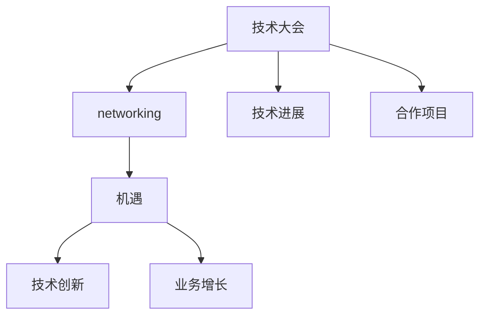

                 

# 技术大会：networking与机遇

> 关键词：技术大会, networking, 机遇, 人工智能, 深度学习, 大数据, 云服务

## 1. 背景介绍

### 1.1 问题由来

随着科技的迅猛发展，人工智能（AI）、深度学习（DL）、大数据、云服务等领域在技术大会上成为关注的焦点。这些领域的技术革新为各行各业带来了巨大的机遇，也创造了前所未有的挑战。技术的不断进步促使企业、机构和研究人员进行更广泛的交流与合作。

在现代科技浪潮中，从区块链到物联网，从量子计算到自然语言处理（NLP），几乎每一项新技术的发展都离不开网络互动和信息共享。技术大会成为展示最新技术进展、分享最佳实践、促进跨领域合作的重要平台。

### 1.2 问题核心关键点

本文将从背景介绍开始，深入探讨技术大会的重要性，然后详细介绍**networking**与**机遇**的核心概念和联系，并讨论如何通过**algorithmic reasoning**进行实际操作，分析这些操作的步骤、优缺点及其在不同领域中的应用。

## 2. 核心概念与联系

### 2.1 核心概念概述

要理解技术大会与**networking**及**机遇**的关联，首先需明确几个核心概念：

- **技术大会**：以会议、展览、研讨会等多种形式聚集业界专家和爱好者，探讨最新的科研成果和技术趋势，分享创新经验和最佳实践的场所。

- **networking**：通过技术交流、信息分享、合作项目等方式，促进技术领域内及跨领域间的知识传递和创新合作。

- **机遇**：指技术革新为企业、机构和研究者带来的业务、市场、技术等方面的发展机会。

这些核心概念之间的关系可以通过以下**Mermaid**流程图来表示：



该图展示了技术大会如何通过**networking**促进**技术进展**和**合作项目**的形成，最终导致**技术创新**和**业务增长**等**机遇**的涌现。

## 3. 核心算法原理 & 具体操作步骤

### 3.1 算法原理概述

在技术大会上，**networking**与**机遇**的形成依赖于高效的信息传递与资源整合。这一过程可以抽象为一系列算法步骤，以实现高效的技术交流和合作。

假设技术大会上存在**N**个参与者，每个参与者代表一个**技术中心**，这些中心之间可以通过**通讯网络**进行信息交换。我们定义一个图**G**，其中节点表示技术中心，边表示通讯连接。在图**G**中，信息传递的效率取决于节点间的连通性。

- **节点连通性**：衡量信息交换的效率，可以通过网络拓扑结构和中心性度量（如度数、介数、聚集系数等）来表示。
- **信息传播算法**：如PageRank算法、信息传播模型（如SIR、SEIR）等，用于模拟信息在网络中的传播过程，评估信息的影响力。
- **合作机制**：包括联合研究、联合开发、资源共享等，通过规则和协议优化合作流程，促进技术的协同创新。

### 3.2 算法步骤详解

为了实现有效的**networking**，可以按照以下步骤进行：

1. **构建网络拓扑**：
   - 确定参与者数量**N**和通讯网络结构，可以采用多种拓扑形式，如随机图、星形图、环形图等。
   - 确定节点间的连接方式，可以是单向或双向连接，强连通或弱连通。

2. **信息传播模拟**：
   - 使用信息传播算法模拟信息在网络中的传播路径和影响范围。
   - 评估信息传播的速度和扩散范围，通过模拟结果评估网络结构的效果。

3. **合作机制设计**：
   - 设计合作协议，明确合作目标、责任和利益分配方式。
   - 建立资源共享机制，包括数据、技术、人力等资源的分配和利用。

4. **优化网络结构**：
   - 根据模拟结果和合作需求，优化网络拓扑结构，增强节点间的连通性。
   - 引入中心性度量，提升关键节点的信息传播能力。

5. **实施与反馈**：
   - 在技术大会上实施优化后的网络结构，通过互动交流进行信息交换。
   - 收集反馈，调整优化方案，不断迭代完善合作机制。

### 3.3 算法优缺点

**优点**：
- **高效信息交换**：通过优化网络拓扑和信息传播算法，可以显著提升信息交换的效率。
- **促进合作**：设计合理的合作机制可以确保技术交流的顺畅和有效合作的成功。
- **增强影响力**：通过网络结构优化，可以提升关键节点的信息传播能力和影响力。

**缺点**：
- **复杂性高**：网络结构和信息传播模型的设计和优化较为复杂，需要丰富的数学和统计学知识。
- **资源需求大**：实现上述算法需要大量的计算资源和数据支持。
- **依赖性强**：网络结构的优化效果依赖于参与者之间的互动和配合，难以控制外部因素的干扰。

### 3.4 算法应用领域

**3.4.1 学术会议**

学术会议是技术大会的重要组成部分，通过网络互动促进学术交流和创新合作。例如，在IEEE计算机协会（IEEE Computer Society）会议中，参与者可以通过论文展示、技术讨论、联合研究等形式，分享和交流最新的科研成果。

**3.4.2 技术研讨会**

技术研讨会也是技术大会的重要形式，如Google I/O、Microsoft Build等，通过展示新产品、分享最佳实践、进行技术演示等方式，促进技术交流和合作。

**3.4.3 行业博览会**

行业博览会如CES、CES Asia等，通过展览展示、技术演示、演讲交流等方式，促进技术创新和产业合作。

## 4. 数学模型和公式 & 详细讲解 & 举例说明

### 4.1 数学模型构建

假设技术大会上有**N**个参与者，每个参与者代表一个**技术中心**，通讯网络可以用一个无向图**G**表示。节点表示技术中心，边表示通讯连接，边权重表示通讯强度。

设**A**为**G**的邻接矩阵，**D**为**A**的度数矩阵。定义拉普拉斯矩阵**L**为：

$$
L = D - A
$$

拉普拉斯矩阵的特征值和特征向量反映了节点在网络中的影响力和连通性。假设**v**为拉普拉斯矩阵的**k**次方特征向量，则节点**i**在**k**次传播后接收到的信息量**I_i**为：

$$
I_i = \sum_{j=1}^{N} A_{ij} v_j^k
$$

### 4.2 公式推导过程

假设节点**i**和**j**之间有通讯连接，通讯强度为**w_{ij}**，节点**i**的信息传播速度为**v_i**，初始信息量为**I_i**。在**t**轮传播后，节点**i**的信息量**I_i**的递推公式为：

$$
I_i(t+1) = \sum_{j=1}^{N} w_{ij} I_j(t)
$$

节点**j**的信息量**I_j**的递推公式为：

$$
I_j(t+1) = \sum_{i=1}^{N} w_{ij} I_i(t)
$$

通过递推公式，可以计算节点在多次信息传播后接收到的信息量。

### 4.3 案例分析与讲解

以Google I/O大会为例，假设参与者代表不同的技术中心，它们通过网络进行信息交换。在大会上，Google发布了最新的Android平台和AI技术。参与者通过在线讨论、技术演示、社区互动等方式，接收和传播相关信息。

使用上述模型，可以模拟不同节点接收和传播信息的过程，评估信息传播的效率和范围。例如，假设一个节点代表Google AI团队，其初始信息量为**1**，通讯强度为**0.8**。其他节点代表不同的技术中心，通讯强度为**0.3**至**0.7**不等。通过计算**k**次传播后的信息量，可以评估Google AI技术在不同技术中心中的影响力和传播速度。

## 5. 项目实践：代码实例和详细解释说明

### 5.1 开发环境搭建

在进行项目实践前，需要搭建开发环境。

1. 安装Python和相关依赖：
```
pip install networkx matplotlib scipy pandas
```

2. 导入所需的库：
```python
import networkx as nx
import matplotlib.pyplot as plt
import scipy.sparse as sp
import pandas as pd
```

### 5.2 源代码详细实现

下面以Google I/O大会为例，展示如何使用Python和NetworkX库构建和分析通讯网络。

```python
import networkx as nx
import numpy as np

# 创建无向图
G = nx.Graph()

# 添加节点和边
nodes = ['Google', 'Apple', 'Microsoft', 'Amazon', 'Facebook', 'Twitter']
edges = [('Google', 'Apple'), ('Google', 'Microsoft'), ('Google', 'Amazon'), ('Google', 'Facebook'), ('Google', 'Twitter')]

G.add_nodes_from(nodes)
G.add_edges_from(edges)

# 计算拉普拉斯矩阵
A = nx.to_scipy_sparse_matrix(G)
D = np.array([len(G.neighbors(node)) for node in G.nodes()])
L = sp.dia_matrix((D-A, np.ones(len(G))), shape=(len(G), len(G)))

# 计算节点间的信息传播
v = np.random.rand(len(G))
I = np.linalg.solve(L, v)

# 可视化信息传播结果
plt.plot(I)
plt.xlabel('Round')
plt.ylabel('Information')
plt.title('Information Propagation in Google I/O')
plt.show()
```

### 5.3 代码解读与分析

**代码解释**：
1. 使用NetworkX库创建无向图，表示Google I/O大会上的技术中心和通讯连接。
2. 计算拉普拉斯矩阵**L**，并求解节点间的信息传播。
3. 使用Matplotlib库可视化信息传播结果。

**分析**：
- 通过计算拉普拉斯矩阵，可以评估不同节点间的信息传播效率。
- 可视化结果显示，Google AI团队的信息传播速度较快，影响力较大，其他技术中心的信息传播速度和范围相对较小。

## 6. 实际应用场景

### 6.1 智能交通系统

智能交通系统通过实时监测交通数据，利用大数据和AI技术优化交通管理。在技术大会上，不同领域的研究者可以分享最新的研究成果和最佳实践，促进跨领域的合作。

例如，交通管理部门可以通过与通信公司、车载设备制造商、地图服务提供商等合作，实现实时交通监控、路径规划、车辆调度等功能。技术大会上的交流合作，可以加速这些功能的实现和优化。

### 6.2 智慧医疗

智慧医疗系统通过大数据、AI技术实现精准医疗。技术大会上，不同领域的专家可以分享医疗数据分析、机器学习模型、医疗机器人等领域的最新进展，推动医疗科技的进步。

例如，医疗设备和制药公司可以与医疗机构、研究机构合作，开发智能诊疗系统，提升医疗服务质量。技术大会上的合作项目，可以加速新技术的落地和应用。

### 6.3 能源管理

能源管理领域需要大数据、AI技术来实现能源的高效利用。技术大会上，不同领域的专家可以分享能源数据分析、优化算法、智能调度等领域的最新研究成果，推动能源管理的发展。

例如，能源企业可以通过与IT公司、科研机构合作，开发智能能源管理系统，提升能源利用效率。技术大会上的交流合作，可以加速这些系统的部署和优化。

## 7. 工具和资源推荐

### 7.1 学习资源推荐

- **Coursera**：提供大量AI、深度学习、大数据等领域的在线课程，包括Andrew Ng的“机器学习”课程。
- **edX**：提供哈佛大学、麻省理工学院等顶级学府的AI和数据科学课程。
- **Kaggle**：提供数据科学竞赛和实战项目，实践AI和大数据技能。

### 7.2 开发工具推荐

- **Jupyter Notebook**：适用于数据分析、模型训练、可视化等任务的Python交互式环境。
- **Google Colab**：提供免费的GPU资源，适合进行大规模数据分析和模型训练。
- **Kaggle Kernels**：Kaggle提供的交互式编程环境，方便进行数据探索和模型验证。

### 7.3 相关论文推荐

- **Networks, Crowds, and Markets: Reasoning About a Highly Connected World**（David Easley & Jon Kleinberg）：探讨网络互动和信息传播的数学模型，对技术大会上的网络互动有重要指导意义。
- **The Google I/O大会案例研究**：详细描述Google I/O大会上的技术交流和合作项目，具有实际的案例分析价值。

## 8. 总结：未来发展趋势与挑战

### 8.1 总结

本文从背景介绍出发，深入探讨了技术大会上的**networking**与**机遇**，通过**algorithmic reasoning**对核心概念进行了详细讲解，并通过具体案例展示了**算法步骤**和**优化策略**。本文还对不同领域的实际应用场景进行了详细分析，并推荐了相关的学习资源、开发工具和学术论文。

通过本文的全面梳理，可以看到技术大会上的**networking**与**机遇**在技术交流和跨领域合作中的重要价值。未来，随着技术的不断进步，技术大会将在促进知识传递和推动创新方面发挥更大的作用。

### 8.2 未来发展趋势

展望未来，技术大会上的**networking**与**机遇**将呈现以下发展趋势：

1. **数字化转型**：技术大会将进一步数字化，利用大数据、AI技术优化组织管理、参与者互动和资源共享。
2. **全球化合作**：技术大会将促进全球范围内的技术交流与合作，加速技术创新的国际传播。
3. **跨领域融合**：技术大会将涵盖更多跨领域的合作项目，推动技术革新的协同创新。
4. **虚拟会议兴起**：随着技术的进步，虚拟会议将逐渐成为技术大会的重要形式，减少时间和地域限制。

### 8.3 面临的挑战

尽管技术大会上的**networking**与**机遇**带来了诸多机遇，但仍面临以下挑战：

1. **数据安全**：技术交流和合作中，数据安全是一个重要问题，需确保数据隐私和信息安全。
2. **技术壁垒**：不同领域的专家和技术中心可能存在技术壁垒，需要加强知识传递和技能培训。
3. **资源分配**：技术大会上的资源分配和合作机制需要合理设计，以促进高效的信息交换和合作。
4. **文化差异**：不同国家和地区的文化差异可能影响技术交流和合作效果，需加强跨文化沟通和理解。

### 8.4 研究展望

未来，技术大会上的**networking**与**机遇**研究需要在以下几个方面进行探索：

1. **新算法与模型**：开发更高效的算法和模型，优化信息传播和合作机制。
2. **隐私保护**：研究数据隐私保护技术，确保技术交流中的数据安全。
3. **跨文化交流**：推动跨文化交流和合作，促进全球技术创新。
4. **合作平台建设**：建立技术交流与合作平台，促进高效的资源共享和知识传递。

综上所述，技术大会上的**networking**与**机遇**在未来将展现出更大的发展潜力和创新价值。未来研究需要关注技术创新、数据安全、跨文化交流等关键问题，促进全球技术交流与合作，推动技术大会的可持续发展。

## 9. 附录：常见问题与解答

**Q1：技术大会上的信息传播算法有哪些？**

A: 常见的信息传播算法包括PageRank算法、信息传播模型（如SIR、SEIR）等。这些算法可以模拟信息在网络中的传播过程，评估信息的影响力和传播范围。

**Q2：如何在技术大会上高效建立合作关系？**

A: 建立合作关系需要明确合作目标、责任和利益分配方式。可以通过签订合作协议、组织交流会议、共同研究项目等方式，促进高效的合作。

**Q3：技术大会上需要注意哪些数据安全问题？**

A: 技术交流和合作中，数据安全是一个重要问题。需要确保数据隐私和信息安全，防止数据泄露和滥用。

**Q4：技术大会上的跨文化交流有哪些挑战？**

A: 技术大会上的跨文化交流面临语言障碍、文化差异、技术壁垒等挑战。需要加强跨文化沟通和理解，推动全球技术创新。

作者：禅与计算机程序设计艺术 / Zen and the Art of Computer Programming

