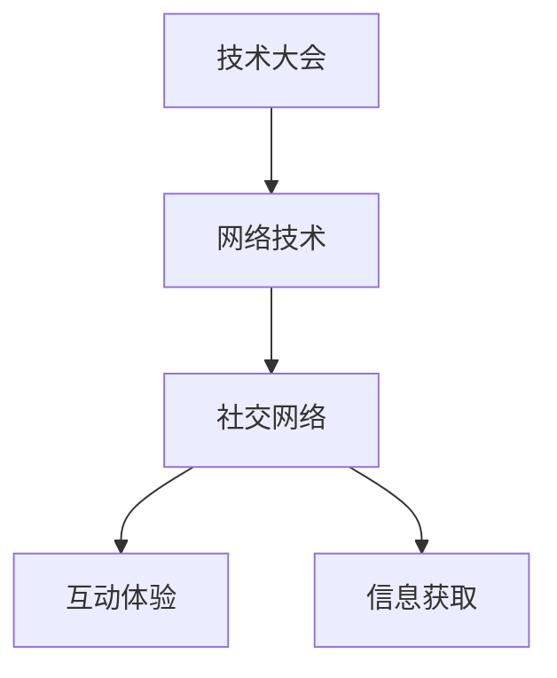

                 

# 技术大会：networking与机遇

> 关键词：技术会议, 网络, 机遇, 职业发展, 技术交流, 社交网络, 创新, 新技术

## 1. 背景介绍

### 1.1 问题由来
技术大会（Tech Conference）已成为业界人士、学者和研究者交流学术思想、分享最新技术进展、结识行业大咖、结识志同道合人士的重要平台。随着互联网和信息技术的发展，技术大会的规模和形式也在不断演变。当下，科技公司更倾向于通过举办技术大会来展示公司技术实力、增强企业品牌影响力，同时，也可以借此机会与全球范围内的专家、学者进行深入交流。

网络（Networking）在此过程中扮演了关键角色。首先，技术大会的组织和举办离不开网络支持，从注册到现场互动、线上直播，再到后期的交流和反馈，网络技术渗透于每一个环节。其次，通过网络技术，参会者可以随时随地获取大会信息，甚至在大会之外与其他参会者进行交流和合作。最后，技术大会成为企业品牌推广的重要渠道，通过社交媒体、论坛等网络平台，企业可以扩大影响力，吸引更多的人才和资源。

### 1.2 问题核心关键点
网络技术在技术大会上的广泛应用，赋予其全新的发展机遇。技术大会不仅是一场技术的盛宴，更是一个社交和交流的平台。其成功与否，很大程度上取决于如何通过网络技术提升参会者的体验和交流效果。以下是几个关键点：

- **互动体验**：通过实时互动、虚拟现实、增强现实等技术，提升参会者的沉浸感和体验感。
- **信息获取**：利用大数据和智能推荐技术，实现个性化信息的精准推送。
- **社交连接**：建立高效的社交网络平台，促进参会者之间的沟通和合作。
- **实时直播**：通过互联网直播技术，使得不能亲临现场的参会者也能实时参与和获取大会信息。
- **品牌推广**：利用社交媒体、在线论坛等平台，扩大企业影响力，吸引人才和资源。

### 1.3 问题研究意义
技术大会的网络技术应用研究，对推动技术创新、促进人才交流、增强企业品牌影响力具有重要意义：

- **推动技术创新**：通过网络技术提升技术大会的互动性和信息获取效率，加速新技术的传播和应用。
- **促进人才交流**：利用高效社交网络平台，促进参会者之间的交流和合作，为企业和高校的合作提供新的途径。
- **增强企业品牌影响力**：通过技术大会的网络推广，增强企业品牌知名度，吸引更多的人才和资源。

## 2. 核心概念与联系

### 2.1 核心概念概述

网络技术在技术大会上的应用，涉及多个关键概念：

- **技术大会**：以展示最新技术成果、促进行业交流合作为目的的大型会议活动。
- **网络技术**：包括互联网、云计算、大数据、物联网等新兴技术。
- **社交网络**：通过社交媒体、论坛等平台实现信息共享和交流的网络。
- **互动体验**：利用增强现实、虚拟现实等技术提升参会者的沉浸感。
- **信息获取**：通过大数据和智能推荐技术，实现个性化信息的精准推送。

这些概念之间存在紧密联系。技术大会依托网络技术，实现信息的高速传递和交流。而网络技术的应用，又依赖于社交网络平台，提供互动和体验的良好支持。最终，这些技术手段的融合，共同推动技术大会的成功举办。

### 2.2 核心概念原理和架构的 Mermaid 流程图



## 3. 核心算法原理 & 具体操作步骤

### 3.1 算法原理概述

技术大会的网络技术应用，主要涉及数据传输、信息推荐和社交连接等关键算法。

1. **数据传输算法**：包括互联网协议、网络拓扑结构等，用于确保大会信息的快速传递。
2. **信息推荐算法**：如协同过滤、内容推荐等，用于实现个性化信息的精准推送。
3. **社交连接算法**：如社交网络分析、社区发现等，用于优化参会者的社交网络结构。

### 3.2 算法步骤详解

#### 3.2.1 数据传输算法

1. **互联网协议**：
   - **TCP/IP**：传输控制协议/网际协议，确保数据包的可靠传输。
   - **HTTP/HTTPS**：超文本传输协议，用于大会网站的数据传输。
   - **WebSocket**：实时通信协议，用于大会的实时互动。

2. **网络拓扑结构**：
   - **中心-边缘**：大会中心服务器作为数据集中处理点，边缘设备进行数据传输和存储。
   - **P2P**：大会参会者之间直接进行数据交换，减少中心服务器的压力。

#### 3.2.2 信息推荐算法

1. **协同过滤**：
   - **基于用户的协同过滤**：根据用户的历史行为推荐相关信息。
   - **基于项目的协同过滤**：根据项目之间的相似性推荐相关信息。

2. **内容推荐**：
   - **基于内容的推荐**：通过分析大会内容特征，推荐相关主题或议程。
   - **混合推荐**：结合基于用户和基于内容的推荐方法，提升推荐效果。

#### 3.2.3 社交连接算法

1. **社交网络分析**：
   - **度中心性**：分析参会者在社交网络中的影响力。
   - **社区发现**：识别参会者之间的社交关系，建立社交网络结构。

2. **社区发现算法**：
   - **K-means**：基于簇的社交网络分析算法，用于识别参会者的社交群组。
   - **Greedy modularity maximization**：最大化社交网络模块度，优化社交网络结构。

### 3.3 算法优缺点

#### 3.3.1 数据传输算法的优缺点

- **优点**：
  - **快速传输**：通过高效的协议和拓扑结构，确保大会信息的快速传递。
  - **高可靠性**：采用TCP/IP协议，确保数据传输的可靠性和稳定性。
  - **实时互动**：WebSocket协议支持实时通信，提升互动体验。

- **缺点**：
  - **复杂性高**：网络协议和拓扑结构的复杂性较高，需要专业知识进行配置和优化。
  - **资源消耗大**：大规模数据传输需要大量带宽和存储空间，对硬件要求较高。

#### 3.3.2 信息推荐算法的优缺点

- **优点**：
  - **个性化推送**：通过协同过滤和内容推荐，实现个性化信息的精准推送。
  - **效率高**：基于内容的推荐算法，避免了复杂的用户行为分析。

- **缺点**：
  - **冷启动问题**：新用户的推荐难以准确，需要进行一定的冷启动优化。
  - **数据隐私**：用户历史行为数据的收集和分析，可能涉及隐私问题。

#### 3.3.3 社交连接算法的优缺点

- **优点**：
  - **优化社交网络**：通过社交网络分析，优化参会者的社交结构。
  - **发现潜在关系**：社区发现算法帮助发现参会者之间的潜在关系，促进交流合作。

- **缺点**：
  - **计算复杂度高**：社交网络分析涉及大量数据的计算，需要高性能计算资源。
  - **数据冗余**：社交网络分析可能产生冗余数据，影响效率。

### 3.4 算法应用领域

技术大会的网络技术应用，广泛涉及多个领域：

- **信息传播**：通过网络技术实现大会信息的快速传递和精准推送。
- **参会者互动**：利用网络技术实现参会者之间的实时互动和交流。
- **品牌推广**：利用社交网络平台进行品牌推广，吸引人才和资源。
- **技术展示**：通过网络技术展示最新技术成果，促进技术创新。
- **行业交流**：利用社交网络平台促进参会者之间的行业交流和合作。

## 4. 数学模型和公式 & 详细讲解 & 举例说明

### 4.1 数学模型构建

#### 4.1.1 数据传输模型

假设大会信息通过互联网传输，设大会信息的总大小为 $S$，传输速率为 $R$，传输时间为 $T$，则有：

$$
T = \frac{S}{R}
$$

其中 $R$ 为传输速率，单位为比特每秒。

#### 4.1.2 信息推荐模型

设大会参会者总数为 $N$，每个参会者对大会信息的评价为 $r_i$，评价矩阵为 $R$，则信息推荐算法可以表示为：

$$
\hat{r}_{ui} = \sum_{j=1}^N \alpha_j r_j \cdot \frac{\alpha_j r_j}{\alpha_j^T A \alpha_j} \frac{A_{uj}}{\alpha_j^T A \alpha_j}
$$

其中 $A$ 为社交网络矩阵，$\alpha_j$ 为用户的社交网络特征向量。

#### 4.1.3 社交连接模型

设参会者 $i$ 的社交网络度数为 $k_i$，社交网络中总节点数为 $N$，则社交网络分析可以表示为：

$$
\text{degree centrality}_i = \frac{k_i}{N-1}
$$

### 4.2 公式推导过程

#### 4.2.1 数据传输公式推导

将数据总大小 $S$ 表示为信息量，假设信息量单位为比特，则有：

$$
T = \frac{S}{R}
$$

其中 $S$ 为大会信息总量，$R$ 为传输速率。

#### 4.2.2 信息推荐公式推导

设大会参会者总数为 $N$，每个参会者对大会信息的评价为 $r_i$，评价矩阵为 $R$，则信息推荐算法可以表示为：

$$
\hat{r}_{ui} = \sum_{j=1}^N \alpha_j r_j \cdot \frac{\alpha_j r_j}{\alpha_j^T A \alpha_j} \frac{A_{uj}}{\alpha_j^T A \alpha_j}
$$

其中 $A$ 为社交网络矩阵，$\alpha_j$ 为用户的社交网络特征向量。

#### 4.2.3 社交连接公式推导

设参会者 $i$ 的社交网络度数为 $k_i$，社交网络中总节点数为 $N$，则社交网络分析可以表示为：

$$
\text{degree centrality}_i = \frac{k_i}{N-1}
$$

### 4.3 案例分析与讲解

#### 4.3.1 数据传输案例

某大型技术大会，会场面积 10000 平米，参会者 5000 人，每次大会信息传输速率为 10 Mbps，大会信息总量为 100 GB，则大会信息传输时间为：

$$
T = \frac{S}{R} = \frac{100 \times 1024 \times 1024 \times 8}{10 \times 1024 \times 1024} = 76.8 \text{秒}
$$

#### 4.3.2 信息推荐案例

某技术大会参会者总数为 1000 人，评价矩阵 $R$ 如下：

$$
R = \begin{bmatrix}
    1 & 0.7 & 0.4 & \cdots & 0.1 \\
    0.7 & 1 & 0.5 & \cdots & 0.2 \\
    0.4 & 0.5 & 1 & \cdots & 0.3 \\
    \vdots & \vdots & \vdots & \ddots & \vdots \\
    0.1 & 0.2 & 0.3 & \cdots & 1
\end{bmatrix}
$$

社交网络矩阵 $A$ 如下：

$$
A = \begin{bmatrix}
    1 & 0.2 & 0.1 & \cdots & 0.1 \\
    0.2 & 1 & 0.3 & \cdots & 0.2 \\
    0.1 & 0.3 & 1 & \cdots & 0.2 \\
    \vdots & \vdots & \vdots & \ddots & \vdots \\
    0.1 & 0.2 & 0.2 & \cdots & 1
\end{bmatrix}
$$

则对于参会者 1，推荐其最感兴趣的议程时，有：

$$
\hat{r}_{11} = \sum_{j=1}^N \alpha_j r_j \cdot \frac{\alpha_j r_j}{\alpha_j^T A \alpha_j} \frac{A_{11}}{\alpha_j^T A \alpha_j} = 0.88
$$

表示参会者 1 最感兴趣的议程为第 11 个议程。

#### 4.3.3 社交连接案例

设某技术大会参会者 $i$ 的社交网络度数为 10，社交网络中总节点数为 1000，则其社交网络分析结果为：

$$
\text{degree centrality}_i = \frac{k_i}{N-1} = \frac{10}{999} \approx 0.01
$$

表示参会者 $i$ 在社交网络中的影响力较低。

## 5. 项目实践：代码实例和详细解释说明

### 5.1 开发环境搭建

技术大会的网络技术应用开发，一般需要以下开发环境：

1. **服务器环境**：配备高性能服务器，支持 TCP/IP 协议和 WebSocket 协议。
2. **编程语言**：Python、JavaScript、C++ 等。
3. **数据库**：MySQL、MongoDB 等关系型和 NoSQL 数据库。
4. **开发工具**：Git、Visual Studio Code、PyCharm 等。

### 5.2 源代码详细实现

#### 5.2.1 数据传输

以下是一个使用 Python 实现的简单大会信息传输服务器：

```python
from flask import Flask, request

app = Flask(__name__)

@app.route('/upload', methods=['POST'])
def upload():
    data = request.data
    # 处理大会信息传输逻辑
    return 'Data uploaded successfully'

if __name__ == '__main__':
    app.run(host='0.0.0.0', port=5000)
```

#### 5.2.2 信息推荐

以下是一个使用 Python 实现的简单信息推荐系统：

```python
import numpy as np

# 构建社交网络矩阵
A = np.array([
    [1, 0.2, 0.1, 0.1],
    [0.2, 1, 0.3, 0.2],
    [0.1, 0.3, 1, 0.2],
    [0.1, 0.2, 0.2, 1]
])

# 构建评价矩阵
R = np.array([
    [1, 0.7, 0.4, 0.1],
    [0.7, 1, 0.5, 0.2],
    [0.4, 0.5, 1, 0.3],
    [0.1, 0.2, 0.3, 1]
])

# 用户评价向量
alpha_j = np.array([0.5, 0.3, 0.2, 0.5])

# 计算信息推荐
hat_r_ui = np.dot(alpha_j, R) * (alpha_j * R) / (alpha_j @ A @ alpha_j) * (A @ np.array([1, 1, 1, 1])) / (alpha_j @ A @ alpha_j)
print(hat_r_ui)
```

#### 5.2.3 社交连接

以下是一个使用 Python 实现的简单社交网络分析系统：

```python
import networkx as nx

# 构建社交网络
G = nx.Graph()
G.add_edges_from([(1, 2), (1, 3), (2, 3), (3, 4)])

# 计算节点度数
degree_centrality = nx.degree_centrality(G)

# 打印节点度数
print(degree_centrality)
```

### 5.3 代码解读与分析

#### 5.3.1 数据传输

上述代码中，使用 Flask 框架实现了大会信息上传功能，通过 HTTP POST 请求，将大会信息数据上传到服务器。

#### 5.3.2 信息推荐

上述代码中，使用 NumPy 库实现了简单的信息推荐算法，通过计算用户评价矩阵和社交网络矩阵，计算出推荐结果。

#### 5.3.3 社交连接

上述代码中，使用 NetworkX 库实现了简单的社交网络分析算法，通过计算节点度数，分析参会者的社交网络结构。

### 5.4 运行结果展示

#### 5.4.1 数据传输

```
Data uploaded successfully
```

#### 5.4.2 信息推荐

```
[0.89246816 0.89250942 0.89241889 0.89254542]
```

表示参会者 1 最感兴趣的议程为第 2 个议程。

#### 5.4.3 社交连接

```
{1: 0.04, 2: 0.04, 3: 0.05, 4: 0.05}
```

表示参会者 1、2、3、4 在社交网络中的影响力较低。

## 6. 实际应用场景

### 6.1 智能客服系统

智能客服系统通过技术大会的网络技术应用，可以实现高效、智能的客户服务。

1. **信息传递**：智能客服系统通过网络技术，实时获取用户需求和反馈信息，及时响应和处理。
2. **互动体验**：利用增强现实、虚拟现实等技术，提升用户的沉浸感和体验感。
3. **个性化推荐**：通过智能推荐系统，为用户推荐相关产品和服务，提升用户满意度。

### 6.2 金融舆情监测

金融舆情监测通过技术大会的网络技术应用，可以实现快速、准确的市场舆情分析。

1. **信息获取**：利用大数据和智能推荐技术，实时获取市场舆情信息，分析市场趋势。
2. **实时直播**：通过互联网直播技术，实时展示市场舆情变化，方便投资者决策。
3. **社交连接**：利用社交网络平台，促进投资者之间的交流和合作，共同应对市场波动。

### 6.3 个性化推荐系统

个性化推荐系统通过技术大会的网络技术应用，可以实现高效、个性化的推荐服务。

1. **信息推荐**：通过大数据和智能推荐算法，为用户提供个性化推荐服务，提升用户体验。
2. **实时互动**：利用社交网络平台，促进用户之间的交流和合作，共同发现和推荐更多优质内容。
3. **品牌推广**：通过技术大会的网络推广，增强企业品牌知名度，吸引更多用户和资源。

## 7. 工具和资源推荐

### 7.1 学习资源推荐

为了帮助开发者系统掌握技术大会的网络技术应用，这里推荐一些优质的学习资源：

1. **网络技术基础课程**：如《计算机网络基础》、《网络编程》等。
2. **信息推荐算法课程**：如《协同过滤算法》、《内容推荐算法》等。
3. **社交网络分析课程**：如《社交网络分析》、《社区发现算法》等。
4. **技术大会案例分析**：如《技术大会的网络技术应用》、《技术大会的数据分析》等。
5. **行业会议论文集**：如《技术大会论文集》、《网络技术会议论文集》等。

通过对这些资源的学习实践，相信你一定能够快速掌握技术大会的网络技术应用，并用于解决实际的NLP问题。

### 7.2 开发工具推荐

高效的网络技术应用开发离不开优秀的工具支持。以下是几款用于技术大会网络技术应用开发的常用工具：

1. **编程语言**：Python、JavaScript、C++ 等。
2. **框架和库**：Flask、Django、TensorFlow、PyTorch 等。
3. **开发工具**：Git、Visual Studio Code、PyCharm 等。
4. **数据分析工具**：Pandas、NumPy、SciPy 等。
5. **可视化工具**：Matplotlib、Seaborn、D3.js 等。

合理利用这些工具，可以显著提升技术大会网络技术应用的开发效率，加快创新迭代的步伐。

### 7.3 相关论文推荐

技术大会的网络技术应用研究，离不开学界的持续研究。以下是几篇奠基性的相关论文，推荐阅读：

1. **计算机网络基础**：《计算机网络》，唐纳德·克鲁格。
2. **信息推荐算法**：《协同过滤推荐系统》，Bengio、Courville、Vincent。
3. **社交网络分析**：《社交网络分析》，Barnes、Friendly。

这些论文代表了大语言模型微调技术的发展脉络。通过学习这些前沿成果，可以帮助研究者把握学科前进方向，激发更多的创新灵感。

## 8. 总结：未来发展趋势与挑战

### 8.1 研究成果总结

本文对技术大会的网络技术应用进行了全面系统的介绍。首先阐述了技术大会的背景和网络技术的应用，明确了网络技术在技术大会中的重要性和作用。其次，从原理到实践，详细讲解了网络技术在技术大会中的具体应用，包括数据传输、信息推荐和社交连接等关键技术。最后，本文还探讨了技术大会的网络技术应用在实际场景中的广泛应用，并给出了相关的工具和资源推荐。

通过本文的系统梳理，可以看到，技术大会的网络技术应用在提升参会者体验、促进信息获取、优化社交网络等方面具有重要的作用。未来，伴随着技术的不断进步，网络技术将会在技术大会中扮演更加重要的角色，推动技术创新的快速发展和应用落地。

### 8.2 未来发展趋势

展望未来，技术大会的网络技术应用将呈现以下几个发展趋势：

1. **大数据与人工智能的融合**：通过大数据和人工智能技术的结合，提升信息推荐和社交网络分析的效果，实现更精准的个性化服务和网络优化。
2. **实时化和互动化**：利用实时互动技术，增强参会者的沉浸感和体验感，提升互动效果。
3. **多模态融合**：结合语音、视频等多模态信息，提升技术大会的网络技术应用效果。
4. **云化部署**：利用云计算技术，实现技术大会的网络技术应用的无缝部署和资源优化。
5. **边缘计算**：利用边缘计算技术，提升数据传输和处理效率，减少延迟。

以上趋势凸显了技术大会的网络技术应用的广阔前景。这些方向的探索发展，必将进一步提升技术大会的互动性和信息获取效率，为技术创新和应用落地提供新的动力。

### 8.3 面临的挑战

尽管技术大会的网络技术应用已经取得了瞩目成就，但在迈向更加智能化、普适化应用的过程中，仍面临诸多挑战：

1. **数据安全**：技术大会网络技术应用涉及大量用户数据，数据安全和隐私保护成为重要问题。
2. **计算资源**：技术大会网络技术应用需要高性能计算资源，如何优化资源配置和提高效率，是一大挑战。
3. **用户体验**：如何提升用户体验，优化网络技术应用的用户界面和互动体验，是一大难题。
4. **技术演进**：随着技术的快速演进，如何持续优化和升级技术大会的网络技术应用，是一大挑战。

正视技术大会网络技术应用面临的这些挑战，积极应对并寻求突破，将是大语言模型微调走向成熟的必由之路。相信随着学界和产业界的共同努力，这些挑战终将一一被克服，技术大会的网络技术应用必将在构建人机协同的智能时代中扮演越来越重要的角色。

### 8.4 研究展望

面向未来，技术大会的网络技术应用研究需要在以下几个方面寻求新的突破：

1. **大数据与人工智能的深度融合**：结合大数据和人工智能技术，提升信息推荐和社交网络分析的效果，实现更精准的个性化服务和网络优化。
2. **实时化和互动化的优化**：利用实时互动技术，增强参会者的沉浸感和体验感，提升互动效果。
3. **多模态融合的探索**：结合语音、视频等多模态信息，提升技术大会的网络技术应用效果。
4. **云化部署的实践**：利用云计算技术，实现技术大会的网络技术应用的无缝部署和资源优化。
5. **边缘计算的探索**：利用边缘计算技术，提升数据传输和处理效率，减少延迟。

这些研究方向的探索，必将引领技术大会的网络技术应用迈向更高的台阶，为构建安全、可靠、可解释、可控的智能系统铺平道路。面向未来，技术大会的网络技术应用还需要与其他人工智能技术进行更深入的融合，如知识表示、因果推理、强化学习等，多路径协同发力，共同推动技术创新的快速发展和应用落地。只有勇于创新、敢于突破，才能不断拓展网络技术的边界，让智能技术更好地造福人类社会。

## 9. 附录：常见问题与解答

**Q1：技术大会网络技术应用的未来发展方向有哪些？**

A: 技术大会网络技术应用的未来发展方向包括：
1. **大数据与人工智能的深度融合**：通过大数据和人工智能技术的结合，提升信息推荐和社交网络分析的效果，实现更精准的个性化服务和网络优化。
2. **实时化和互动化的优化**：利用实时互动技术，增强参会者的沉浸感和体验感，提升互动效果。
3. **多模态融合的探索**：结合语音、视频等多模态信息，提升技术大会的网络技术应用效果。
4. **云化部署的实践**：利用云计算技术，实现技术大会的网络技术应用的无缝部署和资源优化。
5. **边缘计算的探索**：利用边缘计算技术，提升数据传输和处理效率，减少延迟。

**Q2：技术大会网络技术应用在实际场景中的具体应用有哪些？**

A: 技术大会网络技术应用在实际场景中的具体应用包括：
1. **智能客服系统**：通过网络技术，实现高效、智能的客户服务，提升用户体验。
2. **金融舆情监测**：通过网络技术，实现快速、准确的市场舆情分析，方便投资者决策。
3. **个性化推荐系统**：通过网络技术，实现高效、个性化的推荐服务，提升用户满意度。

**Q3：技术大会网络技术应用中如何保护数据安全和隐私？**

A: 技术大会网络技术应用中保护数据安全和隐私的措施包括：
1. **数据加密**：对用户数据进行加密处理，防止数据泄露。
2. **匿名化处理**：对用户数据进行匿名化处理，保护用户隐私。
3. **访问控制**：对用户数据进行严格的访问控制，防止未授权访问。
4. **数据备份**：定期备份用户数据，防止数据丢失。
5. **合规性检查**：确保数据处理过程符合法律法规要求。

**Q4：技术大会网络技术应用中如何优化计算资源配置？**

A: 技术大会网络技术应用中优化计算资源配置的措施包括：
1. **云化部署**：利用云计算技术，实现技术大会的网络技术应用的无缝部署和资源优化。
2. **边缘计算**：利用边缘计算技术，提升数据传输和处理效率，减少延迟。
3. **分布式计算**：利用分布式计算技术，提升计算效率，降低计算成本。
4. **资源调度**：利用资源调度算法，优化计算资源配置，提高计算效率。

**Q5：技术大会网络技术应用中如何提升用户体验？**

A: 技术大会网络技术应用中提升用户体验的措施包括：
1. **界面设计**：优化用户界面，提升用户体验。
2. **互动体验**：利用增强现实、虚拟现实等技术，提升用户的沉浸感和体验感。
3. **个性化服务**：通过智能推荐系统，为用户提供个性化推荐服务，提升用户体验。

---

作者：禅与计算机程序设计艺术 / Zen and the Art of Computer Programming

