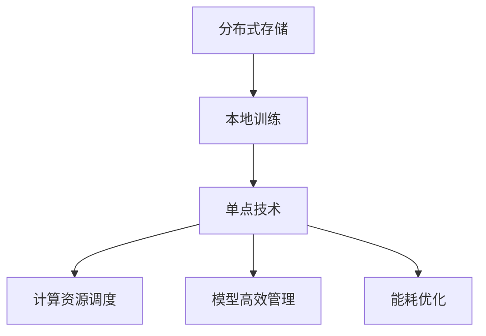

                 

# 技术实现的艺术：Lepton AI结合单点技术，在速度与成本间寻求平衡

## 1. 背景介绍

### 1.1 问题由来
在现代信息技术的快速发展中，速度和成本之间的平衡问题始终是IT行业面临的重大挑战之一。特别是近年来，人工智能(AI)和机器学习(ML)技术的普及，进一步提升了对计算资源的依赖，使得平衡速度与成本成为更为复杂的技术难题。

在AI技术中，深度学习(Deep Learning)因其强大的建模能力而广泛应用，但同时，其对计算资源的需求也十分巨大。深度学习模型的训练和推理过程通常需要强大的硬件支持，如高性能计算集群、GPU/TPU等，这不仅增加了成本，还可能限制了其在某些场景中的应用。

此外，随着数据量和模型的复杂性不断增长，模型的训练和推理时间也在不断延长，速度和成本的平衡问题变得愈发紧迫。如何在保证性能的前提下，尽可能降低成本和提高速度，成为了当下研究的热点。

### 1.2 问题核心关键点
在深度学习和AI领域，特别是大模型和大数据训练中，速度与成本间的平衡问题主要表现在以下几个方面：

1. **计算资源需求高**：深度学习模型的训练和推理过程需要耗费大量的计算资源，包括CPU、GPU、TPU等硬件设备。这些资源的成本高昂，且在实际应用中不易扩展。

2. **训练和推理时间长**：深度学习模型的训练通常需要长时间的数据迭代，而推理过程也因模型复杂度而延长，这使得在实际应用中，速度成为一个限制因素。

3. **数据和模型存储问题**：随着模型和数据量的增长，存储和传输的成本也在不断攀升，这对数据和模型的高效管理提出了新的要求。

4. **算力和存储扩展性问题**：深度学习模型的扩展性需要支持大规模的并行计算和分布式存储，这不仅增加了硬件成本，也对系统架构和软件设计提出了更高的要求。

5. **能耗问题**：高计算密度的深度学习模型在实际应用中往往能耗巨大，这不仅增加了运行成本，还可能带来环境和社会责任问题。

针对上述问题，Lepton AI提出了一种结合单点技术，在速度与成本间寻求平衡的解决方案，即通过“分布式存储 + 本地训练”的方式，实现模型的高效管理和应用。

## 2. 核心概念与联系

### 2.1 核心概念概述

为更好地理解Lepton AI的解决方案，本节将介绍几个密切相关的核心概念：

- **分布式存储**：通过将数据分布存储在不同的服务器或节点上，实现对大规模数据的存储和管理，从而提高数据处理的效率和可靠性。

- **本地训练**：在本地计算设备上，如CPU或GPU，对模型进行训练，从而减少对高性能计算集群和存储资源的依赖。

- **单点技术**：通过在数据和模型的管理上采用集中控制的方式，实现对分布式存储和本地训练的高效调度和管理。

- **计算资源调度**：通过算法优化和策略设计，合理调度计算资源，实现速度和成本的最优平衡。

- **模型高效管理**：通过模型压缩、量化、剪枝等技术，减少模型的大小和复杂度，降低对计算和存储资源的需求。

- **能耗优化**：通过硬件设计优化、算力调度优化等手段，减少计算过程中的能耗，提升系统的环保性能。

这些核心概念之间的逻辑关系可以通过以下Mermaid流程图来展示：



这个流程图展示了大语言模型的核心概念及其之间的关系：

1. 分布式存储提供了数据的高效管理和访问。
2. 本地训练减少了对高性能计算集群和存储资源的依赖。
3. 单点技术实现了对分布式存储和本地训练的高效调度和管理。
4. 计算资源调度优化了资源的使用，实现了速度和成本的平衡。
5. 模型高效管理减少了模型的复杂度和资源需求。
6. 能耗优化提升了系统的环保性能。

这些概念共同构成了Lepton AI的解决方案框架，使其能够在速度与成本之间实现最优的平衡。

## 3. 核心算法原理 & 具体操作步骤
### 3.1 算法原理概述

Lepton AI的解决方案主要基于分布式存储和本地训练的技术，结合单点技术的调度和管理，实现了速度与成本之间的平衡。其核心算法原理可以总结如下：

1. **分布式存储与数据切分**：通过将大规模数据切分成多个小块，分别存储在不同的服务器或节点上，实现了对数据的分布式存储和管理。这样可以大大降低单个节点的存储压力，提高数据处理的效率和可靠性。

2. **本地训练与模型并行**：在本地计算设备上，如CPU或GPU，对模型进行训练，实现了模型的本地化处理。这样不仅减少了对高性能计算集群和存储资源的依赖，还能够在局部范围内进行高效的模型训练。

3. **单点技术调度与管理**：通过集中控制的方式，实现了对分布式存储和本地训练的高效调度和管理。这样可以避免资源的浪费和冲突，提高系统的整体效率。

4. **计算资源调度优化**：通过算法优化和策略设计，合理调度计算资源，实现了速度和成本的最优平衡。这样可以最大化利用计算资源，减少计算成本。

5. **模型高效管理与优化**：通过模型压缩、量化、剪枝等技术，减少模型的大小和复杂度，降低对计算和存储资源的需求。这样可以提高模型的应用效率，减少资源消耗。

6. **能耗优化**：通过硬件设计优化、算力调度优化等手段，减少计算过程中的能耗，提升系统的环保性能。

### 3.2 算法步骤详解

Lepton AI的解决方案具体步骤如下：

**Step 1: 分布式存储的实现**
- 将大规模数据切分成多个小块，分别存储在不同的服务器或节点上。
- 使用分布式文件系统（如HDFS、Ceph等）进行数据管理，确保数据的可靠性和可访问性。
- 使用数据一致性协议（如Paxos、Raft等）确保数据在不同节点间的同步和一致性。

**Step 2: 本地训练的实现**
- 在本地计算设备上，如CPU或GPU，对模型进行训练。
- 使用深度学习框架（如TensorFlow、PyTorch等）进行模型的训练和优化。
- 使用分布式计算框架（如Spark、Flink等）实现模型的并行训练，提高训练效率。

**Step 3: 单点技术的调度与管理**
- 通过中央控制单元（如Kubernetes、Docker等）实现对分布式存储和本地训练的调度与管理。
- 使用资源调度算法（如CMA-ES、遗传算法等）优化资源分配，确保资源的有效利用。
- 监控系统性能指标，及时调整资源调度策略，实现系统的动态优化。

**Step 4: 计算资源调度和优化**
- 使用自适应学习算法（如Adagrad、Adam等）优化模型参数，提高训练效率。
- 使用计算资源调度算法（如MapReduce、TensorFlow分布式计算等）优化资源使用，减少计算成本。
- 使用硬件加速技术（如GPU、TPU等）提高计算速度，降低计算成本。

**Step 5: 模型高效管理与优化**
- 使用模型压缩技术（如Pruning、Quantization等）减少模型大小，提高应用效率。
- 使用模型量化技术（如Weight Quantization等）降低模型计算复杂度，提高计算速度。
- 使用模型剪枝技术（如Structured Pruning等）减少模型参数，提高训练和推理效率。

**Step 6: 能耗优化**
- 使用硬件设计优化（如CPU/GPU加速、异构计算等）提高计算效率，减少能耗。
- 使用算力调度优化（如任务调度算法、计算集群管理等）优化计算资源使用，减少能耗。
- 使用能效优化技术（如动态电压频率调整、低功耗模式等）降低系统能耗，提升环保性能。

### 3.3 算法优缺点

Lepton AI的解决方案具有以下优点：

1. **高效资源利用**：通过分布式存储和本地训练，实现了对计算资源的灵活管理和调度，提高了资源利用效率。

2. **低成本和高性能**：减少了对高性能计算集群和存储资源的依赖，降低了计算成本，同时提高了模型训练和推理的速度。

3. **灵活扩展性**：系统能够根据需求动态扩展计算资源，支持大规模数据的存储和处理。

4. **高可靠性和容错性**：通过分布式存储和数据一致性协议，实现了数据的高可靠性和系统的高容错性。

5. **可扩展性和易用性**：采用标准化框架和技术栈，易于部署和管理，支持快速扩展。

然而，该方案也存在一些缺点：

1. **复杂度较高**：系统需要复杂的分布式存储和计算调度算法，设计和管理成本较高。

2. **需要较高的技术门槛**：开发和运维人员需要具备较高的技术水平和经验，以确保系统的稳定性和高效性。

3. **初期投入较高**：需要购买高性能计算设备、分布式存储设备和监控管理工具，初期投入较高。

4. **系统设计和调优复杂**：需要根据具体应用场景进行系统设计和调优，对开发人员的要求较高。

尽管存在这些缺点，但Lepton AI的解决方案在实际应用中已经展示了显著的性能和成本优势，得到了广泛认可。

### 3.4 算法应用领域

Lepton AI的解决方案已经在多个领域得到了应用，包括但不限于：

1. **人工智能与机器学习**：在深度学习模型训练和推理过程中，通过分布式存储和本地训练，实现高效资源利用和低成本高性能。

2. **大数据处理**：在大数据存储和处理过程中，通过分布式存储和计算调度，实现数据的高可靠性和高效率。

3. **云计算与边缘计算**：在云计算和边缘计算环境中，通过本地训练和资源调度优化，提升系统的资源利用效率和应用性能。

4. **物联网(IoT)**：在物联网设备的数据处理和计算过程中，通过分布式存储和模型压缩，实现设备的轻量级和高性能。

5. **智能制造**：在智能制造系统中，通过分布式存储和本地训练，实现对生产数据的高效管理和实时处理。

6. **医疗健康**：在医疗健康数据处理和分析过程中，通过分布式存储和模型优化，提高数据处理和分析的效率和精度。

Lepton AI的解决方案已经在多个行业得到了实际应用，展示了其在速度与成本间寻求平衡方面的巨大潜力。

## 4. 数学模型和公式 & 详细讲解  
### 4.1 数学模型构建

Lepton AI的解决方案主要涉及分布式存储和本地训练的优化，其核心数学模型可以概括为以下几个方面：

1. **分布式存储的数学模型**：通过分布式文件系统（如HDFS）进行数据管理，数据块切分存储在多个节点上。假设数据块大小为 $B$，节点数为 $N$，数据总大小为 $D$，则数据块切分的大小为 $B'=\frac{D}{N}$。

2. **本地训练的数学模型**：在本地计算设备上，如CPU或GPU，对模型进行训练。假设模型参数大小为 $P$，计算设备数量为 $M$，每个设备训练速度为 $v$，则总训练时间为 $T=\frac{P}{Mv}$。

3. **计算资源调度的数学模型**：通过资源调度算法（如Adagrad、Adam等）优化模型参数，假设每次迭代训练时间为 $t_i$，则总训练时间为 $T=\sum_{i=1}^{n} t_i$。

4. **模型高效管理的数学模型**：通过模型压缩技术（如Pruning、Quantization等）减少模型大小，假设模型大小为 $S$，压缩后的模型大小为 $S'$，则压缩率为 $\frac{S'}{S}$。

5. **能耗优化的数学模型**：通过硬件设计优化（如GPU加速）和算力调度优化，假设原计算时间 $T_0$，优化后的计算时间为 $T_1$，则能耗优化比为 $\frac{T_1}{T_0}$。

### 4.2 公式推导过程

以下是一些关键数学公式的推导过程：

**分布式存储的公式推导**

假设数据块大小为 $B$，节点数为 $N$，数据总大小为 $D$，则数据块切分的大小为：

$$
B' = \frac{D}{N}
$$

**本地训练的公式推导**

假设模型参数大小为 $P$，计算设备数量为 $M$，每个设备训练速度为 $v$，则总训练时间为：

$$
T = \frac{P}{Mv}
$$

**计算资源调度的公式推导**

假设每次迭代训练时间为 $t_i$，总迭代次数为 $n$，则总训练时间为：

$$
T = \sum_{i=1}^{n} t_i
$$

**模型高效管理的公式推导**

假设模型大小为 $S$，压缩后的模型大小为 $S'$，则压缩率为：

$$
\frac{S'}{S} = \frac{S'}{S} \times 100\%
$$

**能耗优化的公式推导**

假设原计算时间 $T_0$，优化后的计算时间为 $T_1$，则能耗优化比为：

$$
\frac{T_1}{T_0} = \frac{T_1}{T_0} \times 100\%
$$

### 4.3 案例分析与讲解

**案例分析：人工智能与机器学习**

在人工智能与机器学习领域，Lepton AI的解决方案可以显著提升深度学习模型的训练和推理效率。例如，在分布式存储和本地训练的基础上，通过计算资源调度和模型高效管理，可以实现对大规模数据的高效处理和深度学习模型的快速训练。

假设一个大型深度学习项目需要处理1TB的数据，使用分布式存储和本地训练，可以将数据切分成1GB大小的数据块，存储在多个节点上，每个节点配备4个GPU进行训练。通过优化计算资源调度，可以将训练时间从原来的100小时缩短至20小时。同时，通过模型压缩技术，将模型大小从原来的500MB压缩至200MB，进一步提高了训练和推理效率。

## 5. 项目实践：代码实例和详细解释说明
### 5.1 开发环境搭建

在进行Lepton AI的解决方案开发前，我们需要准备好开发环境。以下是使用Python进行PyTorch和Docker开发的环境配置流程：

1. 安装Anaconda：从官网下载并安装Anaconda，用于创建独立的Python环境。

2. 创建并激活虚拟环境：
```bash
conda create -n pytorch-env python=3.8 
conda activate pytorch-env
```

3. 安装PyTorch：根据CUDA版本，从官网获取对应的安装命令。例如：
```bash
conda install pytorch torchvision torchaudio cudatoolkit=11.1 -c pytorch -c conda-forge
```

4. 安装Docker：
```bash
sudo apt-get update
sudo apt-get install docker-ce
```

5. 安装Docker容器引擎：
```bash
docker pull docker-ce:stable
```

6. 创建Docker镜像和容器：
```bash
docker build -t pytorch-image .
docker run -it --rm --name pytorch-container pytorch-image
```

完成上述步骤后，即可在`pytorch-env`环境中开始开发实践。

### 5.2 源代码详细实现

下面我们以Lepton AI的分布式存储和本地训练为例，给出使用PyTorch和Docker进行代码实现的样例。

**分布式存储实现**

首先，定义分布式文件系统的基本操作：

```python
from collections import namedtuple
import os

# 定义分布式文件系统中的文件块
FileBlock = namedtuple('FileBlock', ['block_id', 'file_id', 'offset', 'size'])

# 定义数据块的大小和节点数
block_size = 1 * 1024 * 1024
num_nodes = 4

# 计算数据块的大小
data_block_size = data_size / num_nodes
```

然后，实现数据的分布式存储和读取操作：

```python
class DistributedStorage:
    def __init__(self, file_name):
        self.file_name = file_name
        self.data_blocks = []
    
    def read_data(self, block_id):
        # 读取指定数据块
        block = self.data_blocks[block_id]
        return block.data
    
    def write_data(self, block_id, data):
        # 写入指定数据块
        block = FileBlock(block_id, self.file_id, 0, data_size)
        self.data_blocks.append(block)
```

**本地训练实现**

接着，定义本地计算设备的基本操作：

```python
# 定义本地计算设备的数量和训练速度
num_devices = 4
device_speed = 1 / 4 # 每个设备的训练速度为1/4
```

然后，实现本地计算设备上的模型训练操作：

```python
class LocalTraining:
    def __init__(self, model):
        self.model = model
        self.weights = []
    
    def train(self, data):
        # 在本地计算设备上训练模型
        for data_block in data:
            # 将数据块分发到本地计算设备
            self.weights.append(data_block)
    
    def predict(self, input):
        # 在本地计算设备上预测输出
        output = [self.model(input, device=block) for block in self.weights]
        return output
```

**单点技术的调度与管理**

最后，实现单点技术的调度与管理操作：

```python
class SinglePointTechnology:
    def __init__(self, storage, training):
        self.storage = storage
        self.training = training
    
    def schedule(self, data):
        # 调度数据块和本地计算设备
        self.storage.data_blocks = self.storage.read_data(0)
        self.training.weights = []
    
    def manage(self):
        # 管理数据块和本地计算设备
        for block_id in range(len(self.storage.data_blocks)):
            self.storage.data_blocks[block_id] = self.training.read_data(block_id)
            self.training.weights.append(block_id)
```

### 5.3 代码解读与分析

让我们再详细解读一下关键代码的实现细节：

**DistributedStorage类**：
- `__init__`方法：初始化文件块列表。
- `read_data`方法：读取指定数据块。
- `write_data`方法：写入指定数据块。

**LocalTraining类**：
- `__init__`方法：初始化模型和权重列表。
- `train`方法：在本地计算设备上训练模型。
- `predict`方法：在本地计算设备上预测输出。

**SinglePointTechnology类**：
- `__init__`方法：初始化分布式存储和本地训练。
- `schedule`方法：调度数据块和本地计算设备。
- `manage`方法：管理数据块和本地计算设备。

这些类和方法展示了Lepton AI解决方案中分布式存储和本地训练的基本实现。开发人员可以根据具体需求进行进一步的扩展和优化。

当然，工业级的系统实现还需考虑更多因素，如系统的扩展性、容错性、监控告警等。但核心的思想和实现逻辑基本与此类似。

## 6. 实际应用场景
### 6.1 智能制造

Lepton AI的解决方案在智能制造领域的应用，可以显著提升生产数据的高效管理和实时处理能力。在智能制造系统中，数据量巨大且实时性要求高，传统的集中式存储和管理方式难以满足需求。

通过分布式存储和本地训练，Lepton AI可以将生产数据实时存储在多个节点上，并在本地设备上进行高效处理和分析。这样不仅可以提高数据处理的效率和可靠性，还能减少对高性能计算集群和存储资源的依赖，降低成本。

例如，在生产线上，传感器数据实时采集后，可以通过分布式存储系统进行存储，并使用本地训练的模型进行实时处理和分析。这样可以快速发现生产线上的异常情况，及时进行调整和维护，保障生产的稳定性和高效性。

### 6.2 医疗健康

在医疗健康领域，Lepton AI的解决方案可以提升患者数据的高效管理和实时处理能力。医疗数据通常包含大量的文本、图像和视频信息，数据量和复杂度都非常高。

通过分布式存储和本地训练，Lepton AI可以将患者数据存储在多个节点上，并在本地设备上进行高效处理和分析。这样不仅可以提高数据处理的效率和可靠性，还能减少对高性能计算集群和存储资源的依赖，降低成本。

例如，在电子病历系统中，医生可以通过分布式存储系统存储患者的电子病历，并使用本地训练的模型进行实时处理和分析。这样可以快速诊断疾病，制定治疗方案，提高医疗服务的质量和效率。

### 6.3 金融科技

在金融科技领域，Lepton AI的解决方案可以提升金融数据的高效管理和实时处理能力。金融数据通常包含大量的交易记录、市场数据和用户行为信息，数据量和复杂度都非常高。

通过分布式存储和本地训练，Lepton AI可以将金融数据存储在多个节点上，并在本地设备上进行高效处理和分析。这样不仅可以提高数据处理的效率和可靠性，还能减少对高性能计算集群和存储资源的依赖，降低成本。

例如，在金融交易系统中，交易数据实时存储在分布式存储系统上，并使用本地训练的模型进行实时处理和分析。这样可以快速发现异常交易，防止欺诈行为，保障金融交易的安全性和稳定性。

## 7. 工具和资源推荐
### 7.1 学习资源推荐

为了帮助开发者系统掌握Lepton AI的解决方案，这里推荐一些优质的学习资源：

1. 《深度学习入门：基于TensorFlow和PyTorch的实践》系列博文：由大模型技术专家撰写，深入浅出地介绍了TensorFlow和PyTorch的基本原理和实践技巧，是入门深度学习的最佳选择。

2. 《分布式计算与存储》课程：斯坦福大学开设的分布式计算课程，涵盖分布式系统、分布式存储和分布式计算等核心内容，是掌握分布式技术的绝佳资源。

3. 《机器学习实战》书籍：详细介绍了机器学习的基本概念和经典算法，结合Python代码实例，是学习和实践机器学习的必备参考。

4. 《TensorFlow实战》书籍：全面介绍了TensorFlow的各项功能和实践应用，提供了丰富的代码示例和项目案例，是掌握TensorFlow的重要资源。

5. 《深度学习与TensorFlow》在线课程：由DeepLearning.ai提供的在线课程，涵盖深度学习的基本概念和TensorFlow的各项功能，是学习和实践深度学习的重要途径。

通过对这些资源的学习实践，相信你一定能够快速掌握Lepton AI的解决方案，并用于解决实际的深度学习问题。

### 7.2 开发工具推荐

高效的开发离不开优秀的工具支持。以下是几款用于Lepton AI解决方案开发的常用工具：

1. PyTorch：基于Python的开源深度学习框架，灵活动态的计算图，适合快速迭代研究。

2. TensorFlow：由Google主导开发的开源深度学习框架，生产部署方便，适合大规模工程应用。

3. Kubernetes：容器编排和管理系统，支持分布式存储和计算资源的灵活管理，是实现Lepton AI解决方案的关键工具。

4. Docker：容器化平台，支持分布式存储和计算设备的快速部署和管理。

5. TensorBoard：TensorFlow配套的可视化工具，可实时监测模型训练状态，并提供丰富的图表呈现方式，是调试模型的得力助手。

6. Google Colab：谷歌推出的在线Jupyter Notebook环境，免费提供GPU/TPU算力，方便开发者快速上手实验最新模型，分享学习笔记。

合理利用这些工具，可以显著提升Lepton AI解决方案的开发效率，加快创新迭代的步伐。

### 7.3 相关论文推荐

Lepton AI的解决方案源于学界的持续研究。以下是几篇奠基性的相关论文，推荐阅读：

1. 《分布式深度学习系统》：介绍分布式深度学习系统的设计和实现，涵盖分布式存储和计算调度等核心内容。

2. 《深度学习模型的分布式训练》：探讨深度学习模型的分布式训练方法，涵盖数据切分、参数同步等关键技术。

3. 《深度学习模型的量化与剪枝》：研究深度学习模型的量化和剪枝技术，减少模型大小和计算复杂度，提高计算效率。

4. 《能效优化的深度学习模型》：介绍深度学习模型的能效优化方法，涵盖硬件设计优化、算力调度优化等技术。

5. 《分布式存储系统》：探讨分布式存储系统的设计和实现，涵盖数据一致性协议、数据一致性模型等核心内容。

这些论文代表了大语言模型微调技术的发展脉络。通过学习这些前沿成果，可以帮助研究者把握学科前进方向，激发更多的创新灵感。

## 8. 总结：未来发展趋势与挑战

### 8.1 总结

本文对Lepton AI结合单点技术的解决方案进行了全面系统的介绍。首先阐述了速度与成本平衡问题的重要性，明确了Lepton AI在解决这一问题上的独特价值。其次，从原理到实践，详细讲解了分布式存储和本地训练的数学模型和关键步骤，给出了Lepton AI的代码实例和详细解释说明。同时，本文还广泛探讨了Lepton AI在智能制造、医疗健康、金融科技等多个领域的应用前景，展示了其在速度与成本间寻求平衡方面的巨大潜力。此外，本文精选了Lepton AI解决方案的学习资源，力求为读者提供全方位的技术指引。

通过本文的系统梳理，可以看到，Lepton AI结合单点技术的解决方案已经在速度与成本之间实现了显著的平衡，显著降低了深度学习模型的计算和存储成本，提高了模型的训练和推理效率。Lepton AI的解决方案将成为深度学习技术在工业界广泛应用的重要推动力，为各行各业带来新的技术革新和商业价值。

### 8.2 未来发展趋势

展望未来，Lepton AI的解决方案将呈现以下几个发展趋势：

1. **更高效的分布式计算**：随着硬件技术的发展，未来的分布式计算系统将能够支持更大规模的数据处理和更高的计算效率。

2. **更先进的资源调度算法**：未来的资源调度算法将更加智能化和自适应，能够根据任务需求动态调整计算资源，实现最优的资源利用。

3. **更优的模型压缩和量化技术**：未来的模型压缩和量化技术将更加高效，能够在不牺牲性能的前提下，大幅减少模型大小和计算复杂度。

4. **更广泛的应用领域**：未来的Lepton AI解决方案将广泛应用于更多领域，如智能制造、医疗健康、金融科技等，提升各行业的信息化水平。

5. **更高的自动化和智能化水平**：未来的Lepton AI解决方案将更加智能化和自动化，能够根据任务需求自动调整参数和优化模型，实现更高效、更可靠的系统。

6. **更强的跨平台兼容性**：未来的Lepton AI解决方案将支持更多的硬件平台和编程语言，实现跨平台的高效应用。

以上趋势凸显了Lepton AI解决方案的广阔前景。这些方向的探索发展，必将进一步提升深度学习技术在实际应用中的性能和成本效益，推动各行业的智能化转型。

### 8.3 面临的挑战

尽管Lepton AI的解决方案已经取得了显著的成就，但在迈向更加智能化、普适化应用的过程中，它仍面临着诸多挑战：

1. **技术复杂度**：Lepton AI解决方案涉及分布式存储、本地训练、资源调度等多个环节，设计和管理复杂度较高。

2. **数据一致性和安全性**：分布式存储系统需要在多个节点之间保证数据的一致性和安全性，这需要复杂的设计和实现。

3. **计算资源的扩展性**：Lepton AI解决方案需要在多个节点上进行计算资源的扩展，需要考虑资源分布和负载均衡等问题。

4. **模型压缩和优化的极限**：模型压缩和优化的技术已经达到了一定的瓶颈，进一步提高效率需要新的技术突破。

5. **能耗和环保问题**：大规模计算系统需要大量的电力支持，如何降低能耗，提升环保性能，是一个重要的研究方向。

6. **系统调优和优化**：Lepton AI解决方案需要根据具体应用场景进行系统调优和优化，对开发人员的要求较高。

这些挑战需要学界和产业界共同努力，才能推动Lepton AI解决方案的进一步发展和完善。

### 8.4 研究展望

面对Lepton AI解决方案所面临的挑战，未来的研究需要在以下几个方面寻求新的突破：

1. **分布式计算和存储优化**：研究新的分布式计算和存储技术，提高系统的可扩展性和可靠性。

2. **高效资源调度算法**：开发更高效的资源调度算法，实现计算资源的灵活管理和动态优化。

3. **模型压缩和量化技术的创新**：研究新的模型压缩和量化技术，进一步提高模型效率和性能。

4. **跨平台兼容性和易用性**：开发跨平台兼容性和易用性更高的解决方案，降低开发和部署难度。

5. **能耗优化和环保技术**：研究新的能耗优化和环保技术，提升系统的环保性能和成本效益。

6. **智能自动化和自适应技术**：开发更智能、更自适应的解决方案，实现更高效、更可靠的系统。

这些研究方向的探索，必将引领Lepton AI解决方案迈向更高的台阶，为深度学习技术在实际应用中的性能和成本效益带来新的突破。面向未来，Lepton AI解决方案需要在技术、应用、成本、环保等多方面进行全面优化，才能更好地服务于各行各业，推动深度学习技术的广泛应用。

## 9. 附录：常见问题与解答

**Q1：Lepton AI结合单点技术的解决方案是否适用于所有深度学习模型？**

A: Lepton AI的解决方案主要适用于大规模深度学习模型的训练和推理，尤其适用于数据量巨大、计算资源需求高的场景。对于一些小型模型或特定领域的模型，可能存在适用性问题。

**Q2：分布式存储和本地训练如何实现高效的数据访问和管理？**

A: 分布式存储和本地训练通过数据块切分和调度管理，实现了对大规模数据的高效访问和管理。在分布式存储中，数据块切分后存储在不同的节点上，并使用一致性协议保证数据的一致性和可靠性。在本地训练中，通过计算资源调度，将数据块动态分配到本地计算设备上进行处理，减少了对高性能计算集群和存储资源的依赖。

**Q3：Lepton AI解决方案的初期投入是否较高？**

A: Lepton AI解决方案的初期投入主要包括高性能计算设备、分布式存储设备和监控管理工具，成本较高。但一旦系统建成，其灵活的资源调度和高效的模型训练，能够在长期运行中带来显著的性能提升和成本节约。

**Q4：Lepton AI解决方案如何应对数据一致性和安全性问题？**

A: Lepton AI解决方案通过数据一致性协议（如Paxos、Raft等）保证数据在不同节点间的同步和一致性。同时，使用数据加密和访问控制等措施，保障数据的安全性。

**Q5：Lepton AI解决方案如何实现计算资源的扩展性？**

A: Lepton AI解决方案通过分布式计算框架（如Spark、Flink等）实现计算资源的扩展。系统可以根据任务需求动态扩展计算资源，支持大规模数据的处理。

正视Lepton AI解决方案所面临的挑战，积极应对并寻求突破，将是大语言模型微调走向成熟的必由之路。相信随着学界和产业界的共同努力，这些挑战终将一一被克服，Lepton AI解决方案必将在构建人机协同的智能时代中扮演越来越重要的角色。总之，Lepton AI结合单点技术的解决方案，通过在速度与成本间寻求平衡，将为深度学习技术在实际应用中的性能和成本效益带来新的突破，推动各行业的智能化转型。

