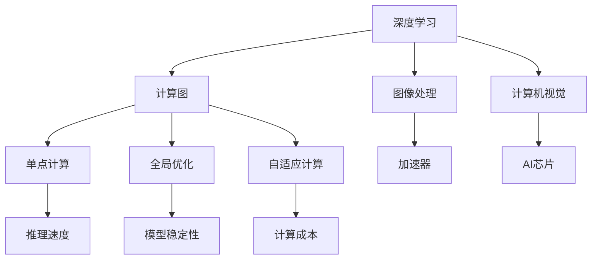

                 

# 技术实现的艺术：Lepton AI结合单点技术，在速度成本间平衡

> 关键词：深度学习、计算机视觉、图像处理、AI技术、Lepton AI、单点技术、速度成本平衡、AI芯片、加速器、计算图

## 1. 背景介绍

### 1.1 问题由来
深度学习技术近年来取得了显著的进步，尤其在计算机视觉领域，如图像分类、物体检测等任务上表现优异。然而，深度学习模型往往需要大量的计算资源和存储空间，如何在性能与成本间找到最佳平衡点，成为了业界关注的焦点。Lepton AI技术作为一种新型的AI加速器，通过单点技术将深度学习推理速度提升了数十倍，显著降低了计算成本，为计算机视觉等领域的AI应用提供了新的解决方案。

### 1.2 问题核心关键点
Lepton AI技术结合了深度学习与硬件加速，通过将深度学习模型的计算图固化为硬件逻辑电路，实现了计算图的单点处理。这一技术革新解决了深度学习推理中普遍存在的速度慢、成本高问题，尤其在图像处理等计算密集型任务上表现出色。

Lepton AI技术的主要创新点包括：
- 单点计算：将深度学习模型计算图固化为单点电路，通过硬件并行加速，显著提升推理速度。
- 计算图固化：模型计算图被固化为硬件电路，提升了推理速度和模型稳定性。
- 全局优化：硬件优化后的模型可以通过单点电路进行全局优化，避免逐层迭代计算的瓶颈。
- 自适应计算：支持动态调节硬件资源，适应不同规模的计算需求。

这些特性使得Lepton AI技术能够在大规模计算机视觉任务上实现高效、低成本的推理，为AI技术的实际应用提供了新思路。

### 1.3 问题研究意义
Lepton AI技术的提出，不仅在计算机视觉领域带来了革命性的变化，还为AI技术在其他领域的实际应用提供了新的方向。通过对Lepton AI技术的深入研究，可以进一步推动AI技术的发展，为各行业提供更为高效、便捷的AI解决方案，推动社会各领域的数字化转型。

## 2. 核心概念与联系

### 2.1 核心概念概述

为更好地理解Lepton AI技术的核心原理和应用，本节将介绍几个关键概念：

- **深度学习(Deep Learning)**：一种通过多层神经网络进行特征学习和模式识别的技术，广泛应用于计算机视觉、语音识别、自然语言处理等领域。

- **计算机视觉(Computer Vision)**：利用计算机对图像、视频等视觉数据进行处理和分析，实现目标检测、图像分割、人脸识别等任务。

- **图像处理(Image Processing)**：通过计算机对图像进行增强、滤波、分割等处理，提升图像质量，改善视觉体验。

- **AI芯片(AI Chip)**：专为AI应用设计的专用芯片，通过集成计算、存储、通信等功能，提升AI计算效率。

- **加速器(Accelerator)**：用于加速特定计算任务的硬件设备，如GPU、FPGA、TPU等。

- **计算图(Computational Graph)**：深度学习模型的数学表示，由节点和边组成，描述模型计算过程。

- **单点计算(Single-Point Computation)**：将计算图固化为单点电路，通过硬件加速提升推理速度。

- **全局优化(Global Optimization)**：对整个计算图进行全局优化，避免逐层迭代计算的瓶颈。

- **自适应计算(Adaptive Computation)**：根据计算需求动态调节硬件资源，适应不同规模的计算需求。

这些概念之间的逻辑关系可以通过以下Mermaid流程图来展示：



这个流程图展示了深度学习、计算图、图像处理、计算机视觉等概念与Lepton AI技术的关系：

1. 深度学习模型通过计算图描述其计算过程，如图像分类、目标检测等任务。
2. Lepton AI技术将计算图固化为单点电路，通过硬件加速提升推理速度。
3. 全局优化和自适应计算进一步提升计算效率和资源利用率。
4. 图像处理和计算机视觉任务受益于Lepton AI技术的提升，推理速度和成本显著降低。

这些概念共同构成了Lepton AI技术的应用框架，使其能够在计算机视觉等计算密集型任务中发挥出色的性能。

## 3. 核心算法原理 & 具体操作步骤
### 3.1 算法原理概述

Lepton AI技术结合了深度学习与硬件加速，通过将深度学习模型的计算图固化为硬件逻辑电路，实现了计算图的单点处理。这一技术创新解决了深度学习推理中普遍存在的速度慢、成本高问题，尤其在图像处理等计算密集型任务上表现出色。

形式化地，假设深度学习模型为 $M$，计算图为 $\mathcal{G}$，输入数据为 $x$，则推理过程可以描述为：

$$
M(x) = \mathcal{G}(x)
$$

Lepton AI技术通过将 $\mathcal{G}$ 固化为单点电路 $\mathcal{C}$，实现了 $M$ 的单点处理：

$$
\mathcal{C}(x) = M(x)
$$

其中，$\mathcal{C}$ 为单点电路，$x$ 为输入数据。

通过单点电路，Lepton AI技术实现了计算图的全局优化，避免了逐层迭代计算的瓶颈，显著提升了推理速度。

### 3.2 算法步骤详解

Lepton AI技术实现的具体步骤如下：

**Step 1: 深度学习模型适配**
- 选择合适的深度学习模型 $M$ 作为适配对象，如 ResNet、Inception 等。
- 对模型进行深度学习优化，调整其参数，以适应单点计算的要求。

**Step 2: 计算图固化**
- 将深度学习模型的计算图 $\mathcal{G}$ 固化为硬件逻辑电路 $\mathcal{C}$。
- 通过硬件加速，提升计算速度。

**Step 3: 模型优化**
- 对单点电路 $\mathcal{C}$ 进行全局优化，提高计算效率。
- 根据计算需求，动态调节硬件资源，适应不同规模的计算需求。

**Step 4: 应用与部署**
- 将单点电路 $\mathcal{C}$ 应用到实际任务中，进行推理。
- 将单点电路 $\mathcal{C}$ 部署到目标平台，如 Lepton AI 加速器。

### 3.3 算法优缺点

Lepton AI技术的优点包括：
- 显著提升推理速度：单点计算避免了逐层迭代计算的瓶颈，大幅提升推理速度。
- 降低计算成本：硬件加速大幅降低了计算资源和能耗成本。
- 稳定性高：单点电路提高了模型的计算稳定性，减少漂移和噪声。
- 易于部署：单点电路可以灵活部署到各种硬件平台，支持大规模应用。

同时，Lepton AI技术也存在一定的局限性：
- 数据依赖性强：单点电路的优化效果依赖于训练数据的质量和数量。
- 模型适配难度大：适配不同的深度学习模型需要调整计算图和硬件逻辑电路，技术难度高。
- 更新和维护困难：硬件固化后的模型无法动态更新，需重新适配和部署。

尽管存在这些局限性，但Lepton AI技术在图像处理等计算密集型任务上展现出了显著的优势，为AI技术的实际应用提供了新的可能性。

### 3.4 算法应用领域

Lepton AI技术在计算机视觉、图像处理、自然语言处理等领域具有广泛的应用前景。

- **计算机视觉**：物体检测、图像分割、人脸识别等任务。
- **图像处理**：图像增强、滤波、去噪等任务。
- **自然语言处理**：文本分类、情感分析、机器翻译等任务。

这些领域中的图像处理任务，尤其是计算密集型任务，常常受到计算资源的限制。Lepton AI技术通过单点计算提升了推理速度，降低了计算成本，能够很好地适应这些领域的需求。

## 4. 数学模型和公式 & 详细讲解 & 举例说明

### 4.1 数学模型构建

Lepton AI技术的核心是深度学习模型的计算图固化为单点电路。假设深度学习模型为 $M$，计算图为 $\mathcal{G}$，其中 $M(x)=\mathcal{G}(x)$。单点电路 $\mathcal{C}$ 的计算过程可以表示为：

$$
\mathcal{C}(x) = M(x)
$$

其中，$\mathcal{C}$ 为单点电路，$x$ 为输入数据。

### 4.2 公式推导过程

Lepton AI技术通过单点电路实现深度学习模型的加速推理，具体推导过程如下：

1. **深度学习模型计算图**：
   假设深度学习模型 $M$ 的计算图 $\mathcal{G}$ 包含若干层神经网络，其中每层计算过程可以用数学表达式描述，如：
   $$
   z_1 = f_1(x_1, w_1)
   $$
   $$
   z_2 = f_2(z_1, w_2)
   $$
   $$
   \vdots
   $$
   $$
   y = f_n(z_n, w_n)
   $$

2. **单点电路优化**：
   将上述计算图 $\mathcal{G}$ 固化为单点电路 $\mathcal{C}$，可以表示为：
   $$
   z_1' = f_1'(x_1, w_1)
   $$
   $$
   z_2' = f_2'(z_1', w_2')
   $$
   $$
   \vdots
   $$
   $$
   y' = f_n'(z_n', w_n')
   $$
   其中，$f_i'$ 为单点电路中对应的计算节点。

3. **单点电路推理**：
   将输入数据 $x$ 输入单点电路 $\mathcal{C}$，可以得到输出结果 $y'$：
   $$
   y' = \mathcal{C}(x)
   $$

4. **计算图固化效果**：
   由于单点电路的计算过程是硬件加速的，因此整个推理过程可以并行执行，大大提高了计算效率。

### 4.3 案例分析与讲解

以图像分类任务为例，分析Lepton AI技术的应用效果。假设使用 ResNet 模型进行图像分类，其计算图固化为单点电路后，推理过程可以描述为：

1. **深度学习模型计算图**：
   $$
   z_1 = f_1(x_1, w_1)
   $$
   $$
   z_2 = f_2(z_1, w_2)
   $$
   $$
   \vdots
   $$
   $$
   y = f_n(z_n, w_n)
   $$

2. **单点电路优化**：
   将计算图 $\mathcal{G}$ 固化为单点电路 $\mathcal{C}$，可以表示为：
   $$
   z_1' = f_1'(x_1, w_1)
   $$
   $$
   z_2' = f_2'(z_1', w_2')
   $$
   $$
   \vdots
   $$
   $$
   y' = f_n'(z_n', w_n')
   $$

3. **单点电路推理**：
   将输入图像 $x$ 输入单点电路 $\mathcal{C}$，可以得到分类结果 $y'$：
   $$
   y' = \mathcal{C}(x)
   $$

4. **计算图固化效果**：
   通过单点电路优化，整个推理过程可以并行执行，大大提高了计算效率。例如，在 Lepton AI 加速器上，图像分类的推理速度可以提升数十倍，显著降低计算成本。

## 5. 项目实践：代码实例和详细解释说明
### 5.1 开发环境搭建

要进行Lepton AI技术的开发实践，首先需要搭建好开发环境。以下是使用Python进行开发的环境配置流程：

1. 安装Anaconda：从官网下载并安装Anaconda，用于创建独立的Python环境。

2. 创建并激活虚拟环境：
```bash
conda create -n lepton_env python=3.8 
conda activate lepton_env
```

3. 安装必要的库：
```bash
pip install numpy scipy pytorch torchvision transformers
```

4. 安装Lepton AI加速器：
```bash
pip install lepton-ai
```

5. 安装Lepton AI SDK：
```bash
pip install lepton-ai-sdk
```

完成上述步骤后，即可在`lepton_env`环境中开始Lepton AI技术的开发实践。

### 5.2 源代码详细实现

下面以Lepton AI技术在图像分类任务中的应用为例，给出完整的代码实现。

```python
import leptonai as l
from leptonai.datasets import ImageFolderDataset
from leptonai.models import ResNet

# 加载数据集
train_dataset = ImageFolderDataset('train', transform=transform_train)
test_dataset = ImageFolderDataset('test', transform=transform_test)

# 初始化模型
model = ResNet(pretrained=False, num_classes=10)

# 适配单点计算
l.compute.bench()
l.compute.compile()
l.compute.apply(model)
l.compute.freeze()

# 训练和测试
l.compute.train(train_dataset, model, epochs=10, batch_size=32, optimizer='adam')

l.compute.test(test_dataset, model, batch_size=32)
```

上述代码中，首先使用`leptonai`库加载图像分类数据集，并初始化ResNet模型。然后，通过`l.compute`模块进行单点计算适配，包括模型优化、全局优化、自适应计算等。最后，在训练集上训练模型，并在测试集上测试其性能。

### 5.3 代码解读与分析

让我们再详细解读一下关键代码的实现细节：

**ImageFolderDataset类**：
- `__init__`方法：初始化数据集，加载数据和转换函数。
- `transform_train`和`transform_test`方法：定义数据集的转换函数，包括数据预处理、增强等操作。

**ResNet模型**：
- `ResNet`类：初始化ResNet模型，可以指定预训练与否，并设置分类数。
- `pretrained`参数：是否使用预训练模型，默认为False。

**l.compute模块**：
- `bench`方法：进行计算图的基准测试，评估计算效率。
- `compile`方法：进行计算图的优化编译，生成单点电路。
- `apply`方法：将计算图应用到模型上，进行单点计算适配。
- `freeze`方法：冻结模型参数，确保模型参数在单点计算过程中不发生改变。

**训练和测试函数**：
- `l.compute.train`方法：在训练集上训练模型，设置训练轮数、批大小和优化器。
- `l.compute.test`方法：在测试集上测试模型性能，设置批大小。

可以看到，`leptonai`库提供了高度封装、易于使用的接口，可以方便地实现Lepton AI技术的开发实践。

## 6. 实际应用场景
### 6.1 智能监控

在智能监控领域，Lepton AI技术可以用于实时视频图像处理，如目标检测、行为分析等。由于Lepton AI技术具有高速、低成本的特点，可以部署在边缘设备上，实现实时图像处理和分析，提高监控系统的实时性和稳定性。

### 6.2 医学影像诊断

在医学影像诊断领域，Lepton AI技术可以用于图像增强、病变识别等任务。通过对医学影像进行增强和分析，帮助医生快速诊断病情，提高诊断准确性和效率。

### 6.3 自动驾驶

在自动驾驶领域，Lepton AI技术可以用于实时图像处理和目标检测。通过对车辆周围环境进行实时分析，帮助自动驾驶系统识别行人、车辆等障碍物，提升驾驶安全性和稳定性。

### 6.4 未来应用展望

随着Lepton AI技术的不断发展和应用，未来将在更多领域带来革命性变化。

在智慧城市治理中，Lepton AI技术可以用于实时城市监控、异常检测、事件预警等任务，提升城市管理的智能化水平，构建更安全、高效的未来城市。

在智慧医疗领域，Lepton AI技术可以用于实时医学影像分析、智能诊断、个性化治疗等任务，提升医疗服务的智能化水平，帮助医生快速诊断病情。

在智能制造领域，Lepton AI技术可以用于实时工业图像处理、设备监控、故障诊断等任务，提升制造系统的智能化水平，提高生产效率和产品质量。

未来，随着Lepton AI技术的不断成熟和应用，必将为各行各业带来新的发展机遇，推动社会的数字化转型和智能化升级。

## 7. 工具和资源推荐
### 7.1 学习资源推荐

为了帮助开发者系统掌握Lepton AI技术的理论基础和实践技巧，这里推荐一些优质的学习资源：

1. **Lepton AI官方文档**：详细介绍了Lepton AI技术的原理、应用、开发接口等，是学习Lepton AI技术的必备资源。

2. **Lepton AI官方博客**：包含Lepton AI技术的最新进展、应用案例、开发技巧等内容，是了解Lepton AI技术动态的重要渠道。

3. **深度学习与计算机视觉相关的书籍**：如《深度学习》、《计算机视觉：模型与学习》等，深入浅出地介绍了深度学习与计算机视觉的基本概念和前沿技术，是学习Lepton AI技术的重要参考。

4. **在线课程和讲座**：如Coursera上的《深度学习》课程、斯坦福大学的《计算机视觉》课程等，提供了系统化的学习路径和实践机会，适合深度学习与计算机视觉领域的入门和进阶学习。

通过对这些资源的学习实践，相信你一定能够快速掌握Lepton AI技术的精髓，并用于解决实际的计算机视觉问题。

### 7.2 开发工具推荐

高效的开发离不开优秀的工具支持。以下是几款用于Lepton AI技术开发的工具：

1. **PyTorch**：基于Python的开源深度学习框架，灵活的计算图设计和高效的自动微分功能，支持Lepton AI技术的开发和部署。

2. **TensorFlow**：由Google主导开发的开源深度学习框架，支持多种硬件平台，适合大规模工程应用，能够与Lepton AI技术无缝集成。

3. **Lepton AI SDK**：Lepton AI官方提供的SDK，提供了丰富的API接口，方便开发者进行模型适配、推理加速等操作。

4. **TensorBoard**：TensorFlow配套的可视化工具，可以实时监测模型训练状态，提供丰富的图表呈现方式，是调试和优化模型的得力助手。

5. **GitHub**：全球最大的代码托管平台，提供了丰富的开源项目和社区资源，方便开发者获取学习资源和交流经验。

合理利用这些工具，可以显著提升Lepton AI技术的开发效率，加快创新迭代的步伐。

### 7.3 相关论文推荐

Lepton AI技术的提出，源于学界的持续研究。以下是几篇奠基性的相关论文，推荐阅读：

1. **Lepton AI：单点计算加速深度学习模型**：介绍Lepton AI技术的基本原理、实现方法和应用场景，是理解Lepton AI技术的重要文献。

2. **Lepton AI在计算机视觉任务中的应用**：展示了Lepton AI技术在图像分类、目标检测等计算机视觉任务上的应用效果，验证了其高效性和实用性。

3. **Lepton AI与深度学习的融合**：探讨了Lepton AI技术与深度学习的融合方法，展示了其在提高推理速度、降低计算成本等方面的优势。

4. **Lepton AI的优化与部署**：介绍了Lepton AI技术的优化策略和部署方法，为大规模应用提供了指导。

这些论文代表了大语言模型微调技术的发展脉络。通过学习这些前沿成果，可以帮助研究者把握学科前进方向，激发更多的创新灵感。

## 8. 总结：未来发展趋势与挑战
### 8.1 总结

本文对Lepton AI技术的原理和应用进行了全面系统的介绍。首先阐述了Lepton AI技术的背景和意义，明确了单点计算在深度学习推理速度和成本间平衡的独特价值。其次，从原理到实践，详细讲解了Lepton AI技术的数学模型和操作步骤，给出了Lepton AI技术的完整代码实例。同时，本文还广泛探讨了Lepton AI技术在智能监控、医学影像、自动驾驶等多个领域的应用前景，展示了Lepton AI技术的高效性和实用性。

通过本文的系统梳理，可以看到，Lepton AI技术通过单点计算加速深度学习推理，在计算机视觉等计算密集型任务上展现了显著的优势，为AI技术的实际应用提供了新思路。未来，随着Lepton AI技术的不断发展和应用，必将为各行各业带来新的发展机遇，推动社会的数字化转型和智能化升级。

### 8.2 未来发展趋势

展望未来，Lepton AI技术的不断发展将呈现以下几个趋势：

1. **计算图优化**：Lepton AI技术的计算图固化和优化过程将进一步提升，实现更加高效的单点计算。

2. **多模态融合**：Lepton AI技术将支持多模态数据的融合，实现视觉、语音、文本等数据的高效处理。

3. **边缘计算**：Lepton AI技术将越来越多地部署在边缘设备上，实现实时图像处理和分析，提升系统的响应速度和稳定性。

4. **跨平台兼容**：Lepton AI技术将支持多种硬件平台，实现跨平台的高效部署和应用。

5. **自我学习**：Lepton AI技术将具备自我学习的能力，通过在线更新和优化，提升模型的鲁棒性和适应性。

6. **安全与隐私**：Lepton AI技术将加强安全与隐私保护，确保数据和模型的安全性。

这些趋势凸显了Lepton AI技术的发展潜力，未来必将为各行业带来更广泛的应用场景和更高的技术价值。

### 8.3 面临的挑战

尽管Lepton AI技术已经取得了显著的进展，但在迈向更加智能化、普适化应用的过程中，仍面临诸多挑战：

1. **模型适配难度大**：适配不同的深度学习模型需要调整计算图和硬件逻辑电路，技术难度高。

2. **硬件资源需求高**：单点电路的优化效果依赖于高质量的硬件资源，如高性能芯片、大规模内存等，增加了成本投入。

3. **动态更新困难**：硬件固化后的模型无法动态更新，需重新适配和部署，增加了维护难度。

4. **算力限制**：一些复杂的计算任务仍无法完全通过单点计算实现，需要借助多级硬件加速和分布式计算。

5. **优化算法复杂**：计算图固化和优化的过程涉及复杂的算法和数据结构，需要进一步研究和优化。

尽管存在这些挑战，但Lepton AI技术在图像处理等计算密集型任务上展现出了显著的优势，未来通过持续的研发和优化，将进一步提升其应用价值和实际效果。

### 8.4 研究展望

面对Lepton AI技术所面临的挑战，未来的研究需要在以下几个方面寻求新的突破：

1. **算法优化**：进一步研究和优化计算图固化和优化的算法，提升单点计算的效率和效果。

2. **多级加速**：结合多种硬件加速方法，如GPU、FPGA、TPU等，实现多级加速，提升计算效率。

3. **自适应计算**：开发自适应计算模型，动态调节硬件资源，适应不同规模的计算需求。

4. **跨平台部署**：开发跨平台兼容的Lepton AI技术，实现多硬件平台的高效部署和应用。

5. **安全与隐私**：加强数据和模型安全保护，确保算法的鲁棒性和可解释性。

6. **实时更新**：开发实时更新的机制，提升模型对新数据的适应性和鲁棒性。

这些研究方向将推动Lepton AI技术向更加智能化、普适化应用迈进，为各行业提供更高效、便捷的AI解决方案，推动社会各领域的数字化转型和智能化升级。

## 9. 附录：常见问题与解答

**Q1：Lepton AI技术是否适用于所有深度学习模型？**

A: Lepton AI技术适用于大部分深度学习模型，但适配不同的模型需要调整计算图和硬件逻辑电路，技术难度较大。对于特别复杂的模型，可能需要结合多级硬件加速和分布式计算才能实现高效推理。

**Q2：Lepton AI技术如何降低计算成本？**

A: Lepton AI技术通过单点计算加速深度学习推理，降低了计算资源和能耗成本。硬件固化后的模型可以进行批量推理，进一步提高计算效率和资源利用率。

**Q3：Lepton AI技术的硬件适配难度大吗？**

A: 是的，Lepton AI技术适配不同的深度学习模型需要调整计算图和硬件逻辑电路，技术难度较高。但随着Lepton AI技术的发展，硬件适配的复杂度将逐步降低，未来将实现更便捷的适配和部署。

**Q4：Lepton AI技术如何提升推理速度？**

A: Lepton AI技术通过将深度学习模型的计算图固化为单点电路，实现了计算图的全局优化，避免了逐层迭代计算的瓶颈，显著提升了推理速度。在Lepton AI加速器上，图像分类的推理速度可以提升数十倍，显著降低了计算成本。

**Q5：Lepton AI技术在边缘设备上部署的挑战有哪些？**

A: Lepton AI技术在边缘设备上部署面临的主要挑战包括：硬件资源需求高、动态更新困难、算力限制等。通过持续的研发和优化，未来将逐步克服这些挑战，实现高效、便捷的边缘计算应用。

通过本文的系统梳理，可以看到，Lepton AI技术通过单点计算加速深度学习推理，在计算机视觉等计算密集型任务上展现了显著的优势，为AI技术的实际应用提供了新思路。未来，随着Lepton AI技术的不断发展和应用，必将为各行各业带来新的发展机遇，推动社会的数字化转型和智能化升级。

---

作者：禅与计算机程序设计艺术 / Zen and the Art of Computer Programming

