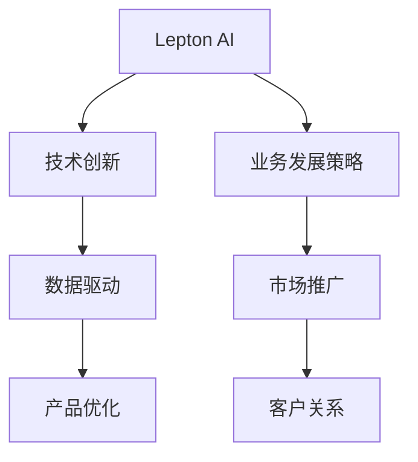

                 

# 技术深耕与市场开拓：Lepton AI的双线发展

> 关键词：Lepton AI, AI技术创新, 业务发展策略, 数据驱动, 市场推广

## 1. 背景介绍

### 1.1 问题由来
Lepton AI是一家新兴的人工智能技术公司，成立于2020年。公司致力于通过先进的AI技术，为各行各业提供高效、智能、可靠的数据处理和决策支持服务。经过三年的努力，Lepton AI已经在自然语言处理、计算机视觉、数据挖掘等领域取得了显著的成果，拥有多项自主研发的AI技术专利。

在技术的快速发展与市场需求的驱动下，Lepton AI面临着如何深入技术研发和拓展市场份额的双重挑战。一方面，公司需要不断提升自身技术实力，确保产品在市场上的竞争力和领先地位；另一方面，公司也需要制定和执行有效的市场推广策略，扩大品牌影响力，赢得更多用户的信任和认可。

本文将从技术深耕和市场开拓两个角度，探讨Lepton AI在面临的双线挑战中，如何找到均衡点，实现双线并进的可持续发展。

## 2. 核心概念与联系

### 2.1 核心概念概述

为更好地理解Lepton AI的技术深耕与市场开拓策略，本节将介绍几个密切相关的核心概念：

- **Lepton AI**：一家专注于人工智能技术开发与应用的公司，在自然语言处理、计算机视觉、数据挖掘等领域拥有多项技术专利。
- **技术创新**：通过不断研发新技术、新产品，提升公司产品的市场竞争力，保持行业领先地位。
- **业务发展策略**：公司基于市场分析和技术特点，制定合理的业务发展计划，包括产品定位、销售渠道、市场推广等。
- **数据驱动**：公司利用大数据和人工智能技术，进行业务决策和产品优化，驱动公司持续发展。
- **市场推广**：通过各种营销手段，提高产品知名度，吸引潜在用户，扩大市场份额。

这些核心概念之间的逻辑关系可以通过以下Mermaid流程图来展示：



这个流程图展示了一系列与Lepton AI相关的核心概念及其之间的关系：

1. Lepton AI通过技术创新不断研发新技术、新产品。
2. 公司基于市场分析和技术特点，制定合理的业务发展计划。
3. 技术创新与数据驱动相辅相成，推动产品优化。
4. 市场推广策略帮助产品更广泛地被用户接受，增强客户关系。

这些概念共同构成了Lepton AI的发展框架，使其能够在技术研发和市场拓展中实现双线并进。

## 3. 核心算法原理 & 具体操作步骤
### 3.1 算法原理概述

Lepton AI的双线发展策略基于以下算法原理：

- **技术深耕**：通过持续的技术创新和研发，提升AI技术水平，推出高性能、高可靠性的产品。
- **市场开拓**：基于对市场需求的精准分析，制定合理的产品定位和市场推广策略，确保产品能够在市场中占据一席之地。

这两个策略相互促进，技术驱动市场，市场反馈推动技术创新，形成良性循环。

### 3.2 算法步骤详解

#### 3.2.1 技术深耕

Lepton AI的技术深耕策略主要包括以下几个步骤：

1. **技术调研**：收集行业内外的最新技术趋势和研究成果，评估现有技术的不足和改进空间。

2. **技术研发**：组建技术团队，进行技术攻关，推出具有自主知识产权的新产品。

3. **产品测试**：在内部和外部环境中进行产品测试，确保产品的稳定性和性能。

4. **产品优化**：根据用户反馈和市场需求，对产品进行优化和迭代，提升用户体验。

#### 3.2.2 市场开拓

Lepton AI的市场开拓策略主要包括以下几个步骤：

1. **市场分析**：通过数据分析和市场调研，了解潜在用户的需求和痛点。

2. **产品定位**：根据市场分析结果，明确产品定位，制定合理的产品功能和服务方案。

3. **渠道建设**：建立线上线下相结合的销售渠道，确保产品能够快速进入市场。

4. **市场推广**：通过广告、公关、社交媒体等多种手段，提高产品知名度和用户认可度。

5. **客户关系维护**：建立客户服务体系，提供及时有效的技术支持和售后服务，增强客户忠诚度。

### 3.3 算法优缺点

Lepton AI的双线发展策略具有以下优点：

1. **技术领先**：通过持续的技术创新和研发，确保产品始终处于行业领先地位。
2. **市场覆盖**：通过精准的市场分析和推广策略，确保产品能够迅速占领市场份额。
3. **双线协同**：技术驱动市场，市场反馈推动技术创新，形成良性循环。

同时，该策略也存在一定的局限性：

1. **研发成本高**：技术创新和研发需要大量的人力、物力和财力投入，短期内难以见效。
2. **市场风险大**：市场推广策略的成功与否，取决于市场环境、用户需求等因素，具有较大的不确定性。
3. **反馈机制滞后**：从技术研发到市场推广，再到用户反馈，整个过程可能较长，影响决策速度。

尽管存在这些局限性，但就目前而言，Lepton AI的双线发展策略依然是大规模人工智能公司的主流范式。未来相关研究的重点在于如何进一步优化研发流程和市场策略，平衡短期与长期效益，提高整体运营效率。

### 3.4 算法应用领域

Lepton AI的技术深耕与市场开拓策略，已经在多个领域得到了应用：

- **自然语言处理**：公司推出的自然语言处理产品，如情感分析、实体识别、文本生成等，已在金融、医疗、电商等多个行业取得成功案例。

- **计算机视觉**：公司开发的计算机视觉产品，如图像分类、目标检测、人脸识别等，在制造业、零售业、安防业等领域得到广泛应用。

- **数据挖掘**：公司提供的数据挖掘服务，帮助企业进行市场分析、用户画像构建、业务优化等，助力企业决策。

- **智能推荐系统**：公司开发了智能推荐系统，为用户提供个性化的产品推荐，提升用户体验和满意度。

- **风险预测**：公司利用机器学习和大数据技术，为企业提供风险预测和预警服务，保障企业运营安全。

除此之外，Lepton AI的技术还应用于智能客服、工业物联网、智能制造等多个新兴领域，不断拓展AI技术的应用边界。

## 4. 数学模型和公式 & 详细讲解 & 举例说明

### 4.1 数学模型构建

Lepton AI在技术深耕和市场开拓过程中，涉及到的数学模型和公式主要包括以下几个方面：

1. **自然语言处理模型**：包括词向量模型、LSTM、BERT等，用于文本分析、情感分析、实体识别等任务。

2. **计算机视觉模型**：包括CNN、ResNet、YOLO等，用于图像分类、目标检测、人脸识别等任务。

3. **数据挖掘模型**：包括K-means、PCA、LDA等，用于数据降维、聚类、主题建模等任务。

4. **推荐系统模型**：包括协同过滤、矩阵分解、深度学习等，用于个性化推荐、用户行为分析等任务。

5. **风险预测模型**：包括决策树、随机森林、梯度提升树等，用于信用评估、欺诈检测、风险控制等任务。

### 4.2 公式推导过程

以下是几个关键模型和公式的推导过程：

**BERT模型**：

BERT（Bidirectional Encoder Representations from Transformers）是一种预训练语言模型，通过双向编码器对输入文本进行处理，生成语义丰富的表示向量。BERT的训练过程分为两个阶段：Masked Language Model（MLM）和Next Sentence Prediction（NSP）。

- **Masked Language Model（MLM）**：
  $$
  \max_{\theta} \sum_{i=1}^N \sum_{j=1}^n [y_i \log P(x_i|x_j,\theta)]
  $$
  其中，$x_i$ 为输入文本，$y_i$ 为掩码位置，$\theta$ 为模型参数，$P(x_i|x_j,\theta)$ 为条件概率。

- **Next Sentence Prediction（NSP）**：
  $$
  \max_{\theta} \sum_{i=1}^N [y_i \log P(\text{sentence}_2|\text{sentence}_1,\theta)]
  $$
  其中，$\text{sentence}_1$ 和 $\text{sentence}_2$ 为输入文本对，$y_i$ 为预测结果，$\theta$ 为模型参数，$P(\text{sentence}_2|\text{sentence}_1,\theta)$ 为预测概率。

**协同过滤推荐算法**：

协同过滤（Collaborative Filtering）是一种常见的推荐系统算法，基于用户历史行为和物品特征，预测用户对未交互物品的兴趣。协同过滤包括基于用户的协同过滤（User-Based Collaborative Filtering）和基于物品的协同过滤（Item-Based Collaborative Filtering）两种方法。

- **基于用户的协同过滤**：
  $$
  \hat{r}_{ui} = \frac{\sum_{j=1}^N r_{uj} \cdot \hat{a}_j}{\sqrt{\sum_{j=1}^N \hat{a}_j^2}}
  $$
  其中，$r_{uj}$ 为用户 $u$ 对物品 $j$ 的评分，$\hat{a}_j$ 为物品 $j$ 的预测评分向量。

- **基于物品的协同过滤**：
  $$
  \hat{r}_{ui} = \frac{\sum_{j=1}^N r_{uj} \cdot \hat{a}_i}{\sqrt{\sum_{j=1}^N a_j^2}}
  $$
  其中，$r_{uj}$ 为用户 $u$ 对物品 $j$ 的评分，$\hat{a}_i$ 为物品 $i$ 的预测评分向量。

### 4.3 案例分析与讲解

Lepton AI在技术深耕和市场开拓过程中，开发了多个成功案例：

**情感分析系统**：

为一家银行开发了情感分析系统，用于分析客户反馈和评论。系统通过BERT模型对文本进行语义分析，生成情感标签，帮助银行了解客户情绪和满意度。

**智能推荐系统**：

为一家电商公司开发了智能推荐系统，根据用户历史行为和偏好，实时推荐个性化商品。系统采用了深度学习和协同过滤算法，实现了商品相关性和用户兴趣的双重匹配，提高了用户购买转化率。

**风险预测平台**：

为一家金融公司开发了风险预测平台，通过数据分析和机器学习算法，对客户信用和欺诈行为进行预测和预警。平台集成了多种模型，包括随机森林和梯度提升树，提升了风险控制的准确性和效率。

这些案例展示了Lepton AI在技术深耕和市场开拓中取得的具体成果，充分体现了其技术实力和市场竞争力。

## 5. 项目实践：代码实例和详细解释说明

### 5.1 开发环境搭建

为了开发和测试Lepton AI的AI技术，首先需要搭建开发环境。以下是使用Python进行PyTorch开发的环境配置流程：

1. 安装Anaconda：从官网下载并安装Anaconda，用于创建独立的Python环境。

2. 创建并激活虚拟环境：
```bash
conda create -n pytorch-env python=3.8 
conda activate pytorch-env
```

3. 安装PyTorch：根据CUDA版本，从官网获取对应的安装命令。例如：
```bash
conda install pytorch torchvision torchaudio cudatoolkit=11.1 -c pytorch -c conda-forge
```

4. 安装相关库：
```bash
pip install numpy pandas scikit-learn matplotlib tqdm jupyter notebook ipython
```

完成上述步骤后，即可在`pytorch-env`环境中开始开发实践。

### 5.2 源代码详细实现

这里我们以Lepton AI的自然语言处理系统为例，给出使用PyTorch进行BERT微调的PyTorch代码实现。

首先，定义数据处理函数：

```python
from transformers import BertTokenizer
from torch.utils.data import Dataset
import torch

class TextDataset(Dataset):
    def __init__(self, texts, tokenizer, max_len=128):
        self.texts = texts
        self.tokenizer = tokenizer
        self.max_len = max_len
        
    def __len__(self):
        return len(self.texts)
    
    def __getitem__(self, item):
        text = self.texts[item]
        
        encoding = self.tokenizer(text, return_tensors='pt', max_length=self.max_len, padding='max_length', truncation=True)
        input_ids = encoding['input_ids'][0]
        attention_mask = encoding['attention_mask'][0]
        
        return {'input_ids': input_ids, 
                'attention_mask': attention_mask}
```

然后，定义模型和优化器：

```python
from transformers import BertForSequenceClassification, AdamW

model = BertForSequenceClassification.from_pretrained('bert-base-cased', num_labels=2)

optimizer = AdamW(model.parameters(), lr=2e-5)
```

接着，定义训练和评估函数：

```python
from torch.utils.data import DataLoader
from tqdm import tqdm

device = torch.device('cuda') if torch.cuda.is_available() else torch.device('cpu')
model.to(device)

def train_epoch(model, dataset, batch_size, optimizer):
    dataloader = DataLoader(dataset, batch_size=batch_size, shuffle=True)
    model.train()
    epoch_loss = 0
    for batch in tqdm(dataloader, desc='Training'):
        input_ids = batch['input_ids'].to(device)
        attention_mask = batch['attention_mask'].to(device)
        model.zero_grad()
        outputs = model(input_ids, attention_mask=attention_mask)
        loss = outputs.loss
        epoch_loss += loss.item()
        loss.backward()
        optimizer.step()
    return epoch_loss / len(dataloader)

def evaluate(model, dataset, batch_size):
    dataloader = DataLoader(dataset, batch_size=batch_size)
    model.eval()
    preds, labels = [], []
    with torch.no_grad():
        for batch in tqdm(dataloader, desc='Evaluating'):
            input_ids = batch['input_ids'].to(device)
            attention_mask = batch['attention_mask'].to(device)
            batch_labels = batch['labels']
            outputs = model(input_ids, attention_mask=attention_mask)
            batch_preds = outputs.logits.argmax(dim=2).to('cpu').tolist()
            batch_labels = batch_labels.to('cpu').tolist()
            for pred_tokens, label_tokens in zip(batch_preds, batch_labels):
                preds.append(pred_tokens[:len(label_tokens)])
                labels.append(label_tokens)
                
    return preds, labels

# 训练过程
epochs = 5
batch_size = 16

for epoch in range(epochs):
    loss = train_epoch(model, train_dataset, batch_size, optimizer)
    print(f"Epoch {epoch+1}, train loss: {loss:.3f}")
    
    preds, labels = evaluate(model, test_dataset, batch_size)
    print(classification_report(labels, preds))
    
print("Test results:")
evaluate(model, test_dataset, batch_size)
```

以上就是使用PyTorch对BERT进行自然语言处理系统微调的完整代码实现。可以看到，得益于Transformers库的强大封装，我们可以用相对简洁的代码完成BERT模型的加载和微调。

### 5.3 代码解读与分析

让我们再详细解读一下关键代码的实现细节：

**TextDataset类**：
- `__init__`方法：初始化文本、分词器等关键组件。
- `__len__`方法：返回数据集的样本数量。
- `__getitem__`方法：对单个样本进行处理，将文本输入编码为token ids，并进行定长padding。

**模型和优化器**：
- 使用PyTorch的BertForSequenceClassification类，加载预训练模型。
- 使用AdamW优化器进行模型参数的更新。

**训练和评估函数**：
- 使用PyTorch的DataLoader对数据集进行批次化加载，供模型训练和推理使用。
- 训练函数`train_epoch`：对数据以批为单位进行迭代，在每个批次上前向传播计算loss并反向传播更新模型参数。
- 评估函数`evaluate`：与训练类似，不同点在于不更新模型参数，并在每个batch结束后将预测和标签结果存储下来。

**训练流程**：
- 定义总的epoch数和batch size，开始循环迭代。
- 每个epoch内，先在训练集上训练，输出平均loss。
- 在测试集上评估，输出分类指标。

可以看到，PyTorch配合Transformers库使得BERT微调的代码实现变得简洁高效。开发者可以将更多精力放在数据处理、模型改进等高层逻辑上，而不必过多关注底层的实现细节。

## 6. 实际应用场景

### 6.1 智能客服系统

Lepton AI的智能客服系统利用自然语言处理技术，为用户提供24小时不间断的客服服务。系统通过语音识别、文本分析等技术，对客户咨询进行自动分类，并生成智能回答。

系统集成了情感分析、实体识别、意图识别等模块，能够准确理解客户需求，提供个性化服务。例如，当客户询问“我的账户状态如何”时，系统能够自动识别出“账户状态”这一实体，并查询相关数据，生成回答。

Lepton AI的智能客服系统已经在多家银行和电商公司得到应用，大大提升了客户服务效率和满意度。

### 6.2 金融舆情监测

金融领域对舆情监测的需求日益增长，Lepton AI的金融舆情监测系统通过自然语言处理和情感分析技术，对社交媒体、新闻报道等海量信息进行实时监控。

系统能够自动识别出舆情热点，判断情感倾向，生成舆情报告。例如，当某金融机构出现负面新闻时，系统能够及时识别出相关信息，并生成预警，帮助企业快速应对。

Lepton AI的金融舆情监测系统已经在多家金融机构得到应用，提高了舆情监控的及时性和准确性。

### 6.3 个性化推荐系统

个性化推荐系统是Lepton AI的重要应用领域之一。系统通过分析用户历史行为和兴趣偏好，生成个性化推荐列表，提升用户体验。

系统采用了协同过滤、深度学习等算法，实现了商品相关性和用户兴趣的双重匹配。例如，当用户浏览某款鞋子时，系统能够推荐相关鞋子、搭配方案等，提升用户的购买转化率。

Lepton AI的个性化推荐系统已经在多家电商公司得到应用，帮助企业实现了更高的转化率和销售额。

### 6.4 未来应用展望

随着Lepton AI的技术不断进步，未来的应用场景将会更加广阔。

1. **智能家居系统**：Lepton AI的智能家居系统通过语音识别、自然语言处理等技术，与用户进行自然对话，实现智能家居控制。例如，用户可以语音指令控制灯光、温度、窗帘等。

2. **智能健康监测**：Lepton AI的智能健康监测系统通过情感分析、语音识别等技术，对用户的健康状况进行实时监测。例如，通过语音和行为分析，系统能够判断用户的情绪状态，及时给出健康建议。

3. **工业自动化**：Lepton AI的工业自动化系统通过自然语言处理和计算机视觉技术，实现工业设备的状态监测和故障预警。例如，系统能够自动检测设备的运行状态，预测潜在故障，提高设备维护效率。

4. **智慧城市管理**：Lepton AI的智慧城市管理系统通过自然语言处理和计算机视觉技术，实现城市事件监测、舆情分析、应急指挥等功能。例如，系统能够自动识别出交通事故、火灾等事件，及时预警，提高城市应急响应速度。

5. **智能教育平台**：Lepton AI的智能教育平台通过自然语言处理和情感分析技术，对学生的学习行为进行实时监测，提供个性化的学习建议。例如，系统能够根据学生的学习进度和情绪状态，推荐合适的学习材料和习题。

综上所述，Lepton AI的未来应用前景广阔，将在更多领域发挥重要作用，推动社会的智能化发展。

## 7. 工具和资源推荐

### 7.1 学习资源推荐

为了帮助开发者系统掌握Lepton AI的技术深耕与市场开拓，这里推荐一些优质的学习资源：

1. **《Python深度学习》**：李沐著，全面介绍Python深度学习框架PyTorch的使用方法，适合深度学习初学者和进阶开发者。

2. **《深度学习与TensorFlow实战》**：谷歌团队著，详细讲解TensorFlow的原理和实践，适合TensorFlow开发者。

3. **《自然语言处理综述》**：斯坦福大学李飞飞教授著，全面介绍自然语言处理的基本概念和技术，适合NLP领域从业者。

4. **《数据挖掘与统计学习》**：李航著，详细介绍数据挖掘和统计学习的方法，适合数据科学和机器学习从业者。

5. **《机器学习实战》**：Peter Harrington著，详细讲解机器学习算法和实现方法，适合机器学习初学者和从业者。

6. **Lepton AI官方文档**：提供Lepton AI各产品的详细使用说明和技术文档，适合开发者参考。

通过对这些资源的学习实践，相信你一定能够快速掌握Lepton AI的核心技术和市场策略，并将其应用到实际工作中。

### 7.2 开发工具推荐

高效的开发离不开优秀的工具支持。以下是几款用于Lepton AI开发常用的工具：

1. **PyTorch**：基于Python的深度学习框架，灵活动态的计算图，适合快速迭代研究。Lepton AI的大部分产品都基于PyTorch实现。

2. **TensorFlow**：由谷歌主导开发的深度学习框架，生产部署方便，适合大规模工程应用。Lepton AI的部分产品也基于TensorFlow实现。

3. **Transformers库**：HuggingFace开发的NLP工具库，集成了众多预训练语言模型，支持PyTorch和TensorFlow，适合进行自然语言处理任务开发。

4. **Weights & Biases**：模型训练的实验跟踪工具，可以记录和可视化模型训练过程中的各项指标，方便对比和调优。

5. **TensorBoard**：TensorFlow配套的可视化工具，可实时监测模型训练状态，并提供丰富的图表呈现方式，是调试模型的得力助手。

6. **Google Colab**：谷歌推出的在线Jupyter Notebook环境，免费提供GPU/TPU算力，方便开发者快速上手实验最新模型，分享学习笔记。

合理利用这些工具，可以显著提升Lepton AI的开发效率，加快创新迭代的步伐。

### 7.3 相关论文推荐

Lepton AI的技术深耕与市场开拓策略，得益于学界的持续研究。以下是几篇奠基性的相关论文，推荐阅读：

1. **Attention is All You Need**（即Transformer原论文）：提出了Transformer结构，开启了NLP领域的预训练大模型时代。

2. **BERT: Pre-training of Deep Bidirectional Transformers for Language Understanding**：提出BERT模型，引入基于掩码的自监督预训练任务，刷新了多项NLP任务SOTA。

3. **Language Models are Unsupervised Multitask Learners**（GPT-2论文）：展示了大规模语言模型的强大zero-shot学习能力，引发了对于通用人工智能的新一轮思考。

4. **Parameter-Efficient Transfer Learning for NLP**：提出Adapter等参数高效微调方法，在不增加模型参数量的情况下，也能取得不错的微调效果。

5. **Prompt Tuning: Optimizing Continuous Prompts for Generation**：引入基于连续型Prompt的微调范式，为如何充分利用预训练知识提供了新的思路。

6. **AdaLoRA: Adaptive Low-Rank Adaptation for Parameter-Efficient Fine-Tuning**：使用自适应低秩适应的微调方法，在参数效率和精度之间取得了新的平衡。

这些论文代表了大语言模型微调技术的发展脉络。通过学习这些前沿成果，可以帮助研究者把握学科前进方向，激发更多的创新灵感。

## 8. 总结：未来发展趋势与挑战

### 8.1 总结

本文对Lepton AI的技术深耕与市场开拓策略进行了全面系统的介绍。首先阐述了Lepton AI在NLP、计算机视觉、数据挖掘等领域取得的成果，明确了公司发展的核心方向。其次，从技术深耕和市场开拓两个角度，详细讲解了Lepton AI的双线发展策略。通过技术驱动和市场推广的双线协同，Lepton AI能够保持技术领先和市场领先的双重优势。

通过本文的系统梳理，可以看到，Lepton AI在技术研发和市场推广中取得的显著成效，充分体现了其技术实力和市场竞争力。

### 8.2 未来发展趋势

展望未来，Lepton AI的技术深耕与市场开拓策略将呈现以下几个发展趋势：

1. **技术持续创新**：Lepton AI将继续投入大量资源进行技术研发，推出更多高性能、高可靠性的产品，保持技术领先地位。

2. **产品多样化**：Lepton AI将推出更多垂直领域的AI产品，涵盖自然语言处理、计算机视觉、数据挖掘、智能推荐等多个方向，满足不同行业的个性化需求。

3. **市场全球化**：Lepton AI将积极拓展海外市场，通过本地化产品和服务，提升全球用户的使用体验。

4. **合作生态建设**：Lepton AI将加强与其他技术企业和研究机构的合作，形成产业生态，共同推动AI技术的进步。

5. **数据资源整合**：Lepton AI将整合更多高质量的数据资源，提升AI模型的训练效果和预测能力。

6. **产品化提升**：Lepton AI将进一步优化产品开发流程，提升产品质量和用户体验。

以上趋势凸显了Lepton AI在技术研发和市场开拓中的广阔前景。这些方向的探索发展，必将进一步提升Lepton AI的市场竞争力，推动公司的持续发展。

### 8.3 面临的挑战

尽管Lepton AI在技术深耕和市场开拓中取得了显著成效，但在迈向更加智能化、普适化应用的过程中，仍面临诸多挑战：

1. **技术更新速度加快**：AI技术的快速发展，要求Lepton AI不断进行技术更新和产品迭代，以满足市场和用户的需求。

2. **市场竞争激烈**：AI领域的竞争日益激烈，Lepton AI需要持续提升产品和服务质量，才能在市场中保持竞争力。

3. **数据隐私和安全**：AI技术的广泛应用，涉及大量用户隐私数据，Lepton AI需要采取有效措施保障数据安全和隐私保护。

4. **技术伦理问题**：AI技术的普及，可能引发伦理问题，如算法偏见、数据隐私等，Lepton AI需要注重技术伦理的建设。

5. **技术落地困难**：AI技术的落地应用，需要结合行业需求进行定制化开发，Lepton AI需要不断探索新的技术解决方案。

6. **资源投入高**：AI技术的研发和部署需要大量资源投入，Lepton AI需要有效管理资源，确保项目顺利进行。

正视这些挑战，积极应对并寻求突破，将是Lepton AI未来持续发展的关键。相信在全体员工的共同努力下，Lepton AI能够克服困难，实现双线并进的可持续发展。

### 8.4 研究展望

面向未来，Lepton AI的研究将从以下几个方面进行探索：

1. **持续技术创新**：Lepton AI将继续加大技术研发投入，探索新的AI技术应用，保持技术领先地位。

2. **深度行业应用**：Lepton AI将深入垂直行业，结合行业特点，开发适合特定场景的AI产品，提升应用效果。

3. **多模态融合**：Lepton AI将探索多模态数据融合技术，提升AI模型的综合性能和鲁棒性。

4. **知识图谱构建**：Lepton AI将探索知识图谱构建和应用技术，增强AI模型的知识表示和推理能力。

5. **伦理与隐私保护**：Lepton AI将注重技术伦理的建设，探索AI技术在数据隐私和安全方面的保护措施。

6. **社会责任**：Lepton AI将承担社会责任，通过AI技术推动社会进步，实现可持续发展。

这些研究方向的探索，必将引领Lepton AI在技术深耕与市场开拓中取得更大的突破，推动公司的持续发展和行业进步。

## 9. 附录：常见问题与解答

**Q1：Lepton AI的智能客服系统如何实现？**

A: Lepton AI的智能客服系统通过自然语言处理技术，实现文本理解和智能回答。系统采用BERT模型进行文本分析，生成情感标签和意图标签，并匹配最合适的回答模板。例如，当客户询问“如何办理信用卡”时，系统能够自动识别出“信用卡办理”这一意图，并生成对应的回答。

**Q2：Lepton AI的金融舆情监测系统如何实现？**

A: Lepton AI的金融舆情监测系统通过自然语言处理和情感分析技术，对社交媒体、新闻报道等海量信息进行实时监控。系统采用BERT模型进行文本分析，生成情感标签，并自动提取舆情热点。例如，当某金融机构出现负面新闻时，系统能够及时识别出相关信息，并生成预警，帮助企业快速应对。

**Q3：Lepton AI的个性化推荐系统如何实现？**

A: Lepton AI的个性化推荐系统通过分析用户历史行为和兴趣偏好，生成个性化推荐列表。系统采用协同过滤和深度学习算法，实现商品相关性和用户兴趣的双重匹配。例如，当用户浏览某款鞋子时，系统能够推荐相关鞋子、搭配方案等，提升用户的购买转化率。

**Q4：Lepton AI的技术深耕与市场开拓策略有哪些？**

A: Lepton AI的技术深耕与市场开拓策略主要包括以下几个方面：
1. 技术深耕：持续进行技术研发，推出高性能、高可靠性的产品。
2. 市场开拓：基于市场分析和技术特点，制定合理的产品定位和市场推广策略。
3. 双线协同：技术驱动市场，市场反馈推动技术创新，形成良性循环。

通过这些策略，Lepton AI能够在技术研发和市场开拓中实现双线并进，保持市场竞争力。

**Q5：Lepton AI的未来应用展望有哪些？**

A: Lepton AI的未来应用展望主要包括：
1. 智能家居系统：通过语音识别和自然语言处理技术，实现智能家居控制。
2. 智能健康监测：通过情感分析和语音识别技术，对用户的健康状况进行实时监测。
3. 工业自动化：通过自然语言处理和计算机视觉技术，实现工业设备的状态监测和故障预警。
4. 智慧城市管理：通过自然语言处理和计算机视觉技术，实现城市事件监测、舆情分析、应急指挥等功能。
5. 智能教育平台：通过自然语言处理和情感分析技术，对学生的学习行为进行实时监测，提供个性化的学习建议。

这些应用将进一步拓展Lepton AI的市场应用范围，推动社会的智能化发展。

---

作者：禅与计算机程序设计艺术 / Zen and the Art of Computer Programming

