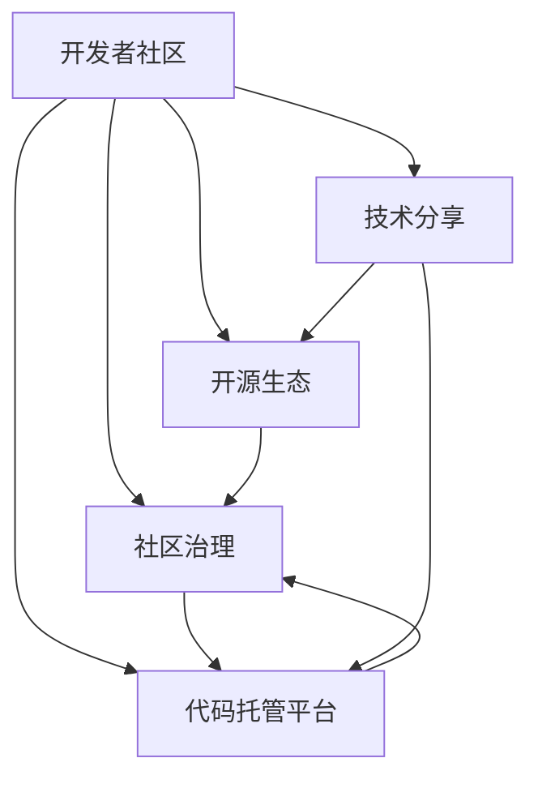

                 

# 技术社区建设：从参与者到组织者

> 关键词：技术社区, 开发者文化, 开源生态, 社区治理, 技术分享, 代码托管平台

## 1. 背景介绍

### 1.1 问题由来

随着开源运动的兴起和互联网的普及，技术社区已成为连接开发者、促进知识传播与创新的重要平台。从早期的Linux Kernel，到现在的GitHub、Stack Overflow等社区，开发者已经在这个虚拟空间中建立了自己的生态系统。然而，这些社区并不总是稳定且高效的，参与者的参与动机、社区规范、治理结构等问题都需要被仔细审视和改进。

### 1.2 问题核心关键点

技术社区的核心在于其文化和运作机制，这直接影响着社区的发展与活力。因此，社区的建设与管理是一个多维度的任务，包括但不限于：

1. **开发者文化**：形成一种开放、共享、协作的社区氛围，鼓励知识创新和持续学习。
2. **开源生态**：构建一个健康的开源项目生态，让优质项目得以持续成长。
3. **社区治理**：制定和执行有效的社区规则，确保社区的公平、公正和透明。
4. **技术分享**：提供多样化的技术分享渠道，促进知识交流和技术演进。
5. **代码托管平台**：提供一个稳定、可靠、易用的代码托管服务，促进项目的协同开发。

## 2. 核心概念与联系

### 2.1 核心概念概述

为了更好地理解技术社区的建设与管理，本节将介绍几个关键概念及其相互之间的联系：

- **开发者社区**：由开发者组成的技术交流社群，旨在分享知识、解决问题、促进技术创新。
- **开源生态**：基于开源理念，由开源项目、开发者、使用者、贡献者等共同构建的健康发展环境。
- **社区治理**：管理社区成员行为、处理争议、维护社区秩序的一套规则和流程。
- **技术分享**：通过讲座、研讨会、博客、论坛等形式，进行知识传播和技术交流。
- **代码托管平台**：提供源代码托管、版本控制、协作开发等功能，支持开发者共同构建项目。

这些概念之间的联系通过以下Mermaid流程图来展示：



这个流程图展示了开发者社区通过开源生态的构建、社区治理的实施、技术分享的推动、代码托管平台的支撑，形成了一个相互促进的良性循环。

## 3. 核心算法原理 & 具体操作步骤
### 3.1 算法原理概述

技术社区的建设与管理，本质上是一个多目标优化问题。其目标是构建一个健康、活跃、高效的技术社区，满足社区成员的需求，促进知识的传播与创新。其核心算法原理可以概括为以下几个方面：

1. **需求驱动**：根据社区成员的需求，提供相应的服务与支持，提升社区体验。
2. **激励机制**：建立有效的激励机制，鼓励积极参与和贡献。
3. **社区反馈**：通过社区反馈机制，持续改进社区服务和功能。
4. **规则制定**：制定清晰的社区规则，维护社区秩序和公平。
5. **数据分析**：利用数据分析工具，优化社区决策和资源分配。

### 3.2 算法步骤详解

基于上述原理，技术社区建设与管理可以遵循以下步骤：

1. **需求分析**：通过问卷调查、用户访谈等方式，了解社区成员的需求和期望。
2. **服务设计**：根据需求设计相应的服务与功能，如技术分享、代码托管等。
3. **规则制定**：制定社区规则和行为准则，确保社区的公平、公正和透明。
4. **激励机制**：设计积分系统、贡献排名等激励机制，鼓励积极参与和贡献。
5. **反馈收集**：建立社区反馈渠道，定期收集社区成员的意见和建议。
6. **数据分析**：利用数据分析工具，监控社区活动、用户行为等，进行动态优化。

### 3.3 算法优缺点

技术社区建设与管理的优势和劣势如下：

**优势**：
- 社区成员共享知识和资源，促进技术创新。
- 社区治理透明，能及时解决争议和问题。
- 开放共享的环境有助于吸引全球开发者参与。

**劣势**：
- 社区规模大、成员多样性高，管理和协调难度大。
- 资源和服务分配不均可能导致社区分化。
- 社区文化多样，可能存在冲突和误解。

### 3.4 算法应用领域

技术社区建设与管理已广泛应用于各种技术生态系统中，例如：

- GitHub：全球最大的开源代码托管平台，通过社区治理和代码贡献激励，吸引全球开发者参与。
- Stack Overflow：一个以技术问答为主的社区，通过积分系统、高质量回答等激励机制，推动知识共享。
- Linux Kernel：基于开源理念，通过社区协作和代码审查机制，开发并维护操作系统内核。
- Kubernetes：一个开源容器编排系统，通过社区贡献和版本管理，快速迭代更新。

这些平台和社区的成功经验，为技术社区建设与管理提供了宝贵的参考和借鉴。

## 4. 数学模型和公式 & 详细讲解 & 举例说明

### 4.1 数学模型构建

技术社区的管理与优化可以通过数学模型来量化和分析，其基本模型包括：

1. **用户满意度模型**：衡量社区成员对社区服务、功能等的满意度。
2. **贡献度模型**：评估社区成员的贡献和参与度。
3. **用户行为模型**：分析用户访问、互动等行为数据。
4. **社区健康度模型**：评估社区的活跃度、多样性、公平性等。

### 4.2 公式推导过程

以用户满意度模型为例，假设社区有 $N$ 名成员，满意度和不满意的比例分别为 $p$ 和 $q$，则社区满意度为 $p$。令社区满意成员为 $N_1$，不满意成员为 $N_2$，则有 $N_1 = Np$ 和 $N_2 = Nq$。满意度模型可以表示为：

$$
\text{满意度} = \frac{N_1}{N} = p
$$

类似地，贡献度模型、用户行为模型和社区健康度模型也可通过类似的方式建立和量化。

### 4.3 案例分析与讲解

以GitHub为例，其社区管理中使用了积分系统、贡献排名等激励机制，提升了社区的活跃度和参与度。GitHub利用数据分析工具，监控社区活动和用户行为，优化资源分配和服务设计。这些措施使GitHub成为全球开发者首选的代码托管平台。

## 5. 项目实践：代码实例和详细解释说明

### 5.1 开发环境搭建

技术社区的构建需要具备一定的技术基础和开发工具，以下是使用Python进行社区构建的开发环境配置流程：

1. 安装Anaconda：从官网下载并安装Anaconda，用于创建独立的Python环境。
2. 创建并激活虚拟环境：
```bash
conda create -n community-env python=3.8 
conda activate community-env
```
3. 安装必要的Python库和工具包：
```bash
pip install pandas numpy scikit-learn matplotlib jupyter notebook ipython
```

完成上述步骤后，即可在`community-env`环境中开始社区构建的实践。

### 5.2 源代码详细实现

以下是一个基于GitHub的开源社区构建实践，主要通过GitHub API和Jupyter Notebook实现：

首先，使用GitHub API获取社区活动数据和用户行为数据：

```python
import requests
import pandas as pd

# 获取社区活动数据
activity_data = requests.get('https://api.github.com/repos/octocat/hello-world/issues').json()
activity_df = pd.DataFrame(activity_data)

# 获取用户行为数据
user_data = requests.get('https://api.github.com/users?per_page=100').json()
user_df = pd.DataFrame(user_data)

# 将数据合并
merged_df = pd.merge(activity_df, user_df, on='user_id')
```

接着，使用数据分析和可视化工具，对社区数据进行统计分析：

```python
import matplotlib.pyplot as plt

# 统计活动数据
activity_counts = merged_df['type'].value_counts()
plt.bar(activity_counts.index, activity_counts)
plt.title('Community Activity Types')
plt.show()

# 统计用户行为数据
user_counts = merged_df['url'].value_counts()
plt.bar(user_counts.index, user_counts)
plt.title('User Behavior Types')
plt.show()
```

最后，根据分析结果，优化社区功能和激励机制：

```python
# 根据活动类型优化社区功能
if activity_counts['issue'] > activity_counts['pull_request']:
    # 增加issue讨论功能
    print('Increase issue discussion feature')
else:
    # 增加pull_request合并功能
    print('Increase pull_request merge feature')

# 根据用户行为优化激励机制
if user_counts['gists'] > user_counts['followers']:
    # 增加gist贡献积分
    print('Increase gist contribution score')
else:
    # 增加 follower积分
    print('Increase follower score')
```

以上就是使用Python对基于GitHub的开源社区进行构建和优化的完整代码实现。可以看到，通过GitHub API和数据分析工具，开发者能够快速构建和管理一个活跃、高效的开源社区。

### 5.3 代码解读与分析

让我们再详细解读一下关键代码的实现细节：

**GitHub API获取数据**：
- 通过requests库调用GitHub API，获取社区活动和用户行为数据。

**数据分析与可视化**：
- 使用pandas和matplotlib库对社区数据进行统计分析，绘制柱状图可视化结果。

**社区优化决策**：
- 根据活动数据和用户行为数据，决定是否增加相应的社区功能和激励机制。

通过这些代码，我们不仅能够获取和分析社区数据，还能根据分析结果做出优化决策，从而提升社区的活跃度和参与度。

## 6. 实际应用场景

### 6.1 技术分享平台

技术分享平台如CSDN、Stack Overflow等，通过提供高质量的技术文章、博客、讲座等资源，帮助开发者学习新技术和交流经验。这些平台通过积分系统、点赞评论等激励机制，鼓励社区成员积极分享和互动。

### 6.2 开源项目托管

开源项目托管平台如GitHub、Gitee等，为开发者提供了代码托管、版本控制、协作开发等功能，支持社区成员共同构建和维护开源项目。这些平台通过代码贡献排名、合并审查机制等措施，促进高质量代码的贡献和项目的发展。

### 6.3 社区活动与竞赛

社区活动和竞赛如Hackathon、开源马拉松等，通过竞赛形式激发社区成员的创造力和积极性，促进新技术和新应用的开发。这些活动通过实时直播、观众投票等机制，提升社区的活跃度和影响力。

### 6.4 未来应用展望

随着技术社区的不断发展，未来将涌现更多创新应用和趋势，例如：

1. **社区治理自动化**：利用人工智能和大数据分析技术，实现社区治理的自动化和智能化。
2. **跨社区合作**：建立跨平台、跨社区的合作机制，促进技术和知识的共享与交流。
3. **社区文化培育**：通过线上线下活动、文化交流等方式，培育社区的文化和价值观。
4. **社区安全保障**：通过安全检测、风险预警等措施，保障社区的安全与健康。

这些趋势将进一步推动技术社区的建设与管理，提升社区的活力和影响力。

## 7. 工具和资源推荐

### 7.1 学习资源推荐

为了帮助开发者系统掌握技术社区建设与管理的理论和实践，这里推荐一些优质的学习资源：

1. **《社区管理与运营》系列课程**：由社区管理专家开设，涵盖社区构建、用户管理、内容运营等方面的知识和技能。
2. **《开源生态建设》书籍**：详细介绍开源社区的构建和管理方法，提供案例分析和实战经验。
3. **GitHub官方文档**：GitHub作为全球最大的开源社区，其官方文档提供了丰富的API接口和社区管理指南，是开发者不可或缺的参考。
4. **Stack Overflow社区**：作为全球最大的技术问答社区，其社区运营经验值得学习和借鉴。
5. **社区治理工具**：如Discourse、Slack等，提供了社区管理的各项功能，帮助开发者构建和管理社区。

通过对这些资源的学习实践，相信你一定能够全面掌握技术社区建设与管理的精髓，并应用于实际项目中。

### 7.2 开发工具推荐

高效的开发离不开优秀的工具支持。以下是几款用于技术社区构建与管理的工具：

1. **GitHub**：全球最大的开源社区，提供代码托管、版本控制、协作开发等功能。
2. **Jupyter Notebook**：支持Python等语言的交互式编程和数据分析，适合技术社区的实践和实验。
3. **Slack**：提供即时通讯、文件共享、协作工具等功能，适合社区的日常管理和沟通。
4. **Discourse**：提供论坛、讨论、内容管理等功能，适合技术社区的知识分享和社区治理。

合理利用这些工具，可以显著提升技术社区构建与管理的效率，加速技术创新和知识传播。

### 7.3 相关论文推荐

技术社区的建设与管理源于学界的持续研究。以下是几篇奠基性的相关论文，推荐阅读：

1. **《社区构建与用户参与的心理学研究》**：研究社区成员的心理因素对其参与度的影响。
2. **《开源社区的演化与发展》**：探讨开源社区的形成、演化与未来趋势。
3. **《社区治理机制与公平性研究》**：研究社区规则和激励机制对公平性的影响。
4. **《技术分享平台的用户行为分析》**：分析技术分享平台的用户行为特征和需求。

这些论文代表了大规模技术社区的建设与管理理论的发展脉络，为实践提供了理论指导。

## 8. 总结：未来发展趋势与挑战

### 8.1 总结

本文对技术社区建设与管理的核心概念和操作步骤进行了全面系统的介绍。首先阐述了技术社区的建设与管理的重要性和具体方法，明确了社区文化和运作机制的关键要素。其次，从原理到实践，详细讲解了社区管理的基本算法和具体操作步骤，给出了社区构建的完整代码实例。同时，本文还广泛探讨了社区在技术分享、开源项目托管等各个领域的应用前景，展示了社区建设的广阔前景。此外，本文精选了社区构建的相关学习资源，力求为读者提供全方位的技术指引。

通过本文的系统梳理，可以看到，技术社区建设与管理是一个复杂而多维的任务，需要从社区文化、开源生态、社区治理等多个方面进行全面优化。只有各环节协同发力，才能构建一个健康、活跃、高效的技术社区，推动技术的不断演进和创新。

### 8.2 未来发展趋势

展望未来，技术社区建设与管理将呈现以下几个发展趋势：

1. **社区文化的多样化**：社区成员来自不同的地域和文化背景，社区文化将更加多元化。
2. **技术分享的泛化**：社区将涵盖更多的技术领域和应用场景，促进跨领域知识共享。
3. **开源生态的全球化**：全球化的开源社区将带来更多优质的开源项目和开发者资源。
4. **社区治理的智能化**：利用人工智能和大数据分析技术，实现社区治理的自动化和智能化。
5. **社区安全保障**：建立完善的社区安全机制，保障社区的安全与健康。

这些趋势凸显了技术社区建设与管理的前景和潜力，也为社区建设提供了方向性的指导。

### 8.3 面临的挑战

尽管技术社区建设与管理已经取得了显著进展，但在迈向更加智能化、普适化应用的过程中，它仍面临着诸多挑战：

1. **社区规模和管理难度**：随着社区规模的扩大，管理和协调难度增加。
2. **激励机制的公平性**：如何设计公平、透明的激励机制，避免资源分配不均。
3. **社区文化和价值观**：如何培养和维护社区的文化和价值观，避免社区分裂和冲突。
4. **社区安全和隐私**：如何保障社区的安全和隐私，避免数据泄露和网络攻击。

这些挑战需要社区管理者不断探索和创新，才能构建一个健康、稳定、高效的技术社区。

### 8.4 研究展望

面对技术社区建设与管理所面临的挑战，未来的研究需要在以下几个方面寻求新的突破：

1. **社区治理自动化**：利用人工智能和大数据分析技术，实现社区治理的自动化和智能化。
2. **激励机制优化**：设计公平、透明的激励机制，促进社区成员的积极参与和贡献。
3. **社区文化培育**：通过线上线下活动、文化交流等方式，培育社区的文化和价值观。
4. **社区安全保障**：建立完善的社区安全机制，保障社区的安全与健康。
5. **跨社区合作**：建立跨平台、跨社区的合作机制，促进技术和知识的共享与交流。

这些研究方向将引领技术社区建设与管理迈向更高的台阶，为构建安全、可靠、可解释、可控的智能系统铺平道路。面向未来，技术社区需要不断创新，才能在不断变化的技术环境中保持活力和影响力。

## 9. 附录：常见问题与解答

**Q1：技术社区建设是否需要社区文化？**

A: 是的，社区文化是技术社区建设的重要组成部分。它不仅能够吸引和凝聚社区成员，还能够塑造社区的价值导向和行为规范。例如，GitHub的“开源”和“合作”文化，是其成功的重要原因之一。

**Q2：如何判断一个技术社区是否健康？**

A: 一个健康的技术社区应该具备以下几个特征：
1. **活跃度**：社区成员积极参与讨论、贡献代码等。
2. **多样性**：社区成员来自不同的地域、文化和背景。
3. **公平性**：社区成员的机会和资源分配公平。
4. **透明度**：社区规则和决策透明，有完善的反馈机制。

通过观察这些特征，可以判断一个技术社区是否健康。

**Q3：如何提高技术社区的活跃度？**

A: 提高技术社区的活跃度，可以从以下几个方面入手：
1. **提供优质资源**：提供高质量的技术文章、代码、讲座等资源，吸引社区成员参与。
2. **建立激励机制**：通过积分系统、贡献排名等激励机制，鼓励积极参与和贡献。
3. **组织活动**：定期举办技术分享会、社区活动等，促进社区成员互动。
4. **加强沟通**：建立良好的沟通渠道，及时解决社区成员的问题和需求。

通过这些措施，可以有效提升技术社区的活跃度。

**Q4：技术社区建设和管理中的难点是什么？**

A: 技术社区建设和管理中的难点包括：
1. **社区规模大、成员多样性高**，管理和协调难度大。
2. **资源和服务分配不均**，可能导致社区分化。
3. **社区文化和价值观多样**，可能存在冲突和误解。

这些难点需要通过合理的设计和运营策略来克服，确保社区的健康和活力。

**Q5：如何保障技术社区的安全和隐私？**

A: 保障技术社区的安全和隐私，可以从以下几个方面入手：
1. **加强安全检测**：使用安全检测工具，及时发现和处理安全漏洞。
2. **建立风险预警**：建立风险预警机制，及时应对安全事件。
3. **数据脱敏和加密**：对敏感数据进行脱敏和加密，保护用户隐私。
4. **合规性和法律保障**：确保社区运营符合法律法规要求，保护用户权益。

通过这些措施，可以保障技术社区的安全与健康。

---

作者：禅与计算机程序设计艺术 / Zen and the Art of Computer Programming

