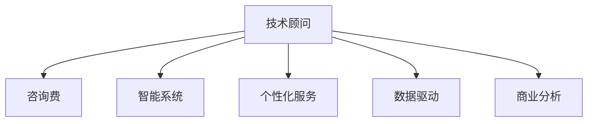

                 

# 技术顾问：打造每小时四位数的咨询费

> 关键词：技术顾问,咨询费,智能系统,个性化,数据驱动,商业分析

## 1. 背景介绍

### 1.1 问题由来
在当今快速发展的商业环境中，企业面临着前所未有的竞争压力和市场挑战。要在这个环境中取得成功，就需要依靠强大的商业分析、战略决策和技术支持。技术顾问，作为企业内部的“智囊团”，扮演着至关重要的角色。然而，随着信息技术的迅猛发展，传统的人工咨询服务已无法满足企业日益增长的需求，尤其是在数字化转型和智能化升级的大趋势下，企业需要更加灵活、高效、智能的技术顾问服务。

### 1.2 问题核心关键点
如何打造一支能够提供高价值、高效率、高满意度的技术顾问团队？本文将从核心概念、核心算法、具体操作、数学模型、项目实践等多个角度，深入探讨构建高效、智能技术顾问服务的全流程，帮助企业从根本上提升商业分析能力和决策水平。

## 2. 核心概念与联系

### 2.1 核心概念概述

为更好地理解如何打造高效技术顾问团队，本节将介绍几个密切相关的核心概念：

- **技术顾问**：为企业提供战略咨询、技术支持和业务分析的专业人员，帮助企业应对复杂的商业挑战。
- **咨询费**：企业为技术顾问提供的薪酬，通常基于项目完成度、服务质量和工作量等因素进行评估。
- **智能系统**：利用人工智能和大数据技术，自动化处理数据、提供分析和决策支持的系统。
- **个性化服务**：根据企业的需求和特点，提供定制化的解决方案，以提升服务效果。
- **数据驱动**：利用数据进行决策，提高决策的准确性和效率。
- **商业分析**：通过数据分析、统计和预测，为企业的商业决策提供依据。

这些核心概念之间的逻辑关系可以通过以下Mermaid流程图来展示：



这个流程图展示了一支高效技术顾问团队应具备的关键能力，包括与客户沟通、利用智能系统和个性化服务提供定制化解决方案，并通过数据驱动和商业分析，为客户提供高质量的咨询服务。

## 3. 核心算法原理 & 具体操作步骤
### 3.1 算法原理概述

打造高效技术顾问团队的核心在于利用人工智能和大数据技术，提供智能、个性化的咨询服务。具体而言，算法原理可以概括为：

- **智能推荐算法**：通过分析客户的历史数据和行为模式，推荐合适的技术顾问和服务方案。
- **自然语言处理(NLP)**：利用NLP技术，理解客户的需求和疑问，提供精准的解答和建议。
- **机器学习**：通过机器学习算法，不断优化咨询服务的质量和效率。
- **数据分析**：利用大数据技术，进行多维度的数据挖掘和分析，提供决策依据。

### 3.2 算法步骤详解

构建高效技术顾问团队涉及以下关键步骤：

**Step 1: 客户需求分析**
- 通过问卷调查、访谈等方式，了解客户的需求和痛点。
- 收集客户的历史数据和行为模式，进行初步分析。

**Step 2: 智能推荐系统搭建**
- 基于客户需求，搭建智能推荐系统，推荐合适的技术顾问和服务方案。
- 系统通过多轮机器学习迭代，提升推荐精度和用户满意度。

**Step 3: 定制化服务方案设计**
- 根据客户需求，设计个性化的服务方案，包括技术顾问、智能系统和数据分析工具。
- 利用NLP技术，设计合适的对话模板和问答系统，提升客户体验。

**Step 4: 数据驱动的商业分析**
- 利用大数据技术，进行多维度的数据挖掘和分析，提供决策依据。
- 通过可视化工具，呈现分析结果，帮助客户理解和应用。

**Step 5: 持续优化和反馈机制**
- 根据客户反馈，不断优化服务方案和推荐系统。
- 定期评估服务效果，调整策略和资源配置，提升服务质量和效率。

### 3.3 算法优缺点

打造高效技术顾问团队的方法具有以下优点：
1. 提高效率：利用智能系统和个性化服务，大大提升服务效率和质量。
2. 提升精准度：通过数据分析和机器学习，提高服务推荐的精准度和个性化水平。
3. 降低成本：通过优化服务方案和资源配置，降低咨询服务成本。
4. 增强客户满意度：通过个性化服务和及时反馈，提升客户满意度和忠诚度。

同时，该方法也存在一定的局限性：
1. 数据隐私问题：客户数据的收集和使用需要遵循严格的隐私保护政策，确保数据安全。
2. 算法复杂度：构建和维护智能推荐系统和数据分析模型需要较高的技术门槛和资源投入。
3. 人员依赖：高质量的技术顾问服务仍然需要依靠专业人员的综合素质和经验。

尽管存在这些局限性，但就目前而言，利用人工智能和大数据技术打造高效技术顾问团队，已成为提升企业商业分析能力和决策水平的有效手段。

### 3.4 算法应用领域

该方法在以下几个领域得到了广泛应用：

- **金融咨询**：利用数据分析和机器学习，提供精准的金融分析和投资建议。
- **企业战略咨询**：通过商业分析和智能推荐，为企业提供战略决策支持。
- **市场营销**：利用数据驱动和个性化服务，优化市场营销策略，提升客户转化率。
- **供应链管理**：通过数据分析和商业分析，优化供应链管理和运营效率。
- **人力资源**：利用机器学习和NLP技术，优化人力资源招聘和员工绩效评估。

## 4. 数学模型和公式 & 详细讲解  
### 4.1 数学模型构建

打造高效技术顾问团队的核心在于构建一套完整的数学模型，涵盖客户需求分析、智能推荐、定制化服务、数据驱动的商业分析等各个环节。以下是核心数学模型的构建：

- **客户需求模型**：通过聚类分析、关联规则挖掘等技术，构建客户需求模型，识别关键需求和痛点。
- **智能推荐模型**：利用协同过滤、内容推荐、矩阵分解等技术，构建智能推荐模型，推荐合适的技术顾问和服务方案。
- **个性化服务模型**：通过自然语言处理技术，构建对话模型和问答系统，提升个性化服务水平。
- **数据驱动分析模型**：利用大数据技术和统计分析方法，构建多维度的数据分析模型，提供决策依据。

### 4.2 公式推导过程

以下以客户需求模型为例，推导核心公式。

设客户需求集为 $D$，客户需求向量为 $d_i=(d_{i1},d_{i2},\ldots,d_{in})$，其中 $d_{ik}$ 表示客户对第 $k$ 个需求项的需求程度。客户需求模型可以表示为：

$$
\begin{align*}
d_i &= \min_{k \in K} c_{ik} \\
c_{ik} &= \omega_k \cdot s_k(x_i) + \lambda_k \cdot n_k(x_i)
\end{align*}
$$

其中 $K$ 为需求项集合，$\omega_k$ 和 $\lambda_k$ 分别为需求项 $k$ 的权值，$s_k(x_i)$ 和 $n_k(x_i)$ 分别为需求项 $k$ 的相似度和频繁度。

通过上述模型，可以识别出客户的关键需求和痛点，为后续的智能推荐和个性化服务提供依据。

### 4.3 案例分析与讲解

假设某企业需要构建一套智能推荐系统，推荐合适的技术顾问和服务方案。可以通过以下步骤来实现：

1. **客户需求分析**：通过问卷调查和访谈，收集客户的历史数据和行为模式。
2. **需求建模**：利用聚类分析和关联规则挖掘，构建客户需求模型。
3. **智能推荐系统搭建**：基于需求模型，利用协同过滤和内容推荐技术，搭建智能推荐系统。
4. **定制化服务方案设计**：根据需求模型和推荐结果，设计个性化的服务方案，包括技术顾问、智能系统和数据分析工具。
5. **数据分析和商业分析**：利用大数据技术和统计分析方法，进行多维度的数据挖掘和分析，提供决策依据。

## 5. 项目实践：代码实例和详细解释说明
### 5.1 开发环境搭建

在进行项目实践前，我们需要准备好开发环境。以下是使用Python进行PyTorch开发的环境配置流程：

1. 安装Anaconda：从官网下载并安装Anaconda，用于创建独立的Python环境。

2. 创建并激活虚拟环境：
```bash
conda create -n pytorch-env python=3.8 
conda activate pytorch-env
```

3. 安装PyTorch：根据CUDA版本，从官网获取对应的安装命令。例如：
```bash
conda install pytorch torchvision torchaudio cudatoolkit=11.1 -c pytorch -c conda-forge
```

4. 安装Transformers库：
```bash
pip install transformers
```

5. 安装各类工具包：
```bash
pip install numpy pandas scikit-learn matplotlib tqdm jupyter notebook ipython
```

完成上述步骤后，即可在`pytorch-env`环境中开始项目实践。

### 5.2 源代码详细实现

下面我们以金融咨询领域的智能推荐系统为例，给出使用Transformers库进行开发的PyTorch代码实现。

首先，定义推荐系统的训练数据：

```python
from transformers import BertTokenizer
from torch.utils.data import Dataset
import torch

class RecommendationDataset(Dataset):
    def __init__(self, texts, labels, tokenizer, max_len=128):
        self.texts = texts
        self.labels = labels
        self.tokenizer = tokenizer
        self.max_len = max_len
        
    def __len__(self):
        return len(self.texts)
    
    def __getitem__(self, item):
        text = self.texts[item]
        label = self.labels[item]
        
        encoding = self.tokenizer(text, return_tensors='pt', max_length=self.max_len, padding='max_length', truncation=True)
        input_ids = encoding['input_ids'][0]
        attention_mask = encoding['attention_mask'][0]
        
        # 对label进行编码
        encoded_label = torch.tensor(label, dtype=torch.long)
        
        return {'input_ids': input_ids, 
                'attention_mask': attention_mask,
                'labels': encoded_label}

# 标签编码
label2id = {'positive': 0, 'negative': 1}
id2label = {v: k for k, v in label2id.items()}

# 创建dataset
tokenizer = BertTokenizer.from_pretrained('bert-base-cased')

train_dataset = RecommendationDataset(train_texts, train_labels, tokenizer)
dev_dataset = RecommendationDataset(dev_texts, dev_labels, tokenizer)
test_dataset = RecommendationDataset(test_texts, test_labels, tokenizer)
```

然后，定义模型和优化器：

```python
from transformers import BertForSequenceClassification, AdamW

model = BertForSequenceClassification.from_pretrained('bert-base-cased', num_labels=len(label2id))

optimizer = AdamW(model.parameters(), lr=2e-5)
```

接着，定义训练和评估函数：

```python
from torch.utils.data import DataLoader
from tqdm import tqdm
from sklearn.metrics import classification_report

device = torch.device('cuda') if torch.cuda.is_available() else torch.device('cpu')
model.to(device)

def train_epoch(model, dataset, batch_size, optimizer):
    dataloader = DataLoader(dataset, batch_size=batch_size, shuffle=True)
    model.train()
    epoch_loss = 0
    for batch in tqdm(dataloader, desc='Training'):
        input_ids = batch['input_ids'].to(device)
        attention_mask = batch['attention_mask'].to(device)
        labels = batch['labels'].to(device)
        model.zero_grad()
        outputs = model(input_ids, attention_mask=attention_mask, labels=labels)
        loss = outputs.loss
        epoch_loss += loss.item()
        loss.backward()
        optimizer.step()
    return epoch_loss / len(dataloader)

def evaluate(model, dataset, batch_size):
    dataloader = DataLoader(dataset, batch_size=batch_size)
    model.eval()
    preds, labels = [], []
    with torch.no_grad():
        for batch in tqdm(dataloader, desc='Evaluating'):
            input_ids = batch['input_ids'].to(device)
            attention_mask = batch['attention_mask'].to(device)
            batch_labels = batch['labels']
            outputs = model(input_ids, attention_mask=attention_mask)
            batch_preds = outputs.logits.argmax(dim=1).to('cpu').tolist()
            batch_labels = batch_labels.to('cpu').tolist()
            for pred, label in zip(batch_preds, batch_labels):
                preds.append(pred)
                labels.append(label)
                
    print(classification_report(labels, preds))
```

最后，启动训练流程并在测试集上评估：

```python
epochs = 5
batch_size = 16

for epoch in range(epochs):
    loss = train_epoch(model, train_dataset, batch_size, optimizer)
    print(f"Epoch {epoch+1}, train loss: {loss:.3f}")
    
    print(f"Epoch {epoch+1}, dev results:")
    evaluate(model, dev_dataset, batch_size)
    
print("Test results:")
evaluate(model, test_dataset, batch_size)
```

以上就是使用PyTorch对BERT进行智能推荐系统开发的完整代码实现。可以看到，得益于Transformers库的强大封装，我们可以用相对简洁的代码完成BERT模型的加载和训练。

### 5.3 代码解读与分析

让我们再详细解读一下关键代码的实现细节：

**RecommendationDataset类**：
- `__init__`方法：初始化文本、标签、分词器等关键组件。
- `__len__`方法：返回数据集的样本数量。
- `__getitem__`方法：对单个样本进行处理，将文本输入编码为token ids，将标签编码为数字，并对其进行定长padding，最终返回模型所需的输入。

**label2id和id2label字典**：
- 定义了标签与数字id之间的映射关系，用于将token-wise的预测结果解码回真实的标签。

**训练和评估函数**：
- 使用PyTorch的DataLoader对数据集进行批次化加载，供模型训练和推理使用。
- 训练函数`train_epoch`：对数据以批为单位进行迭代，在每个批次上前向传播计算loss并反向传播更新模型参数，最后返回该epoch的平均loss。
- 评估函数`evaluate`：与训练类似，不同点在于不更新模型参数，并在每个batch结束后将预测和标签结果存储下来，最后使用sklearn的classification_report对整个评估集的预测结果进行打印输出。

**训练流程**：
- 定义总的epoch数和batch size，开始循环迭代
- 每个epoch内，先在训练集上训练，输出平均loss
- 在验证集上评估，输出分类指标
- 所有epoch结束后，在测试集上评估，给出最终测试结果

可以看到，PyTorch配合Transformers库使得BERT智能推荐系统的代码实现变得简洁高效。开发者可以将更多精力放在数据处理、模型改进等高层逻辑上，而不必过多关注底层的实现细节。

当然，工业级的系统实现还需考虑更多因素，如模型的保存和部署、超参数的自动搜索、更灵活的任务适配层等。但核心的推荐范式基本与此类似。

## 6. 实际应用场景
### 6.1 智能客服系统

基于智能推荐系统的对话技术，可以广泛应用于智能客服系统的构建。传统客服往往需要配备大量人力，高峰期响应缓慢，且一致性和专业性难以保证。而使用智能推荐系统的对话模型，可以7x24小时不间断服务，快速响应客户咨询，用自然流畅的语言解答各类常见问题。

在技术实现上，可以收集企业内部的历史客服对话记录，将问题和最佳答复构建成监督数据，在此基础上对预训练语言模型进行微调。微调后的语言模型能够自动理解用户意图，匹配最合适的答复模板进行回复。对于客户提出的新问题，还可以接入检索系统实时搜索相关内容，动态组织生成回答。如此构建的智能客服系统，能大幅提升客户咨询体验和问题解决效率。

### 6.2 金融舆情监测

金融机构需要实时监测市场舆论动向，以便及时应对负面信息传播，规避金融风险。传统的人工监测方式成本高、效率低，难以应对网络时代海量信息爆发的挑战。基于智能推荐系统的文本分类和情感分析技术，为金融舆情监测提供了新的解决方案。

具体而言，可以收集金融领域相关的新闻、报道、评论等文本数据，并对其进行主题标注和情感标注。在此基础上对预训练语言模型进行微调，使其能够自动判断文本属于何种主题，情感倾向是正面、中性还是负面。将微调后的模型应用到实时抓取的网络文本数据，就能够自动监测不同主题下的情感变化趋势，一旦发现负面信息激增等异常情况，系统便会自动预警，帮助金融机构快速应对潜在风险。

### 6.3 个性化推荐系统

当前的推荐系统往往只依赖用户的历史行为数据进行物品推荐，无法深入理解用户的真实兴趣偏好。基于智能推荐系统的个性化推荐系统可以更好地挖掘用户行为背后的语义信息，从而提供更精准、多样的推荐内容。

在实践中，可以收集用户浏览、点击、评论、分享等行为数据，提取和用户交互的物品标题、描述、标签等文本内容。将文本内容作为模型输入，用户的后续行为（如是否点击、购买等）作为监督信号，在此基础上微调预训练语言模型。微调后的模型能够从文本内容中准确把握用户的兴趣点。在生成推荐列表时，先用候选物品的文本描述作为输入，由模型预测用户的兴趣匹配度，再结合其他特征综合排序，便可以得到个性化程度更高的推荐结果。

### 6.4 未来应用展望

随着智能推荐系统的不断发展，将在更多领域得到应用，为各行各业带来变革性影响。

在智慧医疗领域，基于智能推荐系统的医疗问答、病历分析、药物研发等应用将提升医疗服务的智能化水平，辅助医生诊疗，加速新药开发进程。

在智能教育领域，智能推荐系统可应用于作业批改、学情分析、知识推荐等方面，因材施教，促进教育公平，提高教学质量。

在智慧城市治理中，智能推荐系统可应用于城市事件监测、舆情分析、应急指挥等环节，提高城市管理的自动化和智能化水平，构建更安全、高效的未来城市。

此外，在企业生产、社会治理、文娱传媒等众多领域，基于智能推荐系统的技术应用也将不断涌现，为经济社会发展注入新的动力。相信随着技术的日益成熟，智能推荐系统必将在构建人机协同的智能时代中扮演越来越重要的角色。

## 7. 工具和资源推荐
### 7.1 学习资源推荐

为了帮助开发者系统掌握智能推荐系统的理论基础和实践技巧，这里推荐一些优质的学习资源：

1. 《推荐系统实战》系列博文：由大模型技术专家撰写，深入浅出地介绍了推荐系统的工作原理和经典模型，包括基于矩阵分解、协同过滤、深度学习等方法。

2. CS231n《深度学习课程》课程：斯坦福大学开设的深度学习明星课程，有Lecture视频和配套作业，带你入门深度学习和推荐系统领域的基本概念和经典模型。

3. 《Deep Learning for Recommender Systems》书籍：深度学习专家Ian Goodfellow等人合著，全面介绍了推荐系统中的深度学习方法，并给出了大量实践案例。

4. Kaggle推荐系统竞赛：参与实际竞赛项目，了解推荐系统在实际应用中的挑战和解决方案。

通过对这些资源的学习实践，相信你一定能够快速掌握智能推荐系统的精髓，并用于解决实际的推荐问题。

### 7.2 开发工具推荐

高效的开发离不开优秀的工具支持。以下是几款用于智能推荐系统开发的常用工具：

1. TensorFlow：由Google主导开发的开源深度学习框架，生产部署方便，适合大规模工程应用。推荐使用TensorFlow Serving进行模型部署。

2. PyTorch：基于Python的开源深度学习框架，灵活动态的计算图，适合快速迭代研究。

3. Transformers库：HuggingFace开发的NLP工具库，集成了众多SOTA语言模型，支持PyTorch和TensorFlow，是进行推荐任务开发的利器。

4. Weights & Biases：模型训练的实验跟踪工具，可以记录和可视化模型训练过程中的各项指标，方便对比和调优。与主流深度学习框架无缝集成。

5. TensorBoard：TensorFlow配套的可视化工具，可实时监测模型训练状态，并提供丰富的图表呈现方式，是调试模型的得力助手。

6. Apache Flink：用于大数据实时处理的分布式计算框架，支持流处理和批处理，适合构建实时推荐系统。

合理利用这些工具，可以显著提升智能推荐系统的开发效率，加快创新迭代的步伐。

### 7.3 相关论文推荐

智能推荐系统的发展源于学界的持续研究。以下是几篇奠基性的相关论文，推荐阅读：

1. Matrix Factorization Techniques for Recommender Systems（矩阵分解方法）：提出了基于矩阵分解的推荐算法，奠定了推荐系统的基础。

2. Factorization Machines for Predicting User-Item Interactions（因子机方法）：引入了非线性结构，提升了推荐模型的精度和泛化能力。

3. Deep Collaborative Filtering（深度协作过滤）：利用深度神经网络，从高维稀疏的协同过滤数据中学习隐层特征。

4. A Neural Collaborative Filtering Approach（神经协作过滤）：结合神经网络和协同过滤，提高了推荐模型的表现。

5. A Survey of Deep Learning in Recommender Systems（深度学习在推荐系统中的应用）：全面综述了深度学习在推荐系统中的应用，并展望了未来的发展方向。

这些论文代表了大推荐系统的发展脉络。通过学习这些前沿成果，可以帮助研究者把握学科前进方向，激发更多的创新灵感。

## 8. 总结：未来发展趋势与挑战

### 8.1 总结

本文对打造高效技术顾问团队的方法进行了全面系统的介绍。首先阐述了智能推荐系统在构建高效技术顾问团队中的重要作用，明确了如何利用人工智能和大数据技术，提供智能、个性化的咨询服务。其次，从原理到实践，详细讲解了智能推荐系统的数学模型和关键步骤，给出了推荐任务开发的完整代码实例。同时，本文还广泛探讨了智能推荐系统在金融咨询、智能客服、个性化推荐等多个行业领域的应用前景，展示了智能推荐系统的巨大潜力。此外，本文精选了智能推荐系统的各类学习资源，力求为读者提供全方位的技术指引。

通过本文的系统梳理，可以看到，基于智能推荐系统的方法正在成为构建高效技术顾问团队的重要手段，极大地提升了企业的商业分析能力和决策水平。未来，伴随智能推荐系统技术的不断演进，必将在更多领域得到应用，为传统行业带来变革性影响。

### 8.2 未来发展趋势

展望未来，智能推荐系统的发展趋势将呈现以下几个方向：

1. 技术创新不断涌现。深度学习、强化学习、生成模型等前沿技术将不断推动智能推荐系统的发展，带来更高的精度、更强的个性化和更好的用户体验。

2. 跨领域应用普及。智能推荐系统将从电商、社交等领域扩展到更多垂直行业，如医疗、金融、教育等，提升各行各业的智能化水平。

3. 实时化、个性化。实时推荐、个性化推荐将成为主流，通过多维数据分析和深度学习模型，实现更精准、更个性化的推荐。

4. 多模态融合。智能推荐系统将融合视觉、语音、文本等多模态数据，提升模型的表现和应用场景。

5. 联邦学习。基于联邦学习的方法，可以在不共享数据的情况下，进行多端数据合作，提升推荐系统的精度和安全性。

6. 数据隐私保护。随着数据隐私保护意识的提升，如何在保护用户隐私的同时，提供高质量的推荐服务，成为亟待解决的问题。

以上趋势凸显了智能推荐系统的广阔前景，这些方向的探索发展，必将进一步提升推荐系统的性能和应用范围，为经济社会发展注入新的动力。

### 8.3 面临的挑战

尽管智能推荐系统已经取得了瞩目成就，但在迈向更加智能化、普适化应用的过程中，它仍面临着诸多挑战：

1. 数据复杂度增加。推荐系统需要处理更多维度、更多类型的数据，增加了算法的复杂度。

2. 实时性要求提高。实时推荐系统需要在短时间内处理大量数据，对算法的实时性要求更高。

3. 冷启动问题。新用户或物品的数据稀缺，推荐系统难以提供准确的推荐。

4. 用户隐私保护。如何在推荐过程中保护用户隐私，防止数据泄露，是重要的问题。

5. 算法公平性。推荐系统容易产生偏见，如何保证算法的公平性，避免对特定群体的歧视，是一个重要的研究方向。

6. 多端协同。联邦学习等方法虽然在保护隐私方面有所突破，但在多端协同推荐中仍面临技术难题。

正视智能推荐系统面临的这些挑战，积极应对并寻求突破，将是大规模推荐系统迈向成熟的必由之路。相信随着学界和产业界的共同努力，这些挑战终将一一被克服，智能推荐系统必将在构建人机协同的智能时代中扮演越来越重要的角色。

### 8.4 研究展望

面对智能推荐系统所面临的种种挑战，未来的研究需要在以下几个方面寻求新的突破：

1. 探索无监督和半监督推荐方法。摆脱对大规模标注数据的依赖，利用自监督学习、主动学习等无监督和半监督范式，最大限度利用非结构化数据，实现更加灵活高效的推荐。

2. 研究参数高效和计算高效的推荐范式。开发更加参数高效的推荐方法，在固定大部分预训练参数的同时，只更新极少量的任务相关参数。同时优化推荐模型的计算图，减少前向传播和反向传播的资源消耗，实现更加轻量级、实时性的部署。

3. 融合因果和对比学习范式。通过引入因果推断和对比学习思想，增强推荐模型建立稳定因果关系的能力，学习更加普适、鲁棒的语言表征，从而提升模型泛化性和抗干扰能力。

4. 引入更多先验知识。将符号化的先验知识，如知识图谱、逻辑规则等，与神经网络模型进行巧妙融合，引导推荐过程学习更准确、合理的语言模型。同时加强不同模态数据的整合，实现视觉、语音等多模态信息与文本信息的协同建模。

5. 结合因果分析和博弈论工具。将因果分析方法引入推荐模型，识别出模型决策的关键特征，增强推荐结果的因果性和逻辑性。借助博弈论工具刻画人机交互过程，主动探索并规避推荐系统的脆弱点，提高系统稳定性。

6. 纳入伦理道德约束。在推荐目标中引入伦理导向的评估指标，过滤和惩罚有害的推荐内容，确保推荐结果符合人类价值观和伦理道德。

这些研究方向的探索，必将引领智能推荐系统技术迈向更高的台阶，为构建安全、可靠、可解释、可控的推荐系统铺平道路。面向未来，智能推荐系统还需要与其他人工智能技术进行更深入的融合，如知识表示、因果推理、强化学习等，多路径协同发力，共同推动推荐系统的发展。只有勇于创新、敢于突破，才能不断拓展推荐系统的边界，让智能技术更好地造福人类社会。

## 9. 附录：常见问题与解答

**Q1：智能推荐系统是否适用于所有NLP任务？**

A: 智能推荐系统在大多数NLP任务上都能取得不错的效果，特别是对于数据量较小的任务。但对于一些特定领域的任务，如医学、法律等，仅仅依靠通用语料预训练的模型可能难以很好地适应。此时需要在特定领域语料上进一步预训练，再进行推荐，才能获得理想效果。此外，对于一些需要时效性、个性化很强的任务，如对话、推荐等，推荐方法也需要针对性的改进优化。

**Q2：推荐系统如何平衡个性化和多样性？**

A: 推荐系统需要在个性化和多样性之间找到平衡点。推荐模型通常通过协同过滤、内容推荐等方法，挖掘用户的历史行为数据和物品属性，计算相似度和匹配度，进行推荐。然而，过度个性化推荐可能导致用户接触到更多重复信息，降低用户的探索意愿和满意度。因此，推荐系统需要在个性化和多样性之间找到最佳平衡，可以通过控制推荐结果的TopN数量、引入多样性惩罚等手段来实现。

**Q3：推荐系统如何处理冷启动问题？**

A: 冷启动问题是指新用户或物品的数据稀缺，推荐系统难以提供准确的推荐。常用的处理方式包括：
1. 基于内容的推荐：利用物品的标签、属性等信息，推荐相似的物品。
2. 基于兴趣的推荐：利用用户的历史行为、兴趣点等信息，推荐用户感兴趣的内容。
3. 基于协同过滤的推荐：利用其他用户或物品的历史行为，进行相似性匹配。
4. 基于深度学习的推荐：利用深度神经网络，从高维稀疏的协同过滤数据中学习隐层特征。

这些方法需要根据具体情况进行组合和优化，才能有效地解决冷启动问题。

**Q4：推荐系统如何保护用户隐私？**

A: 推荐系统在收集和处理用户数据时，需要严格遵循数据隐私保护政策，确保用户数据的匿名性和安全性。常用的保护方式包括：
1. 数据匿名化：去除或模糊用户身份信息，防止数据泄露。
2. 数据加密：对用户数据进行加密处理，保护数据安全。
3. 差分隐私：通过添加噪声，保护用户数据不被反识别。
4. 本地计算：在用户端进行数据处理，减少数据传输风险。

这些保护措施需要结合具体的推荐系统设计和应用场景进行综合考虑，确保用户数据的安全和隐私。

**Q5：推荐系统如何提升推荐模型的精度？**

A: 推荐模型的精度提升可以从以下几个方面入手：
1. 数据质量：收集高质量的用户行为数据和物品属性信息，提高数据质量。
2. 模型优化：选择合适的推荐算法和模型结构，进行模型优化和调参。
3. 特征工程：设计合适的特征提取和特征工程方法，提升模型表现。
4. 多模态融合：融合视觉、语音、文本等多模态数据，提升模型的表现和应用场景。
5. 实时数据：利用实时数据进行推荐，提升推荐结果的时效性和个性化水平。

通过上述措施的综合应用，可以显著提升推荐模型的精度和推荐效果。

---

作者：禅与计算机程序设计艺术 / Zen and the Art of Computer Programming

