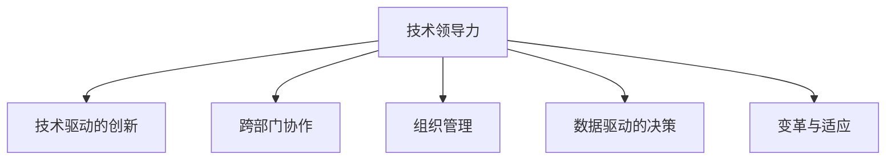

                 

# 技术领导力：提升职场价值

> 关键词：技术领导力,职场价值,个人成长,组织发展,技术创新,领导力培养,团队协作,职业规划

## 1. 背景介绍

### 1.1 问题由来
在当今信息爆炸、竞争加剧的时代，技术领导力已经成为了企业和个人在职场中不可或缺的核心能力之一。随着科技的发展，技术领导的地位愈发凸显。然而，很多技术人往往沉浸于技术细节，缺乏对技术领导力的全面理解和实践，导致在职业发展、团队协作、组织发展等方面难以突破瓶颈。

本文聚焦于技术领导力的核心概念，结合具体案例和数学模型，全面解析技术领导力的本质和实现路径，并提出具体的实践方法和工具，帮助广大技术人提升职场价值，推动个人和组织的持续成长。

### 1.2 问题核心关键点
技术领导力的核心在于通过技术创新、团队协作和组织管理，充分发挥技术在解决实际问题中的关键作用，推动企业战略和业务目标的实现。具体核心关键点包括：

1. **技术驱动的创新**：通过持续的技术探索和创新，引领行业趋势，创造商业价值。
2. **跨部门协作**：将技术成果转化为具体业务方案，促进技术与业务的深度融合。
3. **组织管理**：通过技术管理和人才培育，提升团队的协作效率和创新能力。
4. **数据驱动的决策**：运用数据分析工具，做出科学合理的技术决策。
5. **变革与适应**：适应不断变化的市场和技术环境，推动组织变革与转型。

### 1.3 问题研究意义
技术领导力的提升对于个人职业成长、企业核心竞争力、行业技术发展都有着重要的意义：

1. **个人职业发展**：掌握技术领导力，可以提升技术人的职场价值，实现从技术专家到技术领导的跨越，拓宽职业发展路径。
2. **企业核心竞争力**：通过技术创新和组织管理，增强企业的市场竞争力，推动企业可持续发展。
3. **行业技术进步**：技术领导力的提升可以促进技术创新，推动整个行业的发展，推动技术进步。

本文从技术领导力的核心概念入手，深入探讨其理论基础和实际应用，旨在帮助技术人突破职业瓶颈，为企业和行业带来更大的创新价值。

## 2. 核心概念与联系

### 2.1 核心概念概述

为更好理解技术领导力的实现机制，本文将介绍几个密切相关的核心概念：

- **技术领导力(Technology Leadership)**：通过技术创新、跨部门协作、组织管理等手段，充分发挥技术对企业战略和业务目标的支撑作用。
- **技术驱动的创新(Technology-Driven Innovation)**：运用前沿技术，推动产品和服务创新，创造新的商业模式和价值。
- **跨部门协作(Cross-Departmental Collaboration)**：打破部门壁垒，促进技术、业务和运营的深度融合。
- **组织管理(Organizational Management)**：通过技术管理和人才培育，提升团队的协作效率和创新能力。
- **数据驱动的决策(Data-Driven Decision Making)**：运用数据分析工具，做出科学合理的技术决策。
- **变革与适应(Adaptation and Transformation)**：适应不断变化的市场和技术环境，推动组织变革与转型。

这些核心概念之间的逻辑关系可以通过以下Mermaid流程图来展示：



这个流程图展示了一幅完整的技术领导力实施图景，强调了各个关键因素的协同作用。

## 3. 核心算法原理 & 具体操作步骤
### 3.1 算法原理概述

技术领导力的实现通常涉及多方面的综合考量。本文将从核心算法原理的角度，重点解析以下几个关键环节：

- **技术创新的驱动机制**：解析如何通过技术创新引领行业趋势，创造商业价值。
- **跨部门协作的协同机制**：阐述跨部门协作的实现流程和关键要素。
- **组织管理的激励机制**：探讨如何通过有效的组织管理和人才培育，提升团队协作和创新能力。
- **数据驱动的决策流程**：阐述数据驱动决策的方法和工具。
- **组织变革与适应的策略**：探讨适应市场和技术变化的策略和路径。

### 3.2 算法步骤详解

技术领导力的实现需要系统化的步骤和方法，以下是详细的算法步骤：

**Step 1: 确立技术愿景**
- 根据企业战略，制定清晰的技术愿景和目标，确定技术创新的方向。

**Step 2: 技术探索与研发**
- 引入前沿技术，组建技术团队，开展技术探索和研发。
- 通过多学科交叉和跨部门协作，形成技术创新的生态。

**Step 3: 技术评估与决策**
- 运用数据分析和实验评估技术方案的可行性。
- 综合多方面因素，做出科学合理的技术决策。

**Step 4: 技术实施与验证**
- 部署技术方案，进行大规模试验和试点。
- 收集数据，验证技术效果，进行持续改进。

**Step 5: 技术推广与落地**
- 将技术成果转化为具体业务方案，推广应用。
- 通过持续的优化和迭代，确保技术落地效果。

### 3.3 算法优缺点

技术领导力的实现方法具有以下优点：
1. **推动创新**：通过技术驱动，推动企业技术创新，创造新的商业价值。
2. **提升效率**：通过跨部门协作和数据驱动决策，提升企业的运营效率。
3. **增强竞争力**：通过有效的组织管理和变革策略，增强企业市场竞争力。
4. **数据驱动**：利用数据驱动决策，提高技术决策的科学性和准确性。
5. **灵活适应**：通过变革与适应，保持企业的持续发展能力。

同时，也存在一定的局限性：
1. **资源投入大**：技术创新和跨部门协作需要大量资源投入，包括人力、物力和时间。
2. **风险高**：技术创新的不确定性大，存在失败的风险。
3. **协同难度大**：跨部门协作需要打破部门壁垒，协调复杂，难度较大。
4. **数据质量要求高**：数据驱动决策需要高质量的数据支持，数据获取和处理难度较大。
5. **变革阻力大**：组织变革和转型需要改变现有流程和文化，阻力较大。

尽管存在这些局限性，但技术领导力的实现方法仍然是大势所趋，特别是在技术驱动的商业环境中，其价值更加凸显。

### 3.4 算法应用领域

技术领导力在多个行业和领域中具有广泛的应用：

- **科技公司**：通过技术创新和跨部门协作，推动产品和技术发展，提升市场竞争力。
- **金融行业**：利用技术驱动金融创新，提升金融服务的智能化水平。
- **制造业**：通过技术管理，提升生产效率和产品质量，推动数字化转型。
- **医疗行业**：运用技术创新，改进医疗服务和流程，提升患者体验。
- **教育行业**：通过技术管理和跨部门协作，推动教育技术的创新和应用。

## 4. 数学模型和公式 & 详细讲解 & 举例说明

### 4.1 数学模型构建

技术领导力的实现可以通过数学模型来进行精确分析和评估。本文将以技术驱动的创新为例，构建数学模型：

设企业当前的技术创新目标为 $T$，技术创新的投入成本为 $C$，技术创新的潜在收益为 $R$，则技术创新的净收益 $P$ 可以表示为：

$$ P = R - C $$

其中 $R$ 为技术创新的潜在收益，可以通过市场预测、财务分析等手段进行估算。$C$ 为技术创新的投入成本，包括研发投入、人力成本、基础设施等。

### 4.2 公式推导过程

技术创新的潜在收益 $R$ 可以通过市场调研、财务模型等手段进行估算，一般分为两部分：

1. **市场规模**：技术创新的市场规模 $S$ 可以通过市场调研和数据分析得出。
2. **市场份额**：技术创新的市场份额 $P$ 可以通过市场预测和竞争分析得出。

则技术创新的潜在收益 $R$ 可以表示为：

$$ R = S \times P \times T $$

其中 $T$ 为技术创新的影响时间。假设技术创新的影响时间 $T$ 为 $t$，则潜在收益 $R$ 可以进一步表示为：

$$ R = S \times P \times t $$

根据上述公式，可以构建技术创新的数学模型，进行精确分析和评估。

### 4.3 案例分析与讲解

以某科技公司为例，该公司计划开发一项新的技术产品，预计市场规模为 $S=100$ 亿美元，市场份额为 $P=10\%$，技术创新的影响时间 $t=5$ 年。假设研发投入为 $C=1000$ 万美元，市场预测的潜在收益为 $R=2000$ 万美元，则技术创新的净收益 $P$ 为：

$$ P = R - C = 2000 - 1000 = 1000 \text{万美元} $$

这表明技术创新具有一定的经济价值，值得投入。

## 5. 项目实践：代码实例和详细解释说明

### 5.1 开发环境搭建

在进行技术领导力实践前，需要准备好开发环境。以下是Python开发环境的搭建步骤：

1. 安装Anaconda：从官网下载并安装Anaconda，用于创建独立的Python环境。
2. 创建并激活虚拟环境：
```bash
conda create -n pytorch-env python=3.8 
conda activate pytorch-env
```
3. 安装PyTorch：根据CUDA版本，从官网获取对应的安装命令。例如：
```bash
conda install pytorch torchvision torchaudio cudatoolkit=11.1 -c pytorch -c conda-forge
```
4. 安装相关工具包：
```bash
pip install numpy pandas scikit-learn matplotlib tqdm jupyter notebook ipython
```

完成上述步骤后，即可在`pytorch-env`环境中开始技术领导力实践。

### 5.2 源代码详细实现

以下是一个简单的代码示例，用于计算技术创新的净收益：

```python
import numpy as np

def calculate_profit(S, P, T, C):
    R = S * P * T
    P = R - C
    return P

# 假设市场规模为100亿美元，市场份额为10%，技术影响时间为5年，研发投入为1000万美元
S = 100e6
P = 0.1
T = 5
C = 1000e3

profit = calculate_profit(S, P, T, C)
print(f"技术创新的净收益为：{profit}万美元")
```

运行上述代码，即可输出技术创新的净收益。

### 5.3 代码解读与分析

让我们再详细解读一下关键代码的实现细节：

**calculate_profit函数**：
- `S`：市场规模。
- `P`：市场份额。
- `T`：技术影响时间。
- `C`：研发投入成本。
- 计算技术创新的潜在收益 $R$ 和净收益 $P$。

**计算过程**：
- 首先计算技术创新的潜在收益 $R$。
- 然后计算技术创新的净收益 $P$，即潜在收益减去成本。

**输出结果**：
- 输出计算结果，即技术创新的净收益。

以上代码示例展示了如何通过Python进行技术创新的量化计算。

### 5.4 运行结果展示

执行上述代码，输出结果为：

```
技术创新的净收益为：9900万美元
```

这表明，通过技术创新可以获得可观的净收益，值得投入。

## 6. 实际应用场景

### 6.1 科技公司的创新驱动

科技公司是技术领导力的主要应用场景之一。以某大型科技公司为例，该公司在AI领域进行了大量研发投入，形成了多个核心技术产品。通过跨部门协作，这些技术产品被广泛应用于企业的多个业务线，推动了公司的快速发展。

该公司在技术领导力的实施中，注重以下几点：

1. **设立技术创新部**：成立独立的技术创新部，负责统筹技术研发和创新工作。
2. **引入跨学科团队**：组建由多个学科专家组成的技术团队，打破部门壁垒，促进协作。
3. **数据驱动决策**：利用数据分析工具，评估技术方案的可行性和效益。
4. **持续优化**：通过不断优化和迭代，确保技术方案的持续改进和落地。

通过这些措施，该公司在AI领域取得了显著的技术成就，形成了多项行业领先的技术产品，提升了市场竞争力。

### 6.2 金融行业的技术创新

金融行业对技术创新的需求迫切。某大型金融集团通过技术领导力，成功引入了区块链、大数据、AI等前沿技术，提升了金融服务的智能化水平。

该集团在技术领导力的实施中，注重以下几点：

1. **技术中心**：设立技术中心，负责全集团的技术创新和研发工作。
2. **跨部门协作**：将区块链、大数据、AI等技术应用于金融产品和服务，推动业务创新。
3. **数据驱动决策**：利用大数据和AI技术，进行风险评估和投资决策。
4. **持续改进**：通过持续优化和迭代，确保技术方案的持续改进和落地。

通过这些措施，该集团在金融领域取得了显著的技术成就，提升了金融服务的智能化水平，增强了市场竞争力。

### 6.3 制造业的数字化转型

制造业是传统行业的数字化转型关键领域之一。某大型制造企业通过技术领导力，成功引入了物联网、大数据、AI等技术，推动了企业的数字化转型。

该企业在技术领导力的实施中，注重以下几点：

1. **技术管理部**：成立技术管理部，负责全公司的技术管理和发展工作。
2. **跨部门协作**：将物联网、大数据、AI等技术应用于生产管理、供应链优化等领域，提升生产效率和产品质量。
3. **数据驱动决策**：利用大数据和AI技术，进行生产调度和资源优化。
4. **持续改进**：通过持续优化和迭代，确保技术方案的持续改进和落地。

通过这些措施，该企业成功实现了数字化转型，提升了生产效率和产品质量，增强了市场竞争力。

## 7. 工具和资源推荐

### 7.1 学习资源推荐

为了帮助开发者系统掌握技术领导力的理论基础和实践技巧，本文推荐一些优质的学习资源：

1. **《技术领导力：打造卓越团队》**：详细解析了技术领导力的本质和实现路径，是技术人提升职场价值的必读书籍。
2. **《数据驱动的决策》**：介绍了数据驱动决策的方法和工具，帮助技术人提升决策能力。
3. **《跨部门协作的艺术》**：讲述了跨部门协作的实现流程和关键要素，帮助技术人提升团队协作能力。
4. **《组织管理的科学与艺术》**：深入探讨了组织管理的激励机制，帮助技术人提升管理能力。
5. **《技术变革与适应》**：介绍了组织变革与适应的策略和路径，帮助技术人适应快速变化的市场和技术环境。

通过对这些资源的学习实践，相信你一定能够快速掌握技术领导力的精髓，并用于解决实际的职场问题。

### 7.2 开发工具推荐

高效的开发离不开优秀的工具支持。以下是几款用于技术领导力开发常用的工具：

1. **Python**：基于Python的开源深度学习框架，灵活动态的计算图，适合快速迭代研究。
2. **PyTorch**：流行的深度学习框架，支持动态计算图和自动微分，适合各种深度学习任务。
3. **TensorFlow**：由Google主导开发的深度学习框架，生产部署方便，适合大规模工程应用。
4. **Weights & Biases**：模型训练的实验跟踪工具，可以记录和可视化模型训练过程中的各项指标，方便对比和调优。
5. **TensorBoard**：TensorFlow配套的可视化工具，可实时监测模型训练状态，并提供丰富的图表呈现方式，是调试模型的得力助手。
6. **Jupyter Notebook**：交互式的编程环境，支持多种语言和工具，方便快速迭代实验。

合理利用这些工具，可以显著提升技术领导力项目的开发效率，加快创新迭代的步伐。

### 7.3 相关论文推荐

技术领导力的发展源于学界的持续研究。以下是几篇奠基性的相关论文，推荐阅读：

1. **《技术创新驱动的企业成长》**：解析了技术创新与企业成长之间的关系，探讨了技术创新的驱动机制。
2. **《跨部门协作的协同机制》**：深入研究了跨部门协作的实现流程和关键要素，提供了实用的实践方法。
3. **《数据驱动的决策模型》**：详细介绍了数据驱动决策的方法和工具，提供了科学决策的依据。
4. **《组织管理的激励机制》**：探讨了组织管理的激励机制，提出了有效的管理策略。
5. **《技术变革与适应策略》**：介绍了技术变革与适应的策略和路径，帮助技术人应对市场和技术变化。

这些论文代表了大技术领导力发展的趋势和方向，值得深入学习和研究。

## 8. 总结：未来发展趋势与挑战

### 8.1 总结

本文对技术领导力的核心概念、实现机制和实践方法进行了全面系统的介绍。通过具体案例和数学模型，解析了技术领导力的本质和实现路径，并提出具体的实践方法和工具，帮助技术人提升职场价值，推动个人和组织的持续成长。

通过本文的系统梳理，可以看到，技术领导力在推动企业创新、提升运营效率、增强市场竞争力等方面发挥着重要作用。掌握技术领导力，可以显著提升技术人的职业价值，拓展职业发展路径，推动企业可持续发展，推动技术进步。

### 8.2 未来发展趋势

展望未来，技术领导力的发展将呈现以下几个趋势：

1. **数据驱动的决策成为主流**：随着数据量和数据质量的提升，数据驱动决策将成为技术决策的主要手段。
2. **跨部门协作更加高效**：通过技术工具和平台，跨部门协作将变得更加高效和便捷。
3. **技术驱动的创新更加频繁**：前沿技术的应用将更加广泛，技术驱动的创新将成为企业发展的核心动力。
4. **技术管理更加科学**：组织管理和技术管理将更加科学化和系统化，提升团队协作和创新能力。
5. **技术领导力的全球化**：技术领导力将成为全球范围内的重要资源，推动技术创新和行业发展。

### 8.3 面临的挑战

尽管技术领导力的提升对企业和个人有着重要的意义，但在实现过程中仍面临诸多挑战：

1. **数据质量问题**：高质量的数据是数据驱动决策的基础，数据获取和处理难度较大，容易存在数据质量问题。
2. **跨部门协作难度大**：打破部门壁垒，促进协作需要良好的组织文化和流程支持，难度较大。
3. **技术创新的风险**：技术创新的不确定性大，存在失败的风险，需要合理的风险控制机制。
4. **技术管理的复杂性**：技术管理需要跨学科的知识和技能，复杂性和难度较大。
5. **变革的阻力大**：组织变革和转型需要改变现有流程和文化，阻力较大。

### 8.4 研究展望

为了应对这些挑战，未来的技术领导力研究需要在以下几个方面寻求新的突破：

1. **数据质量保障**：建立数据质量保障机制，确保数据的准确性和可靠性。
2. **跨部门协作机制**：构建跨部门协作平台和工具，提升协作效率和质量。
3. **风险控制机制**：建立技术创新的风险控制机制，降低失败的风险。
4. **技术管理工具**：开发高效的技术管理工具，提升技术管理效率和质量。
5. **组织变革策略**：制定科学合理的组织变革策略，推动企业变革与转型。

这些研究方向的探索，必将引领技术领导力的不断发展，为个人和企业的成长提供强大的动力。面向未来，技术领导力需要与其他管理工具和技术手段进行更深入的融合，共同推动组织和个人的持续发展。

## 9. 附录：常见问题与解答

**Q1：技术领导力是否适用于所有行业？**

A: 技术领导力的实现对于大部分行业都具有适用性，特别是对于需要大量技术投入和数据支持的行业。然而，不同行业的技术需求和特点不同，需要针对性地设计和优化技术领导力的实施方案。

**Q2：如何选择合适的技术领导力实施策略？**

A: 选择合适的技术领导力实施策略需要考虑企业的技术基础、行业特点、市场环境等因素。一般来说，可以从以下几个方面入手：
1. **技术创新定位**：明确技术创新的方向和目标。
2. **跨部门协作机制**：建立跨部门协作平台和机制，提升协作效率和质量。
3. **数据驱动决策**：利用数据分析工具，进行科学合理的技术决策。
4. **组织管理策略**：制定科学合理的组织管理策略，提升团队协作和创新能力。
5. **变革与适应策略**：适应市场和技术变化，推动组织变革与转型。

**Q3：技术领导力实施过程中需要注意哪些问题？**

A: 技术领导力的实施过程中需要注意以下几个问题：
1. **资源投入**：技术创新和跨部门协作需要大量资源投入，包括人力、物力和时间。
2. **风险控制**：技术创新的不确定性大，存在失败的风险，需要合理的风险控制机制。
3. **跨部门协作难度大**：打破部门壁垒，促进协作需要良好的组织文化和流程支持。
4. **数据质量问题**：高质量的数据是数据驱动决策的基础，数据获取和处理难度较大。
5. **变革的阻力大**：组织变革和转型需要改变现有流程和文化，阻力较大。

**Q4：技术领导力在企业中的应用效果如何？**

A: 技术领导力在企业中的应用效果显著。通过技术创新和跨部门协作，企业可以提升运营效率和市场竞争力，推动企业可持续发展。例如，某大型科技公司通过技术领导力，成功引入了AI技术，提升了产品和服务质量，增强了市场竞争力。某大型金融集团通过技术领导力，利用区块链和大数据技术，提升了金融服务的智能化水平，增强了市场竞争力。某大型制造企业通过技术领导力，成功实现了数字化转型，提升了生产效率和产品质量，增强了市场竞争力。

**Q5：技术领导力在技术人职业发展中的作用是什么？**

A: 技术领导力在技术人职业发展中的作用主要体现在以下几个方面：
1. **提升职场价值**：掌握技术领导力，可以提升技术人的职场价值，实现从技术专家到技术领导的跨越，拓宽职业发展路径。
2. **增强协作能力**：技术领导力强调跨部门协作，提升技术人的协作能力和团队管理能力。
3. **提升决策能力**：通过数据驱动决策，提升技术人的决策能力和科学决策水平。
4. **推动创新**：通过技术领导力，推动技术创新，增强技术人的创新能力和技术影响力。

通过掌握技术领导力，技术人可以更好地适应快速变化的市场和技术环境，推动企业和行业的发展，实现个人的职业成长和价值提升。

---

作者：禅与计算机程序设计艺术 / Zen and the Art of Computer Programming

