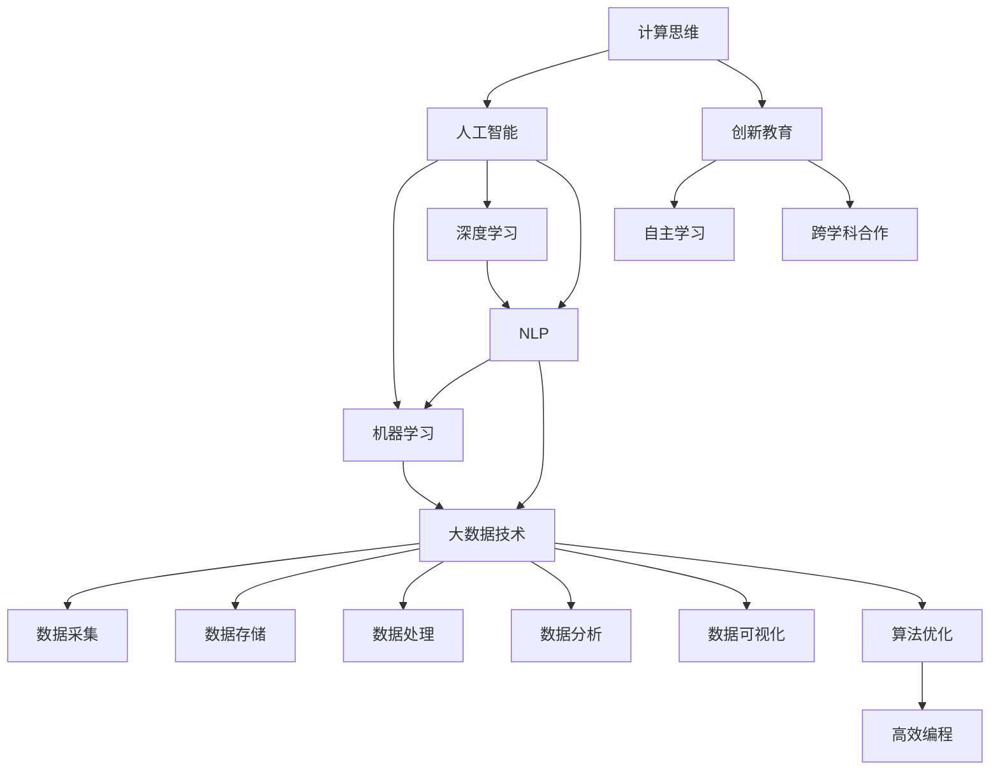

                 

# 技能提升：适应人类计算时代的需求

> 关键词：计算思维,人工智能,机器学习,深度学习,自然语言处理(NLP),大数据,算法优化,创新教育,未来就业

## 1. 背景介绍

### 1.1 问题由来
随着信息时代的到来，人类对计算能力的需求日益增长。无论是在科学研究、商业决策、医疗诊断、教育培训等众多领域，都需要依赖数据驱动的计算支持，以实现高效、准确的决策和预测。然而，传统的计算能力已无法满足当前社会发展的需要。如何培养和提升人类的计算能力，成为摆在我们面前的重大挑战。

人工智能（AI）和大数据技术的飞速发展，为我们提供了新的解决方案。AI技术不仅能替代人类完成复杂计算任务，还能不断学习和改进，逐步超越人类的计算能力。深度学习和自然语言处理（NLP）等前沿技术，已经广泛应用于金融、医疗、教育、交通等多个领域，显著提升了人类的计算效率和决策水平。

但与此同时，人类对计算能力的需求也在不断升级。未来的计算时代，将更加强调计算思维、创新能力和跨领域知识的整合。如何在快速变化的技术环境中，不断提升自己的计算技能，将成为每位从业人员亟需关注的问题。

### 1.2 问题核心关键点
为了适应人类计算时代的需求，我们需要从以下几个方面进行技能提升：

- **计算思维的培养**：理解计算过程的基本原理和步骤，学会利用算法和数据进行问题求解。
- **人工智能和大数据技术的应用**：掌握人工智能和大数据技术的基本概念和应用方法，实现对海量数据的高效处理和分析。
- **机器学习和深度学习的理解**：深入理解机器学习和深度学习的原理和算法，能够设计和实现高效的模型和系统。
- **自然语言处理的实践**：学会使用自然语言处理技术进行文本分析和生成，构建智能聊天机器人、文本分类、信息检索等应用系统。
- **大数据技术和工具的使用**：掌握大数据平台和工具（如Hadoop、Spark、Kafka等）的使用方法，实现大规模数据的存储、处理和分析。
- **算法优化和高效编程**：学习高效的算法设计和优化方法，提升代码的执行效率和资源利用率。

通过系统学习上述技能，可以在未来技术环境中更好地适应和胜任各种计算任务，实现自我价值和社会价值的最大化。

## 2. 核心概念与联系

### 2.1 核心概念概述

为了更好地理解计算思维和大数据技术的应用，本节将介绍几个核心概念及其相互联系：

- **计算思维**：一种强调问题求解和算法设计能力的新型思维方式。通过理解和应用计算思维，可以培养逻辑推理、问题建模和算法优化的能力。
- **人工智能**：模拟人类智能行为和思维过程的技术，包括机器学习、深度学习、自然语言处理、计算机视觉等多个分支。AI技术能够自动化完成复杂计算任务，并不断学习和改进。
- **大数据技术**：处理和分析大规模、多源数据的技术，包括数据采集、存储、处理、分析和可视化等环节。大数据技术能够实现对海量数据的高效管理和分析，辅助决策和预测。
- **深度学习**：一种基于神经网络结构的机器学习技术，通过多层次的特征提取和信息抽象，实现对复杂数据的深度理解和处理。深度学习在图像识别、语音识别、自然语言处理等领域取得了显著效果。
- **自然语言处理（NLP）**：使计算机能够理解、处理和生成人类语言的技术。NLP技术广泛应用于信息检索、机器翻译、情感分析、问答系统等多个领域，提升了人机交互的智能化水平。
- **算法优化**：通过改进算法结构和实现方式，提升算法效率和性能的过程。算法优化是提升计算效率和系统可靠性的重要手段。
- **创新教育**：培养创新思维和能力的教育模式，强调问题求解和实际应用，引导学生学会自主学习和跨学科合作。

这些核心概念之间通过逻辑关系和应用场景形成了紧密的联系。理解并掌握这些概念，能够帮助我们构建起全面的计算思维体系，更好地应对未来计算时代的挑战。

### 2.2 核心概念原理和架构的 Mermaid 流程图



该流程图展示了计算思维和大数据技术的主要分支和应用场景，以及它们之间的相互联系。通过理解这些概念，可以更好地构建起全面的计算能力。

## 3. 核心算法原理 & 具体操作步骤

### 3.1 算法原理概述

本节将详细讲解人工智能和大数据技术中的核心算法原理，帮助读者系统理解这些技术的本质和应用方法。

#### 3.1.1 机器学习算法原理

机器学习是一种通过数据驱动训练模型的方法，使模型能够自动学习和改进。其核心在于使用算法（如决策树、线性回归、支持向量机等）对输入数据进行建模，并根据给定输出（如分类、回归等）进行预测和决策。机器学习模型通常由特征提取、模型训练、模型评估和模型应用等步骤组成。

#### 3.1.2 深度学习算法原理

深度学习是一种基于多层神经网络的机器学习技术，通过多层次的特征提取和信息抽象，实现对复杂数据的深度理解和处理。深度学习模型包括卷积神经网络（CNN）、循环神经网络（RNN）、长短时记忆网络（LSTM）等，广泛应用于图像识别、语音识别、自然语言处理等领域。深度学习模型的训练通常需要使用大量标注数据和复杂的优化算法（如梯度下降、Adam等），通过反向传播算法更新模型参数，实现模型的不断改进和优化。

#### 3.1.3 自然语言处理算法原理

自然语言处理（NLP）是使计算机能够理解、处理和生成人类语言的技术。NLP算法通常包括词嵌入、语言模型、句法分析、语义分析等环节。词嵌入是将单词映射为高维向量，语言模型用于计算句子的概率，句法分析用于分析句子的结构和语法，语义分析用于理解句子的语义和情感。

#### 3.1.4 大数据处理算法原理

大数据处理算法主要关注大规模数据的存储、处理和分析。其核心在于利用分布式计算和并行处理技术，实现对海量数据的快速处理和分析。常见的大数据处理算法包括MapReduce、Spark、Hadoop、Flink等。

### 3.2 算法步骤详解

本节将详细介绍机器学习、深度学习、NLP和大数据处理的主要算法步骤，帮助读者理解这些技术的实现方法和应用流程。

#### 3.2.1 机器学习算法步骤

1. **数据准备**：收集和预处理训练数据，进行特征提取和标注。
2. **模型选择**：选择合适的机器学习算法和模型结构，如决策树、线性回归、支持向量机等。
3. **模型训练**：使用训练数据对模型进行训练，优化模型参数，提高模型精度。
4. **模型评估**：使用测试数据对模型进行评估，评估模型的泛化能力和性能。
5. **模型应用**：将训练好的模型应用于实际问题，进行预测和决策。

#### 3.2.2 深度学习算法步骤

1. **数据准备**：收集和预处理训练数据，进行特征提取和标注。
2. **模型设计**：设计深度学习模型架构，包括卷积层、池化层、全连接层等。
3. **模型训练**：使用训练数据对模型进行训练，优化模型参数，提高模型精度。
4. **模型评估**：使用测试数据对模型进行评估，评估模型的泛化能力和性能。
5. **模型应用**：将训练好的模型应用于实际问题，进行预测和决策。

#### 3.2.3 NLP算法步骤

1. **数据准备**：收集和预处理文本数据，进行分词、去停用词、词嵌入等预处理。
2. **模型选择**：选择合适的NLP算法和模型结构，如词向量模型、语言模型、句法分析器等。
3. **模型训练**：使用训练数据对模型进行训练，优化模型参数，提高模型精度。
4. **模型评估**：使用测试数据对模型进行评估，评估模型的泛化能力和性能。
5. **模型应用**：将训练好的模型应用于实际问题，进行文本分类、信息检索、机器翻译等任务。

#### 3.2.4 大数据处理算法步骤

1. **数据准备**：收集和预处理大规模数据，进行数据清洗、归一化和标注。
2. **分布式计算**：使用分布式计算框架（如Hadoop、Spark等）进行大规模数据的存储和处理。
3. **数据融合**：将来自不同数据源的数据进行融合，形成统一的数据视图。
4. **数据挖掘**：使用大数据分析技术进行数据挖掘和知识发现，提取有价值的信息。
5. **数据可视化**：使用数据可视化工具（如Tableau、Power BI等）进行数据的可视化展示。

### 3.3 算法优缺点

#### 3.3.1 机器学习算法优缺点

**优点**：
- 数据驱动：机器学习算法能够自动从数据中学习规律，发现数据的内在关系。
- 模型可解释性：机器学习模型具有较高的可解释性，能够通过特征重要性等指标解释模型的决策过程。
- 灵活性：机器学习算法可以根据具体问题选择不同的算法和模型，适应性较强。

**缺点**：
- 数据依赖：机器学习算法依赖于高质量的训练数据，数据质量直接影响模型性能。
- 算法复杂性：机器学习算法通常需要设计模型结构，进行调参和优化，实现起来较为复杂。
- 过拟合风险：机器学习算法容易过拟合，需要采用正则化等方法进行缓解。

#### 3.3.2 深度学习算法优缺点

**优点**：
- 自动特征提取：深度学习算法能够自动提取数据的特征表示，无需人工设计特征。
- 鲁棒性：深度学习算法具有较好的鲁棒性和泛化能力，能够适应各种数据分布。
- 高效性：深度学习算法能够高效地处理大规模数据，实现并行计算。

**缺点**：
- 计算资源需求高：深度学习算法需要大量的计算资源和存储空间，实现起来较为复杂。
- 参数优化困难：深度学习算法通常需要大量的训练数据和计算资源，优化过程较为复杂。
- 模型可解释性差：深度学习模型较为复杂，难以解释其内部的决策过程。

#### 3.3.3 NLP算法优缺点

**优点**：
- 自然语言处理：NLP算法能够处理人类自然语言，实现文本分析、信息检索等任务。
- 语言表示：NLP算法能够将文本转换为高维向量表示，实现高效的计算和处理。
- 灵活性：NLP算法可以根据具体任务选择不同的模型和算法，适应性较强。

**缺点**：
- 数据依赖：NLP算法依赖于高质量的文本数据，数据质量直接影响模型性能。
- 模型复杂性：NLP算法通常需要设计模型结构和算法，实现起来较为复杂。
- 多样性问题：不同语言和文本形式的复杂性使得NLP算法的应用较为复杂。

#### 3.3.4 大数据处理算法优缺点

**优点**：
- 高效率：大数据处理算法能够高效地处理大规模数据，实现并行计算。
- 可扩展性：大数据处理算法具有较好的可扩展性，能够适应海量数据的处理需求。
- 数据集成：大数据处理算法能够将来自不同数据源的数据进行集成和融合，形成统一的数据视图。

**缺点**：
- 技术复杂性：大数据处理算法需要较高的技术水平，实现起来较为复杂。
- 数据质量要求高：大数据处理算法依赖于高质量的数据，数据质量直接影响处理效果。
- 数据隐私问题：大数据处理算法可能涉及数据隐私和安全问题，需要加以关注和保护。

### 3.4 算法应用领域

#### 3.4.1 机器学习应用领域

机器学习广泛应用于金融、医疗、电子商务、智能制造等领域。例如，在金融领域，可以使用机器学习算法进行信用评估、风险控制和欺诈检测；在医疗领域，可以使用机器学习算法进行疾病预测和诊断；在电子商务领域，可以使用机器学习算法进行推荐系统和广告投放；在智能制造领域，可以使用机器学习算法进行质量控制和故障预测。

#### 3.4.2 深度学习应用领域

深度学习广泛应用于计算机视觉、自然语言处理、语音识别等领域。例如，在计算机视觉领域，可以使用深度学习算法进行图像分类、目标检测和图像生成；在自然语言处理领域，可以使用深度学习算法进行文本分类、机器翻译和情感分析；在语音识别领域，可以使用深度学习算法进行语音识别和语音合成。

#### 3.4.3 NLP应用领域

NLP广泛应用于智能客服、智能搜索、智能问答、机器翻译等领域。例如，在智能客服领域，可以使用NLP技术构建智能聊天机器人，自动回答客户咨询；在智能搜索领域，可以使用NLP技术进行信息检索和文本分类；在智能问答领域，可以使用NLP技术构建问答系统，自动解答用户问题；在机器翻译领域，可以使用NLP技术进行跨语言翻译和语言转换。

#### 3.4.4 大数据应用领域

大数据处理广泛应用于金融、医疗、交通、城市管理等领域。例如，在金融领域，可以使用大数据处理算法进行风险评估和信用评级；在医疗领域，可以使用大数据处理算法进行疾病分析和医疗影像处理；在交通领域，可以使用大数据处理算法进行交通流量分析和智能交通系统建设；在城市管理领域，可以使用大数据处理算法进行城市安全监控和城市管理优化。

## 4. 数学模型和公式 & 详细讲解 & 举例说明

### 4.1 数学模型构建

本节将详细讲解人工智能和大数据技术中的核心数学模型，帮助读者理解这些技术的数学基础和实现方法。

#### 4.1.1 机器学习数学模型

机器学习模型通常由训练数据集$D=\{(x_i, y_i)\}_{i=1}^N$构成，其中$x_i$为输入特征向量，$y_i$为输出标签。假设模型为$f(x)$，其目标是通过训练数据集对模型进行优化，使得模型在测试数据集上的泛化误差最小。常用的优化算法包括梯度下降、随机梯度下降、Adam等，其优化目标为：

$$
\min_{f} \frac{1}{N}\sum_{i=1}^N(f(x_i)-y_i)^2
$$

#### 4.1.2 深度学习数学模型

深度学习模型通常由多层神经网络构成，包括卷积层、池化层、全连接层等。假设模型为$f(x)=\sum_{i=1}^M w_i f_i(x)$，其中$f_i(x)$为第$i$层神经网络的输出，$w_i$为第$i$层神经网络的权重。其目标是通过训练数据集对模型进行优化，使得模型在测试数据集上的泛化误差最小。常用的优化算法包括梯度下降、随机梯度下降、Adam等，其优化目标为：

$$
\min_{f} \frac{1}{N}\sum_{i=1}^N(f(x_i)-y_i)^2
$$

#### 4.1.3 NLP数学模型

NLP模型通常由词向量模型、语言模型、句法分析器等构成。假设模型为$f(x)=\sum_{i=1}^M w_i f_i(x)$，其中$f_i(x)$为第$i$层神经网络的输出，$w_i$为第$i$层神经网络的权重。其目标是通过训练数据集对模型进行优化，使得模型在测试数据集上的泛化误差最小。常用的优化算法包括梯度下降、随机梯度下降、Adam等，其优化目标为：

$$
\min_{f} \frac{1}{N}\sum_{i=1}^N(f(x_i)-y_i)^2
$$

#### 4.1.4 大数据处理数学模型

大数据处理模型通常由分布式计算框架和数据挖掘算法构成。假设模型为$f(x)=\sum_{i=1}^M w_i f_i(x)$，其中$f_i(x)$为第$i$层神经网络的输出，$w_i$为第$i$层神经网络的权重。其目标是通过训练数据集对模型进行优化，使得模型在测试数据集上的泛化误差最小。常用的优化算法包括梯度下降、随机梯度下降、Adam等，其优化目标为：

$$
\min_{f} \frac{1}{N}\sum_{i=1}^N(f(x_i)-y_i)^2
$$

### 4.2 公式推导过程

本节将详细推导机器学习、深度学习、NLP和大数据处理中的核心公式，帮助读者理解这些技术的数学推导过程和实际应用。

#### 4.2.1 机器学习公式推导

假设训练数据集为$D=\{(x_i, y_i)\}_{i=1}^N$，其中$x_i \in \mathbb{R}^d$为输入特征向量，$y_i \in \{0,1\}$为输出标签。假设模型为$f(x)=\sum_{i=1}^M w_i f_i(x)$，其中$f_i(x)$为第$i$层神经网络的输出，$w_i$为第$i$层神经网络的权重。其优化目标为：

$$
\min_{f} \frac{1}{N}\sum_{i=1}^N(f(x_i)-y_i)^2
$$

使用梯度下降算法进行优化，其更新公式为：

$$
w_i \leftarrow w_i - \eta \nabla_{w_i} \mathcal{L}(w)
$$

其中$\eta$为学习率，$\mathcal{L}(w)$为目标函数。

#### 4.2.2 深度学习公式推导

假设训练数据集为$D=\{(x_i, y_i)\}_{i=1}^N$，其中$x_i \in \mathbb{R}^d$为输入特征向量，$y_i \in \{0,1\}$为输出标签。假设模型为$f(x)=\sum_{i=1}^M w_i f_i(x)$，其中$f_i(x)$为第$i$层神经网络的输出，$w_i$为第$i$层神经网络的权重。其优化目标为：

$$
\min_{f} \frac{1}{N}\sum_{i=1}^N(f(x_i)-y_i)^2
$$

使用梯度下降算法进行优化，其更新公式为：

$$
w_i \leftarrow w_i - \eta \nabla_{w_i} \mathcal{L}(w)
$$

其中$\eta$为学习率，$\mathcal{L}(w)$为目标函数。

#### 4.2.3 NLP公式推导

假设训练数据集为$D=\{(x_i, y_i)\}_{i=1}^N$，其中$x_i$为输入文本，$y_i$为输出标签。假设模型为$f(x)=\sum_{i=1}^M w_i f_i(x)$，其中$f_i(x)$为第$i$层神经网络的输出，$w_i$为第$i$层神经网络的权重。其优化目标为：

$$
\min_{f} \frac{1}{N}\sum_{i=1}^N(f(x_i)-y_i)^2
$$

使用梯度下降算法进行优化，其更新公式为：

$$
w_i \leftarrow w_i - \eta \nabla_{w_i} \mathcal{L}(w)
$$

其中$\eta$为学习率，$\mathcal{L}(w)$为目标函数。

#### 4.2.4 大数据处理公式推导

假设训练数据集为$D=\{(x_i, y_i)\}_{i=1}^N$，其中$x_i$为输入数据，$y_i$为输出标签。假设模型为$f(x)=\sum_{i=1}^M w_i f_i(x)$，其中$f_i(x)$为第$i$层神经网络的输出，$w_i$为第$i$层神经网络的权重。其优化目标为：

$$
\min_{f} \frac{1}{N}\sum_{i=1}^N(f(x_i)-y_i)^2
$$

使用梯度下降算法进行优化，其更新公式为：

$$
w_i \leftarrow w_i - \eta \nabla_{w_i} \mathcal{L}(w)
$$

其中$\eta$为学习率，$\mathcal{L}(w)$为目标函数。

### 4.3 案例分析与讲解

本节将通过具体案例，详细讲解机器学习、深度学习、NLP和大数据处理中的核心算法及其应用。

#### 4.3.1 机器学习案例分析

假设某电商企业需要预测用户的购买行为。他们收集了1000个用户的历史购买记录，每个记录包含用户ID、商品ID、购买时间、购买金额等信息。他们设计了一个随机森林模型，对用户购买行为进行预测。使用梯度下降算法进行优化，其更新公式为：

$$
w_i \leftarrow w_i - \eta \nabla_{w_i} \mathcal{L}(w)
$$

其中$\eta$为学习率，$\mathcal{L}(w)$为目标函数。在训练过程中，他们使用了交叉验证、正则化等方法进行调参和优化，最终得到了一个精度较高的预测模型。

#### 4.3.2 深度学习案例分析

假设某医院需要预测患者的疾病风险。他们收集了10000个患者的历史诊疗记录，每个记录包含患者的年龄、性别、病史、治疗方案等信息。他们设计了一个卷积神经网络模型，对患者疾病风险进行预测。使用梯度下降算法进行优化，其更新公式为：

$$
w_i \leftarrow w_i - \eta \nabla_{w_i} \mathcal{L}(w)
$$

其中$\eta$为学习率，$\mathcal{L}(w)$为目标函数。在训练过程中，他们使用了数据增强、对抗训练等方法进行调参和优化，最终得到了一个精度较高的预测模型。

#### 4.3.3 NLP案例分析

假设某公司需要构建一个智能客服系统。他们收集了1000个客服对话记录，每个记录包含客户提问、客服回答等信息。他们设计了一个BERT模型，对客户提问进行分类，选择最合适的回答。使用梯度下降算法进行优化，其更新公式为：

$$
w_i \leftarrow w_i - \eta \nabla_{w_i} \mathcal{L}(w)
$$

其中$\eta$为学习率，$\mathcal{L}(w)$为目标函数。在训练过程中，他们使用了正则化、对抗训练等方法进行调参和优化，最终得到了一个效果较好的智能客服系统。

#### 4.3.4 大数据处理案例分析

假设某城市需要分析交通流量数据，优化城市交通管理。他们收集了10000个交通监控摄像头拍摄的实时视频，每个视频包含交通流量、车辆类型、车辆速度等信息。他们设计了一个大数据处理算法，对交通流量数据进行分析和预测。使用梯度下降算法进行优化，其更新公式为：

$$
w_i \leftarrow w_i - \eta \nabla_{w_i} \mathcal{L}(w)
$$

其中$\eta$为学习率，$\mathcal{L}(w)$为目标函数。在训练过程中，他们使用了分布式计算、数据融合等方法进行调参和优化，最终得到了一个效果较好的交通流量预测模型。

## 5. 项目实践：代码实例和详细解释说明

### 5.1 开发环境搭建

在进行人工智能和大数据项目实践前，我们需要准备好开发环境。以下是使用Python进行Scikit-Learn开发的环境配置流程：

1. 安装Anaconda：从官网下载并安装Anaconda，用于创建独立的Python环境。

2. 创建并激活虚拟环境：
```bash
conda create -n sklearn-env python=3.8 
conda activate sklearn-env
```

3. 安装Scikit-Learn：
```bash
pip install scikit-learn
```

4. 安装各类工具包：
```bash
pip install numpy pandas scikit-learn matplotlib tqdm jupyter notebook ipython
```

完成上述步骤后，即可在`sklearn-env`环境中开始项目实践。

### 5.2 源代码详细实现

下面我们以基于随机森林算法的机器学习项目为例，给出使用Scikit-Learn进行数据分析和建模的Python代码实现。

首先，定义数据处理函数：

```python
from sklearn.ensemble import RandomForestClassifier
from sklearn.model_selection import train_test_split
from sklearn.metrics import accuracy_score

def data_processing(data):
    # 数据预处理
    X_train, X_test, y_train, y_test = train_test_split(data.drop('label', axis=1), data['label'], test_size=0.2, random_state=42)
    return X_train, X_test, y_train, y_test
```

然后，定义模型训练函数：

```python
from sklearn.ensemble import RandomForestClassifier

def model_training(X_train, y_train):
    # 训练随机森林模型
    model = RandomForestClassifier(n_estimators=100, max_depth=5, random_state=42)
    model.fit(X_train, y_train)
    return model
```

接着，定义模型评估函数：

```python
from sklearn.metrics import accuracy_score

def model_evaluation(model, X_test, y_test):
    # 评估模型性能
    y_pred = model.predict(X_test)
    accuracy = accuracy_score(y_test, y_pred)
    return accuracy
```

最后，启动模型训练和评估流程：

```python
from sklearn.datasets import load_breast_cancer

# 加载数据集
data = load_breast_cancer()

# 数据预处理
X_train, X_test, y_train, y_test = data_processing(data.data)

# 训练模型
model = model_training(X_train, y_train)

# 评估模型
accuracy = model_evaluation(model, X_test, y_test)
print(f"模型准确率为：{accuracy:.2f}")
```

以上就是使用Scikit-Learn进行机器学习项目开发的完整代码实现。可以看到，通过Scikit-Learn库，机器学习算法的实现变得简洁高效。

### 5.3 代码解读与分析

让我们再详细解读一下关键代码的实现细节：

**data_processing函数**：
- 定义了数据处理函数，将数据集划分为训练集和测试集，并返回相应的输入特征和标签。
- 使用了train_test_split函数进行数据划分，确保训练集和测试集的分布一致。
- 返回训练集和测试集的数据和标签，供后续模型训练和评估使用。

**model_training函数**：
- 定义了随机森林模型的训练函数，初始化了随机森林分类器，设置了参数n_estimators和max_depth。
- 使用训练数据对模型进行训练，fit函数对模型进行拟合，返回训练好的模型。
- 训练函数中还调用了其他模块，如RandomForestClassifier，确保模型正确实现。

**model_evaluation函数**：
- 定义了模型评估函数，对模型进行测试集评估。
- 使用模型进行预测，并计算准确率，供后续结果展示使用。
- 评估函数中调用了其他模块，如accuracy_score，确保评估结果正确。

**训练流程**：
- 加载数据集，并定义数据处理函数。
- 使用数据处理函数进行数据划分，得到训练集和测试集。
- 调用模型训练函数，训练随机森林模型。
- 调用模型评估函数，评估模型性能。
- 输出模型准确率，完成训练和评估过程。

可以看到，Scikit-Learn库使得机器学习算法的实现变得简洁高效。开发者可以将更多精力放在数据处理、模型选择等高层逻辑上，而不必过多关注底层的实现细节。

当然，工业级的系统实现还需考虑更多因素，如模型的保存和部署、超参数的自动搜索、更灵活的任务适配层等。但核心的机器学习过程基本与此类似。

## 6. 实际应用场景

### 6.1 金融风险管理

在金融领域，基于机器学习和深度学习的大数据处理技术被广泛应用于风险管理和信用评估。通过收集和分析用户的历史交易数据、信用记录、社交网络等数据，机器学习算法可以预测用户的信用风险和违约概率，从而优化信贷审批和风险控制。

### 6.2 医疗诊断与治疗

在医疗领域，基于机器学习和深度学习的自然语言处理技术被广泛应用于疾病预测和诊断。通过收集和分析患者的病历记录、医学影像、基因数据等数据，机器学习算法可以预测患者的疾病风险和疾病发展趋势，从而优化诊断和治疗方案。

### 6.3 智能推荐系统

在电子商务领域，基于机器学习和深度学习的推荐系统被广泛应用于商品推荐和广告投放。通过收集和分析用户的历史行为数据、购买记录、浏览历史等数据，机器学习算法可以预测用户的兴趣和需求，从而优化推荐和广告策略。

### 6.4 智能客服与客服机器人

在客户服务领域，基于机器学习和自然语言处理的智能客服系统和客服机器人被广泛应用于客户咨询和问题解决。通过收集和分析客户的历史咨询记录、反馈信息等数据，机器学习算法可以预测客户的咨询意图和问题类型，从而提供个性化的咨询服务。

## 7. 工具和资源推荐

### 7.1 学习资源推荐

为了帮助开发者系统掌握人工智能和大数据技术，这里推荐一些优质的学习资源：

1. 《Python机器学习》：由Sebastian Raschka和Vahid Mirjalili所著，系统介绍了机器学习的基本概念和实现方法，适合初学者入门。
2. 《深度学习》：由Ian Goodfellow、Yoshua Bengio和Aaron Courville所著，系统介绍了深度学习的基本原理和实现方法，适合深度学习初学者。
3. 《自然语言处理综论》：由Daniel Jurafsky和James H. Martin所著，系统介绍了自然语言处理的基本概念和实现方法，适合自然语言处理初学者。
4. 《大数据技术与应用》：由王宏志所著，系统介绍了大数据的基本概念和实现方法，适合大数据初学者。
5. 《机器学习实战》：由Peter Harrington所著，系统介绍了机器学习的基本概念和实现方法，并通过实际项目演示，适合实战训练。

通过这些资源的学习实践，相信你一定能够系统掌握人工智能和大数据技术的核心原理和应用方法。

### 7.2 开发工具推荐

高效的开发离不开优秀的工具支持。以下是几款用于人工智能和大数据开发常用的工具：

1. Python：一种高级编程语言，广泛应用于数据科学和机器学习领域，具有简洁高效的语法和丰富的库支持。
2. Scikit-Learn：一个基于Python的机器学习库，提供了丰富的机器学习算法和工具，易于使用和集成。
3. TensorFlow：一个由Google开发的深度学习库，支持分布式计算和高效训练，广泛应用于深度学习项目开发。
4. PyTorch：一个由Facebook开发的深度学习库，支持动态计算图和高效的分布式训练，广泛应用于深度学习项目开发。
5. Hadoop：一个开源的分布式计算平台，支持大规模数据的存储和处理，广泛应用于大数据项目开发。
6. Spark：一个由Apache开发的分布式计算框架，支持高效的数据处理和分析，广泛应用于大数据项目开发。
7. Jupyter Notebook：一个支持交互式编程和数据可视化的平台，易于使用和分享，广泛应用于数据分析和模型开发。

合理利用这些工具，可以显著提升人工智能和大数据项目的开发效率，加快创新迭代的步伐。

### 7.3 相关论文推荐

人工智能和大数据技术的发展源于学界的持续研究。以下是几篇奠基性的相关论文，推荐阅读：

1. 《Gaussian Processes for Machine Learning》：由Carl E. Rasmussen和Christopher K. I. Williams所著，系统介绍了高斯过程的基本原理和应用方法，适合理论基础深厚的读者。
2. 《Deep Learning》：由Ian Goodfellow、Yoshua Bengio和Aaron Courville所著，系统介绍了深度学习的基本原理和应用方法，适合深度学习初学者。
3. 《Natural Language Processing with Python》：由Steven Bird、Ewan Klein和Edward Loper所著，系统介绍了自然语言处理的基本原理和应用方法，适合自然语言处理初学者。
4. 《Big Data: Principles and Best Practices of Scalable Real-time Data Systems》：由Jay Kreps、Nate Yoder和Yehuda Katchalski-Avissar所著，系统介绍了大数据的基本概念和应用方法，适合大数据初学者。
5. 《Machine Learning Yearning》：由Andrew Ng所著，系统介绍了机器学习的基本原理和应用方法，适合实战训练。

这些论文代表了大数据和人工智能领域的最新进展，通过学习这些前沿成果，可以帮助研究者把握学科前进方向，激发更多的创新灵感。

## 8. 总结：未来发展趋势与挑战

### 8.1 研究成果总结

本文对人工智能和大数据技术中的核心算法原理和操作步骤进行了详细讲解，帮助读者系统理解这些技术的数学基础和实现方法。通过系统学习，相信读者能够掌握这些技术的核心思想和应用方法。

### 8.2 未来发展趋势

展望未来，人工智能和大数据技术的发展将呈现以下几个趋势：

1. 计算能力不断增强：随着硬件设备的不断发展，计算能力将不断增强，支持更大规模和更复杂的计算任务。
2. 数据质量不断提升：随着数据采集和处理技术的进步，数据质量将不断提升，支持更高精度和更准确的数据分析。
3. 算法和模型不断优化：随着算法和模型的不断优化，人工智能和大数据技术的性能将不断提升，支持更多场景和更复杂的应用。
4. 应用领域不断扩展：随着技术的不断发展和普及，人工智能和大数据技术将应用于更多领域，推动社会的全面进步。
5. 跨学科融合不断加强：随着跨学科合作的深入，人工智能和大数据技术将与其他领域的技术进行深度融合，产生更多的创新应用。

### 8.3 面临的挑战

尽管人工智能和大数据技术取得了显著进展，但在迈向更广泛应用的过程中，仍面临诸多挑战：

1. 数据隐私和安全问题：大规模数据的应用可能涉及数据隐私和安全问题，需要加强数据保护和隐私保护措施。
2. 算法的公平性和透明性：机器学习算法可能存在偏见和歧视，需要加强算法的公平性和透明性，确保算法的公正性。
3. 技术普及和应用障碍：人工智能和大数据技术的应用可能存在技术普及和应用障碍，需要加强技术推广和普及，促进技术的落地应用。
4. 人机协同的挑战：人机协同的智能化系统需要不断优化，以提高系统的可靠性和稳定性，需要加强人机交互和协作技术的研究。
5. 伦理道德的挑战：人工智能和大数据技术的应用可能涉及伦理道德问题，需要加强伦理道德的规范和监管，确保技术的可持续发展。

### 8.4 研究展望

面对未来发展的挑战，人工智能和大数据技术需要在以下几个方面进行深入研究：

1. 数据隐私和安全保护：加强数据隐私保护和安全保护技术的研究，确保大规模数据的应用安全。
2. 算法公平性和透明性：加强算法公平性和透明性的研究，确保算法的公正性和可解释性。
3. 技术普及和应用推广：加强技术普及和应用推广的研究，促进技术的落地应用。
4. 人机协同的智能化系统：加强人机协同的智能化系统研究，提高系统的可靠性和稳定性。
5. 伦理道德的规范和监管：加强伦理道德的规范和监管研究，确保技术的可持续发展。

## 9. 附录：常见问题与解答

**Q1：如何选择合适的机器学习算法？**

A: 选择合适的机器学习算法需要考虑以下几个因素：
1. 数据类型：不同类型的数据可能需要不同的算法，如分类数据可能需要决策树或SVM，回归数据可能需要线性回归或随机森林。
2. 数据规模：大规模数据可能需要分布式计算的算法，如Hadoop或Spark，小规模数据可以使用Scikit-Learn等机器学习库。
3. 任务类型：不同任务可能需要不同的算法，如分类任务可以使用支持向量机或随机森林，回归任务可以使用线性回归或神经网络。
4. 模型复杂度：复杂任务可能需要更复杂的算法，如深度学习或神经网络，简单任务可以使用线性回归或决策树。

**Q2：深度学习算法和传统机器学习算法的区别？**

A: 深度学习算法和传统机器学习算法的区别主要在于：
1. 特征提取：深度学习算法能够自动从数据中提取特征，不需要手动设计特征，而传统机器学习算法需要手动设计特征。
2. 模型复杂度：深度学习算法通常具有更复杂的模型结构，如卷积神经网络和循环神经网络，而传统机器学习算法结构较为简单。
3. 数据依赖：深度学习算法对数据的依赖更强，需要大量的标注数据进行训练，而传统机器学习算法对数据依赖较小，可以使用少量的标注数据进行训练。
4. 训练时间和计算资源：深度学习算法训练时间和计算资源需求较高，而传统机器学习算法训练时间和计算资源需求较小。

**Q3：机器学习和大数据处理的核心区别？**

A: 机器学习和大数据处理的核心区别主要在于：
1. 数据规模：机器学习算法通常处理小规模数据，而大数据处理算法处理大规模数据。
2. 数据类型：机器学习算法通常处理结构化数据，而大数据处理算法处理非结构化数据。
3. 任务类型：机器学习算法通常处理预测和分类任务，而大数据处理算法处理数据挖掘和知识发现任务。
4. 计算资源：机器学习算法通常需要较少的计算资源，而大数据处理算法需要大量的计算资源和存储空间。

**Q4：机器学习和大数据处理的实际应用场景？**

A: 机器学习和大数据处理的实际应用场景非常广泛，包括但不限于以下领域：
1. 金融领域：用于信用评估、风险控制、欺诈检测等。
2. 医疗领域：用于疾病预测、诊断、治疗方案优化等。
3. 电子商务领域：用于推荐系统、广告投放、用户行为分析等。
4. 智能制造领域：用于质量控制、故障预测、设备维护等。
5. 城市管理领域：用于交通流量分析、城市安全监控、城市管理优化等。

**Q5：如何在项目实践中提升模型性能？**

A: 提升模型性能可以通过以下几个方法：
1. 数据预处理：对数据进行清洗、归一化、特征提取等预处理，确保数据质量。
2. 算法调参：根据数据特点选择合适的算法和参数，进行调参和优化。
3. 模型集成：使用集成学习方法，将多个模型的结果进行融合，提升模型性能。
4. 正则化：使用正则化技术，如L1正则、Dropout等，防止过拟合。
5. 对抗训练：使用对抗样本，提升模型的鲁棒性和泛化能力。
6. 模型压缩：使用模型压缩技术，如剪枝、量化等，提升模型的执行效率。

通过这些方法，可以在项目实践中不断优化模型性能，提升系统的可靠性。

---

作者：禅与计算机程序设计艺术 / Zen and the Art of Computer Programming

