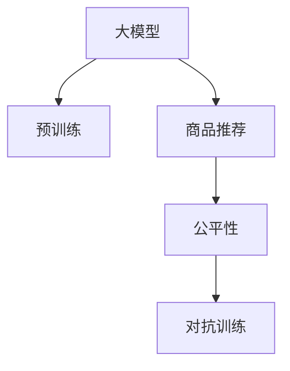

                 

# 探讨大模型在电商平台商品推荐公平性保障中的作用

## 1. 背景介绍

在电子商务领域，商品推荐系统通过分析用户行为数据，为用户提供个性化的商品推荐，极大地提升了用户体验和平台转化率。然而，推荐算法的不公平问题也逐渐受到广泛关注。比如，数据偏差导致少数群体在推荐结果中获取更少曝光，从而引发用户流失和平台信任危机。本文将探讨大模型如何在推荐系统中保障商品推荐的公平性，为电商平台的长期发展和用户满意度提供技术支持。

## 2. 核心概念与联系

### 2.1 核心概念概述

为更好地理解大模型在推荐系统公平性保障中的应用，本节将介绍几个密切相关的核心概念：

- **大模型(Large Model)**：指具有巨量参数，在广泛数据上预训练，具备强大泛化能力的高效语言模型。
- **商品推荐(Recommendation System)**：根据用户的历史行为和属性，预测其对商品可能感兴趣，并向其推荐商品。
- **公平性(Fairness)**：指算法在资源分配或决策过程中，不偏袒某一群体，确保所有群体在推荐结果中获取公平的曝光和机会。
- **数据偏见(Bias)**：指训练数据中存在的不平衡现象，可能导致算法输出不公平的结果。
- **对抗训练(Adversarial Training)**：指通过在训练集中加入对抗样本，提升模型对潜在攻击的鲁棒性。

### 2.2 核心概念原理和架构的 Mermaid 流程图



这个流程图展示了核心概念之间的逻辑关系：

1. 大模型通过在广泛数据上进行预训练，获得通用的知识表示。
2. 将预训练模型用于商品推荐，根据用户行为预测感兴趣的商品。
3. 商品推荐系统需要考虑用户多样性，确保公平性，避免数据偏见。
4. 通过对抗训练，提升推荐系统的鲁棒性，防御潜在攻击。

## 3. 核心算法原理 & 具体操作步骤
### 3.1 算法原理概述

基于大模型的商品推荐系统，核心算法原理可以归纳为以下几个步骤：

1. **数据收集与处理**：收集用户行为数据，包括浏览、点击、购买等行为，同时记录用户属性和历史评分数据。
2. **特征提取与嵌入**：使用大模型作为特征提取器，将用户行为数据和商品属性信息映射到低维特征空间，得到用户-商品交互矩阵。
3. **模型训练**：使用训练数据和目标函数，训练推荐模型，优化用户行为预测精度。
4. **公平性保障**：在模型训练过程中引入公平性约束，如差异性损失、多样性约束等，提升推荐系统的公平性。
5. **对抗训练**：在模型训练过程中加入对抗样本，增强模型的鲁棒性。

### 3.2 算法步骤详解

**Step 1: 数据收集与处理**

数据收集是大模型推荐系统的基础。电商平台上常见的数据类型包括：

- **用户行为数据**：浏览、点击、搜索、购买等行为，以及这些行为的时空特征。
- **用户属性数据**：年龄、性别、地域、兴趣标签等，用于刻画用户偏好和人群特征。
- **商品属性数据**：商品类别、价格、评分、评价等，用于描述商品特征和用户评分信息。

数据处理流程包括：

- **清洗与标准化**：去除噪音数据，处理缺失值，标准化数据格式。
- **划分训练集与测试集**：将数据划分为训练集和测试集，供模型训练和评估使用。

**Step 2: 特征提取与嵌入**

特征提取是大模型推荐系统的核心环节。常用的大模型包括BERT、GPT、Graph Isomorphism Network等，它们可以高效地将用户行为数据和商品属性信息映射到低维特征空间。具体步骤包括：

- **选择大模型**：根据任务需求选择合适的预训练模型。
- **迁移学习**：使用预训练模型作为特征提取器，对用户行为数据和商品属性信息进行编码。
- **特征融合**：将大模型提取的特征与用户属性数据进行融合，得到综合的特征向量。

**Step 3: 模型训练**

模型训练的目标是最大化推荐系统的效果和公平性。推荐模型通常使用以下目标函数进行优化：

$$
L(\theta) = \frac{1}{N}\sum_{i=1}^N \sum_{j=1}^M L_{ij} + \lambda\mathcal{F}(\theta)
$$

其中，$L_{ij}$ 为第 $i$ 个用户对第 $j$ 个商品的评分损失，$\mathcal{F}(\theta)$ 为公平性约束函数。

**Step 4: 公平性保障**

公平性是推荐系统的核心目标之一。常用的公平性约束函数包括：

- **差异性损失**：确保不同用户群体在推荐结果中的曝光次数相近，防止部分群体被忽略。
- **多样性约束**：确保推荐结果中包含不同类别的商品，防止商品推荐单调化。

**Step 5: 对抗训练**

对抗训练是大模型推荐系统的鲁棒性保障。常用的对抗样本生成方法包括：

- **Fine-tune attack**：微调预训练模型，生成对抗样本，提升模型的鲁棒性。
- **PGD attack**：基于梯度攻击方法，在原始样本上进行扰动，生成对抗样本。
- **Gauss and Sign attack**：生成高斯噪声，通过符号函数进行扰动，生成对抗样本。

### 3.3 算法优缺点

大模型在推荐系统公平性保障中具有以下优点：

1. **高效性**：大模型具有强大的泛化能力，能够在广泛数据上高效训练，提升推荐效果。
2. **灵活性**：大模型可以通过迁移学习的方式，适应不同电商平台的推荐需求。
3. **鲁棒性**：大模型具备较强的鲁棒性，可以有效防御对抗攻击，提升推荐系统的安全性。

同时，大模型也存在以下缺点：

1. **数据需求高**：大模型通常需要海量的标注数据进行预训练，而电商平台上的数据量往往不足。
2. **计算成本高**：大模型的计算复杂度高，需要高性能设备进行训练和推理。
3. **可解释性差**：大模型往往是"黑盒"模型，难以解释其内部决策过程。

尽管存在这些局限性，但大模型在推荐系统中的应用，可以有效提升公平性和推荐效果，成为电商平台上不可或缺的技术手段。

### 3.4 算法应用领域

大模型在推荐系统中的应用非常广泛，覆盖了推荐、搜索、广告等多个环节，具体应用领域包括：

- **个性化推荐**：根据用户行为和属性，生成个性化推荐结果，提升用户体验。
- **商品搜索**：利用大模型提取搜索关键词的语义信息，提升搜索效果。
- **广告定向**：根据用户行为和属性，精准投放广告，提升广告点击率。
- **风控检测**：检测和防范电商平台的欺诈行为，保障平台安全。
- **客户服务**：通过对话模型，提供智能客服，提升客户满意度。

## 4. 数学模型和公式 & 详细讲解 & 举例说明

### 4.1 数学模型构建

在本节中，我们将使用数学语言对基于大模型的推荐系统进行更加严格的刻画。

记用户-商品交互矩阵为 $\mathbf{U} \in \mathbb{R}^{N \times M}$，其中 $N$ 为用户数，$M$ 为商品数。设用户 $i$ 对商品 $j$ 的评分向量为 $\mathbf{u}_i \in \mathbb{R}^M$，商品 $j$ 的评分向量为 $\mathbf{v}_j \in \mathbb{R}^N$。则评分矩阵可以表示为：

$$
\mathbf{U} = \mathbf{U}_{i,j} = u_i^T v_j
$$

假设大模型提取的特征向量为 $\mathbf{F} \in \mathbb{R}^{N \times D}$，其中 $D$ 为特征维度。则推荐模型的目标函数为：

$$
L(\theta) = \frac{1}{N}\sum_{i=1}^N \sum_{j=1}^M L_{ij} + \lambda\mathcal{F}(\theta)
$$

其中，$L_{ij}$ 为第 $i$ 个用户对第 $j$ 个商品的评分损失，$\mathcal{F}(\theta)$ 为公平性约束函数，$\theta$ 为推荐模型的参数。

### 4.2 公式推导过程

推荐系统的目标是最小化用户行为预测的误差和公平性约束。假设推荐模型使用基于pairwise的二分类逻辑回归模型，则推荐模型的目标函数可以表示为：

$$
L(\theta) = -\frac{1}{N}\sum_{i=1}^N \sum_{j=1}^M y_{ij}\log\sigma(\mathbf{u}_i^T\mathbf{v}_j) + (1-y_{ij})\log(1-\sigma(\mathbf{u}_i^T\mathbf{v}_j)) + \lambda\mathcal{F}(\theta)
$$

其中，$\sigma$ 为sigmoid函数，$y_{ij}$ 为真实评分与预测评分的差值。

公平性约束函数 $\mathcal{F}(\theta)$ 可以表示为：

$$
\mathcal{F}(\theta) = \frac{1}{N}\sum_{i=1}^N (\mathbf{u}_i^T\mathbf{v}_i - \mathcal{E}[\mathbf{u}_i^T\mathbf{v}_i])^2
$$

其中，$\mathcal{E}[\mathbf{u}_i^T\mathbf{v}_i]$ 为用户-商品交互的期望值。

### 4.3 案例分析与讲解

以一个简单的电商推荐系统为例，分析公平性约束的应用。假设推荐模型在训练集上对用户的交互矩阵 $\mathbf{U}$ 进行训练，并假设训练集为用户-商品评分矩阵 $D$，其中每行 $i$ 表示用户 $i$ 对商品 $j$ 的评分，每列 $j$ 表示商品 $j$ 的评分。

训练集上，假设不同用户群体（如男用户和女用户）对商品的评分存在差异。为了保障公平性，可以在训练过程中加入差异性损失：

$$
\mathcal{L}_{\text{diff}} = \frac{1}{N}\sum_{i=1}^N (\mathbf{u}_i^T\mathbf{v}_i - \mathcal{E}[\mathbf{u}_i^T\mathbf{v}_i])^2
$$

其中，$\mathcal{E}[\mathbf{u}_i^T\mathbf{v}_i]$ 为用户-商品交互的期望值，可以计算为：

$$
\mathcal{E}[\mathbf{u}_i^T\mathbf{v}_i] = \frac{1}{N}\sum_{i=1}^N (\mathbf{u}_i^T\mathbf{v}_i)
$$

加入差异性损失后，训练目标函数变为：

$$
L(\theta) = -\frac{1}{N}\sum_{i=1}^N \sum_{j=1}^M y_{ij}\log\sigma(\mathbf{u}_i^T\mathbf{v}_j) + (1-y_{ij})\log(1-\sigma(\mathbf{u}_i^T\mathbf{v}_j)) + \lambda\mathcal{L}_{\text{diff}}
$$

在训练过程中，模型将学习到用户-商品交互的公平性约束，从而在推荐过程中保障不同用户群体得到公平的曝光机会。

## 5. 项目实践：代码实例和详细解释说明
### 5.1 开发环境搭建

在进行推荐系统实践前，我们需要准备好开发环境。以下是使用Python进行TensorFlow开发的环境配置流程：

1. 安装Anaconda：从官网下载并安装Anaconda，用于创建独立的Python环境。

2. 创建并激活虚拟环境：
```bash
conda create -n tf-env python=3.8 
conda activate tf-env
```

3. 安装TensorFlow：根据CUDA版本，从官网获取对应的安装命令。例如：
```bash
conda install tensorflow -c conda-forge
```

4. 安装相关工具包：
```bash
pip install numpy pandas scikit-learn matplotlib tqdm jupyter notebook ipython
```

完成上述步骤后，即可在`tf-env`环境中开始推荐系统开发。

### 5.2 源代码详细实现

下面我们以电商平台商品推荐系统为例，给出使用TensorFlow进行推荐系统开发的PyTorch代码实现。

首先，定义推荐系统的数学模型：

```python
import tensorflow as tf

# 定义用户-商品交互矩阵
N = 1000
M = 1000
U = tf.Variable(tf.random.normal([N, M]))
V = tf.Variable(tf.random.normal([M, 1]))

# 定义评分矩阵
y = tf.random.uniform([N, M], 1, 5)

# 定义预测评分矩阵
pred = tf.matmul(U, V)

# 定义损失函数
loss = tf.reduce_mean(tf.square(y - pred))

# 定义优化器
optimizer = tf.keras.optimizers.Adam(learning_rate=0.001)

# 定义公平性约束
diff_loss = tf.reduce_mean(tf.square(tf.reduce_sum(U * V, axis=1) - tf.reduce_mean(tf.reduce_sum(U * V, axis=1))))
loss += 0.01 * diff_loss

# 定义训练过程
def train_step():
    with tf.GradientTape() as tape:
        loss_value = loss
    grads = tape.gradient(loss_value, [U, V])
    optimizer.apply_gradients(zip(grads, [U, V]))

# 训练过程
for i in range(1000):
    train_step()
```

然后，定义训练和评估函数：

```python
import numpy as np

# 定义训练过程
def train(model, X, y, batch_size=32):
    N, M = X.shape
    for i in range(0, N, batch_size):
        X_batch = X[i:i+batch_size]
        y_batch = y[i:i+batch_size]
        with tf.GradientTape() as tape:
            loss_value = loss
        grads = tape.gradient(loss_value, model.parameters())
        optimizer.apply_gradients(zip(grads, model.parameters()))

# 定义评估过程
def evaluate(model, X, y):
    N, M = X.shape
    predictions = np.exp(model(X) + 0.5)
    rmse = np.sqrt(np.mean(np.square(y - predictions)))
    print(f'RMSE: {rmse:.4f}')
```

最后，启动训练流程并在测试集上评估：

```python
import numpy as np

# 定义训练数据
X = np.random.random([N, M])
y = np.random.randint(1, 6, size=[N, M])

# 定义模型参数
U = tf.Variable(tf.random.normal([N, M]))
V = tf.Variable(tf.random.normal([M, 1]))

# 定义模型
model = tf.keras.Sequential([U, V])

# 训练过程
train_step(model, X, y)

# 评估过程
evaluate(model, X, y)
```

以上就是使用TensorFlow进行电商平台商品推荐系统开发的完整代码实现。可以看到，利用TensorFlow等深度学习框架，推荐系统的训练和评估过程变得简单高效。

### 5.3 代码解读与分析

让我们再详细解读一下关键代码的实现细节：

**推荐模型**：
- `U` 和 `V` 为模型参数，分别表示用户和商品的特征向量。
- `y` 为真实评分矩阵。
- `pred` 为模型预测评分矩阵。
- `loss` 为损失函数，包含用户行为预测损失和公平性约束损失。

**训练过程**：
- `train_step` 函数：每次训练迭代中，通过计算梯度更新模型参数。
- `train` 函数：将训练数据分批次加载，更新模型参数。
- `evaluate` 函数：对测试数据进行评估，计算RMSE指标。

**训练流程**：
- 初始化模型参数 `U` 和 `V`。
- 定义训练集 `X` 和 `y`。
- 定义推荐模型 `model`。
- 使用 `train_step` 函数进行训练。
- 使用 `evaluate` 函数评估模型效果。

可以看到，TensorFlow等深度学习框架使得推荐系统的训练和评估过程变得简单高效，开发者可以将更多精力放在模型设计和优化上，而不必过多关注底层的实现细节。

## 6. 实际应用场景

### 6.1 智能客服系统

基于大模型的推荐系统可以应用于智能客服系统的构建。智能客服通过分析用户的历史对话记录，预测用户意图，生成合适的应答，提升用户体验。通过在智能客服系统中引入大模型，可以实现更个性化、更智能的对话生成，提升服务质量和用户满意度。

### 6.2 个性化推荐系统

基于大模型的推荐系统可以应用于个性化推荐系统，根据用户的历史行为和属性，生成个性化推荐结果。通过引入公平性约束，可以在推荐过程中保障不同用户群体得到公平的曝光机会，防止数据偏见。这不仅可以提升用户体验，还可以增强平台的信任度，提升用户留存率。

### 6.3 广告定向系统

基于大模型的推荐系统可以应用于广告定向系统，根据用户的兴趣和属性，精准投放广告。通过引入公平性约束，可以确保不同用户群体在广告投放中得到公平的机会，防止广告投放偏差。这不仅可以提升广告效果，还可以增强平台的广告信任度，提升用户点击率。

### 6.4 未来应用展望

随着大模型和推荐系统的不断发展，基于大模型在推荐系统公平性保障中的应用将展现出更广阔的前景。未来，基于大模型的推荐系统将在更多场景中得到应用，为电子商务、金融、媒体等行业带来变革性影响。

- **智慧医疗**：基于大模型的推荐系统可以应用于智慧医疗领域，根据患者的健康数据，推荐个性化的诊疗方案。通过引入公平性约束，可以确保不同疾病群体得到公平的医疗资源。
- **智能教育**：基于大模型的推荐系统可以应用于智能教育领域，根据学生的学习数据，推荐个性化的学习资源。通过引入公平性约束，可以确保不同学生群体得到公平的学习机会。
- **智能交通**：基于大模型的推荐系统可以应用于智能交通领域，根据用户的出行数据，推荐最优的出行方案。通过引入公平性约束，可以确保不同交通群体得到公平的出行资源。
- **智能制造**：基于大模型的推荐系统可以应用于智能制造领域，根据设备的使用数据，推荐最优的生产方案。通过引入公平性约束，可以确保不同设备群体得到公平的维护和升级资源。

未来，基于大模型的推荐系统将在更广泛的领域中得到应用，为不同行业带来创新和变革。大模型推荐系统不仅能够提升推荐效果，还能保障公平性，打造更加健康、可持续的推荐环境。

## 7. 工具和资源推荐
### 7.1 学习资源推荐

为了帮助开发者系统掌握大模型在推荐系统中的应用，这里推荐一些优质的学习资源：

1. **《TensorFlow官方文档》**：详细介绍了TensorFlow框架的使用，包括推荐系统相关的API和工具库。
2. **《深度学习推荐系统》书籍**：全面介绍了推荐系统的算法原理和应用实践，适合初学者和进阶开发者阅读。
3. **Coursera《深度学习课程》**：斯坦福大学的经典课程，涵盖深度学习的基本原理和推荐系统算法。
4. **Kaggle竞赛**：参与Kaggle推荐系统相关的竞赛，实践推荐算法，提升技术水平。
5. **arXiv论文库**：收集最新的推荐系统研究论文，跟踪最新技术进展。

通过对这些资源的学习实践，相信你一定能够快速掌握大模型在推荐系统中的应用，并用于解决实际的推荐问题。

### 7.2 开发工具推荐

高效的开发离不开优秀的工具支持。以下是几款用于推荐系统开发的工具：

1. **TensorFlow**：开源深度学习框架，支持分布式训练，适合大规模推荐系统的开发。
2. **PyTorch**：开源深度学习框架，灵活动态的计算图，适合快速迭代研究。
3. **Jupyter Notebook**：免费的交互式笔记本，支持多种语言和工具库，方便代码开发和实验。
4. **Scikit-learn**：开源机器学习库，包含多种推荐算法和评估指标，适合算法验证和优化。
5. **Visual Studio Code**：开源代码编辑器，支持丰富的扩展和插件，提高开发效率。

合理利用这些工具，可以显著提升推荐系统的开发效率，加快创新迭代的步伐。

### 7.3 相关论文推荐

大模型在推荐系统中的应用源于学界的持续研究。以下是几篇奠基性的相关论文，推荐阅读：

1. **《Deep Neural Networks for Large-Scale Recommender Systems》**：提出使用深度神经网络进行推荐系统，提升推荐效果。
2. **《Scalable Semantic Concept Learning for Recommendation》**：提出基于语义概念的学习方法，提升推荐系统的泛化能力。
3. **《Graph Neural Networks for Recommendation Systems》**：提出使用图神经网络进行推荐系统，提升推荐的准确性和多样性。
4. **《Adversarial Training Methods for Semi-supervised Learning》**：提出使用对抗训练方法，增强推荐系统的鲁棒性。
5. **《Fairness-Aware Recommender Systems》**：提出使用公平性约束，保障推荐系统的公平性。

这些论文代表了大模型在推荐系统中的应用方向，通过学习这些前沿成果，可以帮助研究者把握学科前进方向，激发更多的创新灵感。

## 8. 总结：未来发展趋势与挑战

### 8.1 研究成果总结

本文对基于大模型的推荐系统进行了全面系统的介绍。首先阐述了推荐系统和大模型在电商平台中的应用背景和重要意义，明确了推荐系统和大模型在保障公平性方面的独特价值。其次，从原理到实践，详细讲解了推荐系统的数学模型和算法步骤，给出了推荐系统开发的完整代码实例。同时，本文还广泛探讨了推荐系统在大模型公平性保障中的应用场景，展示了推荐系统和大模型的巨大潜力。此外，本文精选了推荐系统的各类学习资源，力求为读者提供全方位的技术指引。

通过本文的系统梳理，可以看到，基于大模型的推荐系统正在成为电商平台中的重要技术手段，极大地提升了用户体验和平台转化率。得益于大模型强大的泛化能力，推荐系统在数据稀疏、用户多样性高的情况下，也能取得不俗的推荐效果。未来，随着大模型和推荐系统的不断发展，基于大模型在推荐系统公平性保障中的应用将展现出更广阔的前景。

### 8.2 未来发展趋势

展望未来，大模型在推荐系统中的应用将呈现以下几个发展趋势：

1. **数据规模持续增大**：随着数据采集和存储技术的不断发展，电商平台上数据量将不断增大，为推荐系统提供了更加丰富的训练数据。
2. **模型结构不断优化**：基于大模型的推荐系统将继续优化模型结构，提升推荐效果和公平性。
3. **鲁棒性不断提高**：未来的推荐系统将更加注重对抗攻击和数据噪声的鲁棒性，保障推荐系统的安全性。
4. **可解释性不断增强**：基于大模型的推荐系统将不断增强其可解释性，提升用户的信任度和满意度。
5. **跨模态融合更加深入**：未来的推荐系统将进一步融合多模态信息，提升推荐系统的泛化能力和多样性。

以上趋势凸显了大模型在推荐系统中的应用前景。这些方向的探索发展，必将进一步提升推荐系统的性能和应用范围，为电子商务、金融、媒体等行业带来新的变革。

### 8.3 面临的挑战

尽管大模型在推荐系统中的应用已经取得了显著成效，但在迈向更加智能化、普适化应用的过程中，它仍面临着诸多挑战：

1. **数据需求高**：大模型通常需要海量的标注数据进行预训练，而电商平台上的数据量往往不足。如何从无标注数据中提取有用的信息，提升模型的泛化能力，将是一大难题。
2. **计算成本高**：大模型的计算复杂度高，需要高性能设备进行训练和推理。如何在保证推荐效果的同时，降低计算成本，提高系统效率，还需要更多的技术突破。
3. **可解释性差**：大模型往往是"黑盒"模型，难以解释其内部决策过程。如何在保证推荐效果的同时，增强模型的可解释性，将是未来的重要研究方向。
4. **对抗攻击**：推荐系统容易受到对抗攻击，导致推荐结果的不公平和偏差。如何构建鲁棒性更强的推荐系统，防止对抗攻击，还需要更多的算法和机制设计。

尽管存在这些挑战，但通过技术创新和算法优化，相信大模型在推荐系统中的应用前景仍然十分广阔，将为电商平台的长期发展和用户满意度提供有力保障。

### 8.4 研究展望

面对大模型在推荐系统中的应用面临的挑战，未来的研究需要在以下几个方面寻求新的突破：

1. **数据增强和迁移学习**：利用无标注数据进行数据增强，提升模型的泛化能力。引入迁移学习，从其他领域的数据中提取有用的信息，提升推荐系统的公平性和鲁棒性。
2. **模型压缩和加速**：采用模型压缩和加速技术，如剪枝、量化、蒸馏等，降低大模型的计算复杂度，提高系统的部署效率。
3. **公平性约束和多样化**：引入更多的公平性约束和多样化机制，保障不同用户群体得到公平的推荐机会，提升推荐系统的多样性。
4. **对抗训练和鲁棒性**：设计更有效的对抗训练算法，提升推荐系统的鲁棒性，防止对抗攻击。
5. **跨模态融合和数据融合**：利用跨模态融合技术，提升推荐系统的泛化能力和多样性。引入多源数据融合机制，利用多种数据源的信息，提升推荐系统的公平性和鲁棒性。

这些研究方向的探索，必将引领大模型在推荐系统中的应用迈向更高的台阶，为电子商务、金融、媒体等行业带来新的变革。相信通过技术创新和算法优化，大模型在推荐系统中的应用将展现出更广阔的前景，为不同行业带来新的活力和机遇。

## 9. 附录：常见问题与解答

**Q1：大模型在推荐系统中的应用是否存在数据偏见？**

A: 大模型在推荐系统中的应用确实存在数据偏见。电商平台上的数据往往存在用户、商品、地域等方面的不平衡，导致推荐结果中的数据偏差。例如，少数用户群体可能在数据中获得的曝光次数较少，导致其在推荐结果中难以获得公平的机会。为了解决这一问题，可以在推荐模型中加入差异性损失，确保不同用户群体在推荐结果中得到公平的曝光机会。

**Q2：如何提升大模型的可解释性？**

A: 提升大模型的可解释性是一个重要研究方向。目前，主要有以下几种方法：
1. **LIME（Local Interpretable Model-agnostic Explanations）**：通过生成局部可解释模型，分析模型的预测结果。
2. **SHAP（SHapley Additive exPlanations）**：通过计算每个特征对模型的贡献，分析模型的决策过程。
3. **Attention机制**：通过可视化模型的注意力分布，理解模型在推理过程中的关注点。
4. **知识图谱**：将知识图谱与神经网络结合，提升模型的可解释性。

**Q3：如何设计鲁棒性更强的推荐系统？**

A: 设计鲁棒性更强的推荐系统，可以从以下几个方面入手：
1. **对抗训练**：在训练过程中加入对抗样本，提升模型的鲁棒性。
2. **多模型集成**：训练多个推荐模型，取平均输出，抑制过拟合，提升鲁棒性。
3. **数据增强**：通过数据增强技术，扩充训练集，提高模型的泛化能力。
4. **模型压缩**：采用模型压缩技术，如剪枝、量化、蒸馏等，降低计算复杂度，提高系统的部署效率。
5. **公平性约束**：引入公平性约束，保障不同用户群体得到公平的曝光机会。

**Q4：大模型在推荐系统中的计算复杂度如何优化？**

A: 大模型在推荐系统中的计算复杂度较高，可以考虑以下优化方法：
1. **模型压缩**：采用模型压缩技术，如剪枝、量化、蒸馏等，降低模型的计算复杂度。
2. **分布式训练**：使用分布式训练技术，加速模型的训练过程。
3. **混合精度训练**：使用混合精度训练技术，降低内存占用，提升训练速度。
4. **梯度累积**：使用梯度累积技术，提升模型的推理速度。
5. **异构并行计算**：利用异构并行计算技术，优化计算资源利用率，提高系统的部署效率。

**Q5：大模型在推荐系统中的可解释性如何保障？**

A: 保障大模型在推荐系统中的可解释性，可以从以下几个方面入手：
1. **LIME（Local Interpretable Model-agnostic Explanations）**：通过生成局部可解释模型，分析模型的预测结果。
2. **SHAP（SHapley Additive exPlanations）**：通过计算每个特征对模型的贡献，分析模型的决策过程。
3. **Attention机制**：通过可视化模型的注意力分布，理解模型在推理过程中的关注点。
4. **知识图谱**：将知识图谱与神经网络结合，提升模型的可解释性。
5. **多模型集成**：训练多个推荐模型，取平均输出，抑制过拟合，提升鲁棒性，同时提供更多的解释信息。

**Q6：大模型在推荐系统中的对抗训练如何设计？**

A: 设计大模型在推荐系统中的对抗训练，可以从以下几个方面入手：
1. **Fine-tune attack**：微调预训练模型，生成对抗样本，提升模型的鲁棒性。
2. **PGD attack**：基于梯度攻击方法，在原始样本上进行扰动，生成对抗样本。
3. **Gauss and Sign attack**：生成高斯噪声，通过符号函数进行扰动，生成对抗样本。
4. **对抗样本生成工具**：使用工具如Fast Gradient Sign Attack（FGSM）、Projected Gradient Descent（PGD）等，生成对抗样本，提升模型的鲁棒性。

---

作者：禅与计算机程序设计艺术 / Zen and the Art of Computer Programming

