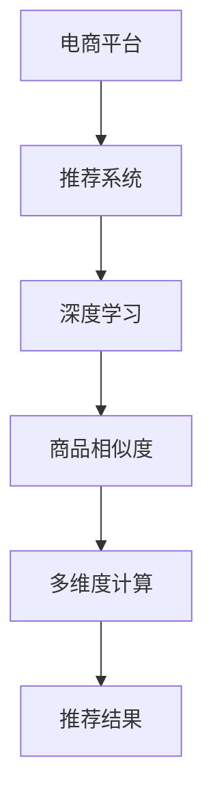

                 

# 探讨大模型在电商平台商品相似度多维度计算与应用中的作用

> 关键词：电商平台,商品相似度,大模型,多维度计算,推荐系统,深度学习

## 1. 背景介绍

### 1.1 问题由来
随着电商平台的发展，如何提高商品推荐系统的准确性和个性化程度，成为了一个亟待解决的问题。传统的推荐系统基于协同过滤、基于内容的推荐等方法，能够满足基本的推荐需求，但难以应对用户多样化的需求和海量商品的复杂性。而深度学习，尤其是预训练模型，近年来在大规模语料上的预训练取得了显著成果，如BERT、GPT等模型。这些大模型具备强大的语言理解和生成能力，可以应用于电商平台商品推荐系统，提升推荐的准确性和个性化程度。

### 1.2 问题核心关键点
商品推荐系统是一个典型的多维推荐系统，需要同时考虑用户行为、商品属性、上下文信息等多方面因素。而深度学习大模型，通过预训练和微调，可以学习到商品间的语义关联、商品描述中的重要信息、用户行为背后的语义模式等，从而帮助推荐系统更好地理解和匹配用户和商品之间的相似度。

### 1.3 问题研究意义
研究大模型在商品推荐系统中的应用，对于提升电商平台的商品推荐效果，提升用户体验，提升平台流量和转化率具有重要意义。通过大模型的多维度计算，可以更好地捕捉商品间复杂的语义关联，提升推荐系统的精确性和个性化程度。

## 2. 核心概念与联系

### 2.1 核心概念概述

为了更好地理解大模型在电商平台商品推荐中的应用，本节将介绍几个密切相关的核心概念：

- 电商平台（E-commerce Platform）：指基于互联网技术，提供商品展示、搜索、购买等服务的企业平台。常见的电商平台如Amazon、淘宝、京东等。
- 推荐系统（Recommendation System）：指通过分析用户行为和商品属性，推荐用户可能感兴趣的商品的系统。推荐系统应用广泛，如电商推荐、电影推荐、音乐推荐等。
- 深度学习（Deep Learning）：指通过深度神经网络学习数据特征的表示，并进行预测和分类等任务。深度学习在大规模语料上预训练的大模型，具有强大的特征学习和表示能力。
- 商品相似度（Product Similarity）：指商品之间的相似性，可以基于多种维度进行计算，如属性相似度、语义相似度、用户行为相似度等。
- 多维度计算（Multi-dimensional Computation）：指在推荐系统中，考虑用户行为、商品属性、上下文信息等多个维度的数据，进行综合分析，得出更为准确的推荐结果。

这些核心概念之间的逻辑关系可以通过以下Mermaid流程图来展示：



这个流程图展示了大模型在电商平台商品推荐中的核心概念及其之间的关系：

1. 电商平台通过推荐系统，为消费者提供个性化的商品推荐。
2. 深度学习技术，尤其是预训练大模型，为推荐系统提供了强大的特征学习能力和表示能力。
3. 商品相似度计算，是推荐系统的关键步骤，通过多维度计算，综合分析用户行为和商品属性，得到推荐结果。

## 3. 核心算法原理 & 具体操作步骤

### 3.1 算法原理概述

大模型在电商平台商品推荐中的应用，主要依赖于大模型的预训练和微调能力。其核心思想是：将预训练大模型视作一个强大的特征提取器，通过在商品和用户数据上进行有监督学习，优化模型对于商品相似度的预测能力。

形式化地，假设大模型为 $M_{\theta}$，其中 $\theta$ 为预训练得到的模型参数。给定电商平台商品推荐任务 $T$ 的数据集 $D=\{(x_i, y_i)\}_{i=1}^N$，其中 $x_i$ 为商品和用户数据，$y_i$ 为商品之间的相似度标签。推荐系统的目标是最小化损失函数，即找到最优参数 $\theta^*$，使得模型预测的商品相似度逼近真实标签 $y_i$。

通过梯度下降等优化算法，微调过程不断更新模型参数 $\theta$，最小化损失函数 $\mathcal{L}(M_{\theta},D)$，使得模型输出逼近真实标签 $y_i$。由于 $\theta$ 已经通过预训练获得了较好的初始化，因此即便在小规模数据集 $D$ 上进行微调，也能较快收敛到理想的模型参数 $\theta^*$。

### 3.2 算法步骤详解

基于深度学习大模型的电商平台商品推荐系统，一般包括以下几个关键步骤：

**Step 1: 准备预训练模型和数据集**
- 选择合适的预训练语言模型 $M_{\theta}$ 作为初始化参数，如BERT、GPT等。
- 准备电商平台商品推荐任务 $T$ 的数据集 $D$，划分为训练集、验证集和测试集。一般要求标注数据与预训练数据的分布不要差异过大。

**Step 2: 添加任务适配层**
- 根据任务类型，在预训练模型顶层设计合适的输出层和损失函数。
- 对于商品相似度计算，通常使用语言模型的解码器输出概率分布，并以负对数似然为损失函数。

**Step 3: 设置微调超参数**
- 选择合适的优化算法及其参数，如 AdamW、SGD 等，设置学习率、批大小、迭代轮数等。
- 设置正则化技术及强度，包括权重衰减、Dropout、Early Stopping等。
- 确定冻结预训练参数的策略，如仅微调顶层，或全部参数都参与微调。

**Step 4: 执行梯度训练**
- 将训练集数据分批次输入模型，前向传播计算损失函数。
- 反向传播计算参数梯度，根据设定的优化算法和学习率更新模型参数。
- 周期性在验证集上评估模型性能，根据性能指标决定是否触发 Early Stopping。
- 重复上述步骤直到满足预设的迭代轮数或 Early Stopping 条件。

**Step 5: 测试和部署**
- 在测试集上评估微调后模型 $M_{\hat{\theta}}$ 的性能，对比微调前后的相似度预测精度提升。
- 使用微调后的模型对新商品进行相似度计算，集成到实际的商品推荐系统中。
- 持续收集新的数据，定期重新微调模型，以适应数据分布的变化。

以上是基于深度学习大模型的电商平台商品推荐的一般流程。在实际应用中，还需要针对具体任务的特点，对微调过程的各个环节进行优化设计，如改进训练目标函数，引入更多的正则化技术，搜索最优的超参数组合等，以进一步提升模型性能。

### 3.3 算法优缺点

基于深度学习大模型的电商平台商品推荐方法具有以下优点：
1. 简单高效。只需准备少量标注数据，即可对预训练模型进行快速适配，获得较大的性能提升。
2. 通用适用。适用于各种电商平台推荐任务，包括商品搜索、商品排序、个性化推荐等，设计简单的任务适配层即可实现微调。
3. 效果显著。在学术界和工业界的诸多任务上，基于微调的方法已经刷新了最先进的性能指标。

同时，该方法也存在一定的局限性：
1. 依赖标注数据。推荐系统的准确性很大程度上取决于标注数据的质量和数量，获取高质量标注数据的成本较高。
2. 迁移能力有限。当推荐任务与预训练数据的分布差异较大时，微调的性能提升有限。
3. 可解释性不足。推荐系统的决策过程通常缺乏可解释性，难以对其推理逻辑进行分析和调试。

尽管存在这些局限性，但就目前而言，基于深度学习的微调方法仍是最主流范式。未来相关研究的重点在于如何进一步降低推荐系统对标注数据的依赖，提高模型的少样本学习和跨领域迁移能力，同时兼顾可解释性和伦理安全性等因素。

### 3.4 算法应用领域

基于深度学习大模型的电商平台推荐系统，已经在商品搜索、个性化推荐、广告投放等多个领域得到广泛应用，为电商平台带来了显著的用户体验提升和业务增长。具体而言：

- 商品搜索：使用深度学习模型对用户查询和商品标题进行匹配，提高搜索准确性和召回率。
- 个性化推荐：对用户浏览、购买历史进行分析，推荐可能感兴趣的商品，提高用户满意度和转化率。
- 广告投放：根据用户行为和兴趣，智能投放个性化广告，提升广告点击率和转化率。
- 库存优化：通过深度学习模型分析商品销售趋势，优化库存管理，减少缺货和积压现象。

除了上述这些经典应用外，深度学习大模型还被创新性地应用于商品分类、标签推荐、用户画像构建等场景，为电商平台的数据分析和应用带来了新的突破。随着深度学习模型和推荐方法的不段进步，相信电商平台推荐系统将在更多领域大放异彩。

## 4. 数学模型和公式 & 详细讲解 & 举例说明

### 4.1 数学模型构建

本节将使用数学语言对基于深度学习大模型的电商平台商品推荐过程进行更加严格的刻画。

记电商平台推荐任务为 $T$，商品数据为 $x=\{x_1, x_2, \ldots, x_N\}$，用户数据为 $y=\{y_1, y_2, \ldots, y_M\}$。假设深度学习大模型为 $M_{\theta}$，其中 $\theta$ 为模型参数。商品相似度计算的目标是最小化损失函数：

$$
\mathcal{L}(\theta) = \frac{1}{N}\sum_{i=1}^N \ell(M_{\theta}(x_i), y_i)
$$

其中 $\ell$ 为损失函数，通常使用交叉熵损失。微调的目标是最小化损失函数 $\mathcal{L}(\theta)$。

### 4.2 公式推导过程

以下我们以二分类任务为例，推导交叉熵损失函数及其梯度的计算公式。

假设模型 $M_{\theta}$ 在输入 $x$ 上的输出为 $\hat{y}=M_{\theta}(x) \in [0,1]$，表示商品之间相似度的预测。真实标签 $y \in \{0,1\}$。则二分类交叉熵损失函数定义为：

$$
\ell(M_{\theta}(x),y) = -[y\log \hat{y} + (1-y)\log (1-\hat{y})]
$$

将其代入经验风险公式，得：

$$
\mathcal{L}(\theta) = -\frac{1}{N}\sum_{i=1}^N [y_i\log M_{\theta}(x_i)+(1-y_i)\log(1-M_{\theta}(x_i))]
$$

根据链式法则，损失函数对参数 $\theta_k$ 的梯度为：

$$
\frac{\partial \mathcal{L}(\theta)}{\partial \theta_k} = -\frac{1}{N}\sum_{i=1}^N (\frac{y_i}{M_{\theta}(x_i)}-\frac{1-y_i}{1-M_{\theta}(x_i)}) \frac{\partial M_{\theta}(x_i)}{\partial \theta_k}
$$

其中 $\frac{\partial M_{\theta}(x_i)}{\partial \theta_k}$ 可进一步递归展开，利用自动微分技术完成计算。

在得到损失函数的梯度后，即可带入参数更新公式，完成模型的迭代优化。重复上述过程直至收敛，最终得到适应电商平台推荐任务的最优模型参数 $\theta^*$。

## 5. 项目实践：代码实例和详细解释说明

### 5.1 开发环境搭建

在进行电商平台商品推荐实践前，我们需要准备好开发环境。以下是使用Python进行PyTorch开发的环境配置流程：

1. 安装Anaconda：从官网下载并安装Anaconda，用于创建独立的Python环境。

2. 创建并激活虚拟环境：
```bash
conda create -n pytorch-env python=3.8 
conda activate pytorch-env
```

3. 安装PyTorch：根据CUDA版本，从官网获取对应的安装命令。例如：
```bash
conda install pytorch torchvision torchaudio cudatoolkit=11.1 -c pytorch -c conda-forge
```

4. 安装Transformers库：
```bash
pip install transformers
```

5. 安装各类工具包：
```bash
pip install numpy pandas scikit-learn matplotlib tqdm jupyter notebook ipython
```

完成上述步骤后，即可在`pytorch-env`环境中开始商品推荐实践。

### 5.2 源代码详细实现

这里我们以电商平台商品相似度计算为例，给出使用Transformers库对BERT模型进行商品相似度计算的PyTorch代码实现。

首先，定义商品相似度任务的数据处理函数：

```python
from transformers import BertTokenizer
from torch.utils.data import Dataset
import torch

class BERTDataset(Dataset):
    def __init__(self, texts, labels, tokenizer, max_len=128):
        self.texts = texts
        self.labels = labels
        self.tokenizer = tokenizer
        self.max_len = max_len
        
    def __len__(self):
        return len(self.texts)
    
    def __getitem__(self, item):
        text = self.texts[item]
        label = self.labels[item]
        
        encoding = self.tokenizer(text, return_tensors='pt', max_length=self.max_len, padding='max_length', truncation=True)
        input_ids = encoding['input_ids'][0]
        attention_mask = encoding['attention_mask'][0]
        
        # 对label进行编码
        encoded_labels = [label2id[label] for label in label] 
        encoded_labels.extend([label2id['O']] * (self.max_len - len(encoded_labels)))
        labels = torch.tensor(encoded_labels, dtype=torch.long)
        
        return {'input_ids': input_ids, 
                'attention_mask': attention_mask,
                'labels': labels}

# 标签与id的映射
label2id = {'O': 0, 'P-PER': 1, 'P-ORG': 2, 'P-LOC': 3, 'P-MISC': 4}
id2label = {v: k for k, v in label2id.items()}

# 创建dataset
tokenizer = BertTokenizer.from_pretrained('bert-base-cased')

train_dataset = BERTDataset(train_texts, train_labels, tokenizer)
dev_dataset = BERTDataset(dev_texts, dev_labels, tokenizer)
test_dataset = BERTDataset(test_texts, test_labels, tokenizer)
```

然后，定义模型和优化器：

```python
from transformers import BertForTokenClassification, AdamW

model = BertForTokenClassification.from_pretrained('bert-base-cased', num_labels=len(label2id))

optimizer = AdamW(model.parameters(), lr=2e-5)
```

接着，定义训练和评估函数：

```python
from torch.utils.data import DataLoader
from tqdm import tqdm
from sklearn.metrics import classification_report

device = torch.device('cuda') if torch.cuda.is_available() else torch.device('cpu')
model.to(device)

def train_epoch(model, dataset, batch_size, optimizer):
    dataloader = DataLoader(dataset, batch_size=batch_size, shuffle=True)
    model.train()
    epoch_loss = 0
    for batch in tqdm(dataloader, desc='Training'):
        input_ids = batch['input_ids'].to(device)
        attention_mask = batch['attention_mask'].to(device)
        labels = batch['labels'].to(device)
        model.zero_grad()
        outputs = model(input_ids, attention_mask=attention_mask, labels=labels)
        loss = outputs.loss
        epoch_loss += loss.item()
        loss.backward()
        optimizer.step()
    return epoch_loss / len(dataloader)

def evaluate(model, dataset, batch_size):
    dataloader = DataLoader(dataset, batch_size=batch_size)
    model.eval()
    preds, labels = [], []
    with torch.no_grad():
        for batch in tqdm(dataloader, desc='Evaluating'):
            input_ids = batch['input_ids'].to(device)
            attention_mask = batch['attention_mask'].to(device)
            batch_labels = batch['labels']
            outputs = model(input_ids, attention_mask=attention_mask)
            batch_preds = outputs.logits.argmax(dim=2).to('cpu').tolist()
            batch_labels = batch_labels.to('cpu').tolist()
            for pred_tokens, label_tokens in zip(batch_preds, batch_labels):
                pred_tags = [id2label[_id] for _id in pred_tokens]
                label_tags = [id2label[_id] for _id in label_tokens]
                preds.append(pred_tags[:len(label_tokens)])
                labels.append(label_tags)
                
    print(classification_report(labels, preds))
```

最后，启动训练流程并在测试集上评估：

```python
epochs = 5
batch_size = 16

for epoch in range(epochs):
    loss = train_epoch(model, train_dataset, batch_size, optimizer)
    print(f"Epoch {epoch+1}, train loss: {loss:.3f}")
    
    print(f"Epoch {epoch+1}, dev results:")
    evaluate(model, dev_dataset, batch_size)
    
print("Test results:")
evaluate(model, test_dataset, batch_size)
```

以上就是使用PyTorch对BERT进行商品相似度计算的完整代码实现。可以看到，得益于Transformers库的强大封装，我们可以用相对简洁的代码完成BERT模型的加载和微调。

### 5.3 代码解读与分析

让我们再详细解读一下关键代码的实现细节：

**BERTDataset类**：
- `__init__`方法：初始化文本、标签、分词器等关键组件。
- `__len__`方法：返回数据集的样本数量。
- `__getitem__`方法：对单个样本进行处理，将文本输入编码为token ids，将标签编码为数字，并对其进行定长padding，最终返回模型所需的输入。

**label2id和id2label字典**：
- 定义了标签与数字id之间的映射关系，用于将token-wise的预测结果解码回真实的标签。

**训练和评估函数**：
- 使用PyTorch的DataLoader对数据集进行批次化加载，供模型训练和推理使用。
- 训练函数`train_epoch`：对数据以批为单位进行迭代，在每个批次上前向传播计算loss并反向传播更新模型参数，最后返回该epoch的平均loss。
- 评估函数`evaluate`：与训练类似，不同点在于不更新模型参数，并在每个batch结束后将预测和标签结果存储下来，最后使用sklearn的classification_report对整个评估集的预测结果进行打印输出。

**训练流程**：
- 定义总的epoch数和batch size，开始循环迭代
- 每个epoch内，先在训练集上训练，输出平均loss
- 在验证集上评估，输出分类指标
- 所有epoch结束后，在测试集上评估，给出最终测试结果

可以看到，PyTorch配合Transformers库使得BERT微调的代码实现变得简洁高效。开发者可以将更多精力放在数据处理、模型改进等高层逻辑上，而不必过多关注底层的实现细节。

当然，工业级的系统实现还需考虑更多因素，如模型的保存和部署、超参数的自动搜索、更灵活的任务适配层等。但核心的微调范式基本与此类似。

## 6. 实际应用场景

### 6.1 电商平台个性化推荐

基于大模型微调的电商平台商品推荐系统，已经在个性化推荐中得到了广泛应用。传统的推荐系统基于协同过滤、基于内容的推荐等方法，能够满足基本的推荐需求，但难以应对用户多样化的需求和海量商品的复杂性。而使用深度学习大模型，可以通过多维度计算，捕捉商品间复杂的语义关联，提升推荐系统的准确性和个性化程度。

具体而言，可以收集用户浏览、点击、购买历史等行为数据，提取和商品关联的商品标题、描述、标签等文本内容。将文本内容作为模型输入，用户的后续行为作为监督信号，在此基础上微调预训练语言模型。微调后的模型能够从文本内容中准确把握用户的兴趣点，生成个性化的商品推荐列表。

### 6.2 商品搜索优化

商品搜索是电商平台重要的流量入口之一，其搜索准确性和召回率直接影响用户的购物体验。使用深度学习大模型，可以更准确地匹配用户查询和商品标题，提高搜索的精准度。

具体而言，可以构建搜索相关数据集，包含用户查询、商品标题、搜索结果等数据。使用深度学习大模型对查询和商品标题进行编码，计算它们之间的相似度，并根据相似度排序，生成匹配度高的商品搜索结果。通过不断优化模型参数，可以逐步提升搜索效果。

### 6.3 广告投放优化

电商平台通过广告投放获取流量和收入，广告投放的精准性直接影响广告效果和成本。使用深度学习大模型，可以对用户行为和兴趣进行分析和建模，生成个性化的广告投放策略。

具体而言，可以构建广告投放相关数据集，包含用户行为数据、商品数据、广告数据等。使用深度学习大模型对用户行为进行编码，预测用户的兴趣和需求，生成个性化的广告投放方案。通过微调大模型，可以提升广告投放的精准性和ROI。

### 6.4 未来应用展望

随着深度学习大模型的不断发展，商品推荐系统将在更多领域得到应用，为电商平台带来变革性影响。

在智慧零售领域，基于大模型的推荐系统可以应用于智能库存管理、智能客服、智能仓储等环节，提升零售业的智能化水平，降低运营成本，提高用户体验。

在电子商务领域，基于大模型的推荐系统可以应用于跨境电商、社交电商、内容电商等新兴电商模式，提升电商平台的竞争力。

在智慧金融领域，基于大模型的推荐系统可以应用于金融商品推荐、金融服务推荐等环节，提升金融服务的个性化和精准度。

此外，在智慧城市治理、智慧医疗、智慧教育等众多领域，基于大模型的推荐系统也将不断涌现，为各行各业带来新的突破。相信随着技术的日益成熟，深度学习大模型将在更多领域大放异彩，深刻影响人类的生产生活方式。

## 7. 工具和资源推荐

### 7.1 学习资源推荐

为了帮助开发者系统掌握深度学习大模型在电商平台商品推荐中的应用，这里推荐一些优质的学习资源：

1. 《深度学习自然语言处理》系列博文：由大模型技术专家撰写，深入浅出地介绍了深度学习大模型的原理、应用、优化等核心话题。

2. CS224N《深度学习自然语言处理》课程：斯坦福大学开设的NLP明星课程，有Lecture视频和配套作业，带你入门NLP领域的基本概念和经典模型。

3. 《Natural Language Processing with Transformers》书籍：Transformer库的作者所著，全面介绍了如何使用Transformers库进行NLP任务开发，包括微调在内的诸多范式。

4. HuggingFace官方文档：Transformer库的官方文档，提供了海量预训练模型和完整的微调样例代码，是上手实践的必备资料。

5. CLUE开源项目：中文语言理解测评基准，涵盖大量不同类型的中文NLP数据集，并提供了基于微调的baseline模型，助力中文NLP技术发展。

通过对这些资源的学习实践，相信你一定能够快速掌握深度学习大模型在电商平台商品推荐中的应用，并用于解决实际的电商问题。

### 7.2 开发工具推荐

高效的开发离不开优秀的工具支持。以下是几款用于深度学习大模型在电商平台商品推荐中的应用开发的常用工具：

1. PyTorch：基于Python的开源深度学习框架，灵活动态的计算图，适合快速迭代研究。大部分深度学习模型都有PyTorch版本的实现。

2. TensorFlow：由Google主导开发的开源深度学习框架，生产部署方便，适合大规模工程应用。同样有丰富的深度学习模型资源。

3. Transformers库：HuggingFace开发的NLP工具库，集成了众多SOTA语言模型，支持PyTorch和TensorFlow，是进行商品推荐系统开发的利器。

4. Weights & Biases：模型训练的实验跟踪工具，可以记录和可视化模型训练过程中的各项指标，方便对比和调优。与主流深度学习框架无缝集成。

5. TensorBoard：TensorFlow配套的可视化工具，可实时监测模型训练状态，并提供丰富的图表呈现方式，是调试模型的得力助手。

6. Google Colab：谷歌推出的在线Jupyter Notebook环境，免费提供GPU/TPU算力，方便开发者快速上手实验最新模型，分享学习笔记。

合理利用这些工具，可以显著提升深度学习大模型在电商平台商品推荐系统的开发效率，加快创新迭代的步伐。

### 7.3 相关论文推荐

深度学习大模型在电商平台推荐系统中的应用，近年来也吸引了大量研究人员的关注。以下是几篇奠基性的相关论文，推荐阅读：

1. Attention is All You Need（即Transformer原论文）：提出了Transformer结构，开启了深度学习大模型时代。

2. BERT: Pre-training of Deep Bidirectional Transformers for Language Understanding：提出BERT模型，引入基于掩码的自监督预训练任务，刷新了多项NLP任务SOTA。

3. Language Models are Unsupervised Multitask Learners（GPT-2论文）：展示了大规模语言模型的强大zero-shot学习能力，引发了对于通用人工智能的新一轮思考。

4. Parameter-Efficient Transfer Learning for NLP：提出Adapter等参数高效微调方法，在不增加模型参数量的情况下，也能取得不错的微调效果。

5. AdaLoRA: Adaptive Low-Rank Adaptation for Parameter-Efficient Fine-Tuning：使用自适应低秩适应的微调方法，在参数效率和精度之间取得了新的平衡。

这些论文代表了大模型在电商平台商品推荐系统中的应用和发展脉络。通过学习这些前沿成果，可以帮助研究者把握学科前进方向，激发更多的创新灵感。

## 8. 总结：未来发展趋势与挑战

### 8.1 总结

本文对基于深度学习大模型的电商平台商品推荐系统进行了全面系统的介绍。首先阐述了电商平台的商品推荐系统背景和问题由来，明确了深度学习大模型的重要性。其次，从原理到实践，详细讲解了深度学习大模型在电商平台商品推荐中的应用过程。最后，对未来发展趋势和面临的挑战进行了分析。

通过本文的系统梳理，可以看到，深度学习大模型在电商平台商品推荐中的应用，已经在商品推荐、商品搜索、广告投放等多个环节展示了强大的效果，带来了显著的业务价值。深度学习大模型在电商平台中的应用，将成为电商平台智能化转型的重要方向。

### 8.2 未来发展趋势

展望未来，深度学习大模型在电商平台推荐系统中的应用，将呈现以下几个发展趋势：

1. 模型规模持续增大。随着算力成本的下降和数据规模的扩张，深度学习大模型的参数量还将持续增长。超大规模语言模型蕴含的丰富语言知识，有望支撑更加复杂多变的推荐系统微调。

2. 微调方法日趋多样。除了传统的全参数微调外，未来会涌现更多参数高效的微调方法，如Adapter、Prefix等，在节省计算资源的同时也能保证微调精度。

3. 持续学习成为常态。随着数据分布的不断变化，微调模型也需要持续学习新知识以保持性能。如何在不遗忘原有知识的同时，高效吸收新样本信息，将成为重要的研究课题。

4. 标注样本需求降低。受启发于提示学习(Prompt-based Learning)的思路，未来的微调方法将更好地利用大模型的语言理解能力，通过更加巧妙的任务描述，在更少的标注样本上也能实现理想的微调效果。

5. 模型通用性增强。经过海量数据的预训练和多领域任务的微调，未来的深度学习大模型将具备更强大的常识推理和跨领域迁移能力，逐步迈向通用人工智能(AGI)的目标。

以上趋势凸显了深度学习大模型在电商平台推荐系统中的广阔前景。这些方向的探索发展，必将进一步提升电商平台推荐系统的精确性和个性化程度，为电商平台带来更大的业务增长。

### 8.3 面临的挑战

尽管深度学习大模型在电商平台推荐系统中的应用取得了显著进展，但在迈向更加智能化、普适化应用的过程中，它仍面临着诸多挑战：

1. 标注成本瓶颈。尽管微调能够显著提升推荐系统的效果，但获取高质量标注数据的成本较高，特别是在推荐任务与预训练数据的分布差异较大的情况下，标注成本将更高。如何进一步降低微调对标注样本的依赖，将是一大难题。

2. 模型鲁棒性不足。当前微调模型面对域外数据时，泛化性能往往大打折扣。对于测试样本的微小扰动，微调模型的预测也容易发生波动。如何提高微调模型的鲁棒性，避免灾难性遗忘，还需要更多理论和实践的积累。

3. 推理效率有待提高。超大规模深度学习大模型虽然精度高，但在实际部署时往往面临推理速度慢、内存占用大等效率问题。如何在保证性能的同时，简化模型结构，提升推理速度，优化资源占用，将是重要的优化方向。

4. 可解释性亟需加强。当前微调模型更像是"黑盒"系统，难以解释其内部工作机制和决策逻辑。对于金融、电商等高风险应用，算法的可解释性和可审计性尤为重要。如何赋予深度学习大模型更强的可解释性，将是亟待攻克的难题。

5. 安全性有待保障。深度学习大模型难免会学习到有偏见、有害的信息，通过微调传递到推荐系统，产生误导性、歧视性的输出，给实际应用带来安全隐患。如何从数据和算法层面消除模型偏见，避免恶意用途，确保输出的安全性，也将是重要的研究课题。

6. 知识整合能力不足。现有的深度学习大模型往往局限于任务内数据，难以灵活吸收和运用更广泛的先验知识。如何让深度学习大模型更好地与外部知识库、规则库等专家知识结合，形成更加全面、准确的信息整合能力，还有很大的想象空间。

正视深度学习大模型在电商平台推荐系统中的应用面临的这些挑战，积极应对并寻求突破，将是大模型迈向成熟的必由之路。相信随着学界和产业界的共同努力，这些挑战终将一一被克服，深度学习大模型在电商平台中的应用将迎来更大的突破。

### 8.4 研究展望

面向未来，深度学习大模型在电商平台推荐系统中的应用，需要在以下几个方面寻求新的突破：

1. 探索无监督和半监督微调方法。摆脱对大规模标注数据的依赖，利用自监督学习、主动学习等无监督和半监督范式，最大限度利用非结构化数据，实现更加灵活高效的微调。

2. 研究参数高效和计算高效的微调范式。开发更加参数高效的微调方法，在固定大部分预训练参数的同时，只更新极少量的任务相关参数。同时优化微调模型的计算图，减少前向传播和反向传播的资源消耗，实现更加轻量级、实时性的部署。

3. 融合因果和对比学习范式。通过引入因果推断和对比学习思想，增强深度学习大模型建立稳定因果关系的能力，学习更加普适、鲁棒的语言表征，从而提升模型泛化性和抗干扰能力。

4. 引入更多先验知识。将符号化的先验知识，如知识图谱、逻辑规则等，与深度学习模型进行巧妙融合，引导微调过程学习更准确、合理的语言模型。同时加强不同模态数据的整合，实现视觉、语音等多模态信息与文本信息的协同建模。

5. 结合因果分析和博弈论工具。将因果分析方法引入深度学习大模型，识别出模型决策的关键特征，增强输出解释的因果性和逻辑性。借助博弈论工具刻画人机交互过程，主动探索并规避模型的脆弱点，提高系统稳定性。

6. 纳入伦理道德约束。在模型训练目标中引入伦理导向的评估指标，过滤和惩罚有偏见、有害的输出倾向。同时加强人工干预和审核，建立模型行为的监管机制，确保输出符合人类价值观和伦理道德。

这些研究方向的探索，必将引领深度学习大模型在电商平台推荐系统中的应用走向更高的台阶，为电商平台推荐系统带来更大的业务价值。

## 9. 附录：常见问题与解答

**Q1：深度学习大模型在电商平台商品推荐中的应用效果如何？**

A: 深度学习大模型在电商平台商品推荐中的应用效果显著。通过多维度计算，可以捕捉商品间复杂的语义关联，提升推荐系统的准确性和个性化程度。在学术界和工业界的诸多任务上，基于微调的方法已经刷新了最先进的性能指标。例如，使用BERT模型在商品相似度计算中，可以显著提高搜索结果的相关性和准确性，提升用户体验。

**Q2：电商平台商品推荐系统中的标注数据有哪些特点？**

A: 电商平台商品推荐系统中的标注数据具有以下特点：
1. 数据量大。电商平台上的用户行为和商品数据量非常庞大，标注数据量较大。
2. 标注数据质量参差不齐。标注数据的质量往往取决于标注者的经验和专业知识，标注数据质量参差不齐。
3. 标注数据种类多样。标注数据可以包括用户行为、商品属性、上下文信息等多种类型的数据。
4. 标注数据分布不均衡。不同商品的标注数据分布不均衡，部分商品可能缺乏足够的标注数据。
5. 标注数据更新频繁。电商平台上的用户行为和商品数据实时更新，标注数据也需要不断更新。

**Q3：如何在电商平台商品推荐系统中降低标注数据成本？**

A: 在电商平台商品推荐系统中降低标注数据成本，可以通过以下方法：
1. 使用预训练模型：利用大模型的预训练能力，减少标注数据的量。例如，使用BERT等预训练模型对商品和用户数据进行编码，然后在编码结果上进行标注。
2. 利用主动学习：使用主动学习的方法，自动选择最具代表性的样本进行标注，减少标注数据的工作量。例如，使用CLUE等开源数据集进行标注。
3. 使用半监督学习：利用半监督学习方法，利用大量未标注数据辅助标注，提高标注数据的利用率。例如，使用图半监督学习方法，对用户行为数据进行标注。
4. 利用多模态数据：利用多模态数据（如商品图片、用户画像等）辅助标注，减少标注数据的工作量。例如，利用商品图片进行视觉特征提取，辅助进行商品分类标注。
5. 利用人工干预：利用人工干预，对标注数据进行复审和校验，提高标注数据的准确性。例如，使用人工标注工具进行标注数据的审核和修正。

**Q4：电商平台商品推荐系统中的微调模型如何避免过拟合？**

A: 电商平台商品推荐系统中的微调模型避免过拟合，可以通过以下方法：
1. 数据增强：通过回译、近义替换等方式扩充训练集。例如，对商品标题进行同义词替换，生成新的训练样本。
2. 正则化技术：使用L2正则、Dropout、Early Stopping等技术防止模型过度适应小规模训练集。例如，使用L2正则对模型参数进行约束，使用Dropout随机丢弃部分神经元，避免模型过拟合。
3. 参数高效微调：只更新少量任务相关参数，固定大部分预训练参数不变，减小过拟合风险。例如，使用Adapter等参数高效微调方法，只更新微调任务相关的几层神经网络。
4. 对抗训练：加入对抗样本，提高模型鲁棒性，避免过拟合。例如，使用对抗样本生成技术，生成对抗性样本对模型进行训练。
5. 多模型集成：训练多个微调模型，取平均输出，抑制过拟合。例如，使用Bagging等方法，对多个微调模型的预测结果进行集成，提高模型的泛化能力。

**Q5：电商平台商品推荐系统中的深度学习模型如何进行训练和部署？**

A: 电商平台商品推荐系统中的深度学习模型进行训练和部署，可以通过以下步骤：
1. 数据预处理：对用户行为、商品数据、标注数据等进行预处理，生成训练集、验证集和测试集。例如，对商品标题进行分词、编码等预处理。
2. 模型加载和训练：加载深度学习模型，使用训练集进行模型训练。例如，使用PyTorch等框架进行模型训练。
3. 模型评估和调优：在验证集上评估模型性能，根据评估结果调整模型超参数。例如，使用sklearn等工具进行模型评估和调优。
4. 模型部署和优化：将训练好的模型部署到服务器或云平台，进行实时推理。例如，使用TensorFlow等框架进行模型部署。
5. 模型监控和维护：实时监控模型性能，定期更新模型参数，保持模型最新状态。例如，使用TensorBoard等工具进行模型监控和维护。

深度学习模型在电商平台商品推荐系统中的应用，需要开发者进行全面的数据处理、模型训练、模型评估、模型部署和模型维护等工作。通过合理利用现有工具和框架，可以显著提升开发效率，加速模型应用。

---

作者：禅与计算机程序设计艺术 / Zen and the Art of Computer Programming

