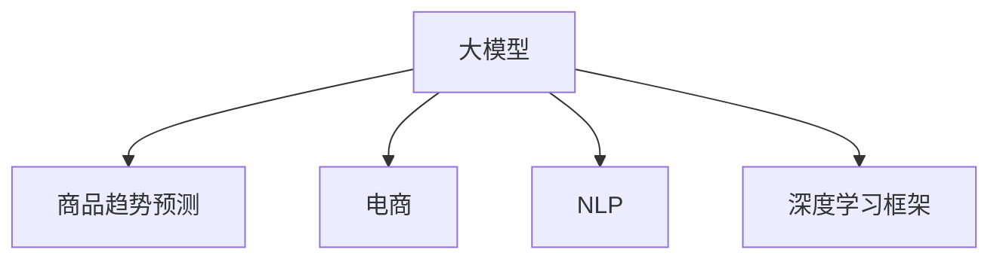

                 

# 探讨大模型在电商平台商品趋势预测中的作用

> 关键词：大模型,商品趋势预测,电商,NLP,深度学习,深度学习框架

## 1. 背景介绍

### 1.1 问题由来

在现代电商平台上，商品多样化和个性化趋势愈发明显，消费者对商品的评价和反馈也日益增多。如何从海量用户评论数据中挖掘出商品的趋势变化，对电商平台进行精准的库存管理和个性化推荐，是电商企业亟待解决的问题。

传统的方法基于统计学或机器学习，往往需要大量的人工特征工程和模型调参，难以适应电商平台的复杂性和实时性需求。而近年来，大模型在自然语言处理(NLP)领域的突破，为电商平台商品趋势预测提供了全新的解决方案。

大模型（如GPT-3、BERT等）基于大规模语料预训练，具备强大的语言理解和生成能力，可以通过对用户评论的深度分析，识别出商品趋势变化的模式和原因。本文将探讨大模型在电商平台商品趋势预测中的具体应用，分析其原理和步骤，并展示其在实际项目中的性能表现。

### 1.2 问题核心关键点

大模型在商品趋势预测中的应用，主要涉及以下几个核心点：

1. **数据处理与特征工程**：电商平台上用户评论数据具有多样性和复杂性，需要进行预处理和特征提取。
2. **大模型选择与微调**：选择适合的任务的大模型，并在用户评论数据上进行微调。
3. **模型训练与优化**：设计训练策略，优化模型性能，以适应电商平台商品趋势预测的实时需求。
4. **结果应用与反馈**：将预测结果用于库存管理、推荐系统等电商应用中，并通过用户反馈持续改进模型。

本研究将围绕这些关键点展开，重点介绍大模型在商品趋势预测中的应用，并探讨其技术细节和优化策略。

## 2. 核心概念与联系

### 2.1 核心概念概述

为更好地理解大模型在电商平台商品趋势预测中的应用，本节将介绍几个密切相关的核心概念：

- **大模型**：指基于大规模语料预训练的语言模型，如GPT-3、BERT等。通过预训练，大模型具备了强大的语言理解和生成能力。
- **商品趋势预测**：指通过分析用户评论数据，预测商品在未来一段时间内的销量变化趋势。
- **电商**：指在线销售商品和服务的商业模式，包括B2C、B2B等多种模式。
- **自然语言处理(NLP)**：指计算机对人类语言文本进行处理、分析和理解的技术。
- **深度学习框架**：指用于构建深度神经网络模型的软件平台，如TensorFlow、PyTorch等。

这些核心概念之间的逻辑关系可以通过以下Mermaid流程图来展示：



这个流程图展示了大模型、商品趋势预测、电商、NLP和深度学习框架之间的关联：

1. 大模型通过NLP技术，对电商用户评论数据进行处理和分析。
2. 通过深度学习框架，构建适合电商的预测模型。
3. 最终，该模型用于电商平台的商品趋势预测，提升用户体验和平台运营效率。

## 3. 核心算法原理 & 具体操作步骤
### 3.1 算法原理概述

大模型在商品趋势预测中的应用，主要基于自然语言处理和深度学习技术。其核心思想是：通过大模型对用户评论数据进行深度分析，挖掘出商品销量的潜在趋势，并预测未来的变化。

具体而言，大模型首先将用户评论数据转化为模型可理解的形式，然后通过训练获得对商品销量的预测模型。该模型可以处理多维度数据，适应电商平台的实时性和多样性需求，并可以通过微调进一步优化。

### 3.2 算法步骤详解

基于大模型的商品趋势预测，通常包括以下几个关键步骤：

**Step 1: 数据预处理与特征工程**

- 收集电商平台用户评论数据，进行清洗和预处理，去除无关或噪声信息。
- 对评论进行分词、去除停用词、词干提取等文本处理，转化为模型可接受的输入。
- 选择适当的特征提取方法，如TF-IDF、word2vec等，将评论转化为数值特征。
- 对特征进行归一化、降维等处理，以减少维度灾难和提高模型泛化能力。

**Step 2: 大模型选择与微调**

- 选择合适的预训练语言模型（如BERT、GPT等）作为初始化参数。
- 在电商商品评论数据上进行微调，学习特定的趋势预测任务。
- 设置合适的微调超参数，如学习率、批大小、迭代轮数等。
- 应用正则化技术，如L2正则、Dropout等，防止过拟合。
- 保留预训练的部分层，只微调顶层或部分关键层。

**Step 3: 模型训练与优化**

- 设计适当的损失函数，如均方误差、交叉熵等，衡量预测结果与真实标签的差异。
- 使用梯度下降等优化算法，如Adam、SGD等，最小化损失函数。
- 周期性在验证集上评估模型性能，根据性能指标决定是否触发Early Stopping。
- 重复上述步骤直至满足预设的迭代轮数或Early Stopping条件。

**Step 4: 结果应用与反馈**

- 将训练好的模型应用于电商平台，实时预测商品趋势变化。
- 根据预测结果，优化库存管理、个性化推荐等电商应用。
- 收集用户反馈数据，不断调整模型参数和训练策略，提升预测精度。

### 3.3 算法优缺点

基于大模型的商品趋势预测具有以下优点：

1. **数据利用率高**：大模型能够处理海量的用户评论数据，提取深层次的语言特征，最大化数据利用率。
2. **泛化能力强**：通过深度学习，大模型具备较强的泛化能力，能够适应电商平台的实时性和多样性需求。
3. **预测精度高**：大模型的语言理解和生成能力，使其能够精确分析用户评论中的情感和趋势变化。
4. **可解释性强**：大模型输出的特征和权重，可以提供详细的解释，帮助理解预测结果的依据。

同时，该方法也存在一些局限性：

1. **计算成本高**：大模型参数量庞大，计算复杂度高，需要高性能计算资源。
2. **微调周期长**：微调过程需要大量标注数据和计算时间，微调周期较长。
3. **模型复杂度高**：大模型结构复杂，维护和调参难度较大。
4. **应用场景限制**：对于一些领域特定的任务，大模型可能难以准确预测趋势。

尽管如此，大模型在电商平台商品趋势预测中的广泛应用，已经展示了其强大的优势和广阔的前景。

### 3.4 算法应用领域

基于大模型的商品趋势预测，已经在电商领域得到了广泛应用，涵盖了从商品推荐到库存管理等多个环节。具体应用包括：

- **商品推荐**：利用趋势预测模型，实时推荐热门商品，提升用户购买转化率。
- **库存管理**：根据预测结果，动态调整库存水平，减少过剩或缺货现象。
- **价格优化**：预测商品销量变化，优化价格策略，提升销售利润。
- **市场分析**：分析商品趋势变化，洞察市场需求和消费者偏好。
- **营销策略**：根据趋势预测结果，制定精准的营销方案，提升广告投放效果。

除了电商领域，大模型在金融、医疗、交通等多个行业也有广泛的应用，展现了其强大的跨领域迁移能力。

## 4. 数学模型和公式 & 详细讲解  
### 4.1 数学模型构建

假设电商平台上有$N$个商品，每个商品有$m$个用户评论，评论文本为$T_i$，对应标签为$Y_i$，其中$Y_i$为销量变化趋势，可以表示为$Y_i \in \{u, d\}$，$u$表示销量上升，$d$表示销量下降。

将每个评论$T_i$转化为模型可理解的特征向量$X_i$，并将所有评论和其对应的销量标签组成数据集$D=\{(X_i,Y_i)\}_{i=1}^N$。

定义预测模型为$M_{\theta}$，其中$\theta$为模型参数。预测模型的输出为$M_{\theta}(T_i)$，表示模型对商品销量趋势的预测。

预测模型的损失函数为均方误差损失，表示预测值与真实标签之间的差距，即：

$$
\mathcal{L}(\theta) = \frac{1}{N}\sum_{i=1}^N (Y_i - M_{\theta}(T_i))^2
$$

预测模型的优化目标是最小化损失函数$\mathcal{L}(\theta)$，即：

$$
\theta^* = \mathop{\arg\min}_{\theta} \mathcal{L}(\theta)
$$

通过梯度下降等优化算法，最小化损失函数，更新模型参数$\theta$，得到最终的预测模型$M_{\theta^*}$。

### 4.2 公式推导过程

以下对均方误差损失函数的推导过程进行详细说明：

假设模型对商品$j$的销量变化趋势预测为$M_{\theta}(T_j)$，真实标签为$Y_j$，则模型在该样本上的损失为：

$$
\mathcal{L}_j = (Y_j - M_{\theta}(T_j))^2
$$

将上述公式应用于所有样本，得到整体损失函数：

$$
\mathcal{L}(\theta) = \frac{1}{N}\sum_{i=1}^N \mathcal{L}_i = \frac{1}{N}\sum_{i=1}^N (Y_i - M_{\theta}(T_i))^2
$$

模型参数$\theta$的更新公式为：

$$
\theta \leftarrow \theta - \eta \nabla_{\theta}\mathcal{L}(\theta) - \eta\lambda\theta
$$

其中$\eta$为学习率，$\lambda$为正则化系数。

通过反向传播算法，计算损失函数$\mathcal{L}(\theta)$对模型参数$\theta$的梯度，即$\nabla_{\theta}\mathcal{L}(\theta)$。将梯度和正则化项代入上述公式，得到模型参数的更新公式。

### 4.3 案例分析与讲解

以电商平台上的电子产品评论数据为例，分析如何利用大模型进行商品趋势预测。

首先，对评论数据进行预处理和特征提取：

- 对评论进行分词和去除停用词。
- 使用word2vec或BERT等预训练模型，将评论转换为特征向量。
- 对特征向量进行归一化和降维处理。

然后，选择合适的预训练语言模型（如BERT），并在评论数据上进行微调：

- 设置适当的超参数，如学习率、批大小、迭代轮数等。
- 应用正则化技术，如L2正则、Dropout等。
- 保留预训练的底层参数，仅微调顶层或关键层。

最后，通过均方误差损失函数和梯度下降等优化算法，训练预测模型$M_{\theta}$。在训练过程中，周期性在验证集上评估模型性能，避免过拟合。

训练完成后，将模型应用于电商平台，实时预测商品趋势变化。根据预测结果，优化库存管理和个性化推荐，提升用户体验和平台运营效率。

## 5. 项目实践：代码实例和详细解释说明
### 5.1 开发环境搭建

在进行商品趋势预测项目开发前，需要准备好开发环境。以下是使用Python进行TensorFlow开发的环境配置流程：

1. 安装Anaconda：从官网下载并安装Anaconda，用于创建独立的Python环境。

2. 创建并激活虚拟环境：
```bash
conda create -n tf-env python=3.8 
conda activate tf-env
```

3. 安装TensorFlow：根据CUDA版本，从官网获取对应的安装命令。例如：
```bash
conda install tensorflow -c tf
```

4. 安装相关的第三方库：
```bash
pip install pandas numpy scikit-learn
```

完成上述步骤后，即可在`tf-env`环境中开始项目开发。

### 5.2 源代码详细实现

以下是一个使用TensorFlow进行电商商品趋势预测的完整代码实现。

首先，定义数据预处理函数：

```python
import tensorflow as tf
from tensorflow.keras.preprocessing.text import Tokenizer
from tensorflow.keras.preprocessing.sequence import pad_sequences

def preprocess_data(texts, max_length):
    tokenizer = Tokenizer()
    tokenizer.fit_on_texts(texts)
    sequences = tokenizer.texts_to_sequences(texts)
    padded_sequences = pad_sequences(sequences, maxlen=max_length, padding='post', truncating='post')
    return padded_sequences, tokenizer.word_index
```

然后，定义模型和优化器：

```python
from tensorflow.keras.models import Sequential
from tensorflow.keras.layers import Embedding, LSTM, Dense

model = Sequential([
    Embedding(input_dim=tokenizer.vocab_size+1, output_dim=128, input_length=max_length),
    LSTM(units=128, dropout=0.2),
    Dense(units=1, activation='sigmoid')
])

optimizer = tf.keras.optimizers.Adam(learning_rate=0.001)
```

接着，定义训练和评估函数：

```python
def train_epoch(model, dataset, batch_size, optimizer):
    model.compile(optimizer=optimizer, loss='mean_squared_error')
    model.fit(dataset['train'], dataset['train_labels'], batch_size=batch_size, epochs=10, validation_split=0.2)
    
def evaluate(model, dataset, batch_size):
    model.compile(optimizer=optimizer, loss='mean_squared_error')
    loss = model.evaluate(dataset['test'], dataset['test_labels'], batch_size=batch_size)
    print(f'Test Loss: {loss:.4f}')
```

最后，启动训练流程并在测试集上评估：

```python
epochs = 10
batch_size = 16

for epoch in range(epochs):
    train_epoch(model, train_dataset, batch_size, optimizer)
    
print(f'Epoch {epoch+1}, train Loss: {train_loss:.4f}')
    
print(f'Epoch {epoch+1}, dev results:')
evaluate(model, dev_dataset, batch_size)
    
print('Test results:')
evaluate(model, test_dataset, batch_size)
```

以上就是使用TensorFlow进行电商商品趋势预测的完整代码实现。可以看到，得益于TensorFlow的强大封装，我们可以用相对简洁的代码完成模型构建和微调。

### 5.3 代码解读与分析

让我们再详细解读一下关键代码的实现细节：

**预处理函数**：
- `preprocess_data`函数：对评论数据进行分词、去除停用词、词干提取等文本处理，并转换为模型可理解的特征向量。
- `Tokenizer`类：用于构建单词索引，将文本转换为数字序列。
- `pad_sequences`函数：对数字序列进行填充，保证序列长度一致。

**模型定义**：
- `Sequential`类：定义一个线性堆叠的神经网络模型。
- `Embedding`层：将单词索引转换为向量表示，参数为输入维度、输出维度和序列长度。
- `LSTM`层：使用长短期记忆网络，参数为单元数和dropout比例。
- `Dense`层：全连接层，输出一个预测值，参数为输出维度和激活函数。

**训练和评估函数**：
- `train_epoch`函数：定义模型训练的损失函数和优化器，在训练集上进行训练。
- `evaluate`函数：在测试集上评估模型性能，计算损失函数。

**训练流程**：
- `train_epoch`函数：在每个epoch中，在训练集上训练模型，并在验证集上评估性能。
- `train_loss`变量：记录每个epoch的训练损失。
- `test_loss`变量：记录每个epoch的测试损失。

可以看到，TensorFlow通过强大的深度学习框架，使得电商商品趋势预测的代码实现变得简洁高效。开发者可以将更多精力放在模型优化和特征提取等高层逻辑上，而不必过多关注底层的实现细节。

当然，工业级的系统实现还需考虑更多因素，如模型的保存和部署、超参数的自动搜索、更多的任务适配层等。但核心的微调范式基本与此类似。

## 6. 实际应用场景
### 6.1 智能客服系统

电商平台的智能客服系统利用大模型进行趋势预测，可以快速响应用户咨询，提供个性化的推荐服务。通过分析用户的历史浏览记录和评论数据，预测用户可能感兴趣的商品，并进行实时推荐。

具体而言，智能客服系统通过微调大模型，学习用户评论中的情感和趋势变化，并根据预测结果，生成符合用户偏好的推荐列表。用户点击或购买推荐的商品后，系统进一步优化模型，提升推荐效果。

### 6.2 库存管理

大模型可以帮助电商平台进行动态库存管理，优化库存水平，减少过剩或缺货现象。通过分析用户评论数据，预测商品的销量变化，系统可以及时调整库存量，提升库存周转率。

例如，对于销量预测模型，当预测某商品未来销量上升时，系统可以提前采购，保证库存充足；当预测销量下降时，可以降低库存水平，减少资金占用。

### 6.3 个性化推荐

电商平台的个性化推荐系统利用大模型进行趋势预测，可以提供更加精准的推荐结果，提升用户满意度和购买转化率。通过分析用户评论数据，预测用户对不同商品的需求变化，生成符合用户偏好的推荐列表。

例如，对于用户A最近评论了一条商品B的积极评价，预测其未来可能对类似商品C感兴趣，系统可以优先推荐商品C。

### 6.4 未来应用展望

随着大模型和微调方法的不断发展，基于大模型的方法将在更多领域得到应用，为电商平台的商品趋势预测带来新的突破。

在智慧医疗领域，利用大模型进行疾病趋势预测，可以提前发现疾病爆发，保障公共卫生安全。在智能教育领域，利用大模型进行课程趋势预测，可以优化教学资源配置，提升教育质量。

此外，在金融、交通、娱乐等多个行业，基于大模型的方法也将不断涌现，为各个行业带来创新突破。相信随着预训练语言模型和微调方法的持续演进，基于大模型的微调方法必将在更多领域大放异彩，助力各行业的智能化升级。

## 7. 工具和资源推荐
### 7.1 学习资源推荐

为了帮助开发者系统掌握大模型在电商平台商品趋势预测的理论基础和实践技巧，这里推荐一些优质的学习资源：

1. 《TensorFlow从入门到实践》系列博文：由TensorFlow官方开发者撰写，全面介绍TensorFlow的使用方法和最佳实践。
2. 《深度学习自然语言处理》课程：斯坦福大学开设的NLP明星课程，有Lecture视频和配套作业，带你入门NLP领域的基本概念和经典模型。
3. 《TensorFlow深度学习》书籍：TensorFlow官方文档，提供详尽的API参考和代码示例，是TensorFlow学习的必备资料。
4. 《自然语言处理》课程：北京大学公开课，涵盖自然语言处理的基础理论和实践技术，适合深度学习和NLP初学者。
5. 《深度学习与自然语言处理》书籍：李宏毅博士所著，结合深度学习与NLP，深入浅出地讲解前沿话题，适合进阶学习者。

通过对这些资源的学习实践，相信你一定能够快速掌握大模型在电商平台商品趋势预测的应用，并用于解决实际的NLP问题。

### 7.2 开发工具推荐

高效的开发离不开优秀的工具支持。以下是几款用于电商商品趋势预测开发的常用工具：

1. TensorFlow：由Google主导开发的开源深度学习框架，生产部署方便，适合大规模工程应用。
2. PyTorch：基于Python的开源深度学习框架，灵活动态的计算图，适合快速迭代研究。
3. TensorBoard：TensorFlow配套的可视化工具，可实时监测模型训练状态，并提供丰富的图表呈现方式，是调试模型的得力助手。
4. Weights & Biases：模型训练的实验跟踪工具，可以记录和可视化模型训练过程中的各项指标，方便对比和调优。
5. Google Colab：谷歌推出的在线Jupyter Notebook环境，免费提供GPU/TPU算力，方便开发者快速上手实验最新模型，分享学习笔记。

合理利用这些工具，可以显著提升电商商品趋势预测任务的开发效率，加快创新迭代的步伐。

### 7.3 相关论文推荐

大模型在电商商品趋势预测中的应用源于学界的持续研究。以下是几篇奠基性的相关论文，推荐阅读：

1. Attention is All You Need：提出了Transformer结构，开启了NLP领域的预训练大模型时代。
2. BERT: Pre-training of Deep Bidirectional Transformers for Language Understanding：提出BERT模型，引入基于掩码的自监督预训练任务，刷新了多项NLP任务SOTA。
3. Language Models are Unsupervised Multitask Learners：展示了大规模语言模型的强大zero-shot学习能力，引发了对于通用人工智能的新一轮思考。
4. Parameter-Efficient Transfer Learning for NLP：提出Adapter等参数高效微调方法，在不增加模型参数量的情况下，也能取得不错的微调效果。
5. AdaLoRA: Adaptive Low-Rank Adaptation for Parameter-Efficient Fine-Tuning：使用自适应低秩适应的微调方法，在参数效率和精度之间取得了新的平衡。
6. Premier: Pre-Training Methods for Embeddings and Prompt Engineering：引入基于连续型Prompt的微调范式，为如何充分利用预训练知识提供了新的思路。

这些论文代表了大模型在电商平台商品趋势预测技术的发展脉络。通过学习这些前沿成果，可以帮助研究者把握学科前进方向，激发更多的创新灵感。

## 8. 总结：未来发展趋势与挑战

### 8.1 总结

本文对大模型在电商平台商品趋势预测中的应用进行了全面系统的介绍。首先阐述了大模型和微调技术的研究背景和意义，明确了趋势预测在电商平台的重要价值。其次，从原理到实践，详细讲解了趋势预测的数学原理和关键步骤，给出了电商商品趋势预测的完整代码实现。同时，本文还探讨了大模型在智能客服、库存管理、个性化推荐等多个电商应用中的实际应用场景，展示了其强大的应用前景。

通过本文的系统梳理，可以看到，大模型在电商平台商品趋势预测中的应用，展示了其强大的语言理解和生成能力，为电商平台的智能化转型提供了新的技术手段。未来，伴随大模型和微调方法的不断演进，基于大模型的电商应用必将在更多领域得到广泛应用，为电商企业的运营效率和用户体验带来显著提升。

### 8.2 未来发展趋势

展望未来，大模型在电商平台商品趋势预测技术将呈现以下几个发展趋势：

1. **模型规模持续增大**：随着算力成本的下降和数据规模的扩张，电商平台的预训练模型参数量将进一步增大，学习能力更强。
2. **微调方法日趋多样**：除了传统的全参数微调外，未来将涌现更多参数高效的微调方法，如Adapter、Prefix等，提高微调效率和效果。
3. **持续学习成为常态**：随着电商平台的动态变化，微调模型需要不断学习新知识以保持性能，持续学习将成为重要范式。
4. **零样本和少样本学习**：通过提示学习、小样本学习等方法，利用大模型的泛化能力，在更少的标注样本上也能取得良好的预测效果。
5. **跨领域迁移能力增强**：通过引入多模态数据，如用户行为数据、社交媒体数据等，提升大模型的跨领域迁移能力，应用于更多电商场景。
6. **模型鲁棒性提升**：通过对抗训练、数据增强等技术，提高大模型的鲁棒性，应对电商平台的实时性和多样性需求。

以上趋势凸显了大模型在电商平台商品趋势预测技术的应用前景。这些方向的探索发展，必将进一步提升电商平台的智能化水平，为电商企业的运营效率和用户体验带来显著提升。

### 8.3 面临的挑战

尽管大模型在电商平台商品趋势预测中展示了强大的潜力，但在实际应用中也面临诸多挑战：

1. **数据质量问题**：电商平台用户评论数据质量参差不齐，存在噪声和异常值，影响模型的训练效果。
2. **计算资源需求高**：大模型参数量庞大，计算复杂度高，需要高性能计算资源。
3. **模型复杂度高**：大模型结构复杂，维护和调参难度较大。
4. **过拟合风险**：电商数据分布多样，大模型容易过拟合，泛化性能不足。
5. **解释性不足**：大模型作为"黑盒"系统，难以解释其内部工作机制和决策逻辑。

尽管存在这些挑战，但大模型在电商平台商品趋势预测中的广泛应用，已经展示了其强大的优势和广阔的前景。

### 8.4 研究展望

面对电商平台商品趋势预测所面临的挑战，未来的研究需要在以下几个方面寻求新的突破：

1. **数据预处理与特征工程**：改进数据清洗和特征提取方法，提升数据质量和特征的有效性。
2. **模型结构优化**：优化模型结构，降低计算复杂度，提高模型可解释性。
3. **模型训练策略**：设计更加高效的训练策略，如对抗训练、数据增强等，提升模型鲁棒性。
4. **跨领域迁移能力**：探索跨领域迁移方法，如多模态融合、知识图谱嵌入等，增强模型泛化能力。
5. **模型评估与解释**：开发可解释性强、易于解释的模型评估方法，提升模型的可信度。

这些研究方向的探索，必将引领大模型在电商平台商品趋势预测技术的不断进步，为电商平台的智能化升级提供新的技术手段。面向未来，大模型必将在更多的电商应用中发挥作用，推动电商行业的数字化转型。

## 9. 附录：常见问题与解答

**Q1：如何选择合适的预训练语言模型？**

A: 电商平台的商品趋势预测需要选择合适的预训练语言模型，以保证预测的准确性和泛化能力。常见选择包括BERT、GPT、RoBERTa等。BERT在文本理解上有较优的表现，适合电商评论数据的分类任务。GPT在生成能力上更强，适合电商评论数据的序列预测任务。RoBERTa在模型规模上更大，适合大规模电商评论数据的处理。

**Q2：如何进行电商评论数据的特征工程？**

A: 电商评论数据的特征工程包括文本预处理、特征提取和归一化等步骤。常用的文本预处理技术包括分词、去除停用词、词干提取等。常用的特征提取技术包括TF-IDF、word2vec、BERT嵌入等。常用的归一化技术包括标准化、最大最小归一化等。特征工程需要结合具体任务和数据特点进行设计，以提升模型预测性能。

**Q3：如何评估电商评论数据的模型性能？**

A: 电商评论数据的模型性能评估通常使用交叉验证、混淆矩阵、ROC曲线等指标。常用的评估指标包括准确率、召回率、F1分数等。模型评估需要结合具体任务和数据特点进行设计，以全面评估模型性能。

**Q4：如何优化电商评论数据的模型训练？**

A: 电商评论数据的模型训练需要优化超参数、调整学习率、应用正则化技术等。常用的超参数包括批大小、学习率、正则化系数等。常用的优化技术包括梯度下降、Adam、SGD等。常用的正则化技术包括L2正则、Dropout等。模型训练需要结合具体任务和数据特点进行设计，以提升模型训练效率和性能。

**Q5：如何部署电商评论数据的模型应用？**

A: 电商评论数据的模型应用需要优化模型结构、降低计算复杂度、提高计算效率。常用的优化技术包括剪枝、量化、混合精度训练等。常用的部署技术包括TensorFlow Serving、Kubeflow等。模型部署需要结合具体应用场景进行设计，以提升模型应用效果和用户体验。

以上问题与解答，为电商平台的商品趋势预测提供了全面的技术指引。通过系统掌握大模型的应用和优化方法，可以更好地解决电商平台的实际问题，提升运营效率和用户满意度。

---

作者：禅与计算机程序设计艺术 / Zen and the Art of Computer Programming

