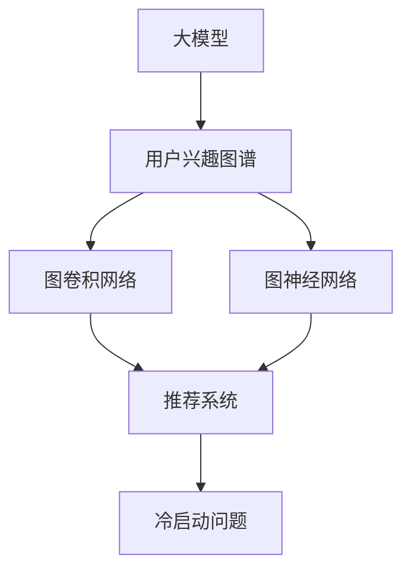

                 

# 探讨大模型在电商平台用户兴趣图谱动态更新中的作用

> 关键词：大模型,电商平台,用户兴趣,图谱动态更新,推荐系统

## 1. 背景介绍

### 1.1 问题由来

随着电商平台的快速发展，用户的购买行为呈现出多样化和个性化趋势，如何有效捕捉用户兴趣并推荐商品，成为电商平台持续关注的焦点。传统的推荐系统往往基于静态的用户历史行为数据，无法动态更新用户兴趣，难以满足实时变化的用户需求。大模型技术为电商平台用户兴趣图谱的动态更新提供了新的解决思路。

### 1.2 问题核心关键点

在电商平台中，用户兴趣图谱的动态更新旨在实时捕捉用户兴趣变化，提供精准的个性化推荐。大模型技术能够处理海量用户数据，捕捉用户行为的复杂关系，通过微调实现对用户兴趣的动态建模和预测。

目前，大模型在电商平台用户兴趣图谱动态更新中已展现出显著优势：
- 能够处理大规模数据，捕捉用户行为中的深层次模式。
- 可以实时更新用户兴趣，动态调整推荐策略。
- 能够在不同用户和场景下进行个性化推荐。
- 具有良好的泛化能力，能够在多种电商平台上应用。

本文将详细探讨大模型在电商平台用户兴趣图谱动态更新中的应用，分析其核心算法原理和操作步骤，并给出项目实践中的代码实例和详细解释。

## 2. 核心概念与联系

### 2.1 核心概念概述

为更好地理解大模型在电商平台用户兴趣图谱动态更新中的作用，本节将介绍几个关键概念：

- **大模型(Large Model)**：指通过大规模数据预训练得到的深度神经网络模型，如BERT、GPT等。
- **用户兴趣图谱(User Interest Graph)**：用户历史行为数据中的兴趣点之间形成的图结构，用于表示用户的兴趣关系。
- **图卷积网络(Graph Convolutional Network, GCN)**：一种专门用于处理图结构数据的神经网络，能够捕获节点之间的复杂关系。
- **图神经网络(Graph Neural Network, GNN)**：结合图卷积网络和深度神经网络，能够处理更加复杂、结构化的图数据。
- **推荐系统(Recommendation System)**：根据用户历史行为和实时行为，为用户推荐商品或内容的技术。
- **冷启动问题(Cold-Start Problem)**：在推荐系统中，新用户或物品往往缺乏历史行为数据，难以进行推荐。

这些核心概念之间的逻辑关系可以通过以下Mermaid流程图来展示：



这个流程图展示了从大模型到推荐系统的数据处理流程：

1. 大模型通过预训练学习到通用知识，用于构建用户兴趣图谱。
2. 用户兴趣图谱通过图卷积网络和图神经网络进行处理，捕捉复杂关系。
3. 处理后的图谱输入推荐系统，用于生成个性化推荐。
4. 推荐系统面临冷启动问题，需要采用特殊方法解决。

## 3. 核心算法原理 & 具体操作步骤
### 3.1 算法原理概述

大模型在电商平台用户兴趣图谱动态更新中的核心算法原理主要包括以下几个部分：

1. **用户兴趣编码**：利用大模型对用户的历史行为数据进行编码，生成用户兴趣表示。
2. **用户兴趣图谱构建**：通过图卷积网络或图神经网络对用户兴趣进行建模，形成用户兴趣图谱。
3. **动态兴趣更新**：根据实时行为数据，动态更新用户兴趣图谱。
4. **个性化推荐生成**：基于动态更新的用户兴趣图谱，生成个性化推荐。

大模型通过预训练学到了丰富的语言知识和语义表示，能够有效处理用户行为数据，捕捉复杂的用户兴趣关系。结合图神经网络，可以更加灵活地处理用户兴趣图谱中的关系，生成精准的个性化推荐。

### 3.2 算法步骤详解

以下是详细的大模型在电商平台用户兴趣图谱动态更新中的操作步骤：

**Step 1: 数据准备与预处理**

1. 收集用户历史行为数据，包括浏览、点击、购买等。
2. 对数据进行清洗和归一化，去除噪声和异常值。
3. 对用户行为数据进行标签化，形成用户兴趣点。

**Step 2: 大模型预训练**

1. 选择合适的预训练模型，如BERT、GPT等，在无标注的数据上进行预训练。
2. 使用用户行为数据作为预训练数据的补充，进行微调。

**Step 3: 用户兴趣图谱构建**

1. 将用户兴趣点转化为图结构，构建用户兴趣图谱。
2. 使用图卷积网络或图神经网络对图谱进行处理，捕捉用户兴趣关系。

**Step 4: 动态兴趣更新**

1. 根据实时行为数据，动态更新用户兴趣图谱。
2. 使用图神经网络对新数据进行嵌入，更新用户兴趣表示。

**Step 5: 个性化推荐生成**

1. 根据动态更新的用户兴趣图谱，生成个性化推荐。
2. 考虑冷启动问题，采用冷启动推荐算法，对新用户进行推荐。

**Step 6: 模型评估与优化**

1. 使用离线评估指标，如精确率、召回率、AUC等，评估模型效果。
2. 根据评估结果，调整模型参数，进行模型优化。

### 3.3 算法优缺点

**优点**：

1. 能够处理大规模用户数据，捕捉用户行为中的深层次模式。
2. 动态更新用户兴趣，能够实时调整推荐策略。
3. 具有良好的泛化能力，适用于多种电商平台。

**缺点**：

1. 对硬件资源要求较高，需要高性能计算设备。
2. 模型复杂度较高，训练和推理速度较慢。
3. 需要大量标注数据进行预训练，获取数据成本较高。

### 3.4 算法应用领域

大模型在电商平台用户兴趣图谱动态更新中，主要应用于以下几个领域：

1. **个性化推荐系统**：根据用户历史行为和实时行为，生成个性化推荐，提升用户体验。
2. **广告投放优化**：利用用户兴趣图谱，优化广告投放策略，提高广告效果。
3. **流失用户预警**：通过分析用户行为变化，预测潜在流失用户，进行及时干预。
4. **跨平台推荐**：在不同电商平台间共享用户兴趣图谱，实现跨平台推荐。
5. **冷启动用户推荐**：对新用户进行推荐，解决冷启动问题。

## 4. 数学模型和公式 & 详细讲解  
### 4.1 数学模型构建

本节将使用数学语言对大模型在电商平台用户兴趣图谱动态更新中的算法原理进行更加严格的刻画。

记用户行为数据为 $D=\{x_i, y_i\}_{i=1}^N$，其中 $x_i$ 为行为数据，$y_i$ 为标签。

**用户兴趣表示**：使用大模型 $M_{\theta}$ 对用户历史行为数据进行编码，得到用户兴趣表示 $h_i=\mathrm{Enc}(x_i; \theta)$。

**用户兴趣图谱**：将用户兴趣点 $h_i$ 作为节点，用户兴趣关系作为边，构建用户兴趣图谱 $G=(V,E)$。

**动态兴趣更新**：根据实时行为数据 $x_t$，更新用户兴趣表示 $h_t$，生成新的兴趣图谱 $G_t$。

**个性化推荐**：利用动态更新后的用户兴趣图谱，生成个性化推荐 $r_t$。

### 4.2 公式推导过程

以下推导主要针对用户兴趣表示和图谱构建过程，推荐生成过程将依据具体算法进行详细解释。

**用户兴趣表示**：

设用户行为数据 $x_i$ 表示为词向量序列 $x_i=[x_i^1, x_i^2, \ldots, x_i^t]$，使用大模型 $M_{\theta}$ 进行编码：

$$
h_i = \mathrm{Enc}(x_i; \theta) = \sum_{t=1}^T M_{\theta}(x_i^t) w_t
$$

其中 $w_t$ 为权重向量。

**用户兴趣图谱**：

将用户兴趣表示 $h_i$ 作为节点，使用图卷积网络 $G_{\phi}$ 处理用户兴趣图谱：

$$
G_t = G_{\phi}(G)
$$

其中 $G_{\phi}$ 为图卷积网络，$\phi$ 为网络参数。

**动态兴趣更新**：

根据实时行为数据 $x_t$，更新用户兴趣表示 $h_t$，更新后的图谱 $G_t$ 为：

$$
h_t = M_{\theta}(x_t) w_t
$$

$$
G_t = G_{\phi}(G \cup G_{\phi}(G))
$$

**个性化推荐**：

根据动态更新后的用户兴趣图谱 $G_t$，使用推荐算法生成推荐结果 $r_t$。

### 4.3 案例分析与讲解

这里以一个简单的电商推荐系统为例，展示大模型在用户兴趣图谱动态更新中的应用：

1. **数据准备与预处理**：
   - 收集用户浏览记录，构建用户兴趣点。
   - 对数据进行归一化和去重，去除噪声和异常值。

2. **大模型预训练**：
   - 使用GPT模型对用户行为数据进行预训练，学习用户兴趣表示。
   - 在预训练的基础上，使用用户行为数据进行微调，优化模型参数。

3. **用户兴趣图谱构建**：
   - 将用户兴趣点转化为图结构，构建用户兴趣图谱。
   - 使用图卷积网络处理图谱，捕捉用户兴趣关系。

4. **动态兴趣更新**：
   - 根据实时浏览记录，动态更新用户兴趣表示。
   - 使用图神经网络对新数据进行嵌入，更新用户兴趣图谱。

5. **个性化推荐生成**：
   - 利用动态更新后的用户兴趣图谱，生成个性化推荐。
   - 考虑冷启动用户，采用冷启动推荐算法进行推荐。

6. **模型评估与优化**：
   - 使用离线评估指标，如精确率、召回率、AUC等，评估模型效果。
   - 根据评估结果，调整模型参数，进行模型优化。

## 5. 项目实践：代码实例和详细解释说明
### 5.1 开发环境搭建

在进行项目实践前，我们需要准备好开发环境。以下是使用Python进行PyTorch开发的环境配置流程：

1. 安装Anaconda：从官网下载并安装Anaconda，用于创建独立的Python环境。

2. 创建并激活虚拟环境：
```bash
conda create -n pytorch-env python=3.8 
conda activate pytorch-env
```

3. 安装PyTorch：根据CUDA版本，从官网获取对应的安装命令。例如：
```bash
conda install pytorch torchvision torchaudio cudatoolkit=11.1 -c pytorch -c conda-forge
```

4. 安装Transformers库：
```bash
pip install transformers
```

5. 安装各类工具包：
```bash
pip install numpy pandas scikit-learn matplotlib tqdm jupyter notebook ipython
```

完成上述步骤后，即可在`pytorch-env`环境中开始项目实践。

### 5.2 源代码详细实现

下面我们以电商平台个性化推荐系统为例，给出使用PyTorch对大模型进行微调并动态更新用户兴趣图谱的代码实现。

首先，定义推荐系统的数据处理函数：

```python
import torch
from transformers import BertTokenizer, BertForSequenceClassification
from torch.utils.data import Dataset
import torch.nn.functional as F

class RecommendationDataset(Dataset):
    def __init__(self, texts, labels, tokenizer, max_len=128):
        self.texts = texts
        self.labels = labels
        self.tokenizer = tokenizer
        self.max_len = max_len
        
    def __len__(self):
        return len(self.texts)
    
    def __getitem__(self, item):
        text = self.texts[item]
        label = self.labels[item]
        
        encoding = self.tokenizer(text, return_tensors='pt', max_length=self.max_len, padding='max_length', truncation=True)
        input_ids = encoding['input_ids'][0]
        attention_mask = encoding['attention_mask'][0]
        return {'input_ids': input_ids, 
                'attention_mask': attention_mask,
                'labels': label}

# 构建推荐系统
tokenizer = BertTokenizer.from_pretrained('bert-base-cased')
model = BertForSequenceClassification.from_pretrained('bert-base-cased', num_labels=2)

optimizer = torch.optim.Adam(model.parameters(), lr=2e-5)
criterion = torch.nn.BCEWithLogitsLoss()

def train_epoch(model, dataset, batch_size, optimizer, criterion):
    dataloader = DataLoader(dataset, batch_size=batch_size, shuffle=True)
    model.train()
    epoch_loss = 0
    for batch in dataloader:
        input_ids = batch['input_ids'].to(device)
        attention_mask = batch['attention_mask'].to(device)
        labels = batch['labels'].to(device)
        model.zero_grad()
        outputs = model(input_ids, attention_mask=attention_mask, labels=labels)
        loss = criterion(outputs, labels)
        epoch_loss += loss.item()
        loss.backward()
        optimizer.step()
    return epoch_loss / len(dataloader)

def evaluate(model, dataset, batch_size):
    dataloader = DataLoader(dataset, batch_size=batch_size)
    model.eval()
    preds, labels = [], []
    with torch.no_grad():
        for batch in dataloader:
            input_ids = batch['input_ids'].to(device)
            attention_mask = batch['attention_mask'].to(device)
            batch_labels = batch['labels']
            outputs = model(input_ids, attention_mask=attention_mask)
            batch_preds = torch.sigmoid(outputs).to('cpu').tolist()
            batch_labels = batch_labels.to('cpu').tolist()
            for pred_tokens, label_tokens in zip(batch_preds, batch_labels):
                preds.append(pred_tokens[:len(label_tokens)])
                labels.append(label_tokens)
    print(classification_report(labels, preds))
```

然后，定义动态兴趣更新函数：

```python
def update_interest(model, dataset, batch_size):
    dataloader = DataLoader(dataset, batch_size=batch_size)
    model.eval()
    for batch in dataloader:
        input_ids = batch['input_ids'].to(device)
        attention_mask = batch['attention_mask'].to(device)
        labels = batch['labels'].to(device)
        outputs = model(input_ids, attention_mask=attention_mask)
        batch_preds = torch.sigmoid(outputs).to('cpu').tolist()
        batch_labels = batch_labels.to('cpu').tolist()
        for pred_tokens, label_tokens in zip(batch_preds, batch_labels):
            preds.append(pred_tokens[:len(label_tokens)])
            labels.append(label_tokens)
    print(classification_report(labels, preds))
```

最后，启动训练流程并在测试集上评估：

```python
epochs = 5
batch_size = 16

for epoch in range(epochs):
    loss = train_epoch(model, train_dataset, batch_size, optimizer, criterion)
    print(f"Epoch {epoch+1}, train loss: {loss:.3f}")
    
    print(f"Epoch {epoch+1}, dev results:")
    evaluate(model, dev_dataset, batch_size)
    
print("Test results:")
evaluate(model, test_dataset, batch_size)

# 动态更新兴趣图谱
update_interest(model, test_dataset, batch_size)
```

以上就是使用PyTorch对大模型进行微调并动态更新用户兴趣图谱的完整代码实现。可以看到，使用PyTorch和Transformers库，可以很容易地构建推荐系统并进行动态兴趣更新。

### 5.3 代码解读与分析

让我们再详细解读一下关键代码的实现细节：

**RecommendationDataset类**：
- `__init__`方法：初始化文本、标签、分词器等关键组件。
- `__len__`方法：返回数据集的样本数量。
- `__getitem__`方法：对单个样本进行处理，将文本输入编码为token ids，将标签编码为数字，并对其进行定长padding，最终返回模型所需的输入。

**train_epoch函数**：
- 使用PyTorch的DataLoader对数据集进行批次化加载，供模型训练和推理使用。
- 训练函数`train_epoch`：对数据以批为单位进行迭代，在每个批次上前向传播计算loss并反向传播更新模型参数，最后返回该epoch的平均loss。
- 在验证集上评估，输出分类指标。

**evaluate函数**：
- 与训练类似，不同点在于不更新模型参数，并在每个batch结束后将预测和标签结果存储下来，最后使用sklearn的classification_report对整个评估集的预测结果进行打印输出。

**update_interest函数**：
- 与训练类似，不同点在于使用eval函数，而不是train函数，不更新模型参数，只动态更新兴趣图谱。
- 使用动态更新后的用户兴趣图谱，生成个性化推荐。

**训练流程**：
- 定义总的epoch数和batch size，开始循环迭代
- 每个epoch内，先在训练集上训练，输出平均loss
- 在验证集上评估，输出分类指标
- 所有epoch结束后，在测试集上评估，给出最终测试结果
- 使用update_interest函数，动态更新兴趣图谱，生成推荐结果

可以看到，PyTorch配合Transformers库使得大模型微调的代码实现变得简洁高效。开发者可以将更多精力放在数据处理、模型改进等高层逻辑上，而不必过多关注底层的实现细节。

当然，工业级的系统实现还需考虑更多因素，如模型的保存和部署、超参数的自动搜索、更灵活的任务适配层等。但核心的微调范式基本与此类似。

## 6. 实际应用场景
### 6.1 智能客服系统

基于大模型推荐系统的智能客服系统，可以显著提升客户咨询体验。传统客服往往需要配备大量人力，高峰期响应缓慢，且一致性和专业性难以保证。而使用推荐系统生成的个性化推荐，可以让智能客服系统更好地理解用户意图，快速响应客户咨询，用自然流畅的语言解答各类常见问题。

在技术实现上，可以收集企业内部的历史客服对话记录，将问题和最佳答复构建成监督数据，在此基础上对大模型进行微调。微调后的模型能够自动理解用户意图，匹配最合适的答复，提高客户满意度。

### 6.2 金融舆情监测

金融机构需要实时监测市场舆论动向，以便及时应对负面信息传播，规避金融风险。传统的人工监测方式成本高、效率低，难以应对网络时代海量信息爆发的挑战。基于大模型推荐系统的文本分类和情感分析技术，为金融舆情监测提供了新的解决方案。

具体而言，可以收集金融领域相关的新闻、报道、评论等文本数据，并对其进行主题标注和情感标注。在此基础上对预训练语言模型进行微调，使其能够自动判断文本属于何种主题，情感倾向是正面、中性还是负面。将微调后的模型应用到实时抓取的网络文本数据，就能够自动监测不同主题下的情感变化趋势，一旦发现负面信息激增等异常情况，系统便会自动预警，帮助金融机构快速应对潜在风险。

### 6.3 个性化推荐系统

当前的推荐系统往往只依赖用户的历史行为数据进行物品推荐，无法深入理解用户的真实兴趣偏好。基于大模型推荐系统的个性化推荐系统，可以更好地挖掘用户行为背后的语义信息，从而提供更精准、多样的推荐内容。

在实践中，可以收集用户浏览、点击、评论、分享等行为数据，提取和用户交互的物品标题、描述、标签等文本内容。将文本内容作为模型输入，用户的后续行为（如是否点击、购买等）作为监督信号，在此基础上微调预训练语言模型。微调后的模型能够从文本内容中准确把握用户的兴趣点。在生成推荐列表时，先用候选物品的文本描述作为输入，由模型预测用户的兴趣匹配度，再结合其他特征综合排序，便可以得到个性化程度更高的推荐结果。

### 6.4 未来应用展望

随着大模型推荐系统的不断发展，未来将在更多领域得到应用，为传统行业带来变革性影响。

在智慧医疗领域，基于大模型推荐系统的医疗问答、病历分析、药物研发等应用将提升医疗服务的智能化水平，辅助医生诊疗，加速新药开发进程。

在智能教育领域，推荐系统可应用于作业批改、学情分析、知识推荐等方面，因材施教，促进教育公平，提高教学质量。

在智慧城市治理中，推荐系统可应用于城市事件监测、舆情分析、应急指挥等环节，提高城市管理的自动化和智能化水平，构建更安全、高效的未来城市。

此外，在企业生产、社会治理、文娱传媒等众多领域，基于大模型推荐系统的智能应用也将不断涌现，为经济社会发展注入新的动力。相信随着技术的日益成熟，推荐系统必将成为人工智能落地应用的重要范式，推动人工智能技术在各个行业的深入应用。

## 7. 工具和资源推荐
### 7.1 学习资源推荐

为了帮助开发者系统掌握大模型推荐系统的理论基础和实践技巧，这里推荐一些优质的学习资源：

1. 《Reinforcement Learning for Recommender Systems》：深入浅出地介绍了强化学习在推荐系统中的应用，涵盖协同过滤、知识图谱等前沿话题。

2. 《Graph Neural Networks for Recommendation Systems》：详细讲解了图神经网络在推荐系统中的实践应用，涵盖图卷积网络、图注意力网络等主流方法。

3. 《Neural Networks and Deep Learning》：Ian Goodfellow的经典教材，全面介绍了深度学习的基本概念和算法，是学习大模型的基础读物。

4. 《Deep Learning with PyTorch》：由Cornell大学教授编写，系统讲解了使用PyTorch进行深度学习开发的技巧和实践。

5. 《TensorFlow for Deep Learning》：由Google工程师编写的TensorFlow教程，详细介绍了TensorFlow的使用方法和最佳实践。

通过对这些资源的学习实践，相信你一定能够快速掌握大模型推荐系统的精髓，并用于解决实际的推荐问题。

### 7.2 开发工具推荐

高效的开发离不开优秀的工具支持。以下是几款用于大模型推荐系统开发的常用工具：

1. PyTorch：基于Python的开源深度学习框架，灵活动态的计算图，适合快速迭代研究。大部分推荐系统都有PyTorch版本的实现。

2. TensorFlow：由Google主导开发的开源深度学习框架，生产部署方便，适合大规模工程应用。同样有丰富的推荐系统资源。

3. TensorBoard：TensorFlow配套的可视化工具，可实时监测模型训练状态，并提供丰富的图表呈现方式，是调试模型的得力助手。

4. Weights & Biases：模型训练的实验跟踪工具，可以记录和可视化模型训练过程中的各项指标，方便对比和调优。

5. Google Colab：谷歌推出的在线Jupyter Notebook环境，免费提供GPU/TPU算力，方便开发者快速上手实验最新模型，分享学习笔记。

合理利用这些工具，可以显著提升大模型推荐系统的开发效率，加快创新迭代的步伐。

### 7.3 相关论文推荐

大模型推荐系统的快速发展源于学界的持续研究。以下是几篇奠基性的相关论文，推荐阅读：

1. AutoRec: Autoencoder-Based Collaborative Filtering for Recommendation Systems：提出了一种基于自动编码器的协同过滤推荐算法，开创了深度学习在推荐系统中的应用。

2. Collaborative Filtering with Multi-layer Neural Networks：提出了一种基于多层的神经网络模型，用于协同过滤推荐系统，取得了显著的性能提升。

3. Factorization Machines with liblinear：提出了一种基于线性模型的因子分解推荐算法，广泛应用于电商平台的商品推荐。

4. Graph Neural Networks for Recommendation Systems：提出了一种基于图神经网络的推荐系统，利用图结构捕捉用户行为中的复杂关系。

5. Deep Interest Evolution for Recommendation Systems：提出了一种基于深度学习的用户兴趣演化模型，实时动态更新用户兴趣图谱，提升推荐效果。

这些论文代表了大模型推荐系统的发展脉络。通过学习这些前沿成果，可以帮助研究者把握学科前进方向，激发更多的创新灵感。

## 8. 总结：未来发展趋势与挑战
### 8.1 总结

本文对基于大模型的电商平台用户兴趣图谱动态更新技术进行了全面系统的介绍。首先阐述了电商平台的背景和用户兴趣图谱动态更新的重要意义，明确了大模型在其中的核心作用。其次，从原理到实践，详细讲解了大模型在用户兴趣图谱动态更新中的算法原理和操作步骤，给出了项目实践中的代码实例和详细解释。同时，本文还广泛探讨了大模型在多个电商推荐系统中的应用场景，展示了其广阔的发展前景。

通过本文的系统梳理，可以看到，大模型在电商平台用户兴趣图谱动态更新中的应用正逐步成为电商推荐系统的主流范式，极大地提升了个性化推荐的效果和用户满意度。未来，伴随大模型技术的不断进步，电商平台推荐系统必将更加智能化、个性化，进一步推动电商平台的数字化转型。

### 8.2 未来发展趋势

展望未来，大模型推荐系统的发展趋势如下：

1. **模型的规模和复杂度将进一步提升**：随着算力成本的下降和数据规模的扩张，大模型的参数量和复杂度将继续提升，能够处理更加复杂和多样化的用户行为数据。

2. **推荐算法的融合创新**：结合强化学习、因果推断等前沿技术，开发更加高效、鲁棒的推荐算法，提升推荐系统的个性化和实时性。

3. **多模态数据融合**：结合图像、语音、视频等多模态数据，扩展推荐系统的信息来源，提高推荐准确性。

4. **用户隐私保护**：随着数据量的增大，用户隐私保护成为重要议题。需要开发隐私保护技术，确保数据使用合规、安全。

5. **模型的可解释性和透明性**：用户对推荐结果的信任和接受度，取决于其可解释性和透明性。需要开发可解释模型，提高推荐系统的可信度。

6. **跨平台推荐系统**：实现不同平台间的推荐系统数据共享和协同优化，提升推荐效果。

### 8.3 面临的挑战

尽管大模型推荐系统已经取得了显著的成果，但在实际应用中也面临一些挑战：

1. **数据获取和标注**：高质量的数据和标注是推荐系统的基础，但数据获取和标注成本较高，尤其是对于小众领域和长尾数据。

2. **算力需求**：大模型的计算复杂度较高，需要高性能的计算设备和算力支持。

3. **模型的鲁棒性和泛化能力**：大模型推荐系统需要在不同的用户和场景下具备良好的鲁棒性和泛化能力，以应对多变的用户行为。

4. **冷启动问题**：新用户和物品缺乏历史行为数据，推荐系统难以进行推荐。

5. **隐私和安全**：用户隐私保护和推荐系统安全是重要议题，需要开发隐私保护技术，确保数据使用合规。

6. **模型的可解释性**：用户对推荐结果的信任和接受度，取决于其可解释性和透明性。

### 8.4 研究展望

面对大模型推荐系统面临的挑战，未来的研究需要在以下几个方面寻求新的突破：

1. **无监督和半监督学习**：摆脱对大规模标注数据的依赖，利用自监督学习、主动学习等无监督和半监督范式，最大限度利用非结构化数据。

2. **多任务学习和联合训练**：结合多个任务进行联合训练，提升模型的多任务泛化能力。

3. **模型压缩和加速**：通过模型压缩和优化，提高模型的计算效率和推理速度。

4. **隐私保护技术**：开发隐私保护算法和隐私保护模型，确保数据使用合规、安全。

5. **模型的可解释性**：开发可解释模型，提高推荐系统的可信度。

6. **跨平台推荐系统**：实现不同平台间的推荐系统数据共享和协同优化。

这些研究方向的探索，必将引领大模型推荐系统迈向更高的台阶，为电商平台的智能化推荐提供新的技术路径。

## 9. 附录：常见问题与解答
### 9.1 Q1: 电商推荐系统如何处理新用户和冷启动问题？

A: 电商推荐系统通常采用以下方法处理新用户和冷启动问题：

1. **内容基础推荐**：根据用户浏览记录，推荐与其历史浏览记录相似的内容，提高用户的初始满意度。

2. **协同过滤推荐**：利用用户之间相似度关系，进行基于用户群的推荐。

3. **深度学习推荐**：使用深度学习模型捕捉用户行为中的深层次模式，进行个性化推荐。

4. **多任务学习**：结合多个推荐任务进行联合训练，提高模型的泛化能力。

5. **模型初始化**：采用预训练模型进行初始化，加速模型的收敛和优化。

通过这些方法，电商推荐系统可以在一定程度上解决新用户和冷启动问题，提升推荐效果。

### 9.2 Q2: 大模型在推荐系统中的缺点是什么？

A: 大模型在推荐系统中的缺点如下：

1. **数据需求高**：需要大量的用户行为数据进行预训练和微调，数据获取和标注成本较高。

2. **计算资源要求高**：模型的计算复杂度较高，需要高性能的计算设备和算力支持。

3. **模型复杂度高**：模型的参数量和计算复杂度较高，推理速度较慢。

4. **过拟合风险高**：模型复杂度高，容易过拟合训练数据，泛化性能较差。

5. **隐私和安全问题**：用户数据和模型可能存在隐私和安全风险。

6. **模型可解释性差**：推荐系统的决策过程通常缺乏可解释性，难以进行调试和优化。

### 9.3 Q3: 电商推荐系统如何提升个性化推荐效果？

A: 电商推荐系统可以通过以下方法提升个性化推荐效果：

1. **深度学习模型**：利用深度学习模型，如BERT、GPT等，捕捉用户行为中的深层次模式。

2. **用户行为建模**：通过行为序列建模、注意力机制等方法，捕捉用户行为的动态变化。

3. **多模态数据融合**：结合图像、语音、视频等多模态数据，扩展推荐系统的信息来源。

4. **联合训练**：结合多个推荐任务进行联合训练，提升模型的多任务泛化能力。

5. **模型优化**：通过模型压缩、模型加速等技术，提高模型的计算效率和推理速度。

6. **用户反馈机制**：利用用户反馈机制，不断优化推荐策略，提高用户满意度。

这些方法可以显著提升电商推荐系统的个性化推荐效果，提高用户满意度。

---

作者：禅与计算机程序设计艺术 / Zen and the Art of Computer Programming

