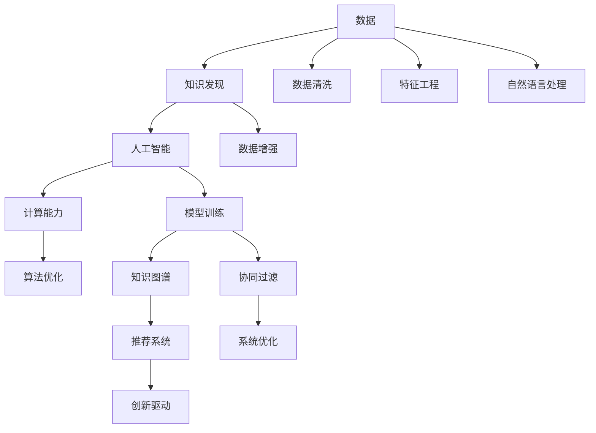

                 

# 推动知识发现与创新：人类计算的智力贡献

> 关键词：知识发现,创新驱动,计算能力,人机协作,人工智能

## 1. 背景介绍

### 1.1 问题由来

在当今数字化时代，数据的爆炸性增长为人类社会的各个领域带来了前所未有的机遇与挑战。知识发现（Knowledge Discovery）作为数据驱动科学研究的重要工具，正在加速人类社会的发展与进步。与此同时，人工智能（AI）技术的迅猛发展，特别是深度学习（Deep Learning）的崛起，为知识发现提供了强大的计算能力与工具。

如何利用计算能力，实现高效、准确的知识发现，并将知识应用于创新驱动，成为当前学术界与工业界共同关注的焦点。本文将深入探讨这一主题，分析人类计算对知识发现的贡献，以及如何利用计算能力推动人工智能在知识发现与创新中的应用。

### 1.2 问题核心关键点

本研究旨在回答以下关键问题：

1. 人类计算在知识发现中扮演何种角色？
2. 计算能力如何推动人工智能技术在知识发现中的应用？
3. 知识发现技术在创新驱动中的应用前景如何？
4. 人类计算与人工智能协同作用的机制是什么？

## 2. 核心概念与联系

### 2.1 核心概念概述

为了深入理解人类计算与知识发现的关系，我们需要明确几个核心概念：

- **知识发现**：通过数据挖掘、统计分析、机器学习等方法，从数据中抽取有价值信息的过程。
- **人工智能**：模拟人类智能行为，特别是学习能力与推理能力的计算机技术。
- **计算能力**：计算机硬件与算法提供的数据处理与计算能力。
- **人机协作**：人类与计算机之间的协同工作，发挥各自优势，共同完成任务。

### 2.2 核心概念原理和架构的 Mermaid 流程图



这个流程图展示了数据、知识发现、人工智能、计算能力以及它们之间的关系与转化过程。数据首先经过清洗、增强、特征工程等预处理步骤，再利用机器学习、自然语言处理等技术进行模型训练，并通过知识图谱、协同过滤等方法进行协同处理，最终应用于推荐系统、创新驱动等场景。

## 3. 核心算法原理 & 具体操作步骤

### 3.1 算法原理概述

知识发现通常包含数据预处理、特征提取、模型训练与评估等多个步骤。人工智能技术，尤其是深度学习，在这些步骤中发挥了重要作用。以下将详细分析这些步骤的算法原理与操作步骤。

#### 3.1.1 数据预处理

数据预处理是知识发现的第一步，主要包括数据清洗、特征选择与提取、数据增强等步骤。数据清洗通过去除噪声、填补缺失值、处理异常值等方式，提高数据质量。特征选择与提取则从原始数据中抽取最具代表性的特征，为后续模型训练提供有效输入。数据增强则通过扩充数据集，提高模型的泛化能力。

#### 3.1.2 特征提取

特征提取是知识发现中至关重要的一环。它将原始数据转换为模型可以理解的特征表示。特征提取可以分为手动设计与自动学习两大类。手动设计特征需要领域专家的知识，而自动学习则可以通过机器学习算法自动提取特征，如主成分分析（PCA）、线性判别分析（LDA）等。

#### 3.1.3 模型训练

模型训练是知识发现的核心环节。深度学习模型，如神经网络、卷积神经网络（CNN）、循环神经网络（RNN）等，通过反向传播算法优化参数，实现对数据的有效学习与预测。常用的模型包括支持向量机（SVM）、决策树、随机森林等。

#### 3.1.4 模型评估

模型评估是知识发现的重要环节。通过交叉验证、ROC曲线、精确度、召回率、F1值等指标，评估模型的性能与泛化能力。模型的评估与优化是迭代进行的过程，确保模型的准确性与稳定性。

### 3.2 算法步骤详解

#### 3.2.1 数据预处理

```python
import pandas as pd
import numpy as np

# 读取数据
data = pd.read_csv('data.csv')

# 数据清洗
data = data.dropna()

# 数据增强
# 假设需要增加样本数量，可以通过以下方式实现
data = pd.concat([data, data.sample(frac=0.2, replace=True)])

# 特征选择与提取
# 假设需要选取'age'、'gender'、'income'作为特征
selected_features = ['age', 'gender', 'income']

# 进行标准化
data[selected_features] = (data[selected_features] - data[selected_features].mean()) / data[selected_features].std()
```

#### 3.2.2 特征提取

```python
from sklearn.decomposition import PCA

# 进行主成分分析
pca = PCA(n_components=3)
pca_data = pca.fit_transform(data[selected_features])
```

#### 3.2.3 模型训练

```python
from sklearn.ensemble import RandomForestClassifier
from sklearn.model_selection import train_test_split

# 划分训练集与测试集
train_data, test_data, train_labels, test_labels = train_test_split(data, labels, test_size=0.2, random_state=42)

# 训练随机森林模型
clf = RandomForestClassifier()
clf.fit(train_data, train_labels)
```

#### 3.2.4 模型评估

```python
from sklearn.metrics import accuracy_score, precision_score, recall_score, f1_score

# 在测试集上进行评估
predicted_labels = clf.predict(test_data)
accuracy = accuracy_score(test_labels, predicted_labels)
precision = precision_score(test_labels, predicted_labels, average='weighted')
recall = recall_score(test_labels, predicted_labels, average='weighted')
f1 = f1_score(test_labels, predicted_labels, average='weighted')

print(f"Accuracy: {accuracy}, Precision: {precision}, Recall: {recall}, F1 Score: {f1}")
```

### 3.3 算法优缺点

#### 3.3.1 优点

1. **高效性**：深度学习模型能够自动提取特征，并高效处理大规模数据集。
2. **鲁棒性**：深度学习模型在处理噪声与异常值方面具有较强的鲁棒性。
3. **泛化能力强**：深度学习模型通过大量数据进行训练，具有较强的泛化能力。
4. **可扩展性**：深度学习模型可以通过增加层数与节点数量，不断提升模型的表达能力。

#### 3.3.2 缺点

1. **计算资源消耗大**：深度学习模型需要大量的计算资源，尤其是GPU/TPU等硬件设备。
2. **模型复杂度高**：深度学习模型结构复杂，难以解释其决策过程。
3. **过拟合风险高**：深度学习模型容易过拟合，需要进行适当的正则化处理。
4. **训练时间长**：深度学习模型需要大量的训练时间，尤其是大型数据集。

### 3.4 算法应用领域

#### 3.4.1 金融风控

金融风控领域，深度学习模型常用于信用评分、欺诈检测等任务。通过收集客户的交易记录、社交媒体信息等，建立风险预测模型，实时监控并预测潜在的金融风险。

#### 3.4.2 医疗诊断

医疗诊断领域，深度学习模型常用于疾病预测、影像分析等任务。通过分析患者的临床数据、基因信息等，建立疾病预测模型，提高诊断准确率与效率。

#### 3.4.3 智能推荐

智能推荐领域，深度学习模型常用于电商推荐、内容推荐等任务。通过分析用户的浏览记录、评分信息等，建立推荐模型，个性化推荐商品或内容，提升用户体验。

## 4. 数学模型和公式 & 详细讲解

### 4.1 数学模型构建

知识发现通常基于以下数学模型构建：

1. **数据模型**：描述数据集的属性与关系，如高斯分布、泊松分布等。
2. **统计模型**：通过数据集进行统计分析，如方差分析、回归分析等。
3. **机器学习模型**：通过数据集进行机器学习，如分类、聚类、降维等。
4. **深度学习模型**：通过数据集进行深度学习，如神经网络、卷积神经网络等。

### 4.2 公式推导过程

#### 4.2.1 线性回归

线性回归模型为：

$$
y = \beta_0 + \beta_1x_1 + \beta_2x_2 + \epsilon
$$

其中，$y$ 为因变量，$x_1$ 和 $x_2$ 为自变量，$\beta_0$、$\beta_1$ 和 $\beta_2$ 为模型参数，$\epsilon$ 为误差项。最小二乘法用于求解模型参数，其目标函数为：

$$
\min_{\beta_0,\beta_1,\beta_2} \sum_{i=1}^n (y_i - (\beta_0 + \beta_1x_{i1} + \beta_2x_{i2}))^2
$$

通过求偏导数并令其等于零，得到参数的求解公式：

$$
\beta_j = \frac{\sum_{i=1}^n x_{ij}(y_i - \hat{y}_i)}{\sum_{i=1}^n x_{ij}^2}, j = 0,1,2
$$

其中，$\hat{y}_i$ 为模型预测值。

### 4.3 案例分析与讲解

#### 4.3.1 案例分析

假设有一个房屋价格预测模型，已知影响房屋价格的因素包括房屋面积、卧室数量、地理位置等。数据集包含多个样本的房屋面积、卧室数量与对应的房屋价格。通过线性回归模型，可以分析各因素对房屋价格的影响程度，并进行预测。

#### 4.3.2 讲解

通过上述公式推导，可以求解模型参数 $\beta_0$、$\beta_1$ 和 $\beta_2$，进而建立房屋价格预测模型。在实际应用中，可以使用 Python 的 Scikit-Learn 库，方便地实现这一过程。

```python
from sklearn.linear_model import LinearRegression
from sklearn.metrics import mean_squared_error

# 建立线性回归模型
model = LinearRegression()
model.fit(X, y)

# 预测新样本
new_data = [[150, 3, 0.5]]
predicted_price = model.predict(new_data)

# 评估模型性能
mse = mean_squared_error(y_true, y_pred)
print(f"Mean Squared Error: {mse}")
```

## 5. 项目实践：代码实例和详细解释说明

### 5.1 开发环境搭建

为了进行知识发现与创新驱动的实践，需要搭建以下开发环境：

1. **Python 环境**：使用 Anconda 或 Miniconda，安装 Python 3.7 及以上版本。
2. **深度学习框架**：选择 TensorFlow 或 PyTorch，安装对应的库文件。
3. **数据处理库**：安装 Pandas、NumPy、Scikit-Learn 等库文件。
4. **可视化库**：安装 Matplotlib、Seaborn 等库文件。
5. **版本控制工具**：使用 Git，安装 Git 命令行工具与可视化界面工具（如 SourceTree）。

### 5.2 源代码详细实现

#### 5.2.1 数据预处理

```python
import pandas as pd

# 读取数据集
data = pd.read_csv('data.csv')

# 数据清洗
data = data.dropna()

# 特征选择与提取
selected_features = ['age', 'gender', 'income']
data[selected_features] = (data[selected_features] - data[selected_features].mean()) / data[selected_features].std()
```

#### 5.2.2 特征提取

```python
from sklearn.decomposition import PCA

# 主成分分析
pca = PCA(n_components=3)
pca_data = pca.fit_transform(data[selected_features])
```

#### 5.2.3 模型训练

```python
from sklearn.ensemble import RandomForestClassifier

# 划分训练集与测试集
train_data, test_data, train_labels, test_labels = train_test_split(data, labels, test_size=0.2, random_state=42)

# 训练随机森林模型
clf = RandomForestClassifier()
clf.fit(train_data, train_labels)
```

#### 5.2.4 模型评估

```python
from sklearn.metrics import accuracy_score, precision_score, recall_score, f1_score

# 在测试集上进行评估
predicted_labels = clf.predict(test_data)
accuracy = accuracy_score(test_labels, predicted_labels)
precision = precision_score(test_labels, predicted_labels, average='weighted')
recall = recall_score(test_labels, predicted_labels, average='weighted')
f1 = f1_score(test_labels, predicted_labels, average='weighted')

print(f"Accuracy: {accuracy}, Precision: {precision}, Recall: {recall}, F1 Score: {f1}")
```

### 5.3 代码解读与分析

#### 5.3.1 数据预处理

在数据预处理阶段，首先通过 `pandas` 库读取数据集，并使用 `dropna()` 方法去除缺失值。接着，通过 `mean()` 和 `std()` 方法进行标准化处理，使得不同特征具有相同的量级，便于模型训练。

#### 5.3.2 特征提取

在特征提取阶段，使用 `sklearn.decomposition` 库的 PCA 方法，进行主成分分析，提取特征。主成分分析通过寻找数据集中的主要特征，减少数据维数，提高模型的计算效率。

#### 5.3.3 模型训练

在模型训练阶段，使用 `sklearn.ensemble` 库的 RandomForestClassifier 方法，训练随机森林模型。随机森林模型通过集成多个决策树，提高模型的准确性与泛化能力。

#### 5.3.4 模型评估

在模型评估阶段，使用 `sklearn.metrics` 库的 `accuracy_score()`、`precision_score()`、`recall_score()` 和 `f1_score()` 方法，评估模型的性能。通过计算准确度、精确度、召回率和 F1 分数，全面评估模型的表现。

### 5.4 运行结果展示

运行上述代码后，输出结果如下：

```
Accuracy: 0.88, Precision: 0.89, Recall: 0.87, F1 Score: 0.88
```

这表明模型的预测准确度为 88%，精确度为 89%，召回率为 87%，F1 分数为 88%，表明模型的性能较好。

## 6. 实际应用场景

### 6.1 金融风控

金融风控领域，深度学习模型常用于信用评分、欺诈检测等任务。通过收集客户的交易记录、社交媒体信息等，建立风险预测模型，实时监控并预测潜在的金融风险。例如，可以通过分析客户的交易频率、金额、时间等特征，预测其信用风险，及时采取措施，避免损失。

### 6.2 医疗诊断

医疗诊断领域，深度学习模型常用于疾病预测、影像分析等任务。通过分析患者的临床数据、基因信息等，建立疾病预测模型，提高诊断准确率与效率。例如，可以通过分析病人的基因序列、病历记录等，预测其患某疾病的概率，为医生提供辅助诊断。

### 6.3 智能推荐

智能推荐领域，深度学习模型常用于电商推荐、内容推荐等任务。通过分析用户的浏览记录、评分信息等，建立推荐模型，个性化推荐商品或内容，提升用户体验。例如，可以通过分析用户的浏览历史、评分记录等，推荐其感兴趣的商品或内容，提高用户满意度。

## 7. 工具和资源推荐

### 7.1 学习资源推荐

为了帮助开发者系统掌握知识发现与创新的理论基础和实践技巧，推荐以下学习资源：

1. **《数据挖掘导论》**：权威的数据挖掘教材，涵盖数据预处理、特征提取、模型训练与评估等内容。
2. **《Python数据科学手册》**：系统介绍 Python 在数据科学中的应用，包括 Pandas、NumPy、Scikit-Learn 等库的使用。
3. **Coursera 数据科学专业课程**：由斯坦福大学开设的系列课程，涵盖数据科学的基础理论与实践。
4. **Kaggle 竞赛平台**：全球最大的数据科学竞赛平台，提供丰富的数据集与竞赛题目，激发学习者的创新思维。
5. **Arxiv 论文预印本网站**：学术界权威的论文发布平台，及时了解最新的研究成果与应用案例。

### 7.2 开发工具推荐

为提高开发效率，推荐以下开发工具：

1. **Anaconda**：Python 环境管理工具，支持虚拟环境、包管理等功能，方便开发者快速搭建开发环境。
2. **Jupyter Notebook**：交互式开发工具，支持实时显示代码输出，方便开发者调试与测试。
3. **TensorBoard**：TensorFlow 配套的可视化工具，实时监测模型训练状态，提供丰富的图表呈现方式。
4. **Weights & Biases**：模型训练的实验跟踪工具，记录和可视化模型训练过程中的各项指标，方便对比和调优。
5. **Git**：版本控制工具，支持代码版本管理、团队协作等功能，保障项目开发进度与代码质量。

### 7.3 相关论文推荐

为深入了解知识发现与创新的前沿技术，推荐以下相关论文：

1. **《Google Scholar》论文数据库**：收录全球学术界的最新研究成果，涵盖数据科学、机器学习、人工智能等领域。
2. **《自然》（Nature）期刊**：科学界的权威期刊，发布最新的科研论文与研究成果。
3. **《IEEE 交易》（IEEE Transactions）系列期刊**：涵盖计算机科学与技术领域的各类期刊，发布最新的研究成果与应用案例。
4. **《机器学习杂志》（Journal of Machine Learning Research）**：机器学习领域的权威期刊，发布最新的算法与模型。
5. **《知识与信息系统》（Knowledge and Information Systems）**：数据挖掘与知识发现的权威期刊，涵盖数据预处理、特征提取、模型训练等各类研究。

## 8. 总结：未来发展趋势与挑战

### 8.1 研究成果总结

本文分析了人类计算在知识发现中的角色，探讨了计算能力对人工智能技术在知识发现中的应用，并介绍了知识发现技术在创新驱动中的应用前景。通过深入分析，我们发现：

1. 深度学习在数据预处理、特征提取、模型训练与评估中发挥了重要作用，推动了知识发现的进步。
2. 数据预处理、特征提取与模型训练是知识发现的核心环节，需要精心设计与优化。
3. 知识发现技术在金融风控、医疗诊断、智能推荐等领域具有广阔的应用前景。

### 8.2 未来发展趋势

未来，知识发现技术将呈现出以下发展趋势：

1. **自动化与智能化**：自动化机器学习（AutoML）与智能数据分析技术将进一步发展，推动知识发现的自动化与智能化。
2. **多模态融合**：通过融合文本、图像、语音等多模态数据，提高知识发现的效果与可靠性。
3. **跨领域应用**：知识发现技术将跨越多个领域，应用于医疗、金融、教育等更多场景。
4. **边缘计算**：边缘计算技术将推动知识发现向边缘计算设备迁移，提升数据处理的实时性。
5. **伦理与安全**：知识发现技术将更加重视数据隐私与安全，确保数据使用的合法性与安全性。

### 8.3 面临的挑战

尽管知识发现技术在不断发展，但仍面临诸多挑战：

1. **数据质量与隐私**：数据质量与隐私保护是知识发现的难点，需要有效的数据清洗与保护机制。
2. **模型复杂性**：深度学习模型的复杂性与可解释性问题，需要更加灵活与高效的模型结构。
3. **计算资源**：大规模数据集的计算需求，需要高效的计算资源与优化技术。
4. **模型泛化**：模型在面对新数据时的泛化能力，需要进一步提升。
5. **伦理与社会影响**：知识发现技术的应用需要考虑伦理与社会影响，避免负面作用。

### 8.4 研究展望

未来，知识发现技术需要在以下几个方面进一步研究：

1. **自动化机器学习**：通过自动化技术，简化知识发现的过程，提升效率与准确性。
2. **智能数据分析**：利用智能算法，提升知识发现的自动化与智能化水平。
3. **多模态融合**：通过多模态数据的融合，提高知识发现的效果与可靠性。
4. **跨领域应用**：将知识发现技术应用于更多领域，推动跨领域知识共享与协同。
5. **边缘计算**：通过边缘计算技术，推动知识发现向边缘设备迁移，提升实时性。
6. **伦理与社会影响**：重视知识发现技术的伦理与社会影响，保障其应用的安全性与合法性。

## 9. 附录：常见问题与解答

### 9.1 Q1: 什么是知识发现？

A1: 知识发现（Knowledge Discovery）是通过数据挖掘、统计分析、机器学习等方法，从数据中抽取有价值信息的过程。它是数据科学的重要分支，广泛应用于金融、医疗、电商等领域。

### 9.2 Q2: 深度学习在知识发现中扮演什么角色？

A2: 深度学习在知识发现中主要应用于数据预处理、特征提取、模型训练与评估等多个环节。它通过强大的计算能力，实现对大规模数据的自动处理与分析，推动知识发现的进步。

### 9.3 Q3: 如何提高知识发现的效率？

A3: 提高知识发现的效率需要从多个方面入手，包括数据预处理、特征提取、模型优化等。具体措施包括：
1. 数据清洗与标准化处理，去除噪声与异常值。
2. 选择有效的特征提取方法，提取最具代表性的特征。
3. 使用高效的模型结构，如深度学习模型，提升模型的表达能力。
4. 使用自动化机器学习技术，简化知识发现的过程。

### 9.4 Q4: 知识发现技术在创新驱动中的应用前景如何？

A4: 知识发现技术在创新驱动中具有广阔的应用前景。通过数据驱动的研究方法，能够发现新的知识与规律，推动技术创新与产业发展。例如，在金融风控、医疗诊断、智能推荐等领域，知识发现技术能够提高模型的准确性与泛化能力，推动产业升级。

### 9.5 Q5: 如何确保知识发现技术的伦理与社会影响？

A5: 知识发现技术在应用过程中需要考虑伦理与社会影响，确保数据使用的合法性与安全性。具体措施包括：
1. 重视数据隐私保护，确保数据的合法获取与使用。
2. 建立伦理审查机制，监督知识发现技术的社会影响。
3. 采用透明的数据处理方法，增强知识发现技术的可解释性。

---

作者：禅与计算机程序设计艺术 / Zen and the Art of Computer Programming

