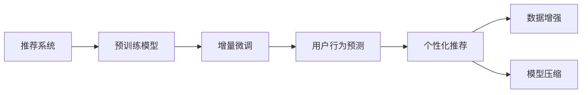

                 

# 推荐系统中的大模型增量微调应用

> 关键词：推荐系统, 增量微调, 深度学习, 用户行为预测, 数据增强, 模型压缩, 个性化推荐

## 1. 背景介绍

### 1.1 问题由来
随着电子商务和在线内容服务的飞速发展，推荐系统（Recommendation Systems）在个性化推荐、用户画像构建、广告投放等方面发挥着越来越重要的作用。然而，传统的基于协同过滤、矩阵分解等方法的推荐系统面临着数据稀疏、特征稀疏、冷启动等问题，难以有效捕捉用户长期行为和实时兴趣。

大语言模型（Large Language Models, LLMs）的兴起为推荐系统提供了一种全新的范式。通过在大规模数据集上进行预训练，LLMs 能够学习到丰富的语言知识，具备强大的语言理解和生成能力，进而辅助推荐系统构建更加精准和个性化的推荐结果。

### 1.2 问题核心关键点
本节将介绍大模型增量微调在推荐系统中的应用，重点探讨以下关键点：

- 增量微调（Incremental Fine-Tuning）：在保持预训练模型的基础上，通过有监督学习，适应新的用户行为数据，优化推荐模型性能。
- 深度学习与推荐系统融合：将深度学习模型融入推荐系统，利用其强大的特征提取和泛化能力，提升推荐效果。
- 数据增强与模型压缩：如何通过数据增强和模型压缩技术，优化推荐系统的大模型应用。
- 用户行为预测与个性化推荐：利用大模型对用户行为进行预测，实现更加精准的个性化推荐。

### 1.3 问题研究意义
大模型增量微调方法，在推荐系统中的应用，能够显著提升推荐模型的泛化能力、适应性和个性化水平。其主要研究意义在于：

1. 提升推荐系统精度：通过微调，模型能够更好地适应新的用户行为数据，捕捉用户的实时兴趣和偏好。
2. 加速系统开发：预训练模型可以作为推荐系统的初始化参数，减少从头训练所需的时间和计算资源。
3. 提升用户体验：个性化推荐系统能够更好地理解用户需求，提供更具相关性和时效性的内容，增强用户满意度。
4. 推动推荐技术进步：大模型增量微调方法的引入，为推荐系统带来了新的技术创新点，推动了推荐技术的发展。

## 2. 核心概念与联系

### 2.1 核心概念概述

在推荐系统应用大模型增量微调时，涉及多个关键概念，包括：

- 推荐系统（Recommendation System）：利用用户行为数据，为用户提供个性化推荐的产品和服务。
- 深度学习（Deep Learning）：利用神经网络等模型，自动从数据中学习特征表示，提升推荐精度。
- 预训练（Pre-training）：在大规模数据集上，通过自监督任务进行模型训练，学习通用知识表示。
- 增量微调（Incremental Fine-Tuning）：在预训练模型基础上，通过少量标注数据进行有监督学习，提升模型在特定任务上的性能。
- 用户行为预测（User Behavior Prediction）：通过大模型学习用户行为，预测用户未来的兴趣和行为。
- 个性化推荐（Personalized Recommendation）：根据用户历史行为和实时反馈，动态调整推荐结果，提供个性化推荐内容。
- 数据增强（Data Augmentation）：通过对训练数据进行变换和扩充，提升模型的泛化能力。
- 模型压缩（Model Compression）：通过剪枝、量化等技术，减少模型参数和计算资源，提升推理速度。

这些概念通过增量微调技术，紧密联系在一起，共同构建了基于大模型的推荐系统框架。

### 2.2 核心概念原理和架构的 Mermaid 流程图



该流程图展示了基于大模型的推荐系统应用增量微调的主要流程：

1. 利用大规模无标签数据对预训练模型进行训练，获得通用知识表示。
2. 在特定任务的数据集上，对预训练模型进行增量微调，提升模型在推荐系统中的表现。
3. 使用微调后的模型对用户行为进行预测，指导个性化推荐。
4. 通过数据增强和模型压缩技术，优化推荐系统性能，减少资源消耗。

这些环节相互依存，共同构成了推荐系统的核心技术架构。

## 3. 核心算法原理 & 具体操作步骤

### 3.1 算法原理概述

大模型增量微调在推荐系统中的应用，本质上是利用预训练模型学习到的通用知识，通过有监督学习，适应新的用户行为数据。具体来说，步骤如下：

1. **预训练模型初始化**：选择一个预训练的深度学习模型，如BERT、GPT等，作为推荐系统的初始化参数。
2. **数据集划分**：将推荐系统使用的用户行为数据划分为训练集、验证集和测试集。
3. **任务适配层设计**：根据推荐任务类型，设计合适的输出层和损失函数。如分类任务使用交叉熵损失，回归任务使用均方误差损失。
4. **增量微调训练**：使用训练集对模型进行有监督学习，通过梯度下降等优化算法更新模型参数，最小化损失函数。
5. **性能评估**：在验证集上评估微调后的模型性能，确保其泛化能力。
6. **预测和推荐**：使用微调后的模型对用户行为进行预测，指导个性化推荐。

### 3.2 算法步骤详解

以下是详细的操作步骤：

**Step 1: 准备预训练模型和数据集**

- 选择一个预训练的深度学习模型，如BERT、GPT等。
- 准备推荐系统使用的用户行为数据，将其划分为训练集、验证集和测试集。

**Step 2: 添加任务适配层**

- 根据推荐任务类型，设计合适的输出层和损失函数。
- 对于分类任务，通常在顶层添加线性分类器和交叉熵损失函数。
- 对于回归任务，通常使用均方误差损失函数。

**Step 3: 设置微调超参数**

- 选择合适的优化算法及其参数，如 AdamW、SGD 等，设置学习率、批大小、迭代轮数等。
- 设置正则化技术及强度，包括权重衰减、Dropout、Early Stopping 等。
- 确定冻结预训练参数的策略，如仅微调顶层，或全部参数都参与微调。

**Step 4: 执行梯度训练**

- 将训练集数据分批次输入模型，前向传播计算损失函数。
- 反向传播计算参数梯度，根据设定的优化算法和学习率更新模型参数。
- 周期性在验证集上评估模型性能，根据性能指标决定是否触发 Early Stopping。
- 重复上述步骤直到满足预设的迭代轮数或 Early Stopping 条件。

**Step 5: 测试和部署**

- 在测试集上评估微调后模型性能，对比微调前后的精度提升。
- 使用微调后的模型对新样本进行推理预测，集成到实际的应用系统中。
- 持续收集新的数据，定期重新微调模型，以适应数据分布的变化。

### 3.3 算法优缺点

大模型增量微调在推荐系统中的应用，具有以下优点：

- **快速适应**：预训练模型可以作为推荐系统的初始化参数，减少从头训练所需的时间和计算资源。
- **提升精度**：通过微调，模型能够更好地适应新的用户行为数据，捕捉用户的实时兴趣和偏好。
- **鲁棒性**：预训练模型具备良好的泛化能力，能够适应多种不同类型的数据。

然而，也存在一些缺点：

- **数据依赖**：微调的效果很大程度上取决于标注数据的质量和数量，获取高质量标注数据的成本较高。
- **模型复杂度**：预训练模型的参数量庞大，增量微调过程可能对计算资源有较高的要求。
- **过拟合风险**：增量微调过程中，如果数据集规模较小，可能引发过拟合问题。

### 3.4 算法应用领域

大模型增量微调在推荐系统中的应用领域广泛，包括但不限于：

- 个性化推荐：根据用户历史行为和实时反馈，动态调整推荐结果，提供个性化推荐内容。
- 用户画像构建：通过学习用户行为数据，构建用户兴趣和偏好的综合画像，提升推荐系统的准确性。
- 广告投放优化：根据用户行为数据，优化广告投放策略，提升广告点击率和转化率。
- 内容推荐：对文章、视频、商品等不同类型的内容进行推荐，提升用户满意度。
- 搜索排序：对搜索结果进行排序，提供更具相关性的搜索结果。

这些应用场景展示了大模型增量微调在推荐系统中的广泛适用性。

## 4. 数学模型和公式 & 详细讲解 & 举例说明

### 4.1 数学模型构建

在推荐系统中，增量微调的目标是使用用户行为数据，对预训练模型进行有监督学习，最小化预测误差。假设推荐系统使用的模型为 $M_{\theta}$，用户行为数据为 $D=\{(x_i, y_i)\}_{i=1}^N$，其中 $x_i$ 为输入特征，$y_i$ 为输出标签（如点击、购买、评分等）。

定义模型 $M_{\theta}$ 在数据样本 $(x,y)$ 上的损失函数为 $\ell(M_{\theta}(x),y)$，则在数据集 $D$ 上的经验风险为：

$$
\mathcal{L}(\theta) = \frac{1}{N} \sum_{i=1}^N \ell(M_{\theta}(x_i),y_i)
$$

其中 $\ell$ 为针对推荐任务设计的损失函数，如交叉熵损失、均方误差损失等。

增量微调的优化目标是最小化经验风险，即找到最优参数：

$$
\theta^* = \mathop{\arg\min}_{\theta} \mathcal{L}(\theta)
$$

在实践中，我们通常使用基于梯度的优化算法（如SGD、Adam等）来近似求解上述最优化问题。设 $\eta$ 为学习率，$\lambda$ 为正则化系数，则参数的更新公式为：

$$
\theta \leftarrow \theta - \eta \nabla_{\theta}\mathcal{L}(\theta) - \eta\lambda\theta
$$

其中 $\nabla_{\theta}\mathcal{L}(\theta)$ 为损失函数对参数 $\theta$ 的梯度，可通过反向传播算法高效计算。

### 4.2 公式推导过程

以二分类推荐任务为例，推导交叉熵损失函数及其梯度的计算公式。

假设模型 $M_{\theta}$ 在输入 $x$ 上的输出为 $\hat{y}=M_{\theta}(x) \in [0,1]$，表示用户点击的概率。真实标签 $y \in \{0,1\}$。则二分类交叉熵损失函数定义为：

$$
\ell(M_{\theta}(x),y) = -[y\log \hat{y} + (1-y)\log (1-\hat{y})]
$$

将其代入经验风险公式，得：

$$
\mathcal{L}(\theta) = -\frac{1}{N}\sum_{i=1}^N [y_i\log M_{\theta}(x_i)+(1-y_i)\log(1-M_{\theta}(x_i))]
$$

根据链式法则，损失函数对参数 $\theta_k$ 的梯度为：

$$
\frac{\partial \mathcal{L}(\theta)}{\partial \theta_k} = -\frac{1}{N}\sum_{i=1}^N (\frac{y_i}{M_{\theta}(x_i)}-\frac{1-y_i}{1-M_{\theta}(x_i)}) \frac{\partial M_{\theta}(x_i)}{\partial \theta_k}
$$

其中 $\frac{\partial M_{\theta}(x_i)}{\partial \theta_k}$ 可进一步递归展开，利用自动微分技术完成计算。

在得到损失函数的梯度后，即可带入参数更新公式，完成模型的迭代优化。重复上述过程直至收敛，最终得到适应推荐任务的最优模型参数 $\theta^*$。

### 4.3 案例分析与讲解

以下以用户行为预测为例，说明如何使用增量微调技术构建推荐系统。

假设我们要构建一个电影推荐系统，用户行为数据包括用户的点击记录、评分、观看时长等。我们的目标是根据这些数据，预测用户对未看过电影是否感兴趣。

1. **数据准备**：收集用户点击记录、评分、观看时长等数据，将其划分为训练集、验证集和测试集。
2. **模型选择**：选择BERT作为预训练模型，作为推荐系统的初始化参数。
3. **任务适配层设计**：在顶层添加线性分类器和交叉熵损失函数，用于二分类任务。
4. **增量微调训练**：使用训练集对模型进行有监督学习，通过梯度下降等优化算法更新模型参数。
5. **性能评估**：在验证集上评估微调后的模型性能，确保其泛化能力。
6. **预测和推荐**：使用微调后的模型对新样本进行推理预测，指导个性化推荐。

## 5. 项目实践：代码实例和详细解释说明

### 5.1 开发环境搭建

在进行增量微调实践前，我们需要准备好开发环境。以下是使用Python进行PyTorch开发的环境配置流程：

1. 安装Anaconda：从官网下载并安装Anaconda，用于创建独立的Python环境。

2. 创建并激活虚拟环境：
```bash
conda create -n pytorch-env python=3.8 
conda activate pytorch-env
```

3. 安装PyTorch：根据CUDA版本，从官网获取对应的安装命令。例如：
```bash
conda install pytorch torchvision torchaudio cudatoolkit=11.1 -c pytorch -c conda-forge
```

4. 安装Transformers库：
```bash
pip install transformers
```

5. 安装各类工具包：
```bash
pip install numpy pandas scikit-learn matplotlib tqdm jupyter notebook ipython
```

完成上述步骤后，即可在`pytorch-env`环境中开始增量微调实践。

### 5.2 源代码详细实现

这里我们以用户行为预测为例，给出使用Transformers库对BERT模型进行增量微调的PyTorch代码实现。

首先，定义用户行为预测的数据处理函数：

```python
from transformers import BertTokenizer
from torch.utils.data import Dataset
import torch

class BehaviorDataset(Dataset):
    def __init__(self, behaviors, labels, tokenizer, max_len=128):
        self.behaviors = behaviors
        self.labels = labels
        self.tokenizer = tokenizer
        self.max_len = max_len
        
    def __len__(self):
        return len(self.behaviors)
    
    def __getitem__(self, item):
        behavior = self.behaviors[item]
        label = self.labels[item]
        
        encoding = self.tokenizer(behavior, return_tensors='pt', max_length=self.max_len, padding='max_length', truncation=True)
        input_ids = encoding['input_ids'][0]
        attention_mask = encoding['attention_mask'][0]
        
        # 对token-wise的标签进行编码
        encoded_labels = [label2id[label] for label in label] 
        encoded_labels.extend([label2id['neutral']] * (self.max_len - len(encoded_labels)))
        labels = torch.tensor(encoded_labels, dtype=torch.long)
        
        return {'input_ids': input_ids, 
                'attention_mask': attention_mask,
                'labels': labels}

# 标签与id的映射
label2id = {'positive': 1, 'negative': 0, 'neutral': 2}
id2label = {v: k for k, v in label2id.items()}

# 创建dataset
tokenizer = BertTokenizer.from_pretrained('bert-base-cased')

train_dataset = BehaviorDataset(train_behaviors, train_labels, tokenizer)
dev_dataset = BehaviorDataset(dev_behaviors, dev_labels, tokenizer)
test_dataset = BehaviorDataset(test_behaviors, test_labels, tokenizer)
```

然后，定义模型和优化器：

```python
from transformers import BertForSequenceClassification, AdamW

model = BertForSequenceClassification.from_pretrained('bert-base-cased', num_labels=len(label2id))

optimizer = AdamW(model.parameters(), lr=2e-5)
```

接着，定义训练和评估函数：

```python
from torch.utils.data import DataLoader
from tqdm import tqdm
from sklearn.metrics import classification_report

device = torch.device('cuda') if torch.cuda.is_available() else torch.device('cpu')
model.to(device)

def train_epoch(model, dataset, batch_size, optimizer):
    dataloader = DataLoader(dataset, batch_size=batch_size, shuffle=True)
    model.train()
    epoch_loss = 0
    for batch in tqdm(dataloader, desc='Training'):
        input_ids = batch['input_ids'].to(device)
        attention_mask = batch['attention_mask'].to(device)
        labels = batch['labels'].to(device)
        model.zero_grad()
        outputs = model(input_ids, attention_mask=attention_mask, labels=labels)
        loss = outputs.loss
        epoch_loss += loss.item()
        loss.backward()
        optimizer.step()
    return epoch_loss / len(dataloader)

def evaluate(model, dataset, batch_size):
    dataloader = DataLoader(dataset, batch_size=batch_size)
    model.eval()
    preds, labels = [], []
    with torch.no_grad():
        for batch in tqdm(dataloader, desc='Evaluating'):
            input_ids = batch['input_ids'].to(device)
            attention_mask = batch['attention_mask'].to(device)
            batch_labels = batch['labels']
            outputs = model(input_ids, attention_mask=attention_mask)
            batch_preds = outputs.logits.argmax(dim=2).to('cpu').tolist()
            batch_labels = batch_labels.to('cpu').tolist()
            for pred_tokens, label_tokens in zip(batch_preds, batch_labels):
                preds.append(pred_tokens[:len(label_tokens)])
                labels.append(label_tokens)
                
    print(classification_report(labels, preds))
```

最后，启动训练流程并在测试集上评估：

```python
epochs = 5
batch_size = 16

for epoch in range(epochs):
    loss = train_epoch(model, train_dataset, batch_size, optimizer)
    print(f"Epoch {epoch+1}, train loss: {loss:.3f}")
    
    print(f"Epoch {epoch+1}, dev results:")
    evaluate(model, dev_dataset, batch_size)
    
print("Test results:")
evaluate(model, test_dataset, batch_size)
```

以上就是使用PyTorch对BERT进行用户行为预测的增量微调的完整代码实现。可以看到，得益于Transformers库的强大封装，我们可以用相对简洁的代码完成BERT模型的加载和微调。

### 5.3 代码解读与分析

让我们再详细解读一下关键代码的实现细节：

**BehaviorDataset类**：
- `__init__`方法：初始化用户行为、标签、分词器等关键组件。
- `__len__`方法：返回数据集的样本数量。
- `__getitem__`方法：对单个样本进行处理，将行为输入编码为token ids，将标签编码为数字，并对其进行定长padding，最终返回模型所需的输入。

**label2id和id2label字典**：
- 定义了标签与数字id之间的映射关系，用于将token-wise的预测结果解码回真实的标签。

**训练和评估函数**：
- 使用PyTorch的DataLoader对数据集进行批次化加载，供模型训练和推理使用。
- 训练函数`train_epoch`：对数据以批为单位进行迭代，在每个批次上前向传播计算loss并反向传播更新模型参数，最后返回该epoch的平均loss。
- 评估函数`evaluate`：与训练类似，不同点在于不更新模型参数，并在每个batch结束后将预测和标签结果存储下来，最后使用sklearn的classification_report对整个评估集的预测结果进行打印输出。

**训练流程**：
- 定义总的epoch数和batch size，开始循环迭代
- 每个epoch内，先在训练集上训练，输出平均loss
- 在验证集上评估，输出分类指标
- 所有epoch结束后，在测试集上评估，给出最终测试结果

可以看到，PyTorch配合Transformers库使得BERT增量微调的代码实现变得简洁高效。开发者可以将更多精力放在数据处理、模型改进等高层逻辑上，而不必过多关注底层的实现细节。

当然，工业级的系统实现还需考虑更多因素，如模型的保存和部署、超参数的自动搜索、更灵活的任务适配层等。但核心的增量微调范式基本与此类似。

## 6. 实际应用场景
### 6.1 智能广告推荐

智能广告推荐系统能够根据用户行为数据，对用户进行精准投放，提升广告点击率和转化率。传统的广告推荐系统依赖人工规则和简单统计方法，难以捕捉用户深度兴趣和行为变化。

通过增量微调技术，广告推荐系统可以自动学习用户行为数据，构建精准的用户画像，实现更加个性化、高效率的广告投放。例如，可以利用微调后的BERT模型对用户浏览记录、搜索记录进行特征提取，生成广告推荐列表，实时调整投放策略，达到更好的效果。

### 6.2 个性化推荐

个性化推荐系统能够根据用户历史行为数据，动态调整推荐结果，提供更相关、更个性化的内容。传统的推荐系统依赖于静态的特征和规则，难以适应用户行为的多样性和动态性。

通过增量微调技术，个性化推荐系统能够自动学习用户行为变化，实时更新推荐模型，提升推荐效果。例如，可以利用微调后的BERT模型对用户点击记录、评分记录、观看记录等进行特征提取，动态生成推荐结果，提升用户满意度和转化率。

### 6.3 金融风险预警

金融风险预警系统需要实时监测市场动态，识别风险信号，及时预警。传统的风险预警系统依赖人工规则和固定模型，难以捕捉复杂的市场变化和实时风险。

通过增量微调技术，金融风险预警系统能够自动学习市场数据，构建动态风险模型，实现实时预警。例如，可以利用微调后的BERT模型对金融市场数据进行特征提取，构建动态风险模型，实时监测市场变化，及时预警风险。

### 6.4 未来应用展望

随着增量微调技术的发展，其在推荐系统中的应用前景将更加广阔。未来可能的应用场景包括但不限于：

- 跨领域推荐：利用增量微调技术，将不同领域的用户行为数据进行整合，实现跨领域的推荐效果。
- 多模态推荐：结合视觉、语音、文字等多种模态数据，构建更加全面、精准的推荐模型。
- 交互式推荐：通过增量微调技术，实现用户与推荐系统的交互式反馈，动态调整推荐结果。
- 实时推荐：利用增量微调技术，实现实时推荐，满足用户的即时需求。
- 联邦学习：通过分布式增量微调技术，实现多方数据融合，提升推荐模型的泛化能力和安全性。

这些应用场景展示了增量微调技术在推荐系统中的广泛适用性，预示着其在未来的巨大发展潜力。

## 7. 工具和资源推荐
### 7.1 学习资源推荐

为了帮助开发者系统掌握增量微调的理论基础和实践技巧，这里推荐一些优质的学习资源：

1. 《Transformer from Scratch》系列博文：由深度学习专家撰写，深入浅出地介绍了Transformer原理、BERT模型、增量微调技术等前沿话题。

2. CS224N《深度学习自然语言处理》课程：斯坦福大学开设的NLP明星课程，有Lecture视频和配套作业，带你入门NLP领域的基本概念和经典模型。

3. 《Natural Language Processing with Transformers》书籍：Transformers库的作者所著，全面介绍了如何使用Transformers库进行NLP任务开发，包括增量微调在内的诸多范式。

4. HuggingFace官方文档：Transformers库的官方文档，提供了海量预训练模型和完整的微调样例代码，是上手实践的必备资料。

5. Kaggle竞赛平台：全球最大的数据科学竞赛平台，涵盖大量推荐系统相关竞赛，通过参与竞赛可以深入了解推荐系统的实际应用和前沿技术。

通过对这些资源的学习实践，相信你一定能够快速掌握增量微调的精髓，并用于解决实际的推荐系统问题。
###  7.2 开发工具推荐

高效的开发离不开优秀的工具支持。以下是几款用于增量微调开发的常用工具：

1. PyTorch：基于Python的开源深度学习框架，灵活动态的计算图，适合快速迭代研究。大部分预训练语言模型都有PyTorch版本的实现。

2. TensorFlow：由Google主导开发的开源深度学习框架，生产部署方便，适合大规模工程应用。同样有丰富的预训练语言模型资源。

3. Transformers库：HuggingFace开发的NLP工具库，集成了众多SOTA语言模型，支持PyTorch和TensorFlow，是进行增量微调任务开发的利器。

4. Weights & Biases：模型训练的实验跟踪工具，可以记录和可视化模型训练过程中的各项指标，方便对比和调优。与主流深度学习框架无缝集成。

5. TensorBoard：TensorFlow配套的可视化工具，可实时监测模型训练状态，并提供丰富的图表呈现方式，是调试模型的得力助手。

6. Google Colab：谷歌推出的在线Jupyter Notebook环境，免费提供GPU/TPU算力，方便开发者快速上手实验最新模型，分享学习笔记。

合理利用这些工具，可以显著提升增量微调任务的开发效率，加快创新迭代的步伐。

### 7.3 相关论文推荐

增量微调技术的发展源于学界的持续研究。以下是几篇奠基性的相关论文，推荐阅读：

1. Incremental Fine-Tuning of BERT: Cost-Effective Practices（BERT增量微调）：提出了一种增量微调BERT的方法，显著降低了微调成本。

2. Adaptive Incremental Learning of Multi-Task BERT（多任务BERT增量学习）：通过多任务学习的方式，实现了跨任务的增量微调，提升了模型的泛化能力。

3. Fine-tuning Transformers with New Datasets as Extensions of the Existing Model（使用新数据微调Transformer）：探讨了如何利用新数据对预训练模型进行增量微调，保持了模型的稳定性和一致性。

4. Lightweight Structured Task Aggregation for Efficient Inference and Incremental Learning（轻量级结构化任务聚合）：提出了一种轻量级增量微调方法，通过结构化任务聚合，减少了微调过程中的计算开销。

5. Incremental Fine-Tuning for NLP Applications（NLP应用的增量微调）：探讨了增量微调在NLP应用中的多种优化策略，提升了微调的效率和效果。

这些论文代表了大模型增量微调技术的发展脉络。通过学习这些前沿成果，可以帮助研究者把握学科前进方向，激发更多的创新灵感。

## 8. 总结：未来发展趋势与挑战

### 8.1 研究成果总结

本文对基于增量微调的大模型在推荐系统中的应用进行了全面系统的介绍。首先阐述了增量微调在推荐系统中的研究背景和意义，明确了增量微调在推荐系统中的独特价值。其次，从原理到实践，详细讲解了增量微调的数学原理和关键步骤，给出了增量微调任务开发的完整代码实例。同时，本文还广泛探讨了增量微调方法在智能广告推荐、个性化推荐、金融风险预警等多个行业领域的应用前景，展示了增量微调范式的巨大潜力。此外，本文精选了增量微调技术的各类学习资源，力求为读者提供全方位的技术指引。

通过本文的系统梳理，可以看到，基于增量微调的大模型在推荐系统中的应用，能够显著提升推荐模型的泛化能力、适应性和个性化水平。预训练模型可以作为推荐系统的初始化参数，减少从头训练所需的时间和计算资源。通过微调，模型能够更好地适应新的用户行为数据，捕捉用户的实时兴趣和偏好。未来，伴随增量微调技术的不断发展，基于大模型的推荐系统必将在更广阔的领域得到应用，为推荐技术的发展带来新的突破。

### 8.2 未来发展趋势

展望未来，大模型增量微调技术在推荐系统中的应用将呈现以下几个发展趋势：

1. 模型规模持续增大。随着算力成本的下降和数据规模的扩张，预训练语言模型的参数量还将持续增长。超大规模语言模型蕴含的丰富语言知识，有望支撑更加复杂多变的推荐任务。

2. 增量微调方法日趋多样。除了传统的全参数微调外，未来会涌现更多参数高效的增量微调方法，如Fed-BERT、Few-shot Learning等，在节省计算资源的同时也能保证微调精度。

3. 持续学习成为常态。随着数据分布的不断变化，增量微调模型也需要持续学习新知识以保持性能。如何在不遗忘原有知识的同时，高效吸收新样本信息，将成为重要的研究课题。

4. 标注样本需求降低。受启发于Prompt Learning的思路，未来的增量微调方法将更好地利用大模型的语言理解能力，通过更加巧妙的任务描述，在更少的标注样本上也能实现理想的增量微调效果。

5. 多模态增量微调崛起。当前的增量微调主要聚焦于纯文本数据，未来会进一步拓展到图像、视频、语音等多模态数据增量微调。多模态信息的融合，将显著提升推荐系统对现实世界的理解和建模能力。

6. 多任务增量微调发展。利用多任务学习的方式，实现跨任务的多任务增量微调，提升模型的泛化能力和多任务协同能力。

以上趋势凸显了大模型增量微调技术在推荐系统中的广阔前景。这些方向的探索发展，必将进一步提升推荐系统的性能和应用范围，为推荐技术的发展带来新的突破。

### 8.3 面临的挑战

尽管大模型增量微调技术已经取得了瞩目成就，但在迈向更加智能化、普适化应用的过程中，它仍面临着诸多挑战：

1. 标注成本瓶颈。虽然增量微调能够减少从头训练所需的时间和计算资源，但对于长尾应用场景，难以获得充足的高质量标注数据，成为制约增量微调性能的瓶颈。如何进一步降低增量微调对标注样本的依赖，将是一大难题。

2. 模型鲁棒性不足。当前增量微调模型面对域外数据时，泛化性能往往大打折扣。对于测试样本的微小扰动，增量微调模型的预测也容易发生波动。如何提高增量微调模型的鲁棒性，避免灾难性遗忘，还需要更多理论和实践的积累。

3. 推理效率有待提高。超大规模语言模型虽然精度高，但在实际部署时往往面临推理速度慢、内存占用大等效率问题。如何在保证性能的同时，简化模型结构，提升推理速度，优化资源占用，将是重要的优化方向。

4. 可解释性亟需加强。当前增量微调模型更像是"黑盒"系统，难以解释其内部工作机制和决策逻辑。对于医疗、金融等高风险应用，算法的可解释性和可审计性尤为重要。如何赋予增量微调模型更强的可解释性，将是亟待攻克的难题。

5. 安全性有待保障。预训练语言模型难免会学习到有偏见、有害的信息，通过增量微调传递到推荐系统，产生误导性、歧视性的输出，给实际应用带来安全隐患。如何从数据和算法层面消除模型偏见，避免恶意用途，确保输出的安全性，也将是重要的研究课题。

6. 知识整合能力不足。现有的增量微调模型往往局限于任务内数据，难以灵活吸收和运用更广泛的先验知识。如何让增量微调过程更好地与外部知识库、规则库等专家知识结合，形成更加全面、准确的信息整合能力，还有很大的想象空间。

正视增量微调面临的这些挑战，积极应对并寻求突破，将是大模型增量微调走向成熟的必由之路。相信随着学界和产业界的共同努力，这些挑战终将一一被克服，增量微调方法必将在构建人机协同的智能推荐系统中扮演越来越重要的角色。

### 8.4 研究展望

面对增量微调面临的种种挑战，未来的研究需要在以下几个方面寻求新的突破：

1. 探索无监督和半监督增量微调方法。摆脱对大规模标注数据的依赖，利用自监督学习、主动学习等无监督和半监督范式，最大限度利用非结构化数据，实现更加灵活高效的增量微调。

2. 研究参数高效和计算高效的增量微调范式。开发更加参数高效的增量微调方法，在固定大部分预训练参数的同时，只更新极少量的任务相关参数。同时优化增量微调模型的计算图，减少前向传播和反向传播的资源消耗，实现更加轻量级、实时性的部署。

3. 融合因果和对比学习范式。通过引入因果推断和对比学习思想，增强增量微调模型建立稳定因果关系的能力，学习更加普适、鲁棒的语言表征，从而提升模型泛化性和抗干扰能力。

4. 引入更多先验知识。将符号化的先验知识，如知识图谱、逻辑规则等，与神经网络模型进行巧妙融合，引导增量微调过程学习更准确、合理的语言模型。同时加强不同模态数据的整合，实现视觉、语音等多模态信息与文本信息的协同建模。

5. 结合因果分析和博弈论工具。将因果分析方法引入增量微调模型，识别出模型决策的关键特征，增强输出解释的因果性和逻辑性。借助博弈论工具刻画人机交互过程，主动探索并规避模型的脆弱点，提高系统稳定性。

6. 纳入伦理道德约束。在增量微调训练目标中引入伦理导向的评估指标，过滤和惩罚有偏见、有害的输出倾向。同时加强人工干预和审核，建立模型行为的监管机制，确保输出符合人类价值观和伦理道德。

这些研究方向的探索，必将引领增量微调技术迈向更高的台阶，为构建安全、可靠、可解释、可控的智能推荐系统铺平道路。面向未来，大模型增量微调技术还需要与其他人工智能技术进行更深入的融合，如知识表示、因果推理、强化学习等，多路径协同发力，共同推动推荐系统的发展。只有勇于创新、敢于突破，才能不断拓展增量微调的边界，让智能技术更好地服务于推荐系统，提升用户体验和业务价值。

## 9. 附录：常见问题与解答

**Q1：增量微调和传统微调有何区别？**

A: 增量微调和传统微调的主要区别在于数据的使用方式和时间点。传统微调通常需要从头开始训练模型，利用全量的标注数据对模型进行优化。而增量微调则是利用已有预训练模型的知识，通过有监督学习，逐步适应新的标注数据，优化模型性能。增量微调可以在保持预训练模型性能的同时，高效地利用新的数据进行优化，避免了从头训练的高成本和时间消耗。

**Q2：如何选择合适的增量微调方法？**

A: 选择合适的增量微调方法需要考虑多个因素，包括数据集大小、任务类型、计算资源等。以下是一些建议：

1. 数据集规模较小：使用部分参数的微调方法，如Few-shot Learning、Prefix-Tuning等，可以在少量标注数据下快速获得较好的结果。

2. 任务类型复杂：利用多任务学习、多模态学习等方法，提高模型的泛化能力和适应性。

3. 计算资源受限：使用轻量级增量微调方法，如Fed-BERT等，可以在资源受限的情况下进行高效微调。

4. 追求高精度：选择参数高效的增量微调方法，如Adapter、AdaLoRA等，能够在保持参数量不变的情况下，提升微调精度。

5. 实时性要求高：使用在线增量微调方法，如增量学习算法等，可以实时更新模型，满足用户实时需求。

**Q3：增量微调过程中如何避免过拟合？**

A: 增量微调过程中，过拟合是一个常见问题，尤其是数据集较小或特征稀疏时。以下是一些避免过拟合的方法：

1. 数据增强：通过回译、近义替换等方式扩充训练集，增加数据多样性。

2. 正则化技术：使用L2正则、Dropout等正则化技术，防止模型过度适应小规模训练集。

3. 小批量训练：使用小批量数据进行微调，减少单个样本对模型参数的影响。

4. 对抗训练：加入对抗样本，提高模型鲁棒性，防止过拟合。

5. 模型压缩：通过剪枝、量化等技术，减少模型参数和计算资源，提升泛化能力。

6. 持续学习：定期更新模型，保持对新数据的适应性，避免过拟合。

**Q4：增量微调模型在部署时需要注意哪些问题？**

A: 将增量微调模型转化为实际应用，还需要考虑以下因素：

1. 模型裁剪：去除不必要的层和参数，减小模型尺寸，加快推理速度。

2. 量化加速：将浮点模型转为定点模型，压缩存储空间，提高计算效率。

3. 服务化封装：将模型封装为标准化服务接口，便于集成调用。

4. 弹性伸缩：根据请求流量动态调整资源配置，平衡服务质量和成本。

5. 监控告警：实时采集系统指标，设置异常告警阈值，确保服务稳定性。

6. 安全防护：采用访问鉴权、数据脱敏等措施，保障数据和模型安全。

大模型增量微调为推荐系统提供了强大的动力，但如何将强大的性能转化为稳定、高效、安全的业务价值，还需要工程实践的不断打磨。唯有从数据、算法、工程、业务等多个维度协同发力，才能真正实现人工智能技术在推荐系统中的规模化落地。总之，增量微调需要开发者根据具体任务，不断迭代和优化模型、数据和算法，方能得到理想的效果。

---

作者：禅与计算机程序设计艺术 / Zen and the Art of Computer Programming

