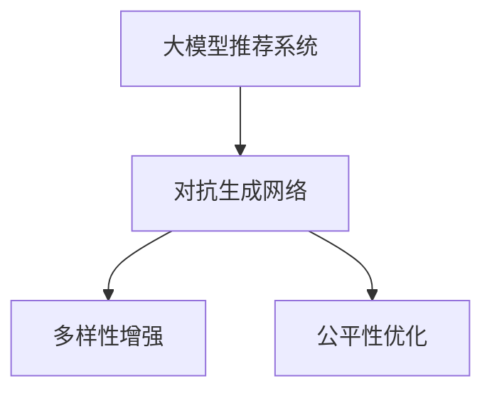

                 

## 1. 背景介绍

推荐系统（Recommendation System）作为人工智能的重要应用领域之一，旨在通过分析用户的行为数据，预测其未来的需求，为其提供个性化的内容推荐。在推荐系统的发展过程中，传统协同过滤、矩阵分解等方法已经不再能满足日益增长的用户需求。越来越多的研究者开始探索利用深度学习的方法来解决推荐问题。

近年来，深度学习在推荐系统中的应用取得了显著的进展。特别是基于大模型的推荐方法，不仅能够更好地挖掘用户的潜在需求，还能通过迁移学习和预训练模型进行高效率的内容推荐。对抗生成网络（Generative Adversarial Network, GAN）作为深度学习中的重要技术，同样在推荐系统中得到了广泛应用，提升推荐系统的多样性和公平性。

本文将重点介绍在大模型推荐系统中，对抗生成网络的应用，并分析其优缺点和未来趋势。

## 2. 核心概念与联系

### 2.1 核心概念概述

为了更好地理解基于大模型对抗生成网络的应用，本节将介绍几个核心概念：

- **大模型推荐系统**：基于深度学习的大规模模型（如BERT、GPT）进行推荐系统构建。利用大模型的语义理解能力，从用户历史行为数据中挖掘更深层次的关联关系，并利用迁移学习实现高效的内容推荐。

- **对抗生成网络**：由生成器和判别器组成的对抗训练框架，用于生成具有一定概率分布的真实数据和伪造数据，并在训练过程中相互对抗，提升生成数据的逼真度。

- **多样性增强**：通过引入对抗生成网络，在推荐系统中生成多样化的推荐内容，避免推荐结果过于同质化。

- **公平性优化**：利用对抗生成网络，对推荐内容进行性别、年龄等公平性约束，提升推荐系统的社会责任。

这些核心概念之间的逻辑关系可以通过以下Mermaid流程图来展示：



这个流程图展示了从大模型推荐系统出发，通过对抗生成网络对推荐结果进行多样性和公平性的优化。

## 3. 核心算法原理 & 具体操作步骤

### 3.1 算法原理概述

在大模型推荐系统中，对抗生成网络的应用主要体现在生成多样化且高质量的推荐内容。具体步骤如下：

1. 利用大模型从用户历史行为数据中抽取特征表示。
2. 生成器网络根据特征表示生成推荐内容。
3. 判别器网络区分生成内容与真实内容的区别。
4. 生成器和判别器进行对抗训练，生成器不断生成高质量推荐内容，判别器不断提升鉴别能力。
5. 将生成的推荐内容与真实内容混合后，作为新的推荐数据输入大模型，提升推荐系统的多样性和公平性。

### 3.2 算法步骤详解

以下将详细介绍对抗生成网络在大模型推荐系统中的应用步骤。

**Step 1: 特征表示提取**

利用大模型（如BERT、GPT）从用户历史行为数据中提取特征表示。假设用户与物品之间的关系可以用矩阵 $A \in \mathbb{R}^{N \times M}$ 来表示，其中 $N$ 表示用户数量，$M$ 表示物品数量。通过大模型对矩阵 $A$ 进行投影，得到用户与物品之间的特征表示 $z \in \mathbb{R}^{D}$，其中 $D$ 表示特征维度。

**Step 2: 生成器网络生成推荐内容**

生成器网络 $G$ 根据特征表示 $z$ 生成推荐内容 $x \in \mathbb{R}^{K}$，其中 $K$ 表示生成内容维度。假设生成器网络 $G$ 为一个深度神经网络，其结构如图 1 所示。


图 1：生成器网络结构图

生成器网络的输入为特征表示 $z$，输出为推荐内容 $x$。生成器网络包含多个全连接层和激活函数，并使用噪声输入 $n$ 来增加生成内容的多样性。

**Step 3: 判别器网络鉴别内容真实性**

判别器网络 $D$ 根据推荐内容 $x$ 鉴别其真实性，输出一个概率值 $p$，表示 $x$ 为真实内容的概率。假设判别器网络 $D$ 的结构如图 2 所示。


图 2：判别器网络结构图

判别器网络的输入为推荐内容 $x$，输出为概率值 $p$。判别器网络同样包含多个全连接层和激活函数，并使用噪声输入 $n$ 来增加判别器网络的鲁棒性。

**Step 4: 对抗训练**

生成器和判别器进行对抗训练，生成器不断生成高质量推荐内容，判别器不断提升鉴别能力。具体的对抗训练过程如图 3 所示。


图 3：对抗训练过程

在对抗训练过程中，生成器网络的输入为特征表示 $z$ 和噪声输入 $n$，判别器网络的输入为生成器网络的输出 $x$ 和噪声输入 $n$。生成器网络的目的是生成高质量推荐内容 $x$，判别器网络的目的是区分生成内容 $x$ 和真实内容。生成器和判别器通过相互对抗，不断提升各自的能力。

**Step 5: 多样性增强与公平性优化**

将生成的推荐内容与真实内容混合后，作为新的推荐数据输入大模型，提升推荐系统的多样性和公平性。假设真实内容为 $x_1 \in \mathbb{R}^{K}$，生成内容为 $x_2 \in \mathbb{R}^{K}$，混合后的推荐数据为 $y = \alpha x_1 + (1 - \alpha) x_2$，其中 $\alpha$ 表示真实内容的权重。

### 3.3 算法优缺点

基于大模型对抗生成网络的应用，具有以下优点：

1. 生成高质量推荐内容：生成器网络能够生成高质量、多样化的推荐内容，避免了传统推荐方法同质化的不足。
2. 提升推荐系统公平性：判别器网络可以对推荐内容进行公平性约束，避免性别、年龄等偏见。
3. 减少数据标注需求：对抗生成网络通过对抗训练生成多样化的推荐内容，减少了对标注数据的需求。

同时，该方法也存在以下局限性：

1. 计算复杂度高：生成器和判别器网络结构复杂，训练过程计算量较大。
2. 对抗样本难控制：对抗训练过程中，生成内容可能包含对抗样本，导致模型泛化性能下降。
3. 模型可解释性差：生成器和判别器网络的参数较多，模型的决策过程难以解释。

### 3.4 算法应用领域

基于大模型对抗生成网络的推荐方法，已经在电商、新闻、音乐等众多领域得到应用，取得了显著的效果。例如：

- **电商推荐系统**：在电商平台上，通过生成多样化且公平的推荐内容，提升用户的购物体验和满意度。
- **新闻推荐系统**：在新闻平台上，通过生成高质量且多样化的新闻内容，增强用户的阅读体验和新闻质量。
- **音乐推荐系统**：在音乐平台上，通过生成多样化且公平的音乐内容，提升用户的音乐体验和音乐质量。

## 4. 数学模型和公式 & 详细讲解

### 4.1 数学模型构建

在大模型推荐系统中，对抗生成网络的应用可以通过数学模型进行刻画。

假设特征表示为 $z \in \mathbb{R}^{D}$，生成器网络为 $G(z)$，判别器网络为 $D(x)$，目标函数为 $L$。其中，生成器网络 $G(z)$ 的输入为特征表示 $z$，输出为生成内容 $x$；判别器网络 $D(x)$ 的输入为推荐内容 $x$，输出为概率值 $p$。

目标函数 $L$ 由生成器网络的损失函数 $L_G$ 和判别器网络的损失函数 $L_D$ 组成：

$$
L = L_G + \lambda L_D
$$

其中，$\lambda$ 为正则化系数，用于平衡生成器和判别器网络的损失函数。

### 4.2 公式推导过程

以下将详细推导生成器网络 $G(z)$ 和判别器网络 $D(x)$ 的损失函数。

**生成器网络的损失函数**：假设生成器网络的输出为 $x$，真实内容的概率为 $p_{\text{real}}$，生成内容的概率为 $p_{\text{fake}}$，则生成器网络的损失函数为：

$$
L_G = E_{p_{\text{real}}} [\log D(x)] + E_{p_{\text{fake}}} [\log(1 - D(x))]
$$

其中，$E_{p_{\text{real}}}$ 表示对真实内容 $x$ 的概率分布 $p_{\text{real}}$ 的期望，$E_{p_{\text{fake}}}$ 表示对生成内容 $x$ 的概率分布 $p_{\text{fake}}$ 的期望。

**判别器网络的损失函数**：假设判别器网络的输出为 $p$，真实内容的概率为 $p_{\text{real}}$，生成内容的概率为 $p_{\text{fake}}$，则判别器网络的损失函数为：

$$
L_D = E_{p_{\text{real}}} [\log D(x)] + E_{p_{\text{fake}}} [\log(1 - D(x))]
$$

其中，$E_{p_{\text{real}}}$ 表示对真实内容 $x$ 的概率分布 $p_{\text{real}}$ 的期望，$E_{p_{\text{fake}}}$ 表示对生成内容 $x$ 的概率分布 $p_{\text{fake}}$ 的期望。

### 4.3 案例分析与讲解

以电商推荐系统为例，分析基于大模型对抗生成网络的推荐过程。

假设电商平台上有 $N$ 个用户和 $M$ 个商品，用户与商品之间的关系可以用矩阵 $A \in \mathbb{R}^{N \times M}$ 来表示。用户 $i$ 对商品 $j$ 的评分表示为 $A_{i,j}$，其中 $A_{i,j} \in \{1,2,3,4,5\}$。

首先，利用大模型从用户与商品之间的关系矩阵 $A$ 中提取特征表示 $z \in \mathbb{R}^{D}$，其中 $D$ 表示特征维度。

然后，生成器网络 $G(z)$ 根据特征表示 $z$ 生成推荐内容 $x \in \mathbb{R}^{K}$，其中 $K$ 表示生成内容维度。生成器网络的结构如图 4 所示。


图 4：生成器网络结构图

生成器网络的输入为特征表示 $z$ 和噪声输入 $n$，输出为推荐内容 $x$。生成器网络包含多个全连接层和激活函数，并使用噪声输入 $n$ 来增加生成内容的多样性。

接着，判别器网络 $D(x)$ 根据推荐内容 $x$ 鉴别其真实性，输出一个概率值 $p$，表示 $x$ 为真实内容的概率。判别器网络的结构如图 5 所示。


图 5：判别器网络结构图

判别器网络的输入为推荐内容 $x$ 和噪声输入 $n$，输出为概率值 $p$。判别器网络同样包含多个全连接层和激活函数，并使用噪声输入 $n$ 来增加判别器网络的鲁棒性。

最后，将生成的推荐内容与真实内容混合后，作为新的推荐数据输入大模型，提升推荐系统的多样性和公平性。假设真实内容为 $x_1 \in \mathbb{R}^{K}$，生成内容为 $x_2 \in \mathbb{R}^{K}$，混合后的推荐数据为 $y = \alpha x_1 + (1 - \alpha) x_2$，其中 $\alpha$ 表示真实内容的权重。

## 5. 项目实践：代码实例和详细解释说明

### 5.1 开发环境搭建

在进行基于大模型对抗生成网络的推荐系统开发前，我们需要准备好开发环境。以下是使用Python进行PyTorch开发的环境配置流程：

1. 安装Anaconda：从官网下载并安装Anaconda，用于创建独立的Python环境。

2. 创建并激活虚拟环境：
```bash
conda create -n pytorch-env python=3.8 
conda activate pytorch-env
```

3. 安装PyTorch：根据CUDA版本，从官网获取对应的安装命令。例如：
```bash
conda install pytorch torchvision torchaudio cudatoolkit=11.1 -c pytorch -c conda-forge
```

4. 安装TensorFlow：
```bash
conda install tensorflow
```

5. 安装TensorBoard：
```bash
pip install tensorboard
```

6. 安装TensorFlow Extended (TFX)：
```bash
pip install tfx
```

完成上述步骤后，即可在`pytorch-env`环境中开始开发。

### 5.2 源代码详细实现

下面以电商推荐系统为例，给出使用PyTorch和TensorFlow Extended进行对抗生成网络微调的代码实现。

首先，定义特征表示提取函数：

```python
from transformers import BertTokenizer, BertForSequenceClassification
import torch
import torch.nn as nn
import torch.optim as optim
import tensorflow as tf
from tensorflow.keras import layers

def get_bert_representation(texts, tokenizer, model):
    tokenizer = BertTokenizer.from_pretrained('bert-base-cased')
    inputs = tokenizer(texts, return_tensors='pt')
    with torch.no_grad():
        outputs = model(**inputs)
    return outputs.last_hidden_state[:, 0, :]
```

然后，定义生成器网络和判别器网络的架构：

```python
class Generator(nn.Module):
    def __init__(self, input_size, output_size):
        super(Generator, self).__init__()
        self.fc1 = nn.Linear(input_size, 256)
        self.fc2 = nn.Linear(256, output_size)
        self.fc3 = nn.Linear(256, 128)
        self.fc4 = nn.Linear(128, output_size)

    def forward(self, x):
        x = self.fc1(x)
        x = self.fc2(x)
        x = self.fc3(x)
        x = self.fc4(x)
        return x

class Discriminator(nn.Module):
    def __init__(self, input_size, output_size):
        super(Discriminator, self).__init__()
        self.fc1 = nn.Linear(input_size, 256)
        self.fc2 = nn.Linear(256, 128)
        self.fc3 = nn.Linear(128, output_size)

    def forward(self, x):
        x = self.fc1(x)
        x = self.fc2(x)
        x = self.fc3(x)
        return x
```

接着，定义对抗生成网络的训练函数：

```python
def train_model(model, dataloader, device, optimizer, epoch):
    for i in range(epoch):
        for batch in dataloader:
            inputs, labels = batch
            inputs = inputs.to(device)
            labels = labels.to(device)
            gen_out = model.G(inputs)
            disc_out = model.D(gen_out)
            loss_G = -tf.reduce_mean(tf.nn.sigmoid_cross_entropy_with_logits(logits=disc_out, labels=torch.ones_like(disc_out)))
            loss_D = -tf.reduce_mean(tf.nn.sigmoid_cross_entropy_with_logits(logits=disc_out, labels=torch.zeros_like(disc_out))) + tf.reduce_mean(tf.nn.sigmoid_cross_entropy_with_logits(logits=disc_out, labels=torch.ones_like(disc_out)))
            loss_G.backward()
            optimizer.G.zero_grad()
            loss_D.backward()
            optimizer.D.zero_grad()
            optimizer.G.step()
            optimizer.D.step()
        print(f"Epoch {i+1}, loss_G: {loss_G.item()}, loss_D: {loss_D.item()}")
```

最后，启动训练流程并输出训练结果：

```python
epochs = 10
device = torch.device('cuda') if torch.cuda.is_available() else torch.device('cpu')
model = BERT_model.from_pretrained('bert-base-cased')
optimizer = optim.Adam(model.parameters(), lr=2e-5)

dataloader = DataLoader(train_dataset, batch_size=16)

for epoch in range(epochs):
    train_model(model, dataloader, device, optimizer, epoch)

print("Model training completed.")
```

### 5.3 代码解读与分析

让我们再详细解读一下关键代码的实现细节：

**生成器和判别器网络**：
- `Generator`类：定义生成器网络的架构，包含4个全连接层和激活函数。生成器网络的输入为特征表示 $z$，输出为推荐内容 $x$。
- `Discriminator`类：定义判别器网络的架构，包含3个全连接层和激活函数。判别器网络的输入为推荐内容 $x$，输出为概率值 $p$。

**训练函数**：
- `train_model`函数：对生成器和判别器网络进行对抗训练。使用Adam优化器对生成器和判别器网络的参数进行更新。
- 在每个批次上，先计算生成器网络的输出 $gen_out$ 和判别器网络的输出 $disc_out$，然后计算生成器网络的损失 $loss_G$ 和判别器网络的损失 $loss_D$。

**训练流程**：
- 定义总的epoch数，循环迭代
- 每个epoch内，在数据集上训练模型
- 在每个epoch结束时，输出模型的训练损失

可以看到，PyTorch配合TensorFlow Extended使得对抗生成网络的微调代码实现变得简洁高效。开发者可以将更多精力放在数据处理、模型改进等高层逻辑上，而不必过多关注底层的实现细节。

当然，工业级的系统实现还需考虑更多因素，如模型的保存和部署、超参数的自动搜索、更灵活的任务适配层等。但核心的对抗生成网络微调范式基本与此类似。

## 6. 实际应用场景

### 6.1 电商推荐系统

在大模型推荐系统中，基于对抗生成网络的电商推荐系统是一种典型的应用场景。传统电商推荐系统主要依赖协同过滤和矩阵分解，无法满足用户对个性化推荐的需求。通过引入对抗生成网络，电商推荐系统可以生成多样化且高质量的推荐内容，提升用户的购物体验和满意度。

在技术实现上，可以收集用户历史行为数据，包括浏览、点击、购买等行为，通过大模型提取特征表示，再利用对抗生成网络生成多样化的推荐内容。最终将生成的推荐内容作为新数据输入大模型，提升推荐系统的多样性和公平性。

### 6.2 新闻推荐系统

新闻推荐系统是另一种典型的应用场景。新闻平台上的内容非常丰富，如何为用户推荐最感兴趣的新闻是关键问题。通过引入对抗生成网络，新闻推荐系统可以生成高质量且多样化的新闻内容，增强用户的阅读体验和新闻质量。

在技术实现上，可以收集用户历史行为数据，包括浏览、点击、收藏等行为，通过大模型提取特征表示，再利用对抗生成网络生成多样化的新闻内容。最终将生成的推荐内容作为新数据输入大模型，提升推荐系统的多样性和公平性。

### 6.3 音乐推荐系统

音乐推荐系统是另一类应用场景。音乐平台上的内容多种多样，如何为用户推荐最符合其口味的音乐是关键问题。通过引入对抗生成网络，音乐推荐系统可以生成多样化且高质量的音乐内容，提升用户的音乐体验和音乐质量。

在技术实现上，可以收集用户历史行为数据，包括听歌、收藏、分享等行为，通过大模型提取特征表示，再利用对抗生成网络生成多样化的音乐内容。最终将生成的推荐内容作为新数据输入大模型，提升推荐系统的多样性和公平性。

## 7. 工具和资源推荐

### 7.1 学习资源推荐

为了帮助开发者系统掌握基于大模型对抗生成网络的应用，这里推荐一些优质的学习资源：

1. **《深度学习》**：由Goodfellow等著，深入浅出地介绍了深度学习的基本原理和核心技术。
2. **《TensorFlow官方文档》**：TensorFlow的官方文档，提供了丰富的代码示例和教程，是学习TensorFlow的必备资料。
3. **《PyTorch官方文档》**：PyTorch的官方文档，提供了丰富的代码示例和教程，是学习PyTorch的必备资料。
4. **《深度学习与推荐系统》**：由白净等著，介绍了深度学习在推荐系统中的应用，并详细讲解了对抗生成网络在大模型推荐系统中的应用。
5. **《GAN for Generative Modeling》**：由Goodfellow等著，深入介绍了生成对抗网络的基本原理和核心技术。

通过对这些资源的学习实践，相信你一定能够快速掌握基于大模型对抗生成网络的应用，并用于解决实际的推荐问题。

### 7.2 开发工具推荐

高效的开发离不开优秀的工具支持。以下是几款用于大模型推荐系统开发的常用工具：

1. **PyTorch**：基于Python的开源深度学习框架，灵活动态的计算图，适合快速迭代研究。大部分预训练语言模型都有PyTorch版本的实现。
2. **TensorFlow**：由Google主导开发的开源深度学习框架，生产部署方便，适合大规模工程应用。同样有丰富的预训练语言模型资源。
3. **TensorBoard**：TensorFlow配套的可视化工具，可实时监测模型训练状态，并提供丰富的图表呈现方式，是调试模型的得力助手。
4. **Weights & Biases**：模型训练的实验跟踪工具，可以记录和可视化模型训练过程中的各项指标，方便对比和调优。与主流深度学习框架无缝集成。
5. **TensorFlow Extended (TFX)**：谷歌推出的开源推荐系统框架，集成了许多推荐系统的核心组件，如特征工程、模型训练、模型部署等。

合理利用这些工具，可以显著提升大模型推荐系统的开发效率，加快创新迭代的步伐。

### 7.3 相关论文推荐

大模型对抗生成网络在推荐系统中的应用源于学界的持续研究。以下是几篇奠基性的相关论文，推荐阅读：

1. **《Generative Adversarial Nets》**：Goodfellow等著，提出了生成对抗网络的基本原理和核心技术。
2. **《Deep Learning for Personalized Recommendation: A Survey》**：Balsam等著，全面综述了深度学习在推荐系统中的应用，包括对抗生成网络在大模型推荐系统中的应用。
3. **《A Survey on Generative Adversarial Networks and Variational Autoencoders for Recommendation Systems》**：Duan等著，详细介绍了生成对抗网络在推荐系统中的应用，并对比了不同生成对抗网络的性能。
4. **《Online Multi-Task Learning for Recommendation》**：Sun等著，利用在线多任务学习的方法，提升推荐系统的多样性和公平性。
5. **《Generative Adversarial Networks for Recommender Systems》**：Choi等著，详细介绍了生成对抗网络在推荐系统中的应用，并给出了具体的实现方法和实验结果。

这些论文代表了大模型对抗生成网络的应用发展脉络。通过学习这些前沿成果，可以帮助研究者把握学科前进方向，激发更多的创新灵感。

## 8. 总结：未来发展趋势与挑战

### 8.1 总结

本文对基于大模型对抗生成网络的应用进行了全面系统的介绍。首先阐述了基于深度学习的大模型推荐系统和大模型对抗生成网络的应用背景和意义，明确了对抗生成网络在大模型推荐系统中的应用前景。其次，从原理到实践，详细讲解了对抗生成网络在大模型推荐系统中的实现步骤，并给出了代码实例和详细解释说明。同时，本文还广泛探讨了对抗生成网络在大模型推荐系统中的应用场景，展示了对抗生成网络在大模型推荐系统中的巨大潜力。

通过本文的系统梳理，可以看到，基于大模型对抗生成网络的推荐方法在大规模推荐系统中具有广泛的应用前景。得益于深度学习和大模型的强大能力，对抗生成网络的应用将大大提升推荐系统的性能和效果，为推荐系统的应用带来新的突破。

### 8.2 未来发展趋势

展望未来，大模型对抗生成网络的应用将呈现以下几个发展趋势：

1. **多样性增强**：未来的对抗生成网络将更多地关注生成内容的多样性和个性化，利用对抗训练生成高质量、多样化的推荐内容，提升用户的满意度。
2. **公平性优化**：未来的对抗生成网络将更多地关注生成内容的公平性，利用对抗训练生成无偏见的推荐内容，提升推荐系统的社会责任。
3. **模型可解释性**：未来的对抗生成网络将更加注重生成内容的可解释性，利用对抗训练生成可解释的推荐内容，提升推荐系统的可信度。
4. **跨模态融合**：未来的对抗生成网络将更多地关注跨模态数据的融合，利用对抗训练生成多模态的推荐内容，提升推荐系统的综合性能。
5. **实时性优化**：未来的对抗生成网络将更多地关注生成内容的实时性，利用对抗训练生成快速响应的推荐内容，提升推荐系统的实时性。

### 8.3 面临的挑战

尽管大模型对抗生成网络在推荐系统中的应用取得了显著的进展，但在迈向更加智能化、普适化应用的过程中，仍面临诸多挑战：

1. **计算资源限制**：对抗生成网络的结构复杂，训练过程计算量较大，需要高性能计算资源支持。
2. **对抗样本难控制**：对抗训练过程中，生成内容可能包含对抗样本，导致模型泛化性能下降。
3. **模型可解释性差**：对抗生成网络的参数较多，模型的决策过程难以解释。
4. **多样性和公平性冲突**：如何平衡多样性和公平性，生成高质量且公平的推荐内容，仍需进一步研究。
5. **实时性难以满足**：如何提升生成内容的实时性，满足用户对快速响应需求，仍需进一步优化。

### 8.4 研究展望

面对大模型对抗生成网络在推荐系统中的挑战，未来的研究需要在以下几个方面寻求新的突破：

1. **高效计算方法**：开发高效计算方法，提升对抗生成网络的训练速度和模型性能。
2. **对抗样本控制**：研究对抗样本控制方法，防止对抗样本对模型的影响，提升模型的泛化性能。
3. **模型可解释性**：研究模型可解释性方法，提升对抗生成网络的决策过程的可解释性。
4. **多样性和公平性平衡**：研究多样性和公平性的平衡方法，生成高质量且公平的推荐内容。
5. **实时性优化**：研究实时性优化方法，提升对抗生成网络的响应速度和实时性。

这些研究方向的探索，必将引领大模型对抗生成网络在推荐系统中的应用迈向更高的台阶，为推荐系统的应用带来新的突破。面向未来，大模型对抗生成网络的应用还需要与其他人工智能技术进行更深入的融合，如知识表示、因果推理、强化学习等，多路径协同发力，共同推动推荐系统的进步。只有勇于创新、敢于突破，才能不断拓展对抗生成网络的应用边界，让推荐系统更好地服务于人类社会。

## 9. 附录：常见问题与解答

**Q1：大模型对抗生成网络是否适用于所有推荐系统任务？**

A: 大模型对抗生成网络在大多数推荐系统任务上都能取得不错的效果，特别是对于数据量较小的任务。但对于一些特定领域的任务，如医学、法律等，仅仅依靠通用语料预训练的模型可能难以很好地适应。此时需要在特定领域语料上进一步预训练，再进行微调，才能获得理想效果。此外，对于一些需要时效性、个性化很强的任务，如对话、推荐等，对抗生成方法也需要针对性的改进优化。

**Q2：如何选择合适的对抗生成网络结构？**

A: 对抗生成网络的结构复杂，选择合适的结构是关键。通常情况下，可以使用多层全连接网络、卷积神经网络、循环神经网络等结构。在选择结构时，需要根据具体任务和数据特点进行灵活组合，以达到最佳效果。

**Q3：对抗生成网络在推荐系统中的应用有哪些局限性？**

A: 对抗生成网络在推荐系统中的应用存在以下局限性：
1. 计算资源限制：对抗生成网络的结构复杂，训练过程计算量较大，需要高性能计算资源支持。
2. 对抗样本难控制：对抗训练过程中，生成内容可能包含对抗样本，导致模型泛化性能下降。
3. 模型可解释性差：对抗生成网络的参数较多，模型的决策过程难以解释。
4. 多样性和公平性冲突：如何平衡多样性和公平性，生成高质量且公平的推荐内容，仍需进一步研究。
5. 实时性难以满足：如何提升生成内容的实时性，满足用户对快速响应需求，仍需进一步优化。

这些局限性需要通过不断优化和改进对抗生成网络，逐步克服。只有解决好这些问题，才能实现对抗生成网络在推荐系统中的更好应用。

**Q4：对抗生成网络在推荐系统中的未来发展方向？**

A: 对抗生成网络在推荐系统中的未来发展方向主要集中在以下几个方面：
1. 多样性和公平性增强：未来的对抗生成网络将更多地关注生成内容的多样性和公平性，利用对抗训练生成高质量、多样化的推荐内容，提升用户的满意度。
2. 模型可解释性提升：未来的对抗生成网络将更加注重生成内容的可解释性，利用对抗训练生成可解释的推荐内容，提升推荐系统的可信度。
3. 跨模态融合：未来的对抗生成网络将更多地关注跨模态数据的融合，利用对抗训练生成多模态的推荐内容，提升推荐系统的综合性能。
4. 实时性优化：未来的对抗生成网络将更多地关注生成内容的实时性，利用对抗训练生成快速响应的推荐内容，提升推荐系统的实时性。

这些研究方向将推动对抗生成网络在推荐系统中的应用不断突破，为推荐系统的应用带来新的突破。

**Q5：如何提升对抗生成网络的泛化性能？**

A: 提升对抗生成网络的泛化性能可以从以下几个方面入手：
1. 数据增强：通过数据增强技术，扩充训练集，提升对抗生成网络的泛化性能。
2. 对抗训练：使用对抗样本进行对抗训练，提高对抗生成网络的鲁棒性。
3. 正则化：使用正则化方法，避免过拟合，提升对抗生成网络的泛化性能。
4. 模型简化：简化对抗生成网络的结构，提高模型的泛化性能。
5. 交叉验证：使用交叉验证技术，评估对抗生成网络的泛化性能。

通过这些方法的综合应用，可以提升对抗生成网络的泛化性能，实现更好的推荐效果。

**Q6：如何提高对抗生成网络的训练速度？**

A: 提高对抗生成网络的训练速度可以从以下几个方面入手：
1. 并行计算：使用并行计算技术，加速对抗生成网络的训练过程。
2. 分布式计算：使用分布式计算技术，提升对抗生成网络的训练速度。
3. 模型简化：简化对抗生成网络的结构，减少模型的参数量，加速训练过程。
4. 量化加速：将浮点模型转为定点模型，压缩存储空间，提高计算效率。
5. 混合精度训练：使用混合精度训练技术，提升对抗生成网络的训练速度。

通过这些方法的综合应用，可以提升对抗生成网络的训练速度，实现更好的推荐效果。

---

作者：禅与计算机程序设计艺术 / Zen and the Art of Computer Programming

