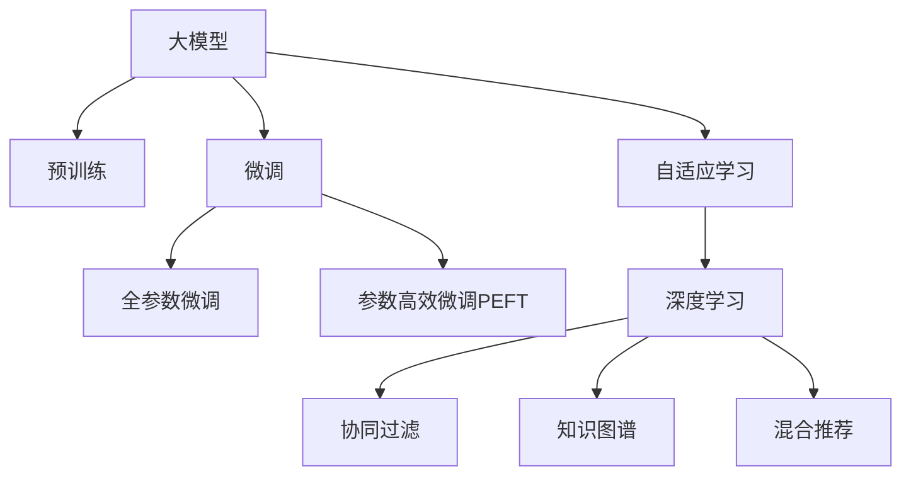
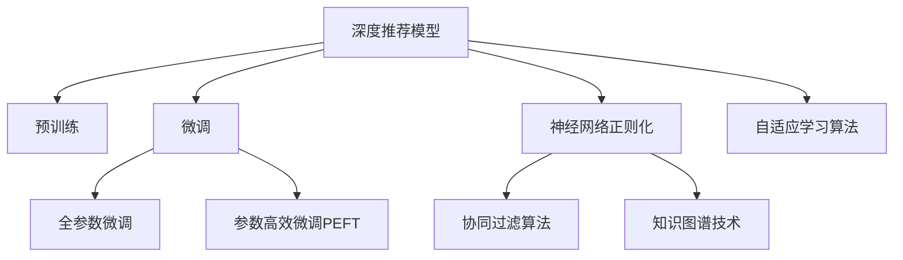

                 

# 推荐系统中的大模型自适应学习

> 关键词：推荐系统, 大模型, 自适应学习, 深度学习, 协同过滤, 神经网络

## 1. 背景介绍

### 1.1 问题由来

推荐系统是互联网时代最具代表性的应用之一，其目标是根据用户的历史行为和兴趣偏好，为用户推荐感兴趣的物品，如商品、新闻、视频等。传统的推荐系统主要基于协同过滤、内容推荐等方法，依靠用户和物品间的隐式关联，提供个性化的推荐服务。

然而，随着数据量的爆炸式增长和计算能力的飞速提升，深度学习技术逐渐成为推荐系统的有力工具。大模型（如BERT、GPT等）由于其强大的表征能力，被广泛应用于推荐场景中，提升了推荐的个性化和精准度。

尽管大模型在推荐系统中的应用效果显著，但在大模型微调、训练和部署等环节，仍面临诸多挑战。其中，如何有效地利用大模型知识，结合用户数据，进行自适应学习，是推荐系统应用中的关键问题。

### 1.2 问题核心关键点

为了更深入地理解推荐系统中的大模型自适应学习，本节将详细介绍几个核心概念：

- 大模型：以自回归（如GPT）或自编码（如BERT）模型为代表的大规模预训练语言模型。通过在大规模无标签文本语料上进行预训练，学习通用的语言表示，具备强大的语言理解和生成能力。
- 自适应学习：指模型在训练过程中，能够根据当前数据和任务特征，动态调整内部参数和结构，优化模型表现。
- 深度学习：一种基于神经网络的机器学习范式，通过多层非线性变换，从数据中学习高层次的抽象特征。
- 协同过滤：推荐系统中的一种基本算法，通过用户和物品间的隐式关联，推断用户的兴趣偏好，从而提供个性化推荐。
- 知识图谱：通过构建实体与实体间的关系网络，帮助推荐系统理解复杂的多维信息，实现更精准的推荐。
- 混合推荐：将协同过滤、内容推荐、知识图谱等多种方法相结合，综合多维信息，提升推荐系统的泛化能力和推荐效果。

这些核心概念之间的逻辑关系可以通过以下Mermaid流程图来展示：



这个流程图展示了推荐系统中的核心概念及其之间的联系：

1. 大模型通过预训练获得基础能力。
2. 微调是对预训练模型进行任务特定的优化，可以分为全参数微调和参数高效微调（PEFT）。
3. 自适应学习是指在微调过程中，动态调整模型参数和结构，适应当前任务和数据特征。
4. 深度学习为推荐系统提供了强大的建模能力，用于学习用户和物品间的复杂关系。
5. 协同过滤、知识图谱、混合推荐等方法，是大模型自适应学习的重要补充，帮助模型更好地理解和应用用户数据。

这些概念共同构成了推荐系统的大模型自适应学习框架，使其能够根据用户数据和任务特征，动态优化模型表现，提升推荐效果。

## 2. 核心概念与联系

### 2.1 核心概念概述

为了更好地理解推荐系统中的大模型自适应学习，本节将详细介绍几个核心概念：

- 深度推荐模型：使用深度学习模型进行推荐，通常包括卷积神经网络（CNN）、循环神经网络（RNN）、Transformer等架构。
- 预训练-微调框架：使用大规模无标签数据进行预训练，然后在小规模标注数据上进行微调，提升模型对特定任务的适应能力。
- 神经网络正则化：通过L1正则、Dropout等技术，防止神经网络过拟合，提升模型的泛化能力。
- 协同过滤算法：包括基于用户的协同过滤、基于物品的协同过滤、混合协同过滤等，通过用户-物品矩阵推断用户兴趣。
- 知识图谱技术：通过构建实体与实体间的关系网络，实现基于知识推理的推荐。
- 自适应学习算法：如Meta Learning、Gated Update、Adaptive Optimizers等，在训练过程中动态调整模型参数和结构。

这些概念之间的逻辑关系可以通过以下Mermaid流程图来展示：



这个流程图展示了推荐系统中的核心概念及其之间的联系：

1. 深度推荐模型通过预训练获得基础能力。
2. 微调是对预训练模型进行任务特定的优化，可以分为全参数微调和参数高效微调（PEFT）。
3. 神经网络正则化为推荐系统提供了泛化能力，防止过拟合。
4. 协同过滤、知识图谱等方法为大模型自适应学习提供了数据基础和信息补充。
5. 自适应学习算法在微调过程中动态调整模型参数和结构，提升模型表现。

这些概念共同构成了推荐系统中的大模型自适应学习框架，使其能够根据用户数据和任务特征，动态优化模型表现，提升推荐效果。

## 3. 核心算法原理 & 具体操作步骤
### 3.1 算法原理概述

推荐系统中的大模型自适应学习，本质上是一种基于深度学习的自适应算法。其核心思想是：在大模型预训练的基础上，利用用户数据和任务特征，动态调整模型参数和结构，提升推荐模型的性能。

形式化地，假设推荐模型为 $M_{\theta}$，其中 $\theta$ 为模型参数。给定用户 $u$ 和物品 $i$ 的评分矩阵 $R_{ui}$，推荐系统目标是最小化预测评分与真实评分之间的差异，即：

$$
\hat{\theta}=\mathop{\arg\min}_{\theta} \mathcal{L}(M_{\theta},R)
$$

其中 $\mathcal{L}$ 为损失函数，用于衡量模型预测评分与真实评分之间的差异。常见的损失函数包括均方误差（MSE）、平均绝对误差（MAE）、对数损失（Log Loss）等。

通过梯度下降等优化算法，自适应学习过程不断更新模型参数 $\theta$，最小化损失函数 $\mathcal{L}$，使得模型预测评分逼近真实评分。由于 $\theta$ 已经通过预训练获得了较好的初始化，因此即便在小规模数据集上进行自适应学习，也能较快收敛到理想的模型参数 $\hat{\theta}$。

### 3.2 算法步骤详解

推荐系统中的大模型自适应学习一般包括以下几个关键步骤：

**Step 1: 准备预训练模型和数据集**
- 选择合适的预训练深度推荐模型 $M_{\theta}$ 作为初始化参数，如BertForSequenceClassification、GPT等。
- 准备用户-物品评分矩阵 $R$，作为自适应学习的监督信号。

**Step 2: 添加任务适配层**
- 根据推荐任务类型，在预训练模型的顶层设计合适的输出层和损失函数。
- 对于评分预测任务，通常在顶层添加线性分类器和均方误差损失函数。
- 对于排序任务，通常使用交叉熵损失函数。

**Step 3: 设置自适应学习超参数**
- 选择合适的优化算法及其参数，如Adam、SGD等，设置学习率、批大小、迭代轮数等。
- 设置正则化技术及强度，包括L1正则、Dropout、Early Stopping等。
- 确定冻结预训练参数的策略，如仅微调顶层，或全部参数都参与自适应学习。

**Step 4: 执行自适应学习**
- 将评分矩阵 $R$ 分批次输入模型，前向传播计算损失函数。
- 反向传播计算参数梯度，根据设定的优化算法和学习率更新模型参数。
- 周期性在验证集上评估模型性能，根据性能指标决定是否触发 Early Stopping。
- 重复上述步骤直至满足预设的迭代轮数或 Early Stopping 条件。

**Step 5: 测试和部署**
- 在测试集上评估自适应学习后模型 $M_{\hat{\theta}}$ 的性能，对比自适应学习前后的精度提升。
- 使用自适应学习后的模型对新用户和物品进行评分预测，集成到实际的应用系统中。
- 持续收集新的用户评分数据，定期重新自适应学习，以适应数据分布的变化。

以上是推荐系统中的大模型自适应学习的完整步骤。在实际应用中，还需要针对具体任务的特点，对自适应学习过程的各个环节进行优化设计，如改进训练目标函数，引入更多的正则化技术，搜索最优的超参数组合等，以进一步提升模型性能。

### 3.3 算法优缺点

推荐系统中的大模型自适应学习，具有以下优点：

- 简单高效。利用预训练模型进行微调，可以显著减少从头开发所需的数据、计算和人力等成本投入。
- 提升性能。自适应学习使得通用深度推荐模型更好地适应特定任务，在推荐场景中取得更优表现。
- 参数高效。利用参数高效微调技术，在固定大部分预训练参数的情况下，仍可取得不错的提升。
- 可解释性强。自适应学习的过程和结果易于解释和调试，有助于理解模型决策机制。

同时，该方法也存在一定的局限性：

- 依赖评分数据。自适应学习的效果很大程度上取决于评分数据的质量和数量，获取高质量评分数据的成本较高。
- 迁移能力有限。当目标任务与预训练数据的分布差异较大时，自适应学习的性能提升有限。
- 负面效果传递。预训练模型的固有偏见、有害信息等，可能通过自适应学习传递到下游任务，造成负面影响。
- 可解释性不足。自适应学习模型的决策过程通常缺乏可解释性，难以对其推理逻辑进行分析和调试。

尽管存在这些局限性，但就目前而言，自适应学习是推荐系统应用的最主流范式。未来相关研究的重点在于如何进一步降低自适应学习对评分数据的依赖，提高模型的少样本学习和跨领域迁移能力，同时兼顾可解释性和伦理安全性等因素。

### 3.4 算法应用领域

推荐系统中的大模型自适应学习，已经在电商推荐、新闻推荐、视频推荐等诸多领域得到广泛应用，成为推荐技术落地应用的重要手段。

**电商推荐**：推荐系统通过用户行为数据（如浏览、点击、购买等），为用户推荐感兴趣的商品。使用自适应学习后的深度推荐模型，可以实时响应用户需求，提升推荐效果。

**新闻推荐**：推荐系统根据用户的历史阅读记录，为用户推荐相关新闻内容。自适应学习可以学习到用户兴趣的动态变化，提供更精准的推荐。

**视频推荐**：推荐系统根据用户的观看历史和行为数据，为用户推荐感兴趣的视频内容。自适应学习可以学习到用户对视频的评分偏好，提升推荐效果。

除了上述这些经典任务外，自适应学习技术还被创新性地应用到更多场景中，如可控推荐、内容生成、广告推荐等，为推荐技术带来了全新的突破。

## 4. 数学模型和公式 & 详细讲解
### 4.1 数学模型构建

本节将使用数学语言对推荐系统中的大模型自适应学习过程进行更加严格的刻画。

记推荐模型为 $M_{\theta}$，其中 $\theta$ 为模型参数。假设用户 $u$ 和物品 $i$ 的评分矩阵为 $R_{ui}$，用户 $u$ 的评分向量为 $R_u$，物品 $i$ 的评分向量为 $R_i$。

定义模型 $M_{\theta}$ 在评分 $R_{ui}$ 上的损失函数为 $\ell(R_{ui},M_{\theta}(R_{ui}))$，则在评分矩阵 $R$ 上的经验风险为：

$$
\mathcal{L}(\theta) = \frac{1}{N} \sum_{(u,i) \in R} \ell(R_{ui},M_{\theta}(R_{ui}))
$$

其中 $N$ 为评分矩阵 $R$ 中的样本数。自适应学习的优化目标是最小化经验风险，即找到最优参数：

$$
\theta^* = \mathop{\arg\min}_{\theta} \mathcal{L}(\theta)
$$

在实践中，我们通常使用基于梯度的优化算法（如Adam、SGD等）来近似求解上述最优化问题。设 $\eta$ 为学习率，$\lambda$ 为正则化系数，则参数的更新公式为：

$$
\theta \leftarrow \theta - \eta \nabla_{\theta}\mathcal{L}(\theta) - \eta\lambda\theta
$$

其中 $\nabla_{\theta}\mathcal{L}(\theta)$ 为损失函数对参数 $\theta$ 的梯度，可通过反向传播算法高效计算。

### 4.2 公式推导过程

以下我们以评分预测任务为例，推导均方误差（MSE）损失函数及其梯度的计算公式。

假设模型 $M_{\theta}$ 在输入评分 $R_{ui}$ 上的输出为 $\hat{y}=M_{\theta}(R_{ui}) \in [0,1]$，表示物品 $i$ 对用户 $u$ 的评分预测。真实评分 $y \in [0,1]$。则均方误差损失函数定义为：

$$
\ell(R_{ui},\hat{y}) = \frac{1}{2}(R_{ui}-\hat{y})^2
$$

将其代入经验风险公式，得：

$$
\mathcal{L}(\theta) = \frac{1}{N} \sum_{(u,i) \in R} (R_{ui}-M_{\theta}(R_{ui}))^2
$$

根据链式法则，损失函数对参数 $\theta_k$ 的梯度为：

$$
\frac{\partial \mathcal{L}(\theta)}{\partial \theta_k} = \frac{\partial}{\partial \theta_k} \sum_{(u,i) \in R} (R_{ui}-M_{\theta}(R_{ui}))^2
$$

通过反向传播算法，计算每层的梯度，最终求出全参数模型的梯度，更新参数。

### 4.3 案例分析与讲解

以电商平台推荐为例，假设用户 $u$ 对物品 $i$ 的评分 $R_{ui}$ 为1或0，表示用户是否购买了该物品。通过自适应学习后，模型可以输出物品 $i$ 对用户 $u$ 的评分预测 $\hat{y}=M_{\theta}(R_{ui}) \in [0,1]$。

在实际应用中，需要结合用户行为数据和物品特征，进行多维度的评分预测。例如，可以引入用户年龄、性别、职业等信息，以及物品类别、价格、描述等特征，综合多维信息进行评分预测。模型可以通过自适应学习，动态调整参数和结构，提升评分预测的准确性和鲁棒性。

## 5. 项目实践：代码实例和详细解释说明
### 5.1 开发环境搭建

在进行自适应学习实践前，我们需要准备好开发环境。以下是使用Python进行PyTorch开发的环境配置流程：

1. 安装Anaconda：从官网下载并安装Anaconda，用于创建独立的Python环境。

2. 创建并激活虚拟环境：
```bash
conda create -n pytorch-env python=3.8 
conda activate pytorch-env
```

3. 安装PyTorch：根据CUDA版本，从官网获取对应的安装命令。例如：
```bash
conda install pytorch torchvision torchaudio cudatoolkit=11.1 -c pytorch -c conda-forge
```

4. 安装各类工具包：
```bash
pip install numpy pandas scikit-learn matplotlib tqdm jupyter notebook ipython
```

完成上述步骤后，即可在`pytorch-env`环境中开始自适应学习实践。

### 5.2 源代码详细实现

下面我们以电商平台推荐为例，给出使用Transformers库进行深度推荐模型自适应学习的PyTorch代码实现。

首先，定义推荐任务的输入和输出：

```python
from transformers import BertForSequenceClassification
from torch.utils.data import Dataset
import torch

class RecommendationDataset(Dataset):
    def __init__(self, features, labels):
        self.features = features
        self.labels = labels
        
    def __len__(self):
        return len(self.labels)
    
    def __getitem__(self, item):
        return self.features[item], self.labels[item]
```

然后，定义模型和优化器：

```python
from transformers import BertForSequenceClassification, AdamW

model = BertForSequenceClassification.from_pretrained('bert-base-cased', num_labels=2)

optimizer = AdamW(model.parameters(), lr=2e-5)
```

接着，定义训练和评估函数：

```python
from torch.utils.data import DataLoader
from tqdm import tqdm
from sklearn.metrics import accuracy_score

device = torch.device('cuda') if torch.cuda.is_available() else torch.device('cpu')
model.to(device)

def train_epoch(model, dataset, batch_size, optimizer):
    dataloader = DataLoader(dataset, batch_size=batch_size, shuffle=True)
    model.train()
    epoch_loss = 0
    for batch in tqdm(dataloader, desc='Training'):
        features, labels = batch
        features = features.to(device)
        labels = labels.to(device)
        model.zero_grad()
        outputs = model(features)
        loss = outputs.loss
        epoch_loss += loss.item()
        loss.backward()
        optimizer.step()
    return epoch_loss / len(dataloader)

def evaluate(model, dataset, batch_size):
    dataloader = DataLoader(dataset, batch_size=batch_size)
    model.eval()
    preds, labels = [], []
    with torch.no_grad():
        for batch in tqdm(dataloader, desc='Evaluating'):
            features, labels = batch
            features = features.to(device)
            labels = labels.to(device)
            batch_preds = model(features).logits.argmax(dim=1).to('cpu').tolist()
            batch_labels = labels.to('cpu').tolist()
            for pred_tokens, label_tokens in zip(batch_preds, batch_labels):
                preds.append(pred_tokens[:len(label_tokens)])
                labels.append(label_tokens)
                
    return accuracy_score(labels, preds)
```

最后，启动训练流程并在验证集上评估：

```python
epochs = 5
batch_size = 16

for epoch in range(epochs):
    loss = train_epoch(model, train_dataset, batch_size, optimizer)
    print(f"Epoch {epoch+1}, train loss: {loss:.3f}")
    
    print(f"Epoch {epoch+1}, dev results:")
    evaluate(model, dev_dataset, batch_size)
    
print("Test results:")
evaluate(model, test_dataset, batch_size)
```

以上就是使用PyTorch对BertForSequenceClassification进行电商平台推荐任务自适应学习的完整代码实现。可以看到，得益于Transformers库的强大封装，我们可以用相对简洁的代码完成深度推荐模型的自适应学习。

### 5.3 代码解读与分析

让我们再详细解读一下关键代码的实现细节：

**RecommendationDataset类**：
- `__init__`方法：初始化特征和标签。
- `__len__`方法：返回数据集的样本数量。
- `__getitem__`方法：对单个样本进行处理，返回模型所需的输入和标签。

**Accuracy计算函数**：
- 使用PyTorch的DataLoader对数据集进行批次化加载，供模型训练和推理使用。
- 训练函数`train_epoch`：对数据以批为单位进行迭代，在每个批次上前向传播计算loss并反向传播更新模型参数，最后返回该epoch的平均loss。
- 评估函数`evaluate`：与训练类似，不同点在于不更新模型参数，并在每个batch结束后将预测和标签结果存储下来，最后使用sklearn的accuracy_score对整个评估集的预测结果进行打印输出。

**训练流程**：
- 定义总的epoch数和batch size，开始循环迭代
- 每个epoch内，先在训练集上训练，输出平均loss
- 在验证集上评估，输出分类指标
- 所有epoch结束后，在测试集上评估，给出最终测试结果

可以看到，PyTorch配合Transformers库使得BertForSequenceClassification自适应学习的代码实现变得简洁高效。开发者可以将更多精力放在数据处理、模型改进等高层逻辑上，而不必过多关注底层的实现细节。

当然，工业级的系统实现还需考虑更多因素，如模型的保存和部署、超参数的自动搜索、更灵活的任务适配层等。但核心的自适应学习范式基本与此类似。

## 6. 实际应用场景
### 6.1 电商推荐

基于深度推荐模型的自适应学习，可以广泛应用于电商推荐系统的构建。传统推荐系统往往依赖于人工设计的推荐规则，难以应对数据分布变化。而使用自适应学习后的深度推荐模型，可以实时响应用户行为变化，提升推荐效果。

在技术实现上，可以收集用户的历史浏览、点击、购买等行为数据，构建评分矩阵 $R$。通过自适应学习，模型能够动态调整参数和结构，学习到用户兴趣的动态变化，提供更精准的推荐。对于新用户和新物品，模型也能通过实时学习，快速适应新数据分布。

### 6.2 新闻推荐

推荐系统根据用户的历史阅读记录，为用户推荐相关新闻内容。自适应学习可以学习到用户兴趣的动态变化，提供更精准的推荐。例如，可以收集用户过去阅读的新闻标题和类别，构建评分矩阵 $R$。通过自适应学习，模型能够动态调整参数和结构，学习到用户对新闻内容的评分偏好，提升推荐效果。

### 6.3 视频推荐

推荐系统根据用户的观看历史和行为数据，为用户推荐感兴趣的视频内容。自适应学习可以学习到用户对视频的评分偏好，提升推荐效果。例如，可以收集用户过去观看视频的类别、时长、评分等数据，构建评分矩阵 $R$。通过自适应学习，模型能够动态调整参数和结构，学习到用户对视频的评分偏好，提升推荐效果。

### 6.4 未来应用展望

随着深度学习技术的不断发展，基于自适应学习的推荐系统必将在更多领域得到应用，为电商、新闻、视频等不同业务场景带来新的突破。

在智慧医疗领域，基于自适应学习的推荐系统可以推荐相关医疗信息，辅助医生诊疗，加速新药研发进程。

在智能教育领域，自适应学习技术可应用于学习内容推荐、个性化习题推荐等方面，因材施教，促进教育公平，提高教学质量。

在智慧城市治理中，自适应学习模型可应用于智慧交通、环境监测、公共安全等环节，提高城市管理的自动化和智能化水平，构建更安全、高效的未来城市。

此外，在企业生产、社会治理、文娱传媒等众多领域，基于深度推荐模型的自适应学习也将不断涌现，为各行业带来变革性影响。

## 7. 工具和资源推荐
### 7.1 学习资源推荐

为了帮助开发者系统掌握深度推荐模型的自适应学习理论基础和实践技巧，这里推荐一些优质的学习资源：

1. 《深度学习推荐系统》系列博文：由推荐系统专家撰写，深入浅出地介绍了推荐系统原理、深度推荐模型、自适应学习范式等前沿话题。

2. CS294.01《深度学习与人工智能》课程：斯坦福大学开设的深度学习明星课程，有Lecture视频和配套作业，带你入门深度学习的基本概念和经典模型。

3. 《Recommender Systems: Algorithms, Data Models and New Approaches》书籍：推荐系统领域的经典著作，详细介绍了推荐系统算法和数据模型，适合系统学习和深入研究。

4. Kaggle推荐系统竞赛：世界领先的Kaggle平台上的推荐系统竞赛，通过实战项目积累推荐系统开发经验。

5. Google RecSys工程实践：Google推荐系统的工程实践经验，涵盖了从数据处理、模型训练、系统部署到A/B测试等全流程，是推荐系统工程化的必备参考。

通过对这些资源的学习实践，相信你一定能够快速掌握深度推荐模型的自适应学习精髓，并用于解决实际的推荐问题。
###  7.2 开发工具推荐

高效的开发离不开优秀的工具支持。以下是几款用于深度推荐模型自适应学习的常用工具：

1. PyTorch：基于Python的开源深度学习框架，灵活动态的计算图，适合快速迭代研究。大部分深度推荐模型都有PyTorch版本的实现。

2. TensorFlow：由Google主导开发的开源深度学习框架，生产部署方便，适合大规模工程应用。同样有丰富的深度推荐模型资源。

3. Transformers库：HuggingFace开发的NLP工具库，集成了众多SOTA推荐模型，支持PyTorch和TensorFlow，是进行推荐模型自适应学习的利器。

4. Weights & Biases：模型训练的实验跟踪工具，可以记录和可视化模型训练过程中的各项指标，方便对比和调优。与主流深度学习框架无缝集成。

5. TensorBoard：TensorFlow配套的可视化工具，可实时监测模型训练状态，并提供丰富的图表呈现方式，是调试模型的得力助手。

6. HuggingFace Model Hub：HuggingFace提供的预训练模型仓库，包含各类预训练深度推荐模型，便于开发者快速上手。

合理利用这些工具，可以显著提升深度推荐模型自适应学习的开发效率，加快创新迭代的步伐。

### 7.3 相关论文推荐

深度推荐模型和自适应学习的不断发展源于学界的持续研究。以下是几篇奠基性的相关论文，推荐阅读：

1. Neural Collaborative Filtering：提出基于协同过滤的深度推荐模型，利用深度神经网络进行用户行为建模，取得显著效果。

2. Deep Neural Networks for Video Prediction：提出使用卷积神经网络进行视频推荐，通过自适应学习提升模型性能。

3. Attention Is All You Need：提出Transformer模型，通过自注意力机制进行推荐建模，取得优异效果。

4. Personalized Sequential Recommendation via Low-Rank Layered Attention Networks：提出基于自适应学习的推荐模型，通过层次化注意力机制提升推荐效果。

5. Matrix Factorization Techniques for Recommender Systems：介绍矩阵分解、协同过滤等推荐算法，为自适应学习提供了数据基础。

这些论文代表了大模型自适应学习的发展脉络。通过学习这些前沿成果，可以帮助研究者把握学科前进方向，激发更多的创新灵感。

## 8. 总结：未来发展趋势与挑战
### 8.1 总结

本文对推荐系统中的大模型自适应学习进行了全面系统的介绍。首先阐述了深度推荐模型和大模型自适应学习的背景和意义，明确了自适应学习在提升推荐效果、应对数据变化等方面的独特价值。其次，从原理到实践，详细讲解了自适应学习的数学原理和关键步骤，给出了推荐任务开发的完整代码实例。同时，本文还广泛探讨了自适应学习在电商推荐、新闻推荐、视频推荐等多个领域的应用前景，展示了自适应学习的巨大潜力。此外，本文精选了自适应学习的各类学习资源，力求为读者提供全方位的技术指引。

通过本文的系统梳理，可以看到，基于深度学习的大模型自适应学习正在成为推荐系统应用的重要范式，极大地拓展了深度推荐模型的应用边界，催生了更多的落地场景。受益于大规模语料的预训练和深度学习技术的进步，自适应学习模型能够动态调整参数和结构，提升推荐系统的性能和鲁棒性。未来，伴随深度学习技术的不断演进，自适应学习必将引领推荐系统向更智能、更普适的方向发展。

### 8.2 未来发展趋势

展望未来，深度推荐模型的自适应学习将呈现以下几个发展趋势：

1. 模型规模持续增大。随着算力成本的下降和数据规模的扩张，深度推荐模型的参数量还将持续增长。超大规模模型蕴含的丰富知识，有望支撑更加复杂多变的推荐任务。

2. 自适应学习方法日趋多样。除了传统的全参数自适应外，未来会涌现更多参数高效和计算高效的自适应方法，如Adaptive Optimizers、Meta Learning等，在节省计算资源的同时也能保证模型性能。

3. 实时学习成为常态。随着数据分布的不断变化，自适应学习模型需要实时学习新数据，以保持性能。如何在不遗忘原有知识的同时，高效吸收新数据信息，将成为重要的研究课题。

4. 多模态自适应学习崛起。当前的推荐系统往往局限于文本信息，未来会进一步拓展到图像、视频、语音等多模态数据自适应学习。多模态信息的融合，将显著提升推荐系统的表现。

5. 模型通用性增强。经过海量数据的自适应学习，深度推荐模型将具备更强的跨领域迁移能力，逐步迈向通用人工智能(AGI)的目标。

以上趋势凸显了深度推荐模型自适应学习的广阔前景。这些方向的探索发展，必将进一步提升推荐系统的性能和应用范围，为人类认知智能的进化带来深远影响。

### 8.3 面临的挑战

尽管深度推荐模型的自适应学习技术已经取得了显著成果，但在迈向更加智能化、普适化应用的过程中，仍面临诸多挑战：

1. 数据标注成本高。自适应学习的效果很大程度上取决于标注数据的质量和数量，获取高质量标注数据的成本较高。如何进一步降低自适应学习对标注样本的依赖，将是一大难题。

2. 模型鲁棒性不足。当目标任务与预训练数据的分布差异较大时，自适应学习的性能提升有限。对于测试样本的微小扰动，自适应模型的预测也容易发生波动。如何提高自适应模型的鲁棒性，避免灾难性遗忘，还需要更多理论和实践的积累。

3. 推理效率有待提高。大规模深度推荐模型虽然精度高，但在实际部署时往往面临推理速度慢、内存占用大等效率问题。如何优化模型结构，提升推理速度，降低资源占用，将是重要的优化方向。

4. 可解释性亟需加强。自适应学习模型通常缺乏可解释性，难以对其决策机制进行分析和调试。对于医疗、金融等高风险应用，算法的可解释性和可审计性尤为重要。如何赋予自适应学习模型更强的可解释性，将是亟待攻克的难题。

5. 安全性有待保障。深度推荐模型难免会学习到有偏见、有害的信息，通过自适应学习传递到下游任务，产生误导性、歧视性的输出，给实际应用带来安全隐患。如何从数据和算法层面消除模型偏见，避免恶意用途，确保输出的安全性，也将是重要的研究课题。

6. 知识整合能力不足。现有的自适应学习模型往往局限于任务内数据，难以灵活吸收和运用更广泛的先验知识。如何让自适应学习过程更好地与外部知识库、规则库等专家知识结合，形成更加全面、准确的信息整合能力，还有很大的想象空间。

正视自适应学习面临的这些挑战，积极应对并寻求突破，将是大模型自适应学习技术迈向成熟的必由之路。相信随着学界和产业界的共同努力，这些挑战终将一一被克服，大模型自适应学习必将在构建人机协同的智能时代中扮演越来越重要的角色。

### 8.4 未来突破

面对深度推荐模型自适应学习所面临的种种挑战，未来的研究需要在以下几个方面寻求新的突破：

1. 探索无监督和半监督自适应方法。摆脱对大规模标注数据的依赖，利用自监督学习、主动学习等无监督和半监督范式，最大限度利用非结构化数据，实现更加灵活高效的自适应学习。

2. 研究参数高效和计算高效的自适应范式。开发更加参数高效的自适应方法，在固定大部分预训练参数的同时，只更新极少量的任务相关参数。同时优化自适应模型的计算图，减少前向传播和反向传播的资源消耗，实现更加轻量级、实时性的部署。

3. 融合因果和对比学习范式。通过引入因果推断和对比学习思想，增强自适应模型建立稳定因果关系的能力，学习更加普适、鲁棒的知识表示。

4. 引入更多先验知识。将符号化的先验知识，如知识图谱、逻辑规则等，与神经网络模型进行巧妙融合，引导自适应学习过程学习更准确、合理的知识表示。同时加强多模态数据的整合，实现视觉、语音等多模态信息与文本信息的协同建模。

5. 结合因果分析和博弈论工具。将因果分析方法引入自适应模型，识别出模型决策的关键特征，增强输出解释的因果性和逻辑性。借助博弈论工具刻画人机交互过程，主动探索并规避模型的脆弱点，提高系统稳定性。

6. 纳入伦理道德约束。在自适应学习模型的训练目标中引入伦理导向的评估指标，过滤和惩罚有偏见、有害的输出倾向。同时加强人工干预和审核，建立模型行为的监管机制，确保输出符合人类价值观和伦理道德。

这些研究方向的探索，必将引领深度推荐模型自适应学习技术迈向更高的台阶，为构建安全、可靠、可解释、可控的智能系统铺平道路。面向未来，深度推荐模型的自适应学习还需要与其他人工智能技术进行更深入的融合，如知识表示、因果推理、强化学习等，多路径协同发力，共同推动自然语言理解和智能交互系统的进步。只有勇于创新、敢于突破，才能不断拓展深度推荐模型的边界，让智能技术更好地造福人类社会。

## 9. 附录：常见问题与解答

**Q1：深度推荐模型如何与传统协同过滤方法结合？**

A: 深度推荐模型与传统协同过滤方法可以结合使用，取长补短。深度推荐模型通过自适应学习，能够动态调整参数和结构，适应用户数据的复杂变化。传统协同过滤方法可以提供简单易行的推荐规则，如基于用户的协同过滤、基于物品的协同过滤等。结合使用两种方法，可以综合多维信息，提升推荐系统的性能。

**Q2：自适应学习过程中如何避免过拟合？**

A: 避免过拟合是自适应学习中的关键问题。常见的缓解策略包括：
1. 数据增强：通过回译、近义替换等方式扩充训练集
2. 正则化：使用L1正则、Dropout、Early Stopping等防止过拟合
3. 对抗训练：引入对抗样本，提高模型鲁棒性
4. 参数高效自适应：只调整少量参数(如Adapter、Prefix等)，减小过拟合风险
5. 多模型集成：训练多个自适应模型，取平均输出，抑制过拟合

这些策略往往需要根据具体任务和数据特点进行灵活组合。只有在数据、模型、训练、推理等各环节进行全面优化，才能最大限度地发挥深度推荐模型的自适应学习潜力。

**Q3：自适应学习模型如何应对冷启动问题？**

A: 冷启动问题是推荐系统中的常见问题，指新用户或新物品缺乏足够的历史行为数据，难以进行推荐。自适应学习模型可以通过迁移学习或知识图谱技术来解决冷启动问题。迁移学习可以基于已有用户的行为数据，对新用户进行推荐。知识图谱可以引入实体和关系信息，通过知识推理提升推荐效果。

**Q4：自适应学习模型在部署时需要注意哪些问题？**

A: 将自适应学习模型转化为实际应用，还需要考虑以下因素：
1. 模型裁剪：去除不必要的层和参数，减小模型尺寸，加快推理速度
2. 量化加速：将浮点模型转为定点模型，压缩存储空间，提高计算效率
3. 服务化封装：将模型封装为标准化服务接口，便于集成调用
4. 弹性伸缩：根据请求流量动态调整资源配置，平衡服务质量和成本
5. 监控告警：实时采集系统指标，设置异常告警阈值，确保服务稳定性
6. 安全防护：采用访问鉴权、数据脱敏等措施，保障数据和模型安全

自适应学习模型在部署时需要注意的这些问题，可以确保其在实际应用中的性能和稳定性。

总之，深度推荐模型的自适应学习正在成为推荐系统应用的重要范式，极大地拓展了深度推荐模型的应用边界，催生了更多的落地场景。受益于大规模语料的预训练和深度学习技术的进步，自适应学习模型能够动态调整参数和结构，提升推荐系统的性能和鲁棒性。未来，伴随深度学习技术的不断演进，自适应学习必将引领推荐系统向更智能、更普适的方向发展。

---

作者：禅与计算机程序设计艺术 / Zen and the Art of Computer Programming

