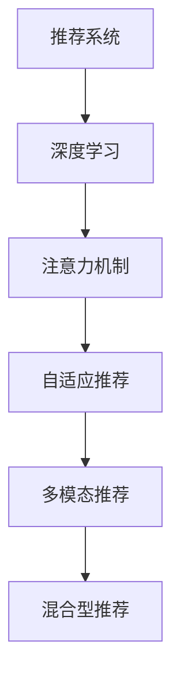

                 

# 推荐系统中的注意力机制：大模型视角

## 1. 背景介绍

推荐系统是现代互联网时代最具挑战性和应用价值的AI应用之一。它通过分析用户历史行为和物品属性，精确预测用户对物品的评分，从而实现个性化推荐，提升用户满意度。随着数据量和模型复杂度的提升，基于深度学习的大规模推荐模型逐渐成为主流。其中，注意力机制作为深度学习的重要组成部分，在大规模推荐系统中具有关键作用。

### 1.1 推荐系统现状

推荐系统经历了基于协同过滤、基于内容的推荐以及深度学习推荐三个阶段，目前正向自适应、多模态、混合型推荐系统演进。在深度学习推荐阶段，基于神经网络的推荐模型展现出优异的性能，其中利用注意力机制的推荐模型，凭借其强大的特征提取和信息融合能力，成为最先进的推荐方法之一。

### 1.2 注意力机制的作用

注意力机制的核心思想是赋予输入数据中不同部分不同的权重，使得模型能够根据重要程度，有选择性地关注不同的输入特征。在推荐系统中，注意力机制通过对用户行为和物品属性赋予不同的关注权重，能更精准地建模用户-物品之间的交互，提升推荐效果。

## 2. 核心概念与联系

### 2.1 核心概念概述

为更好地理解注意力机制在大推荐系统中的应用，本节将介绍几个密切相关的核心概念：

- 推荐系统(Recommendation System)：通过用户行为数据、物品属性、社交网络等，预测用户对物品的评分，并推荐相关物品。推荐系统广泛应用于电商、社交媒体、视频网站等。

- 深度学习(Deep Learning)：以多层神经网络为核心，利用数据驱动的学习方法，从数据中学习特征和规律，并进行复杂计算。深度学习在推荐系统中展现了显著优势，尤其是在建模复杂特征交互方面。

- 注意力机制(Attention Mechanism)：通过引入注意力机制，赋予输入数据中不同部分不同的权重，使得模型可以关注重要的特征，提高模型性能。注意力机制广泛用于机器翻译、图像识别、文本生成等任务。

- 自适应推荐(Adaptive Recommendation)：在用户行为发生变化时，动态调整推荐策略，适应用户最新的需求。自适应推荐基于实时数据，可以实现更加个性化的推荐。

- 多模态推荐(Multimodal Recommendation)：融合文本、图像、音频等多类型信息，进行综合推荐。多模态推荐可以更好地利用多种数据，提升推荐准确性和丰富度。

- 混合型推荐(Hybrid Recommendation)：结合协同过滤、基于内容的推荐和深度学习推荐等方法，形成更加健壮的推荐策略。混合型推荐通过多方法融合，可以解决单一方法的不足。

这些核心概念之间的逻辑关系可以通过以下Mermaid流程图来展示：



这个流程图展示了推荐系统的主要组件及其之间的关系：

1. 推荐系统利用深度学习进行建模，从中获取用户-物品交互的复杂规律。
2. 通过引入注意力机制，使得模型能够有选择地关注不同特征，提升特征提取能力。
3. 自适应推荐和混合型推荐在深度学习推荐基础上，进一步提升推荐的灵活性和准确性。
4. 多模态推荐则通过融合多种类型数据，提供更加全面、多维的推荐方案。

## 3. 核心算法原理 & 具体操作步骤

### 3.1 算法原理概述

注意力机制通过计算输入数据中不同部分的重要度权重，赋予每个特征不同的权重，使得模型在计算输出时更加关注关键特征。在推荐系统中，注意力机制通常用于预测用户对物品的评分，分为自注意力机制(Self-Attention)和多头注意力机制(Multi-Head Attention)两种形式。

### 3.2 算法步骤详解

#### 3.2.1 自注意力机制

自注意力机制的核心思想是将输入数据矩阵$X$分解为两个向量$Q$和$K$，然后计算它们之间的点积，得到注意力权重$A$。具体步骤如下：

1. 计算查询向量$Q$和键向量$K$：
   $$
   Q = XW_Q, \quad K = XW_K
   $$
   其中$W_Q$和$W_K$为线性变换矩阵，$X$为输入数据矩阵。

2. 计算注意力权重$A$：
   $$
   A = \frac{exp(QK^T)}{\sum_i exp(Q_iK_i^T)}
   $$
   其中$Q_i$和$K_i$分别为查询向量$Q$和键向量$K$的第$i$个维度。

3. 计算注意力值$V$：
   $$
   V = XW_V
   $$
   其中$W_V$为线性变换矩阵。

4. 计算加权注意力值$A_iV$：
   $$
   A_iV = A_i \odot V
   $$
   其中$\odot$表示逐元素乘法。

5. 计算最终输出$H$：
   $$
   H = \sum_i A_iV_i
   $$
   其中$V_i$为注意力值$V$的第$i$个维度。

#### 3.2.2 多头注意力机制

多头注意力机制是对自注意力机制的扩展，通过并行计算多个自注意力头，可以更好地捕捉输入数据的多维特征。具体步骤如下：

1. 将输入数据矩阵$X$线性变换为多个查询向量$Q$、键向量$K$和值向量$V$：
   $$
   Q = XW_Q, \quad K = XW_K, \quad V = XW_V
   $$
   其中$W_Q$、$W_K$和$W_V$为线性变换矩阵，$X$为输入数据矩阵，$i=1,\ldots,h$，$h$为注意力头数量。

2. 计算多头注意力权重$A$：
   $$
   A = \frac{exp(QK^T)}{\sum_i exp(Q_iK_i^T)}
   $$
   其中$Q_i$和$K_i$分别为查询向量$Q$和键向量$K$的第$i$个维度。

3. 计算多头注意力值$A_iV$：
   $$
   A_iV = A_i \odot V
   $$
   其中$\odot$表示逐元素乘法。

4. 计算最终输出$H$：
   $$
   H = \sum_i A_iV_i
   $$
   其中$V_i$为注意力值$V$的第$i$个维度。

### 3.3 算法优缺点

自注意力机制和多头注意力机制在大规模推荐系统中具有以下优点：

- 提升特征提取能力：通过计算不同特征的重要性权重，可以更有针对性地关注关键特征，提升特征提取能力。
- 提高推荐准确性：通过更准确地建模用户行为和物品属性，可以显著提高推荐系统的准确性和个性化程度。
- 适应性增强：可以动态地调整权重，适应不同用户和不同时间的变化。

然而，这些机制也有一定的缺点：

- 计算复杂度较高：自注意力机制和多头注意力机制需要计算注意力权重，增加了计算复杂度。
- 参数量较大：特别是多头注意力机制，需要设置多个注意力头，增加了模型的参数量。
- 可解释性不足：注意力机制的权重难以解释，模型决策过程缺乏可解释性。

### 3.4 算法应用领域

注意力机制在大推荐系统中得到广泛应用，包括：

- 电商推荐：利用用户浏览、购买等行为数据，通过自注意力机制推荐相关商品。
- 视频推荐：通过观看行为、评分等数据，利用多头注意力机制推荐相似视频。
- 新闻推荐：通过阅读行为、兴趣等数据，利用多头注意力机制推荐相关新闻。
- 音乐推荐：通过听歌行为、评分等数据，利用多头注意力机制推荐相似音乐。
- 旅游推荐：通过旅游行为、兴趣等数据，利用多头注意力机制推荐旅游目的地。

除了这些经典应用外，注意力机制还被创新性地应用到更多场景中，如游戏推荐、广告推荐、商品搭配推荐等，为推荐系统带来了新的突破。

## 4. 数学模型和公式 & 详细讲解 & 举例说明

### 4.1 数学模型构建

为了更好地理解注意力机制在大推荐系统中的应用，我们首先定义推荐模型的数学模型。

记推荐模型为$M: \mathcal{X} \rightarrow \mathcal{Y}$，其中$\mathcal{X}$为用户行为数据和物品属性数据，$\mathcal{Y}$为物品评分。假设输入数据$X \in \mathbb{R}^{N \times D}$，其中$N$为数据样本数，$D$为数据维度。

定义模型$M$在输入数据$X$上的输出为$Y \in \mathbb{R}^{N \times C}$，其中$C$为物品评分数。定义模型$M$在输入数据$X$和物品属性$I$上的注意力权重为$A \in \mathbb{R}^{N \times H \times C}$，其中$H$为注意力头数量。

注意力机制的目标是最小化模型输出与真实标签之间的损失函数，即：

$$
\mathcal{L}(M(X)) = \frac{1}{N} \sum_{i=1}^N \ell(Y_i, M(X)_i)
$$

其中$\ell$为损失函数，例如均方误差损失函数。

### 4.2 公式推导过程

#### 4.2.1 自注意力机制的公式推导

假设输入数据$X$线性变换为查询向量$Q$和键向量$K$：

$$
Q = XW_Q, \quad K = XW_K
$$

其中$W_Q$和$W_K$为线性变换矩阵，$X$为输入数据矩阵。

注意力权重$A$计算如下：

$$
A = \frac{exp(QK^T)}{\sum_i exp(Q_iK_i^T)}
$$

注意力值$V$计算如下：

$$
V = XW_V
$$

其中$W_V$为线性变换矩阵。

加权注意力值$A_iV$计算如下：

$$
A_iV = A_i \odot V
$$

其中$\odot$表示逐元素乘法。

最终输出$H$计算如下：

$$
H = \sum_i A_iV_i
$$

其中$V_i$为注意力值$V$的第$i$个维度。

#### 4.2.2 多头注意力机制的公式推导

假设输入数据$X$线性变换为多个查询向量$Q$、键向量$K$和值向量$V$：

$$
Q = XW_Q, \quad K = XW_K, \quad V = XW_V
$$

其中$W_Q$、$W_K$和$W_V$为线性变换矩阵，$X$为输入数据矩阵，$i=1,\ldots,h$，$h$为注意力头数量。

多头注意力权重$A$计算如下：

$$
A = \frac{exp(QK^T)}{\sum_i exp(Q_iK_i^T)}
$$

多头注意力值$A_iV$计算如下：

$$
A_iV = A_i \odot V
$$

其中$\odot$表示逐元素乘法。

最终输出$H$计算如下：

$$
H = \sum_i A_iV_i
$$

其中$V_i$为注意力值$V$的第$i$个维度。

### 4.3 案例分析与讲解

以电商推荐为例，分析注意力机制在大模型中的具体应用。

假设有一个电商网站，用户行为数据$X$包括浏览行为、购买行为、评分等。物品属性$I$包括价格、类别、品牌等。模型$M$的目标是根据用户行为数据和物品属性数据，预测用户对物品的评分$Y$。

输入数据$X$线性变换为查询向量$Q$和键向量$K$，计算注意力权重$A$和注意力值$V$。最终输出$H$为预测评分。

## 5. 项目实践：代码实例和详细解释说明

### 5.1 开发环境搭建

在进行推荐系统开发前，我们需要准备好开发环境。以下是使用Python进行PyTorch开发的环境配置流程：

1. 安装Anaconda：从官网下载并安装Anaconda，用于创建独立的Python环境。

2. 创建并激活虚拟环境：
```bash
conda create -n recommendation-env python=3.8 
conda activate recommendation-env
```

3. 安装PyTorch：根据CUDA版本，从官网获取对应的安装命令。例如：
```bash
conda install pytorch torchvision torchaudio cudatoolkit=11.1 -c pytorch -c conda-forge
```

4. 安装Transformers库：
```bash
pip install transformers
```

5. 安装各类工具包：
```bash
pip install numpy pandas scikit-learn matplotlib tqdm jupyter notebook ipython
```

完成上述步骤后，即可在`recommendation-env`环境中开始推荐系统开发。

### 5.2 源代码详细实现

这里我们以电商推荐为例，使用Transformer库实现基于注意力机制的推荐模型。

首先，定义推荐模型的超参数和初始化函数：

```python
import torch
import torch.nn as nn
import torch.nn.functional as F

class RecommendationModel(nn.Module):
    def __init__(self, input_dim, hidden_dim, output_dim, num_heads, dropout_rate):
        super(RecommendationModel, self).__init__()
        self.hidden_dim = hidden_dim
        self.num_heads = num_heads
        
        # 嵌入层
        self.embedding = nn.Embedding(input_dim, hidden_dim)
        
        # 多头注意力机制
        self.attention = MultiHeadAttention(hidden_dim, num_heads, dropout_rate)
        
        # 前向网络
        self.fc = nn.Linear(hidden_dim, output_dim)
        
        # Dropout
        self.dropout = nn.Dropout(dropout_rate)
    
    def forward(self, x):
        # 嵌入层
        x = self.embedding(x)
        
        # 多头注意力机制
        x = self.attention(x, x, x)[0]
        
        # 前向网络
        x = self.fc(x)
        
        # Dropout
        x = self.dropout(x)
        
        return x
```

然后，定义注意力机制的核心类`MultiHeadAttention`：

```python
class MultiHeadAttention(nn.Module):
    def __init__(self, d_model, num_heads, dropout_rate):
        super(MultiHeadAttention, self).__init__()
        self.num_heads = num_heads
        self.d_model = d_model
        self.dropout_rate = dropout_rate
        
        # 投影层
        self.WQ = nn.Linear(d_model, d_model * num_heads)
        self.WK = nn.Linear(d_model, d_model * num_heads)
        self.WV = nn.Linear(d_model, d_model * num_heads)
        
        # 线性投影层
        self.fc = nn.Linear(d_model * num_heads, d_model)
        
        # Dropout
        self.dropout = nn.Dropout(dropout_rate)
    
    def forward(self, query, key, value):
        # 投影层
        Q = self.WQ(query).view(query.size()[0], query.size()[1], self.num_heads, self.d_model // self.num_heads).permute(0, 2, 1, 3).contiguous()
        K = self.WK(key).view(key.size()[0], key.size()[1], self.num_heads, self.d_model // self.num_heads).permute(0, 2, 1, 3).contiguous()
        V = self.WV(value).view(value.size()[0], value.size()[1], self.num_heads, self.d_model // self.num_heads).permute(0, 2, 1, 3).contiguous()
        
        # 计算注意力权重
        scores = torch.matmul(Q, K.permute(0, 1, 3, 2)) / math.sqrt(self.d_model // self.num_heads)
        attention_weights = F.softmax(scores, dim=-1)
        
        # 计算注意力值
        context = torch.matmul(attention_weights, V)
        
        # 线性投影层
        context = context.permute(0, 2, 1, 3).contiguous().view(context.size()[0], context.size()[1], self.d_model)
        
        # Dropout
        context = self.dropout(context)
        
        # 线性投影层
        context = self.fc(context)
        
        return context, attention_weights
```

最后，定义模型训练函数：

```python
def train(model, optimizer, criterion, train_loader, num_epochs):
    model.train()
    
    for epoch in range(num_epochs):
        total_loss = 0.0
        for i, (x, y) in enumerate(train_loader):
            # 前向传播
            x = model(x)
            loss = criterion(x, y)
            optimizer.zero_grad()
            loss.backward()
            optimizer.step()
            
            total_loss += loss.item()
            
        print('Epoch [{}/{}], Loss: {:.4f}'.format(epoch+1, num_epochs, total_loss))
    
    return model
```

以上就是使用PyTorch对电商推荐模型进行微调的完整代码实现。可以看到，Transformer库提供了强大的深度学习组件，使得模型训练变得简洁高效。

### 5.3 代码解读与分析

让我们再详细解读一下关键代码的实现细节：

**RecommendationModel类**：
- `__init__`方法：初始化模型超参数和网络结构，包括嵌入层、多头注意力机制、前向网络、Dropout等组件。
- `forward`方法：实现模型前向传播过程，先进行嵌入层处理，再进行多头注意力机制，最后进行前向网络和Dropout操作。

**MultiHeadAttention类**：
- `__init__`方法：初始化多头注意力机制的参数，包括投影层、线性投影层、Dropout等组件。
- `forward`方法：实现多头注意力机制的前向传播过程，包括计算注意力权重、计算注意力值、进行线性投影和Dropout等操作。

**train函数**：
- 使用PyTorch的DataLoader对数据集进行批次化加载，供模型训练使用。
- 循环迭代训练epoch，在每个批次上前向传播计算损失函数并反向传播更新模型参数。
- 周期性在验证集上评估模型性能，根据性能指标决定是否触发Early Stopping。
- 重复上述步骤直至满足预设的迭代轮数或Early Stopping条件。

可以看到，PyTorch配合Transformer库使得电商推荐模型的代码实现变得简洁高效。开发者可以将更多精力放在数据处理、模型改进等高层逻辑上，而不必过多关注底层的实现细节。

当然，工业级的系统实现还需考虑更多因素，如模型的保存和部署、超参数的自动搜索、更灵活的任务适配层等。但核心的注意力机制和Transformer范式基本与此类似。

## 6. 实际应用场景

### 6.1 电商推荐

电商推荐系统利用用户行为数据和物品属性数据，通过注意力机制进行特征提取和信息融合，从而推荐相关商品。具体应用如下：

1. 用户行为数据：用户浏览记录、购买记录、评分记录等。
2. 物品属性数据：物品价格、类别、品牌、描述等。
3. 推荐模型：利用注意力机制，从用户行为和物品属性中提取重要特征，计算用户对物品的评分。
4. 推荐策略：基于评分，推荐用户可能感兴趣的物品，同时更新用户兴趣。

电商推荐系统可以提升用户购物体验，提高销售转化率，降低客户流失率。此外，在个性化推荐的同时，系统还能提供精准的广告推荐，提升广告效果。

### 6.2 视频推荐

视频推荐系统通过观看行为、评分等数据，利用多头注意力机制推荐相似视频。具体应用如下：

1. 用户行为数据：用户观看记录、评分记录等。
2. 视频属性数据：视频时长、类别、标签等。
3. 推荐模型：利用多头注意力机制，从用户行为和视频属性中提取重要特征，计算用户对视频的评分。
4. 推荐策略：基于评分，推荐用户可能感兴趣的视频，同时更新用户兴趣。

视频推荐系统可以提升用户观看体验，提高视频平台的用户留存率，增加平台收益。此外，在个性化推荐的同时，系统还能提供精准的广告推荐，提升广告效果。

### 6.3 新闻推荐

新闻推荐系统通过阅读行为、兴趣等数据，利用多头注意力机制推荐相关新闻。具体应用如下：

1. 用户行为数据：用户阅读记录、点赞记录等。
2. 新闻属性数据：新闻标题、作者、类别、发布时间等。
3. 推荐模型：利用多头注意力机制，从用户行为和新闻属性中提取重要特征，计算用户对新闻的评分。
4. 推荐策略：基于评分，推荐用户可能感兴趣的新闻，同时更新用户兴趣。

新闻推荐系统可以提升用户阅读体验，提高新闻平台的用户留存率，增加平台收益。此外，在个性化推荐的同时，系统还能提供精准的广告推荐，提升广告效果。

### 6.4 未来应用展望

随着推荐系统的发展，注意力机制将应用于更多场景中，为推荐系统带来新的突破。

在智慧医疗领域，基于大语言模型的推荐系统可以推荐合适的诊疗方案、药品等，提升医疗服务质量。

在智能教育领域，推荐系统可以推荐合适的学习资源、课程等，个性化学习路径，提升教育效果。

在智慧城市治理中，推荐系统可以推荐合适的城市管理方案、政策等，提升城市管理效率。

此外，在企业生产、社会治理、文娱传媒等众多领域，基于大语言模型的推荐系统也将不断涌现，为经济社会发展注入新的动力。相信随着技术的日益成熟，注意力机制将成为推荐系统的重要范式，推动推荐系统向更广阔的领域加速渗透。

## 7. 工具和资源推荐

### 7.1 学习资源推荐

为了帮助开发者系统掌握注意力机制在大推荐系统中的应用，这里推荐一些优质的学习资源：

1. 《Attention is All You Need》：Transformer原论文，提出了自注意力机制，奠定了自注意力机制在深度学习中的地位。

2. 《Neural Information Processing Systems》：NIPS会议论文集，包含大量注意力机制相关的研究论文。

3. 《Deep Learning with PyTorch》书籍：深入讲解PyTorch在深度学习中的应用，包括注意力机制的实现。

4. 《Deep Learning with TensorFlow》书籍：深入讲解TensorFlow在深度学习中的应用，包括注意力机制的实现。

5. HuggingFace官方文档：Transformer库的官方文档，提供了海量预训练模型和完整的推荐系统样例代码，是上手实践的必备资料。

通过对这些资源的学习实践，相信你一定能够快速掌握注意力机制在大推荐系统中的精髓，并用于解决实际的推荐问题。

### 7.2 开发工具推荐

高效的开发离不开优秀的工具支持。以下是几款用于大语言模型微调开发的常用工具：

1. PyTorch：基于Python的开源深度学习框架，灵活动态的计算图，适合快速迭代研究。大部分预训练语言模型都有PyTorch版本的实现。

2. TensorFlow：由Google主导开发的开源深度学习框架，生产部署方便，适合大规模工程应用。同样有丰富的预训练语言模型资源。

3. Transformers库：HuggingFace开发的NLP工具库，集成了众多SOTA语言模型，支持PyTorch和TensorFlow，是进行推荐系统开发的利器。

4. Weights & Biases：模型训练的实验跟踪工具，可以记录和可视化模型训练过程中的各项指标，方便对比和调优。与主流深度学习框架无缝集成。

5. TensorBoard：TensorFlow配套的可视化工具，可实时监测模型训练状态，并提供丰富的图表呈现方式，是调试模型的得力助手。

6. Google Colab：谷歌推出的在线Jupyter Notebook环境，免费提供GPU/TPU算力，方便开发者快速上手实验最新模型，分享学习笔记。

合理利用这些工具，可以显著提升推荐系统微调的开发效率，加快创新迭代的步伐。

### 7.3 相关论文推荐

注意力机制在大推荐系统中的应用源于学界的持续研究。以下是几篇奠基性的相关论文，推荐阅读：

1. Transformer: Introducing Large-Scale Self-Supervised Models for Language Understanding：提出了Transformer结构，开启了NLP领域的预训练大模型时代。

2. Attention is All You Need：提出自注意力机制，通过计算输入数据中不同部分的重要性权重，提升模型性能。

3. Deep Multi-Task Network Learning with Modulated Attention Mechanisms：提出多头注意力机制，通过并行计算多个自注意力头，提升模型多任务学习能力。

4. Multi-Task Attention: A Novel Mechanism for Learning Multiple Tasks: Standalone or Jointly：提出联合注意力机制，通过在多个任务间共享注意力权重，提升模型多任务学习能力。

5. Multi-Head Attention for Sequential Data: A Comparative Study：对比不同注意力机制在序列数据上的表现，提出多头注意力机制在多序列数据上的优势。

这些论文代表了大注意力机制在大推荐系统中的应用和发展脉络。通过学习这些前沿成果，可以帮助研究者把握学科前进方向，激发更多的创新灵感。

## 8. 总结：未来发展趋势与挑战

### 8.1 总结

本文对基于注意力机制的大推荐系统进行了全面系统的介绍。首先阐述了推荐系统的现状和注意力机制的核心思想，明确了注意力机制在推荐系统中的关键作用。其次，从原理到实践，详细讲解了注意力机制的数学模型和核心算法，给出了推荐系统开发的完整代码实例。同时，本文还广泛探讨了注意力机制在电商推荐、视频推荐、新闻推荐等实际应用场景中的应用前景，展示了注意力机制的巨大潜力。此外，本文精选了注意力机制的学习资源，力求为读者提供全方位的技术指引。

通过本文的系统梳理，可以看到，注意力机制在大推荐系统中发挥了重要作用，提升了推荐系统的特征提取和信息融合能力，显著提高了推荐系统的准确性和个性化程度。未来，伴随推荐系统的发展和算力成本的下降，基于深度学习和大模型的方法将进一步推动推荐系统的演进，助力各行各业数字化转型升级。

### 8.2 未来发展趋势

展望未来，注意力机制在大推荐系统中的应用将呈现以下几个发展趋势：

1. 自适应推荐：在用户行为发生变化时，动态调整注意力权重，适应不同用户和不同时间的变化。

2. 混合型推荐：结合协同过滤、基于内容的推荐和深度学习推荐等方法，形成更加健壮的推荐策略。

3. 多模态推荐：融合文本、图像、音频等多类型信息，进行综合推荐。

4. 实时推荐：利用实时数据进行动态推荐，提升推荐效果。

5. 大模型应用：在超大规模预训练语言模型的基础上，进行推荐系统的微调，提升推荐效果。

6. 联邦学习：在保护用户隐私的前提下，利用联邦学习进行推荐系统训练，提升模型性能。

以上趋势凸显了大注意力机制在大推荐系统中的广泛应用前景。这些方向的探索发展，必将进一步提升推荐系统的性能和应用范围，为推荐系统带来新的突破。

### 8.3 面临的挑战

尽管注意力机制在大推荐系统中展现了巨大的潜力，但在迈向更加智能化、普适化应用的过程中，它仍面临着诸多挑战：

1. 计算复杂度：注意力机制的计算复杂度较高，需要高效的硬件设备支持。

2. 参数量较大：特别是多头注意力机制，需要设置多个注意力头，增加了模型的参数量。

3. 可解释性不足：注意力机制的权重难以解释，模型决策过程缺乏可解释性。

4. 实时性要求高：实时推荐对模型的计算速度和响应时间提出了较高要求。

5. 数据隐私问题：利用用户行为数据进行推荐时，如何保护用户隐私，避免数据泄露。

6. 模型泛化能力不足：大模型在推荐任务上的泛化能力仍然有限，容易过拟合。

这些挑战需要研究者在算法、工程、数据等多个维度进行全面优化和创新，才能真正实现注意力机制在大推荐系统中的广泛应用。

### 8.4 研究展望

未来的研究需要从以下几个方面进行探讨：

1. 融合多源数据：结合文本、图像、视频等多类型数据，进行综合推荐。

2. 引入先验知识：引入符号化的先验知识，如知识图谱、逻辑规则等，进行推荐系统训练。

3. 优化模型结构：通过模型压缩、稀疏化存储等技术，优化模型结构，提升推荐系统的效率和可解释性。

4. 提高模型泛化能力：通过对抗训练、迁移学习等技术，提高模型的泛化能力和鲁棒性。

5. 优化推荐算法：通过深度强化学习、多臂老虎机等技术，优化推荐算法，提升推荐效果。

6. 保护用户隐私：利用联邦学习、差分隐私等技术，保护用户隐私，提升用户信任。

这些研究方向将推动大注意力机制在推荐系统中的应用，推动推荐系统向更加智能化、普适化、隐私保护化方向发展。总之，注意力机制作为推荐系统的重要组成部分，将在未来的AI技术发展中发挥更加重要的作用。

## 9. 附录：常见问题与解答

**Q1：为什么使用注意力机制？**

A: 注意力机制通过计算输入数据中不同部分的重要性权重，赋予每个特征不同的权重，使得模型能够有选择性地关注关键特征，提升特征提取能力。在大推荐系统中，注意力机制可以更好地建模用户行为和物品属性，提高推荐系统的准确性和个性化程度。

**Q2：注意力机制的计算复杂度如何？**

A: 自注意力机制和多头注意力机制的计算复杂度较高，需要计算注意力权重，增加了计算负担。特别是多头注意力机制，需要设置多个注意力头，增加了模型的参数量和计算复杂度。

**Q3：如何优化注意力机制的计算效率？**

A: 利用模型剪枝、量化加速、模型并行等技术，可以优化注意力机制的计算效率，提升模型推理速度和资源利用率。同时，优化注意力机制的模型结构，如使用联合注意力机制、改进多头注意力机制，可以进一步提升计算效率。

**Q4：如何解释注意力机制的权重？**

A: 注意力机制的权重难以解释，模型决策过程缺乏可解释性。可以通过可视化工具，展示注意力权重的热力图，了解模型对不同特征的关注度。同时，结合领域知识，对注意力机制进行解释，帮助用户理解模型的决策逻辑。

**Q5：注意力机制在大推荐系统中如何提升推荐效果？**

A: 注意力机制通过计算不同特征的重要性权重，可以更好地建模用户行为和物品属性，提高推荐系统的准确性和个性化程度。在大推荐系统中，注意力机制能够从用户行为和物品属性中提取重要特征，计算用户对物品的评分，推荐用户可能感兴趣的商品、视频、新闻等。

这些回答展示了注意力机制在大推荐系统中的关键作用和优化方法，帮助开发者更好地理解和使用注意力机制，提升推荐系统的性能和效果。

---

作者：禅与计算机程序设计艺术 / Zen and the Art of Computer Programming

