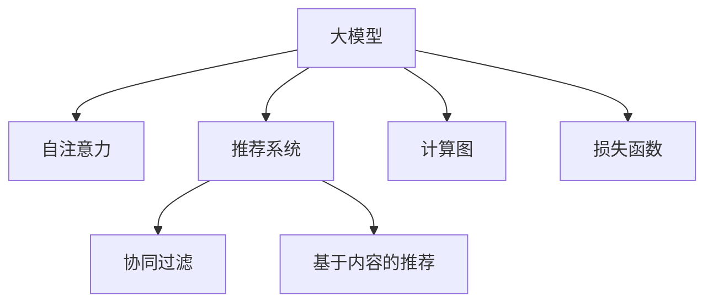

                 

# 推荐系统中的注意力机制：大模型视角

> 关键词：推荐系统, 注意力机制, 大模型, 自注意力, 信息检索, 深度学习, 计算图, 损失函数

## 1. 背景介绍

### 1.1 问题由来
随着互联网的普及和电商平台的兴起，推荐系统逐渐成为提高用户体验和商业价值的关键技术。传统的推荐系统主要依赖于协同过滤、基于内容的推荐等方法，难以应对海量数据和复杂场景的挑战。而近年来，以Transformer为代表的自注意力机制在自然语言处理(NLP)和计算机视觉领域取得了巨大的成功，启发了将注意力机制引入推荐系统中的尝试。

### 1.2 问题核心关键点
注意力机制是一种能够自动学习数据间关系的能力，在深度学习中具有广泛应用。在推荐系统中，通过注意力机制可以对用户的历史行为、物品的特征等信息进行加权，从而增强推荐模型的泛化能力和个性化程度。

当前，注意力机制在推荐系统中的应用主要集中在两个方面：

1. **用户行为模型**：基于用户的历史行为序列构建表示，通过自注意力机制学习用户行为与推荐物品之间的关系。
2. **物品特征模型**：通过自注意力机制学习物品的特征向量，捕捉物品间的关联性。

本文聚焦于基于大模型的推荐系统中的注意力机制，探讨如何在大模型中有效应用注意力机制，以提升推荐效果和计算效率。

### 1.3 问题研究意义
注意力机制在大模型中的应用，使得推荐系统能够更好地处理复杂的多维数据，提升推荐的精度和多样性，同时降低对人工特征工程的依赖。通过大模型的自适应学习，能够自动化地捕获用户和物品之间的复杂关联关系，从而在个性化推荐中取得优异的表现。

此外，大模型中的注意力机制还为推荐系统带来了更高的计算效率。通过参数共享和计算图优化，大模型能够显著降低推荐系统的计算复杂度，支持实时推荐。

## 2. 核心概念与联系

### 2.1 核心概念概述

为更好地理解基于大模型的推荐系统中的注意力机制，本节将介绍几个密切相关的核心概念：

- **大模型（Large Models）**：如BERT、GPT、DALL-E等，指具有大规模参数量和强大自适应能力的深度学习模型。大模型能够在海量的数据上自监督学习，获得丰富的领域知识。
- **自注意力（Self-Attention）**：一种基于Transformer架构的计算机制，用于计算不同输入之间的关系。自注意力机制能够捕捉输入数据之间的依赖关系，提升模型的表达能力和泛化能力。
- **推荐系统（Recommendation System）**：利用用户历史行为、物品特征等信息，为用户推荐符合其兴趣和需求的物品的系统。
- **协同过滤（Collaborative Filtering）**：推荐系统中一种经典的方法，基于用户和物品的相似性进行推荐。
- **基于内容的推荐（Content-Based Recommendation）**：通过物品的属性特征，为用户推荐符合其兴趣的相似物品。
- **计算图（Computational Graph）**：一种描述深度学习模型计算流程的抽象表示，用于优化模型的推理过程和计算效率。
- **损失函数（Loss Function）**：用于评估模型预测结果与真实标签之间的差异，是优化算法的核心部分。

这些核心概念之间的逻辑关系可以通过以下Mermaid流程图来展示：



这个流程图展示了大模型的核心概念及其之间的关系：

1. 大模型通过自注意力机制学习输入数据之间的关系。
2. 推荐系统基于大模型计算结果，为用户推荐物品。
3. 协同过滤和基于内容的推荐是推荐系统中的经典方法。
4. 计算图优化提升大模型的推理效率。
5. 损失函数指导模型优化，提高推荐准确性。

## 3. 核心算法原理 & 具体操作步骤

### 3.1 算法原理概述

基于大模型的推荐系统中的注意力机制，本质上是一种自适应计算方式，用于学习输入数据之间的相互依赖关系。其核心思想是：将输入数据表示为一个向量序列，通过自注意力机制计算每个向量与其他向量之间的权重，加权聚合得到最终的表示向量。该表示向量可用于预测用户对不同物品的评分，进而生成推荐列表。

### 3.2 算法步骤详解

基于大模型的推荐系统中的注意力机制，一般包括以下几个关键步骤：

**Step 1: 构建输入表示**
- 将用户历史行为序列和物品特征向量，转换为模型可接受的张量表示。例如，将用户行为序列$u$转换为一个$n\times d$的张量，$n$为用户行为数量，$d$为每条行为的特征维度。物品特征向量$v$也转换为一个$k\times d$的张量，$k$为物品数量。

**Step 2: 计算自注意力权重**
- 通过自注意力机制，计算用户行为和物品特征之间的注意力权重。设$A$为注意力权重矩阵，$A \in \mathbb{R}^{n \times k}$，每个元素$A_{ij}$表示用户行为$i$与物品特征$j$之间的关系强度。
- 注意力权重矩阵$A$通过输入表示$u$和$v$的线性变换和激活函数计算得到，具体公式为：
  $$
  A_{ij} = \frac{\exp(\mathbf{u}_i \cdot \mathbf{v}_j^T)}{\sum_{j'=1}^k \exp(\mathbf{u}_i \cdot \mathbf{v}_{j'}^T)}
  $$

**Step 3: 加权聚合得到用户表示**
- 根据注意力权重矩阵$A$，对物品特征向量$v$进行加权聚合，得到用户表示$\mathbf{u}'$。具体公式为：
  $$
  \mathbf{u}' = \sum_{j=1}^k A_{ij} \mathbf{v}_j
  $$

**Step 4: 计算用户物品评分**
- 将用户表示$\mathbf{u}'$与物品特征向量$v$相乘，得到一个标量表示$z$，用于预测用户对物品的评分。具体公式为：
  $$
  z = \mathbf{u}'^T \mathbf{v}
  $$

**Step 5: 生成推荐列表**
- 将用户对所有物品的评分排序，选择前$k$个评分最高的物品，生成推荐列表。

### 3.3 算法优缺点

基于大模型的推荐系统中的注意力机制具有以下优点：

1. **自适应学习能力强**：通过自注意力机制，模型能够自动学习用户和物品之间的复杂关系，适应不同的用户偏好和行为模式。
2. **泛化能力优异**：大模型通常具备较强的泛化能力，能够处理多种多样的推荐任务，包括基于用户的推荐、基于物品的推荐等。
3. **计算效率高**：大模型通常具有高效的计算图和参数共享机制，能够快速计算自注意力权重和用户表示，支持实时推荐。

同时，该算法也存在一些局限性：

1. **资源消耗大**：大模型的参数量和计算复杂度较高，对硬件资源要求较高，可能不适合实时推荐系统。
2. **过拟合风险高**：大模型在训练过程中容易过拟合，尤其是在数据量有限的情况下。
3. **解释性差**：注意力权重矩阵的计算过程较复杂，难以直观理解模型的决策逻辑。

### 3.4 算法应用领域

基于大模型的推荐系统中的注意力机制，已经在电商、社交网络、视频流等多个领域得到广泛应用。以下是几个典型的应用场景：

1. **电商推荐**：为电商平台的商品推荐，提高用户体验和转化率。通过用户行为序列和商品属性特征，利用自注意力机制计算用户对商品之间的相似度，生成推荐列表。
2. **社交网络**：为社交平台上的内容推荐，增强用户粘性和平台活跃度。利用用户的历史互动数据和内容特征，通过自注意力机制计算内容的相关性，生成推荐流。
3. **视频流推荐**：为视频流平台的视频推荐，提升观看体验和内容多样性。通过用户观看历史和视频特征，计算用户对视频的兴趣权重，生成个性化推荐列表。

## 4. 数学模型和公式 & 详细讲解 & 举例说明

### 4.1 数学模型构建

设用户行为序列为$u \in \mathbb{R}^{n \times d}$，物品特征向量为$v \in \mathbb{R}^{k \times d}$。在注意力机制中，目标是将用户行为与物品特征之间进行关系建模，计算注意力权重矩阵$A \in \mathbb{R}^{n \times k}$，用于表示用户行为$i$与物品特征$j$之间的关系强度。

目标函数为：

$$
\min_{A, W} \frac{1}{n}\sum_{i=1}^n \frac{1}{k}\sum_{j=1}^k (y_{ij} - A_{ij}^TW_{ij})^2
$$

其中$y_{ij}$为用户$i$对物品$j$的真实评分，$W$为线性变换矩阵，$A$为注意力权重矩阵。

### 4.2 公式推导过程

假设用户行为向量$u$为$n$维向量，物品特征向量$v$为$k$维向量，注意力权重矩阵$A$为$n \times k$的矩阵。通过线性变换和激活函数，可以计算出注意力权重矩阵$A$：

$$
A_{ij} = \sigma(\mathbf{u}_i \cdot \mathbf{v}_j^T)
$$

其中$\sigma$为激活函数，如ReLU、Sigmoid等。

通过注意力权重矩阵$A$，计算用户表示向量$\mathbf{u}'$：

$$
\mathbf{u}' = \sum_{j=1}^k A_{ij} \mathbf{v}_j
$$

将用户表示向量$\mathbf{u}'$与物品特征向量$v$相乘，得到标量表示$z$：

$$
z = \mathbf{u}'^T \mathbf{v}
$$

最终，利用softmax函数将标量表示$z$转化为用户对物品的评分：

$$
\hat{y}_{ij} = \frac{\exp(z_{ij})}{\sum_{j'=1}^k \exp(z_{ij'})}
$$

### 4.3 案例分析与讲解

以下以电商推荐为例，展示基于大模型的注意力机制的实际应用。

假设电商平台上有$n=1000$个用户，每个用户有$k=500$个行为记录。对于每个行为记录，有$d=10$个特征。电商平台的商品有$m=10000$种，每个商品有$d=100$个特征。

首先，将用户行为序列$u \in \mathbb{R}^{1000 \times 10}$和商品特征向量$v \in \mathbb{R}^{10000 \times 100}$转换为模型可接受的张量表示。

通过线性变换和激活函数，计算注意力权重矩阵$A \in \mathbb{R}^{1000 \times 10000}$。

然后，利用注意力权重矩阵$A$对商品特征向量$v$进行加权聚合，得到用户表示向量$\mathbf{u}' \in \mathbb{R}^{1000 \times 100}$。

最后，将用户表示向量$\mathbf{u}'$与商品特征向量$v$相乘，得到标量表示$z \in \mathbb{R}^{1000 \times 10000}$。利用softmax函数，将标量表示$z$转化为用户对物品的评分$\hat{y} \in \mathbb{R}^{1000 \times 10000}$。

通过将用户评分$\hat{y}$排序，选择前$k=500$个评分最高的商品，生成推荐列表。

## 5. 项目实践：代码实例和详细解释说明

### 5.1 开发环境搭建

在进行基于大模型的推荐系统开发时，需要准备好相应的开发环境。以下是使用PyTorch进行深度学习模型开发的常见环境配置流程：

1. 安装Anaconda：从官网下载并安装Anaconda，用于创建独立的Python环境。

2. 创建并激活虚拟环境：
```bash
conda create -n pytorch-env python=3.8 
conda activate pytorch-env
```

3. 安装PyTorch：根据CUDA版本，从官网获取对应的安装命令。例如：
```bash
conda install pytorch torchvision torchaudio cudatoolkit=11.1 -c pytorch -c conda-forge
```

4. 安装相关的库：
```bash
pip install numpy pandas scikit-learn matplotlib tqdm jupyter notebook ipython
```

完成上述步骤后，即可在`pytorch-env`环境中开始开发。

### 5.2 源代码详细实现

下面我们以基于大模型的电商推荐系统为例，给出完整的代码实现。

```python
import torch
import torch.nn as nn
import torch.optim as optim

class AttentionModel(nn.Module):
    def __init__(self, n, k, d):
        super(AttentionModel, self).__init__()
        self.W_u = nn.Linear(d, d)
        self.W_v = nn.Linear(d, d)
        self.W = nn.Linear(d, 1)

    def forward(self, u, v):
        u = self.W_u(u)
        v = self.W_v(v)
        A = torch.bmm(u, v.transpose(1, 2))
        A = nn.functional.sigmoid(A)
        u_prime = torch.bmm(A, v)
        z = torch.bmm(u_prime, self.W)
        y_hat = nn.functional.softmax(z, dim=1)
        return y_hat

# 示例数据
n = 1000  # 用户数
k = 500  # 用户行为数
d = 10  # 用户行为特征数
m = 10000  # 商品数
u = torch.randn(n, d)
v = torch.randn(m, d)

# 模型定义
model = AttentionModel(n, m, d)

# 优化器定义
optimizer = optim.Adam(model.parameters(), lr=0.01)

# 损失函数定义
criterion = nn.BCELoss()

# 训练过程
for epoch in range(10):
    # 前向传播
    y_hat = model(u, v)
    # 计算损失
    loss = criterion(y_hat, target)
    # 反向传播
    optimizer.zero_grad()
    loss.backward()
    optimizer.step()

    # 输出损失
    print('Epoch [{}/{}], Loss: {:.4f}'.format(epoch+1, 10, loss.item()))

# 测试过程
y_hat_test = model(u_test, v_test)
print(y_hat_test)
```

### 5.3 代码解读与分析

让我们再详细解读一下关键代码的实现细节：

**AttentionModel类**：
- `__init__`方法：初始化线性变换层和标量变换层。
- `forward`方法：实现前向传播过程，包括线性变换、计算注意力权重、加权聚合、标量变换、softmax等步骤。

**训练过程**：
- 在每个epoch中，先进行前向传播计算预测结果。
- 计算预测结果与真实标签之间的BCE损失，并回传梯度。
- 使用Adam优化器更新模型参数。
- 输出当前epoch的损失，以评估模型训练效果。

**测试过程**：
- 在测试集上，利用训练好的模型进行预测，并输出预测结果。

## 6. 实际应用场景

### 6.1 电商推荐

电商推荐是推荐系统中的典型应用场景之一。传统的电商推荐系统主要依赖于协同过滤和基于内容的推荐，难以应对海量数据和复杂场景的挑战。而基于大模型的推荐系统中的注意力机制，可以更好地处理用户和商品之间的复杂关系，提升推荐的精度和多样性。

在电商推荐中，可以通过收集用户的历史行为序列和商品属性特征，利用自注意力机制计算用户对商品之间的相似度，生成推荐列表。具体步骤如下：

1. 收集用户的历史行为序列$u$和商品属性特征向量$v$。
2. 将用户行为序列和商品特征向量转换为模型可接受的张量表示。
3. 利用线性变换和激活函数，计算注意力权重矩阵$A$。
4. 利用注意力权重矩阵$A$对商品特征向量$v$进行加权聚合，得到用户表示向量$\mathbf{u}'$。
5. 将用户表示向量$\mathbf{u}'$与商品特征向量$v$相乘，得到标量表示$z$。
6. 利用softmax函数将标量表示$z$转化为用户对物品的评分$\hat{y}$。
7. 将用户评分$\hat{y}$排序，选择前$k$个评分最高的商品，生成推荐列表。

### 6.2 社交网络

社交网络推荐是推荐系统中的另一类典型应用。在社交网络中，用户之间具有复杂的互动关系，物品也具有多样化的内容形式，需要推荐系统能够综合考虑这些多维度的信息。

在社交网络推荐中，可以通过收集用户的历史互动数据和内容特征，利用自注意力机制计算内容的相关性，生成推荐流。具体步骤如下：

1. 收集用户的历史互动数据$u$和内容特征向量$v$。
2. 将用户互动数据和内容特征向量转换为模型可接受的张量表示。
3. 利用线性变换和激活函数，计算注意力权重矩阵$A$。
4. 利用注意力权重矩阵$A$对内容特征向量$v$进行加权聚合，得到用户表示向量$\mathbf{u}'$。
5. 将用户表示向量$\mathbf{u}'$与内容特征向量$v$相乘，得到标量表示$z$。
6. 利用softmax函数将标量表示$z$转化为用户对内容的评分$\hat{y}$。
7. 将用户评分$\hat{y}$排序，选择前$k$个评分最高的内容，生成推荐流。

### 6.3 视频流推荐

视频流推荐是推荐系统中的新兴应用。视频流平台通常具有大量的视频内容和用户行为数据，需要推荐系统能够实时生成个性化推荐列表，提升观看体验和内容多样性。

在视频流推荐中，可以通过收集用户的历史观看历史和视频特征，利用自注意力机制计算用户对视频的兴趣权重，生成个性化推荐列表。具体步骤如下：

1. 收集用户的历史观看历史$u$和视频特征向量$v$。
2. 将用户观看历史和视频特征向量转换为模型可接受的张量表示。
3. 利用线性变换和激活函数，计算注意力权重矩阵$A$。
4. 利用注意力权重矩阵$A$对视频特征向量$v$进行加权聚合，得到用户表示向量$\mathbf{u}'$。
5. 将用户表示向量$\mathbf{u}'$与视频特征向量$v$相乘，得到标量表示$z$。
6. 利用softmax函数将标量表示$z$转化为用户对视频的评分$\hat{y}$。
7. 将用户评分$\hat{y}$排序，选择前$k$个评分最高的视频，生成推荐列表。

## 7. 工具和资源推荐

### 7.1 学习资源推荐

为了帮助开发者系统掌握大模型中的注意力机制，这里推荐一些优质的学习资源：

1. 《深度学习入门》系列博文：由大模型技术专家撰写，深入浅出地介绍了Transformer原理、BERT模型、自注意力机制等前沿话题。
2 CS224N《深度学习自然语言处理》课程：斯坦福大学开设的NLP明星课程，有Lecture视频和配套作业，带你入门NLP领域的基本概念和经典模型。
3 《Natural Language Processing with Transformers》书籍：Transformers库的作者所著，全面介绍了如何使用Transformers库进行NLP任务开发，包括注意力机制在内的诸多范式。
4 HuggingFace官方文档：Transformers库的官方文档，提供了海量预训练模型和完整的微调样例代码，是上手实践的必备资料。
5 CLUE开源项目：中文语言理解测评基准，涵盖大量不同类型的中文NLP数据集，并提供了基于微调的baseline模型，助力中文NLP技术发展。

通过对这些资源的学习实践，相信你一定能够快速掌握大模型中注意力机制的精髓，并用于解决实际的推荐问题。

### 7.2 开发工具推荐

高效的开发离不开优秀的工具支持。以下是几款用于大模型开发和训练的常用工具：

1. PyTorch：基于Python的开源深度学习框架，灵活动态的计算图，适合快速迭代研究。大部分预训练语言模型都有PyTorch版本的实现。
2 TensorFlow：由Google主导开发的开源深度学习框架，生产部署方便，适合大规模工程应用。同样有丰富的预训练语言模型资源。
3 Weights & Biases：模型训练的实验跟踪工具，可以记录和可视化模型训练过程中的各项指标，方便对比和调优。与主流深度学习框架无缝集成。
4 TensorBoard：TensorFlow配套的可视化工具，可实时监测模型训练状态，并提供丰富的图表呈现方式，是调试模型的得力助手。

合理利用这些工具，可以显著提升大模型中的注意力机制的开发效率，加快创新迭代的步伐。

### 7.3 相关论文推荐

大模型中的注意力机制的发展源于学界的持续研究。以下是几篇奠基性的相关论文，推荐阅读：

1. Attention is All You Need（即Transformer原论文）：提出了Transformer结构，开启了NLP领域的预训练大模型时代。
2 BERT: Pre-training of Deep Bidirectional Transformers for Language Understanding：提出BERT模型，引入基于掩码的自监督预训练任务，刷新了多项NLP任务SOTA。
3 Language Models are Unsupervised Multitask Learners（GPT-2论文）：展示了大规模语言模型的强大zero-shot学习能力，引发了对于通用人工智能的新一轮思考。
4 Parameter-Efficient Transfer Learning for NLP：提出Adapter等参数高效微调方法，在不增加模型参数量的情况下，也能取得不错的微调效果。
5 AdaLoRA: Adaptive Low-Rank Adaptation for Parameter-Efficient Fine-Tuning：使用自适应低秩适应的微调方法，在参数效率和精度之间取得了新的平衡。

这些论文代表了大模型中的注意力机制的发展脉络。通过学习这些前沿成果，可以帮助研究者把握学科前进方向，激发更多的创新灵感。

## 8. 总结：未来发展趋势与挑战

### 8.1 总结

本文对基于大模型的推荐系统中的注意力机制进行了全面系统的介绍。首先阐述了注意力机制在大模型中的应用背景和意义，明确了注意力机制在推荐系统中的核心作用。其次，从原理到实践，详细讲解了注意力机制的数学模型和计算流程，给出了代码实例和详细解释说明。同时，本文还探讨了注意力机制在电商推荐、社交网络推荐、视频流推荐等多个场景中的应用，展示了其在推荐系统中的广阔前景。

通过本文的系统梳理，可以看到，基于大模型的注意力机制在推荐系统中具有强大的自适应学习能力和泛化能力，能够更好地处理复杂的多维数据，提升推荐的精度和多样性。未来，伴随大模型的不断演进和算法的持续优化，基于大模型的推荐系统必将在更广阔的领域中大放异彩。

### 8.2 未来发展趋势

展望未来，基于大模型的推荐系统中的注意力机制将呈现以下几个发展趋势：

1. **多模态融合**：未来的推荐系统将更多地融合多种类型的信息，如文本、图像、音频等，通过多模态注意力机制提升推荐的准确性和多样性。
2. **跨领域迁移**：大模型的预训练知识和自注意力机制将进一步推动跨领域迁移学习的应用，使得推荐系统能够更好地应对不同领域的推荐需求。
3. **实时推荐**：基于大模型的推荐系统将支持实时推荐，通过高效的计算图和参数共享机制，提升推荐系统的实时性。
4. **个性化推荐**：大模型中的自注意力机制将进一步提升个性化推荐的精度和多样性，实现更精准的推荐。
5. **隐私保护**：推荐系统将更加注重用户隐私保护，通过差分隐私、联邦学习等技术，确保用户数据的安全性和隐私性。

### 8.3 面临的挑战

尽管大模型中的注意力机制在推荐系统中取得了显著进展，但在向更广泛应用场景的扩展过程中，它仍面临诸多挑战：

1. **数据质量问题**：推荐系统依赖于高质量的数据，数据质量不均衡、数据分布偏差等问题可能影响模型性能。
2. **计算资源需求**：大模型的参数量和计算复杂度较高，对硬件资源要求较高，可能不适合实时推荐系统。
3. **过拟合风险**：大模型在训练过程中容易过拟合，尤其是在数据量有限的情况下。
4. **可解释性问题**：注意力权重矩阵的计算过程较复杂，难以直观理解模型的决策逻辑。

### 8.4 研究展望

面对大模型中的注意力机制所面临的挑战，未来的研究需要在以下几个方面寻求新的突破：

1. **数据增强技术**：通过数据增强技术提升数据质量，降低数据偏差对模型性能的影响。
2. **模型压缩技术**：通过模型压缩技术降低大模型的参数量和计算复杂度，提升推荐系统的实时性。
3. **自适应学习机制**：开发更加自适应的学习机制，提升模型的泛化能力和鲁棒性。
4. **多任务学习**：通过多任务学习机制，提升模型的多维信息融合能力，增强推荐系统的个性化和多样性。
5. **可解释性增强**：通过可解释性增强技术，提升模型的决策过程的透明度和可解释性，增强用户信任。

这些研究方向的探索，必将引领大模型中的注意力机制进一步优化和发展，为推荐系统带来更强大的性能和更广泛的应用场景。面向未来，大模型中的注意力机制还将与其他人工智能技术进行更深入的融合，共同推动推荐系统的发展。

## 9. 附录：常见问题与解答

**Q1：大模型中的注意力机制与传统的协同过滤和基于内容的推荐有何区别？**

A: 传统的协同过滤和基于内容的推荐方法依赖于用户行为数据和物品属性数据，难以处理复杂多维数据。而大模型中的注意力机制能够自动学习用户和物品之间的复杂关系，适应不同的用户偏好和行为模式。

**Q2：大模型中的注意力机制的训练过程中如何防止过拟合？**

A: 防止过拟合的方法包括：
1. 数据增强：通过回译、近义替换等方式扩充训练集。
2. 正则化：使用L2正则、Dropout等防止模型过拟合。
3. 早停策略：当验证集上的性能不再提升时，停止训练，避免过拟合。

**Q3：大模型中的注意力机制在实时推荐系统中是否适用？**

A: 大模型中的注意力机制具有高效的计算图和参数共享机制，能够支持实时推荐。但需要进一步优化模型结构，降低计算复杂度，才能在实时推荐系统中得到广泛应用。

**Q4：如何提升大模型中的注意力机制的可解释性？**

A: 可以通过可视化和调试工具，如TensorBoard、Weights & Biases等，直观展示模型的训练过程和决策逻辑，提升可解释性。

**Q5：大模型中的注意力机制在推荐系统中的计算效率如何？**

A: 大模型中的注意力机制在推荐系统中的应用具有高效的计算图和参数共享机制，能够快速计算注意力权重和用户表示，支持实时推荐。但需要合理设计模型结构，降低计算复杂度，才能在推荐系统中获得更好的计算效率。

---

作者：禅与计算机程序设计艺术 / Zen and the Art of Computer Programming

